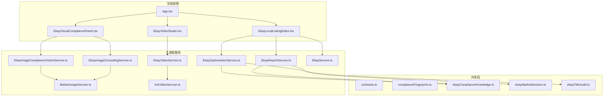
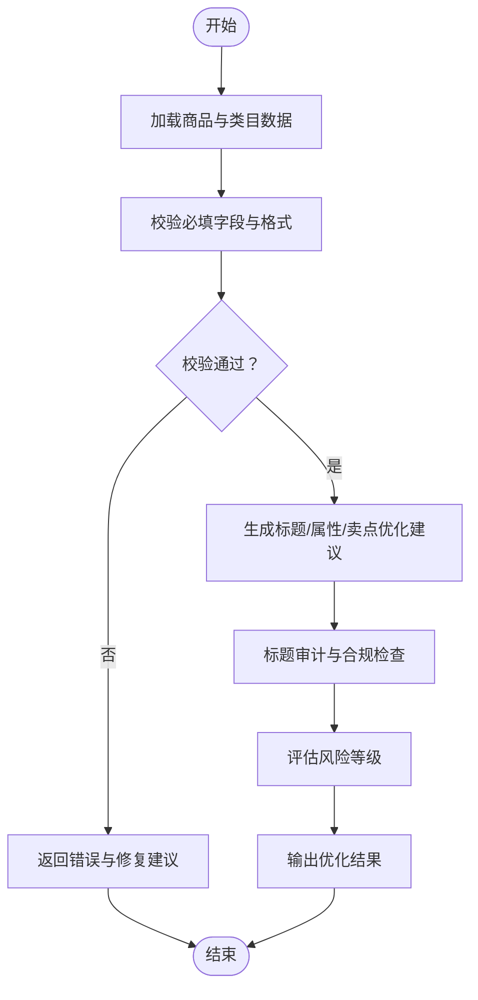
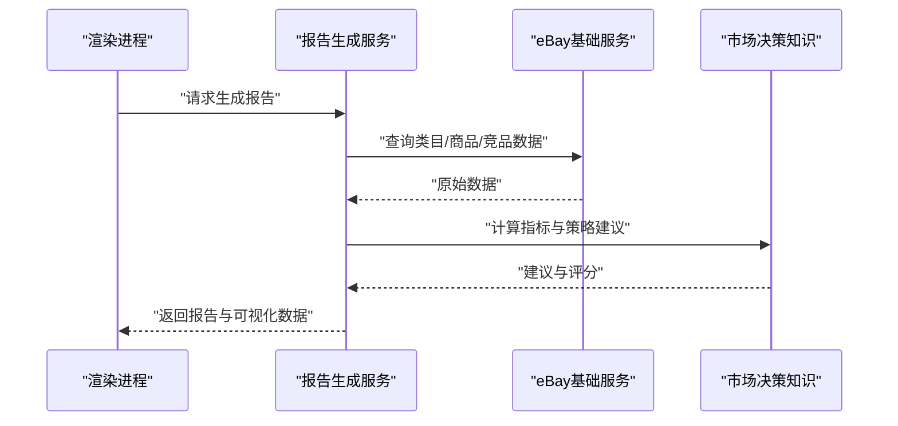
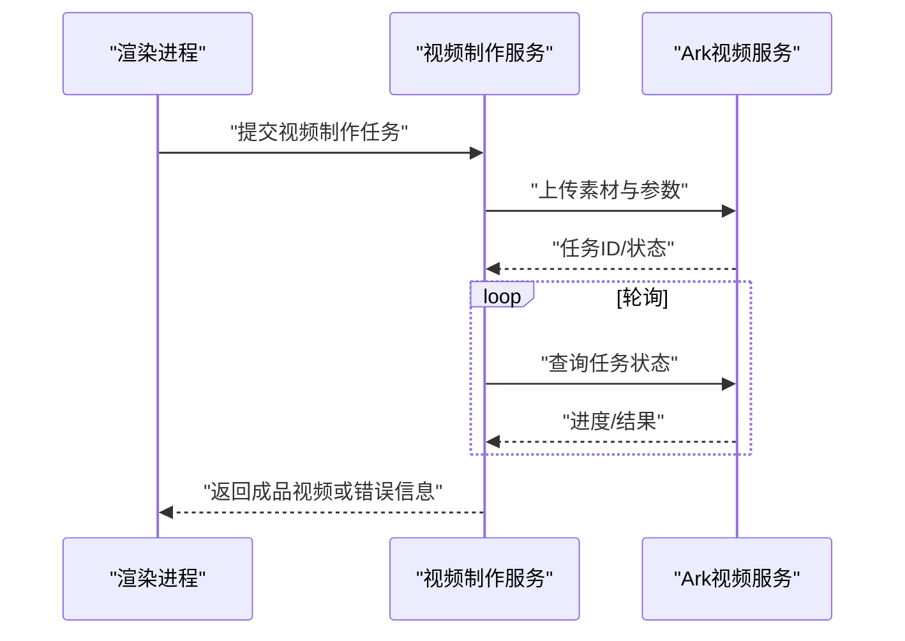
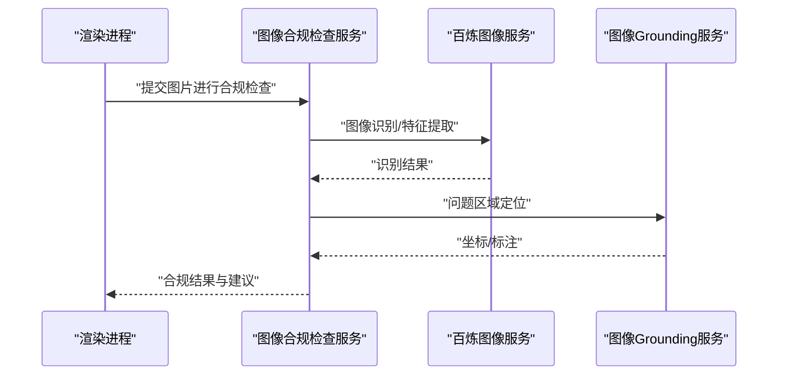
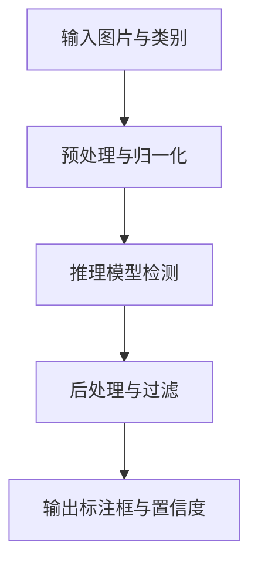
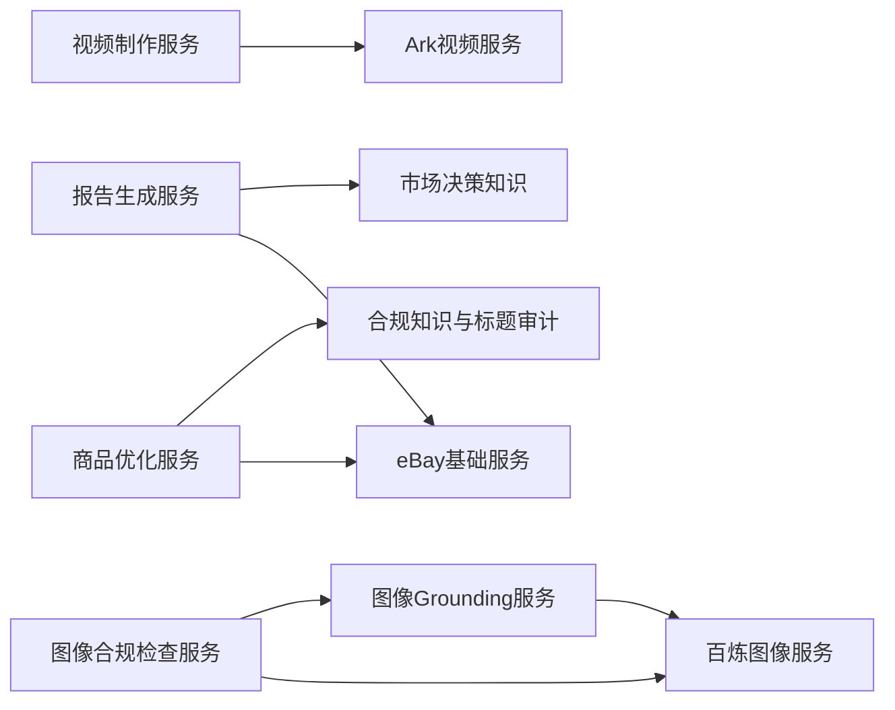

# Ebay功能模块

<cite>
**本文引用的文件**   
- [src/main/services/EbayOptimizationService.ts](file://src/main/services/EbayOptimizationService.ts)
- [src/main/services/EbayReportService.ts](file://src/main/services/EbayReportService.ts)
- [src/main/services/EbayVideoService.ts](file://src/main/services/EbayVideoService.ts)
- [src/main/services/EbayImageComplianceVisionService.ts](file://src/main/services/EbayImageComplianceVisionService.ts)
- [src/main/services/EbayImageGroundingService.ts](file://src/main/services/EbayImageGroundingService.ts)
- [src/main/services/BailianImageService.ts](file://src/main/services/BailianImageService.ts)
- [src/main/services/ArkVideoService.ts](file://src/main/services/ArkVideoService.ts)
- [src/main/services/EbayService.ts](file://src/main/services/EbayService.ts)
- [src/renderer/App.tsx](file://src/renderer/App.tsx)
- [src/renderer/EbayLocalListingEditor.tsx](file://src/renderer/EbayLocalListingEditor.tsx)
- [src/renderer/EbayVideoStudio.tsx](file://src/renderer/EbayVideoStudio.tsx)
- [src/renderer/EbayVisualCompliancePanel.tsx](file://src/renderer/EbayVisualCompliancePanel.tsx)
- [src/shared/contracts.ts](file://src/shared/contracts.ts)
- [src/shared/complianceFingerprint.ts](file://src/shared/complianceFingerprint.ts)
- [src/shared/ebayComplianceKnowledge.ts](file://src/shared/ebayComplianceKnowledge.ts)
- [src/shared/ebayMarketDecision.ts](file://src/shared/ebayMarketDecision.ts)
- [src/shared/ebayTitleAudit.ts](file://src/shared/ebayTitleAudit.ts)
</cite>

## 目录
1. [简介](#简介)
2. [项目结构](#项目结构)
3. [核心组件](#核心组件)
4. [架构总览](#架构总览)
5. [详细组件分析](#详细组件分析)
6. [依赖关系分析](#依赖关系分析)
7. [性能考量](#性能考量)
8. [故障排查指南](#故障排查指南)
9. [结论](#结论)
10. [附录](#附录)

## 简介
本文件面向Ebay相关功能模块，系统性梳理商品优化、报告生成、视频制作、图像合规检查等核心能力的实现原理与使用方法，并说明各服务如何协同完成Ebay商品的全生命周期管理。文档覆盖数据模型、业务流程、API调用序列和错误处理，并提供实际使用场景与配置示例，帮助读者快速上手与排障。

## 项目结构
本项目采用Electron架构，主进程提供后端服务（services），渲染进程提供前端界面（renderer），共享层定义契约与领域知识（shared）。Ebay相关能力集中在main/services下，并通过renderer中的页面组件进行交互。



图表来源
- [src/main/services/EbayOptimizationService.ts](file://src/main/services/EbayOptimizationService.ts)
- [src/main/services/EbayReportService.ts](file://src/main/services/EbayReportService.ts)
- [src/main/services/EbayVideoService.ts](file://src/main/services/EbayVideoService.ts)
- [src/main/services/EbayImageComplianceVisionService.ts](file://src/main/services/EbayImageComplianceVisionService.ts)
- [src/main/services/EbayImageGroundingService.ts](file://src/main/services/EbayImageGroundingService.ts)
- [src/main/services/BailianImageService.ts](file://src/main/services/BailianImageService.ts)
- [src/main/services/ArkVideoService.ts](file://src/main/services/ArkVideoService.ts)
- [src/main/services/EbayService.ts](file://src/main/services/EbayService.ts)
- [src/renderer/App.tsx](file://src/renderer/App.tsx)
- [src/renderer/EbayLocalListingEditor.tsx](file://src/renderer/EbayLocalListingEditor.tsx)
- [src/renderer/EbayVideoStudio.tsx](file://src/renderer/EbayVideoStudio.tsx)
- [src/renderer/EbayVisualCompliancePanel.tsx](file://src/renderer/EbayVisualCompliancePanel.tsx)
- [src/shared/contracts.ts](file://src/shared/contracts.ts)
- [src/shared/complianceFingerprint.ts](file://src/shared/complianceFingerprint.ts)
- [src/shared/ebayComplianceKnowledge.ts](file://src/shared/ebayComplianceKnowledge.ts)
- [src/shared/ebayMarketDecision.ts](file://src/shared/ebayMarketDecision.ts)
- [src/shared/ebayTitleAudit.ts](file://src/shared/ebayTitleAudit.ts)

章节来源
- [src/main/services/EbayOptimizationService.ts](file://src/main/services/EbayOptimizationService.ts)
- [src/main/services/EbayReportService.ts](file://src/main/services/EbayReportService.ts)
- [src/main/services/EbayVideoService.ts](file://src/main/services/EbayVideoService.ts)
- [src/main/services/EbayImageComplianceVisionService.ts](file://src/main/services/EbayImageComplianceVisionService.ts)
- [src/main/services/EbayImageGroundingService.ts](file://src/main/services/EbayImageGroundingService.ts)
- [src/main/services/BailianImageService.ts](file://src/main/services/BailianImageService.ts)
- [src/main/services/ArkVideoService.ts](file://src/main/services/ArkVideoService.ts)
- [src/main/services/EbayService.ts](file://src/main/services/EbayService.ts)
- [src/renderer/App.tsx](file://src/renderer/App.tsx)
- [src/renderer/EbayLocalListingEditor.tsx](file://src/renderer/EbayLocalListingEditor.tsx)
- [src/renderer/EbayVideoStudio.tsx](file://src/renderer/EbayVideoStudio.tsx)
- [src/renderer/EbayVisualCompliancePanel.tsx](file://src/renderer/EbayVisualCompliancePanel.tsx)
- [src/shared/contracts.ts](file://src/shared/contracts.ts)
- [src/shared/complianceFingerprint.ts](file://src/shared/complianceFingerprint.ts)
- [src/shared/ebayComplianceKnowledge.ts](file://src/shared/ebayComplianceKnowledge.ts)
- [src/shared/ebayMarketDecision.ts](file://src/shared/ebayMarketDecision.ts)
- [src/shared/ebayTitleAudit.ts](file://src/shared/ebayTitleAudit.ts)

## 核心组件
- 商品优化服务：负责标题、属性、卖点等内容的智能优化建议与校验，结合市场决策与标题审计规则。
- 报告生成服务：聚合商品与市场数据，输出可操作的分析报告与改进建议。
- 视频制作服务：编排视频素材、转码与合成，对接视频生成能力。
- 图像合规检查服务：基于视觉模型与 grounding 技术对商品图进行合规性检测与定位。
- 外部能力集成：百炼图像服务用于图像增强/识别；Ark视频服务用于视频生成/处理。
- eBay基础服务：封装与eBay平台的基础交互能力（如类目、属性、发布流程等）。

章节来源
- [src/main/services/EbayOptimizationService.ts](file://src/main/services/EbayOptimizationService.ts)
- [src/main/services/EbayReportService.ts](file://src/main/services/EbayReportService.ts)
- [src/main/services/EbayVideoService.ts](file://src/main/services/EbayVideoService.ts)
- [src/main/services/EbayImageComplianceVisionService.ts](file://src/main/services/EbayImageComplianceVisionService.ts)
- [src/main/services/EbayImageGroundingService.ts](file://src/main/services/EbayImageGroundingService.ts)
- [src/main/services/BailianImageService.ts](file://src/main/services/BailianImageService.ts)
- [src/main/services/ArkVideoService.ts](file://src/main/services/ArkVideoService.ts)
- [src/main/services/EbayService.ts](file://src/main/services/EbayService.ts)

## 架构总览
整体采用“前端页面驱动 + 主进程服务编排”的架构。渲染端通过UI触发具体任务，主进程服务协调内部逻辑与外部能力，最终将结果回写至前端或持久化存储。

```mermaid
sequenceDiagram
participant UI as "渲染进程UI"
participant Opt as "商品优化服务"
participant Rep as "报告生成服务"
participant Vid as "视频制作服务"
participant Vis as "图像合规检查服务"
participant Grd as "图像Grounding服务"
participant Bai as "百炼图像服务"
participant Ark as "Ark视频服务"
participant EB as "eBay基础服务"
UI->>Opt : "提交商品数据请求优化"
Opt->>EB : "获取类目/属性/模板"
Opt-->>UI : "返回优化建议"
UI->>Rep : "生成商品分析报告"
Rep->>EB : "拉取市场与竞品数据"
Rep-->>UI : "输出报告"
UI->>Vid : "创建视频任务"
Vid->>Ark : "调用视频生成/处理"
Vid-->>UI : "返回视频状态/链接"
UI->>Vis : "提交商品图进行合规检查"
Vis->>Bai : "图像识别/增强"
Vis->>Grd : "定位问题区域"
Vis-->>UI : "返回合规结果与建议"
```

图表来源
- [src/main/services/EbayOptimizationService.ts](file://src/main/services/EbayOptimizationService.ts)
- [src/main/services/EbayReportService.ts](file://src/main/services/EbayReportService.ts)
- [src/main/services/EbayVideoService.ts](file://src/main/services/EbayVideoService.ts)
- [src/main/services/EbayImageComplianceVisionService.ts](file://src/main/services/EbayImageComplianceVisionService.ts)
- [src/main/services/EbayImageGroundingService.ts](file://src/main/services/EbayImageGroundingService.ts)
- [src/main/services/BailianImageService.ts](file://src/main/services/BailianImageService.ts)
- [src/main/services/ArkVideoService.ts](file://src/main/services/ArkVideoService.ts)
- [src/main/services/EbayService.ts](file://src/main/services/EbayService.ts)

## 详细组件分析

### 商品优化服务（EbayOptimizationService）
- 职责：根据类目、属性、标题与卖点规则，生成优化建议与校验结果。
- 关键输入：商品基本信息、类目信息、标题草稿、属性值、图片摘要。
- 关键输出：优化后的标题/属性/卖点、合规提示、风险等级。
- 协作：调用eBay基础服务获取类目与属性模板；使用共享层的标题审计与市场决策知识。



图表来源
- [src/main/services/EbayOptimizationService.ts](file://src/main/services/EbayOptimizationService.ts)
- [src/shared/ebayTitleAudit.ts](file://src/shared/ebayTitleAudit.ts)
- [src/shared/ebayMarketDecision.ts](file://src/shared/ebayMarketDecision.ts)
- [src/main/services/EbayService.ts](file://src/main/services/EbayService.ts)

章节来源
- [src/main/services/EbayOptimizationService.ts](file://src/main/services/EbayOptimizationService.ts)
- [src/shared/ebayTitleAudit.ts](file://src/shared/ebayTitleAudit.ts)
- [src/shared/ebayMarketDecision.ts](file://src/shared/ebayMarketDecision.ts)
- [src/main/services/EbayService.ts](file://src/main/services/EbayService.ts)

### 报告生成服务（EbayReportService）
- 职责：聚合商品、类目、市场与竞品数据，生成结构化报告与改进建议。
- 关键输入：商品ID/类目、时间范围、指标维度。
- 关键输出：报告JSON/文本、可视化数据、行动项清单。
- 协作：调用eBay基础服务拉取数据；使用市场决策与合规知识形成建议。



图表来源
- [src/main/services/EbayReportService.ts](file://src/main/services/EbayReportService.ts)
- [src/main/services/EbayService.ts](file://src/main/services/EbayService.ts)
- [src/shared/ebayMarketDecision.ts](file://src/shared/ebayMarketDecision.ts)

章节来源
- [src/main/services/EbayReportService.ts](file://src/main/services/EbayReportService.ts)
- [src/main/services/EbayService.ts](file://src/main/services/EbayService.ts)
- [src/shared/ebayMarketDecision.ts](file://src/shared/ebayMarketDecision.ts)

### 视频制作服务（EbayVideoService）
- 职责：编排视频素材、转码、合成与导出，对接外部视频生成能力。
- 关键输入：商品图/视频片段、文案脚本、风格模板。
- 关键输出：视频文件/URL、进度状态、失败原因。
- 协作：调用Ark视频服务执行生成与处理。



图表来源
- [src/main/services/EbayVideoService.ts](file://src/main/services/EbayVideoService.ts)
- [src/main/services/ArkVideoService.ts](file://src/main/services/ArkVideoService.ts)

章节来源
- [src/main/services/EbayVideoService.ts](file://src/main/services/EbayVideoService.ts)
- [src/main/services/ArkVideoService.ts](file://src/main/services/ArkVideoService.ts)

### 图像合规检查服务（EbayImageComplianceVisionService）
- 职责：对商品图进行合规性检测，识别违规元素、尺寸/比例问题、水印/版权风险等。
- 关键输入：图片URL/二进制、类目要求、平台规范。
- 关键输出：合规判定、问题定位、修复建议。
- 协作：调用百炼图像服务进行识别/增强；调用Grounding服务定位问题区域。



图表来源
- [src/main/services/EbayImageComplianceVisionService.ts](file://src/main/services/EbayImageComplianceVisionService.ts)
- [src/main/services/BailianImageService.ts](file://src/main/services/BailianImageService.ts)
- [src/main/services/EbayImageGroundingService.ts](file://src/main/services/EbayImageGroundingService.ts)

章节来源
- [src/main/services/EbayImageComplianceVisionService.ts](file://src/main/services/EbayImageComplianceVisionService.ts)
- [src/main/services/BailianImageService.ts](file://src/main/services/BailianImageService.ts)
- [src/main/services/EbayImageGroundingService.ts](file://src/main/services/EbayImageGroundingService.ts)

### 图像Grounding服务（EbayImageGroundingService）
- 职责：在图像中定位具体问题区域，输出坐标与类别，辅助修复。
- 关键输入：图片、检测类别、阈值。
- 关键输出：标注框、置信度、类别分布。
- 协作：依赖百炼图像服务提供的特征/检测结果。



图表来源
- [src/main/services/EbayImageGroundingService.ts](file://src/main/services/EbayImageGroundingService.ts)
- [src/main/services/BailianImageService.ts](file://src/main/services/BailianImageService.ts)

章节来源
- [src/main/services/EbayImageGroundingService.ts](file://src/main/services/EbayImageGroundingService.ts)
- [src/main/services/BailianImageService.ts](file://src/main/services/BailianImageService.ts)

### 外部能力集成（BailianImageService、ArkVideoService）
- 百炼图像服务：提供图像识别、增强、特征提取等能力，支撑合规检查与Grounding。
- Ark视频服务：提供视频生成、剪辑、转码等能力，支撑视频制作流水线。

章节来源
- [src/main/services/BailianImageService.ts](file://src/main/services/BailianImageService.ts)
- [src/main/services/ArkVideoService.ts](file://src/main/services/ArkVideoService.ts)

### 前端页面与交互
- 本地刊登编辑器：编辑商品标题、属性、价格等，触发优化与校验。
- 视频工作室：编排视频素材与脚本，发起视频制作任务。
- 视觉合规面板：上传图片，查看合规检查结果与问题定位。

章节来源
- [src/renderer/EbayLocalListingEditor.tsx](file://src/renderer/EbayLocalListingEditor.tsx)
- [src/renderer/EbayVideoStudio.tsx](file://src/renderer/EbayVideoStudio.tsx)
- [src/renderer/EbayVisualCompliancePanel.tsx](file://src/renderer/EbayVisualCompliancePanel.tsx)
- [src/renderer/App.tsx](file://src/renderer/App.tsx)

## 依赖关系分析
- 耦合与内聚：各服务职责清晰，内聚性强；通过共享契约与领域知识降低耦合。
- 直接依赖：优化/报告/视频/合规服务均依赖eBay基础服务；合规服务依赖百炼图像与Grounding；视频服务依赖Ark视频。
- 间接依赖：共享层为多服务提供统一的数据结构与规则。
- 外部依赖：百炼图像、Ark视频、eBay平台接口。



图表来源
- [src/main/services/EbayOptimizationService.ts](file://src/main/services/EbayOptimizationService.ts)
- [src/main/services/EbayReportService.ts](file://src/main/services/EbayReportService.ts)
- [src/main/services/EbayVideoService.ts](file://src/main/services/EbayVideoService.ts)
- [src/main/services/EbayImageComplianceVisionService.ts](file://src/main/services/EbayImageComplianceVisionService.ts)
- [src/main/services/EbayImageGroundingService.ts](file://src/main/services/EbayImageGroundingService.ts)
- [src/main/services/BailianImageService.ts](file://src/main/services/BailianImageService.ts)
- [src/main/services/ArkVideoService.ts](file://src/main/services/ArkVideoService.ts)
- [src/main/services/EbayService.ts](file://src/main/services/EbayService.ts)
- [src/shared/ebayComplianceKnowledge.ts](file://src/shared/ebayComplianceKnowledge.ts)
- [src/shared/ebayTitleAudit.ts](file://src/shared/ebayTitleAudit.ts)
- [src/shared/ebayMarketDecision.ts](file://src/shared/ebayMarketDecision.ts)

章节来源
- [src/main/services/EbayOptimizationService.ts](file://src/main/services/EbayOptimizationService.ts)
- [src/main/services/EbayReportService.ts](file://src/main/services/EbayReportService.ts)
- [src/main/services/EbayVideoService.ts](file://src/main/services/EbayVideoService.ts)
- [src/main/services/EbayImageComplianceVisionService.ts](file://src/main/services/EbayImageComplianceVisionService.ts)
- [src/main/services/EbayImageGroundingService.ts](file://src/main/services/EbayImageGroundingService.ts)
- [src/main/services/BailianImageService.ts](file://src/main/services/BailianImageService.ts)
- [src/main/services/ArkVideoService.ts](file://src/main/services/ArkVideoService.ts)
- [src/main/services/EbayService.ts](file://src/main/services/EbayService.ts)
- [src/shared/ebayComplianceKnowledge.ts](file://src/shared/ebayComplianceKnowledge.ts)
- [src/shared/ebayTitleAudit.ts](file://src/shared/ebayTitleAudit.ts)
- [src/shared/ebayMarketDecision.ts](file://src/shared/ebayMarketDecision.ts)

## 性能考量
- 异步与批处理：视频生成与图像识别应使用异步队列与批量处理，避免阻塞主线程。
- 缓存与去重：对类目模板、属性映射、图像特征进行缓存，减少重复调用。
- 流式传输：大文件（视频/图片）采用分片上传与流式处理，降低内存峰值。
- 超时与重试：对外部API设置合理超时与指数退避重试，提升稳定性。
- 资源限制：限制并发数与GPU/CPU配额，防止资源争用。

[本节为通用指导，不直接分析具体文件]

## 故障排查指南
- 常见错误类型
  - 网络超时/限流：检查外部服务可用性、重试策略与速率限制。
  - 参数校验失败：核对输入字段是否符合契约与类目要求。
  - 模型推理异常：确认输入图片质量、分辨率与格式是否满足要求。
  - 视频生成失败：检查素材完整性、脚本长度与模板兼容性。
- 定位方法
  - 日志采集：记录关键步骤的请求/响应与耗时。
  - 断点调试：在服务入口与外部调用处设置断点，观察数据流转。
  - 最小复现：构造最小输入用例，逐步排除干扰因素。
- 恢复策略
  - 降级模式：当外部服务不可用时，返回缓存或默认建议。
  - 补偿机制：对失败任务进行自动重试或人工介入。

章节来源
- [src/shared/contracts.ts](file://src/shared/contracts.ts)
- [src/shared/complianceFingerprint.ts](file://src/shared/complianceFingerprint.ts)
- [src/shared/ebayComplianceKnowledge.ts](file://src/shared/ebayComplianceKnowledge.ts)
- [src/shared/ebayMarketDecision.ts](file://src/shared/ebayMarketDecision.ts)
- [src/shared/ebayTitleAudit.ts](file://src/shared/ebayTitleAudit.ts)

## 结论
本模块以清晰的职责划分与稳定的外部集成，构建了从商品优化、报告生成到视频制作与图像合规检查的完整链路。通过共享契约与领域知识，系统具备良好的扩展性与可维护性。建议在生产环境中完善监控、告警与容量规划，确保高可用与高性能。

[本节为总结性内容，不直接分析具体文件]

## 附录

### 数据模型概览
- 商品数据：标题、属性、类目、价格、描述、图片集合。
- 类目与属性模板：类目树、必填属性、取值范围、校验规则。
- 报告数据：指标、趋势、竞品对比、建议清单。
- 视频任务：素材列表、脚本、模板、状态、输出URL。
- 合规结果：判定、问题类别、定位坐标、修复建议。

章节来源
- [src/shared/contracts.ts](file://src/shared/contracts.ts)
- [src/shared/complianceFingerprint.ts](file://src/shared/complianceFingerprint.ts)
- [src/shared/ebayComplianceKnowledge.ts](file://src/shared/ebayComplianceKnowledge.ts)
- [src/shared/ebayMarketDecision.ts](file://src/shared/ebayMarketDecision.ts)
- [src/shared/ebayTitleAudit.ts](file://src/shared/ebayTitleAudit.ts)

### 使用场景与配置示例
- 场景一：批量优化商品标题与属性
  - 输入：商品CSV/JSON、类目映射表。
  - 配置：类目模板路径、标题长度限制、敏感词库。
  - 输出：优化后的标题与属性、风险提示。
- 场景二：生成月度销售与竞品分析报告
  - 输入：时间范围、类目筛选、指标维度。
  - 配置：数据源连接、缓存策略、导出格式。
  - 输出：PDF/Excel报告、可视化图表。
- 场景三：自动化视频制作流水线
  - 输入：商品图/短视频、文案脚本、风格模板。
  - 配置：视频时长、分辨率、字幕样式、水印开关。
  - 输出：成品视频、下载链接、审核意见。
- 场景四：商品图合规检查与修复建议
  - 输入：商品图URL/二进制、类目规范。
  - 配置：阈值、检测类别、定位精度。
  - 输出：合规报告、问题标注图、修复指引。

[本节为概念性说明，不直接分析具体文件]