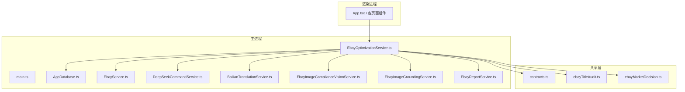
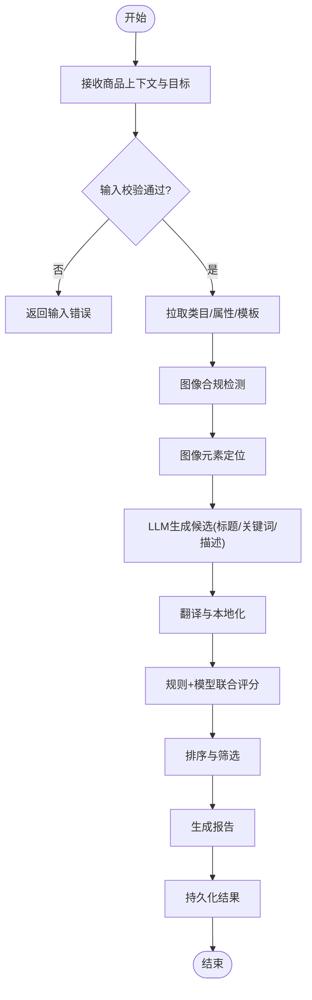
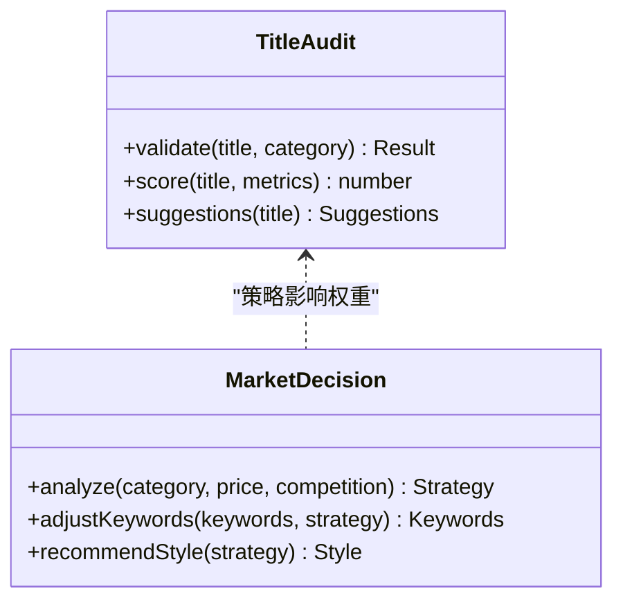
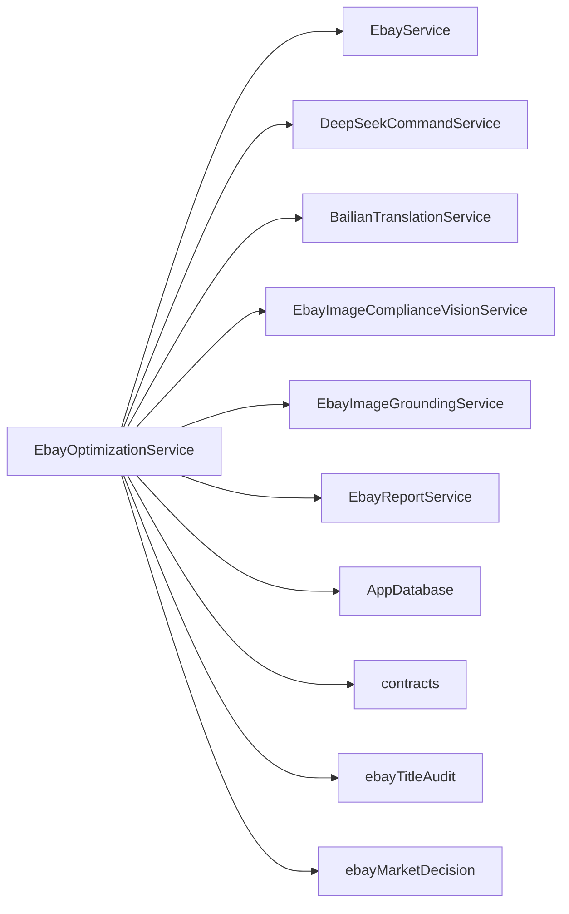

# 商品优化服务

<cite>
**本文引用的文件**   
- [EbayOptimizationService.ts](file://src/main/services/EbayOptimizationService.ts)
- [EbayService.ts](file://src/main/services/EbayService.ts)
- [DeepSeekCommandService.ts](file://src/main/services/DeepSeekCommandService.ts)
- [BailianTranslationService.ts](file://src/main/services/BailianTranslationService.ts)
- [EbayImageComplianceVisionService.ts](file://src/main/services/EbayImageComplianceVisionService.ts)
- [EbayImageGroundingService.ts](file://src/main/services/EbayImageGroundingService.ts)
- [EbayReportService.ts](file://src/main/services/EbayReportService.ts)
- [contracts.ts](file://src/shared/contracts.ts)
- [ebayTitleAudit.ts](file://src/shared/ebayTitleAudit.ts)
- [ebayMarketDecision.ts](file://src/shared/ebayMarketDecision.ts)
- [AppDatabase.ts](file://src/main/database/AppDatabase.ts)
- [package.json](file://package.json)
</cite>

## 目录
1. [简介](#简介)
2. [项目结构](#项目结构)
3. [核心组件](#核心组件)
4. [架构总览](#架构总览)
5. [详细组件分析](#详细组件分析)
6. [依赖关系分析](#依赖关系分析)
7. [性能考虑](#性能考虑)
8. [故障排查指南](#故障排查指南)
9. [结论](#结论)
10. [附录](#附录)

## 简介
本文件面向“Ebay商品优化服务”，系统性阐述标题优化、关键词提取、描述生成等核心能力的实现原理与工程落地。文档覆盖AI驱动的优化算法、SEO策略与A9搜索算法适配思路，提供配置参数说明、API调用示例、性能优化建议与错误处理机制，并给出实际案例与效果对比方法，帮助读者快速理解与高效使用。

## 项目结构
本项目采用Electron多进程架构：主进程负责服务编排与外部能力集成，渲染进程承载UI交互，共享层定义契约与领域知识。与商品优化相关的关键模块集中在 services 与 shared 目录中。



图表来源
- [main.ts](file://src/main/main.ts)
- [AppDatabase.ts](file://src/main/database/AppDatabase.ts)
- [EbayOptimizationService.ts](file://src/main/services/EbayOptimizationService.ts)
- [EbayService.ts](file://src/main/services/EbayService.ts)
- [DeepSeekCommandService.ts](file://src/main/services/DeepSeekCommandService.ts)
- [BailianTranslationService.ts](file://src/main/services/BailianTranslationService.ts)
- [EbayImageComplianceVisionService.ts](file://src/main/services/EbayImageComplianceVisionService.ts)
- [EbayImageGroundingService.ts](file://src/main/services/EbayImageGroundingService.ts)
- [EbayReportService.ts](file://src/main/services/EbayReportService.ts)
- [contracts.ts](file://src/shared/contracts.ts)
- [ebayTitleAudit.ts](file://src/shared/ebayTitleAudit.ts)
- [ebayMarketDecision.ts](file://src/shared/ebayMarketDecision.ts)

章节来源
- [package.json](file://package.json)

## 核心组件
- 商品优化服务（EbayOptimizationService）
  - 职责：编排标题优化、关键词提取、描述生成、合规校验、报告输出；协调翻译、视觉与LLM能力；持久化中间结果与指标。
  - 关键流程：输入商品上下文 → 规则与模型联合推理 → 生成候选 → 评分与排序 → 回写与上报。
- eBay服务（EbayService）
  - 职责：封装eBay平台相关操作（如类目、属性、模板、发布接口等），为优化服务提供平台数据与发布能力。
- LLM与翻译服务（DeepSeekCommandService、BailianTranslationService）
  - 职责：调用大模型进行文本生成/改写/摘要，以及跨语言翻译，支撑标题与描述的本地化与SEO增强。
- 图像合规与定位（EbayImageComplianceVisionService、EbayImageGroundingService）
  - 职责：基于视觉模型对主图/附图进行合规检测与元素定位，辅助描述生成与卖点抽取。
- 报告服务（EbayReportService）
  - 职责：汇总优化前后指标、A/B测试数据、合规检查结果，形成可审计的报告。
- 共享契约与领域知识（contracts.ts、ebayTitleAudit.ts、ebayMarketDecision.ts）
  - 职责：统一数据结构、字段约束、标题审核规则与市场决策策略，确保跨模块一致性。
- 数据库（AppDatabase.ts）
  - 职责：持久化商品元数据、优化任务、中间产物、指标与日志。

章节来源
- [EbayOptimizationService.ts](file://src/main/services/EbayOptimizationService.ts)
- [EbayService.ts](file://src/main/services/EbayService.ts)
- [DeepSeekCommandService.ts](file://src/main/services/DeepSeekCommandService.ts)
- [BailianTranslationService.ts](file://src/main/services/BailianTranslationService.ts)
- [EbayImageComplianceVisionService.ts](file://src/main/services/EbayImageComplianceVisionService.ts)
- [EbayImageGroundingService.ts](file://src/main/services/EbayImageGroundingService.ts)
- [EbayReportService.ts](file://src/main/services/EbayReportService.ts)
- [contracts.ts](file://src/shared/contracts.ts)
- [ebayTitleAudit.ts](file://src/shared/ebayTitleAudit.ts)
- [ebayMarketDecision.ts](file://src/shared/ebayMarketDecision.ts)
- [AppDatabase.ts](file://src/main/database/AppDatabase.ts)

## 架构总览
整体采用“服务编排 + 能力插件”的架构：优化服务作为中枢，按需调用翻译、视觉、LLM与平台服务，并通过共享契约保证数据一致性，最终由报告服务沉淀结果。

```mermaid
sequenceDiagram
participant UI as "渲染进程"
participant Opt as "EbayOptimizationService"
participant EB as "EbayService"
participant DS as "DeepSeekCommandService"
participant BT as "BailianTranslationService"
participant VZ as "EbayImageComplianceVisionService"
participant IG as "EbayImageGroundingService"
participant RP as "EbayReportService"
participant DB as "AppDatabase"
UI->>Opt : "提交商品上下文与优化目标"
Opt->>DB : "记录任务与初始状态"
Opt->>EB : "获取类目/属性/模板"
Opt->>VZ : "图像合规检测"
Opt->>IG : "图像元素定位"
Opt->>DS : "生成标题/关键词/描述候选"
Opt->>BT : "翻译与本地化"
Opt->>Opt : "规则+模型联合评分与排序"
Opt->>RP : "输出优化报告"
Opt->>DB : "持久化结果与指标"
Opt-->>UI : "返回优化结果与建议"
```

图表来源
- [EbayOptimizationService.ts](file://src/main/services/EbayOptimizationService.ts)
- [EbayService.ts](file://src/main/services/EbayService.ts)
- [DeepSeekCommandService.ts](file://src/main/services/DeepSeekCommandService.ts)
- [BailianTranslationService.ts](file://src/main/services/BailianTranslationService.ts)
- [EbayImageComplianceVisionService.ts](file://src/main/services/EbayImageComplianceVisionService.ts)
- [EbayImageGroundingService.ts](file://src/main/services/EbayImageGroundingService.ts)
- [EbayReportService.ts](file://src/main/services/EbayReportService.ts)
- [AppDatabase.ts](file://src/main/database/AppDatabase.ts)

## 详细组件分析

### 商品优化服务（EbayOptimizationService）
- 功能要点
  - 标题优化：结合类目规范、字符限制、关键词密度与可读性，生成多候选标题并进行排序。
  - 关键词提取：从标题、描述、属性与图像标注中提取高价值词根与长尾词，去重与聚合。
  - 描述生成：基于产品卖点、规格与合规要求，生成结构化描述与营销文案。
  - 合规校验：依据eBay政策与类目规则进行标题/图片/属性校验。
  - 报告输出：汇总优化前后指标、A/B实验与合规结果。
- 数据流
  - 输入：商品上下文（类目、属性、原始标题/描述、图片URL）、优化目标（曝光/转化/合规）。
  - 处理：规则引擎 + LLM生成 + 视觉解析 + 翻译本地化 + 评分排序。
  - 输出：候选标题/关键词/描述、评分、合规结果、优化建议与报告。
- 错误处理
  - 网络/鉴权失败重试与降级；模型超时与配额控制；输入校验失败快速失败；异常落库与告警。
- 性能优化
  - 并行调用翻译/视觉/LLM；缓存热点类目模板与词表；批处理与增量更新；结果分页与懒加载。



图表来源
- [EbayOptimizationService.ts](file://src/main/services/EbayOptimizationService.ts)
- [EbayService.ts](file://src/main/services/EbayService.ts)
- [EbayImageComplianceVisionService.ts](file://src/main/services/EbayImageComplianceVisionService.ts)
- [EbayImageGroundingService.ts](file://src/main/services/EbayImageGroundingService.ts)
- [DeepSeekCommandService.ts](file://src/main/services/DeepSeekCommandService.ts)
- [BailianTranslationService.ts](file://src/main/services/BailianTranslationService.ts)
- [EbayReportService.ts](file://src/main/services/EbayReportService.ts)
- [AppDatabase.ts](file://src/main/database/AppDatabase.ts)

章节来源
- [EbayOptimizationService.ts](file://src/main/services/EbayOptimizationService.ts)

### 标题审核与市场决策（ebayTitleAudit.ts、ebayMarketDecision.ts）
- 标题审核
  - 规则维度：长度限制、敏感词过滤、重复词惩罚、品牌/型号格式、标点与大小写规范。
  - 评分维度：关键词命中率、可读性、类目匹配度、历史点击转化率加权。
- 市场决策
  - 策略维度：价格带、竞争强度、季节性、受众偏好；动态调整关键词权重与标题风格。
- 输出
  - 标题得分、修改建议、风险标签、推荐替换词。



图表来源
- [ebayTitleAudit.ts](file://src/shared/ebayTitleAudit.ts)
- [ebayMarketDecision.ts](file://src/shared/ebayMarketDecision.ts)

章节来源
- [ebayTitleAudit.ts](file://src/shared/ebayTitleAudit.ts)
- [ebayMarketDecision.ts](file://src/shared/ebayMarketDecision.ts)

### 契约与数据结构（contracts.ts）
- 作用：统一定义商品上下文、优化任务、结果对象、指标字段与枚举值，确保跨模块一致。
- 关键点：字段命名规范、必填项、取值范围、版本兼容策略。

章节来源
- [contracts.ts](file://src/shared/contracts.ts)

### 数据库与持久化（AppDatabase.ts）
- 作用：存储商品元数据、优化任务、中间产物、指标与日志；支持查询与导出。
- 设计要点：事务与索引、软删除、审计字段、备份与恢复。

章节来源
- [AppDatabase.ts](file://src/main/database/AppDatabase.ts)

### 平台与服务集成（EbayService、DeepSeekCommandService、BailianTranslationService）
- eBay服务：类目树、属性模板、发布接口、库存与价格同步。
- DeepSeek命令服务：文本生成、改写、摘要、问答；支持提示词模板与参数调优。
- 百炼翻译服务：多语种互译、术语库、质量评估与回译校验。

章节来源
- [EbayService.ts](file://src/main/services/EbayService.ts)
- [DeepSeekCommandService.ts](file://src/main/services/DeepSeekCommandService.ts)
- [BailianTranslationService.ts](file://src/main/services/BailianTranslationService.ts)

### 图像合规与定位（EbayImageComplianceVisionService、EbayImageGroundingService）
- 合规检测：水印、Logo、文字叠加、尺寸比例、背景白底要求。
- 元素定位：主体框选、卖点区域识别、属性可视化标注，辅助描述生成。

章节来源
- [EbayImageComplianceVisionService.ts](file://src/main/services/EbayImageComplianceVisionService.ts)
- [EbayImageGroundingService.ts](file://src/main/services/EbayImageGroundingService.ts)

### 报告服务（EbayReportService）
- 内容：优化前后对比、A/B测试结果、合规通过率、关键词覆盖率、点击/转化趋势。
- 输出：PDF/CSV/看板；定时任务与订阅通知。

章节来源
- [EbayReportService.ts](file://src/main/services/EbayReportService.ts)

## 依赖关系分析
- 内聚与耦合
  - 优化服务高度内聚业务编排，对外以服务接口解耦；共享契约降低耦合。
- 外部依赖
  - LLM与翻译服务需鉴权与限流；eBay平台接口需幂等与重试；图像服务需带宽与GPU资源。
- 潜在循环依赖
  - 通过分层与契约隔离避免循环引用。



图表来源
- [EbayOptimizationService.ts](file://src/main/services/EbayOptimizationService.ts)
- [EbayService.ts](file://src/main/services/EbayService.ts)
- [DeepSeekCommandService.ts](file://src/main/services/DeepSeekCommandService.ts)
- [BailianTranslationService.ts](file://src/main/services/BailianTranslationService.ts)
- [EbayImageComplianceVisionService.ts](file://src/main/services/EbayImageComplianceVisionService.ts)
- [EbayImageGroundingService.ts](file://src/main/services/EbayImageGroundingService.ts)
- [EbayReportService.ts](file://src/main/services/EbayReportService.ts)
- [AppDatabase.ts](file://src/main/database/AppDatabase.ts)
- [contracts.ts](file://src/shared/contracts.ts)
- [ebayTitleAudit.ts](file://src/shared/ebayTitleAudit.ts)
- [ebayMarketDecision.ts](file://src/shared/ebayMarketDecision.ts)

章节来源
- [EbayOptimizationService.ts](file://src/main/services/EbayOptimizationService.ts)

## 性能考虑
- 并发与异步
  - 并行调用翻译、视觉与LLM，减少端到端延迟；设置超时与熔断。
- 缓存与复用
  - 缓存类目模板、词表、提示词与热门结果；增量更新中间产物。
- 批处理与分页
  - 批量生成与提交，降低接口调用次数；结果分页与懒加载提升UI响应。
- 资源管理
  - 控制并发度与队列长度；监控GPU/CPU与内存占用；自动扩缩容。
- 数据压缩
  - 传输与存储压缩图片与文本；选择性上传高分辨率图。

[本节为通用指导，不直接分析具体文件]

## 故障排查指南
- 常见问题
  - 鉴权失败：检查密钥有效期与权限范围；启用重试与退避。
  - 模型超时：缩短请求体、降低温度或最大token数；切换备用模型。
  - 输入非法：前置校验字段类型与长度；返回明确错误码与修复建议。
  - 合规不通过：根据违规标签修正标题/图片；保留变更记录以便追溯。
- 诊断手段
  - 查看任务日志与中间产物；导出报告与指标；回放输入与提示词。
- 恢复策略
  - 自动重试与降级；断点续传；快照回滚与人工复核通道。

章节来源
- [EbayReportService.ts](file://src/main/services/EbayReportService.ts)
- [AppDatabase.ts](file://src/main/database/AppDatabase.ts)

## 结论
本服务以“规则+模型+视觉”的多模态方案，系统化解决eBay商品标题优化、关键词提取与描述生成问题。通过清晰的架构与契约、完善的错误处理与性能优化策略，可在保证合规的前提下显著提升曝光与转化。建议持续迭代提示词与评分模型，并结合A/B测试验证效果。

[本节为总结性内容，不直接分析具体文件]

## 附录

### 配置参数说明（建议）
- 模型与翻译
  - 模型名称、温度、最大长度、超时时间、重试次数、备用模型。
- 平台与鉴权
  - eBay API密钥、域名、速率限制、回调地址。
- 图像处理
  - 分辨率阈值、白底检测阈值、水印检测阈值、GPU开关。
- 报告与持久化
  - 导出格式、保存路径、清理策略、审计开关。

[本节为通用配置建议，不直接分析具体文件]

### API调用示例（步骤）
- 初始化
  - 配置鉴权与模型参数，建立数据库连接。
- 提交优化任务
  - 传入商品上下文与优化目标，返回任务ID。
- 查询进度与结果
  - 轮询任务状态，下载优化结果与报告。
- 发布与回滚
  - 选择最优候选发布至eBay；失败时回滚并记录原因。

[本节为通用调用流程，不直接分析具体文件]

### SEO策略与A9适配思路
- 标题策略
  - 核心词前置、属性清晰、避免堆砌、符合类目规范。
- 关键词策略
  - 短尾与长尾组合、同义词扩展、负词过滤、地域与时令词。
- A9适配
  - 相关性优先、点击与转化信号、广告与自然流量协同、竞品差异化。

[本节为通用策略建议，不直接分析具体文件]

### 实际案例与效果对比（方法）
- 样本选择
  - 选取同类目、相似价格带的商品组，控制变量。
- 指标定义
  - 曝光量、点击率、转化率、客单价、退货率、合规通过率。
- 实验设计
  - A/B或A/B/n测试，周期不少于两周，统计显著性检验。
- 结果呈现
  - 前后对比图表、归因分析、改进建议与下一步计划。

[本节为方法论，不直接分析具体文件]