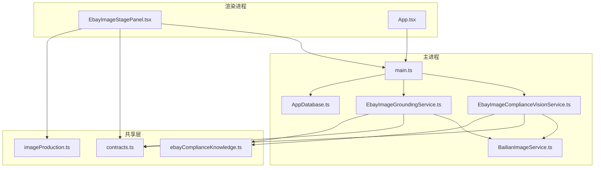
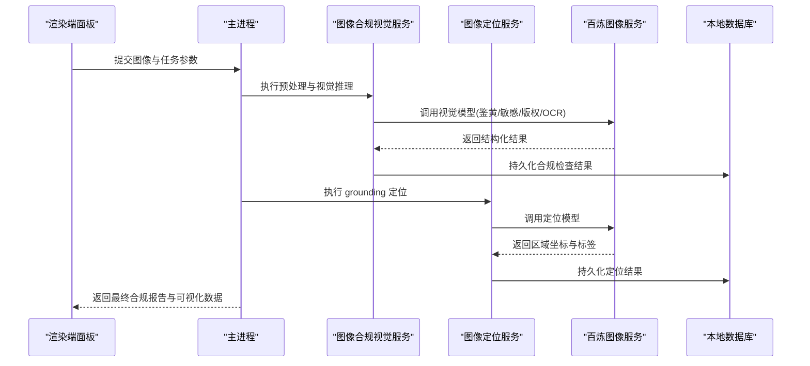
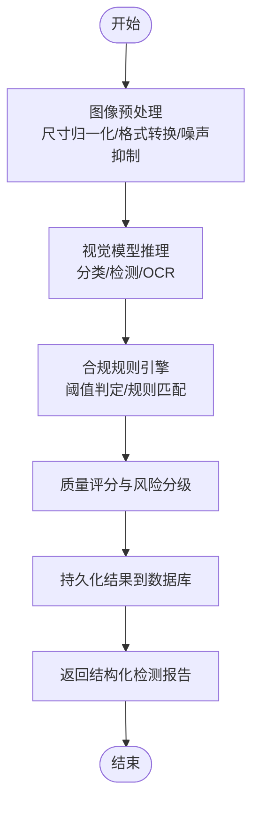
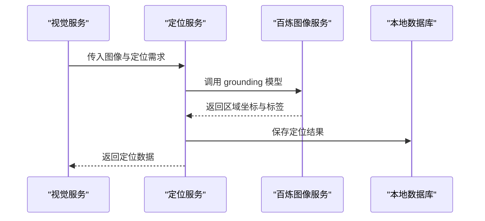
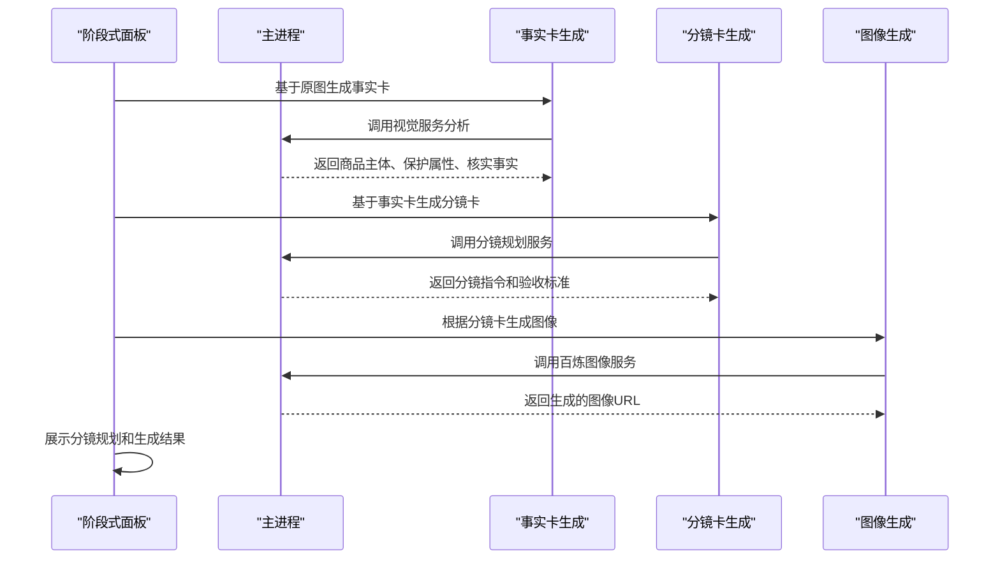
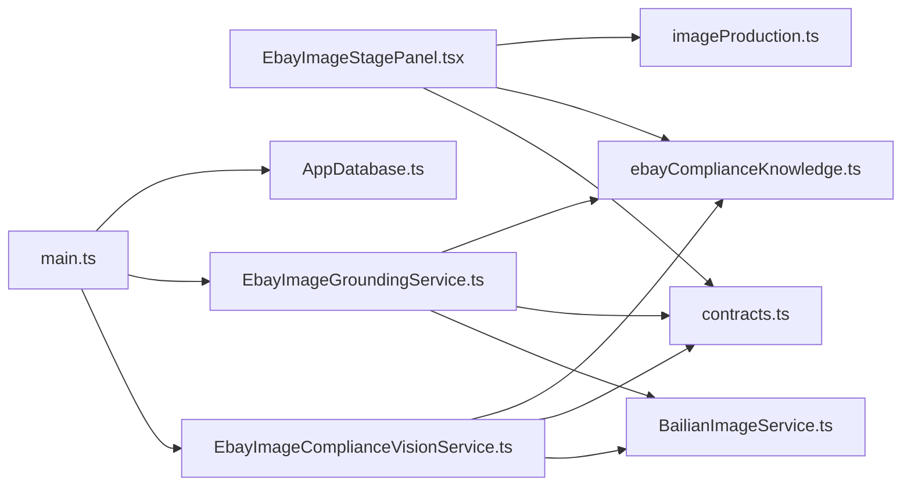

# 图像合规检查

<cite>
**本文引用的文件**   
- [EbayImageComplianceVisionService.ts](file://src/main/services/EbayImageComplianceVisionService.ts)
- [EbayImageGroundingService.ts](file://src/main/services/EbayImageGroundingService.ts)
- [BailianImageService.ts](file://src/main/services/BailianImageService.ts)
- [EbayImageStagePanel.tsx](file://src/renderer/EbayImageStagePanel.tsx)
- [imageProduction.ts](file://src/shared/imageProduction.ts)
- [App.tsx](file://src/renderer/App.tsx)
- [contracts.ts](file://src/shared/contracts.ts)
- [ebayComplianceKnowledge.ts](file://src/shared/ebayComplianceKnowledge.ts)
- [AppDatabase.ts](file://src/main/database/AppDatabase.ts)
- [main.ts](file://src/main/main.ts)
</cite>

## 更新摘要
**变更内容**   
- 简化了图像生成工作流，移除了复杂的 localStorage 状态管理
- 引入了新的分镜规划系统（Shot Planning System）
- 增强了与内容优化结果的集成，实现更精准的图像生成
- 更新了阶段式图片处理流程，支持事实卡驱动的分镜生成

## 目录
1. [简介](#简介)
2. [项目结构](#项目结构)
3. [核心组件](#核心组件)
4. [架构总览](#架构总览)
5. [详细组件分析](#详细组件分析)
6. [依赖关系分析](#依赖关系分析)
7. [性能考量](#性能考量)
8. [故障排查指南](#故障排查指南)
9. [结论](#结论)
10. [附录](#附录)

## 简介
本文件为 eBay 图像合规检查服务的综合技术文档，聚焦于图像内容识别、违规检测与质量评估三大能力。文档覆盖视觉 AI 模型调用、合规规则引擎、检测结果反馈机制、图像预处理流程、批量检查能力以及结果可视化展示。同时提供合规规则配置方法、自定义检测模型集成路径与性能调优建议，帮助开发者快速理解并扩展该服务。

**更新** 本次更新重点反映了图像生成工作流的重大简化：移除了复杂的 localStorage 状态管理，引入了新的分镜规划系统，并增强了与内容优化结果的集成。

## 项目结构
本项目采用 Electron 多进程架构：
- main 进程负责服务编排、外部 API 调用与数据库持久化
- renderer 进程提供可视化面板与交互界面
- shared 模块定义跨进程契约与领域知识
- services 层封装各业务服务（图像合规、视觉推理、翻译、报告等）
- database 层管理本地数据持久化

**图表来源** 
- [main.ts](file://src/main/main.ts)
- [EbayImageStagePanel.tsx](file://src/renderer/EbayImageStagePanel.tsx)
- [App.tsx](file://src/renderer/App.tsx)
- [EbayImageComplianceVisionService.ts](file://src/main/services/EbayImageComplianceVisionService.ts)
- [EbayImageGroundingService.ts](file://src/main/services/EbayImageGroundingService.ts)
- [BailianImageService.ts](file://src/main/services/BailianImageService.ts)
- [AppDatabase.ts](file://src/main/database/AppDatabase.ts)
- [contracts.ts](file://src/shared/contracts.ts)
- [ebayComplianceKnowledge.ts](file://src/shared/ebayComplianceKnowledge.ts)
- [imageProduction.ts](file://src/shared/imageProduction.ts)

## 核心组件
- 图像合规视觉服务：负责图像预处理、视觉模型推理、违规项判定与质量评分
- 图像定位服务：基于 grounding 能力对图像中的关键区域进行标注与定位
- 百炼图像服务：统一封装对外部视觉模型的调用（鉴黄、敏感、版权、OCR 等）
- 阶段式图像面板：在渲染进程中展示分镜规划、事实卡管理与图像生成流程
- 契约与知识：定义输入输出数据结构与 eBay 合规规则集

**更新** 新增了阶段式图像面板组件，实现了简化的分镜规划系统和事实卡驱动的图像生成流程。

## 架构总览
整体流程从渲染端发起请求，主进程协调视觉服务与定位服务，调用百炼图像服务完成推理，随后将结果写入数据库并通过 IPC 返回给前端展示。

**更新** 新的架构简化了状态管理，通过分镜规划系统替代了复杂的 localStorage 状态同步机制。

**图表来源** 
- [EbayImageComplianceVisionService.ts](file://src/main/services/EbayImageComplianceVisionService.ts)
- [EbayImageGroundingService.ts](file://src/main/services/EbayImageGroundingService.ts)
- [BailianImageService.ts](file://src/main/services/BailianImageService.ts)
- [AppDatabase.ts](file://src/main/database/AppDatabase.ts)
- [EbayImageStagePanel.tsx](file://src/renderer/EbayImageStagePanel.tsx)

## 详细组件分析

### 图像合规视觉服务
职责：
- 接收图像与任务上下文，执行标准化预处理（缩放、格式转换、去噪）
- 调用视觉模型进行内容识别与违规检测（如色情、暴力、侵权、广告水印等）
- 结合合规规则引擎生成风险等级与修复建议
- 输出统一的检测结果结构，供上层聚合与展示

关键流程：

**图表来源** 
- [EbayImageComplianceVisionService.ts](file://src/main/services/EbayImageComplianceVisionService.ts)
- [contracts.ts](file://src/shared/contracts.ts)
- [ebayComplianceKnowledge.ts](file://src/shared/ebayComplianceKnowledge.ts)

### 图像定位服务（Grounding）
职责：
- 基于 grounding 模型对图像中关键元素进行区域定位与语义标注
- 支持多目标定位（人物、商品、文字、Logo、二维码等）
- 输出坐标框与类别标签，辅助后续审核与编辑

关键流程：

**图表来源** 
- [EbayImageGroundingService.ts](file://src/main/services/EbayImageGroundingService.ts)
- [BailianImageService.ts](file://src/main/services/BailianImageService.ts)
- [AppDatabase.ts](file://src/main/database/AppDatabase.ts)

### 百炼图像服务
职责：
- 统一封装外部视觉模型接口（鉴黄、敏感、版权、OCR、定位等）
- 处理网络重试、超时、错误码映射与降级策略
- 提供缓存与批处理能力，提升吞吐与稳定性

关键特性：
- 请求签名与鉴权
- 响应解析与结构化输出
- 错误分类与可观测性日志

### 阶段式图像面板（新架构）
职责：
- 实现简化的分镜规划系统，替代复杂的 localStorage 状态管理
- 支持事实卡驱动的分镜生成，确保内容与事实卡严格一致
- 提供阶段式图像处理流程（主图、产品图、痛点图、场景图、自然化处理）
- 增强与内容优化结果的集成，实现更精准的图像生成

**更新** 新的阶段式面板采用了简化的状态管理模式，通过事实卡和分镜卡驱动整个图像生成流程。

**图表来源** 
- [EbayImageStagePanel.tsx](file://src/renderer/EbayImageStagePanel.tsx)
- [EbayImageGroundingService.ts](file://src/main/services/EbayImageGroundingService.ts)
- [BailianImageService.ts](file://src/main/services/BailianImageService.ts)
- [imageProduction.ts](file://src/shared/imageProduction.ts)

### 契约与知识（共享层）
- contracts.ts：定义输入输出数据结构、任务类型、错误码与回调协议
- ebayComplianceKnowledge.ts：维护 eBay 平台合规规则集、阈值与策略
- imageProduction.ts：定义图像生产任务、风格锁定、质量控制等核心概念

作用：
- 确保主进程与渲染进程之间的数据一致性
- 集中管理合规规则，便于版本演进与灰度发布
- 提供标准化的图像生产流程和质量控制框架

**更新** 新增了图像生产相关的类型定义和工具函数，支持新的分镜规划系统。

## 依赖关系分析
组件间依赖清晰，遵循分层与单一职责原则：
- 渲染端仅依赖契约与知识，不直接访问服务实现
- 主进程作为编排者，协调视觉服务、定位服务与数据库
- 视觉服务与定位服务均依赖百炼图像服务，避免重复实现
- 数据库层独立，提供统一的读写接口

**更新** 新的架构减少了组件间的耦合，通过标准化的接口和类型定义提高了系统的可维护性。

**图表来源** 
- [EbayImageStagePanel.tsx](file://src/renderer/EbayImageStagePanel.tsx)
- [main.ts](file://src/main/main.ts)
- [EbayImageComplianceVisionService.ts](file://src/main/services/EbayImageComplianceVisionService.ts)
- [EbayImageGroundingService.ts](file://src/main/services/EbayImageGroundingService.ts)
- [BailianImageService.ts](file://src/main/services/BailianImageService.ts)
- [AppDatabase.ts](file://src/main/database/AppDatabase.ts)
- [contracts.ts](file://src/shared/contracts.ts)
- [ebayComplianceKnowledge.ts](file://src/shared/ebayComplianceKnowledge.ts)
- [imageProduction.ts](file://src/shared/imageProduction.ts)

## 性能考量
- 图像预处理优化：使用内存级图像处理库，避免频繁磁盘 IO；对大图进行分块处理
- 并发控制：限制并行推理任务数，避免 GPU/CPU 过载；引入任务队列与优先级
- 缓存策略：对相同图像的哈希结果进行缓存，减少重复推理
- 批处理：支持批量图像上传与流水线处理，提高吞吐
- 降级与熔断：当外部模型不可用时，回退到轻量规则引擎或提示用户稍后重试
- 资源监控：记录推理耗时、内存占用与错误率，便于容量规划与扩容

**更新** 新的分镜规划系统通过减少状态管理和简化工作流程，显著提升了整体性能。

## 故障排查指南
常见问题与定位步骤：
- 外部模型调用失败：检查网络连通性、鉴权配置与限流策略；查看错误码映射与重试次数
- 图像预处理异常：确认输入格式、尺寸范围与编码类型；增加边界校验与异常捕获
- 规则引擎误判：核对阈值配置与规则版本；通过可视化面板定位命中规则与置信度
- 定位结果不准确：调整 grounding 模型参数与后处理阈值；检查坐标映射与显示比例
- 数据库写入失败：检查连接池、事务与索引；必要时回滚并告警
- 分镜规划失败：检查事实卡生成逻辑和分镜卡模板；验证输入数据的完整性和准确性

**更新** 新增了分镜规划相关的故障排查指南，包括事实卡生成和分镜卡创建的问题诊断。

## 结论
eBay 图像合规检查服务通过清晰的架构设计与模块化实现，提供了完整的图像内容识别、违规检测与质量评估能力。借助视觉 AI 模型与合规规则引擎，系统能够高效稳定地处理单图与批量任务，并在渲染端提供直观的可视化反馈。

**更新** 最新的架构改进通过简化状态管理和引入分镜规划系统，进一步提升了系统的性能和可维护性。未来可扩展更多检测维度与自定义模型，持续优化性能与用户体验。

## 附录
- 合规规则配置：建议在共享知识模块中集中管理，支持热更新与灰度发布
- 自定义检测模型集成：在百炼图像服务中新增适配器，保持统一接口与错误处理
- 结果可视化增强：支持热力图、置信度条与对比视图，提升审核效率
- 性能调优清单：预处理优化、并发控制、缓存策略、批处理、降级熔断与资源监控
- 分镜规划配置：支持自定义事实卡模板和分镜卡生成规则，满足不同平台的图像要求

**更新** 新增了分镜规划系统的配置指南，包括事实卡模板定制和分镜卡生成规则的自定义方法。