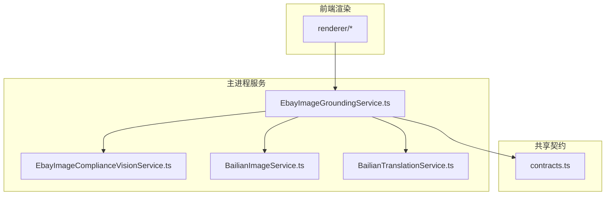
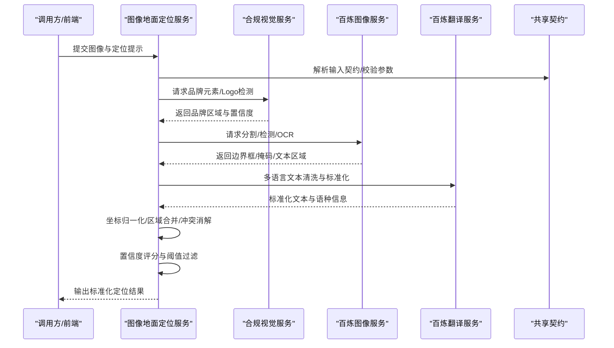
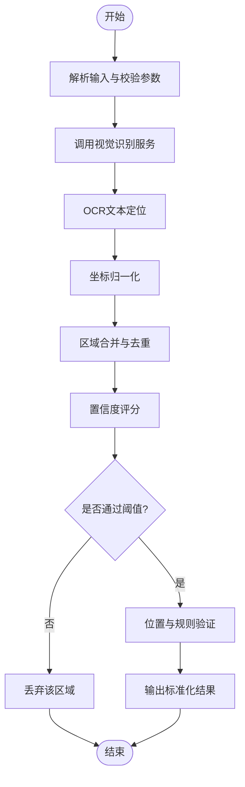
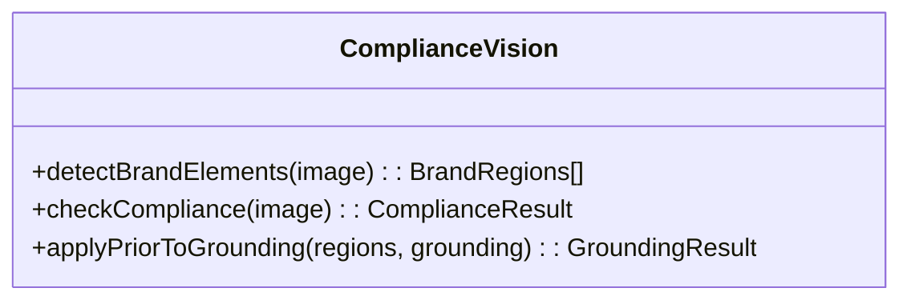
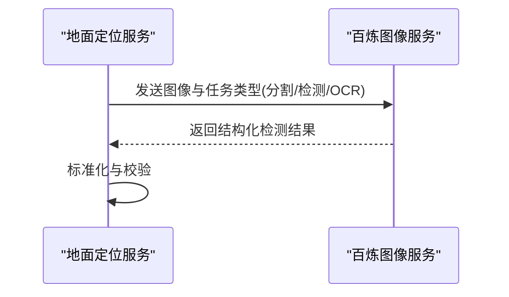
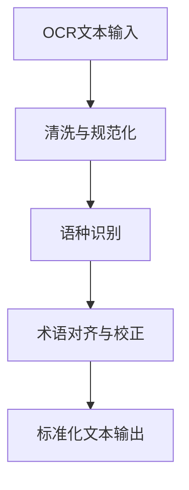
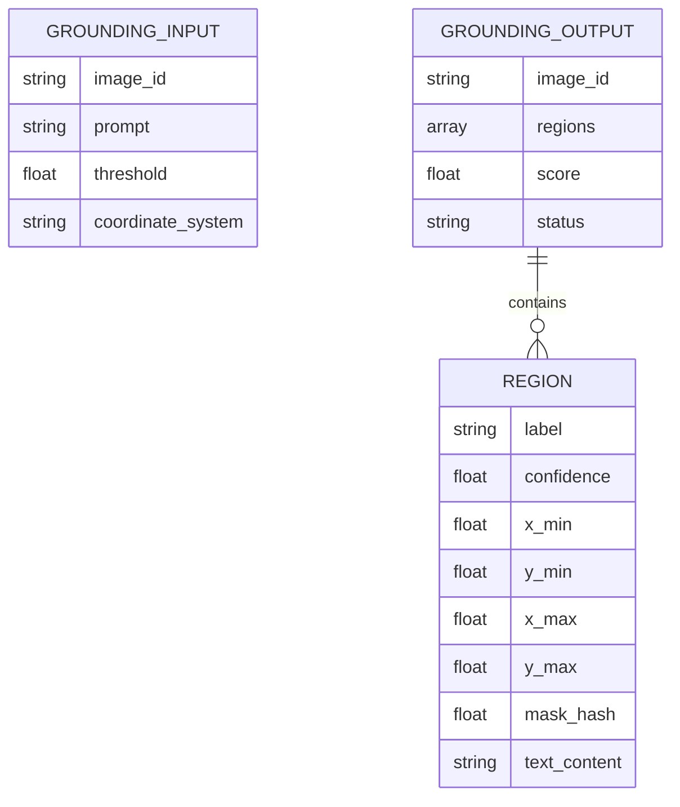
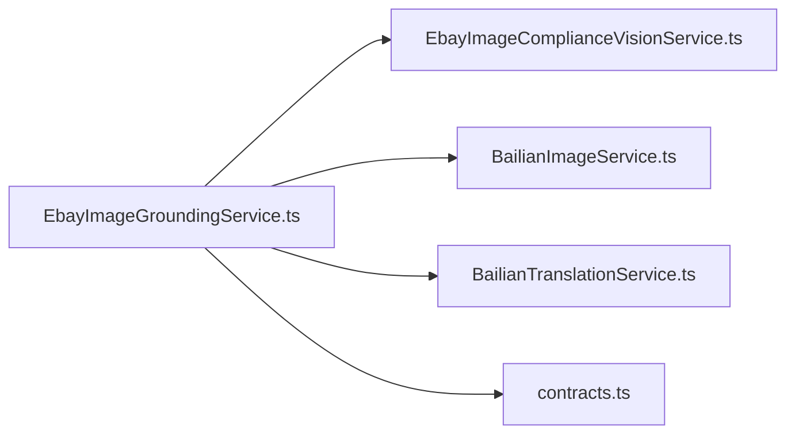

# 地面定位服务

<cite>
**本文引用的文件**   
- [EbayImageGroundingService.ts](file://src/main/services/EbayImageGroundingService.ts)
- [EbayImageComplianceVisionService.ts](file://src/main/services/EbayImageComplianceVisionService.ts)
- [BailianImageService.ts](file://src/main/services/BailianImageService.ts)
- [BailianTranslationService.ts](file://src/main/services/BailianTranslationService.ts)
- [contracts.ts](file://src/shared/contracts.ts)
- [package.json](file://package.json)
</cite>

## 目录
1. [简介](#简介)
2. [项目结构](#项目结构)
3. [核心组件](#核心组件)
4. [架构总览](#架构总览)
5. [详细组件分析](#详细组件分析)
6. [依赖关系分析](#依赖关系分析)
7. [性能考量](#性能考量)
8. [故障排查指南](#故障排查指南)
9. [结论](#结论)
10. [附录](#附录)

## 简介
本文件面向“Ebay图像地面定位服务”，系统性阐述图像空间定位、坐标映射与区域标注的实现思路，覆盖图像分割、目标检测与位置验证的核心算法要点；并说明多语言文本定位、Logo识别与品牌元素检测的具体实现方式。文档同时给出地面定位API的调用方法、坐标系统说明、精度控制参数，以及与视觉识别服务的协作模式、数据格式转换与结果整合机制。

## 项目结构
本项目采用分层组织：
- 主进程服务层（src/main/services）：封装各业务服务，包括图像地面定位、合规视觉、百炼图像与翻译服务等。
- 共享契约（src/shared）：定义跨模块的数据结构与接口契约。
- 前端渲染层（src/renderer）：UI与交互逻辑。
- 工具与脚本（tools）：辅助工具与验证脚本。

图表来源
- [EbayImageGroundingService.ts](file://src/main/services/EbayImageGroundingService.ts)
- [EbayImageComplianceVisionService.ts](file://src/main/services/EbayImageComplianceVisionService.ts)
- [BailianImageService.ts](file://src/main/services/BailianImageService.ts)
- [BailianTranslationService.ts](file://src/main/services/BailianTranslationService.ts)
- [contracts.ts](file://src/shared/contracts.ts)

章节来源
- [package.json](file://package.json)

## 核心组件
- 图像地面定位服务（EbayImageGroundingService）：负责接收原始图像与提示词，协调视觉识别服务进行分割/检测/OCR，完成坐标归一化、区域合并与置信度评估，输出标准化的定位结果。
- 合规视觉服务（EbayImageComplianceVisionService）：提供图像合规性检查、品牌元素检测、Logo识别等能力，为地面定位提供先验约束与过滤。
- 百炼图像服务（BailianImageService）：对接外部视觉模型（如分割、检测、OCR），返回结构化检测结果。
- 百炼翻译服务（BailianTranslationService）：支持多语言文本定位前的文本预处理与后处理。
- 共享契约（contracts）：统一定义输入输出数据结构、坐标规范、标签枚举与错误码。

章节来源
- [EbayImageGroundingService.ts](file://src/main/services/EbayImageGroundingService.ts)
- [EbayImageComplianceVisionService.ts](file://src/main/services/EbayImageComplianceVisionService.ts)
- [BailianImageService.ts](file://src/main/services/BailianImageService.ts)
- [BailianTranslationService.ts](file://src/main/services/BailianTranslationService.ts)
- [contracts.ts](file://src/shared/contracts.ts)

## 架构总览
地面定位服务作为编排中心，串联视觉识别与翻译能力，形成“输入图像→多模态识别→坐标映射→规则校验→结果整合”的流水线。

图表来源
- [EbayImageGroundingService.ts](file://src/main/services/EbayImageGroundingService.ts)
- [EbayImageComplianceVisionService.ts](file://src/main/services/EbayImageComplianceVisionService.ts)
- [BailianImageService.ts](file://src/main/services/BailianImageService.ts)
- [BailianTranslationService.ts](file://src/main/services/BailianTranslationService.ts)
- [contracts.ts](file://src/shared/contracts.ts)

## 详细组件分析

### 图像地面定位服务（EbayImageGroundingService）
职责与流程
- 输入解析与校验：依据共享契约校验图像、提示词、阈值与坐标系统参数。
- 多模态识别编排：并行或串行调用合规视觉服务与百炼图像服务，获取分割掩码、目标框、OCR文本区域。
- 坐标系统与映射：统一将像素坐标转换为归一化坐标（[0,1]），支持不同分辨率与裁剪场景下的稳定映射。
- 区域标注与合并：对重叠区域进行IoU计算、非极大值抑制（NMS）、语义一致性合并，生成最终标注。
- 置信度评估与过滤：基于模型分数、几何合理性、文本可读性与品牌先验进行综合打分，按阈值过滤。
- 结果整合与输出：按照契约格式输出包含类别、边界框、掩码、文本、置信度与元数据的定位结果。

关键算法要点
- 图像分割：使用外部视觉模型输出的像素级掩码，结合形态学操作与连通域分析，得到候选区域。
- 目标检测：基于边界框回归与分类得分，执行NMS去重与阈值筛选。
- OCR与文本定位：提取文本区域与内容，进行语种识别与清洗，提升多语言定位稳定性。
- 坐标映射：从像素坐标系到归一化坐标系的线性变换，考虑图像缩放、旋转与裁剪。
- 区域合并：基于IoU与语义相似度进行合并，避免重复标注。
- 位置验证：利用品牌先验、尺寸比例、边缘距离等规则进行合理性校验。

图表来源
- [EbayImageGroundingService.ts](file://src/main/services/EbayImageGroundingService.ts)
- [contracts.ts](file://src/shared/contracts.ts)

章节来源
- [EbayImageGroundingService.ts](file://src/main/services/EbayImageGroundingService.ts)
- [contracts.ts](file://src/shared/contracts.ts)

### 合规视觉服务（EbayImageComplianceVisionService）
职责与流程
- 品牌元素检测：识别Logo、商标、品牌水印等元素，输出区域与置信度。
- 合规性检查：检测违规元素（如敏感标识、禁止内容），为地面定位提供过滤条件。
- 先验约束：将品牌区域作为强先验，指导后续分割与检测结果的修正与合并。

图表来源
- [EbayImageComplianceVisionService.ts](file://src/main/services/EbayImageComplianceVisionService.ts)

章节来源
- [EbayImageComplianceVisionService.ts](file://src/main/services/EbayImageComplianceVisionService.ts)

### 百炼图像服务（BailianImageService）
职责与流程
- 分割/检测/OCR：对外部视觉模型发起请求，返回结构化结果（边界框、掩码、文本区域）。
- 结果标准化：将不同模型的输出统一为内部契约格式，便于地面定位服务整合。
- 错误处理：对超时、失败、空结果进行重试与降级策略。

图表来源
- [BailianImageService.ts](file://src/main/services/BailianImageService.ts)
- [contracts.ts](file://src/shared/contracts.ts)

章节来源
- [BailianImageService.ts](file://src/main/services/BailianImageService.ts)
- [contracts.ts](file://src/shared/contracts.ts)

### 百炼翻译服务（BailianTranslationService）
职责与流程
- 文本清洗：去除噪声字符、统一编码、规范化标点。
- 语种识别：判断文本语种，为多语言定位提供上下文。
- 后处理：将OCR结果与品牌术语库对齐，提高识别准确率。

图表来源
- [BailianTranslationService.ts](file://src/main/services/BailianTranslationService.ts)

章节来源
- [BailianTranslationService.ts](file://src/main/services/BailianTranslationService.ts)

### 共享契约（contracts）
作用
- 统一定义输入输出数据结构：图像、提示词、坐标、类别、置信度、元数据等。
- 坐标系统规范：明确像素坐标与归一化坐标的定义、取值范围与转换公式。
- 标签与枚举：定义类别、状态、错误码等，确保跨服务一致性。

图表来源
- [contracts.ts](file://src/shared/contracts.ts)

章节来源
- [contracts.ts](file://src/shared/contracts.ts)

## 依赖关系分析
- 地面定位服务依赖合规视觉服务与百炼图像服务，用于获取分割、检测与OCR结果。
- 百炼翻译服务为多语言文本定位提供支持。
- 共享契约贯穿所有服务，保证数据一致性与可维护性。

图表来源
- [EbayImageGroundingService.ts](file://src/main/services/EbayImageGroundingService.ts)
- [EbayImageComplianceVisionService.ts](file://src/main/services/EbayImageComplianceVisionService.ts)
- [BailianImageService.ts](file://src/main/services/BailianImageService.ts)
- [BailianTranslationService.ts](file://src/main/services/BailianTranslationService.ts)
- [contracts.ts](file://src/shared/contracts.ts)

章节来源
- [EbayImageGroundingService.ts](file://src/main/services/EbayImageGroundingService.ts)
- [contracts.ts](file://src/shared/contracts.ts)

## 性能考量
- 并发编排：对视觉识别与OCR任务进行合理并行，减少端到端延迟。
- 缓存策略：对重复图像或相似提示词的结果进行缓存，降低重复计算。
- 阈值调优：根据业务场景调整置信度阈值与NMS参数，平衡召回与误检。
- 资源限制：对大图像进行自适应缩放与分块处理，避免内存峰值过高。
- 降级与重试：对外部服务异常进行指数退避重试与降级回退。

## 故障排查指南
- 输入校验失败：检查图像格式、大小、提示词语法与坐标系统参数是否符合契约。
- 视觉服务异常：查看外部服务返回的错误码与日志，确认网络与鉴权配置。
- 坐标映射异常：核对图像缩放、裁剪与旋转参数，确保归一化公式正确。
- 区域合并问题：调整IoU阈值与NMS参数，检查语义一致性规则。
- 置信度过低：优化提示词、增加先验约束或调整阈值。
- 多语言文本定位不准：检查OCR质量、语种识别与术语库覆盖度。

## 结论
地面定位服务通过统一的契约与清晰的编排流程，将图像分割、目标检测、OCR与品牌先验有机结合，实现了稳定的坐标映射与区域标注。配合合理的阈值与规则校验，可在复杂电商图像中准确定位商品、文本与品牌元素，满足Ebay合规与运营需求。

## 附录

### API调用方法与参数说明
- 输入字段
  - 图像：base64或URL
  - 提示词：自然语言描述或结构化标签
  - 阈值：置信度阈值、IoU阈值、NMS阈值
  - 坐标系统：像素或归一化
- 输出字段
  - 区域列表：类别、边界框、掩码哈希、文本内容、置信度
  - 评分与状态：整体评分、处理状态、错误信息
- 调用示例路径
  - 参考地面定位服务入口函数与契约定义

章节来源
- [EbayImageGroundingService.ts](file://src/main/services/EbayImageGroundingService.ts)
- [contracts.ts](file://src/shared/contracts.ts)

### 坐标系统说明
- 像素坐标：以左上角为原点，x向右、y向下，单位为像素。
- 归一化坐标：将像素坐标除以图像宽高，取值范围[0,1]。
- 转换公式：x_norm = x_px / width；y_norm = y_px / height。
- 注意事项：裁剪与旋转需记录变换矩阵，确保逆映射正确。

章节来源
- [contracts.ts](file://src/shared/contracts.ts)

### 精度控制参数
- 置信度阈值：过滤低置信度区域，默认建议0.5–0.7。
- IoU阈值：区域合并与去重的交并比阈值，默认建议0.3–0.5。
- NMS阈值：非极大值抑制阈值，默认建议0.4–0.6。
- 最小面积：过滤过小区域，避免噪声干扰。
- 最大数量：限制输出区域数量，防止过度标注。

章节来源
- [EbayImageGroundingService.ts](file://src/main/services/EbayImageGroundingService.ts)
- [contracts.ts](file://src/shared/contracts.ts)

### 与视觉识别服务的协作模式
- 任务分发：地面定位服务将分割、检测、OCR任务分发给百炼图像服务。
- 结果整合：将多源结果统一到契约格式，进行坐标归一化与区域合并。
- 先验融合：合规视觉服务的品牌区域作为强先验，修正与增强定位结果。
- 错误处理：对外部服务异常进行重试、降级与回退策略。

章节来源
- [EbayImageGroundingService.ts](file://src/main/services/EbayImageGroundingService.ts)
- [EbayImageComplianceVisionService.ts](file://src/main/services/EbayImageComplianceVisionService.ts)
- [BailianImageService.ts](file://src/main/services/BailianImageService.ts)

### 数据格式转换与结果整合机制
- 输入转换：将原始图像与提示词转换为服务内部结构。
- 中间结果：存储分割掩码、边界框、OCR文本与置信度。
- 输出整合：合并重复区域、应用规则校验、生成标准化结果。
- 版本兼容：契约变更时保持向后兼容，提供迁移策略。

章节来源
- [contracts.ts](file://src/shared/contracts.ts)
- [EbayImageGroundingService.ts](file://src/main/services/EbayImageGroundingService.ts)