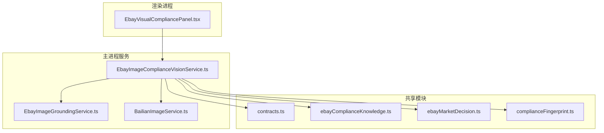
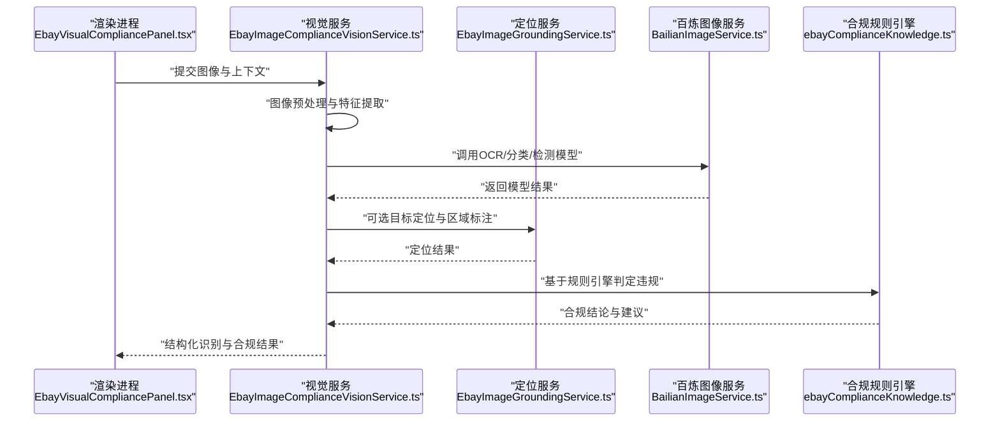
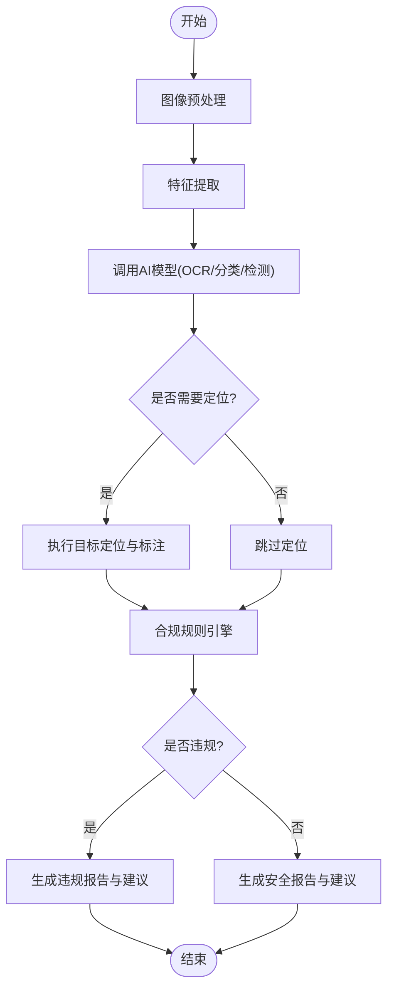
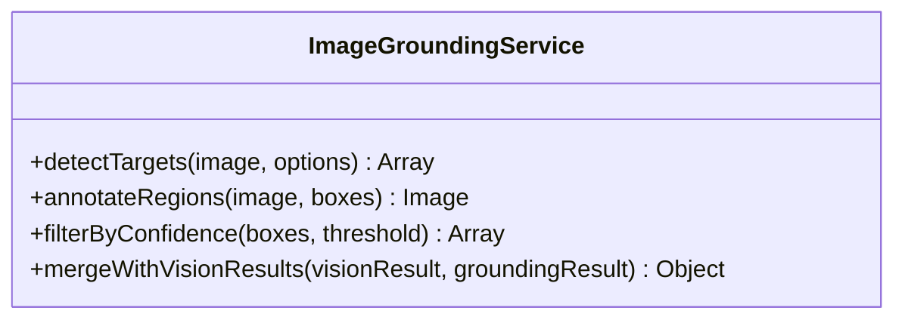
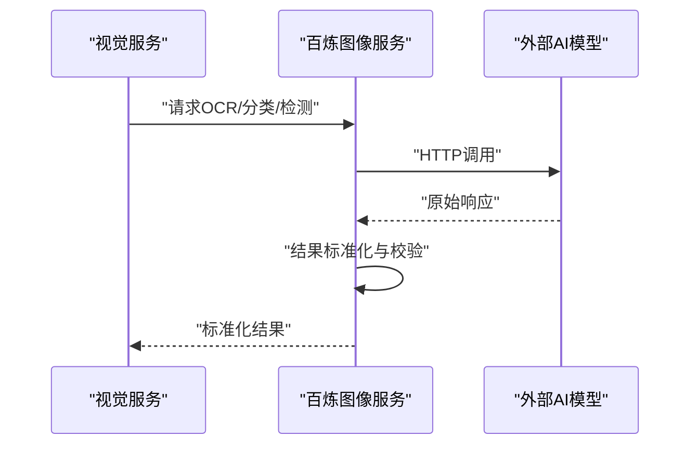
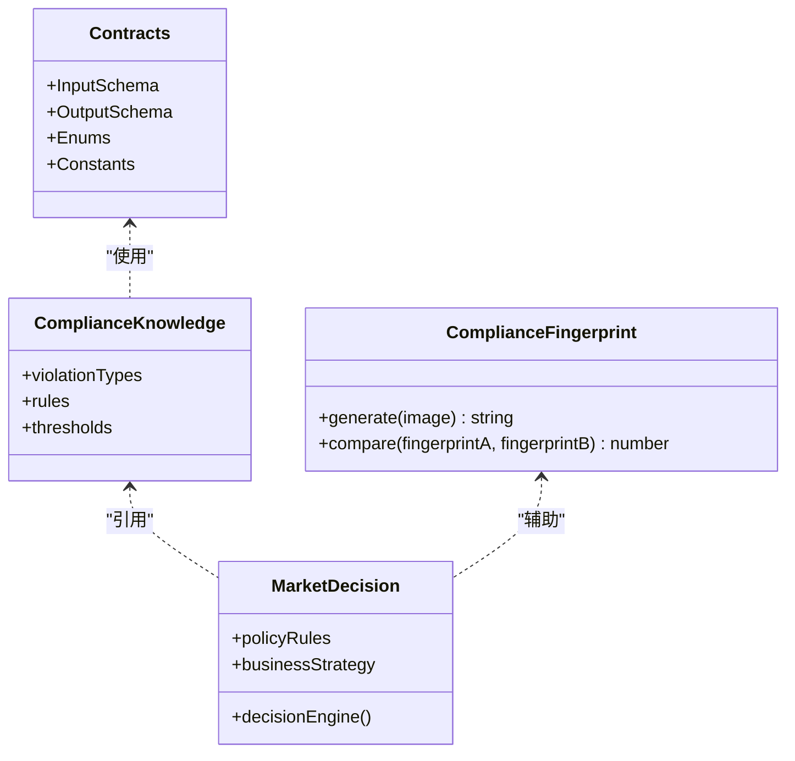
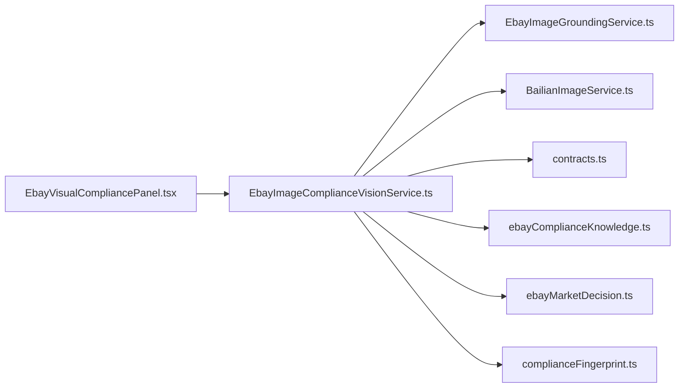

# 视觉识别服务

<cite>
**本文引用的文件**   
- [EbayImageComplianceVisionService.ts](file://src/main/services/EbayImageComplianceVisionService.ts)
- [EbayImageGroundingService.ts](file://src/main/services/EbayImageGroundingService.ts)
- [BailianImageService.ts](file://src/main/services/BailianImageService.ts)
- [EbayVisualCompliancePanel.tsx](file://src/renderer/EbayVisualCompliancePanel.tsx)
- [contracts.ts](file://src/shared/contracts.ts)
- [ebayComplianceKnowledge.ts](file://src/shared/ebayComplianceKnowledge.ts)
- [ebayMarketDecision.ts](file://src/shared/ebayMarketDecision.ts)
- [complianceFingerprint.ts](file://src/shared/complianceFingerprint.ts)
</cite>

## 目录
1. [简介](#简介)
2. [项目结构](#项目结构)
3. [核心组件](#核心组件)
4. [架构总览](#架构总览)
5. [详细组件分析](#详细组件分析)
6. [依赖关系分析](#依赖关系分析)
7. [性能与优化](#性能与优化)
8. [故障排查指南](#故障排查指南)
9. [结论](#结论)
10. [附录：API使用示例与参数说明](#附录api使用示例与参数说明)

## 简介
本文件面向Ebay图像视觉识别服务，系统性阐述图像内容识别算法、违规检测机制与合规规则引擎的实现原理。文档覆盖图像预处理流程、特征提取方法、AI模型调用接口、常见违规类型（版权侵权、违禁商品、低质量图片等）的检测实现，并提供视觉识别API的使用示例、参数配置与结果解析方法。同时给出批量图像处理策略、错误处理与性能优化建议，帮助开发者快速集成并稳定运行该服务。

## 项目结构
本项目采用前后端分离的Electron应用结构，视觉识别能力集中在主进程的服务层，渲染进程提供可视化面板进行交互。关键目录与职责如下：
- src/main/services：核心服务实现，包含图像合规视觉服务、图像定位服务、百炼图像服务等
- src/renderer：UI层，包含视觉合规面板等页面组件
- src/shared：共享契约与领域知识，包括合规指纹、市场决策、标题审计等

**图表来源** 
- [EbayVisualCompliancePanel.tsx](file://src/renderer/EbayVisualCompliancePanel.tsx)
- [EbayImageComplianceVisionService.ts](file://src/main/services/EbayImageComplianceVisionService.ts)
- [EbayImageGroundingService.ts](file://src/main/services/EbayImageGroundingService.ts)
- [BailianImageService.ts](file://src/main/services/BailianImageService.ts)
- [contracts.ts](file://src/shared/contracts.ts)
- [ebayComplianceKnowledge.ts](file://src/shared/ebayComplianceKnowledge.ts)
- [ebayMarketDecision.ts](file://src/shared/ebayMarketDecision.ts)
- [complianceFingerprint.ts](file://src/shared/complianceFingerprint.ts)

**章节来源**
- [EbayImageComplianceVisionService.ts](file://src/main/services/EbayImageComplianceVisionService.ts)
- [EbayImageGroundingService.ts](file://src/main/services/EbayImageGroundingService.ts)
- [BailianImageService.ts](file://src/main/services/BailianImageService.ts)
- [EbayVisualCompliancePanel.tsx](file://src/renderer/EbayVisualCompliancePanel.tsx)
- [contracts.ts](file://src/shared/contracts.ts)
- [ebayComplianceKnowledge.ts](file://src/shared/ebayComplianceKnowledge.ts)
- [ebayMarketDecision.ts](file://src/shared/ebayMarketDecision.ts)
- [complianceFingerprint.ts](file://src/shared/complianceFingerprint.ts)

## 核心组件
- 图像合规视觉服务：负责图像预处理、特征提取、多模型调用、违规检测与合规判定
- 图像定位服务：用于图像中目标定位与区域标注，辅助违规定位与证据留存
- 百炼图像服务：封装外部AI图像能力（如OCR、分类、检测），统一调用与重试
- 共享契约与知识：定义输入输出数据结构、合规知识库与市场决策规则

**章节来源**
- [EbayImageComplianceVisionService.ts](file://src/main/services/EbayImageComplianceVisionService.ts)
- [EbayImageGroundingService.ts](file://src/main/services/EbayImageGroundingService.ts)
- [BailianImageService.ts](file://src/main/services/BailianImageService.ts)
- [contracts.ts](file://src/shared/contracts.ts)
- [ebayComplianceKnowledge.ts](file://src/shared/ebayComplianceKnowledge.ts)
- [ebayMarketDecision.ts](file://src/shared/ebayMarketDecision.ts)

## 架构总览
整体架构遵循“预处理—特征提取—模型推理—规则引擎—结果聚合”的分层设计。渲染进程通过UI面板发起请求，主进程服务协调各子服务完成识别与合规判定，最终返回结构化结果供前端展示与后续处理。

**图表来源** 
- [EbayVisualCompliancePanel.tsx](file://src/renderer/EbayVisualCompliancePanel.tsx)
- [EbayImageComplianceVisionService.ts](file://src/main/services/EbayImageComplianceVisionService.ts)
- [EbayImageGroundingService.ts](file://src/main/services/EbayImageGroundingService.ts)
- [BailianImageService.ts](file://src/main/services/BailianImageService.ts)
- [ebayComplianceKnowledge.ts](file://src/shared/ebayComplianceKnowledge.ts)

## 详细组件分析

### 图像合规视觉服务（EbayImageComplianceVisionService）
职责与流程：
- 图像预处理：尺寸归一化、格式转换、噪声抑制、对比度增强
- 特征提取：颜色直方图、纹理特征、边缘信息、文本区域检测
- 模型调用：统一封装OCR、分类、检测等外部能力，支持重试与超时控制
- 违规检测：结合规则引擎对版权侵权、违禁商品、低质量图片等进行判定
- 结果聚合：生成结构化报告，包含风险等级、证据区域、改进建议

**图表来源** 
- [EbayImageComplianceVisionService.ts](file://src/main/services/EbayImageComplianceVisionService.ts)
- [BailianImageService.ts](file://src/main/services/BailianImageService.ts)
- [EbayImageGroundingService.ts](file://src/main/services/EbayImageGroundingService.ts)
- [ebayComplianceKnowledge.ts](file://src/shared/ebayComplianceKnowledge.ts)

**章节来源**
- [EbayImageComplianceVisionService.ts](file://src/main/services/EbayImageComplianceVisionService.ts)
- [BailianImageService.ts](file://src/main/services/BailianImageService.ts)
- [EbayImageGroundingService.ts](file://src/main/services/EbayImageGroundingService.ts)
- [ebayComplianceKnowledge.ts](file://src/shared/ebayComplianceKnowledge.ts)

### 图像定位服务（EbayImageGroundingService）
职责与流程：
- 目标检测：识别图像中的关键对象（如品牌Logo、违禁标识）
- 区域标注：输出边界框坐标与置信度，便于证据留存与人工复核
- 结果融合：与视觉服务结果对齐，提升违规定位精度

**图表来源** 
- [EbayImageGroundingService.ts](file://src/main/services/EbayImageGroundingService.ts)

**章节来源**
- [EbayImageGroundingService.ts](file://src/main/services/EbayImageGroundingService.ts)

### 百炼图像服务（BailianImageService）
职责与流程：
- 统一接口：封装OCR、分类、检测等外部模型调用
- 容错机制：支持重试、降级与超时控制
- 结果标准化：将不同模型的输出统一为内部结构，便于规则引擎消费

**图表来源** 
- [BailianImageService.ts](file://src/main/services/BailianImageService.ts)

**章节来源**
- [BailianImageService.ts](file://src/main/services/BailianImageService.ts)

### 共享契约与知识（contracts.ts、ebayComplianceKnowledge.ts、ebayMarketDecision.ts、complianceFingerprint.ts）
- contracts.ts：定义输入输出数据结构、枚举与常量，确保跨模块一致性
- ebayComplianceKnowledge.ts：维护合规知识库，包含违规类型、规则表达式与阈值
- ebayMarketDecision.ts：市场决策规则，结合平台政策与业务策略进行综合判断
- complianceFingerprint.ts：图像指纹生成与比对，用于版权侵权检测与重复图片识别

**图表来源** 
- [contracts.ts](file://src/shared/contracts.ts)
- [ebayComplianceKnowledge.ts](file://src/shared/ebayComplianceKnowledge.ts)
- [ebayMarketDecision.ts](file://src/shared/ebayMarketDecision.ts)
- [complianceFingerprint.ts](file://src/shared/complianceFingerprint.ts)

**章节来源**
- [contracts.ts](file://src/shared/contracts.ts)
- [ebayComplianceKnowledge.ts](file://src/shared/ebayComplianceKnowledge.ts)
- [ebayMarketDecision.ts](file://src/shared/ebayMarketDecision.ts)
- [complianceFingerprint.ts](file://src/shared/complianceFingerprint.ts)

## 依赖关系分析
- 视觉服务依赖定位服务与百炼图像服务，形成“识别—定位—推理”的闭环
- 共享契约与知识模块被所有服务复用，保证数据一致性与规则可维护性
- 渲染进程仅通过UI面板与服务交互，避免直接访问底层实现

**图表来源** 
- [EbayVisualCompliancePanel.tsx](file://src/renderer/EbayVisualCompliancePanel.tsx)
- [EbayImageComplianceVisionService.ts](file://src/main/services/EbayImageComplianceVisionService.ts)
- [EbayImageGroundingService.ts](file://src/main/services/EbayImageGroundingService.ts)
- [BailianImageService.ts](file://src/main/services/BailianImageService.ts)
- [contracts.ts](file://src/shared/contracts.ts)
- [ebayComplianceKnowledge.ts](file://src/shared/ebayComplianceKnowledge.ts)
- [ebayMarketDecision.ts](file://src/shared/ebayMarketDecision.ts)
- [complianceFingerprint.ts](file://src/shared/complianceFingerprint.ts)

**章节来源**
- [EbayImageComplianceVisionService.ts](file://src/main/services/EbayImageComplianceVisionService.ts)
- [EbayImageGroundingService.ts](file://src/main/services/EbayImageGroundingService.ts)
- [BailianImageService.ts](file://src/main/services/BailianImageService.ts)
- [EbayVisualCompliancePanel.tsx](file://src/renderer/EbayVisualCompliancePanel.tsx)
- [contracts.ts](file://src/shared/contracts.ts)
- [ebayComplianceKnowledge.ts](file://src/shared/ebayComplianceKnowledge.ts)
- [ebayMarketDecision.ts](file://src/shared/ebayMarketDecision.ts)
- [complianceFingerprint.ts](file://src/shared/complianceFingerprint.ts)

## 性能与优化
- 预处理优化：采用轻量级滤波与自适应阈值，减少计算开销
- 特征提取：优先使用频域与空间域混合特征，平衡精度与速度
- 模型调用：启用连接池与并发限制，避免外部服务过载
- 缓存策略：对重复图像指纹与中间结果进行缓存，降低重复计算
- 批处理：支持批量图像队列与流水线处理，提升吞吐率

[本节为通用指导，不直接分析具体文件]

## 故障排查指南
- 模型调用失败：检查网络连通性、鉴权信息与限流策略，查看重试日志
- 结果异常：核对输入图像质量与预处理参数，验证规则阈值设置
- 定位偏差：调整检测阈值与后处理逻辑，增加人工复核环节
- 性能瓶颈：监控CPU/GPU占用与内存使用，优化批大小与并发数

**章节来源**
- [BailianImageService.ts](file://src/main/services/BailianImageService.ts)
- [EbayImageComplianceVisionService.ts](file://src/main/services/EbayImageComplianceVisionService.ts)

## 结论
本视觉识别服务通过模块化设计与分层架构，实现了从图像预处理到合规判定的完整链路。借助外部AI能力与内部规则引擎，能够有效识别版权侵权、违禁商品与低质量图片等常见违规类型。通过批处理、缓存与并发优化，服务具备良好的可扩展性与稳定性，适用于Ebay平台的图像合规审核场景。

[本节为总结性内容，不直接分析具体文件]

## 附录：API使用示例与参数说明
- 输入参数：图像数据（Base64或URL）、上下文信息（类目、标题、描述）、处理选项（是否定位、是否OCR）
- 输出结果：结构化报告（风险等级、违规类型、证据区域、改进建议）
- 错误码：网络错误、模型超时、解析失败、规则冲突等
- 使用示例：在渲染进程中调用视觉服务，传入图像与上下文，接收并展示合规报告

**章节来源**
- [EbayVisualCompliancePanel.tsx](file://src/renderer/EbayVisualCompliancePanel.tsx)
- [contracts.ts](file://src/shared/contracts.ts)
- [ebayComplianceKnowledge.ts](file://src/shared/ebayComplianceKnowledge.ts)
- [ebayMarketDecision.ts](file://src/shared/ebayMarketDecision.ts)