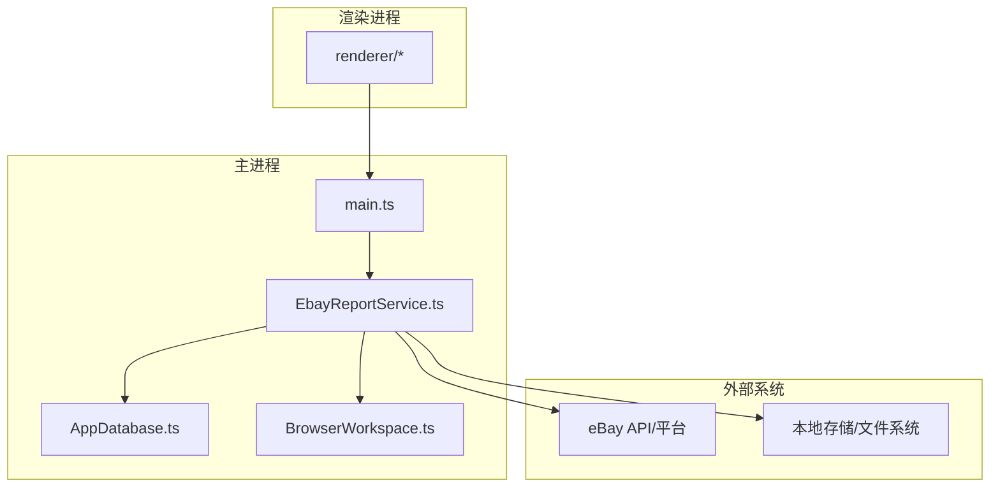
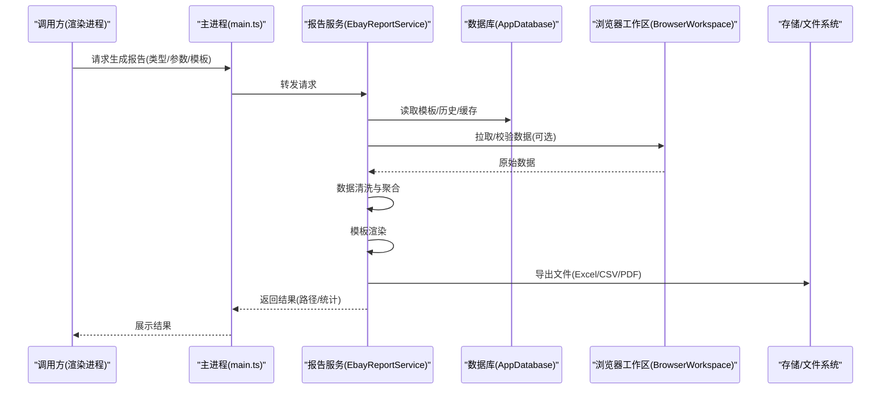
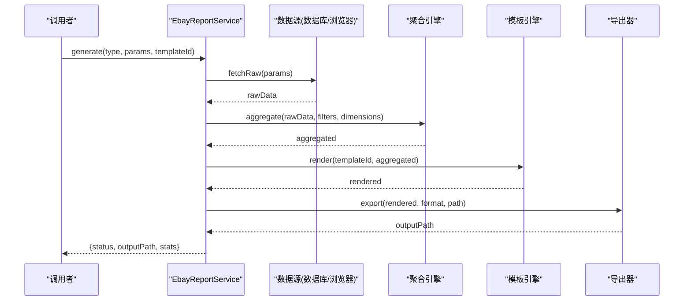
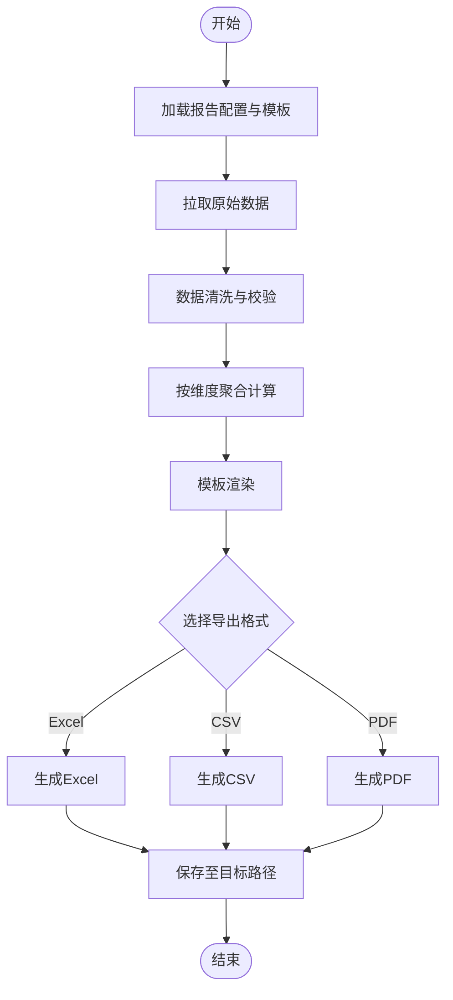
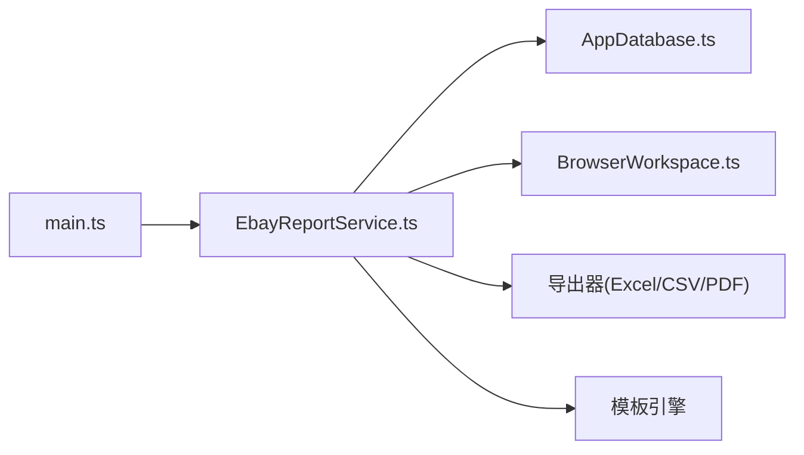

# 报告生成服务

<cite>
**本文引用的文件**   
- [EbayReportService.ts](file://src/main/services/EbayReportService.ts)
- [AppDatabase.ts](file://src/main/database/AppDatabase.ts)
- [BrowserWorkspace.ts](file://src/main/browser/BrowserWorkspace.ts)
- [main.ts](file://src/main/main.ts)
- [package.json](file://package.json)
</cite>

## 目录
1. [简介](#简介)
2. [项目结构](#项目结构)
3. [核心组件](#核心组件)
4. [架构总览](#架构总览)
5. [详细组件分析](#详细组件分析)
6. [依赖关系分析](#依赖关系分析)
7. [性能考量](#性能考量)
8. [故障排查指南](#故障排查指南)
9. [结论](#结论)
10. [附录](#附录)

## 简介
本文件为 eBay 报告生成服务的综合技术文档，覆盖销售报告、库存报告、合规报告等类型报告的生成逻辑与数据源；说明报告模板系统、数据聚合算法与导出格式支持；并提供报告定制选项、定时任务配置与批量处理能力的实践指导。同时包含报告分析工具使用指南与自定义报告开发示例，帮助开发者快速扩展与维护报告能力。

## 项目结构
本项目采用 Electron 多进程架构（主进程/渲染进程），报告生成相关代码集中在主进程 services 层，数据库访问通过独立模块封装，浏览器工作区用于与外部系统交互或采集数据。

图表来源
- [main.ts](file://src/main/main.ts)
- [EbayReportService.ts](file://src/main/services/EbayReportService.ts)
- [AppDatabase.ts](file://src/main/database/AppDatabase.ts)
- [BrowserWorkspace.ts](file://src/main/browser/BrowserWorkspace.ts)

章节来源
- [package.json](file://package.json)

## 核心组件
- 报告服务（EbayReportService）：负责报告生命周期管理、数据拉取与聚合、模板渲染与导出、定时任务调度与批量处理。
- 数据库访问（AppDatabase）：提供持久化查询与写入接口，支撑报告元数据、历史版本与缓存。
- 浏览器工作区（BrowserWorkspace）：封装与浏览器相关的操作，可用于数据采集、页面交互或辅助验证。
- 主入口（main.ts）：应用初始化、IPC 路由与进程间通信桥接。

章节来源
- [EbayReportService.ts](file://src/main/services/EbayReportService.ts)
- [AppDatabase.ts](file://src/main/database/AppDatabase.ts)
- [BrowserWorkspace.ts](file://src/main/browser/BrowserWorkspace.ts)
- [main.ts](file://src/main/main.ts)

## 架构总览
报告生成服务以“数据源 -> 聚合引擎 -> 模板渲染 -> 导出器”的流水线为核心，结合定时任务与批量处理器实现自动化与规模化输出。

图表来源
- [main.ts](file://src/main/main.ts)
- [EbayReportService.ts](file://src/main/services/EbayReportService.ts)
- [AppDatabase.ts](file://src/main/database/AppDatabase.ts)
- [BrowserWorkspace.ts](file://src/main/browser/BrowserWorkspace.ts)

## 详细组件分析

### 报告服务（EbayReportService）
职责概览
- 报告类型定义与路由：销售、库存、合规等。
- 数据源接入：从数据库、浏览器工作区或外部 API 获取原始数据。
- 数据聚合：按维度（时间、类目、站点、SKU 等）进行汇总、去重、异常值处理。
- 模板系统：加载模板、填充数据、样式与分页控制。
- 导出器：支持多种格式（如 Excel、CSV、PDF）并输出到指定路径。
- 定时任务：基于配置周期执行报告生成。
- 批量处理：并发控制、失败重试、进度回调。

关键流程（时序）

图表来源
- [EbayReportService.ts](file://src/main/services/EbayReportService.ts)

关键流程（流程图）

图表来源
- [EbayReportService.ts](file://src/main/services/EbayReportService.ts)

章节来源
- [EbayReportService.ts](file://src/main/services/EbayReportService.ts)

### 数据库访问（AppDatabase）
职责概览
- 连接管理与事务封装。
- 报告元数据表：报告类型、模板ID、创建时间、状态、输出路径等。
- 数据缓存表：中间聚合结果、增量更新标记。
- 审计日志：操作记录、错误堆栈、耗时统计。

典型接口（概念性）
- 查询报告模板与历史版本
- 写入报告元数据与导出路径
- 读写聚合缓存
- 记录审计日志

章节来源
- [AppDatabase.ts](file://src/main/database/AppDatabase.ts)

### 浏览器工作区（BrowserWorkspace）
职责概览
- 启动/复用浏览器实例，执行页面交互。
- 抓取/解析页面数据，适配不同站点或反爬策略。
- 提供统一的数据提取接口供报告服务调用。

章节来源
- [BrowserWorkspace.ts](file://src/main/browser/BrowserWorkspace.ts)

### 主入口（main.ts）
职责概览
- 应用初始化与窗口/进程管理。
- IPC 路由注册，将渲染进程请求转发至报告服务。
- 全局错误捕获与日志上报。

章节来源
- [main.ts](file://src/main/main.ts)

## 依赖关系分析
- 报告服务依赖数据库模块进行持久化，依赖浏览器工作区进行数据采集。
- 主入口作为 IPC 中枢，解耦渲染进程与服务端逻辑。
- 导出器与模板引擎为可插拔组件，便于扩展新格式与新模板。

图表来源
- [main.ts](file://src/main/main.ts)
- [EbayReportService.ts](file://src/main/services/EbayReportService.ts)
- [AppDatabase.ts](file://src/main/database/AppDatabase.ts)
- [BrowserWorkspace.ts](file://src/main/browser/BrowserWorkspace.ts)

章节来源
- [package.json](file://package.json)

## 性能考量
- 数据聚合优化：优先在数据库侧完成过滤与分组，减少内存占用；对大表使用分页与索引。
- 并发控制：批量处理时限制并发度，避免 I/O 竞争与内存峰值。
- 缓存策略：对热点维度（如近 7 天销售）设置短期缓存，降低重复计算。
- 模板渲染：预编译模板、按需渲染字段，避免全量渲染。
- 导出优化：流式写入 CSV/Excel，分块生成 PDF，减少一次性内存消耗。

[本节为通用性能建议，不直接分析具体文件]

## 故障排查指南
常见问题与定位步骤
- 报告生成失败
  - 检查模板是否存在且有效，确认模板 ID 与字段映射。
  - 查看数据库中的报告元数据与审计日志，定位失败阶段。
  - 若涉及浏览器抓取，确认网络连通性与页面结构变化。
- 数据不准确
  - 核对聚合维度与过滤条件，检查去重与空值处理逻辑。
  - 对比原始数据与中间缓存，定位偏差环节。
- 导出异常
  - 检查目标路径权限与磁盘空间。
  - 确认导出格式依赖库是否安装完整。

章节来源
- [EbayReportService.ts](file://src/main/services/EbayReportService.ts)
- [AppDatabase.ts](file://src/main/database/AppDatabase.ts)

## 结论
本报告生成服务以模块化设计实现多类型报告的自动化生产，具备灵活的模板系统与可扩展的导出能力。通过数据库缓存与浏览器工作区，兼顾了数据准确性与采集灵活性。建议在后续迭代中持续完善指标口径、增强监控告警与提升批量处理能力，以满足更大规模与更高时效性的业务需求。

[本节为总结性内容，不直接分析具体文件]

## 附录

### 报告类型与数据源说明
- 销售报告
  - 数据源：订单流水、支付信息、退款记录、运费与税费明细。
  - 聚合维度：时间（日/周/月）、站点、类目、SKU、渠道。
  - 关键指标：GMV、订单数、客单价、退货率、利润率。
- 库存报告
  - 数据源：入库单、出库单、盘点差异、在途库存、安全库存阈值。
  - 聚合维度：仓库、货位、SKU、批次。
  - 关键指标：周转天数、缺货率、滞销占比、库龄分布。
- 合规报告
  - 数据源：商品资质、图片/视频审核结果、标签与描述规范、站点政策。
  - 聚合维度：站点、类目、SKU、审核阶段。
  - 关键指标：通过率、驳回原因分布、整改完成率。

[本节为概念性说明，不直接分析具体文件]

### 报告模板系统
- 模板结构：标题、页眉/页脚、表格字段、图表、分页规则、样式主题。
- 变量绑定：字段映射、格式化函数、条件显示。
- 版本管理：模板版本化、灰度发布、回滚机制。

[本节为概念性说明，不直接分析具体文件]

### 数据聚合算法
- 基础算法：分组求和、计数、平均、最大/最小、去重。
- 高级算法：同比/环比、移动平均、异常值检测、权重加权。
- 性能优化：增量聚合、物化视图、并行计算。

[本节为概念性说明，不直接分析具体文件]

### 导出格式支持
- Excel：多工作表、条件格式、数据透视、图表嵌入。
- CSV：分隔符可选、编码 UTF-8、大文件分片。
- PDF：矢量图、水印、签名、加密与权限控制。

[本节为概念性说明，不直接分析具体文件]

### 报告定制选项
- 筛选条件：时间范围、站点、类目、SKU、渠道、状态。
- 字段选择：自定义列、排序与隐藏。
- 样式主题：品牌色、字体、布局模板。
- 输出位置：本地路径、云存储、共享盘。

[本节为概念性说明，不直接分析具体文件]

### 定时任务配置
- 触发方式：cron 表达式、事件驱动、API 回调。
- 执行策略：串行/并行、失败重试、超时控制。
- 监控告警：执行时长、成功率、错误码、通知渠道。

[本节为概念性说明，不直接分析具体文件]

### 批量处理功能
- 任务队列：优先级、限流、死信队列。
- 进度反馈：分片进度、累计统计、断点续传。
- 资源隔离：进程池、内存上限、I/O 限速。

[本节为概念性说明，不直接分析具体文件]

### 报告分析工具使用指南
- 数据导入：支持 Excel/CSV 导入，自动识别字段类型。
- 可视化：折线图、柱状图、热力图、漏斗图。
- 钻取与联动：维度切换、下钻明细、跨报表联动。
- 导出与分享：截图、PDF 导出、链接分享。

[本节为概念性说明，不直接分析具体文件]

### 自定义报告开发示例
- 新增报告类型：定义类型标识、数据源映射、聚合规则与模板 ID。
- 接入数据源：实现数据拉取接口，保证字段一致性与稳定性。
- 编写模板：设计字段布局、公式与样式，进行单元测试。
- 集成导出：选择导出格式，处理分页与大数据场景。
- 上线流程：灰度发布、监控埋点、回滚预案。

[本节为概念性说明，不直接分析具体文件]