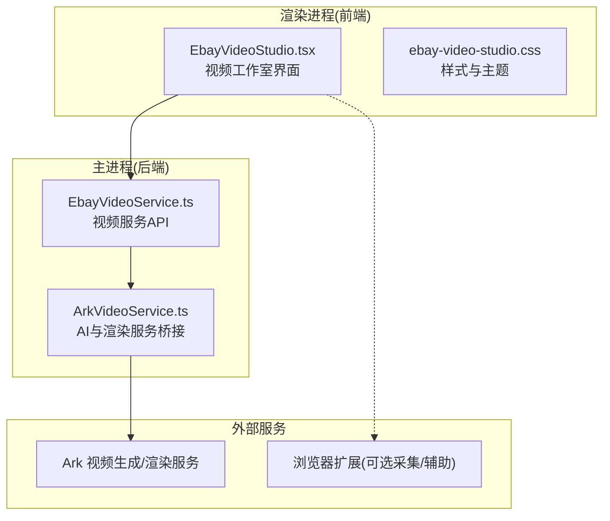
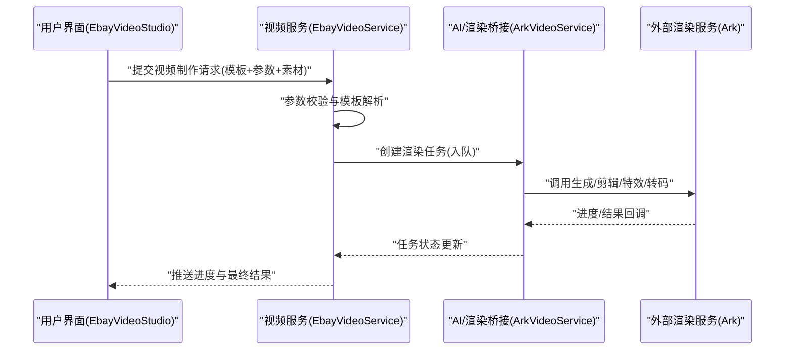
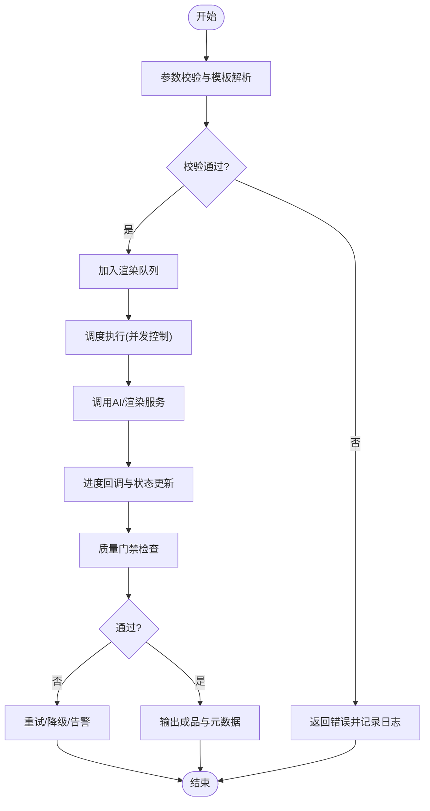
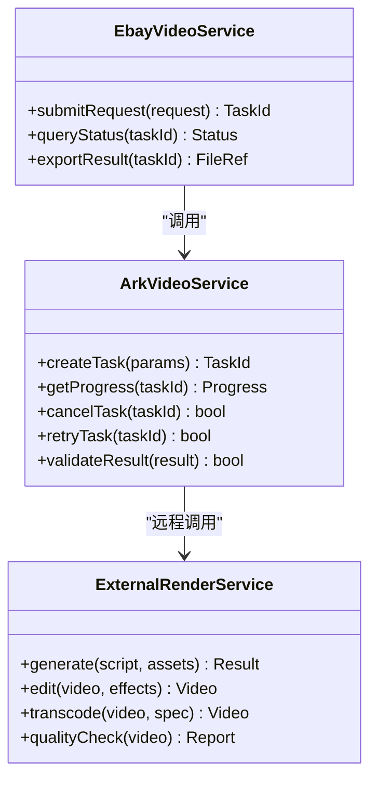
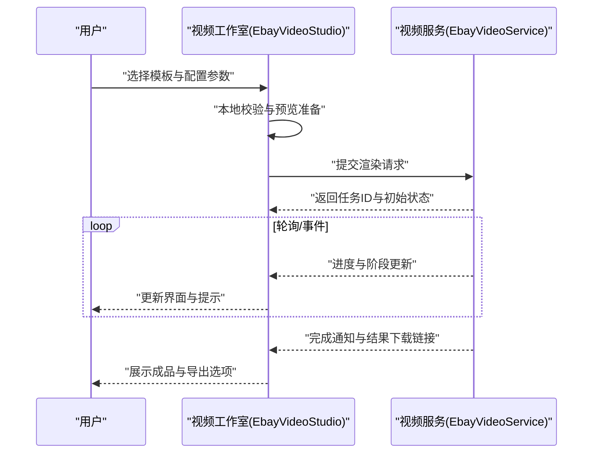

# 视频制作服务

<cite>
**本文档引用的文件**   
- [EbayVideoService.ts](file://src/main/services/EbayVideoService.ts)
- [ArkVideoService.ts](file://src/main/services/ArkVideoService.ts)
- [EbayVideoStudio.tsx](file://src/renderer/EbayVideoStudio.tsx)
- [ebay-video-studio.css](file://src/renderer/ebay-video-studio.css)
- [package.json](file://package.json)
</cite>

## 目录
1. [简介](#简介)
2. [项目结构](#项目结构)
3. [核心组件](#核心组件)
4. [架构总览](#架构总览)
5. [详细组件分析](#详细组件分析)
6. [依赖关系分析](#依赖关系分析)
7. [性能考量](#性能考量)
8. [故障排查指南](#故障排查指南)
9. [结论](#结论)
10. [附录](#附录)

## 简介
本文件面向Ebay视频制作服务的开发者与使用者，系统性阐述商品视频的自动生成、剪辑合成、特效添加、模板系统、AI智能剪辑、多平台适配与视频优化算法等能力。文档同时覆盖视频编辑接口、渲染队列管理与质量控制机制，并提供工作流配置与自定义模板开发指南，帮助读者快速理解并高效使用或扩展该服务。

## 项目结构
本项目采用前后端分离的Electron应用结构：
- 主进程服务层：负责调用外部AI/渲染服务、编排任务、管理队列与质量校验。
- 渲染进程界面：提供可视化视频工作室，支持模板选择、参数配置、预览与导出。
- 共享契约与工具：定义数据结构与合规知识，保证前后端一致。

图表来源
- [EbayVideoService.ts](file://src/main/services/EbayVideoService.ts)
- [ArkVideoService.ts](file://src/main/services/ArkVideoService.ts)
- [EbayVideoStudio.tsx](file://src/renderer/EbayVideoStudio.tsx)
- [ebay-video-studio.css](file://src/renderer/ebay-video-studio.css)

章节来源
- [package.json](file://package.json)

## 核心组件
- 视频服务API（EbayVideoService）
  - 职责：接收渲染请求、参数校验、任务入队、状态跟踪、结果回传与错误处理。
  - 关键能力：模板解析、素材预处理、AI剪辑策略选择、多平台输出规格控制、质量门禁。
- AI与渲染桥接（ArkVideoService）
  - 职责：封装对Ark服务的调用，包括生成脚本、自动剪辑、特效合成、转码与质检。
  - 关键能力：异步任务管理、重试与降级、进度回调、结果校验。
- 视频工作室UI（EbayVideoStudio）
  - 职责：模板选择、参数配置、实时预览、批量导出、日志查看。
  - 关键能力：响应式布局、多平台预览、导出格式切换、错误提示。

章节来源
- [EbayVideoService.ts](file://src/main/services/EbayVideoService.ts)
- [ArkVideoService.ts](file://src/main/services/ArkVideoService.ts)
- [EbayVideoStudio.tsx](file://src/renderer/EbayVideoStudio.tsx)

## 架构总览
整体采用“前端交互—主进程编排—外部AI/渲染”的分层架构，确保高内聚低耦合与可扩展性。

图表来源
- [EbayVideoService.ts](file://src/main/services/EbayVideoService.ts)
- [ArkVideoService.ts](file://src/main/services/ArkVideoService.ts)
- [EbayVideoStudio.tsx](file://src/renderer/EbayVideoStudio.tsx)

## 详细组件分析

### 视频服务API（EbayVideoService）
- 功能要点
  - 请求入口：统一接收渲染任务，进行参数校验与模板匹配。
  - 任务编排：将任务加入渲染队列，分配优先级，支持并发控制。
  - 状态管理：维护任务生命周期（排队、执行、完成、失败），提供查询接口。
  - 错误处理：捕获异常、记录日志、触发重试或降级策略。
  - 质量门禁：在关键节点进行输出检查（分辨率、时长、码率、字幕、水印）。
- 数据流
  - 输入：模板ID、素材列表、平台规格、特效配置、AI策略。
  - 中间态：任务ID、进度百分比、阶段状态、错误信息。
  - 输出：成品视频路径/URL、元数据、质检报告。

图表来源
- [EbayVideoService.ts](file://src/main/services/EbayVideoService.ts)

章节来源
- [EbayVideoService.ts](file://src/main/services/EbayVideoService.ts)

### AI与渲染桥接（ArkVideoService）
- 功能要点
  - 服务封装：统一对外暴露生成、剪辑、特效、转码、质检等方法。
  - 异步任务：基于任务ID追踪状态，支持进度回调与超时控制。
  - 重试与降级：网络异常时自动重试，失败时回退到备用策略或模板。
  - 结果校验：对返回的视频文件进行基础校验（存在性、大小、格式）。
- 集成点
  - 与EbayVideoService协作，接收任务并返回阶段性结果。
  - 与外部Ark服务通信，处理鉴权、限流与错误码映射。

图表来源
- [ArkVideoService.ts](file://src/main/services/ArkVideoService.ts)
- [EbayVideoService.ts](file://src/main/services/EbayVideoService.ts)

章节来源
- [ArkVideoService.ts](file://src/main/services/ArkVideoService.ts)

### 视频工作室UI（EbayVideoStudio）
- 功能要点
  - 模板选择：展示可用模板，支持按平台、风格、时长筛选。
  - 参数配置：上传素材、设置文案、选择特效、调整平台规格。
  - 实时预览：加载进度条、阶段提示、错误弹窗。
  - 批量导出：多平台一键导出，支持命名规则与目录组织。
- 交互流程
  - 用户操作 → 表单校验 → 调用视频服务API → 订阅进度 → 展示结果。

图表来源
- [EbayVideoStudio.tsx](file://src/renderer/EbayVideoStudio.tsx)
- [EbayVideoService.ts](file://src/main/services/EbayVideoService.ts)

章节来源
- [EbayVideoStudio.tsx](file://src/renderer/EbayVideoStudio.tsx)
- [ebay-video-studio.css](file://src/renderer/ebay-video-studio.css)

## 依赖关系分析
- 模块耦合
  - 视频工作室UI依赖视频服务API，不直接访问外部服务。
  - 视频服务API依赖AI/渲染桥接，屏蔽外部服务差异。
  - AI/渲染桥接依赖外部渲染服务，承担容错与重试。
- 外部依赖
  - Ark视频生成/渲染服务：提供AI剪辑、特效合成、转码与质检能力。
  - 浏览器扩展（可选）：辅助数据采集与页面增强。

图表来源
- [EbayVideoService.ts](file://src/main/services/EbayVideoService.ts)
- [ArkVideoService.ts](file://src/main/services/ArkVideoService.ts)
- [EbayVideoStudio.tsx](file://src/renderer/EbayVideoStudio.tsx)

章节来源
- [package.json](file://package.json)

## 性能考量
- 并发与队列
  - 合理设置最大并发数，避免资源争用；队列优先级保障紧急任务优先。
- 缓存与复用
  - 对常用模板与中间产物进行缓存，减少重复计算与网络开销。
- 渐进式反馈
  - 分阶段进度上报，提升用户体验；失败快速失败，缩短等待时间。
- 资源限制
  - 对大素材进行预压缩与采样，降低内存峰值；限制单次任务资源占用。

[本节为通用指导，无需引用具体文件]

## 故障排查指南
- 常见问题定位
  - 参数校验失败：检查模板ID、素材路径、平台规格是否合法。
  - 任务卡住：确认队列是否阻塞、外部服务是否超时、是否存在死锁。
  - 结果不达标：查看质量门禁报告，定位分辨率、码率、字幕等问题。
- 调试建议
  - 启用详细日志，记录任务生命周期与关键节点耗时。
  - 使用模拟外部服务进行单元测试，验证重试与降级逻辑。
  - 对UI进行端到端测试，覆盖主要用户路径与异常分支。

章节来源
- [EbayVideoService.ts](file://src/main/services/EbayVideoService.ts)
- [ArkVideoService.ts](file://src/main/services/ArkVideoService.ts)
- [EbayVideoStudio.tsx](file://src/renderer/EbayVideoStudio.tsx)

## 结论
本视频制作服务以清晰的层次化架构与完善的队列与质量机制，实现了从模板驱动到AI智能剪辑的一体化流程。通过模块化设计与外部服务解耦，既保证了稳定性，也便于持续扩展与定制。建议在生产环境完善监控与告警，持续优化并发与缓存策略，以提升吞吐与用户体验。

[本节为总结性内容，无需引用具体文件]

## 附录
- 工作流配置建议
  - 模板库：按平台与风格分类，提供默认参数与最佳实践。
  - 素材规范：统一分辨率、帧率、编码格式，减少后期转换成本。
  - 质量门禁：在生成后自动检测关键指标，不达标则拒绝发布。
- 自定义模板开发指南
  - 模板结构：包含封面、片段顺序、转场、字幕、音效、品牌元素。
  - 参数绑定：将动态字段与模板变量关联，支持条件渲染。
  - 测试验证：提供沙箱环境与样例素材，确保模板兼容性与鲁棒性。

[本节为概念性内容，无需引用具体文件]