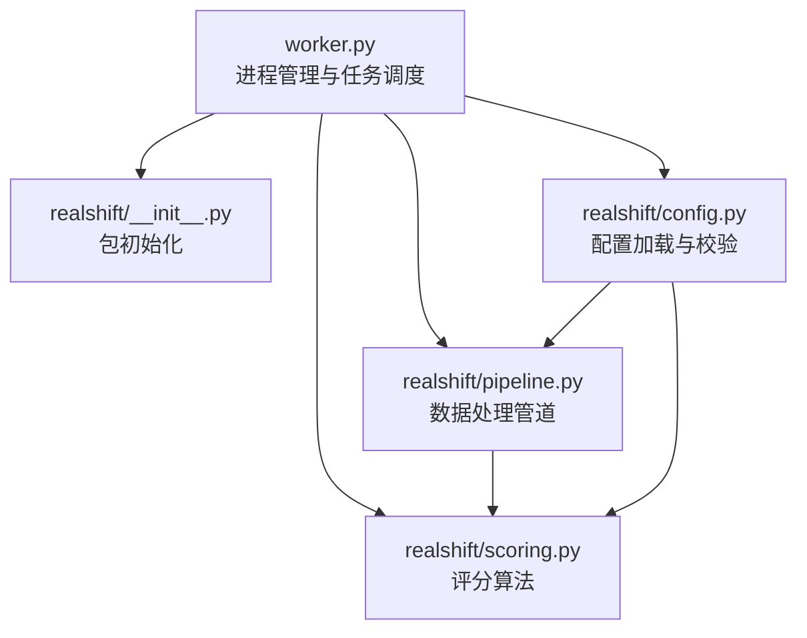
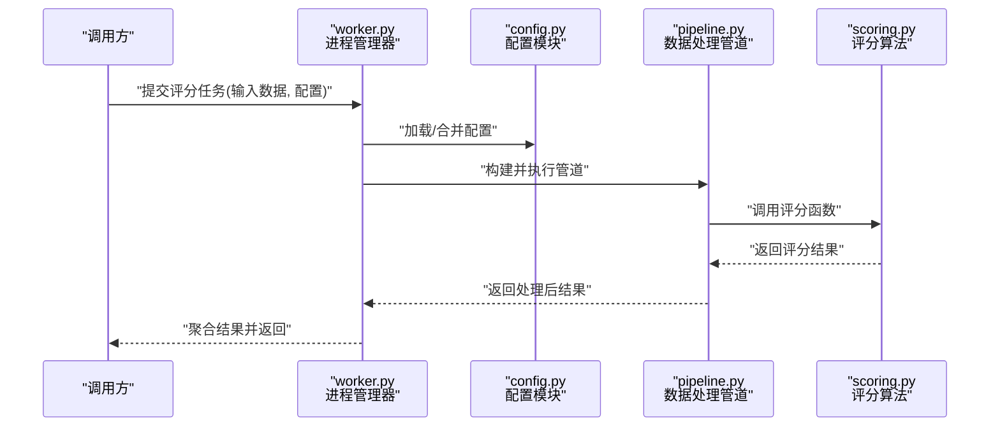
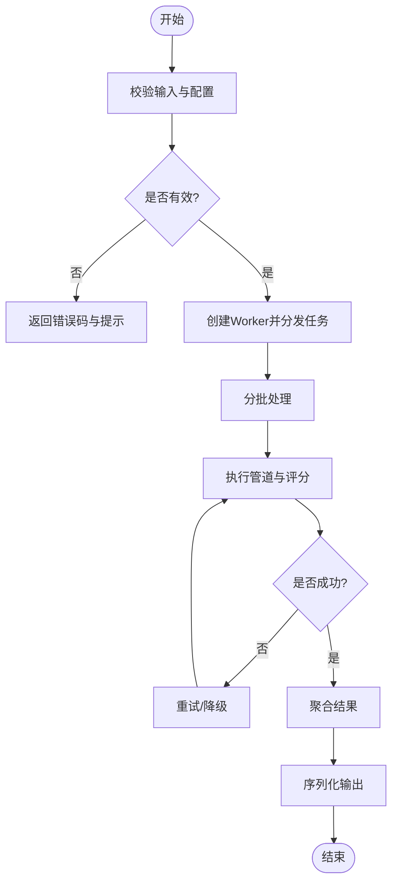
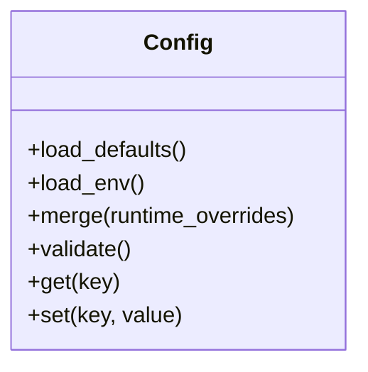
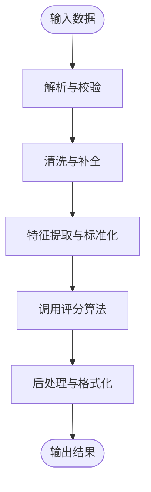
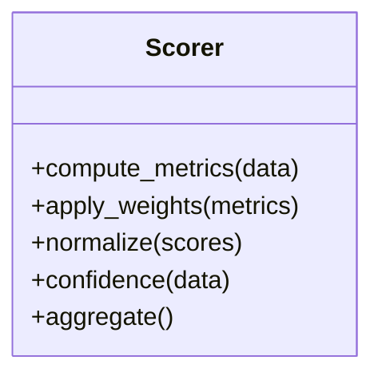
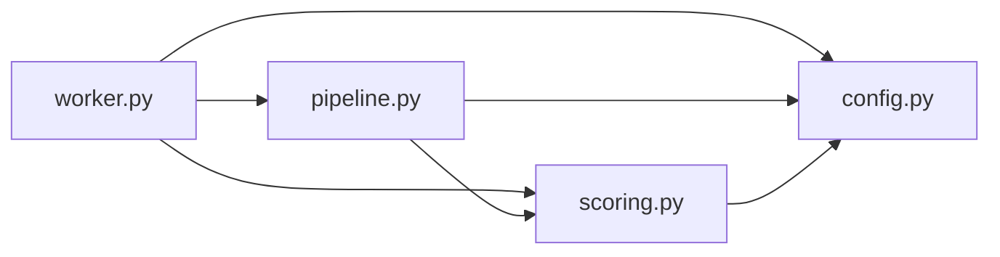

# RealShift评分系统

<cite>
**本文档引用的文件**   
- [tools/realshift/worker.py](file://tools/realshift/worker.py)
- [tools/realshift/realshift/__init__.py](file://tools/realshift/realshift/__init__.py)
- [tools/realshift/realshift/config.py](file://tools/realshift/realshift/config.py)
- [tools/realshift/realshift/pipeline.py](file://tools/realshift/realshift/pipeline.py)
- [tools/realshift/realshift/scoring.py](file://tools/realshift/realshift/scoring.py)
</cite>

## 目录
1. [简介](#简介)
2. [项目结构](#项目结构)
3. [核心组件](#核心组件)
4. [架构总览](#架构总览)
5. [详细组件分析](#详细组件分析)
6. [依赖关系分析](#依赖关系分析)
7. [性能考虑](#性能考虑)
8. [故障排除指南](#故障排除指南)
9. [结论](#结论)
10. [附录](#附录)

## 简介
本文件为RealShift评分系统的Python实现提供系统化文档，覆盖管道处理流程、评分算法实现与Worker进程管理机制。内容面向不同技术背景的读者，既包含高层架构说明，也深入到模块级实现细节、数据流转与错误处理策略，并给出配置选项、输入输出格式与使用模式建议。

## 项目结构
RealShift评分系统的Python代码位于 tools/realshift 目录下，采用“可执行入口 + 包内模块化”的组织方式：
- worker.py：进程管理与任务调度入口，负责启动工作进程、分发任务、聚合结果与异常上报。
- realshift/：核心逻辑包
  - __init__.py：包初始化与对外暴露的接口（如版本、默认配置键等）。
  - config.py：配置加载、校验与默认值管理。
  - pipeline.py：数据处理管道编排，串联输入解析、特征提取、评分计算与结果序列化。
  - scoring.py：评分算法实现，包括指标定义、权重组合与分数归一化。

**图表来源** 
- [tools/realshift/worker.py](file://tools/realshift/worker.py)
- [tools/realshift/realshift/__init__.py](file://tools/realshift/realshift/__init__.py)
- [tools/realshift/realshift/config.py](file://tools/realshift/realshift/config.py)
- [tools/realshift/realshift/pipeline.py](file://tools/realshift/realshift/pipeline.py)
- [tools/realshift/realshift/scoring.py](file://tools/realshift/realshift/scoring.py)

**章节来源**
- [tools/realshift/worker.py](file://tools/realshift/worker.py)
- [tools/realshift/realshift/__init__.py](file://tools/realshift/realshift/__init__.py)
- [tools/realshift/realshift/config.py](file://tools/realshift/realshift/config.py)
- [tools/realshift/realshift/pipeline.py](file://tools/realshift/realshift/pipeline.py)
- [tools/realshift/realshift/scoring.py](file://tools/realshift/realshift/scoring.py)

## 核心组件
- Worker进程管理器
  - 职责：接收外部任务请求，创建工作进程或线程池，按批次分发到管道处理，收集并返回结果；对超时、异常进行捕获与重试控制。
  - 关键点：进程隔离、资源限制、任务队列、监控日志。
- 配置模块
  - 职责：集中管理评分阈值、权重参数、I/O路径、并发度、缓存开关等；支持环境变量与配置文件合并。
  - 关键点：默认值、类型校验、热更新能力（可选）。
- 管道模块
  - 职责：将原始输入转换为结构化数据，依次执行清洗、特征工程、评分计算、后处理与结果序列化。
  - 关键点：阶段解耦、中间态存储、错误恢复、可插拔步骤。
- 评分模块
  - 职责：实现具体评分算法，包括指标计算、权重加权、分数归一化与置信度评估。
  - 关键点：数值稳定性、边界条件处理、可解释性输出。

**章节来源**
- [tools/realshift/worker.py](file://tools/realshift/worker.py)
- [tools/realshift/realshift/config.py](file://tools/realshift/realshift/config.py)
- [tools/realshift/realshift/pipeline.py](file://tools/realshift/realshift/pipeline.py)
- [tools/realshift/realshift/scoring.py](file://tools/realshift/realshift/scoring.py)

## 架构总览
RealShift评分系统采用“进程外Worker + 模块化管道”的架构。外部调用方通过统一接口提交待评分数据，Worker根据配置创建并行工作单元，每个单元独立运行数据处理管道与评分算法，最终汇总结果返回。

**图表来源** 
- [tools/realshift/worker.py](file://tools/realshift/worker.py)
- [tools/realshift/realshift/config.py](file://tools/realshift/realshift/config.py)
- [tools/realshift/realshift/pipeline.py](file://tools/realshift/realshift/pipeline.py)
- [tools/realshift/realshift/scoring.py](file://tools/realshift/realshift/scoring.py)

## 详细组件分析

### Worker进程管理器
- 功能要点
  - 任务接收与校验：检查输入数据结构、必填字段与基本约束。
  - 进程/线程池管理：依据配置动态调整并发度，避免资源耗尽。
  - 任务分发与批处理：将大批量输入切分为子任务，提升吞吐。
  - 结果聚合与序列化：将各子任务结果合并为统一格式，支持流式输出。
  - 异常与超时处理：捕获运行时异常，记录上下文信息，支持重试策略。
- 关键设计
  - 隔离性：每个工作单元在独立进程中执行，降低相互影响。
  - 可观测性：结构化日志、指标采集与告警钩子。
  - 可扩展性：插件式任务处理器，便于接入新的评分维度。

**图表来源** 
- [tools/realshift/worker.py](file://tools/realshift/worker.py)

**章节来源**
- [tools/realshift/worker.py](file://tools/realshift/worker.py)

### 配置模块
- 功能要点
  - 默认配置：提供合理的默认阈值、权重、I/O路径与并发参数。
  - 环境覆盖：支持通过环境变量或配置文件覆盖默认值。
  - 类型校验：确保数值范围、枚举值与必填项正确。
  - 热更新：按需重新加载配置而不重启服务（可选）。
- 关键设计
  - 分层合并：基础配置 -> 环境配置 -> 运行时覆盖。
  - 安全读取：敏感信息从安全存储获取，避免硬编码。
  - 可测试性：提供Mock配置用于单元测试。

**图表来源** 
- [tools/realshift/realshift/config.py](file://tools/realshift/realshift/config.py)

**章节来源**
- [tools/realshift/realshift/config.py](file://tools/realshift/realshift/config.py)

### 数据处理管道
- 功能要点
  - 输入解析：将原始数据转换为内部结构，处理缺失值与异常格式。
  - 特征工程：提取可用于评分的特征，标准化与缩放。
  - 评分计算：调用评分模块生成各维度分数与综合得分。
  - 后处理：分数平滑、阈值判定、置信度计算与结果格式化。
- 关键设计
  - 阶段解耦：每个处理步骤以函数或类封装，便于替换与测试。
  - 中间态存储：阶段间数据以字典或对象传递，支持断点续跑。
  - 错误恢复：单阶段失败不影响整体，支持跳过与降级策略。

**图表来源** 
- [tools/realshift/realshift/pipeline.py](file://tools/realshift/realshift/pipeline.py)
- [tools/realshift/realshift/scoring.py](file://tools/realshift/realshift/scoring.py)

**章节来源**
- [tools/realshift/realshift/pipeline.py](file://tools/realshift/realshift/pipeline.py)
- [tools/realshift/realshift/scoring.py](file://tools/realshift/realshift/scoring.py)

### 评分算法
- 功能要点
  - 指标定义：明确各项评分指标的计算公式与取值范围。
  - 权重组合：按业务需求分配权重，支持动态调整。
  - 归一化：将不同量纲的指标映射到统一区间，保证可比性。
  - 置信度：基于数据质量与模型不确定性输出置信度。
- 关键设计
  - 数值稳定：处理极端值与除零情况，保证鲁棒性。
  - 可解释性：输出贡献度分解，便于审计与调优。
  - 可测试性：提供基准数据集与期望输出用于回归测试。

**图表来源** 
- [tools/realshift/realshift/scoring.py](file://tools/realshift/realshift/scoring.py)

**章节来源**
- [tools/realshift/realshift/scoring.py](file://tools/realshift/realshift/scoring.py)

## 依赖关系分析
- 模块耦合
  - worker.py 依赖 config.py、pipeline.py、scoring.py。
  - pipeline.py 依赖 scoring.py 与 config.py。
  - scoring.py 仅依赖 config.py（权重与阈值）。
- 外部依赖
  - I/O库：用于读取输入数据与写入结果。
  - 日志与监控：结构化日志、指标上报。
  - 可选加速库：如NumPy/Pandas用于数值计算。
- 潜在循环依赖
  - 当前设计无循环导入；若新增模块需保持单向依赖。

**图表来源** 
- [tools/realshift/worker.py](file://tools/realshift/worker.py)
- [tools/realshift/realshift/config.py](file://tools/realshift/realshift/config.py)
- [tools/realshift/realshift/pipeline.py](file://tools/realshift/realshift/pipeline.py)
- [tools/realshift/realshift/scoring.py](file://tools/realshift/realshift/scoring.py)

**章节来源**
- [tools/realshift/worker.py](file://tools/realshift/worker.py)
- [tools/realshift/realshift/config.py](file://tools/realshift/realshift/config.py)
- [tools/realshift/realshift/pipeline.py](file://tools/realshift/realshift/pipeline.py)
- [tools/realshift/realshift/scoring.py](file://tools/realshift/realshift/scoring.py)

## 性能考虑
- 并发与批处理
  - 合理设置Worker并发度，避免CPU/内存瓶颈。
  - 批量处理减少I/O开销，提高吞吐。
- 内存与缓存
  - 中间数据及时释放，避免大对象驻留。
  - 启用结果缓存以减少重复计算。
- 数值计算优化
  - 向量化操作替代循环。
  - 使用高效库（如NumPy）进行矩阵运算。
- 监控与调优
  - 采集延迟、吞吐、错误率等指标。
  - 基于热点分析优化瓶颈步骤。

[本节为通用指导，不直接分析具体文件]

## 故障排除指南
- 常见问题
  - 输入格式错误：检查必填字段、数据类型与取值范围。
  - 配置冲突：确认环境变量与配置文件优先级，避免覆盖错误。
  - 资源不足：调整并发度与批大小，监控内存与CPU使用。
  - 评分异常：检查缺失值处理、归一化参数与权重合理性。
- 调试建议
  - 开启详细日志，定位失败阶段。
  - 使用最小复现用例验证问题。
  - 逐步禁用管道步骤，缩小问题范围。
- 恢复策略
  - 重试机制：针对瞬时错误自动重试。
  - 降级模式：部分步骤失败时返回近似结果。
  - 回滚与快照：保存中间状态以便恢复。

**章节来源**
- [tools/realshift/worker.py](file://tools/realshift/worker.py)
- [tools/realshift/realshift/config.py](file://tools/realshift/realshift/config.py)
- [tools/realshift/realshift/pipeline.py](file://tools/realshift/realshift/pipeline.py)
- [tools/realshift/realshift/scoring.py](file://tools/realshift/realshift/scoring.py)

## 结论
RealShift评分系统通过清晰的模块划分与进程隔离，实现了高内聚、低耦合的可扩展架构。配置、管道与评分算法各司其职，配合Worker的并发管理与错误恢复，能够稳定处理大规模评分任务。建议在部署中关注性能调优与监控告警，持续优化评分模型与处理流程。

[本节为总结性内容，不直接分析具体文件]

## 附录
- 使用模式示例
  - 命令行调用：通过脚本传入输入文件路径与配置键值对。
  - API集成：在服务端封装Worker调用，提供REST接口。
  - 批量处理：将大量数据分片后并行提交，聚合结果。
- 配置项参考
  - 评分阈值：决定通过/拒绝的临界值。
  - 权重参数：影响各指标对总分的影响程度。
  - I/O路径：输入数据源与输出目标位置。
  - 并发度：Worker数量与批大小。
- 数据格式约定
  - 输入：JSON或CSV，包含必需字段与类型说明。
  - 输出：结构化JSON，包含分数、置信度与明细。

[本节为补充信息，不直接分析具体文件]