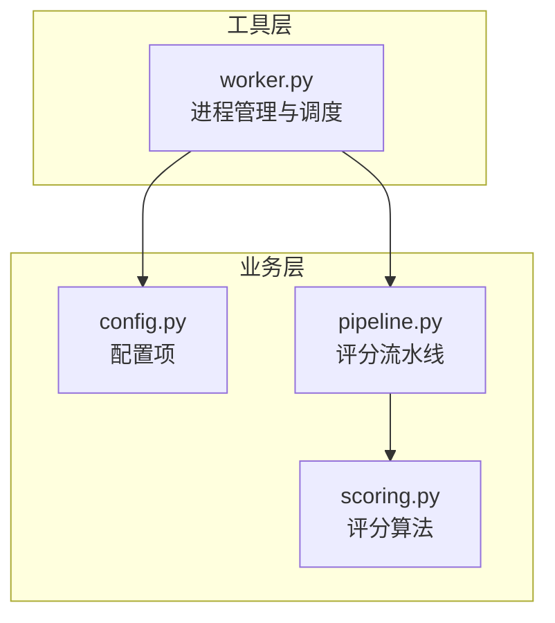
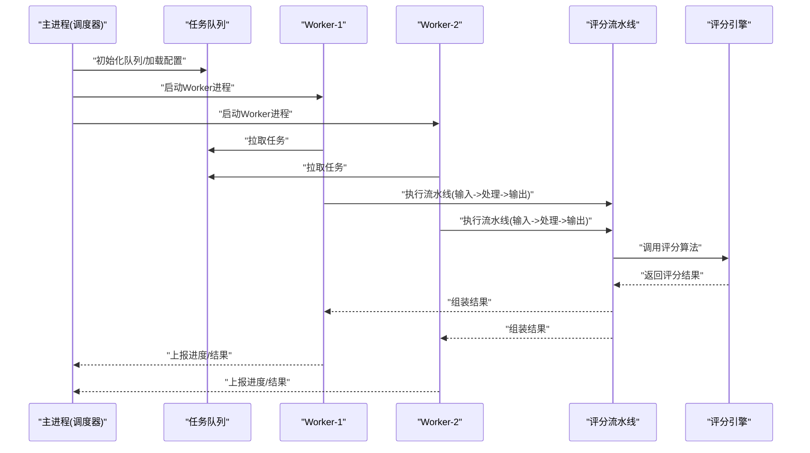
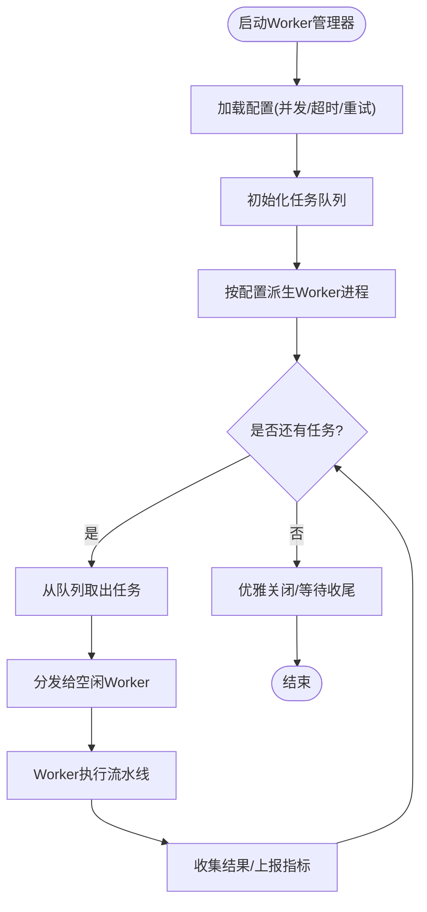
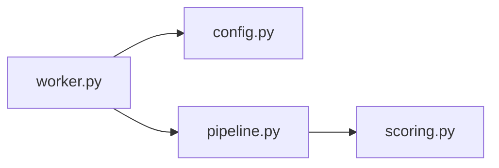

# Worker进程管理

<cite>
**本文引用的文件**   
- [worker.py](file://tools/realshift/worker.py)
- [config.py](file://tools/realshift/realshift/config.py)
- [pipeline.py](file://tools/realshift/realshift/pipeline.py)
- [scoring.py](file://tools/realshift/realshift/scoring.py)
</cite>

## 目录
1. [简介](#简介)
2. [项目结构](#项目结构)
3. [核心组件](#核心组件)
4. [架构总览](#架构总览)
5. [详细组件分析](#详细组件分析)
6. [依赖关系分析](#依赖关系分析)
7. [性能考量](#性能考量)
8. [故障排查指南](#故障排查指南)
9. [结论](#结论)
10. [附录](#附录)

## 简介
本文件面向RealShift评分系统的Worker进程管理模块，系统性阐述多进程架构设计、任务分发与负载均衡策略、Worker启动与生命周期管理、进程间通信协议、任务队列管理与故障恢复机制。同时提供可操作的配置示例（基于现有配置文件），并给出监控指标与性能调优建议，帮助读者在有限硬件资源下合理设置进程数量与任务分配策略。

## 项目结构
RealShift的Worker相关代码位于 tools/realshift 目录下，核心由以下文件组成：
- worker.py：Worker进程入口与进程管理逻辑
- realshift/config.py：运行时配置（如并发度、超时、重试等）
- realshift/pipeline.py：评分流水线编排（数据读取、处理、输出）
- realshift/scoring.py：评分计算与规则实现

图表来源
- [worker.py](file://tools/realshift/worker.py)
- [config.py](file://tools/realshift/realshift/config.py)
- [pipeline.py](file://tools/realshift/realshift/pipeline.py)
- [scoring.py](file://tools/realshift/realshift/scoring.py)

章节来源
- [worker.py](file://tools/realshift/worker.py)
- [config.py](file://tools/realshift/realshift/config.py)
- [pipeline.py](file://tools/realshift/realshift/pipeline.py)
- [scoring.py](file://tools/realshift/realshift/scoring.py)

## 核心组件
- Worker进程管理器：负责创建、监控、回收子进程，维护任务队列，执行任务分发与结果收集。
- 配置中心：集中管理并发度、超时、重试、日志级别、I/O路径等参数。
- 评分流水线：定义数据处理阶段（输入校验、特征提取、评分计算、结果聚合）。
- 评分引擎：封装具体评分规则与算法，保证幂等性与可测试性。

章节来源
- [worker.py](file://tools/realshift/worker.py)
- [config.py](file://tools/realshift/realshift/config.py)
- [pipeline.py](file://tools/realshift/realshift/pipeline.py)
- [scoring.py](file://tools/realshift/realshift/scoring.py)

## 架构总览
下图展示Worker进程管理与评分流水线的整体交互：主进程作为调度器，按配置派生多个Worker子进程；每个Worker从共享队列取任务，调用流水线完成评分，并将结果写回或上报。

图表来源
- [worker.py](file://tools/realshift/worker.py)
- [pipeline.py](file://tools/realshift/realshift/pipeline.py)
- [scoring.py](file://tools/realshift/realshift/scoring.py)

## 详细组件分析

### Worker进程管理器（worker.py）
- 职责
  - 解析命令行参数与配置文件
  - 根据CPU核数与内存上限计算并发度
  - 启动若干Worker子进程，绑定到任务队列
  - 监控子进程健康状态，异常退出时自动重启
  - 汇总统计指标（吞吐、延迟、错误率）
- 关键流程
  - 启动阶段：加载配置、初始化队列、创建进程池
  - 运行阶段：轮询队列，分发给空闲Worker
  - 收尾阶段：优雅关闭、等待任务完成、清理资源
- 进程间通信
  - 使用进程内队列或IPC通道传递任务与结果
  - 心跳/健康检查用于检测僵尸进程
- 错误处理
  - 捕获IO异常、序列化失败、超时等
  - 记录错误上下文并重试（受配置限制）

图表来源
- [worker.py](file://tools/realshift/worker.py)

章节来源
- [worker.py](file://tools/realshift/worker.py)

### 配置中心（config.py）
- 关键配置项
  - 并发度：最大并行Worker数量
  - 超时：单任务处理超时阈值
  - 重试：失败重试次数与退避策略
  - I/O路径：输入源、中间缓存、输出目标
  - 日志：级别、输出位置、采样率
- 作用
  - 统一注入到Worker、流水线与评分引擎
  - 支持环境覆盖与热更新（若实现）

章节来源
- [config.py](file://tools/realshift/realshift/config.py)

### 评分流水线（pipeline.py）
- 阶段划分
  - 输入校验与预处理
  - 特征工程与数据准备
  - 调用评分引擎计算分数
  - 后处理与结果格式化
- 设计要点
  - 各阶段解耦，便于替换与扩展
  - 支持断点续跑与幂等写入
  - 内置指标埋点（耗时、命中率、错误分类）

章节来源
- [pipeline.py](file://tools/realshift/realshift/pipeline.py)

### 评分引擎（scoring.py）
- 功能
  - 实现评分规则与算法
  - 提供可配置的权重与阈值
  - 保证函数式接口，便于单元测试
- 扩展性
  - 新增规则以插件形式接入
  - 支持版本化与灰度发布

章节来源
- [scoring.py](file://tools/realshift/realshift/scoring.py)

## 依赖关系分析
- 耦合关系
  - worker.py 依赖 config.py 获取运行时参数
  - worker.py 驱动 pipeline.py 完成数据处理
  - pipeline.py 调用 scoring.py 进行评分计算
- 外部依赖
  - 任务队列（进程内队列或IPC）
  - 文件系统/对象存储（输入输出）
  - 可选：消息总线/数据库（持久化任务与结果）

图表来源
- [worker.py](file://tools/realshift/worker.py)
- [config.py](file://tools/realshift/realshift/config.py)
- [pipeline.py](file://tools/realshift/realshift/pipeline.py)
- [scoring.py](file://tools/realshift/realshift/scoring.py)

章节来源
- [worker.py](file://tools/realshift/worker.py)
- [config.py](file://tools/realshift/realshift/config.py)
- [pipeline.py](file://tools/realshift/realshift/pipeline.py)
- [scoring.py](file://tools/realshift/realshift/scoring.py)

## 性能考量
- 并发度选择
  - 依据CPU核数与内存占用估算最大并发
  - I/O密集型可适当提高并发，CPU密集型需保守设置
- 任务粒度
  - 避免过细导致调度开销过大
  - 避免过粗导致负载不均衡
- 队列与锁
  - 减少全局锁竞争，采用分区队列或无锁结构
- 批处理
  - 合并小任务为批次，提升吞吐
- 资源隔离
  - 限制单个Worker内存/CPU配额，防止雪崩
- 监控与告警
  - 跟踪队列长度、平均延迟、错误率、GC停顿
  - 设置阈值触发扩容或降级

[本节为通用指导，无需特定文件引用]

## 故障排查指南
- 常见问题
  - Worker频繁重启：检查任务超时、OOM、外部依赖不可用
  - 队列堆积：确认消费速率、是否存在阻塞任务
  - 结果不一致：核查幂等性与并发写入冲突
- 诊断步骤
  - 查看Worker日志与指标（吞吐、延迟、错误分类）
  - 定位慢任务样本，复现问题
  - 逐步降低并发验证是否为资源争用
- 恢复策略
  - 自动重启+指数退避
  - 任务去重与幂等写入
  - 快速失败与熔断保护

章节来源
- [worker.py](file://tools/realshift/worker.py)
- [config.py](file://tools/realshift/realshift/config.py)

## 结论
RealShift的Worker进程管理模块通过清晰的职责划分与模块化设计，实现了高可用、可扩展的评分流水线。结合合理的配置与监控手段，可在不同硬件条件下稳定运行并获得良好吞吐。建议在上线前进行容量规划与压测，持续优化并发度与任务粒度，确保系统鲁棒性与性能。

[本节为总结，无需特定文件引用]

## 附录

### Worker配置示例（基于现有配置文件）
- 并发度
  - 设置为CPU核数的1~2倍（CPU密集型取1，I/O密集型可更高）
- 超时与重试
  - 单任务超时：根据P95延迟设定，留有余量
  - 重试次数：1~3次，配合指数退避
- I/O路径
  - 输入源：本地目录或对象存储桶
  - 输出目标：独立分区以避免写放大
- 日志
  - 生产环境INFO级别，采样率适当降低

章节来源
- [config.py](file://tools/realshift/realshift/config.py)

### 进程间通信协议（概念说明）
- 任务消息
  - 字段：任务ID、输入路径、参数、优先级、时间戳
- 结果消息
  - 字段：任务ID、评分结果、状态码、错误信息、耗时
- 控制消息
  - 字段：类型（心跳、停止、扩缩容）、时间戳、签名

[本节为概念说明，无需特定文件引用]

### 监控指标与调优方法
- 指标
  - 队列长度、入队/出队速率、平均/分位延迟、错误率、Worker存活数
- 调优
  - 动态调整并发度
  - 热点任务拆分与缓存
  - 读写分离与异步落盘

[本节为通用指导，无需特定文件引用]