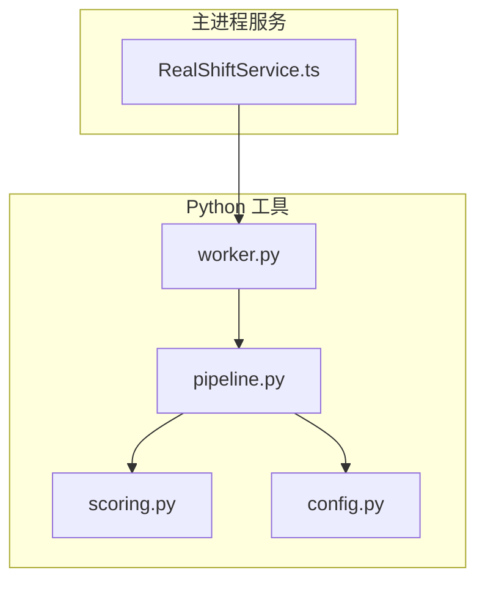
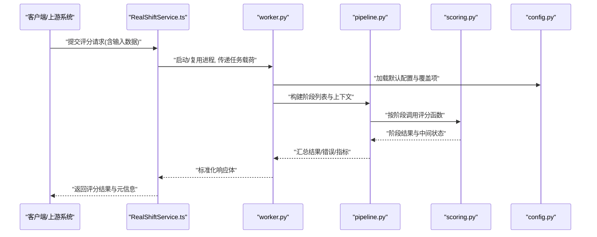
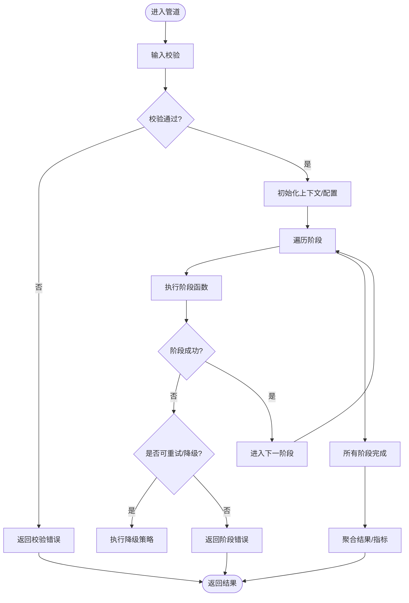
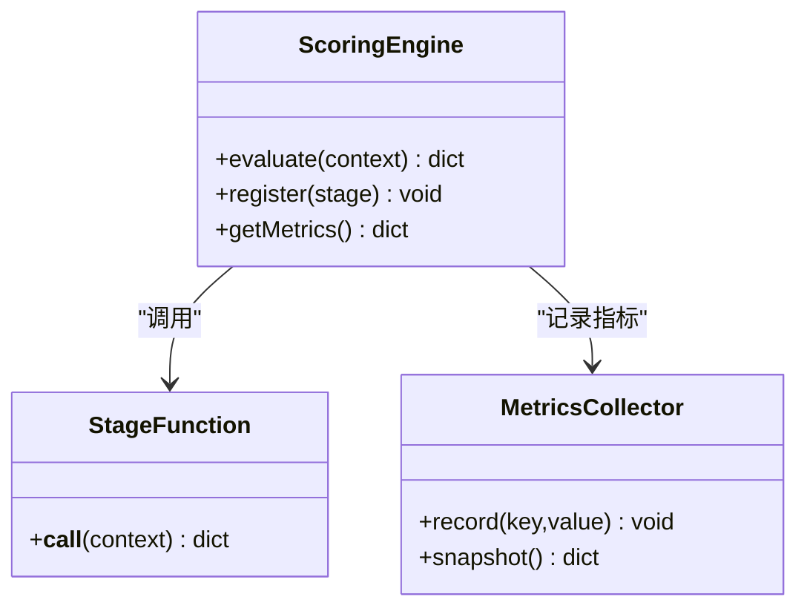
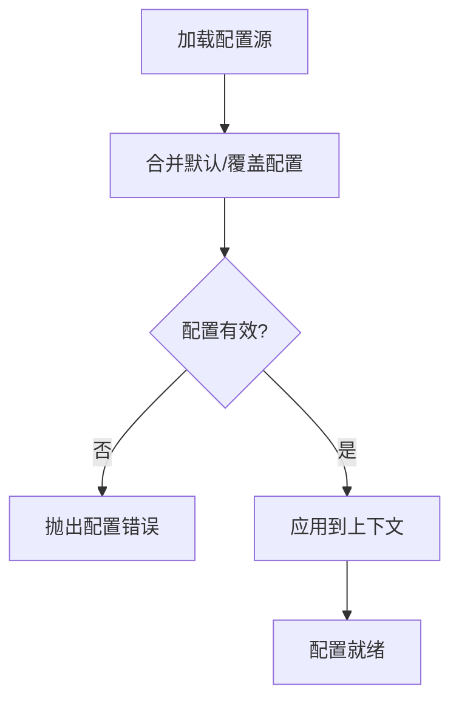
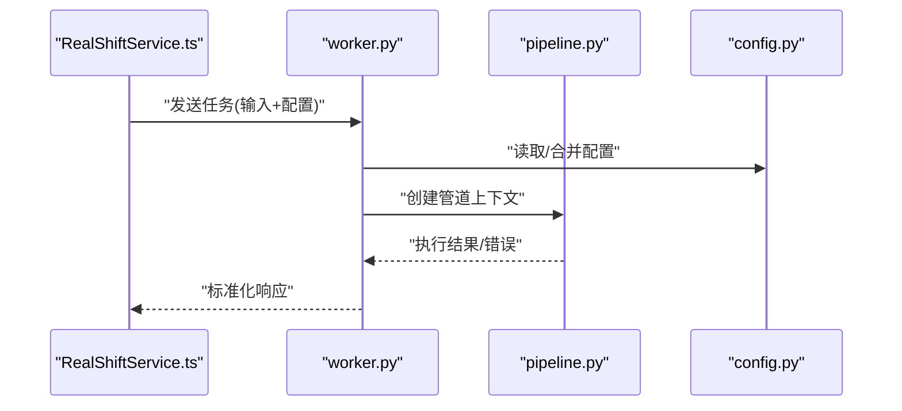
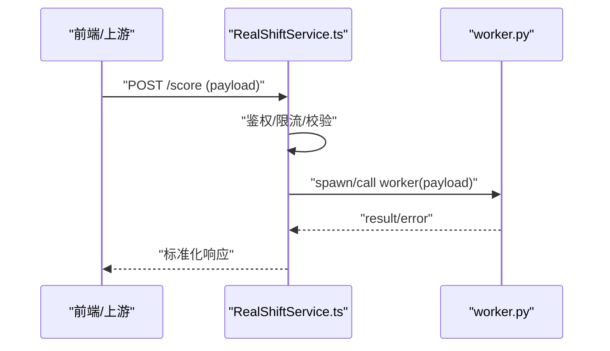
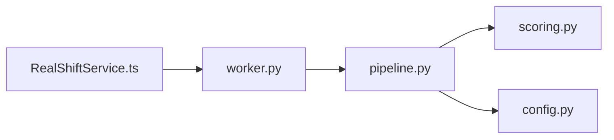

# 管道处理流程

<cite>
**本文引用的文件**   
- [tools/realshift/worker.py](file://tools/realshift/worker.py)
- [tools/realshift/realshift/pipeline.py](file://tools/realshift/realshift/pipeline.py)
- [tools/realshift/realshift/scoring.py](file://tools/realshift/realshift/scoring.py)
- [tools/realshift/realshift/config.py](file://tools/realshift/realshift/config.py)
- [src/main/services/RealShiftService.ts](file://src/main/services/RealShiftService.ts)
</cite>

## 目录
1. [简介](#简介)
2. [项目结构](#项目结构)
3. [核心组件](#核心组件)
4. [架构总览](#架构总览)
5. [详细组件分析](#详细组件分析)
6. [依赖关系分析](#依赖关系分析)
7. [性能考量](#性能考量)
8. [故障排查指南](#故障排查指南)
9. [结论](#结论)
10. [附录](#附录)

## 简介
本文件面向 RealShift 评分系统的“管道处理模块”，系统性阐述其架构设计、阶段管理、输入验证与转换、输出格式、配置项、错误处理与性能优化策略，并提供使用示例与执行顺序说明。该模块以 Python 实现数据处理管道（pipeline），并通过主进程服务（TypeScript）进行编排与调用，形成跨语言的服务协作。

## 项目结构
- tools/realshift：Python 侧的评分与管道实现，包含 worker 入口、pipeline 定义、scoring 评分逻辑与 config 配置。
- src/main/services/RealShiftService.ts：主进程服务，负责与外部系统交互并调度 Python 管道。

**图示来源** 
- [src/main/services/RealShiftService.ts](file://src/main/services/RealShiftService.ts)
- [tools/realshift/worker.py](file://tools/realshift/worker.py)
- [tools/realshift/realshift/pipeline.py](file://tools/realshift/realshift/pipeline.py)
- [tools/realshift/realshift/scoring.py](file://tools/realshift/realshift/scoring.py)
- [tools/realshift/realshift/config.py](file://tools/realshift/realshift/config.py)

**章节来源**
- [tools/realshift/worker.py](file://tools/realshift/worker.py)
- [tools/realshift/realshift/pipeline.py](file://tools/realshift/realshift/pipeline.py)
- [tools/realshift/realshift/scoring.py](file://tools/realshift/realshift/scoring.py)
- [tools/realshift/realshift/config.py](file://tools/realshift/realshift/config.py)
- [src/main/services/RealShiftService.ts](file://src/main/services/RealShiftService.ts)

## 核心组件
- 管道（Pipeline）：定义数据处理的阶段序列、阶段间数据契约、错误传播与重试策略。
- 评分器（Scoring）：封装评分计算逻辑，提供可插拔的阶段函数。
- 配置（Config）：集中管理阈值、权重、开关等参数，支持运行时覆盖。
- Worker：作为 Python 端入口，接收任务、加载配置、执行管道并返回结果。
- 主进程服务（RealShiftService）：从前端或上游系统接收请求，构造输入、调用 worker、解析响应并回传。

**章节来源**
- [tools/realshift/realshift/pipeline.py](file://tools/realshift/realshift/pipeline.py)
- [tools/realshift/realshift/scoring.py](file://tools/realshift/realshift/scoring.py)
- [tools/realshift/realshift/config.py](file://tools/realshift/realshift/config.py)
- [tools/realshift/worker.py](file://tools/realshift/worker.py)
- [src/main/services/RealShiftService.ts](file://src/main/services/RealShiftService.ts)

## 架构总览
下图展示了从主进程服务到 Python 管道的端到端调用链路与数据流转。

**图示来源** 
- [src/main/services/RealShiftService.ts](file://src/main/services/RealShiftService.ts)
- [tools/realshift/worker.py](file://tools/realshift/worker.py)
- [tools/realshift/realshift/pipeline.py](file://tools/realshift/realshift/pipeline.py)
- [tools/realshift/realshift/scoring.py](file://tools/realshift/realshift/scoring.py)
- [tools/realshift/realshift/config.py](file://tools/realshift/realshift/config.py)

## 详细组件分析

### 管道（Pipeline）
- 职责：维护阶段顺序、阶段间数据契约、异常捕获与恢复、指标收集。
- 关键能力：
  - 阶段注册与排序：声明式定义阶段及其依赖。
  - 输入校验：在首阶段对输入字段、类型、范围进行校验，失败即短路返回。
  - 转换与增强：逐阶段清洗、特征提取、规则匹配。
  - 错误处理：记录错误上下文、支持重试与降级。
  - 输出聚合：合并各阶段结果，生成统一的结构化输出。

**图示来源** 
- [tools/realshift/realshift/pipeline.py](file://tools/realshift/realshift/pipeline.py)

**章节来源**
- [tools/realshift/realshift/pipeline.py](file://tools/realshift/realshift/pipeline.py)

### 评分器（Scoring）
- 职责：实现具体评分算法与规则，暴露为可被管道调用的阶段函数。
- 关键能力：
  - 多模型/多规则组合：支持加权融合、阈值判定、置信度评估。
  - 可插拔扩展：新增评分维度只需实现标准接口并注册。
  - 中间态输出：每个阶段输出结构化片段，便于审计与调试。

**图示来源** 
- [tools/realshift/realshift/scoring.py](file://tools/realshift/realshift/scoring.py)

**章节来源**
- [tools/realshift/realshift/scoring.py](file://tools/realshift/realshift/scoring.py)

### 配置（Config）
- 职责：集中管理阈值、权重、开关、超时、重试次数等。
- 关键能力：
  - 默认配置与覆盖：支持环境变量、配置文件与运行时参数覆盖。
  - 类型校验与缺省值：确保配置安全可用。
  - 动态切换：允许在不重启的情况下调整行为（如灰度开关）。

**图示来源** 
- [tools/realshift/realshift/config.py](file://tools/realshift/realshift/config.py)

**章节来源**
- [tools/realshift/realshift/config.py](file://tools/realshift/realshift/config.py)

### Worker（入口）
- 职责：接收任务、加载配置、实例化管道、执行并序列化结果。
- 关键能力：
  - 进程隔离：独立运行避免内存泄漏影响主进程。
  - 标准化输入/输出：保证与主进程服务的契约一致。
  - 错误上报：将异常转换为结构化错误码与消息。

**图示来源** 
- [tools/realshift/worker.py](file://tools/realshift/worker.py)
- [tools/realshift/realshift/config.py](file://tools/realshift/realshift/config.py)
- [tools/realshift/realshift/pipeline.py](file://tools/realshift/realshift/pipeline.py)

**章节来源**
- [tools/realshift/worker.py](file://tools/realshift/worker.py)

### 主进程服务（RealShiftService）
- 职责：对外暴露 API、鉴权、限流、日志、监控；编排 Python 管道。
- 关键能力：
  - 请求校验与脱敏：过滤敏感字段，限制负载大小。
  - 异步调用与超时控制：避免阻塞主线程。
  - 结果规范化：统一返回结构，便于前端消费。

**图示来源** 
- [src/main/services/RealShiftService.ts](file://src/main/services/RealShiftService.ts)
- [tools/realshift/worker.py](file://tools/realshift/worker.py)

**章节来源**
- [src/main/services/RealShiftService.ts](file://src/main/services/RealShiftService.ts)

## 依赖关系分析
- 耦合性：
  - pipeline 依赖 scoring 与 config，worker 依赖 pipeline 与 config。
  - RealShiftService 仅依赖 worker 的标准化接口，松耦合。
- 可扩展性：
  - 新增评分维度只需实现 stage 函数并注册至 pipeline。
  - 配置项可通过覆盖机制灵活调整。
- 潜在循环依赖：
  - 当前分层清晰，未见循环引用风险。

**图示来源** 
- [src/main/services/RealShiftService.ts](file://src/main/services/RealShiftService.ts)
- [tools/realshift/worker.py](file://tools/realshift/worker.py)
- [tools/realshift/realshift/pipeline.py](file://tools/realshift/realshift/pipeline.py)
- [tools/realshift/realshift/scoring.py](file://tools/realshift/realshift/scoring.py)
- [tools/realshift/realshift/config.py](file://tools/realshift/realshift/config.py)

**章节来源**
- [tools/realshift/realshift/pipeline.py](file://tools/realshift/realshift/pipeline.py)
- [tools/realshift/realshift/scoring.py](file://tools/realshift/realshift/scoring.py)
- [tools/realshift/realshift/config.py](file://tools/realshift/realshift/config.py)
- [tools/realshift/worker.py](file://tools/realshift/worker.py)
- [src/main/services/RealShiftService.ts](file://src/main/services/RealShiftService.ts)

## 性能考量
- 阶段并行与流水线：
  - 无依赖阶段可并行执行，缩短整体时延。
  - 大对象在阶段间尽量传递引用而非深拷贝。
- I/O 与缓存：
  - 外部调用（如模型推理）增加缓存层，命中则跳过重复计算。
  - 批量处理合并多次请求，降低开销。
- 资源控制：
  - 设置合理的超时、重试上限与并发度。
  - 监控 CPU/内存峰值，必要时拆分阶段。
- 配置优化：
  - 动态阈值与权重调整，避免全量重算。
  - 启用只读路径与快速失败策略。

[本节为通用指导，不直接分析具体文件]

## 故障排查指南
- 常见错误分类：
  - 输入校验失败：检查必填字段、类型、取值范围。
  - 阶段执行异常：查看阶段日志、上下文快照与堆栈。
  - 配置错误：核对键名、类型与覆盖优先级。
  - 超时/资源不足：调整超时、重试与并发。
- 定位方法：
  - 开启详细日志与追踪 ID，串联上下游调用。
  - 打印阶段中间态与指标，快速缩小问题范围。
  - 使用最小复现用例与离线数据回放。
- 恢复策略：
  - 自动重试与降级（如回退到规则评分）。
  - 熔断与告警，避免雪崩。

**章节来源**
- [tools/realshift/realshift/pipeline.py](file://tools/realshift/realshift/pipeline.py)
- [tools/realshift/realshift/config.py](file://tools/realshift/realshift/config.py)
- [tools/realshift/worker.py](file://tools/realshift/worker.py)

## 结论
RealShift 评分系统的管道模块通过清晰的阶段化设计与松耦合的进程边界，实现了高内聚、易扩展的数据处理能力。配合完善的配置管理与错误处理机制，可在复杂业务场景下稳定运行。建议持续完善监控与可观测性，逐步引入并行与缓存优化，进一步提升吞吐与时延表现。

[本节为总结性内容，不直接分析具体文件]

## 附录

### 输入数据验证规范
- 必填字段：ID、版本、评分维度集合。
- 数据类型：字符串、数值、布尔、枚举。
- 取值范围：阈值上下界、枚举白名单。
- 长度与格式：最大长度、正则校验。

**章节来源**
- [tools/realshift/realshift/pipeline.py](file://tools/realshift/realshift/pipeline.py)

### 输出结果结构与语义
- 顶层字段：评分总分、置信度、耗时、错误码。
- 维度得分：各维度分数、权重、贡献度。
- 中间态：关键特征、规则命中、模型输出摘要。
- 元数据：版本、环境、追踪 ID。

**章节来源**
- [tools/realshift/realshift/pipeline.py](file://tools/realshift/realshift/pipeline.py)
- [tools/realshift/realshift/scoring.py](file://tools/realshift/realshift/scoring.py)

### 管道配置选项
- 阈值与权重：各维度阈值、融合权重。
- 行为开关：启用/禁用某阶段、是否输出中间态。
- 资源参数：超时、重试次数、并发度。
- 覆盖来源：环境变量、配置文件、运行时参数。

**章节来源**
- [tools/realshift/realshift/config.py](file://tools/realshift/realshift/config.py)

### 使用示例（步骤说明）
- 准备输入：构造符合规范的 JSON 载荷。
- 调用服务：通过 RealShiftService 发起请求。
- 执行管道：worker 加载配置，pipeline 依次执行阶段。
- 获取结果：解析标准化响应，提取评分与指标。
- 错误处理：根据错误码与消息定位并修复问题。

**章节来源**
- [src/main/services/RealShiftService.ts](file://src/main/services/RealShiftService.ts)
- [tools/realshift/worker.py](file://tools/realshift/worker.py)
- [tools/realshift/realshift/pipeline.py](file://tools/realshift/realshift/pipeline.py)

### 阶段依赖与执行顺序
- 顺序原则：先校验后计算，先规则后模型，先粗筛后精排。
- 依赖声明：阶段间通过上下文共享数据，显式声明依赖。
- 执行保障：失败短路或降级，保证最终一致性。

**章节来源**
- [tools/realshift/realshift/pipeline.py](file://tools/realshift/realshift/pipeline.py)
- [tools/realshift/realshift/scoring.py](file://tools/realshift/realshift/scoring.py)