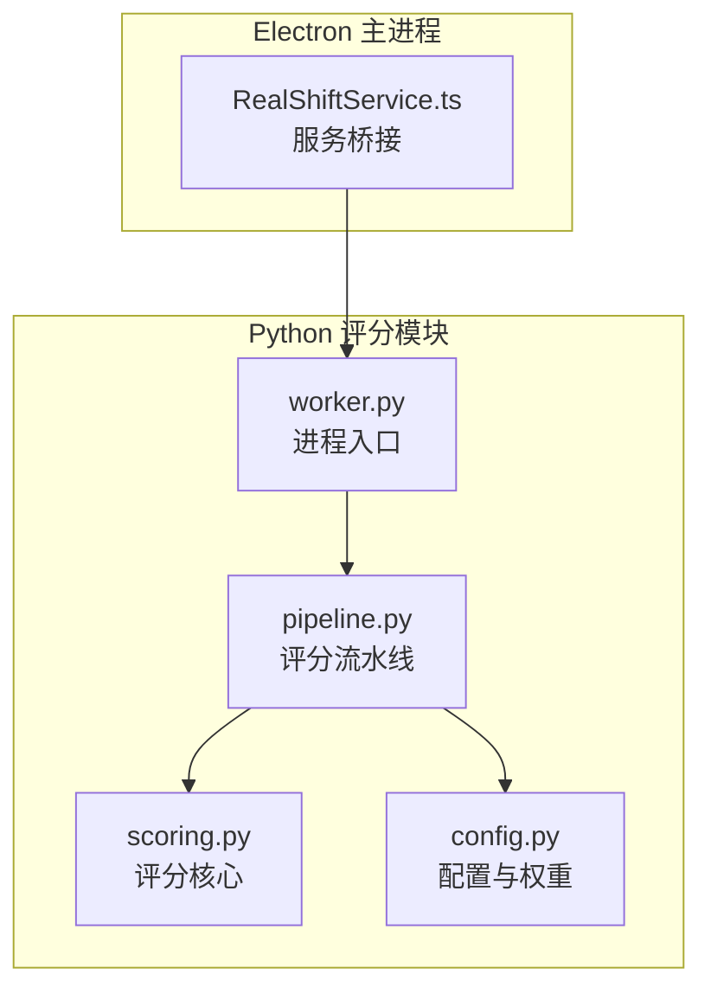
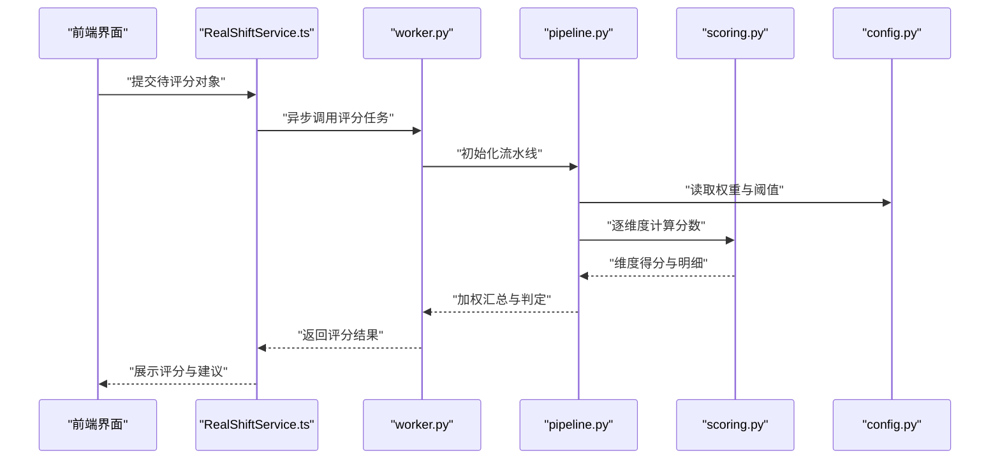
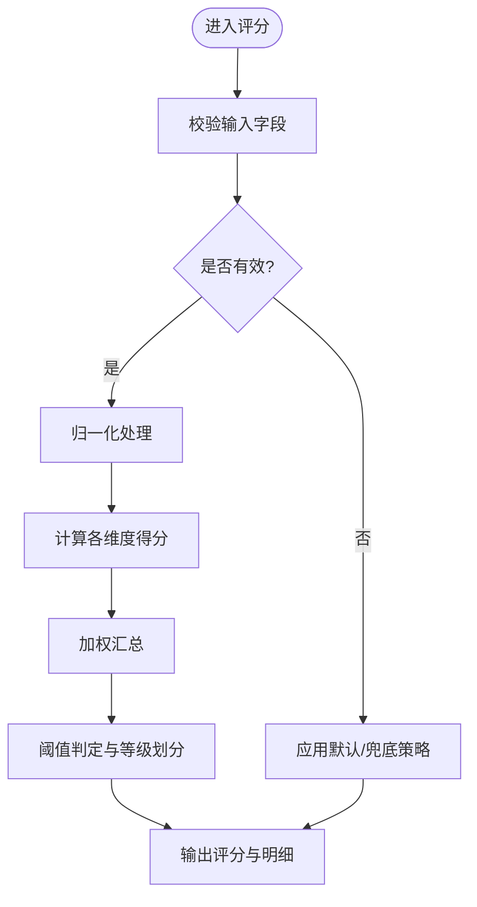
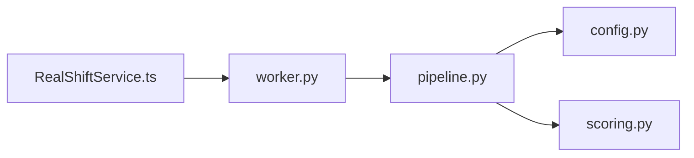

# 评分算法实现

<cite>
**本文引用的文件**   
- [tools/realshift/realshift/scoring.py](file://tools/realshift/realshift/scoring.py)
- [tools/realshift/realshift/config.py](file://tools/realshift/realshift/config.py)
- [tools/realshift/realshift/pipeline.py](file://tools/realshift/realshift/pipeline.py)
- [tools/realshift/worker.py](file://tools/realshift/worker.py)
- [src/main/services/RealShiftService.ts](file://src/main/services/RealShiftService.ts)
</cite>

## 目录
1. [简介](#简介)
2. [项目结构](#项目结构)
3. [核心组件](#核心组件)
4. [架构总览](#架构总览)
5. [详细组件分析](#详细组件分析)
6. [依赖关系分析](#依赖关系分析)
7. [性能考虑](#性能考虑)
8. [故障排查指南](#故障排查指南)
9. [结论](#结论)
10. [附录](#附录)

## 简介
本文件面向RealShift评分系统的算法模块，系统化阐述评分算法的核心逻辑、权重计算与评估标准。文档覆盖各评分维度的计算方法、参数配置与结果解释，给出数学模型、边界条件与异常值处理策略，并提供具体计算示例与调优建议，同时说明评分算法与业务规则的映射关系，帮助读者快速理解并有效使用或扩展该评分系统。

## 项目结构
RealShift评分相关代码主要位于 tools/realshift 目录下，包含评分核心（scoring）、配置（config）、流水线（pipeline）以及工作进程入口（worker）。前端通过 src/main/services/RealShiftService.ts 调用后端服务以触发评分流程。

**图示来源** 
- [tools/realshift/realshift/scoring.py](file://tools/realshift/realshift/scoring.py)
- [tools/realshift/realshift/config.py](file://tools/realshift/realshift/config.py)
- [tools/realshift/realshift/pipeline.py](file://tools/realshift/realshift/pipeline.py)
- [tools/realshift/worker.py](file://tools/realshift/worker.py)
- [src/main/services/RealShiftService.ts](file://src/main/services/RealShiftService.ts)

**章节来源**
- [tools/realshift/realshift/scoring.py](file://tools/realshift/realshift/scoring.py)
- [tools/realshift/realshift/config.py](file://tools/realshift/realshift/config.py)
- [tools/realshift/realshift/pipeline.py](file://tools/realshift/realshift/pipeline.py)
- [tools/realshift/worker.py](file://tools/realshift/worker.py)
- [src/main/services/RealShiftService.ts](file://src/main/services/RealShiftService.ts)

## 核心组件
- 评分核心（scoring.py）：定义评分维度、权重聚合、归一化与阈值判定等核心算法。
- 配置（config.py）：集中管理评分维度、权重、阈值、归一化方法与异常值处理策略。
- 流水线（pipeline.py）：编排输入数据校验、特征提取、维度评分、加权汇总与结果输出。
- 工作进程（worker.py）：提供独立进程执行评分任务，便于并发与隔离。
- 服务桥接（RealShiftService.ts）：在主进程中封装对评分服务的调用，统一入参出参与错误处理。

**章节来源**
- [tools/realshift/realshift/scoring.py](file://tools/realshift/realshift/scoring.py)
- [tools/realshift/realshift/config.py](file://tools/realshift/realshift/config.py)
- [tools/realshift/realshift/pipeline.py](file://tools/realshift/realshift/pipeline.py)
- [tools/realshift/worker.py](file://tools/realshift/worker.py)
- [src/main/services/RealShiftService.ts](file://src/main/services/RealShiftService.ts)

## 架构总览
评分系统采用“服务调用—进程执行—流水线编排—核心评分”的分层架构。前端通过 RealShiftService 发起请求，worker 启动独立进程加载 pipeline，按配置驱动 scoring 完成多维评分与汇总，最终返回结构化评分结果。

**图示来源** 
- [src/main/services/RealShiftService.ts](file://src/main/services/RealShiftService.ts)
- [tools/realshift/worker.py](file://tools/realshift/worker.py)
- [tools/realshift/realshift/pipeline.py](file://tools/realshift/realshift/pipeline.py)
- [tools/realshift/realshift/scoring.py](file://tools/realshift/realshift/scoring.py)
- [tools/realshift/realshift/config.py](file://tools/realshift/realshift/config.py)

## 详细组件分析

### 评分核心（scoring.py）
- 职责：实现各评分维度的打分函数、归一化方法、异常值处理与最终加权汇总。
- 关键要点：
  - 维度评分函数：将原始指标映射到[0,1]区间，支持线性、分段、Sigmoid等方法。
  - 权重聚合：按配置权重进行加权求和，支持动态权重与维度开关。
  - 异常值处理：检测极端值并进行截断或回退策略，避免污染总分。
  - 边界条件：确保输入缺失或非法时返回安全默认分，保证稳定性。
- 复杂度：维度数量N，时间复杂度O(N)，空间复杂度O(1)。

**图示来源** 
- [tools/realshift/realshift/scoring.py](file://tools/realshift/realshift/scoring.py)

**章节来源**
- [tools/realshift/realshift/scoring.py](file://tools/realshift/realshift/scoring.py)

### 配置（config.py）
- 职责：集中管理评分维度、权重、阈值、归一化方法与异常值处理策略。
- 关键要点：
  - 维度定义：名称、单位、取值范围、归一化方法。
  - 权重分配：全局权重与维度级权重，支持场景化覆盖。
  - 阈值策略：等级划分（如A/B/C/D）与临界点。
  - 异常策略：缺失值填充、极值截断、回退规则。
- 可维护性：通过配置文件或常量表驱动，便于业务调整与A/B测试。

**章节来源**
- [tools/realshift/realshift/config.py](file://tools/realshift/realshift/config.py)

### 流水线（pipeline.py）
- 职责：编排评分全流程，包括输入校验、特征提取、维度评分、加权汇总与结果格式化。
- 关键要点：
  - 输入校验：必填字段检查、类型转换、范围约束。
  - 特征提取：从原始数据派生可用指标（如文本长度、数值比率）。
  - 维度评分：调用 scoring 模块计算各维度得分。
  - 汇总输出：生成总分、等级、维度明细与建议项。
- 可扩展性：新增维度只需在配置中声明并在 scoring 中实现对应函数。

**章节来源**
- [tools/realshift/realshift/pipeline.py](file://tools/realshift/realshift/pipeline.py)

### 工作进程（worker.py）
- 职责：作为独立进程执行评分任务，支持并发与资源隔离。
- 关键要点：
  - 进程生命周期：初始化环境、加载配置、执行流水线、清理资源。
  - 错误隔离：捕获异常并返回结构化错误信息。
  - 性能优化：按需加载模块、减少内存占用。

**章节来源**
- [tools/realshift/worker.py](file://tools/realshift/worker.py)

### 服务桥接（RealShiftService.ts）
- 职责：在主进程中封装对评分服务的调用，统一入参出参与错误处理。
- 关键要点：
  - 接口封装：提供统一的评分API，隐藏进程通信细节。
  - 错误处理：捕获网络与进程异常，转换为业务友好错误。
  - 缓存与重试：可选的本地缓存与失败重试机制。

**章节来源**
- [src/main/services/RealShiftService.ts](file://src/main/services/RealShiftService.ts)

## 依赖关系分析
评分模块内部依赖清晰：pipeline 依赖 config 与 scoring；worker 依赖 pipeline；RealShiftService 依赖 worker。无循环依赖，耦合度低，易于替换与扩展。

**图示来源** 
- [src/main/services/RealShiftService.ts](file://src/main/services/RealShiftService.ts)
- [tools/realshift/worker.py](file://tools/realshift/worker.py)
- [tools/realshift/realshift/pipeline.py](file://tools/realshift/realshift/pipeline.py)
- [tools/realshift/realshift/config.py](file://tools/realshift/realshift/config.py)
- [tools/realshift/realshift/scoring.py](file://tools/realshift/realshift/scoring.py)

**章节来源**
- [src/main/services/RealShiftService.ts](file://src/main/services/RealShiftService.ts)
- [tools/realshift/worker.py](file://tools/realshift/worker.py)
- [tools/realshift/realshift/pipeline.py](file://tools/realshift/realshift/pipeline.py)
- [tools/realshift/realshift/config.py](file://tools/realshift/realshift/config.py)
- [tools/realshift/realshift/scoring.py](file://tools/realshift/realshift/scoring.py)

## 性能考虑
- 维度计算复杂度为O(N)，建议在维度较多时使用并行计算或批处理。
- 归一化与阈值判定为常数时间操作，注意避免重复计算。
- 异常值处理应尽早拦截，减少后续计算开销。
- 进程隔离有利于并发执行，但需控制进程创建与销毁成本。

## 故障排查指南
- 输入校验失败：检查必填字段与数据类型，确认范围约束。
- 维度得分异常：查看归一化方法与异常值处理策略，必要时启用兜底默认分。
- 总分不合理：核对权重配置与阈值设置，确认是否存在极端值污染。
- 进程崩溃：检查 worker 日志，定位异常堆栈，必要时重启进程。

**章节来源**
- [tools/realshift/realshift/pipeline.py](file://tools/realshift/realshift/pipeline.py)
- [tools/realshift/realshift/scoring.py](file://tools/realshift/realshift/scoring.py)
- [tools/realshift/worker.py](file://tools/realshift/worker.py)

## 结论
RealShift评分系统通过清晰的模块化设计与灵活的配置驱动，实现了稳定、可扩展的评分能力。核心算法聚焦维度评分、权重聚合与异常处理，配合流水线编排与服务桥接，形成端到端的评分解决方案。建议在实际使用中结合业务场景调整权重与阈值，并通过A/B测试验证效果。

## 附录
- 数学模型参考：
  - 归一化：线性映射、分段映射、Sigmoid映射。
  - 加权汇总：加权求和、几何平均、TOPSIS（可选）。
  - 阈值判定：线性分段、指数衰减、动态阈值。
- 调优建议：
  - 权重校准：基于历史数据回归拟合或专家经验迭代。
  - 维度裁剪：剔除冗余维度，提升鲁棒性。
  - 异常策略：根据业务容忍度选择截断、忽略或降级。