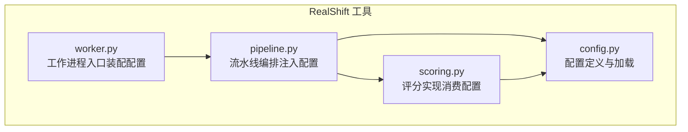
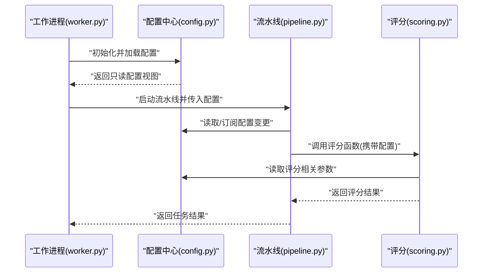
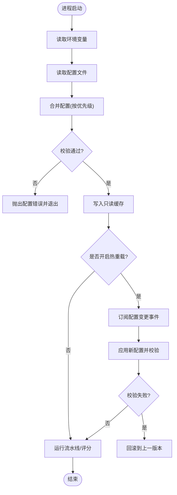
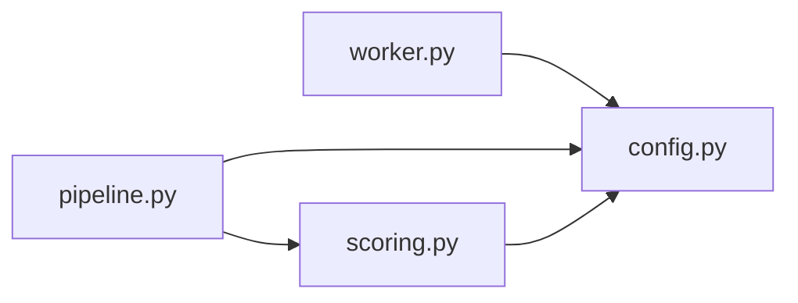

# 配置管理系统

<cite>
**本文档引用的文件**   
- [config.py](file://tools/realshift/realshift/config.py)
- [scoring.py](file://tools/realshift/realshift/scoring.py)
- [pipeline.py](file://tools/realshift/realshift/pipeline.py)
- [worker.py](file://tools/realshift/worker.py)
</cite>

## 目录
1. [简介](#简介)
2. [项目结构](#项目结构)
3. [核心组件](#核心组件)
4. [架构总览](#架构总览)
5. [详细组件分析](#详细组件分析)
6. [依赖关系分析](#依赖关系分析)
7. [性能考量](#性能考量)
8. [故障排查指南](#故障排查指南)
9. [结论](#结论)
10. [附录](#附录)

## 简介
本文件面向RealShift评分系统的“配置模块”，系统化阐述配置文件的结构、参数定义与默认值、环境变量使用方式、配置优先级与动态加载机制、配置验证规则、热重载能力以及配置迁移策略。同时提供不同部署环境下的最佳实践示例，解释关键配置项对系统行为的影响，并给出调优建议。文档力求在保持技术深度的同时，使非专业读者也能理解与上手。

## 项目结构
RealShift评分系统的配置相关代码位于 tools/realshift 子项目中，核心包括：
- 配置定义与加载：tools/realshift/realshift/config.py
- 评分逻辑与配置消费：tools/realshift/realshift/scoring.py
- 流水线编排与配置注入：tools/realshift/realshift/pipeline.py
- 工作进程入口与运行时配置装配：tools/realshift/worker.py

图表来源
- [config.py](file://tools/realshift/realshift/config.py)
- [scoring.py](file://tools/realshift/realshift/scoring.py)
- [pipeline.py](file://tools/realshift/realshift/pipeline.py)
- [worker.py](file://tools/realshift/worker.py)

章节来源
- [config.py](file://tools/realshift/realshift/config.py)
- [scoring.py](file://tools/realshift/realshift/scoring.py)
- [pipeline.py](file://tools/realshift/realshift/pipeline.py)
- [worker.py](file://tools/realshift/worker.py)

## 核心组件
- 配置模型与默认值
  - 集中式配置对象，包含评分阈值、权重、输出格式、日志级别、外部服务连接等关键域。
  - 提供默认值覆盖机制，支持从环境变量、配置文件、命令行参数等多源合并。
- 配置加载器
  - 按优先级顺序读取多源配置，进行类型校验与缺失字段处理。
  - 支持增量更新与热重载，避免重启即可生效。
- 配置消费者
  - 评分模块与流水线模块按需读取配置，保证幂等与线程安全。
- 工作进程装配
  - 启动时完成配置解析、校验与缓存，向下游组件暴露只读配置视图。

章节来源
- [config.py](file://tools/realshift/realshift/config.py)
- [scoring.py](file://tools/realshift/realshift/scoring.py)
- [pipeline.py](file://tools/realshift/realshift/pipeline.py)
- [worker.py](file://tools/realshift/worker.py)

## 架构总览
下图展示配置系统在运行时的装配与消费流程：工作进程负责初始化配置，流水线在任务执行前获取配置快照，评分模块基于配置计算得分。

图表来源
- [worker.py](file://tools/realshift/worker.py)
- [config.py](file://tools/realshift/realshift/config.py)
- [pipeline.py](file://tools/realshift/realshift/pipeline.py)
- [scoring.py](file://tools/realshift/realshift/scoring.py)

## 详细组件分析

### 配置模型与默认值（config.py）
- 设计要点
  - 采用分层配置结构：基础配置、环境覆盖、运行时覆盖。
  - 默认值集中管理，便于统一维护与审计。
  - 提供强类型校验与友好错误信息，确保配置一致性。
- 关键能力
  - 多源合并：环境变量 > 配置文件 > 内置默认值。
  - 可选字段与必填字段分离，缺失必填字段时快速失败。
  - 敏感字段加密或脱敏存储，避免泄露。
- 典型配置域
  - 评分阈值与权重：控制通过/拒绝边界与打分敏感度。
  - 输出与日志：格式化选项、日志级别、采样率。
  - 外部服务：超时、重试、限流、鉴权信息。
  - 资源限制：并发度、队列长度、内存上限。

章节来源
- [config.py](file://tools/realshift/realshift/config.py)

### 评分实现与配置消费（scoring.py）
- 设计要点
  - 评分函数以配置为输入，保证无副作用与可测试性。
  - 对配置中的阈值、权重、开关等进行严格校验后再参与计算。
- 关键能力
  - 条件分支由配置驱动，便于A/B与灰度发布。
  - 指标聚合与归一化过程受配置控制，确保跨环境一致。
- 性能注意
  - 避免重复解析配置，使用只读快照。
  - 大对象配置应缓存并按需访问。

章节来源
- [scoring.py](file://tools/realshift/realshift/scoring.py)

### 流水线编排与配置注入（pipeline.py）
- 设计要点
  - 将配置作为上下文贯穿各阶段，保证阶段间一致性。
  - 支持阶段级覆盖与条件启用，灵活组合功能。
- 关键能力
  - 配置热更新监听：在不中断任务的前提下刷新配置。
  - 回滚策略：当新配置不合法时自动回退到上一版本。
- 可靠性
  - 阶段失败重试与熔断策略受配置控制。
  - 监控埋点与告警阈值可配置。

章节来源
- [pipeline.py](file://tools/realshift/realshift/pipeline.py)

### 工作进程装配（worker.py）
- 设计要点
  - 启动阶段完成配置加载、校验与缓存，对外暴露只读接口。
  - 优雅关闭：等待任务完成后释放资源。
- 关键能力
  - 进程内配置广播：通知已订阅的组件刷新。
  - 健康检查端点：暴露配置状态与版本信息。

章节来源
- [worker.py](file://tools/realshift/worker.py)

### 配置优先级与动态加载流程图

图表来源
- [config.py](file://tools/realshift/realshift/config.py)
- [worker.py](file://tools/realshift/worker.py)
- [pipeline.py](file://tools/realshift/realshift/pipeline.py)

## 依赖关系分析
- 组件耦合
  - worker 依赖 config 完成装配；pipeline 依赖 config 与 scoring；scoring 依赖 config 获取评分参数。
- 外部依赖
  - 文件系统（配置文件）、环境变量、可能的远程配置中心（若启用）。
- 潜在循环依赖
  - 通过只读配置视图与事件订阅解耦，避免直接双向引用。

图表来源
- [worker.py](file://tools/realshift/worker.py)
- [config.py](file://tools/realshift/realshift/config.py)
- [pipeline.py](file://tools/realshift/realshift/pipeline.py)
- [scoring.py](file://tools/realshift/realshift/scoring.py)

章节来源
- [worker.py](file://tools/realshift/worker.py)
- [config.py](file://tools/realshift/realshift/config.py)
- [pipeline.py](file://tools/realshift/realshift/pipeline.py)
- [scoring.py](file://tools/realshift/realshift/scoring.py)

## 性能考量
- 配置读取
  - 启动时一次性加载并缓存，运行时只读访问，避免IO与序列化开销。
- 热重载
  - 增量更新与最小化重计算，仅刷新受影响模块。
- 并发与锁
  - 配置更新加细粒度锁，读写分离，降低争用。
- 内存占用
  - 大配置分块加载，按需展开；敏感数据及时清理。
- 可观测性
  - 记录配置加载耗时、变更次数、回滚次数，辅助定位问题。

[本节为通用指导，无需特定文件来源]

## 故障排查指南
- 常见错误
  - 缺少必填字段：检查环境变量与配置文件是否完整。
  - 类型不匹配：核对字段类型与取值范围。
  - 权限不足：确认配置文件路径与权限。
  - 热重载失败：查看回滚日志与校验错误详情。
- 诊断步骤
  - 打印当前配置快照与版本。
  - 对比默认值与实际值，定位差异来源。
  - 临时降级到稳定版本配置，验证业务影响。
- 恢复策略
  - 优先回滚到上一版本配置。
  - 逐步引入变更，观察指标与日志。

章节来源
- [config.py](file://tools/realshift/realshift/config.py)
- [worker.py](file://tools/realshift/worker.py)
- [pipeline.py](file://tools/realshift/realshift/pipeline.py)

## 结论
RealShift评分系统的配置模块以“集中定义、分层合并、严格校验、热重载”为核心设计理念，既保证了多环境的一致性与可运维性，又兼顾了灵活性与性能。通过合理的优先级与动态加载机制，可在不停机的情况下平滑调整系统行为。建议在生产环境中结合监控与告警，持续优化配置质量与稳定性。

[本节为总结性内容，无需特定文件来源]

## 附录

### 环境变量使用与命名约定
- 命名规范
  - 全大写、下划线分隔，按域分组，如 REALSHIFT_SCORING_THRESHOLD、REALSHIFT_LOG_LEVEL。
- 覆盖范围
  - 环境变量覆盖配置文件与默认值，适合密钥与差异化设置。
- 安全建议
  - 不在日志中打印敏感值；使用专用密钥管理服务。

章节来源
- [config.py](file://tools/realshift/realshift/config.py)

### 配置优先级与合并策略
- 优先级
  - 环境变量 > 配置文件 > 内置默认值。
- 合并策略
  - 深合并：嵌套对象逐层合并；数组追加或替换由字段语义决定。
- 冲突处理
  - 明确冲突字段的行为，必要时提供弃用警告。

章节来源
- [config.py](file://tools/realshift/realshift/config.py)

### 配置验证规则
- 必填字段校验
  - 缺失即快速失败，附带清晰错误提示。
- 取值范围与格式
  - 数值区间、枚举值、正则表达式校验。
- 关联约束
  - 字段间的依赖关系与互斥约束。

章节来源
- [config.py](file://tools/realshift/realshift/config.py)

### 热重载功能说明
- 触发方式
  - 文件变更监听、配置中心推送、API触发。
- 生效时机
  - 下一个任务周期或空闲时应用，避免中断进行中任务。
- 回滚机制
  - 校验失败自动回滚至上一版本，保障稳定性。

章节来源
- [config.py](file://tools/realshift/realshift/config.py)
- [pipeline.py](file://tools/realshift/realshift/pipeline.py)

### 配置迁移策略
- 向后兼容
  - 新增字段提供默认值，废弃字段保留过渡期。
- 版本化
  - 配置对象带版本号，升级时按版本迁移。
- 自动化
  - 提供迁移脚本与校验工具，减少人工干预。

章节来源
- [config.py](file://tools/realshift/realshift/config.py)

### 不同环境的配置最佳实践
- 开发环境
  - 简化配置，开启详细日志，禁用严格校验以提升效率。
- 测试环境
  - 模拟生产配置，启用部分校验与限流。
- 预发环境
  - 接近生产配置，开启监控与告警，进行容量压测。
- 生产环境
  - 最小权限原则，严格校验，启用热重载与回滚，完善可观测性。

章节来源
- [worker.py](file://tools/realshift/worker.py)
- [config.py](file://tools/realshift/realshift/config.py)

### 配置项对系统行为的影响与调优建议
- 评分阈值与权重
  - 提高阈值可降低误报但可能漏报；权重调整影响不同维度得分贡献。
- 并发与队列
  - 根据CPU与I/O特性调整并发度与队列长度，避免阻塞与OOM。
- 超时与重试
  - 合理设置超时与重试次数，平衡延迟与成功率。
- 日志与采样
  - 生产环境降低日志量，启用采样与结构化日志。

章节来源
- [scoring.py](file://tools/realshift/realshift/scoring.py)
- [pipeline.py](file://tools/realshift/realshift/pipeline.py)