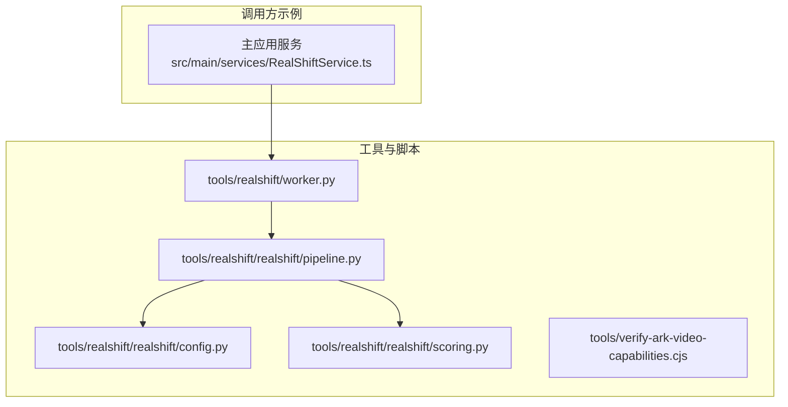
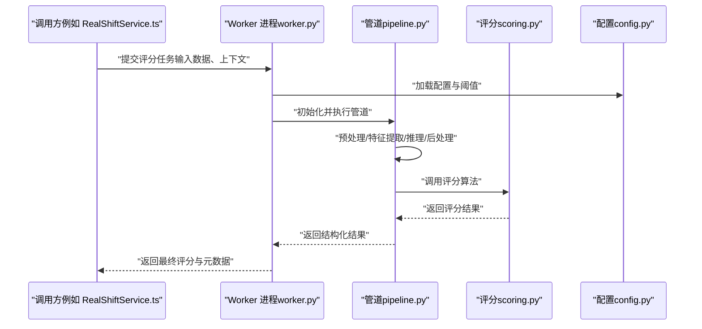
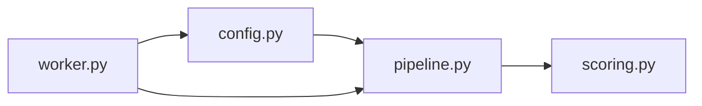

# 工具与工作流

<cite>
**本文引用的文件**   
- [tools/realshift/realshift/config.py](file://tools/realshift/realshift/config.py)
- [tools/realshift/realshift/pipeline.py](file://tools/realshift/realshift/pipeline.py)
- [tools/realshift/realshift/scoring.py](file://tools/realshift/realshift/scoring.py)
- [tools/realshift/worker.py](file://tools/realshift/worker.py)
- [tools/verify-ark-video-capabilities.cjs](file://tools/verify-ark-video-capabilities.cjs)
</cite>

## 目录
1. [简介](#简介)
2. [项目结构](#项目结构)
3. [核心组件](#核心组件)
4. [架构总览](#架构总览)
5. [详细组件分析](#详细组件分析)
6. [依赖关系分析](#依赖关系分析)
7. [性能考虑](#性能考虑)
8. [故障排除指南](#故障排除指南)
9. [结论](#结论)
10. [附录](#附录)

## 简介
本文件为项目中辅助工具与工作流的权威文档，聚焦以下两部分：
- RealShift 评分系统的 Python 实现：涵盖配置、管道处理、评分算法与 Worker 进程管理。
- 视频能力验证工具的 JavaScript 实现：说明其用途、使用方法、输入输出格式与集成方式。

文档同时提供部署指南、性能调优建议与常见问题排查方法，帮助读者快速上手并稳定运行。

## 项目结构
RealShift 评分系统与视频能力验证工具位于 tools 目录下，采用清晰的模块划分：
- tools/realshift/realshift：Python 包，包含配置、管道与评分逻辑。
- tools/realshift/worker.py：Worker 进程入口，负责任务调度与执行。
- tools/verify-ark-video-capabilities.cjs：Node.js 脚本，用于验证 Ark 视频能力。

图表来源
- [tools/realshift/realshift/config.py](file://tools/realshift/realshift/config.py)
- [tools/realshift/realshift/pipeline.py](file://tools/realshift/realshift/pipeline.py)
- [tools/realshift/realshift/scoring.py](file://tools/realshift/realshift/scoring.py)
- [tools/realshift/worker.py](file://tools/realshift/worker.py)

章节来源
- [tools/realshift/realshift/config.py](file://tools/realshift/realshift/config.py)
- [tools/realshift/realshift/pipeline.py](file://tools/realshift/realshift/pipeline.py)
- [tools/realshift/realshift/scoring.py](file://tools/realshift/realshift/scoring.py)
- [tools/realshift/worker.py](file://tools/realshift/worker.py)
- [tools/verify-ark-video-capabilities.cjs](file://tools/verify-ark-video-capabilities.cjs)

## 核心组件
- 配置模块（config.py）：集中管理 RealShift 评分系统的环境变量、阈值、权重与外部服务参数。
- 管道模块（pipeline.py）：定义数据预处理、特征提取、模型推理与后处理的流水线步骤，支持可插拔阶段。
- 评分模块（scoring.py）：实现具体评分算法，包括加权聚合、规则判定与结果归一化。
- Worker 进程（worker.py）：负责任务队列消费、并发控制、资源隔离与错误重试。
- 视频能力验证（verify-ark-video-capabilities.cjs）：通过 Node.js 调用 Ark 相关接口，校验视频处理能力是否可用。

章节来源
- [tools/realshift/realshift/config.py](file://tools/realshift/realshift/config.py)
- [tools/realshift/realshift/pipeline.py](file://tools/realshift/realshift/pipeline.py)
- [tools/realshift/realshift/scoring.py](file://tools/realshift/realshift/scoring.py)
- [tools/realshift/worker.py](file://tools/realshift/worker.py)
- [tools/verify-ark-video-capabilities.cjs](file://tools/verify-ark-video-capabilities.cjs)

## 架构总览
RealShift 评分系统采用“配置驱动 + 管道编排 + 评分计算 + Worker 调度”的架构模式。调用方（如主应用服务）将任务提交给 Worker，Worker 按配置加载管道阶段，依次执行数据处理与评分，最终返回结构化结果。

图表来源
- [tools/realshift/worker.py](file://tools/realshift/worker.py)
- [tools/realshift/realshift/pipeline.py](file://tools/realshift/realshift/pipeline.py)
- [tools/realshift/realshift/scoring.py](file://tools/realshift/realshift/scoring.py)
- [tools/realshift/realshift/config.py](file://tools/realshift/realshift/config.py)

## 详细组件分析

### 配置模块（config.py）
- 职责：统一读取环境变量与默认值，提供类型安全的配置访问器；集中管理评分阈值、权重、超时与外部服务地址。
- 关键点：
  - 环境变量映射：将运行时配置与代码解耦，便于多环境部署。
  - 默认值与校验：保证缺失配置时的稳定性与一致性。
  - 扩展性：新增配置项无需改动核心逻辑。

章节来源
- [tools/realshift/realshift/config.py](file://tools/realshift/realshift/config.py)

### 管道模块（pipeline.py）
- 职责：编排数据处理流程，支持多阶段串联与条件分支；封装中间状态，确保各阶段输入输出契约一致。
- 关键点：
  - 阶段注册：以插件形式添加新阶段，保持高内聚低耦合。
  - 错误传播：阶段失败时快速失败并携带上下文信息。
  - 性能优化：批处理、缓存与惰性求值策略可选。

章节来源
- [tools/realshift/realshift/pipeline.py](file://tools/realshift/realshift/pipeline.py)

### 评分模块（scoring.py）
- 职责：实现评分算法，包括加权聚合、规则判定、置信度计算与结果归一化。
- 关键点：
  - 算法可替换：通过配置切换不同评分策略。
  - 可解释性：输出分项得分与依据，便于审计与调试。
  - 边界处理：对异常输入进行兜底与降级。

章节来源
- [tools/realshift/realshift/scoring.py](file://tools/realshift/realshift/scoring.py)

### Worker 进程（worker.py）
- 职责：作为独立进程接收任务、分配工作单元、管理并发与重试，保障系统稳定性。
- 关键点：
  - 任务队列：支持优先级与去重。
  - 并发控制：限制并行度，避免资源争用。
  - 健康检查：监控进程状态与资源使用。
  - 日志与追踪：记录关键事件与耗时，便于定位问题。

章节来源
- [tools/realshift/worker.py](file://tools/realshift/worker.py)

### 视频能力验证工具（verify-ark-video-capabilities.cjs）
- 职责：在 Node.js 环境中调用 Ark 相关接口，验证视频处理能力是否可用，输出验证结果与诊断信息。
- 使用方法：
  - 准备环境：安装 Node.js 与必要依赖。
  - 设置环境变量：配置 API Key、端点与超时等参数。
  - 执行脚本：运行 cjs 脚本，查看输出结果。
- 输入输出：
  - 输入：通过命令行参数或环境变量传入配置。
  - 输出：JSON 格式的验证结果，包含状态码、错误信息与诊断详情。

章节来源
- [tools/verify-ark-video-capabilities.cjs](file://tools/verify-ark-video-capabilities.cjs)

## 依赖关系分析
RealShift 评分系统内部依赖清晰，外部依赖集中在配置与网络调用层。Worker 作为进程边界，屏蔽了底层实现的复杂性。

图表来源
- [tools/realshift/realshift/config.py](file://tools/realshift/realshift/config.py)
- [tools/realshift/realshift/pipeline.py](file://tools/realshift/realshift/pipeline.py)
- [tools/realshift/realshift/scoring.py](file://tools/realshift/realshift/scoring.py)
- [tools/realshift/worker.py](file://tools/realshift/worker.py)

章节来源
- [tools/realshift/realshift/config.py](file://tools/realshift/realshift/config.py)
- [tools/realshift/realshift/pipeline.py](file://tools/realshift/realshift/pipeline.py)
- [tools/realshift/realshift/scoring.py](file://tools/realshift/realshift/scoring.py)
- [tools/realshift/worker.py](file://tools/realshift/worker.py)

## 性能考虑
- 管道优化：
  - 批处理：合并小任务以降低开销。
  - 缓存：对重复计算结果进行缓存。
  - 惰性求值：按需计算中间结果。
- Worker 调优：
  - 并发度：根据 CPU/内存与 I/O 特性调整并行数。
  - 超时与重试：合理设置超时与退避策略。
  - 资源隔离：限制每个 Worker 的资源使用。
- 评分算法：
  - 复杂度控制：优先选择线性或近似线性算法。
  - 增量更新：支持部分结果复用。

[本节为通用指导，不直接分析具体文件]

## 故障排除指南
- 配置错误：
  - 现象：启动失败或行为异常。
  - 排查：检查环境变量是否齐全，确认默认值与类型。
- 管道阶段失败：
  - 现象：任务中断并返回错误。
  - 排查：查看阶段日志，确认输入输出契约与依赖服务可用性。
- Worker 无响应：
  - 现象：任务堆积或超时。
  - 排查：检查进程健康、队列长度与资源占用。
- 视频能力验证失败：
  - 现象：cjs 脚本报错或返回不可用。
  - 排查：核对 API Key、端点与网络连通性，查看诊断输出。

章节来源
- [tools/realshift/realshift/config.py](file://tools/realshift/realshift/config.py)
- [tools/realshift/realshift/pipeline.py](file://tools/realshift/realshift/pipeline.py)
- [tools/realshift/realshift/scoring.py](file://tools/realshift/realshift/scoring.py)
- [tools/realshift/worker.py](file://tools/realshift/worker.py)
- [tools/verify-ark-video-capabilities.cjs](file://tools/verify-ark-video-capabilities.cjs)

## 结论
RealShift 评分系统通过模块化设计与进程隔离，实现了高内聚、低耦合与可扩展的评分能力。配合视频能力验证工具，可在部署前快速确认外部依赖可用性。遵循本文的配置、部署与调优建议，可有效提升系统稳定性与性能。

[本节为总结，不直接分析具体文件]

## 附录
- 部署清单：
  - 安装 Python 环境与依赖。
  - 配置环境变量与阈值。
  - 启动 Worker 进程并监控健康。
  - 运行视频能力验证脚本。
- 集成方式：
  - 通过主应用服务调用 Worker 接口。
  - 使用标准输入输出或消息队列对接。
- 最佳实践：
  - 分环境配置与密钥管理。
  - 日志与指标采集。
  - 灰度发布与回滚策略。

[本节为补充信息，不直接分析具体文件]