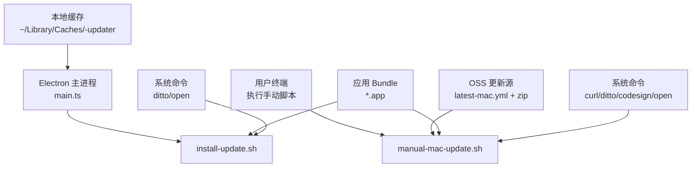
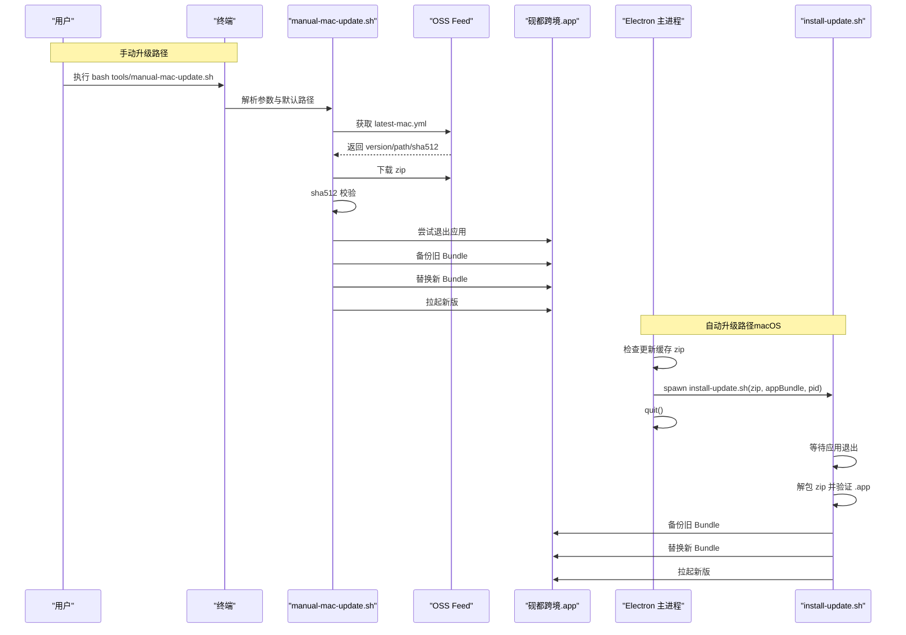
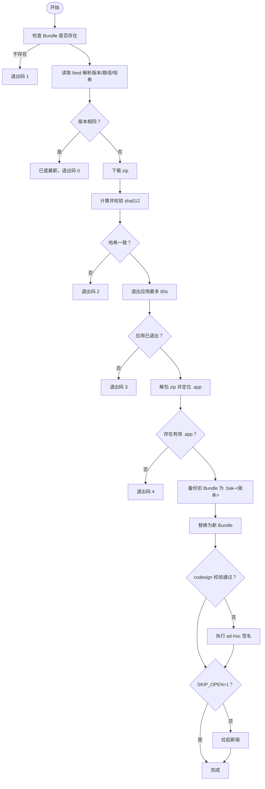
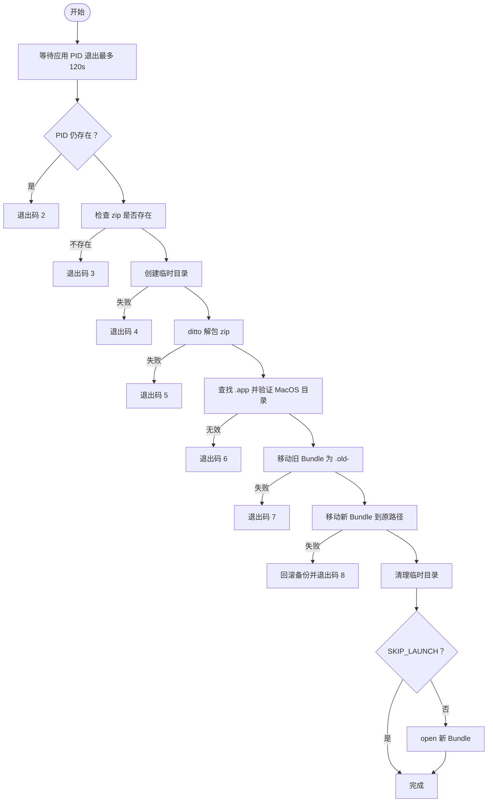
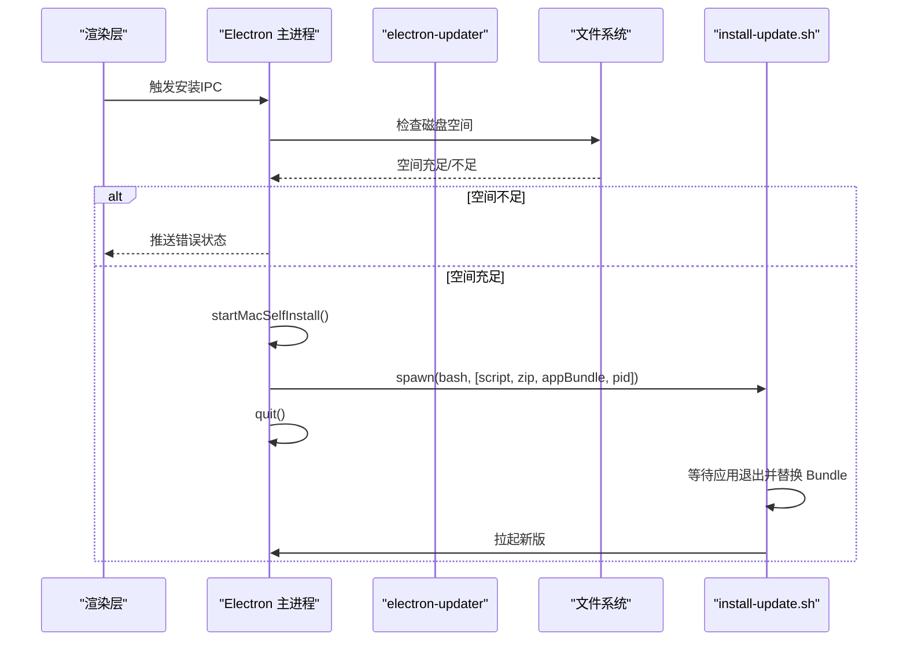
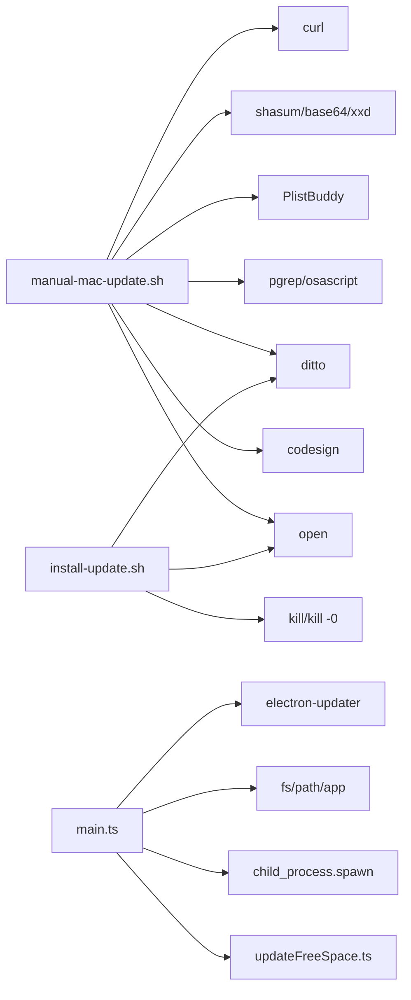

# 手动macOS更新工具

<cite>
**本文引用的文件**   
- [manual-mac-update.sh](file://tools/manual-mac-update.sh)
- [install-update.sh](file://resources/mac-updater/install-update.sh)
- [main.ts](file://src/main/main.ts)
- [updateFreeSpace.ts](file://src/main/updateFreeSpace.ts)
- [verify-mac-install-update.cjs](file://tools/verify-mac-install-update.cjs)
</cite>

## 目录
1. [引言](#引言)
2. [项目结构](#项目结构)
3. [核心组件](#核心组件)
4. [架构总览](#架构总览)
5. [详细组件分析](#详细组件分析)
6. [依赖关系分析](#依赖关系分析)
7. [性能与可靠性考虑](#性能与可靠性考虑)
8. [故障排查指南](#故障排查指南)
9. [结论](#结论)

## 引言
本文件面向“砚都跨境”macOS 客户端的更新机制，重点说明两类更新路径：
- 手动升级脚本：用于从旧版本（≤1.0.15）升级到包含自托管安装器的新版本，解决 Squirrel 自动更新在 macOS 上的已知问题。
- 自托管安装器：主进程在检测到已下载更新包后，以独立子进程方式等待应用退出、解包并替换 Bundle，再拉起新版，避免竞态和签名校验失败。

该文档同时覆盖磁盘空间预检、错误码约定、日志位置以及验收测试要点，帮助开发者与运维人员理解、使用和维护更新流程。

## 项目结构
与 macOS 更新相关的关键文件分布如下：
- tools/manual-mac-update.sh：手动升级脚本，负责拉取 feed、校验完整性、退出应用、备份旧 Bundle、替换并拉起新版。
- resources/mac-updater/install-update.sh：自托管安装器，由主进程 detached 启动，安全地完成解包与替换。
- src/main/main.ts：主进程逻辑，负责发现更新、触发安装、调用自托管安装器。
- src/main/updateFreeSpace.ts：磁盘空间预检工具函数。
- tools/verify-mac-install-update.cjs：对 install-update.sh 的沙箱验收脚本。

**图表来源**
- [manual-mac-update.sh:1-55](file://tools/manual-mac-update.sh#L1-L55)
- [install-update.sh:1-59](file://resources/mac-updater/install-update.sh#L1-L59)
- [main.ts:3240-3381](file://src/main/main.ts#L3240-L3381)

**章节来源**
- [manual-mac-update.sh:1-55](file://tools/manual-mac-update.sh#L1-L55)
- [install-update.sh:1-59](file://resources/mac-updater/install-update.sh#L1-L59)
- [main.ts:3240-3381](file://src/main/main.ts#L3240-L3381)

## 核心组件
- 手动升级脚本 manual-mac-update.sh
  - 功能：读取 OSS feed，下载 zip，sha512 校验，退出应用，备份旧 Bundle，替换新 Bundle，必要时补 ad-hoc 签名，拉起新版。
  - 关键行为：默认目标 Bundle 为 ~/Desktop/砚都跨境.app；支持 SKIP_OPEN=1 跳过拉起。
- 自托管安装器 install-update.sh
  - 功能：等待指定 PID 的应用退出，解包 zip，验证 .app 有效性，备份旧 Bundle，替换为新 Bundle，可选拉起。
  - 关键行为：日志写入 ~/Library/Logs/yandu-updater/install.log；失败时保留或回滚备份。
- 主进程 main.ts
  - 功能：检测 Electron 更新缓存中的 zip，调用 install-update.sh 完成安装；提供自动更新状态推送与重试策略；在 macOS 上绕过 Squirrel 的竞态问题。
- 磁盘空间预检 updateFreeSpace.ts
  - 功能：计算卷可用空间，判断是否满足更新所需最低空间阈值。

**章节来源**
- [manual-mac-update.sh:1-55](file://tools/manual-mac-update.sh#L1-L55)
- [install-update.sh:1-59](file://resources/mac-updater/install-update.sh#L1-L59)
- [main.ts:3240-3381](file://src/main/main.ts#L3240-L3381)
- [updateFreeSpace.ts:1-19](file://src/main/updateFreeSpace.ts#L1-L19)

## 架构总览
macOS 更新涉及两条路径：
- 手动路径：用户在终端运行 manual-mac-update.sh，直接完成从 feed 到替换的全流程。
- 自动路径：主进程通过 electron-updater 检查更新，下载完成后提示用户安装；在 macOS 上调用 startMacSelfInstall() 启动 install-update.sh，主进程退出后由安装器完成替换与重启。

**图表来源**
- [manual-mac-update.sh:1-55](file://tools/manual-mac-update.sh#L1-L55)
- [install-update.sh:1-59](file://resources/mac-updater/install-update.sh#L1-L59)
- [main.ts:3240-3381](file://src/main/main.ts#L3240-L3381)

## 详细组件分析

### 手动升级脚本 manual-mac-update.sh
该脚本实现端到端的手动升级流程，适用于从旧版本升级到含自托管安装器的版本。

- 输入与默认值
  - 第一个参数为应用 Bundle 路径，未提供则默认为 ~/Desktop/~/Desktop/砚都跨境.app。
  - 支持环境变量 SKIP_OPEN=1 以跳过拉起步骤，便于测试。
- 主要步骤
  - 读取 feed：从 OSS 获取 latest-mac.yml，解析出线上版本、zip 文件名与期望 sha512。
  - 版本比较：若当前版本等于线上版本，直接结束。
  - 下载 zip：使用 curl 下载，最多重试 3 次。
  - 完整性校验：计算 sha512 并与 feed 中期望值比对，不一致则中止。
  - 退出应用：尝试优雅退出应用，轮询最多 60 秒，超时则中止。
  - 解包与替换：使用 ditto 解包 zip，定位 .app，备份旧 Bundle 为 .bak-<旧版本>，替换为新 Bundle。
  - 签名处理：若 codesign 校验失败，则进行 ad-hoc 签名。
  - 拉起新版：除非设置 SKIP_OPEN=1，否则 open 新 Bundle。
- 错误处理与退出码
  - 找不到 Bundle：退出码 1。
  - sha512 不一致：退出码 2。
  - 应用未在 60 秒内退出：退出码 3。
  - zip 内无有效 .app：退出码 4。
- 清理策略
  - 临时目录在 EXIT 钩子中删除，避免残留。

**图表来源**
- [manual-mac-update.sh:1-55](file://tools/manual-mac-update.sh#L1-L55)

**章节来源**
- [manual-mac-update.sh:1-55](file://tools/manual-mac-update.sh#L1-L55)

### 自托管安装器 install-update.sh
该脚本由主进程 detached 启动，确保在应用完全退出后进行解包与替换，避免竞态与半态风险。

- 输入参数
  - zip 路径、当前 .app 路径、等待退出的 PID、可选 SKIP_LAUNCH。
- 主要步骤
  - 初始化日志目录 ~/Library/Logs/yandu-updater，并将标准输出与错误重定向至 install.log。
  - 等待应用退出：轮询最多 120 秒，若仍存活则中止。
  - 解包 zip：使用 ditto 解包到临时目录，定位 .app 并验证其 Contents/MacOS 存在。
  - 备份与替换：将旧 Bundle 移动到 <app>.old-<时间戳>，再将新 Bundle 移动到原路径；若移动失败则回滚备份。
  - 拉起新版：除非设置 SKIP_LAUNCH，否则 open 新 Bundle。
- 错误处理与退出码
  - 应用仍在运行（120s）：退出码 2。
  - zip 缺失：退出码 3。
  - mktemp 失败：退出码 4。
  - ditto 解包失败：退出码 5。
  - zip 内无有效 .app：退出码 6。
  - 备份移动失败：退出码 7。
  - 新 Bundle 移动失败并回滚：退出码 8。
- 日志与可观测性
  - 所有操作均记录到 install.log，便于审计与排障。

**图表来源**
- [install-update.sh:1-59](file://resources/mac-updater/install-update.sh#L1-L59)

**章节来源**
- [install-update.sh:1-59](file://resources/mac-updater/install-update.sh#L1-L59)

### 主进程 main.ts 更新逻辑
主进程负责协调自动更新流程，并在 macOS 上切换到自托管安装器。

- 更新缓存路径
  - macUpdaterZipPath() 从 ~/Library/Caches/<app.name>-updater 查找 update.zip 或 pending/*.zip。
- 启动自托管安装器
  - startMacSelfInstall() 构造 install-update.sh 的参数（zip 路径、appBundle、process.pid），以 detached 方式启动并忽略 stdio。
- 自动更新生命周期
  - 监听 update-available、download-progress、update-downloaded、error 事件。
  - 在下载完成后弹出对话框，用户选择“立即重启安装”时：
    - 先进行磁盘空间预检；不足则推送错误状态。
    - macOS 上调用 startMacSelfInstall() 并 quit()；其他平台走 autoUpdater.quitAndInstall()。
  - 启动即查更新，失败则在 5 分钟后重试，并每 4 小时周期性检查。
- IPC 入口
  - ipcMain.handle('app:install-update') 暴露给渲染层，行为与弹窗“立即重启安装”等价。

**图表来源**
- [main.ts:3240-3381](file://src/main/main.ts#L3240-L3381)

**章节来源**
- [main.ts:3240-3381](file://src/main/main.ts#L3240-L3381)

### 磁盘空间预检 updateFreeSpace.ts
- 常量 UPDATE_REQUIRED_FREE_BYTES 定义安装一次更新所需的最低可用空间（约 4GB）。
- freeBytesOnVolume(dir) 基于 statfsSync 计算卷可用字节数。
- hasFreeSpaceForUpdate(dir, requiredBytes) 判断是否满足要求。

该模块被主进程在自动更新与 IPC 安装入口中使用，以避免因磁盘空间不足导致 ditto 解包中断。

**章节来源**
- [updateFreeSpace.ts:1-19](file://src/main/updateFreeSpace.ts#L1-L19)
- [main.ts:3311-3314](file://src/main/main.ts#L3311-L3314)
- [main.ts:3340-3343](file://src/main/main.ts#L3340-L3343)

### 验收测试 verify-mac-install-update.cjs
- 目的：在不触碰真实应用的前提下，沙箱验证 install-update.sh 的正常与异常路径。
- 正常路径断言：
  - 退出码为 0。
  - 旧 Bundle 备份为 .old-*。
  - 备份保留 OLD 标记，新 Bundle 就位且含 NEW 标记。
  - 日志包含 OK 行。
- 异常路径断言：
  - zip 内无 .app 时退出码为 6。
  - 失败时原 Bundle 不动。

**章节来源**
- [verify-mac-install-update.cjs:1-56](file://tools/verify-mac-install-update.cjs#L1-L56)

## 依赖关系分析
- 手动脚本依赖的系统工具
  - curl：网络请求与重试。
  - shasum/base64/xxd：sha512 计算与编码转换。
  - PlistBuddy：读取 Info.plist 的版本号。
  - pgrep/osascript：检测与退出应用。
  - ditto：解压 zip。
  - codesign：ad-hoc 签名。
  - open：拉起应用。
- 自托管安装器依赖的系统工具
  - ditto：解压 zip。
  - open：拉起应用。
  - kill/kill -0：检测进程存活。
- 主进程依赖
  - electron-updater：自动更新生命周期管理。
  - fs/path/app：文件系统与路径操作。
  - child_process.spawn：启动安装器。
  - updateFreeSpace.ts：磁盘空间预检。

**图表来源**
- [manual-mac-update.sh:1-55](file://tools/manual-mac-update.sh#L1-L55)
- [install-update.sh:1-59](file://resources/mac-updater/install-update.sh#L1-L59)
- [main.ts:3240-3381](file://src/main/main.ts#L3240-L3381)
- [updateFreeSpace.ts:1-19](file://src/main/updateFreeSpace.ts#L1-L19)

**章节来源**
- [manual-mac-update.sh:1-55](file://tools/manual-mac-update.sh#L1-L55)
- [install-update.sh:1-59](file://resources/mac-updater/install-update.sh#L1-L59)
- [main.ts:3240-3381](file://src/main/main.ts#L3240-L3381)
- [updateFreeSpace.ts:1-19](file://src/main/updateFreeSpace.ts#L1-L19)

## 性能与可靠性考虑
- 竞态规避
  - 自托管安装器在主进程退出后解包与替换，避免 Squirrel 在应用进程内解包被 quitAndInstall 杀死导致的半成品与静默跳过。
- 完整性保障
  - 手动脚本强制 sha512 校验；安装器验证 .app 结构与 MacOS 目录存在。
- 可回滚能力
  - 手动脚本备份为 .bak-<旧版本>；安装器备份为 .old-<时间戳>，失败时可回滚。
- 磁盘空间预检
  - 安装前检查可用空间，避免 ditto 因 No space left on device 中断。
- 可观测性
  - 安装器统一日志到 ~/Library/Logs/yandu-updater/install.log；主进程推送更新状态到渲染层。

[本节为通用指导，不直接分析具体文件]

## 故障排查指南
- 常见问题与定位
  - 找不到 Bundle：确认传入路径正确，或默认路径 ~/Desktop/砚都跨境.app 是否存在。
  - sha512 不一致：检查网络完整性或 feed 是否被篡改；重新下载 zip。
  - 应用无法退出：手动退出应用后重试；检查是否有后台进程占用。
  - zip 内无有效 .app：确认 zip 内容结构符合预期。
  - 安装器等待超时：检查应用 PID 是否正确，或手动终止残留进程。
  - 磁盘空间不足：清理磁盘空间以满足至少 4GB 可用空间。
- 日志位置
  - 安装器日志：~/Library/Logs/yandu-updater/install.log。
- 恢复建议
  - 手动脚本：查看 .bak-<旧版本> 备份，确认新版可用后再删除。
  - 安装器：查看 .old-<时间戳> 备份，必要时手动恢复。

**章节来源**
- [manual-mac-update.sh:1-55](file://tools/manual-mac-update.sh#L1-L55)
- [install-update.sh:1-59](file://resources/mac-updater/install-update.sh#L1-L59)
- [main.ts:3311-3314](file://src/main/main.ts#L3311-L3314)
- [main.ts:3340-3343](file://src/main/main.ts#L3340-L3343)

## 结论
本项目通过“手动升级脚本 + 自托管安装器 + 主进程协调”的组合，解决了 macOS 环境下 Squirrel 自动更新的竞态与签名校验问题。手动脚本适合一次性迁移到含自托管安装器的版本；自托管安装器保证在应用退出后安全地解包与替换 Bundle，并提供完善的日志与回滚能力。配合磁盘空间预检与验收测试，整体更新流程具备较高的可靠性与可维护性。

[本节为总结性内容，不直接分析具体文件]