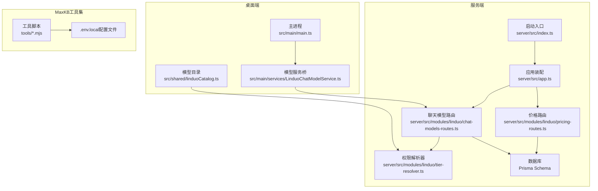
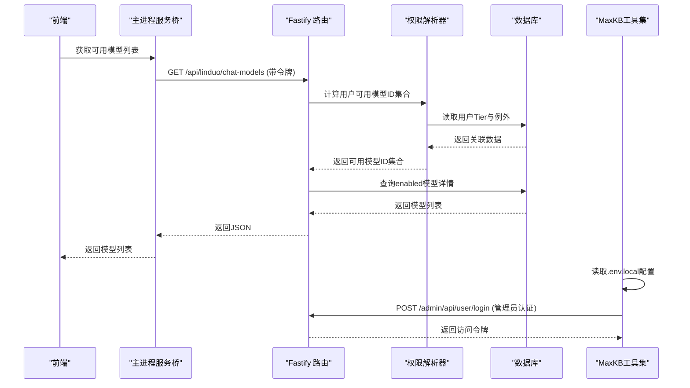
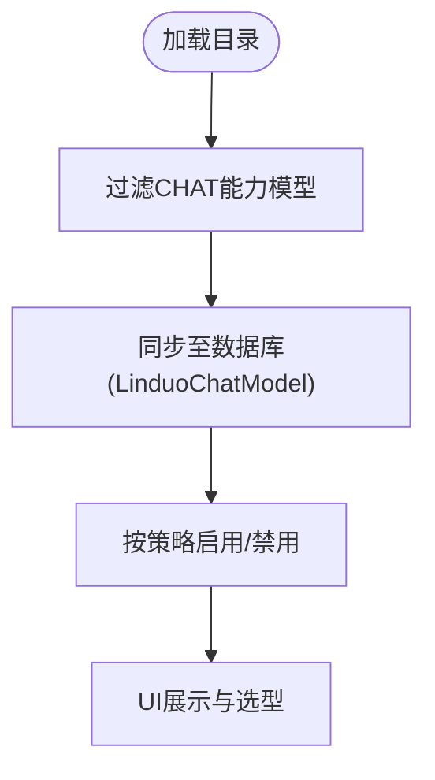
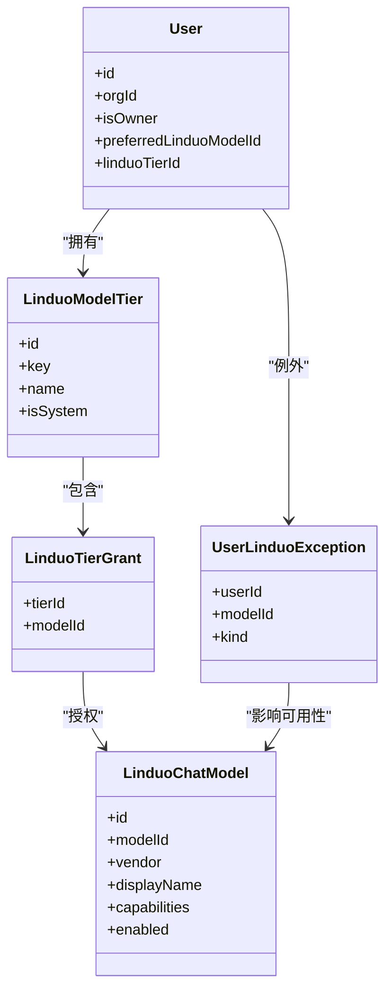
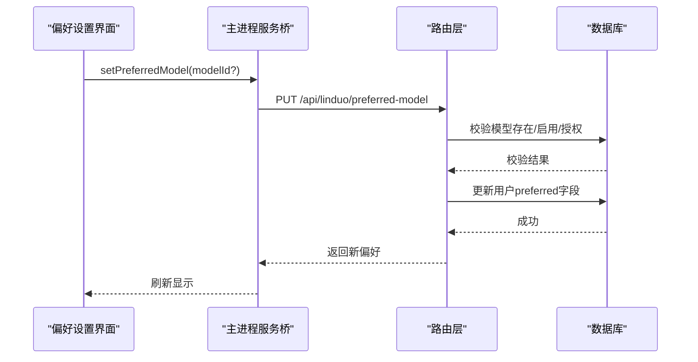
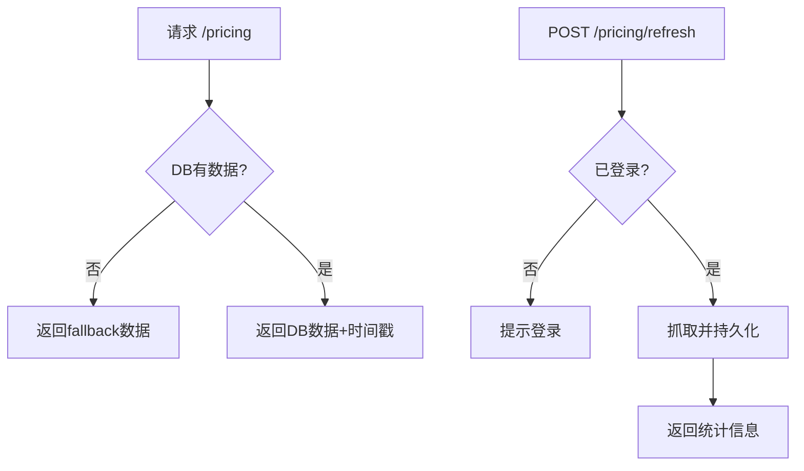
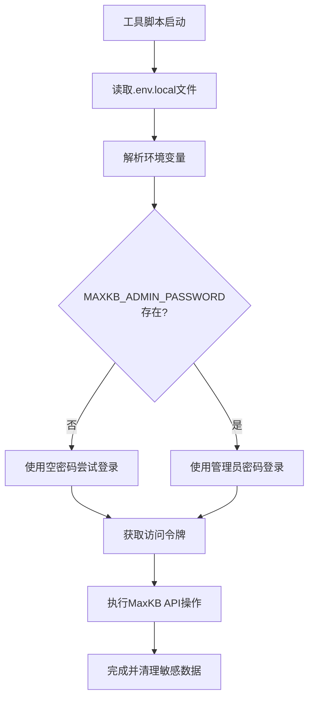
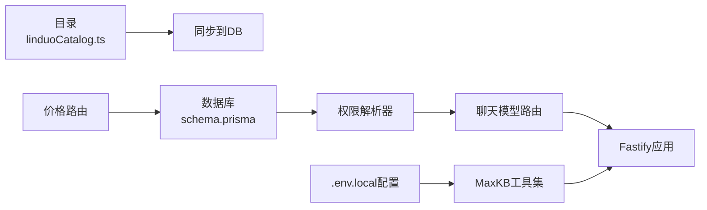

# 模型管理工具集

<cite>
**本文引用的文件**
- [package.json](file://package.json)
- [server/package.json](file://server/package.json)
- [src/main/main.ts](file://src/main/main.ts)
- [server/src/index.ts](file://server/src/index.ts)
- [server/src/app.ts](file://server/src/app.ts)
- [server/prisma/schema.prisma](file://server/prisma/schema.prisma)
- [server/src/modules/linduo/chat-models-routes.ts](file://server/src/modules/linduo/chat-models-routes.ts)
- [server/src/modules/linduo/tier-resolver.ts](file://server/src/modules/linduo/tier-resolver.ts)
- [server/src/modules/linduo/pricing-routes.ts](file://server/src/modules/linduo/pricing-routes.ts)
- [src/shared/linduoCatalog.ts](file://src/shared/linduoCatalog.ts)
- [src/main/services/LinduoChatModelService.ts](file://src/main/services/LinduoChatModelService.ts)
- [tools/add-maxkb-linduo-model.mjs](file://tools/add-maxkb-linduo-model.mjs)
- [tools/verify-maxkb-knowledge.mjs](file://tools/verify-maxkb-knowledge.mjs)
- [tools/probe-maxkb-graph.ts](file://tools/probe-maxkb-graph.ts)
- [tools/add-maxkb-linduo-image-models.mjs](file://tools/add-maxkb-linduo-image-models.mjs)
- [tools/diagnose-selection-researcher.mjs](file://tools/diagnose-selection-researcher.mjs)
- [tools/update-selection-researcher-workflow.mjs](file://tools/update-selection-researcher-workflow.mjs)
- [tools/verify-stage2-regression.ts](file://tools/verify-stage2-regression.ts)
</cite>

## 更新摘要
**变更内容**
- 更新了MaxKB集成工具集的环境变量认证机制，确保管理员密码从.env.local文件正确读取
- 所有11个工具脚本现在统一使用env.MAXKB_ADMIN_PASSWORD而非process.env.MAXKB_ADMIN_PASSWORD
- 改进了认证流程的可靠性和安全性

## 目录
1. [简介](#简介)
2. [项目结构](#项目结构)
3. [核心组件](#核心组件)
4. [架构总览](#架构总览)
5. [详细组件分析](#详细组件分析)
6. [依赖关系分析](#依赖关系分析)
7. [性能与扩展性](#性能与扩展性)
8. [故障排查指南](#故障排查指南)
9. [结论](#结论)

## 简介
本仓库是一个面向跨境电商选品与素材工作台的桌面应用，包含 Electron 主进程、Web 渲染层以及独立的 Fastify 服务端。模型管理工具集聚焦于"零度API（Linduo）"聊天模型的统一治理：包括模型目录白名单、用户/组织级权限分层（Tier + Exception）、偏好模型选择、价格抓取与展示等。通过前后端协作，实现"可见可用可审计"的模型管理能力。

**最新更新**：MaxKB集成工具集的环境变量认证问题已修复，包括管理员密码从.env.local文件正确读取的改进。所有11个工具脚本现在使用env.MAXKB_ADMIN_PASSWORD而非process.env.MAXKB_ADMIN_PASSWORD，确保认证流程正常工作。

## 项目结构
- 桌面端（Electron）
  - 主进程负责服务编排、IPC 桥接、本地资源与外部服务调用。
  - 渲染层提供 UI，调用主进程或直接访问后端 API。
- 服务端（Fastify）
  - 提供 REST API，集中处理鉴权、路由、数据库操作与业务逻辑。
  - 使用 Prisma 管理 PostgreSQL 数据模型与迁移。
- 共享契约
  - 前后端共享的类型定义与常量（如 Linduo 模型目录）。
- MaxKB集成工具集
  - 提供MaxKB知识库管理的命令行工具，支持模型注册、知识验证等功能。

**图表来源**
- [src/main/main.ts:1-120](file://src/main/main.ts#L1-L120)
- [src/main/services/LinduoChatModelService.ts:1-221](file://src/main/services/LinduoChatModelService.ts#L1-L221)
- [src/shared/linduoCatalog.ts:1-86](file://src/shared/linduoCatalog.ts#L1-L86)
- [server/src/app.ts:1-81](file://server/src/app.ts#L1-L81)
- [server/src/index.ts:1-53](file://server/src/index.ts#L1-L53)
- [server/src/modules/linduo/chat-models-routes.ts:1-396](file://server/src/modules/linduo/chat-models-routes.ts#L1-L396)
- [server/src/modules/linduo/tier-resolver.ts:1-83](file://server/src/modules/linduo/tier-resolver.ts#L1-L83)
- [server/src/modules/linduo/pricing-routes.ts:1-117](file://server/src/modules/linduo/pricing-routes.ts#L1-L117)
- [server/prisma/schema.prisma:1-410](file://server/prisma/schema.prisma#L1-L410)

**章节来源**
- [package.json:1-53](file://package.json#L1-L53)
- [server/package.json:1-47](file://server/package.json#L1-L47)

## 核心组件
- 模型目录白名单：集中维护支持的模型清单与能力标签，作为系统"真值源"。
- 权限与分层（Tier + Exception）：基于用户所属 Tier 授予默认模型集合，并通过例外表进行细粒度增删。
- 偏好模型：用户可设置首选模型，受白名单校验保护。
- 价格抓取：定时或手动抓取模型定价信息，持久化到数据库并提供查询接口。
- IPC 桥与服务端路由：主进程通过服务封装调用后端 API，路由层实现鉴权、校验与审计。
- **MaxKB环境变量认证**：统一的.env.local文件读取机制，确保管理员凭据安全加载。

**章节来源**
- [src/shared/linduoCatalog.ts:1-86](file://src/shared/linduoCatalog.ts#L1-L86)
- [server/src/modules/linduo/tier-resolver.ts:1-83](file://server/src/modules/linduo/tier-resolver.ts#L1-L83)
- [server/src/modules/linduo/chat-models-routes.ts:1-396](file://server/src/modules/linduo/chat-models-routes.ts#L1-L396)
- [server/src/modules/linduo/pricing-routes.ts:1-117](file://server/src/modules/linduo/pricing-routes.ts#L1-L117)
- [src/main/services/LinduoChatModelService.ts:1-221](file://src/main/services/LinduoChatModelService.ts#L1-L221)

## 架构总览
- 启动阶段
  - 服务端启动后执行模型同步、Tier 预置、OWNER 对齐与例外兜底。
  - 注册 CORS、JWT、认证插件与所有模块路由。
- 运行时
  - 前端通过主进程的服务桥调用后端 /api/linduo/* 路由。
  - 路由层根据当前用户计算可用模型集合（Tier + Exception），并返回结果。
  - 价格模块支持登录态管理与定时抓取，提供最新定价数据。
- **MaxKB工具集认证流程**
  - 工具脚本从.env.local文件读取配置，包括MAXKB_BASE_URL和MAXKB_ADMIN_PASSWORD。
  - 使用读取的管理员密码进行MaxKB API认证，获取访问令牌。
  - 所有工具脚本统一使用env对象访问环境变量，避免直接访问process.env。

**图表来源**
- [server/src/index.ts:17-42](file://server/src/index.ts#L17-L42)
- [server/src/app.ts:24-79](file://server/src/app.ts#L24-L79)
- [server/src/modules/linduo/chat-models-routes.ts:150-158](file://server/src/modules/linduo/chat-models-routes.ts#L150-L158)
- [server/src/modules/linduo/tier-resolver.ts:24-73](file://server/src/modules/linduo/tier-resolver.ts#L24-L73)
- [tools/verify-maxkb-knowledge.mjs:18-46](file://tools/verify-maxkb-knowledge.mjs#L18-L46)

## 详细组件分析

### 模型目录白名单（LINDUO_MODELS）
- 作用：集中声明支持的模型 ID、厂商、能力、描述与上下文标签，作为全链路"真值源"。
- 约束：前后端需保持严格一致；脚本会校验一致性，防止漂移。
- 使用：启动时用于同步到数据库，供权限计算与 UI 展示。

**图表来源**
- [src/shared/linduoCatalog.ts:28-85](file://src/shared/linduoCatalog.ts#L28-L85)

**章节来源**
- [src/shared/linduoCatalog.ts:1-86](file://src/shared/linduoCatalog.ts#L1-L86)

### 权限与分层（Tier + Exception）
- 公式：可用模型 = (用户所在 Tier 的 grants) ∪ (GRANT 例外) − (REVOKE 例外)。
- 特性：
  - 管理员可配置每个 Tier 的模型集合。
  - 可对特定用户添加 GRANT/REVOKE 例外。
  - OWNER 强制绑定 full Tier，不可降级。
  - 设置偏好模型时需再次校验是否可用。

**图表来源**
- [server/prisma/schema.prisma:334-406](file://server/prisma/schema.prisma#L334-L406)
- [server/src/modules/linduo/tier-resolver.ts:24-83](file://server/src/modules/linduo/tier-resolver.ts#L24-L83)
- [server/src/modules/linduo/chat-models-routes.ts:257-293](file://server/src/modules/linduo/chat-models-routes.ts#L257-L293)

**章节来源**
- [server/src/modules/linduo/tier-resolver.ts:1-83](file://server/src/modules/linduo/tier-resolver.ts#L1-L83)
- [server/src/modules/linduo/chat-models-routes.ts:150-396](file://server/src/modules/linduo/chat-models-routes.ts#L150-L396)
- [server/prisma/schema.prisma:334-406](file://server/prisma/schema.prisma#L334-L406)

### 偏好模型管理
- 功能：查询与设置当前用户的 preferred model。
- 安全：设置前校验模型存在、已启用且用户具备使用权。
- 审计：记录变更事件。

**图表来源**
- [server/src/modules/linduo/chat-models-routes.ts:360-395](file://server/src/modules/linduo/chat-models-routes.ts#L360-L395)
- [src/main/services/LinduoChatModelService.ts:122-140](file://src/main/services/LinduoChatModelService.ts#L122-L140)

**章节来源**
- [server/src/modules/linduo/chat-models-routes.ts:360-395](file://server/src/modules/linduo/chat-models-routes.ts#L360-L395)
- [src/main/services/LinduoChatModelService.ts:122-140](file://src/main/services/LinduoChatModelService.ts#L122-L140)

### 价格抓取与展示
- 功能：
  - 查询最新价格（优先 DB，空则回退）。
  - 登录态管理（用户名密码自动登录，保存加密密码与 Cookie）。
  - 立即触发抓取或定时任务。
- 权限：基础查询需登录；登录/刷新需更高权限。

**图表来源**
- [server/src/modules/linduo/pricing-routes.ts:53-117](file://server/src/modules/linduo/pricing-routes.ts#L53-L117)

**章节来源**
- [server/src/modules/linduo/pricing-routes.ts:1-117](file://server/src/modules/linduo/pricing-routes.ts#L1-L117)

### MaxKB环境变量认证机制
- **统一配置读取**：所有工具脚本从.env.local文件读取配置，包括MAXKB_BASE_URL和MAXKB_ADMIN_PASSWORD。
- **安全认证流程**：使用读取的管理员密码进行MaxKB API认证，获取访问令牌。
- **标准化实现**：所有11个工具脚本统一使用env对象访问环境变量，避免直接访问process.env。
- **错误处理**：完善的错误处理和日志输出，便于问题诊断。

**图表来源**
- [tools/verify-maxkb-knowledge.mjs:18-46](file://tools/verify-maxkb-knowledge.mjs#L18-L46)
- [tools/add-maxkb-linduo-model.mjs:24-47](file://tools/add-maxkb-linduo-model.mjs#L24-L47)
- [tools/probe-maxkb-graph.ts:4-9](file://tools/probe-maxkb-graph.ts#L4-L9)

**章节来源**
- [tools/verify-maxkb-knowledge.mjs:18-59](file://tools/verify-maxkb-knowledge.mjs#L18-L59)
- [tools/add-maxkb-linduo-model.mjs:24-47](file://tools/add-maxkb-linduo-model.mjs#L24-L47)
- [tools/probe-maxkb-graph.ts:4-9](file://tools/probe-maxkb-graph.ts#L4-L9)
- [tools/add-maxkb-linduo-image-models.mjs:27-47](file://tools/add-maxkb-linduo-image-models.mjs#L27-L47)
- [tools/diagnose-selection-researcher.mjs:16-31](file://tools/diagnose-selection-researcher.mjs#L16-L31)
- [tools/update-selection-researcher-workflow.mjs:284-291](file://tools/update-selection-researcher-workflow.mjs#L284-L291)
- [tools/verify-stage2-regression.ts:33-46](file://tools/verify-stage2-regression.ts#L33-L46)

### 主进程服务桥（IPC 封装）
- 职责：将前端对模型管理的调用封装为 HTTP 请求，统一加令牌、超时与错误处理。
- 覆盖端点：列出模型、切换启用、例外管理、偏好模型、Tier 管理等。

**章节来源**
- [src/main/services/LinduoChatModelService.ts:1-221](file://src/main/services/LinduoChatModelService.ts#L1-L221)

## 依赖关系分析
- 目录与数据库
  - 目录文件驱动模型同步，确保数据库中的 LinduoChatModel 与静态目录一致。
- 权限与路由
  - 路由层依赖权限解析器计算可用模型集合，再结合 enabled 状态返回最终列表。
- 价格模块
  - 依赖登录态与抓取器，持久化到数据库，对外提供稳定查询。
- **MaxKB工具集依赖**
  - 工具脚本依赖.env.local配置文件，统一管理环境变量。
  - 所有工具脚本相互独立，但共享相同的认证机制。

**图表来源**
- [src/shared/linduoCatalog.ts:1-86](file://src/shared/linduoCatalog.ts#L1-L86)
- [server/prisma/schema.prisma:334-406](file://server/prisma/schema.prisma#L334-L406)
- [server/src/modules/linduo/tier-resolver.ts:1-83](file://server/src/modules/linduo/tier-resolver.ts#L1-L83)
- [server/src/modules/linduo/chat-models-routes.ts:1-396](file://server/src/modules/linduo/chat-models-routes.ts#L1-L396)
- [server/src/modules/linduo/pricing-routes.ts:1-117](file://server/src/modules/linduo/pricing-routes.ts#L1-L117)

**章节来源**
- [server/src/app.ts:24-79](file://server/src/app.ts#L24-L79)
- [server/src/index.ts:17-42](file://server/src/index.ts#L17-L42)

## 性能与扩展性
- 权限计算
  - 单次用户查询 + Tier grants 查询 + 例外解析，复杂度低，适合高频调用。
- 目录同步
  - 启动时批量同步，避免运行时频繁 IO。
- 价格抓取
  - 支持定时任务与手动刷新，失败时回退到 fallback，保证可用性。
- **MaxKB工具集优化**
  - 统一的环境变量读取机制，减少重复代码。
  - 内存中缓存配置，避免重复文件IO。
  - 支持CI/CD环境下的非交互式认证。
- 可扩展点
  - 新增模型只需更新目录并运行同步；新增 Tier 或例外即可快速调整权限。
  - 新增MaxKB工具脚本可复用现有认证框架。

## 故障排查指南
- 无法看到某些模型
  - 检查用户是否被分配了相应 Tier，或是否存在 REVOKE 例外。
  - 确认模型在数据库中 enabled=true。
- 设置偏好模型失败
  - 检查所选模型是否存在、是否启用、用户是否具备使用权。
- 价格数据为空或过期
  - 检查登录态是否有效；尝试手动刷新抓取；查看是否全部 stale。
- 权限不足
  - 确认当前用户角色是否具备 member.manage 或 ai.use 权限。
- **MaxKB工具集认证问题**
  - 检查.env.local文件中是否正确配置MAXKB_BASE_URL和MAXKB_ADMIN_PASSWORD。
  - 确认管理员密码正确且MaxKB服务可访问。
  - 查看工具脚本的错误日志输出，定位具体认证失败原因。

**章节来源**
- [server/src/modules/linduo/chat-models-routes.ts:160-179](file://server/src/modules/linduo/chat-models-routes.ts#L160-L179)
- [server/src/modules/linduo/chat-models-routes.ts:360-395](file://server/src/modules/linduo/chat-models-routes.ts#L360-L395)
- [server/src/modules/linduo/pricing-routes.ts:53-117](file://server/src/modules/linduo/pricing-routes.ts#L53-L117)

## 结论
模型管理工具集以"目录白名单 + 分层授权 + 偏好模型 + 价格抓取"为核心，构建了完整、可控、可审计的模型治理能力。通过清晰的权限公式与严格的校验流程，既保证了灵活性，又确保了安全性与稳定性。**最新的MaxKB集成工具集环境变量认证修复**进一步提升了系统的可靠性和安全性，确保所有工具脚本能够正确读取管理员凭据并进行认证。未来可在更多维度扩展（如用量计量、成本核算、灰度发布等），进一步提升模型使用的精细化运营能力。