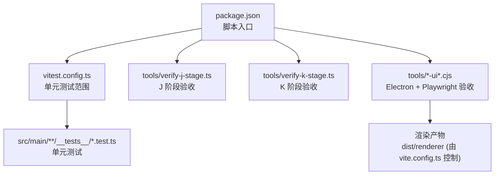
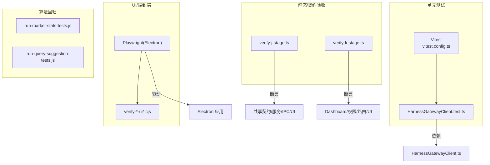
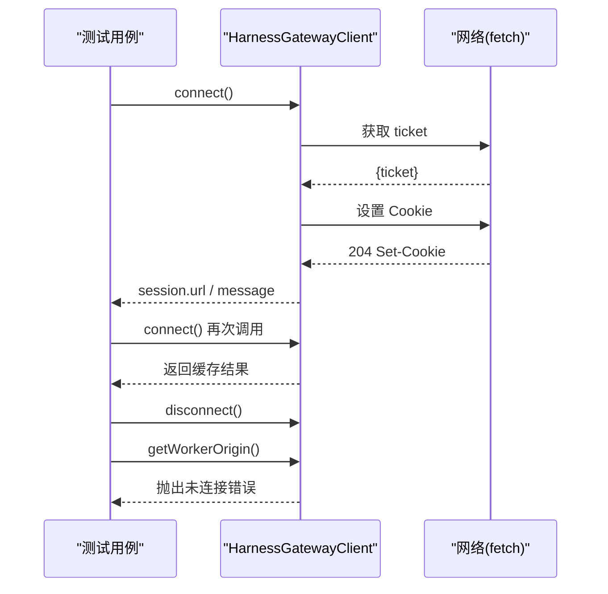
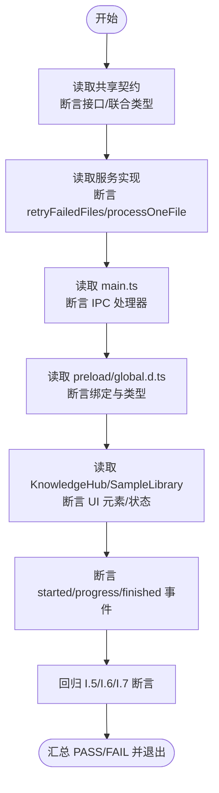
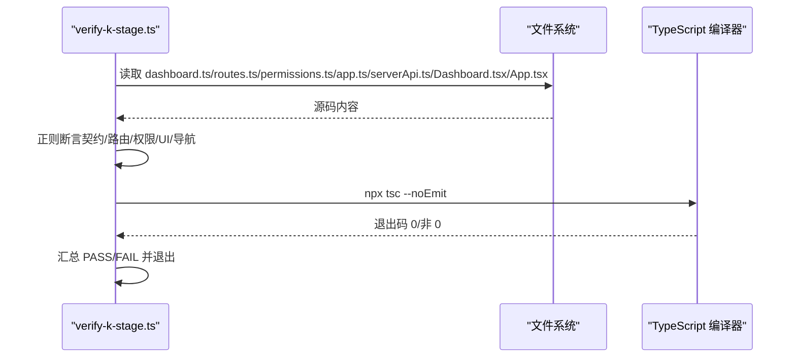
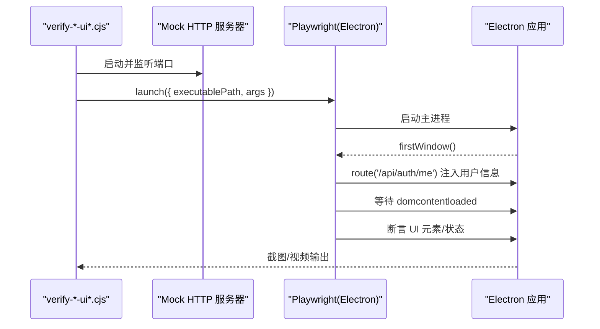
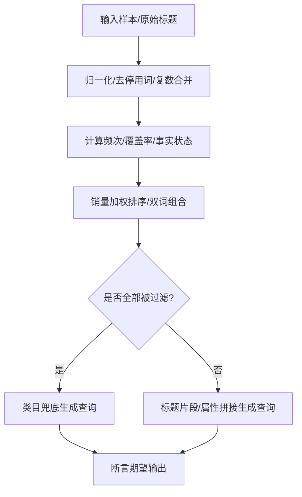
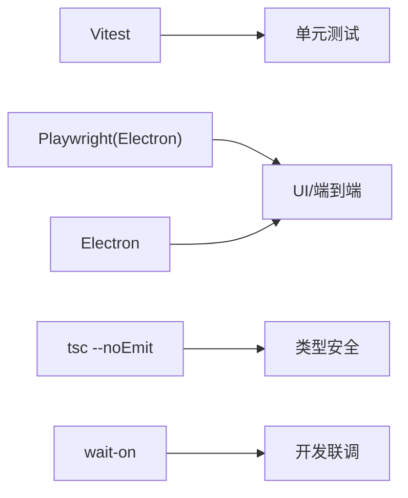

# 测试基础设施

<cite>
**本文引用的文件**
- [package.json](file://package.json)
- [vitest.config.ts](file://vitest.config.ts)
- [vite.config.ts](file://vite.config.ts)
- [tools/verify-j-stage.ts](file://tools/verify-j-stage.ts)
- [tools/verify-k-stage.ts](file://tools/verify-k-stage.ts)
- [src/main/advisor/__tests__/HarnessGatewayClient.test.ts](file://src/main/advisor/__tests__/HarnessGatewayClient.test.ts)
- [src/main/advisor/HarnessGatewayClient.ts](file://src/main/advisor/HarnessGatewayClient.ts)
- [tools/verify-amazon-completeness-ui-stage5.cjs](file://tools/verify-amazon-completeness-ui-stage5.cjs)
- [tools/verify-selection-report-renderer-ui.cjs](file://tools/verify-selection-report-renderer-ui.cjs)
- [.tmp-ui-verify/run-market-stats-tests.js](file://.tmp-ui-verify/run-market-stats-tests.js)
- [.tmp-ui-verify/run-query-suggestion-tests.js](file://.tmp-ui-verify/run-query-suggestion-tests.js)
</cite>

## 目录
1. [简介](#简介)
2. [项目结构](#项目结构)
3. [核心组件](#核心组件)
4. [架构总览](#架构总览)
5. [详细组件分析](#详细组件分析)
6. [依赖关系分析](#依赖关系分析)
7. [性能与稳定性考量](#性能与稳定性考量)
8. [故障排查指南](#故障排查指南)
9. [结论](#结论)
10. [附录](#附录)

## 简介
本仓库的测试基础设施围绕“单元/集成/回归/UI 验收”四个层次构建，覆盖主进程逻辑、共享契约、服务端聚合、前端 UI 与 Electron 应用整体流程。其目标是在不启动完整 GUI 的前提下快速验证关键路径，并在需要时通过 Playwright/Electron 驱动进行端到端验收。

## 项目结构
测试相关的关键位置与职责：
- 根级配置
  - package.json：定义脚本入口（如 verify:j、verify:k）与依赖（electron、vitest、wait-on 等）。
  - vitest.config.ts：限定单元测试范围（仅 src/main/**/__tests__/*.test.ts），运行环境为 node。
  - vite.config.ts：渲染端构建配置（非测试核心，但影响 UI 测试产物）。
- 阶段化验收脚本
  - tools/verify-j-stage.ts：J 阶段守卫（守护运行监控、失败重试、进度事件）的多维度断言。
  - tools/verify-k-stage.ts：K 阶段团队工作台首页守卫（契约、服务端路由、权限、前端 API/UI、导航、tsc 校验）。
- 单元测试
  - src/main/advisor/__tests__/HarnessGatewayClient.test.ts：对 HarnessGatewayClient 的连接、缓存、并发、错误与事件监听进行测试。
- UI/端到端验收
  - tools/verify-*-ui*.cjs：基于 Playwright 的 Electron 模式，启动打包或开发态应用，注入数据并断言 UI 行为。
  - .tmp-ui-verify/*.js：针对市场统计、查询建议等算法的轻量回归测试。

**图表来源**
- [package.json:8-19](file://package.json#L8-L19)
- [vitest.config.ts:3-8](file://vitest.config.ts#L3-L8)
- [vite.config.ts:4-12](file://vite.config.ts#L4-L12)

**章节来源**
- [package.json:8-19](file://package.json#L8-L19)
- [vitest.config.ts:3-8](file://vitest.config.ts#L3-L8)
- [vite.config.ts:4-12](file://vite.config.ts#L4-L12)

## 核心组件
- 单元测试框架（Vitest）
  - 作用：对主进程模块进行快速、隔离的单元测试。
  - 关键点：仅扫描 src/main/**/__tests__/*.test.ts；Node 环境；关闭全局变量以避免污染。
- J 阶段验收脚本
  - 作用：以源码静态检查+正则匹配的方式，确保共享契约、服务实现、IPC、Preload、UI 与事件透传满足 J 阶段要求。
  - 特点：断言数量多（100+），按模块分组，失败即退出码 1。
- K 阶段验收脚本
  - 作用：覆盖共享契约、服务端路由、RBAC 权限、前端 API 客户端、Dashboard UI、导航与 tsc 编译校验。
  - 特点：同时执行 tsc --noEmit 校验主/渲染两端类型安全。
- UI/端到端验收
  - 作用：使用 Playwright 的 Electron 模式启动应用，注入 Mock 数据，断言页面元素、交互与状态。
  - 特点：输出截图/视频到 output/playwright/*，便于问题定位。
- 算法回归测试
  - 作用：对选品市场统计、查询建议等纯函数进行输入输出断言，保障算法稳定。

**章节来源**
- [vitest.config.ts:3-8](file://vitest.config.ts#L3-L8)
- [tools/verify-j-stage.ts:1-16](file://tools/verify-j-stage.ts#L1-L16)
- [tools/verify-k-stage.ts:1-9](file://tools/verify-k-stage.ts#L1-L9)
- [tools/verify-amazon-completeness-ui-stage5.cjs:1-15](file://tools/verify-amazon-completeness-ui-stage5.cjs#L1-L15)
- [.tmp-ui-verify/run-market-stats-tests.js:1-44](file://.tmp-ui-verify/run-market-stats-tests.js#L1-L44)
- [.tmp-ui-verify/run-query-suggestion-tests.js:1-60](file://.tmp-ui-verify/run-query-suggestion-tests.js#L1-L60)

## 架构总览
测试基础设施的分层与协作如下：
- 单元测试层：Vitest 直接加载主进程模块，模拟网络/文件系统，快速验证逻辑。
- 静态/契约层：J/K 阶段脚本读取源码并断言接口、方法、事件、权限、路由、UI 标记等。
- UI/端到端层：Playwright 驱动 Electron，启动真实窗口，注入数据并断言 UI。
- 算法回归层：独立脚本调用导出函数，断言输入输出一致性。

**图表来源**
- [vitest.config.ts:3-8](file://vitest.config.ts#L3-L8)
- [src/main/advisor/__tests__/HarnessGatewayClient.test.ts:1-11](file://src/main/advisor/__tests__/HarnessGatewayClient.test.ts#L1-L11)
- [tools/verify-j-stage.ts:1-16](file://tools/verify-j-stage.ts#L1-L16)
- [tools/verify-k-stage.ts:1-9](file://tools/verify-k-stage.ts#L1-L9)
- [tools/verify-amazon-completeness-ui-stage5.cjs:1-15](file://tools/verify-amazon-completeness-ui-stage5.cjs#L1-L15)
- [.tmp-ui-verify/run-market-stats-tests.js:1-44](file://.tmp-ui-verify/run-market-stats-tests.js#L1-L44)
- [.tmp-ui-verify/run-query-suggestion-tests.js:1-60](file://.tmp-ui-verify/run-query-suggestion-tests.js#L1-L60)

## 详细组件分析

### 组件一：HarnessGatewayClient 单元测试
- 目标：验证连接建立、Cookie 缓存、并发安全、错误语义与事件监听。
- 关键断言：
  - connect() 首次成功会缓存 workerOrigin 与 Cookie。
  - 二次调用命中缓存，不重复请求。
  - 403/502 分别抛出特定错误（ADVISOR_FORBIDDEN/HARNESS_UNAVAILABLE）。
  - 并发 connect() 只发起一次真实请求。
  - disconnect() 后访问 worker 抛错。
  - on("unavailable") 在 gateway 不可用时触发。

**图表来源**
- [src/main/advisor/__tests__/HarnessGatewayClient.test.ts:22-93](file://src/main/advisor/__tests__/HarnessGatewayClient.test.ts#L22-L93)
- [src/main/advisor/HarnessGatewayClient.ts](file://src/main/advisor/HarnessGatewayClient.ts)

**章节来源**
- [src/main/advisor/__tests__/HarnessGatewayClient.test.ts:1-95](file://src/main/advisor/__tests__/HarnessGatewayClient.test.ts#L1-L95)

### 组件二：J 阶段验收脚本
- 目标：确保“守卫运行监控 + 失败重试 + 长时运行进度条”的全链路实现符合设计。
- 覆盖范围：
  - 共享契约扩展（GuardianRetryRequest/Result、GuardianRunEvent 联合类型）。
  - 服务实现（retryFailedFiles、processOneFile 复用、软/硬回退、hash 跳过）。
  - IPC 处理器（kbGuardian:retry-failed、kbGuardian:get-log-detail、run-event 透传）。
  - Preload 绑定与 global.d.ts 声明。
  - UI 组件（KnowledgeHub/SampleLibrary 日志展开、重试按钮、进度条、notice）。
  - 事件流（started/progress/finished、sinceStartMs、增量统计）。
  - 回归断言（I.5/I.6/I.7 行为不变）。
- 执行方式：直接运行 tsx 脚本，断言失败则 exit(1)。

**图表来源**
- [tools/verify-j-stage.ts:37-320](file://tools/verify-j-stage.ts#L37-L320)

**章节来源**
- [tools/verify-j-stage.ts:1-334](file://tools/verify-j-stage.ts#L1-L334)

### 组件三：K 阶段验收脚本
- 目标：团队工作台首页全链路验收（契约、服务端、权限、前端 API/UI、导航、tsc 校验）。
- 覆盖范围：
  - 共享契约（DashboardKpiKey、DashboardSummary、MyTodo、TeamActivity 等）。
  - 服务端路由（GET /summary、权限守卫 dashboard.view、authenticate hook、KPI 聚合、myTodos/teamActivities）。
  - RBAC 权限（dashboard.view 在 OWNER/OPERATOR/PUBLISHER/VIEWER 中的覆盖）。
  - 前端 API（fetchDashboardSummary 调用 /api/dashboard/summary）。
  - UI（Dashboard.tsx 数据-testid、刷新间隔、状态管理；dashboard.css 主题与响应式）。
  - 导航（App.tsx 默认页、菜单项、权限控制）。
  - 类型安全（tsc --noEmit 主/渲染两端）。

**图表来源**
- [tools/verify-k-stage.ts:47-279](file://tools/verify-k-stage.ts#L47-L279)

**章节来源**
- [tools/verify-k-stage.ts:1-298](file://tools/verify-k-stage.ts#L1-L298)

### 组件四：UI/端到端验收（Electron + Playwright）
- 目标：在真实 Electron 环境中验证 UI 与交互，支持截图/视频输出。
- 典型流程：
  - 启动本地 HTTP 服务器提供 Mock 数据。
  - 通过 Playwright 的 _electron 启动 Electron 应用。
  - 注入登录态/路由参数，等待 DOM 就绪。
  - 断言页面元素、状态与交互结果。
  - 将截图/视频保存到 output/playwright/*。

**图表来源**
- [tools/verify-amazon-completeness-ui-stage5.cjs:50-64](file://tools/verify-amazon-completeness-ui-stage5.cjs#L50-L64)
- [tools/verify-selection-report-renderer-ui.cjs:1-20](file://tools/verify-selection-report-renderer-ui.cjs#L1-L20)

**章节来源**
- [tools/verify-amazon-completeness-ui-stage5.cjs:50-64](file://tools/verify-amazon-completeness-ui-stage5.cjs#L50-L64)
- [tools/verify-selection-report-renderer-ui.cjs:1-20](file://tools/verify-selection-report-renderer-ui.cjs#L1-L20)

### 组件五：算法回归测试
- 目标：对选品市场统计、查询建议等纯函数进行输入输出断言，保障算法稳定。
- 示例：
  - run-market-stats-tests.js：词形归一、复数合并、销量加权排序、停用词过滤、空样本安全。
  - run-query-suggestion-tests.js：标题/类目/属性组合生成查询建议，边界情况兜底。

**图表来源**
- [.tmp-ui-verify/run-market-stats-tests.js:1-44](file://.tmp-ui-verify/run-market-stats-tests.js#L1-L44)
- [.tmp-ui-verify/run-query-suggestion-tests.js:1-60](file://.tmp-ui-verify/run-query-suggestion-tests.js#L1-L60)

**章节来源**
- [.tmp-ui-verify/run-market-stats-tests.js:1-44](file://.tmp-ui-verify/run-market-stats-tests.js#L1-L44)
- [.tmp-ui-verify/run-query-suggestion-tests.js:1-60](file://.tmp-ui-verify/run-query-suggestion-tests.js#L1-L60)

## 依赖关系分析
- 测试工具链
  - Vitest：用于主进程单元测试，严格限制测试文件范围，避免误测渲染代码。
  - Playwright（Electron 模式）：用于 UI/端到端验收，支持截图/视频与路由拦截。
  - TypeScript 编译器：K 阶段脚本调用 tsc --noEmit 保证类型安全。
- 运行时依赖
  - Electron：UI 验收需要可执行路径或打包产物。
  - wait-on：开发模式下等待后端/前端就绪后再启动应用。
- 外部服务
  - 部分 UI 测试通过内嵌 http.createServer 提供 Mock 数据，降低对外部服务的依赖。

**图表来源**
- [package.json:21-48](file://package.json#L21-L48)
- [vitest.config.ts:3-8](file://vitest.config.ts#L3-L8)
- [tools/verify-k-stage.ts:259-279](file://tools/verify-k-stage.ts#L259-L279)

**章节来源**
- [package.json:21-48](file://package.json#L21-L48)
- [vitest.config.ts:3-8](file://vitest.config.ts#L3-L8)
- [tools/verify-k-stage.ts:259-279](file://tools/verify-k-stage.ts#L259-L279)

## 性能与稳定性考量
- 单元测试
  - 使用 Node 环境与内存 mock，执行速度快，适合频繁运行。
  - 注意避免全局状态污染（已关闭 globals）。
- 阶段化验收
  - J/K 阶段脚本以静态断言为主，开销低，适合 CI 快速门禁。
  - 建议在并行流水线中拆分 J/K 任务，缩短总时长。
- UI/端到端
  - Electron 启动与渲染耗时较长，建议按需启用（如发布前或关键变更）。
  - 合理设置超时与重试策略，减少偶发失败。
- 算法回归
  - 纯函数测试无 IO，执行快且稳定，适合高频回归。

[本节为通用指导，无需具体文件引用]

## 故障排查指南
- 常见问题
  - 单元测试找不到文件：确认测试文件位于 src/main/**/__tests__/*.test.ts。
  - UI 测试无法启动 Electron：检查 executablePath 或打包产物是否存在。
  - 阶段脚本断言失败：根据输出定位具体断言点，核对源码是否包含预期字段/方法/事件。
  - tsc 类型错误：依据 K 阶段脚本输出的 stderr 定位类型问题。
- 定位技巧
  - 查看 output/playwright/* 下的截图/视频，结合断言 ID 定位 UI 问题。
  - 在阶段脚本中临时增加 console.log 或缩小断言范围，逐步定位。
  - 对于网络相关问题，优先使用内嵌 Mock 服务器隔离外部依赖。

**章节来源**
- [vitest.config.ts:3-8](file://vitest.config.ts#L3-L8)
- [tools/verify-amazon-completeness-ui-stage5.cjs:50-64](file://tools/verify-amazon-completeness-ui-stage5.cjs#L50-L64)
- [tools/verify-k-stage.ts:259-279](file://tools/verify-k-stage.ts#L259-L279)

## 结论
该测试基础设施通过分层策略实现了从单元到 UI 的全链路质量保障：
- 单元测试快速反馈主进程逻辑正确性。
- J/K 阶段脚本以强约束保障契约、服务、权限与 UI 的一致性。
- UI/端到端验收在真实环境中验证用户体验与交互。
- 算法回归确保核心数据处理逻辑稳定。
建议在生产流水线中组合使用这些工具，以实现高效、稳定的质量门禁。

[本节为总结性内容，无需具体文件引用]

## 附录
- 常用命令
  - 运行 J 阶段验收：pnpm verify:j
  - 运行 K 阶段验收：pnpm verify:k
  - 运行单元测试：pnpm test（由 Vitest 驱动）
  - 构建渲染端：pnpm build（由 Vite 驱动）

**章节来源**
- [package.json:8-19](file://package.json#L8-L19)