现在我已经收集了足够的信息来更新测试基础设施文档。基于分析，我发现了以下新增的托盘仓库测试基础设施：

1. **fixture-seed-pallet-warehouse.cjs** - 用于生成托盘仓库测试数据的fixture种子脚本
2. **verify-pallet-warehouse-ui.cjs** - 托盘仓库UI端到端测试
3. **verify-warehouse-review-actions.cjs** - 仓库审查操作验证工具

让我更新文档以反映这些新增的测试基础设施：

# 测试基础设施

<cite>
**本文引用的文件**
- [package.json](file://package.json)
- [vitest.config.ts](file://vitest.config.ts)
- [vite.config.ts](file://vite.config.ts)
- [tools/verify-j-stage.ts](file://tools/verify-j-stage.ts)
- [tools/verify-k-stage.ts](file://tools/verify-k-stage.ts)
- [src/main/advisor/__tests__/HarnessGatewayClient.test.ts](file://src/main/advisor/__tests__/HarnessGatewayClient.test.ts)
- [src/main/services/__tests__/AiEmployeeChatService.cancel.test.ts](file://src/main/services/__tests__/AiEmployeeChatService.cancel.test.ts)
- [src/main/services/AiEmployeeChatService.ts](file://src/main/services/AiEmployeeChatService.ts)
- [tools/verify-amazon-completeness-ui-stage5.cjs](file://tools/verify-amazon-completeness-ui-stage5.cjs)
- [tools/verify-selection-report-renderer-ui.cjs](file://tools/verify-selection-report-renderer-ui.cjs)
- [.tmp-ui-verify/run-market-stats-tests.js](file://.tmp-ui-verify/run-market-stats-tests.js)
- [.tmp-ui-verify/run-query-suggestion-tests.js](file://.tmp-ui-verify/run-query-suggestion-tests.js)
- [tools/verify-ai-employee-prompt-integration.ts](file://tools/verify-ai-employee-prompt-integration.ts)
- [tools/verify-ai-employee-stage-c.ts](file://tools/verify-ai-employee-stage-c.ts)
- [tools/verify-amazon-evidence-inference.ts](file://tools/verify-amazon-evidence-inference.ts)
- [tools/fixture-seed-pallet-warehouse.cjs](file://tools/fixture-seed-pallet-warehouse.cjs)
- [tools/verify-pallet-warehouse-ui.cjs](file://tools/verify-pallet-warehouse-ui.cjs)
- [tools/verify-warehouse-review-actions.cjs](file://tools/verify-warehouse-review-actions.cjs)
</cite>

## 更新摘要
**所做更改**
- 新增托盘仓库测试基础设施章节，包含fixture数据生成、UI验证和审查操作验证
- 扩展验证工具章节，涵盖新的托盘仓库端到端测试
- 更新测试架构总览图以反映新增的托盘仓库测试层次
- 增强详细组件分析部分，涵盖新的托盘仓库验证工具

## 目录
1. [简介](#简介)
2. [项目结构](#项目结构)
3. [核心组件](#核心组件)
4. [架构总览](#架构总览)
5. [详细组件分析](#详细组件分析)
6. [依赖关系分析](#依赖关系分析)
7. [性能与稳定性考量](#性能与稳定性考量)
8. [故障排查指南](#故障排查指南)
9. [结论](#结论)
10. [附录](#附录)

## 简介
本仓库的测试基础设施围绕"单元/集成/回归/UI 验收"四个层次构建，覆盖主进程逻辑、共享契约、服务端聚合、前端 UI 与 Electron 应用整体流程。其目标是在不启动完整 GUI 的前提下快速验证关键路径，并在需要时通过 Playwright/Electron 驱动进行端到端验收。

**更新** 新增了AI员工聊天服务取消功能的专门测试，以及多个端到端验证工具，进一步增强了测试覆盖范围和质量保障能力。**新增** 完整的托盘仓库测试基础设施，包括fixture数据生成、UI验证和审查操作验证工具。

## 项目结构
测试相关的关键位置与职责：
- 根级配置
  - package.json：定义脚本入口（如 verify:j、verify:k）与依赖（electron、vitest、wait-on 等）。
  - vitest.config.ts：限定单元测试范围（仅 src/main/**/__tests__/*.test.ts），运行环境为 node。
  - vite.config.ts：渲染端构建配置（非测试核心，但影响 UI 测试产物）。
- 阶段化验收脚本
  - tools/verify-j-stage.ts：J 阶段守卫（守护运行监控、失败重试、进度事件）的多维度断言。
  - tools/verify-k-stage.ts：K 阶段团队工作台首页守卫（契约、服务端路由、权限、前端 API/UI、导航、tsc 校验）。
- 单元测试
  - src/main/advisor/__tests__/HarnessGatewayClient.test.ts：对 HarnessGatewayClient 的连接、缓存、并发、错误与事件监听进行测试。
  - **新增** src/main/services/__tests__/AiEmployeeChatService.cancel.test.ts：对 AI 员工聊天服务的取消功能和模型白名单进行测试。
- UI/端到端验收
  - tools/verify-*-ui*.cjs：基于 Playwright 的 Electron 模式，启动打包或开发态应用，注入数据并断言 UI 行为。
  - **.tmp-ui-verify/*.js**：针对市场统计、查询建议等算法的轻量回归测试。
- **新增** 托盘仓库测试基础设施
  - tools/fixture-seed-pallet-warehouse.cjs：生成托盘仓库真实数据的fixture种子脚本
  - tools/verify-pallet-warehouse-ui.cjs：托盘仓库三区布局端到端UI验收
  - tools/verify-warehouse-review-actions.cjs：正式入库双按钮端到端UI验收
- **新增** 端到端验证工具
  - tools/verify-ai-employee-*：AI 员工相关的端到端验证工具
  - tools/verify-amazon-*：Amazon 相关的验证工具

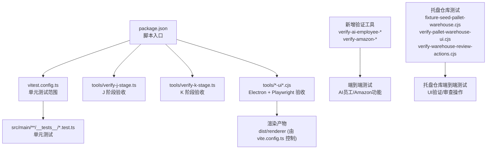
```mermaid
graph TB
A["package.json<br/>脚本入口"] --> B["vitest.config.ts<br/>单元测试范围"]
A --> C["tools/verify-j-stage.ts<br/>J 阶段验收"]
A --> D["tools/verify-k-stage.ts<br/>K 阶段验收"]
A --> E["tools/*-ui*.cjs<br/>Electron + Playwright 验收"]
B --> F["src/main/**/__tests__/*.test.ts<br/>单元测试"]
E --> G["渲染产物<br/>dist/renderer (由 vite.config.ts 控制)"]
H["新增验证工具<br/>verify-ai-employee-*<br/>verify-amazon-*"] --> I["端到端测试<br/>AI员工/Amazon功能"]
J["托盘仓库测试<br/>fixture-seed-pallet-warehouse.cjs<br/>verify-pallet-warehouse-ui.cjs<br/>verify-warehouse-review-actions.cjs"] --> K["托盘仓库端到端测试<br/>UI验证/审查操作"]
```

**图表来源**
- [package.json:8-19](file://package.json#L8-L19)
- [vitest.config.ts:3-8](file://vitest.config.ts#L3-L8)
- [vite.config.ts:4-12](file://vite.config.ts#L4-L12)

**章节来源**
- [package.json:8-19](file://package.json#L8-L19)
- [vitest.config.ts:3-8](file://vitest.config.ts#L3-L8)
- [vite.config.ts:4-12](file://vite.config.ts#L4-L12)

## 核心组件
- 单元测试框架（Vitest）
  - 作用：对主进程模块进行快速、隔离的单元测试。
  - 关键点：仅扫描 src/main/**/__tests__/*.test.ts；Node 环境；关闭全局变量以避免污染。
- J 阶段验收脚本
  - 作用：以源码静态检查+正则匹配的方式，确保共享契约、服务实现、IPC、Preload、UI 与事件透传满足 J 阶段要求。
  - 特点：断言数量多（100+），按模块分组，失败即退出码 1。
- K 阶段验收脚本
  - 作用：覆盖共享契约、服务端路由、RBAC 权限、前端 API 客户端、Dashboard UI、导航与 tsc 编译校验。
  - 特点：同时执行 tsc --noEmit 校验主/渲染两端类型安全。
- UI/端到端验收
  - 作用：使用 Playwright 的 Electron 模式启动应用，注入 Mock 数据，断言页面元素、交互与状态。
  - 特点：输出截图/视频到 output/playwright/*，便于问题定位。
- 算法回归测试
  - 作用：对选品市场统计、查询建议等纯函数进行输入输出断言，保障算法稳定。
- **新增** AI 员工聊天服务测试
  - 作用：专门测试 AI 员工聊天服务的取消功能和模型白名单机制。
  - 特点：验证 AbortController 的正确使用、重复取消的安全性、岗位白名单过滤。
- **新增** 托盘仓库测试基础设施
  - 作用：提供完整的托盘仓库测试解决方案，包括fixture数据生成、UI验证和审查操作验证。
  - 特点：支持多种测试模式（pallet/review/review-page），使用本地mock服务器处理权限校验。
- **新增** 端到端验证工具
  - 作用：提供完整的 AI 员工和 Amazon 功能验证，包括提示词集成、证据推断等。
  - 特点：复用真实 fixture，验证端到端流程的完整性。

**章节来源**
- [vitest.config.ts:3-8](file://vitest.config.ts#L3-L8)
- [tools/verify-j-stage.ts:1-16](file://tools/verify-j-stage.ts#L1-L16)
- [tools/verify-k-stage.ts:1-9](file://tools/verify-k-stage.ts#L1-L9)
- [tools/verify-amazon-completeness-ui-stage5.cjs:1-15](file://tools/verify-amazon-completeness-ui-stage5.cjs#L1-L15)
- [.tmp-ui-verify/run-market-stats-tests.js:1-44](file://.tmp-ui-verify/run-market-stats-tests.js#L1-L44)
- [.tmp-ui-verify/run-query-suggestion-tests.js:1-60](file://.tmp-ui-verify/run-query-suggestion-tests.js#L1-L60)
- [src/main/services/__tests__/AiEmployeeChatService.cancel.test.ts:1-65](file://src/main/services/__tests__/AiEmployeeChatService.cancel.test.ts#L1-L65)
- [tools/verify-ai-employee-prompt-integration.ts:1-22](file://tools/verify-ai-employee-prompt-integration.ts#L1-L22)
- [tools/fixture-seed-pallet-warehouse.cjs:1-114](file://tools/fixture-seed-pallet-warehouse.cjs#L1-L114)
- [tools/verify-pallet-warehouse-ui.cjs:1-486](file://tools/verify-pallet-warehouse-ui.cjs#L1-L486)
- [tools/verify-warehouse-review-actions.cjs:1-132](file://tools/verify-warehouse-review-actions.cjs#L1-L132)

## 架构总览
测试基础设施的分层与协作如下：
- 单元测试层：Vitest 直接加载主进程模块，模拟网络/文件系统，快速验证逻辑。
- 静态/契约层：J/K 阶段脚本读取源码并断言接口、方法、事件、权限、路由、UI 标记等。
- UI/端到端层：Playwright 驱动 Electron，启动真实窗口，注入数据并断言 UI。
- 算法回归层：独立脚本调用导出函数，断言输入输出一致性。
- **新增** 托盘仓库测试层：专门的fixture生成和UI验证工具，覆盖托盘仓库全流程。
- **新增** AI 员工验证层：专门的端到端验证工具，覆盖 AI 员工聊天、提示词集成、证据推断等功能。

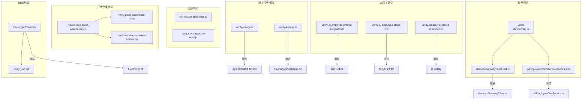
```mermaid
graph TB
subgraph "单元测试"
V["Vitest<br/>vitest.config.ts"] --> T1["HarnessGatewayClient.test.ts"]
V --> T2["AiEmployeeChatService.cancel.test.ts"]
end
subgraph "静态/契约验收"
J["verify-j-stage.ts"]
K["verify-k-stage.ts"]
end
subgraph "UI/端到端"
P["Playwright(Electron)"] --> U1["verify-*-ui*.cjs"]
end
subgraph "算法回归"
R1["run-market-stats-tests.js"]
R2["run-query-suggestion-tests.js"]
end
subgraph "托盘仓库测试"
F["fixture-seed-pallet-warehouse.cjs"]
U2["verify-pallet-warehouse-ui.cjs"]
U3["verify-warehouse-review-actions.cjs"]
end
subgraph "AI员工验证"
A1["verify-ai-employee-prompt-integration.ts"]
A2["verify-ai-employee-stage-c.ts"]
A3["verify-amazon-evidence-inference.ts"]
end
T1 --> |"依赖"| H["HarnessGatewayClient.ts"]
T2 --> |"测试"| S["AiEmployeeChatService.ts"]
J --> |"断言"| S1["共享契约/服务/IPC/UI"]
K --> |"断言"| S2["Dashboard/权限/路由/UI"]
P --> |"驱动"| App["Electron 应用"]
F --> U2
F --> U3
A1 --> |"验证"| Prompt["提示词集成"]
A2 --> |"验证"| StageC["阶段C交付物"]
A3 --> |"验证"| Evidence["证据推断"]
```

**图表来源**
- [vitest.config.ts:3-8](file://vitest.config.ts#L3-L8)
- [src/main/advisor/__tests__/HarnessGatewayClient.test.ts:1-11](file://src/main/advisor/__tests__/HarnessGatewayClient.test.ts#L1-L11)
- [src/main/services/__tests__/AiEmployeeChatService.cancel.test.ts:1-65](file://src/main/services/__tests__/AiEmployeeChatService.cancel.test.ts#L1-L65)
- [tools/verify-j-stage.ts:1-16](file://tools/verify-j-stage.ts#L1-L16)
- [tools/verify-k-stage.ts:1-9](file://tools/verify-k-stage.ts#L1-L9)
- [tools/verify-amazon-completeness-ui-stage5.cjs:1-15](file://tools/verify-amazon-completeness-ui-stage5.cjs#L1-L15)
- [.tmp-ui-verify/run-market-stats-tests.js:1-44](file://.tmp-ui-verify/run-market-stats-tests.js#L1-L44)
- [.tmp-ui-verify/run-query-suggestion-tests.js:1-60](file://.tmp-ui-verify/run-query-suggestion-tests.js#L1-L60)
- [tools/verify-ai-employee-prompt-integration.ts:1-22](file://tools/verify-ai-employee-prompt-integration.ts#L1-L22)
- [tools/verify-ai-employee-stage-c.ts:1-17](file://tools/verify-ai-employee-stage-c.ts#L1-L17)
- [tools/verify-amazon-evidence-inference.ts:1-11](file://tools/verify-amazon-evidence-inference.ts#L1-L11)
- [tools/fixture-seed-pallet-warehouse.cjs:1-114](file://tools/fixture-seed-pallet-warehouse.cjs#L1-L114)
- [tools/verify-pallet-warehouse-ui.cjs:1-486](file://tools/verify-pallet-warehouse-ui.cjs#L1-L486)
- [tools/verify-warehouse-review-actions.cjs:1-132](file://tools/verify-warehouse-review-actions.cjs#L1-L132)

## 详细组件分析

### 组件一：HarnessGatewayClient 单元测试
- 目标：验证连接建立、Cookie 缓存、并发安全、错误语义与事件监听。
- 关键断言：
  - connect() 首次成功会缓存 workerOrigin 与 Cookie。
  - 二次调用命中缓存，不重复请求。
  - 403/502 分别抛出特定错误（ADVISOR_FORBIDDEN/HARNESS_UNAVAILABLE）。
  - 并发 connect() 只发起一次真实请求。
  - disconnect() 后访问 worker 抛错。
  - on("unavailable") 在 gateway 不可用时触发。

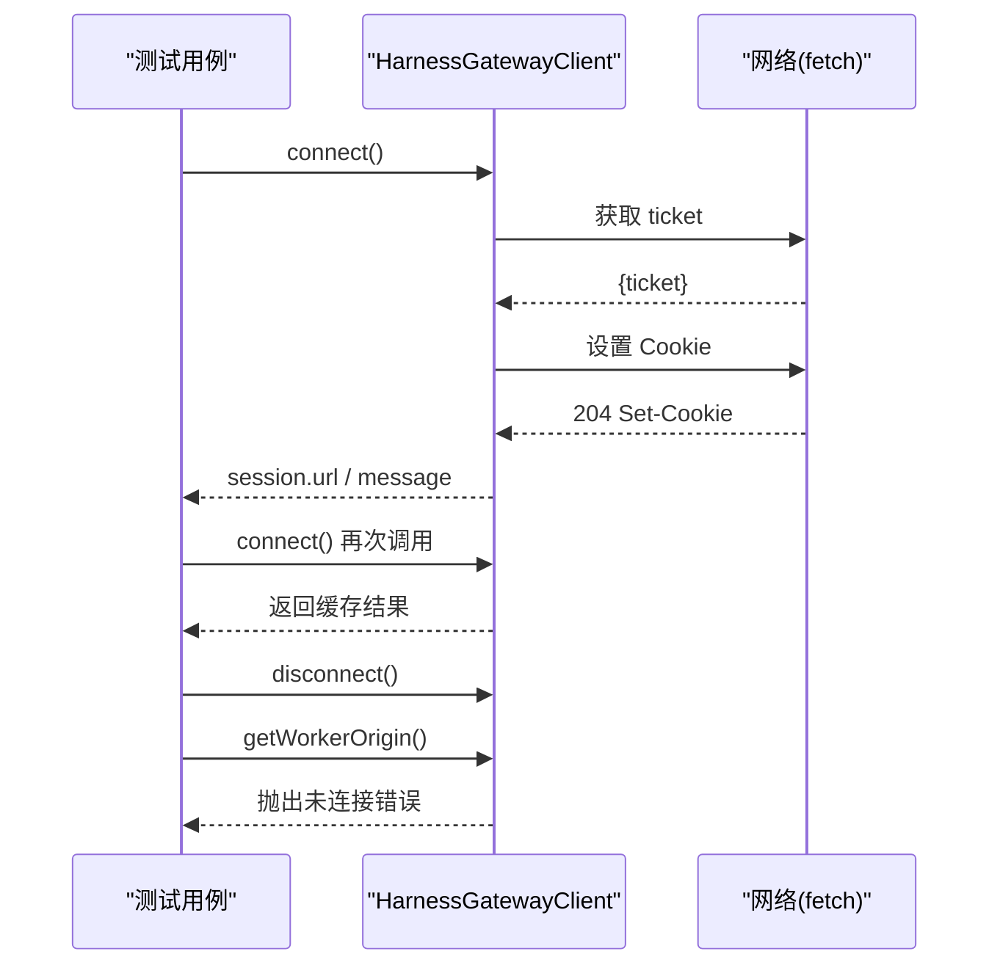
```mermaid
sequenceDiagram
participant Test as "测试用例"
participant Client as "HarnessGatewayClient"
participant Net as "网络(fetch)"
Test->>Client : connect()
Client->>Net : 获取 ticket
Net-->>Client : {ticket}
Client->>Net : 设置 Cookie
Net-->>Client : 204 Set-Cookie
Client-->>Test : session.url / message
Test->>Client : connect() 再次调用
Client-->>Test : 返回缓存结果
Test->>Client : disconnect()
Test->>Client : getWorkerOrigin()
Client-->>Test : 抛出未连接错误
```

**图表来源**
- [src/main/advisor/__tests__/HarnessGatewayClient.test.ts:22-93](file://src/main/advisor/__tests__/HarnessGatewayClient.test.ts#L22-L93)
- [src/main/advisor/HarnessGatewayClient.ts](file://src/main/advisor/HarnessGatewayClient.ts)

**章节来源**
- [src/main/advisor/__tests__/HarnessGatewayClient.test.ts:1-95](file://src/main/advisor/__tests__/HarnessGatewayClient.test.ts#L1-L95)

### 组件二：AI 员工聊天服务取消功能单元测试
- 目标：验证 AI 员工聊天服务的取消功能和模型白名单机制。
- 关键断言：
  - cancelChat 未命中 requestId 时返回 false，无副作用。
  - cancelChat 命中 in-flight 请求时 abort 对应 AbortController 并返回 true。
  - 重复取消同一 requestId 不抛异常（already aborted 静默处理）。
  - listModels 岗位白名单：仅暴露岗位对应模型；未知岗位返回空列表。
  - 不传岗位时返回完整目录。

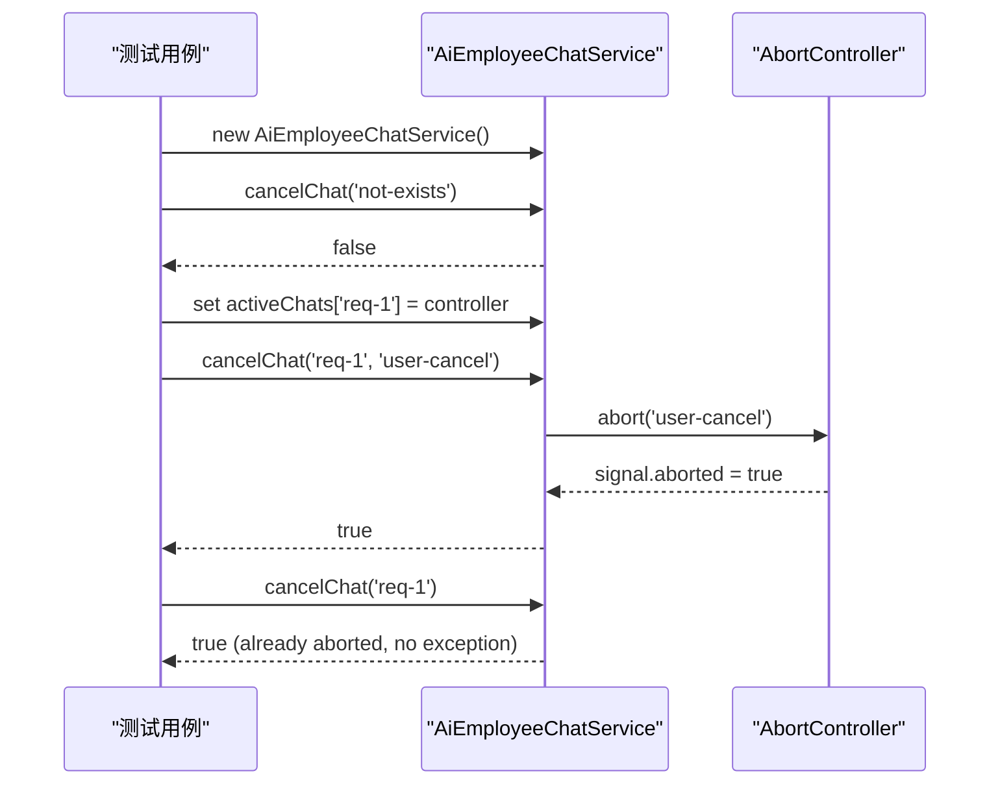
```mermaid
sequenceDiagram
participant Test as "测试用例"
participant Service as "AiEmployeeChatService"
participant Controller as "AbortController"
Test->>Service : new AiEmployeeChatService()
Test->>Service : cancelChat('not-exists')
Service-->>Test : false
Test->>Service : set activeChats['req-1'] = controller
Test->>Service : cancelChat('req-1', 'user-cancel')
Service->>Controller : abort('user-cancel')
Controller-->>Service : signal.aborted = true
Service-->>Test : true
Test->>Service : cancelChat('req-1')
Service-->>Test : true (already aborted, no exception)
```

**图表来源**
- [src/main/services/__tests__/AiEmployeeChatService.cancel.test.ts:20-45](file://src/main/services/__tests__/AiEmployeeChatService.cancel.test.ts#L20-L45)
- [src/main/services/AiEmployeeChatService.ts:195-201](file://src/main/services/AiEmployeeChatService.ts#L195-L201)

**章节来源**
- [src/main/services/__tests__/AiEmployeeChatService.cancel.test.ts:1-65](file://src/main/services/__tests__/AiEmployeeChatService.cancel.test.ts#L1-L65)
- [src/main/services/AiEmployeeChatService.ts:189-240](file://src/main/services/AiEmployeeChatService.ts#L189-L240)

### 组件三：托盘仓库Fixture数据生成器
- 目标：向指定 SQLite 数据库写入最小数据集，支持多种测试模式。
- 关键特性：
  - 支持 pallet 模式：2 条 GIGACLOUD 正式入库商品 + 2 条已存放货盘商品
  - 支持 review 模式：仅 1 条 GIGACLOUD 正式入库商品（不预存货盘）
  - 支持 review-page 模式：预置服务器详情页档案
  - 内联 SVG 商品图，离线可加载，天然满足 img.complete 断言
  - 自动创建所需表结构：supply_warehouse_products、pallet_warehouse_items、inbound_processing_items、supply_product_downloads

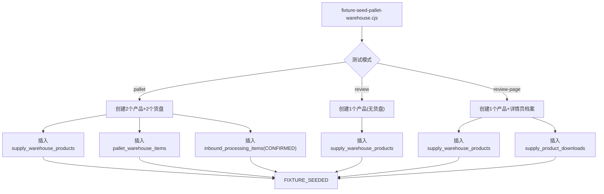
```mermaid
flowchart TD
A["fixture-seed-pallet-warehouse.cjs"] --> B{"测试模式"}
B --> |pallet| C["创建2个产品+2个货盘"]
B --> |review| D["创建1个产品(无货盘)"]
B --> |review-page| E["创建1个产品+详情页档案"]
C --> F["插入supply_warehouse_products"]
C --> G["插入pallet_warehouse_items"]
C --> H["插入inbound_processing_items(CONFIRMED)"]
D --> I["插入supply_warehouse_products"]
E --> J["插入supply_warehouse_products"]
E --> K["插入supply_product_downloads"]
F --> L["FIXTURE_SEEDED"]
G --> L
H --> L
I --> L
J --> L
K --> L
```

**图表来源**
- [tools/fixture-seed-pallet-warehouse.cjs:21-114](file://tools/fixture-seed-pallet-warehouse.cjs#L21-L114)

**章节来源**
- [tools/fixture-seed-pallet-warehouse.cjs:1-114](file://tools/fixture-seed-pallet-warehouse.cjs#L1-L114)

### 组件四：托盘仓库UI端到端测试
- 目标：验证托盘仓库三区布局（红区Tab顶栏/蓝区产品目录树/黄区产品列表）的完整功能。
- 关键断言：
  - 顶部筛选栏渲染9个Tab，默认选中全部产品
  - 产品目录树显示正确的计数和分类结构
  - 产品卡片渲染正确，包含真实商品图和标签
  - Tab切换、类目过滤、搜索过滤等交互功能正常
  - 批量管理功能完整
  - 入库处理Tab的待确认流程和双写验证

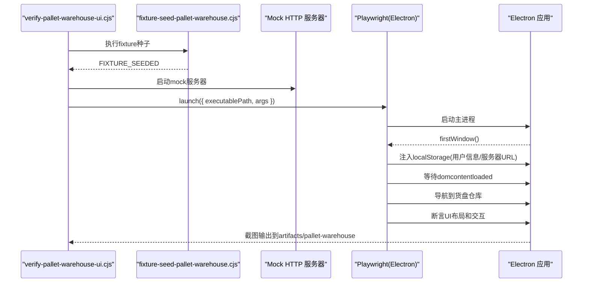
```mermaid
sequenceDiagram
participant Runner as "verify-pallet-warehouse-ui.cjs"
participant Seed as "fixture-seed-pallet-warehouse.cjs"
participant Server as "Mock HTTP 服务器"
participant PW as "Playwright(Electron)"
participant App as "Electron 应用"
Runner->>Seed : 执行fixture种子
Seed-->>Runner : FIXTURE_SEEDED
Runner->>Server : 启动mock服务器
Runner->>PW : launch({ executablePath, args })
PW->>App : 启动主进程
App-->>PW : firstWindow()
PW->>App : 注入localStorage(用户信息/服务器URL)
PW->>App : 等待domcontentloaded
PW->>App : 导航到货盘仓库
PW->>App : 断言UI布局和交互
App-->>Runner : 截图输出到artifacts/pallet-warehouse
```

**图表来源**
- [tools/verify-pallet-warehouse-ui.cjs:191-230](file://tools/verify-pallet-warehouse-ui.cjs#L191-L230)
- [tools/verify-pallet-warehouse-ui.cjs:458-485](file://tools/verify-pallet-warehouse-ui.cjs#L458-L485)

**章节来源**
- [tools/verify-pallet-warehouse-ui.cjs:1-486](file://tools/verify-pallet-warehouse-ui.cjs#L1-L486)

### 组件五：仓库审查操作验证
- 目标：验证正式入库双按钮（下载产品/退回入库处理）的端到端流程。
- 关键断言：
  - 正式入库展示种子商品卡，包含两个按钮
  - 点击退回入库处理后，正式入库列表为空，入库队列含1条PENDING选品快照
  - 入库处理Tab中确认入库后，正式入库和货盘存放恢复
  - 双写一致性：确认入库后同时更新warehouses和pallets表

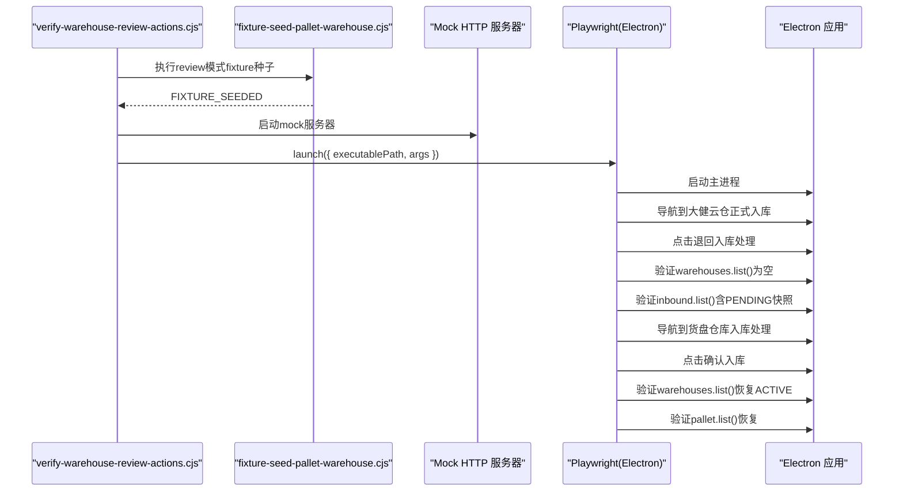
```mermaid
sequenceDiagram
participant Runner as "verify-warehouse-review-actions.cjs"
participant Seed as "fixture-seed-pallet-warehouse.cjs"
participant Server as "Mock HTTP 服务器"
participant PW as "Playwright(Electron)"
participant App as "Electron 应用"
Runner->>Seed : 执行review模式fixture种子
Seed-->>Runner : FIXTURE_SEEDED
Runner->>Server : 启动mock服务器
Runner->>PW : launch({ executablePath, args })
PW->>App : 启动主进程
PW->>App : 导航到大健云仓正式入库
PW->>App : 点击退回入库处理
PW->>App : 验证warehouses.list()为空
PW->>App : 验证inbound.list()含PENDING快照
PW->>App : 导航到货盘仓库入库处理
PW->>App : 点击确认入库
PW->>App : 验证warehouses.list()恢复ACTIVE
PW->>App : 验证pallet.list()恢复
```

**图表来源**
- [tools/verify-warehouse-review-actions.cjs:38-132](file://tools/verify-warehouse-review-actions.cjs#L38-L132)

**章节来源**
- [tools/verify-warehouse-review-actions.cjs:1-132](file://tools/verify-warehouse-review-actions.cjs#L1-L132)

### 组件六：J 阶段验收脚本
- 目标：确保"守卫运行监控 + 失败重试 + 长时运行进度条"的全链路实现符合设计。
- 覆盖范围：
  - 共享契约扩展（GuardianRetryRequest/Result、GuardianRunEvent 联合类型）。
  - 服务实现（retryFailedFiles、processOneFile 复用、软/硬回退、hash 跳过）。
  - IPC 处理器（kbGuardian:retry-failed、kbGuardian:get-log-detail、run-event 透传）。
  - Preload 绑定与 global.d.ts 声明。
  - UI 组件（KnowledgeHub/SampleLibrary 日志展开、重试按钮、进度条、notice）。
  - 事件流（started/progress/finished、sinceStartMs、增量统计）。
  - 回归断言（I.5/I.6/I.7 行为不变）。
- 执行方式：直接运行 tsx 脚本，断言失败则 exit(1)。

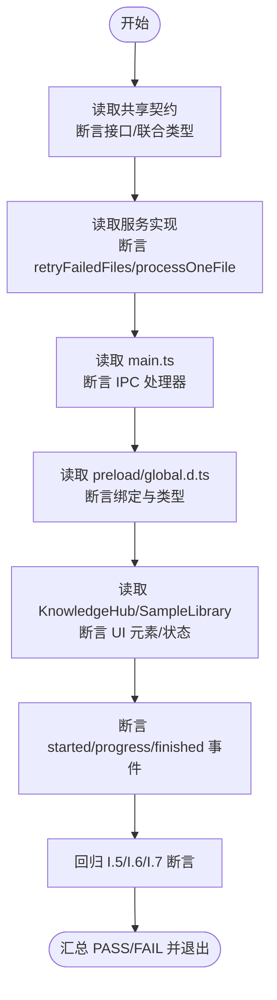
```mermaid
flowchart TD
Start(["开始"]) --> ReadContracts["读取共享契约<br/>断言接口/联合类型"]
ReadContracts --> ReadService["读取服务实现<br/>断言 retryFailedFiles/processOneFile"]
ReadService --> ReadIPC["读取 main.ts<br/>断言 IPC 处理器"]
ReadIPC --> ReadPreload["读取 preload/global.d.ts<br/>断言绑定与类型"]
ReadPreload --> ReadUI["读取 KnowledgeHub/SampleLibrary<br/>断言 UI 元素/状态"]
ReadUI --> Events["断言 started/progress/finished 事件"]
Events --> Regression["回归 I.5/I.6/I.7 断言"]
Regression --> End(["汇总 PASS/FAIL 并退出"])
```

**图表来源**
- [tools/verify-j-stage.ts:37-320](file://tools/verify-j-stage.ts#L37-L320)

**章节来源**
- [tools/verify-j-stage.ts:1-334](file://tools/verify-j-stage.ts#L1-L334)

### 组件七：K 阶段验收脚本
- 目标：团队工作台首页全链路验收（契约、服务端、权限、前端 API/UI、导航、tsc 校验）。
- 覆盖范围：
  - 共享契约（DashboardKpiKey、DashboardSummary、MyTodo、TeamActivity 等）。
  - 服务端路由（GET /summary、权限守卫 dashboard.view、authenticate hook、KPI 聚合、myTodos/teamActivities）。
  - RBAC 权限（dashboard.view 在 OWNER/OPERATOR/PUBLISHER/VIEWER 中的覆盖）。
  - 前端 API（fetchDashboardSummary 调用 /api/dashboard/summary）。
  - UI（Dashboard.tsx 数据-testid、刷新间隔、状态管理；dashboard.css 主题与响应式）。
  - 导航（App.tsx 默认页、菜单项、权限控制）。
  - 类型安全（tsc --noEmit 主/渲染两端）。

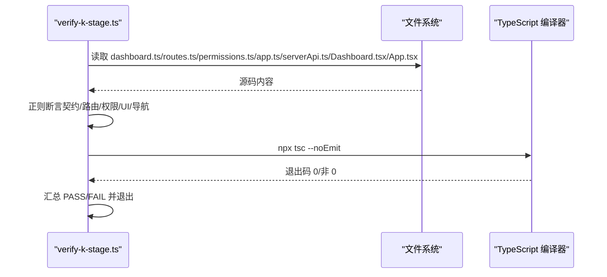
```mermaid
sequenceDiagram
participant Script as "verify-k-stage.ts"
participant FS as "文件系统"
participant TSC as "TypeScript 编译器"
Script->>FS : 读取 dashboard.ts/routes.ts/permissions.ts/app.ts/serverApi.ts/Dashboard.tsx/App.tsx
FS-->>Script : 源码内容
Script->>Script : 正则断言契约/路由/权限/UI/导航
Script->>TSC : npx tsc --noEmit
TSC-->>Script : 退出码 0/非 0
Script->>Script : 汇总 PASS/FAIL 并退出
```

**图表来源**
- [tools/verify-k-stage.ts:47-279](file://tools/verify-k-stage.ts#L47-L279)

**章节来源**
- [tools/verify-k-stage.ts:1-298](file://tools/verify-k-stage.ts#L1-L298)

### 组件八：AI 员工提示词集成验证
- 目标：验证报告样例库与 AI 智能体 Prompt 的集成，确保 17 组 60+ 断言全部通过。
- 覆盖范围：
  - sampleLibraryPrompt.ts 文件存在性和导出完整性。
  - SAMPLE_DECISION_KEYWORDS 4 决策枚举完整性。
  - PROMPT_RULE_18 字段齐全性。
  - buildSampleLibraryDecisionMatrix() 输出含 4 样例。
  - buildSampleLibraryFewShot() 返回 4 个样例。
  - buildSampleLibraryFewShotMarkdown() 输出含 4 决策路径。
  - buildSampleLibraryPromptSection() 输出含决策矩阵 + few-shot。
  - selectionReportWorkflow.ts 集成验证。
  - 提示词文档含规则 18 + few-shot 注入段。
  - 模板文档含样例库章节 + 4 决策枚举表。
  - reportEnhance.ts 导出 SAMPLE_LIBRARY_DECISIONS / ensureSampleLibraryAlignment。
  - ensureSampleLibraryAlignment 真实样例跑通。
  - 兜底补全和修正功能验证。
  - 集成生效验证。

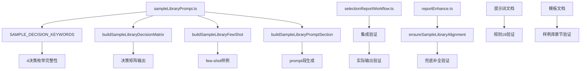
```mermaid
flowchart TD
A["sampleLibraryPrompt.ts"] --> B["SAMPLE_DECISION_KEYWORDS"]
A --> C["buildSampleLibraryDecisionMatrix"]
A --> D["buildSampleLibraryFewShot"]
A --> E["buildSampleLibraryPromptSection"]
F["selectionReportWorkflow.ts"] --> G["集成验证"]
H["reportEnhance.ts"] --> I["ensureSampleLibraryAlignment"]
J["提示词文档"] --> K["规则18验证"]
L["模板文档"] --> M["样例库章节验证"]
B --> N["4决策枚举完整性"]
C --> O["决策矩阵输出"]
D --> P["few-shot样例"]
E --> Q["prompt段生成"]
G --> R["实际输出验证"]
I --> S["兜底补全验证"]
```

**图表来源**
- [tools/verify-ai-employee-prompt-integration.ts:1-22](file://tools/verify-ai-employee-prompt-integration.ts#L1-L22)
- [tools/verify-ai-employee-prompt-integration.ts:62-200](file://tools/verify-ai-employee-prompt-integration.ts#L62-L200)

**章节来源**
- [tools/verify-ai-employee-prompt-integration.ts:1-293](file://tools/verify-ai-employee-prompt-integration.ts#L1-L293)

### 组件九：AI 员工阶段C验证
- 目标：验证阶段 C 的 4 个核心交付物都真的填实了报告内容。
- 覆盖范围：
  - buildProductBasicsBlock（第一部分）9 行不空。
  - buildCompetitorReviewInsights（第三部分 3.2）按 ASIN 聚合真实标题。
  - buildCompetitorListingSummary（第三部分 3.3）brand + 核心 bullet 真实拼接。
  - marketBlock 拼装路径（AIEmployee.tsx 1034 行）含全部 4 段。
  - 报告 markdown 6 部分齐全，第一/第三部分明确非空。
  - 真实归档文件存在。
  - 系统入场结论与报告最终结论一致。
  - 缺口提示显式存在（装箱数、净重、本品自评等）。

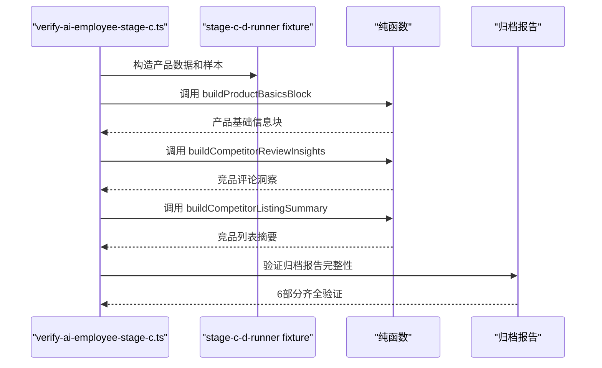
```mermaid
sequenceDiagram
participant Verify as "verify-ai-employee-stage-c.ts"
participant Fixture as "stage-c-d-runner fixture"
participant Functions as "纯函数"
participant Report as "归档报告"
Verify->>Fixture : 构造产品数据和样本
Verify->>Functions : 调用 buildProductBasicsBlock
Functions-->>Verify : 产品基础信息块
Verify->>Functions : 调用 buildCompetitorReviewInsights
Functions-->>Verify : 竞品评论洞察
Verify->>Functions : 调用 buildCompetitorListingSummary
Functions-->>Verify : 竞品列表摘要
Verify->>Report : 验证归档报告完整性
Report-->>Verify : 6部分齐全验证
```

**图表来源**
- [tools/verify-ai-employee-stage-c.ts:1-17](file://tools/verify-ai-employee-stage-c.ts#L1-L17)
- [tools/verify-ai-employee-stage-c.ts:113-200](file://tools/verify-ai-employee-stage-c.ts#L113-L200)

**章节来源**
- [tools/verify-ai-employee-stage-c.ts:1-208](file://tools/verify-ai-employee-stage-c.ts#L1-L208)

### 组件十：Amazon 证据推断验证
- 目标：验证 Amazon 差异化/合规证据提炼功能，确保 deepseek-chat 优先、qwen3.6-flash 回退。
- 覆盖范围：
  - 输入组装确定性：含 1688 页面证据 + Amazon 详情页 + 评论样本。
  - 提示词组装：含身份 + 1688 + Amazon 详情页 bullet + 评论样本。
  - 字符截断 800：JSON 解析后 differentiation/compliance 各截断到 800 字符。
  - JSON 解析鲁棒：处理 Markdown 围栏、纯文本、空字符串、字段缺失。
  - 决策状态转换：成功时 origin=系统预设 + decisionEligible=true。
  - 模型选择：deepseek-chat 优先，qwen3.6-flash 回退；超时 25s。
  - 类型契约：service 类方法真实存在。

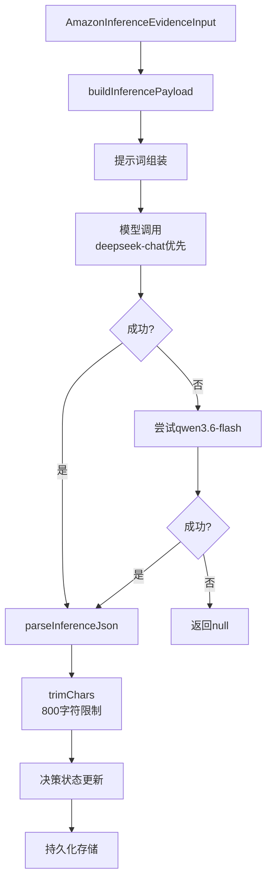
```mermaid
flowchart TD
A["AmazonInferenceEvidenceInput"] --> B["buildInferencePayload"]
B --> C["提示词组装"]
C --> D["模型调用<br/>deepseek-chat优先"]
D --> E{"成功?"}
E --> |是| F["parseInferenceJson"]
E --> |否| G["尝试qwen3.6-flash"]
G --> H{"成功?"}
H --> |是| F
H --> |否| I["返回null"]
F --> J["trimChars<br/>800字符限制"]
J --> K["决策状态更新"]
K --> L["持久化存储"]
```

**图表来源**
- [tools/verify-amazon-evidence-inference.ts:1-11](file://tools/verify-amazon-evidence-inference.ts#L1-L11)
- [tools/verify-amazon-evidence-inference.ts:32-141](file://tools/verify-amazon-evidence-inference.ts#L32-L141)

**章节来源**
- [tools/verify-amazon-evidence-inference.ts:1-141](file://tools/verify-amazon-evidence-inference.ts#L1-L141)

### 组件十一：UI/端到端验收（Electron + Playwright）
- 目标：在真实 Electron 环境中验证 UI 与交互，支持截图/视频输出。
- 典型流程：
  - 启动本地 HTTP 服务器提供 Mock 数据。
  - 通过 Playwright 的 _electron 启动 Electron 应用。
  - 注入登录态/路由参数，等待 DOM 就绪。
  - 断言页面元素、状态与交互结果。
  - 将截图/视频保存到 output/playwright/*。

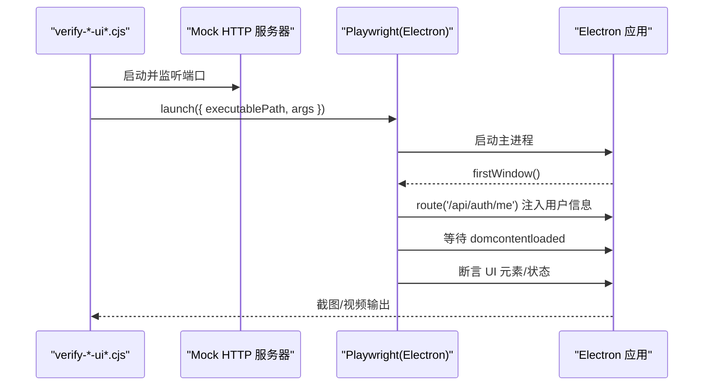
```mermaid
sequenceDiagram
participant Runner as "verify-*-ui*.cjs"
participant Server as "Mock HTTP 服务器"
participant PW as "Playwright(Electron)"
participant App as "Electron 应用"
Runner->>Server : 启动并监听端口
Runner->>PW : launch({ executablePath, args })
PW->>App : 启动主进程
App-->>PW : firstWindow()
PW->>App : route('/api/auth/me') 注入用户信息
PW->>App : 等待 domcontentloaded
PW->>App : 断言 UI 元素/状态
App-->>Runner : 截图/视频输出
```

**图表来源**
- [tools/verify-amazon-completeness-ui-stage5.cjs:50-64](file://tools/verify-amazon-completeness-ui-stage5.cjs#L50-L64)
- [tools/verify-selection-report-renderer-ui.cjs:1-20](file://tools/verify-selection-report-renderer-ui.cjs#L1-L20)

**章节来源**
- [tools/verify-amazon-completeness-ui-stage5.cjs:50-64](file://tools/verify-amazon-completeness-ui-stage5.cjs#L50-L64)
- [tools/verify-selection-report-renderer-ui.cjs:1-20](file://tools/verify-selection-report-renderer-ui.cjs#L1-L20)

### 组件十二：算法回归测试
- 目标：对选品市场统计、查询建议等纯函数进行输入输出断言，保障算法稳定。
- 示例：
  - run-market-stats-tests.js：词形归一、复数合并、销量加权排序、停用词过滤、空样本安全。
  - run-query-suggestion-tests.js：标题/类目/属性组合生成查询建议，边界情况兜底。

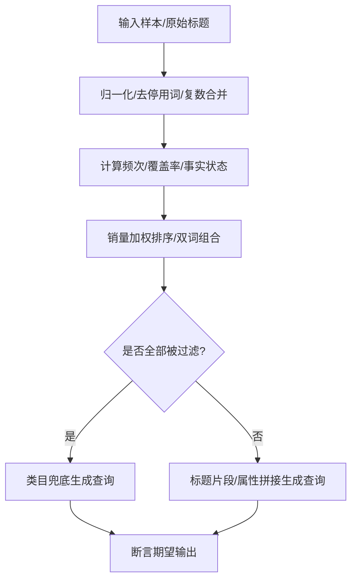
```mermaid
flowchart TD
A["输入样本/原始标题"] --> B["归一化/去停用词/复数合并"]
B --> C["计算频次/覆盖率/事实状态"]
C --> D["销量加权排序/双词组合"]
D --> E{"是否全部被过滤?"}
E --> |是| F["类目兜底生成查询"]
E --> |否| G["标题片段/属性拼接生成查询"]
F --> H["断言期望输出"]
G --> H
```

**图表来源**
- [.tmp-ui-verify/run-market-stats-tests.js:1-44](file://.tmp-ui-verify/run-market-stats-tests.js#L1-L44)
- [.tmp-ui-verify/run-query-suggestion-tests.js:1-60](file://.tmp-ui-verify/run-query-suggestion-tests.js#L1-L60)

**章节来源**
- [.tmp-ui-verify/run-market-stats-tests.js:1-44](file://.tmp-ui-verify/run-market-stats-tests.js#L1-L44)
- [.tmp-ui-verify/run-query-suggestion-tests.js:1-60](file://.tmp-ui-verify/run-query-suggestion-tests.js#L1-L60)

## 依赖关系分析
- 测试工具链
  - Vitest：用于主进程单元测试，严格限制测试文件范围，避免误测渲染代码。
  - Playwright（Electron 模式）：用于 UI/端到端验收，支持截图/视频与路由拦截。
  - TypeScript 编译器：K 阶段脚本调用 tsc --noEmit 保证类型安全。
- 运行时依赖
  - Electron：UI 验收需要可执行路径或打包产物。
  - wait-on：开发模式下等待后端/前端就绪后再启动应用。
- 外部服务
  - 部分 UI 测试通过内嵌 http.createServer 提供 Mock 数据，降低对外部服务的依赖。
- **新增** 托盘仓库测试依赖
  - node:sqlite：用于fixture数据生成，直接操作SQLite数据库
  - 本地Mock服务器：所有托盘仓库测试都使用内置HTTP服务器处理权限校验
  - 真实Electron应用：需要完整的Electron可执行文件
- **新增** AI 员工验证依赖
  - 真实 fixture 数据：复用 stage-c-d-runner.mjs 的 fixture。
  - 纯函数依赖：selectionExtract、amazonScraper 等模块。
  - 文件操作：读写归档报告和 fixture 数据。

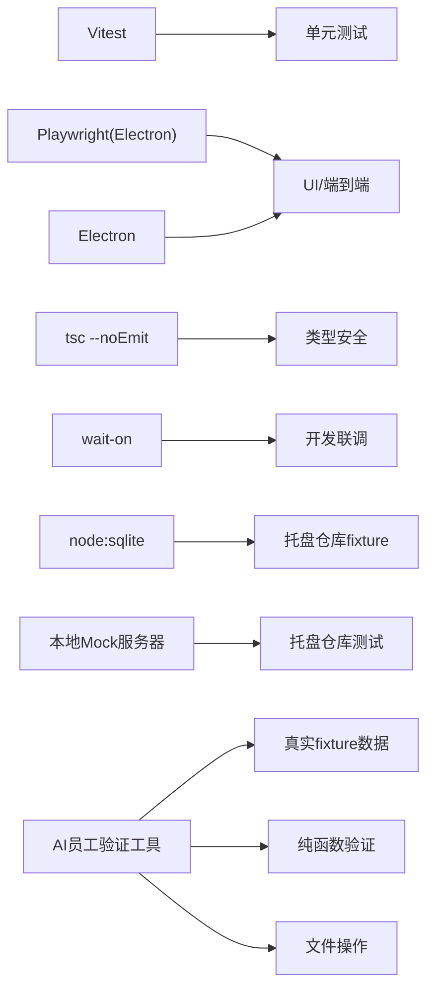
```mermaid
graph LR
V["Vitest"] --> UT["单元测试"]
P["Playwright(Electron)"] --> E2E["UI/端到端"]
TSC["tsc --noEmit"] --> TYPE["类型安全"]
EL["Electron"] --> E2E
W["wait-on"] --> DEV["开发联调"]
SQLITE["node:sqlite"] --> FIXTURE["托盘仓库fixture"]
MOCK["本地Mock服务器"] --> WH_TEST["托盘仓库测试"]
A["AI员工验证工具"] --> FIXTURE_DATA["真实fixture数据"]
A --> PURE["纯函数验证"]
A --> FILE["文件操作"]
```

**图表来源**
- [package.json:21-48](file://package.json#L21-L48)
- [vitest.config.ts:3-8](file://vitest.config.ts#L3-L8)
- [tools/verify-k-stage.ts:259-279](file://tools/verify-k-stage.ts#L259-L279)
- [tools/verify-ai-employee-stage-c.ts:18-23](file://tools/verify-ai-employee-stage-c.ts#L18-L23)
- [tools/fixture-seed-pallet-warehouse.cjs:8](file://tools/fixture-seed-pallet-warehouse.cjs#L8)
- [tools/verify-pallet-warehouse-ui.cjs:15-24](file://tools/verify-pallet-warehouse-ui.cjs#L15-L24)
- [tools/verify-warehouse-review-actions.cjs:16-25](file://tools/verify-warehouse-review-actions.cjs#L16-L25)

**章节来源**
- [package.json:21-48](file://package.json#L21-L48)
- [vitest.config.ts:3-8](file://vitest.config.ts#L3-L8)
- [tools/verify-k-stage.ts:259-279](file://tools/verify-k-stage.ts#L259-L279)

## 性能与稳定性考量
- 单元测试
  - 使用 Node 环境与内存 mock，执行速度快，适合频繁运行。
  - 注意避免全局状态污染（已关闭 globals）。
  - **新增** AI 员工聊天服务测试使用 AbortController，确保资源正确释放。
- 阶段化验收
  - J/K 阶段脚本以静态断言为主，开销低，适合 CI 快速门禁。
  - 建议在并行流水线中拆分 J/K 任务，缩短总时长。
- UI/端到端
  - Electron 启动与渲染耗时较长，建议按需启用（如发布前或关键变更）。
  - 合理设置超时与重试策略，减少偶发失败。
- 算法回归
  - 纯函数测试无 IO，执行快且稳定，适合高频回归。
- **新增** 托盘仓库测试优化
  - 使用本地Mock服务器避免外部依赖，提高测试稳定性。
  - 通过fixture-seed-pallet-warehouse.cjs预生成数据，减少运行时开销。
  - 支持多种测试模式（pallet/review/review-page），灵活适配不同场景。
  - 使用内联SVG图片，避免网络依赖，确保离线可运行。
- **新增** AI 员工验证
  - 复用真实 fixture，避免重复数据准备开销。
  - 通过静态代码分析减少运行时依赖。
  - 使用环境变量控制测试行为，提高灵活性。

## 故障排查指南
- 常见问题
  - 单元测试找不到文件：确认测试文件位于 src/main/**/__tests__/*.test.ts。
  - UI 测试无法启动 Electron：检查 executablePath 或打包产物是否存在。
  - 阶段脚本断言失败：根据输出定位具体断言点，核对源码是否包含预期字段/方法/事件。
  - tsc 类型错误：依据 K 阶段脚本输出的 stderr 定位类型问题。
  - **新增** AI 员工测试失败：检查 AbortController 是否正确初始化，activeChats Map 状态是否正常。
  - **新增** 端到端验证失败：确认 fixture 数据格式正确，文件路径有效。
  - **新增** 托盘仓库测试失败：检查node:sqlite模块是否可用，Mock服务器端口是否冲突。
  - **新增** fixture种子失败：确认Electron可执行文件路径正确，ELECTRON_RUN_AS_NODE环境变量已设置。
- 定位技巧
  - 查看 output/playwright/* 下的截图/视频，结合断言 ID 定位 UI 问题。
  - 在阶段脚本中临时增加 console.log 或缩小断言范围，逐步定位。
  - 对于网络相关问题，优先使用内嵌 Mock 服务器隔离外部依赖。
  - **新增** 对于 AI 员工相关测试，检查环境变量配置（如 DEEPSEEK_API_KEY、BAILIAN_API_KEY）。
  - **新增** 对于阶段C验证，确认归档报告文件存在且格式正确。
  - **新增** 对于托盘仓库测试，检查artifacts目录下的截图文件，确认Mock服务器是否正确启动。
  - **新增** 对于fixture数据问题，直接运行fixture-seed-pallet-warehouse.cjs脚本验证数据生成。

**章节来源**
- [vitest.config.ts:3-8](file://vitest.config.ts#L3-L8)
- [tools/verify-amazon-completeness-ui-stage5.cjs:50-64](file://tools/verify-amazon-completeness-ui-stage5.cjs#L50-L64)
- [tools/verify-k-stage.ts:259-279](file://tools/verify-k-stage.ts#L259-L279)
- [src/main/services/__tests__/AiEmployeeChatService.cancel.test.ts:9-16](file://src/main/services/__tests__/AiEmployeeChatService.cancel.test.ts#L9-L16)
- [tools/verify-ai-employee-stage-c.ts:136-141](file://tools/verify-ai-employee-stage-c.ts#L136-L141)
- [tools/fixture-seed-pallet-warehouse.cjs:10-14](file://tools/fixture-seed-pallet-warehouse.cjs#L10-L14)
- [tools/verify-pallet-warehouse-ui.cjs:195-202](file://tools/verify-pallet-warehouse-ui.cjs#L195-L202)
- [tools/verify-warehouse-review-actions.cjs:43-50](file://tools/verify-warehouse-review-actions.cjs#L43-L50)

## 结论
该测试基础设施通过分层策略实现了从单元到 UI 的全链路质量保障：
- 单元测试快速反馈主进程逻辑正确性，包括新增的 AI 员工聊天服务取消功能测试。
- J/K 阶段脚本以强约束保障契约、服务、权限与 UI 的一致性。
- UI/端到端验收在真实环境中验证用户体验与交互。
- 算法回归确保核心数据处理逻辑稳定。
- **新增** 托盘仓库测试基础设施提供了完整的端到端验证，覆盖fixture数据生成、UI验证和审查操作验证。
- **新增** AI 员工验证工具提供了完整的端到端验证，覆盖提示词集成、证据推断等关键功能。
- **新增** 多个验证工具增强了测试覆盖范围，确保新功能的质量和稳定性。

托盘仓库测试基础设施特别值得关注，它通过本地Mock服务器解决了主进程权限校验的问题，同时提供了灵活的fixture数据生成机制，支持多种测试场景。建议在生产流水线中组合使用这些工具，以实现高效、稳定的质量门禁。特别是新增的托盘仓库相关测试和AI员工相关测试，应该纳入常规的 CI/CD 流程中。

## 附录
- 常用命令
  - 运行 J 阶段验收：pnpm verify:j
  - 运行 K 阶段验收：pnpm verify:k
  - 运行单元测试：pnpm test（由 Vitest 驱动）
  - 构建渲染端：pnpm build（由 Vite 驱动）
  - **新增** 运行托盘仓库fixture种子：ELECTRON_RUN_AS_NODE=1 <Electron> tools/fixture-seed-pallet-warehouse.cjs <sqlite-path> [review|review-page]
  - **新增** 运行托盘仓库UI测试：node tools/verify-pallet-warehouse-ui.cjs
  - **新增** 运行仓库审查操作测试：node tools/verify-warehouse-review-actions.cjs
  - **新增** 运行 AI 员工提示词集成验证：tsx tools/verify-ai-employee-prompt-integration.ts
  - **新增** 运行 AI 员工阶段C验证：tsx tools/verify-ai-employee-stage-c.ts
  - **新增** 运行 Amazon 证据推断验证：tsx tools/verify-amazon-evidence-inference.ts

**章节来源**
- [package.json:8-19](file://package.json#L8-L19)
- [tools/verify-ai-employee-prompt-integration.ts:1-22](file://tools/verify-ai-employee-prompt-integration.ts#L1-L22)
- [tools/verify-ai-employee-stage-c.ts:1-17](file://tools/verify-ai-employee-stage-c.ts#L1-L17)
- [tools/verify-amazon-evidence-inference.ts:1-11](file://tools/verify-amazon-evidence-inference.ts#L1-L11)
- [tools/fixture-seed-pallet-warehouse.cjs:6](file://tools/fixture-seed-pallet-warehouse.cjs#L6)
- [tools/verify-pallet-warehouse-ui.cjs:6](file://tools/verify-pallet-warehouse-ui.cjs#L6)
- [tools/verify-warehouse-review-actions.cjs:7](file://tools/verify-warehouse-review-actions.cjs#L7)
</docs>