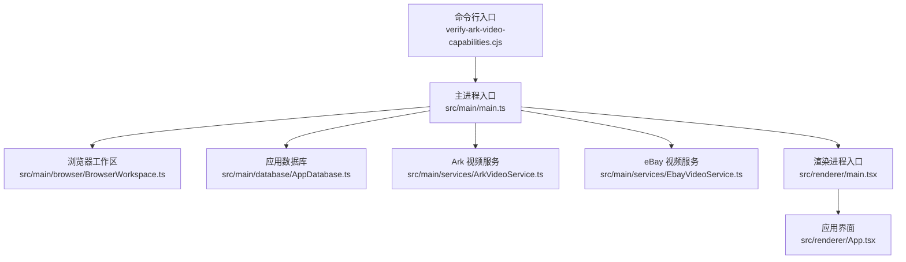
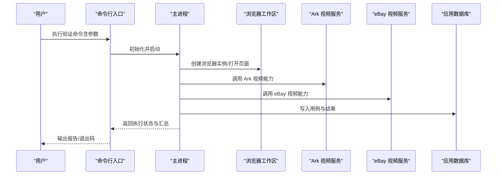
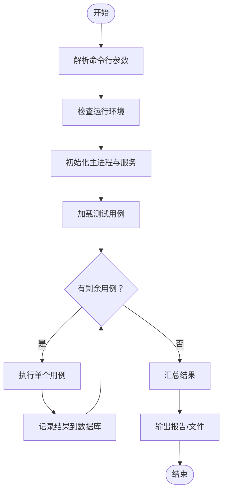
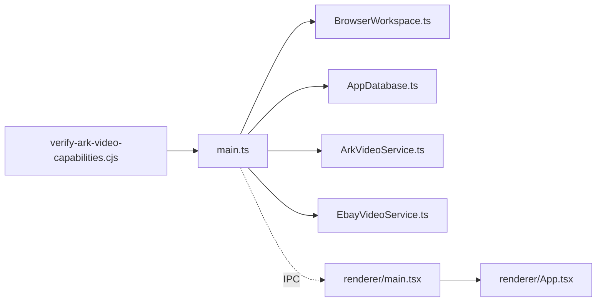

# 视频能力验证工具

<cite>
**本文档引用的文件**   
- [verify-ark-video-capabilities.cjs](file://tools/verify-ark-video-capabilities.cjs)
- [package.json](file://package.json)
- [tsconfig.json](file://tsconfig.json)
- [vite.config.ts](file://vite.config.ts)
- [main.ts](file://src/main/main.ts)
- [BrowserWorkspace.ts](file://src/main/browser/BrowserWorkspace.ts)
- [AppDatabase.ts](file://src/main/database/AppDatabase.ts)
- [ArkVideoService.ts](file://src/main/services/ArkVideoService.ts)
- [EbayVideoService.ts](file://src/main/services/EbayVideoService.ts)
- [App.tsx](file://src/renderer/App.tsx)
- [main.tsx](file://src/renderer/main.tsx)
- [index.html](file://src/renderer/index.html)
</cite>

## 目录
1. [简介](#简介)
2. [项目结构](#项目结构)
3. [核心组件](#核心组件)
4. [架构总览](#架构总览)
5. [详细组件分析](#详细组件分析)
6. [依赖关系分析](#依赖关系分析)
7. [性能考虑](#性能考虑)
8. [故障诊断指南](#故障诊断指南)
9. [结论](#结论)
10. [附录](#附录)

## 简介
本仓库包含一个“视频能力验证工具”的 JavaScript/Node.js 实现，主要用于对 Ark 视频相关能力进行端到端验证与回归测试。该工具通过 Node 脚本驱动浏览器工作区、调用视频服务（如 Ark 视频服务与 eBay 视频服务），并输出结构化结果，便于自动化集成与人工分析。同时，前端渲染层提供可视化界面用于辅助调试与展示。

主要用途：
- 验证 Ark 视频能力的可用性与稳定性
- 执行端到端流程（启动浏览器、加载页面、触发视频任务、采集结果）
- 生成可机读的测试结果与报告
- 为后续自动化流水线提供稳定入口

## 项目结构
本项目采用多模块组织方式：
- tools/verify-ark-video-capabilities.cjs：命令行入口，负责参数解析、环境准备、调度执行与结果输出
- src/main：主进程逻辑（浏览器工作区、数据库、服务层）
- src/renderer：Electron 渲染进程 UI（React + Vite）
- package.json/tsconfig/vite.config：构建与运行配置

图表来源
- [verify-ark-video-capabilities.cjs](file://tools/verify-ark-video-capabilities.cjs)
- [main.ts](file://src/main/main.ts)
- [BrowserWorkspace.ts](file://src/main/browser/BrowserWorkspace.ts)
- [AppDatabase.ts](file://src/main/database/AppDatabase.ts)
- [ArkVideoService.ts](file://src/main/services/ArkVideoService.ts)
- [EbayVideoService.ts](file://src/main/services/EbayVideoService.ts)
- [main.tsx](file://src/renderer/main.tsx)
- [App.tsx](file://src/renderer/App.tsx)

章节来源
- [package.json](file://package.json)
- [tsconfig.json](file://tsconfig.json)
- [vite.config.ts](file://vite.config.ts)

## 核心组件
- 命令行入口（verify-ark-video-capabilities.cjs）
  - 职责：解析运行参数、初始化环境、调度主进程、收集并输出结果
  - 关键行为：参数校验、日志开关、并发控制、结果聚合
- 主进程（main.ts）
  - 职责：生命周期管理、事件总线、服务装配、错误处理
- 浏览器工作区（BrowserWorkspace.ts）
  - 职责：浏览器实例管理、页面导航、截图/录制、元素交互
- 数据库（AppDatabase.ts）
  - 职责：本地持久化测试用例、结果缓存、查询统计
- 视频服务（ArkVideoService.ts, EbayVideoService.ts）
  - 职责：封装视频能力调用（上传、转码、审核、发布等）、重试与超时、指标采集

章节来源
- [verify-ark-video-capabilities.cjs](file://tools/verify-ark-video-capabilities.cjs)
- [main.ts](file://src/main/main.ts)
- [BrowserWorkspace.ts](file://src/main/browser/BrowserWorkspace.ts)
- [AppDatabase.ts](file://src/main/database/AppDatabase.ts)
- [ArkVideoService.ts](file://src/main/services/ArkVideoService.ts)
- [EbayVideoService.ts](file://src/main/services/EbayVideoService.ts)

## 架构总览
整体架构遵循“命令入口 -> 主进程 -> 服务层/浏览器工作区 -> 外部系统”的分层设计。渲染进程作为可选的可视化辅助，不阻塞核心验证流程。

图表来源
- [verify-ark-video-capabilities.cjs](file://tools/verify-ark-video-capabilities.cjs)
- [main.ts](file://src/main/main.ts)
- [BrowserWorkspace.ts](file://src/main/browser/BrowserWorkspace.ts)
- [ArkVideoService.ts](file://src/main/services/ArkVideoService.ts)
- [EbayVideoService.ts](file://src/main/services/EbayVideoService.ts)
- [AppDatabase.ts](file://src/main/database/AppDatabase.ts)

## 详细组件分析

### 命令行入口（verify-ark-video-capabilities.cjs）
- 功能要点
  - 参数解析：支持指定用例集、并发度、超时、是否开启浏览器调试、输出格式等
  - 环境检查：Node 版本、依赖安装、必要环境变量
  - 执行调度：按用例顺序或并行执行，捕获异常并记录
  - 结果输出：控制台摘要、JSON/CSV 文件导出、退出码约定
- 典型使用场景
  - 全量回归：无参执行默认用例集
  - 快速冒烟：仅执行关键路径用例
  - 批量并发：提高吞吐，注意资源限制
  - 持续集成：结合 CI 输出标准化报告

图表来源
- [verify-ark-video-capabilities.cjs](file://tools/verify-ark-video-capabilities.cjs)

章节来源
- [verify-ark-video-capabilities.cjs](file://tools/verify-ark-video-capabilities.cjs)

### 主进程（main.ts）
- 职责边界
  - 生命周期：启动、就绪、关闭钩子
  - 服务装配：注入浏览器工作区、数据库、视频服务
  - 事件分发：用例执行事件、进度回调、错误上报
  - 错误处理：统一异常捕获、降级策略、重试机制
- 与渲染进程通信
  - 通过 IPC 暴露状态与结果，供 UI 展示

章节来源
- [main.ts](file://src/main/main.ts)

### 浏览器工作区（BrowserWorkspace.ts）
- 能力清单
  - 浏览器实例管理（启动、复用、回收）
  - 页面导航与等待策略（网络空闲、元素可见性）
  - 交互模拟（点击、输入、拖拽）
  - 媒体采集（截图、录屏、控制台日志抓取）
- 健壮性
  - 超时与重试
  - 断言失败定位（截图+日志）
  - 资源清理（避免泄漏）

章节来源
- [BrowserWorkspace.ts](file://src/main/browser/BrowserWorkspace.ts)

### 应用数据库（AppDatabase.ts）
- 数据模型
  - 用例元信息（ID、名称、标签、优先级）
  - 执行记录（时间、耗时、状态、错误堆栈）
  - 附件索引（截图/录屏路径）
- 操作接口
  - 插入/更新、批量查询、统计聚合、清理归档

章节来源
- [AppDatabase.ts](file://src/main/database/AppDatabase.ts)

### 视频服务（ArkVideoService.ts, EbayVideoService.ts）
- 通用特性
  - 请求封装（HTTP/WebSocket/SDK）
  - 重试与退避策略
  - 超时与取消
  - 指标采集（QPS、延迟、成功率）
- 差异点
  - Ark 视频服务：侧重能力验证（编码、转码、审核）
  - eBay 视频服务：侧重业务链路（上架、合规、曝光）

章节来源
- [ArkVideoService.ts](file://src/main/services/ArkVideoService.ts)
- [EbayVideoService.ts](file://src/main/services/EbayVideoService.ts)

### 渲染进程（main.tsx, App.tsx, index.html）
- 作用
  - 提供可视化面板，展示用例列表、执行进度、结果详情
  - 辅助调试：实时日志、截图预览、回放
- 与主进程交互
  - 通过 IPC 订阅事件、发送指令

章节来源
- [main.tsx](file://src/renderer/main.tsx)
- [App.tsx](file://src/renderer/App.tsx)
- [index.html](file://src/renderer/index.html)

## 依赖关系分析
- 内部依赖
  - 命令行入口依赖主进程与服务层
  - 主进程依赖浏览器工作区、数据库与视频服务
  - 渲染进程依赖主进程 IPC
- 外部依赖
  - 浏览器自动化库（由工作区封装）
  - HTTP/SDK 客户端（由视频服务封装）
  - 文件系统与日志库（由入口与主进程使用）

图表来源
- [verify-ark-video-capabilities.cjs](file://tools/verify-ark-video-capabilities.cjs)
- [main.ts](file://src/main/main.ts)
- [BrowserWorkspace.ts](file://src/main/browser/BrowserWorkspace.ts)
- [AppDatabase.ts](file://src/main/database/AppDatabase.ts)
- [ArkVideoService.ts](file://src/main/services/ArkVideoService.ts)
- [EbayVideoService.ts](file://src/main/services/EbayVideoService.ts)
- [main.tsx](file://src/renderer/main.tsx)
- [App.tsx](file://src/renderer/App.tsx)

章节来源
- [package.json](file://package.json)
- [tsconfig.json](file://tsconfig.json)
- [vite.config.ts](file://vite.config.ts)

## 性能考虑
- 并发控制
  - 合理设置并发度，避免浏览器实例过多导致内存不足
  - 对 I/O 密集任务（上传/下载）进行限流
- 资源管理
  - 及时释放浏览器上下文与文件句柄
  - 定期清理历史截图/录屏
- 网络优化
  - 连接池与复用
  - 重试退避与熔断
- 观测性
  - 关键指标埋点（耗时、错误率、吞吐）
  - 采样日志，避免磁盘压力

[本节为通用指导，不直接分析具体文件]

## 故障诊断指南
- 常见问题
  - 浏览器无法启动：检查端口占用、权限、沙箱设置
  - 用例超时：检查网络延迟、目标服务可用性、等待策略
  - 结果不一致：确认用例数据与环境一致性
  - 内存泄漏：监控进程内存，排查未释放对象
- 定位方法
  - 启用详细日志与浏览器调试
  - 查看数据库中的错误堆栈与附件路径
  - 复现最小用例，逐步缩小范围
- 恢复策略
  - 自动重试与隔离失败用例
  - 回滚到上一稳定版本
  - 切换备用服务或镜像

章节来源
- [AppDatabase.ts](file://src/main/database/AppDatabase.ts)
- [BrowserWorkspace.ts](file://src/main/browser/BrowserWorkspace.ts)
- [ArkVideoService.ts](file://src/main/services/ArkVideoService.ts)
- [EbayVideoService.ts](file://src/main/services/EbayVideoService.ts)

## 结论
该视频能力验证工具以清晰的模块化设计与稳健的错误处理，提供了从命令行到可视化的完整验证闭环。通过合理的并发与资源管理，可在不同规模下稳定运行，并为持续集成与质量度量提供可靠支撑。

[本节为总结性内容，不直接分析具体文件]

## 附录
- 安装与配置
  - 确保 Node.js 版本满足要求
  - 安装依赖并构建前端资源
  - 配置必要的环境变量（如 API Key、代理、存储路径）
- 运行参数说明
  - 用例选择：过滤标签/名称
  - 并发度：控制并行执行数量
  - 超时：全局与单用例超时
  - 输出：控制台、JSON、CSV、HTML 报告
- 输出格式
  - 控制台摘要：通过率、失败数、平均耗时
  - JSON/CSV：每条用例的执行记录与附件索引
  - HTML：可视化报告，含截图与日志链接
- 常见使用场景示例
  - 全量回归：默认参数执行全部用例
  - 快速冒烟：仅执行关键路径用例集
  - 批量并发：提高吞吐，配合 CI 定时任务
  - 问题复现：指定用例与详细日志输出

[本节为通用指导，不直接分析具体文件]