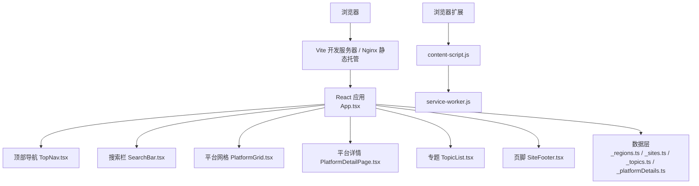
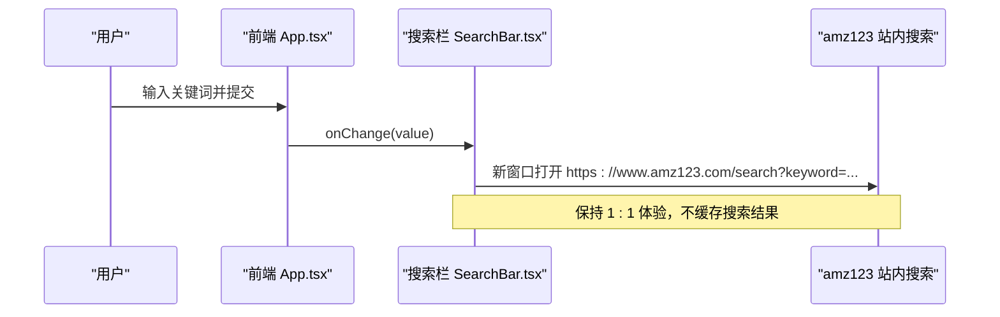
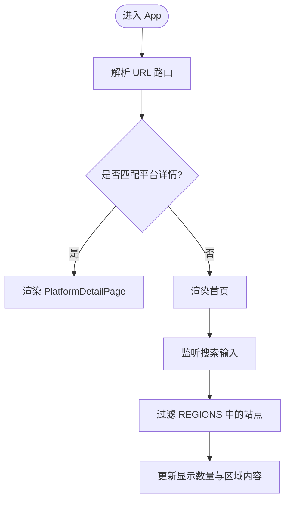
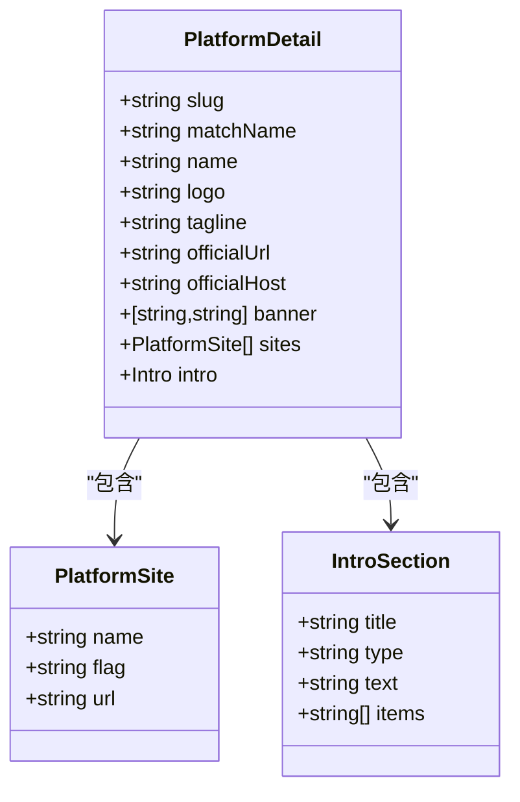
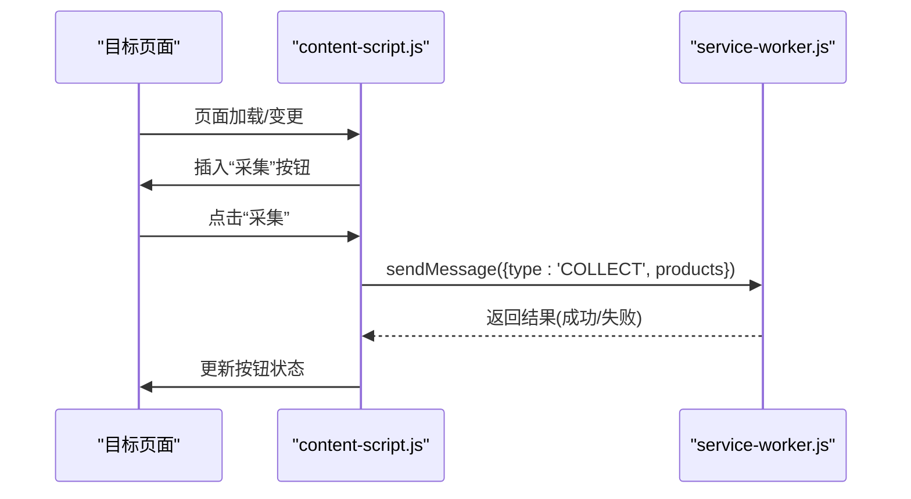
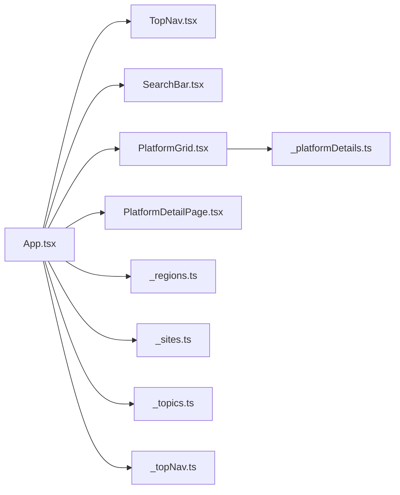

# 跨境导航工具

<cite>
**本文引用的文件**
- [README.md](file://crossborder-nav/README.md)
- [package.json](file://crossborder-nav/package.json)
- [App.tsx](file://crossborder-nav/src/App.tsx)
- [main.tsx](file://crossborder-nav/src/main.tsx)
- [TopNav.tsx](file://crossborder-nav/src/components/TopNav.tsx)
- [SearchBar.tsx](file://crossborder-nav/src/components/SearchBar.tsx)
- [PlatformGrid.tsx](file://crossborder-nav/src/components/PlatformGrid.tsx)
- [PlatformDetailPage.tsx](file://crossborder-nav/src/components/PlatformDetailPage.tsx)
- [_topNav.ts](file://crossborder-nav/src/data/_topNav.ts)
- [_regions.ts](file://crossborder-nav/src/data/_regions.ts)
- [_sites.ts](file://crossborder-nav/src/data/_sites.ts)
- [_topics.ts](file://crossborder-nav/src/data/_topics.ts)
- [_platformDetails.ts](file://crossborder-nav/src/data/_platformDetails.ts)
- [manifest.json](file://browser-extension/manifest.json)
- [content-script.js](file://browser-extension/content-script.js)
</cite>

## 目录
1. [简介](#简介)
2. [项目结构](#项目结构)
3. [核心组件](#核心组件)
4. [架构总览](#架构总览)
5. [详细组件分析](#详细组件分析)
6. [依赖关系分析](#依赖关系分析)
7. [性能与可维护性](#性能与可维护性)
8. [故障排查指南](#故障排查指南)
9. [结论](#结论)
10. [附录](#附录)

## 简介
本项目为“砚都跨境·IP 网址导航”，是对 amz123.com/kd 的独立部署镜像，提供跨地区、跨平台的跨境电商站点导航与平台详情展示。前端基于 React + Vite 构建，数据以静态资源为主（平台列表、Logo、专题等），支持站内搜索跳转至 amz123 站内搜索；同时提供浏览器扩展用于采集大健云仓商品数据并推送至桌面端服务。

## 项目结构
- crossborder-nav：纯前端静态站点，包含入口、路由、组件与数据模块
- browser-extension：浏览器扩展，注入目标页面并采集商品信息
- server：后端服务（鉴权、AI、合规、存储等），与本导航站无直接耦合
- docs/scripts/tools：文档、脚本与工具集

图表来源
- [App.tsx:36-135](file://crossborder-nav/src/App.tsx#L36-L135)
- [TopNav.tsx:7-27](file://crossborder-nav/src/components/TopNav.tsx#L7-L27)
- [SearchBar.tsx:11-67](file://crossborder-nav/src/components/SearchBar.tsx#L11-L67)
- [PlatformGrid.tsx:11-84](file://crossborder-nav/src/components/PlatformGrid.tsx#L11-L84)
- [PlatformDetailPage.tsx:13-111](file://crossborder-nav/src/components/PlatformDetailPage.tsx#L13-L111)
- [_regions.ts:1-2](file://crossborder-nav/src/data/_regions.ts#L1-L2)
- [_sites.ts:1-2](file://crossborder-nav/src/data/_sites.ts#L1-L2)
- [_topics.ts:1-2](file://crossborder-nav/src/data/_topics.ts#L1-L2)
- [_platformDetails.ts:1-46](file://crossborder-nav/src/data/_platformDetails.ts#L1-L46)
- [manifest.json:1-29](file://browser-extension/manifest.json#L1-L29)
- [content-script.js:1-89](file://browser-extension/content-script.js#L1-L89)

章节来源
- [README.md:1-79](file://crossborder-nav/README.md#L1-L79)
- [package.json:1-30](file://crossborder-nav/package.json#L1-L30)

## 核心组件
- 应用壳 App.tsx：实现迷你路由（首页与平台详情页）、全局搜索过滤、区域切换与滚动定位
- 顶部导航 TopNav.tsx：渲染一级导航项，外链打开
- 搜索栏 SearchBar.tsx：本地实时过滤 + 提交跳转 amz123 站内搜索
- 平台网格 PlatformGrid.tsx：按区域分组展示平台卡片，支持已建详情页的站内路由跳转
- 平台详情 PlatformDetailPage.tsx：横幅、分站入口、平台介绍与关键事实
- 数据层：_regions.ts、_sites.ts、_topics.ts、_platformDetails.ts 提供结构化数据与查找函数

章节来源
- [App.tsx:16-135](file://crossborder-nav/src/App.tsx#L16-L135)
- [TopNav.tsx:1-28](file://crossborder-nav/src/components/TopNav.tsx#L1-L28)
- [SearchBar.tsx:1-68](file://crossborder-nav/src/components/SearchBar.tsx#L1-L68)
- [PlatformGrid.tsx:1-85](file://crossborder-nav/src/components/PlatformGrid.tsx#L1-L85)
- [PlatformDetailPage.tsx:1-112](file://crossborder-nav/src/components/PlatformDetailPage.tsx#L1-L112)
- [_regions.ts:1-2](file://crossborder-nav/src/data/_regions.ts#L1-L2)
- [_sites.ts:1-2](file://crossborder-nav/src/data/_sites.ts#L1-L2)
- [_topics.ts:1-2](file://crossborder-nav/src/data/_topics.ts#L1-L2)
- [_platformDetails.ts:1-46](file://crossborder-nav/src/data/_platformDetails.ts#L1-L46)

## 架构总览
本导航站采用“静态数据 + 轻量前端路由”的架构：
- 数据层：以 TypeScript 常量导出平台、区域、专题与平台详情
- 视图层：React 组件按需渲染，使用最小化路由（基于 window.history）
- 外部集成：搜索跳转 amz123 站内搜索；浏览器扩展采集商品数据并通过 service worker 与桌面端通信

图表来源
- [App.tsx:47-59](file://crossborder-nav/src/App.tsx#L47-L59)
- [SearchBar.tsx:14-20](file://crossborder-nav/src/components/SearchBar.tsx#L14-L20)

## 详细组件分析

### 应用壳与迷你路由（App.tsx）
- 解析路径匹配 /nav/platform/{slug}，若存在对应详情则进入详情页，否则返回首页
- 全局搜索对 REGIONS 进行 name/desc 模糊匹配，动态计算 shownCount
- 区域 Tab 点击后清空搜索并平滑滚动到对应区域

图表来源
- [App.tsx:16-34](file://crossborder-nav/src/App.tsx#L16-L34)
- [App.tsx:47-59](file://crossborder-nav/src/App.tsx#L47-L59)
- [App.tsx:63-75](file://crossborder-nav/src/App.tsx#L63-L75)

章节来源
- [App.tsx:16-135](file://crossborder-nav/src/App.tsx#L16-L135)

### 搜索栏（SearchBar.tsx）
- 本地输入触发 onChange，用于实时过滤
- 提交表单时构造 amz123 站内搜索链接并在新窗口打开
- 展示热门词标签，点击回填输入框

章节来源
- [SearchBar.tsx:11-67](file://crossborder-nav/src/components/SearchBar.tsx#L11-L67)

### 平台网格（PlatformGrid.tsx）
- 按区域渲染站点卡片，未收录详情的站点仍走原链接
- 已收录详情的站点通过 onOpenDetail 调用父级 navigate 进行站内跳转
- Logo 加载失败时回退显示名称前两个字符

章节来源
- [PlatformGrid.tsx:11-84](file://crossborder-nav/src/components/PlatformGrid.tsx#L11-L84)

### 平台详情（PlatformDetailPage.tsx）
- 顶部横幅：渐变色背景、Logo、一句话简介、官网地址
- 平台站点：列出各分站国旗与链接，新窗口打开
- 平台介绍：截图、标题、多类型内容块（文本/列表/步骤）、关键事实

章节来源
- [PlatformDetailPage.tsx:13-111](file://crossborder-nav/src/components/PlatformDetailPage.tsx#L13-L111)

### 数据模型与查找（_platformDetails.ts）
- 定义平台详情数据结构：slug、matchName、banner、sites、intro（sections/facts）
- 提供 findDetailBySiteName 与 findDetailBySlug 两种查找方式

图表来源
- [_platformDetails.ts:4-46](file://crossborder-nav/src/data/_platformDetails.ts#L4-L46)

章节来源
- [_platformDetails.ts:48-169](file://crossborder-nav/src/data/_platformDetails.ts#L48-L169)

### 浏览器扩展（manifest.json + content-script.js）
- manifest v3，声明权限与 host_permissions，注入 content script 到指定站点
- content-script 在目标页面插入“采集”按钮，提取产品信息并通过 chrome.runtime 发送到 service worker
- 支持详情页浮动按钮与列表内联按钮两种采集入口

图表来源
- [manifest.json:1-29](file://browser-extension/manifest.json#L1-L29)
- [content-script.js:27-89](file://browser-extension/content-script.js#L27-L89)

章节来源
- [manifest.json:1-29](file://browser-extension/manifest.json#L1-L29)
- [content-script.js:1-89](file://browser-extension/content-script.js#L1-L89)

## 依赖关系分析
- 组件依赖数据：
  - App.tsx 依赖 _topNav.ts、_hotSearch.ts、_regions.ts、_sites.ts、_topics.ts、_footer.ts、_platformDetails.ts
  - PlatformGrid.tsx 依赖 _platformDetails.ts 进行详情页匹配
- 数据解耦：
  - 平台列表与详情分离，新增平台只需在 _platformDetails.ts 增加条目并在 _sites.ts/_regions.ts 中引用
- 外部依赖：
  - 搜索跳转 amz123 站内搜索
  - 浏览器扩展通过 Chrome Extension API 与桌面端通信

图表来源
- [App.tsx:1-15](file://crossborder-nav/src/App.tsx#L1-L15)
- [PlatformGrid.tsx:1-8](file://crossborder-nav/src/components/PlatformGrid.tsx#L1-L8)
- [_platformDetails.ts:162-169](file://crossborder-nav/src/data/_platformDetails.ts#L162-L169)

章节来源
- [App.tsx:1-15](file://crossborder-nav/src/App.tsx#L1-L15)
- [_platformDetails.ts:162-169](file://crossborder-nav/src/data/_platformDetails.ts#L162-L169)

## 性能与可维护性
- 首屏性能
  - 静态数据直出，无网络请求；图片懒加载降低带宽
  - 建议开启构建产物压缩与 CDN 缓存
- 交互性能
  - 搜索过滤在内存中进行，数据量较大时可考虑分片或虚拟滚动
  - 区域滚动使用原生 scrollIntoView，避免额外库
- 可维护性
  - 数据与视图解耦，新增平台仅需修改数据文件
  - 统一的路由解析与查找函数便于扩展更多详情页

## 故障排查指南
- 搜索无效
  - 检查 SearchBar 提交逻辑是否正确拼接 amz123 站内搜索 URL
  - 确认浏览器未拦截新窗口打开
- 详情页无法进入
  - 检查 URL 是否匹配 /nav/platform/{slug}
  - 确认 _platformDetails.ts 中存在对应 slug 且 findDetailBySlug 能返回
- Logo 不显示
  - 检查 public/logos 下是否存在对应资源
  - 确认相对路径 base 正确（如部署在子路径）
- 扩展采集失败
  - 检查 manifest 的 host_permissions 是否覆盖目标域名
  - 确认 service worker 已注册且收到消息

章节来源
- [SearchBar.tsx:14-20](file://crossborder-nav/src/components/SearchBar.tsx#L14-L20)
- [App.tsx:21-34](file://crossborder-nav/src/App.tsx#L21-L34)
- [_platformDetails.ts:162-169](file://crossborder-nav/src/data/_platformDetails.ts#L162-L169)
- [manifest.json:6-16](file://browser-extension/manifest.json#L6-L16)

## 结论
该导航站以极简的前端架构实现了高效的跨境平台导航与详情展示，数据驱动、易于扩展；结合浏览器扩展形成“导航 + 采集”的闭环能力。建议在后续迭代中完善更多平台详情、优化大数据量下的搜索与渲染性能，并增强错误提示与可观测性。

## 附录
- 开发与构建命令参考 README 与 package.json
- 部署说明见 README 的部署章节
- 桌面端集成入口与权限码同步位置见 README

章节来源
- [README.md:21-79](file://crossborder-nav/README.md#L21-L79)
- [package.json:7-14](file://crossborder-nav/package.json#L7-L14)