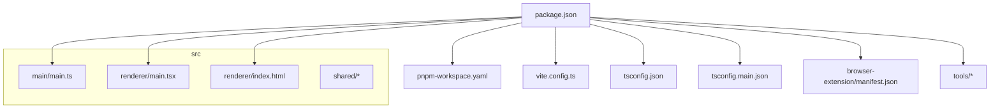
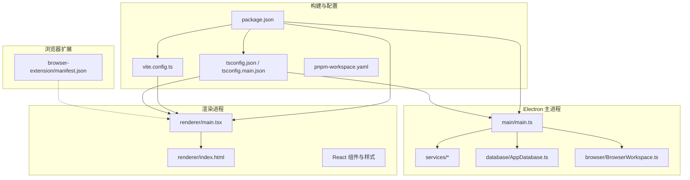
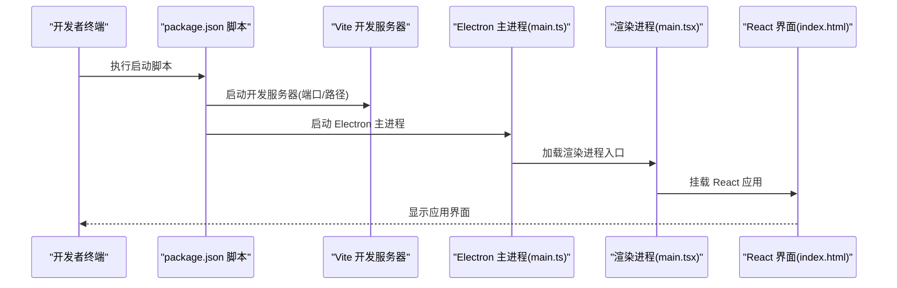
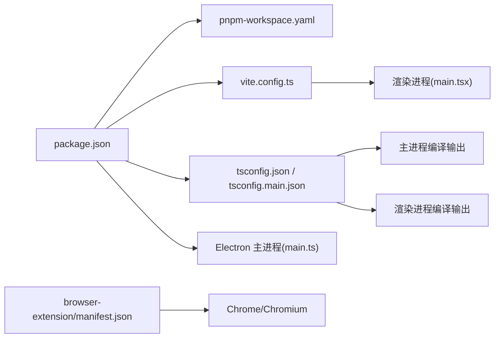

# 快速开始

<cite>
**本文引用的文件**   
- [package.json](file://package.json)
- [pnpm-workspace.yaml](file://pnpm-workspace.yaml)
- [vite.config.ts](file://vite.config.ts)
- [tsconfig.json](file://tsconfig.json)
- [tsconfig.main.json](file://tsconfig.main.json)
- [src/main/main.ts](file://src/main/main.ts)
- [src/renderer/main.tsx](file://src/renderer/main.tsx)
- [src/renderer/index.html](file://src/renderer/index.html)
- [browser-extension/manifest.json](file://browser-extension/manifest.json)
</cite>

## 目录
1. [简介](#简介)
2. [项目结构](#项目结构)
3. [核心组件](#核心组件)
4. [架构总览](#架构总览)
5. [详细组件分析](#详细组件分析)
6. [依赖分析](#依赖分析)
7. [性能注意事项](#性能注意事项)
8. [故障排除指南](#故障排除指南)
9. [结论](#结论)
10. [附录](#附录)

## 简介
本快速开始指南面向首次接触“砚都跨境”项目的开发者与使用者，目标是帮助你在最短时间内完成环境准备、依赖安装与项目启动，并顺利完成首次运行与基础使用。本项目采用 Electron + Vite + TypeScript 的桌面应用架构，前端基于 React，后端主进程由 Node.js 驱动，同时包含浏览器扩展模块与工具脚本。

## 项目结构
- 根目录包含包管理配置（pnpm）、TypeScript 编译配置、Vite 构建配置以及 Electron 入口。
- src 目录分为 main（Electron 主进程）、renderer（渲染进程前端）、shared（共享逻辑）。
- browser-extension 为浏览器扩展模块，用于与网页交互或增强功能。
- tools 提供辅助工具与脚本。

图表来源
- [package.json](file://package.json)
- [pnpm-workspace.yaml](file://pnpm-workspace.yaml)
- [vite.config.ts](file://vite.config.ts)
- [tsconfig.json](file://tsconfig.json)
- [tsconfig.main.json](file://tsconfig.main.json)
- [src/main/main.ts](file://src/main/main.ts)
- [src/renderer/main.tsx](file://src/renderer/main.tsx)
- [src/renderer/index.html](file://src/renderer/index.html)
- [browser-extension/manifest.json](file://browser-extension/manifest.json)

章节来源
- [package.json](file://package.json)
- [pnpm-workspace.yaml](file://pnpm-workspace.yaml)
- [vite.config.ts](file://vite.config.ts)
- [tsconfig.json](file://tsconfig.json)
- [tsconfig.main.json](file://tsconfig.main.json)
- [src/main/main.ts](file://src/main/main.ts)
- [src/renderer/main.tsx](file://src/renderer/main.tsx)
- [src/renderer/index.html](file://src/renderer/index.html)
- [browser-extension/manifest.json](file://browser-extension/manifest.json)

## 核心组件
- 包管理与工作区：通过 pnpm 与工作区配置统一管理多模块依赖与脚本。
- 构建与开发服务器：Vite 负责渲染进程的构建与热更新；Electron 主进程由 TypeScript 编译后运行。
- 前端入口：React 应用通过 main.tsx 初始化，index.html 作为页面模板。
- 主进程入口：Electron 主进程从 main.ts 启动，负责窗口创建、生命周期与 IPC 桥接等。
- 浏览器扩展：manifest.json 定义扩展元数据与权限，配合 content-script/popup/service-worker 实现网页增强。

章节来源
- [package.json](file://package.json)
- [pnpm-workspace.yaml](file://pnpm-workspace.yaml)
- [vite.config.ts](file://vite.config.ts)
- [src/renderer/main.tsx](file://src/renderer/main.tsx)
- [src/renderer/index.html](file://src/renderer/index.html)
- [src/main/main.ts](file://src/main/main.ts)
- [browser-extension/manifest.json](file://browser-extension/manifest.json)

## 架构总览
下图展示了 Electron 应用的总体架构：主进程负责应用生命周期与系统能力调用，渲染进程承载 UI 与业务交互，两者通过 IPC 通信。Vite 在开发阶段提供热更新与资源打包，TypeScript 统一类型与编译配置。

图表来源
- [src/main/main.ts](file://src/main/main.ts)
- [src/renderer/main.tsx](file://src/renderer/main.tsx)
- [src/renderer/index.html](file://src/renderer/index.html)
- [vite.config.ts](file://vite.config.ts)
- [tsconfig.json](file://tsconfig.json)
- [tsconfig.main.json](file://tsconfig.main.json)
- [package.json](file://package.json)
- [pnpm-workspace.yaml](file://pnpm-workspace.yaml)
- [browser-extension/manifest.json](file://browser-extension/manifest.json)

## 详细组件分析

### 环境与安装要求
- Node.js 版本：建议使用长期支持（LTS）版本，确保与 pnpm 和 TypeScript 兼容。
- 包管理器：必须使用 pnpm，以利用工作区与锁文件一致性。
- 操作系统：Windows/macOS/Linux（Electron 原生依赖可能因平台而异）。
- 可选依赖：若启用浏览器扩展，请确保 Chrome/Chromium 可用以便调试。

章节来源
- [package.json](file://package.json)
- [pnpm-workspace.yaml](file://pnpm-workspace.yaml)

### 依赖安装命令
- 在项目根目录执行 pnpm 安装，确保所有工作区依赖被正确解析与缓存。
- 如遇网络问题，可配置国内镜像源或使用代理。

章节来源
- [package.json](file://package.json)
- [pnpm-workspace.yaml](file://pnpm-workspace.yaml)

### 项目启动流程
- 开发模式：通过 package.json 中的脚本启动 Electron 主进程与 Vite 开发服务器，实现热更新与实时调试。
- 生产构建：先构建渲染进程资源，再打包 Electron 应用，生成可分发产物。
- 首次运行：启动后应看到 Electron 窗口加载渲染进程页面，确认无控制台错误。

图表来源
- [package.json](file://package.json)
- [vite.config.ts](file://vite.config.ts)
- [src/main/main.ts](file://src/main/main.ts)
- [src/renderer/main.tsx](file://src/renderer/main.tsx)
- [src/renderer/index.html](file://src/renderer/index.html)

章节来源
- [package.json](file://package.json)
- [vite.config.ts](file://vite.config.ts)
- [src/main/main.ts](file://src/main/main.ts)
- [src/renderer/main.tsx](file://src/renderer/main.tsx)
- [src/renderer/index.html](file://src/renderer/index.html)

### 首次运行配置说明
- 环境变量：如需接入外部服务（如翻译、图像、视频处理），请在环境变量中配置相应密钥与端点。
- 浏览器扩展：如需启用扩展功能，请将扩展目录加载到 Chrome/Chromium 的开发者模式中，并确保 manifest.json 配置正确。
- 数据库与存储：根据 database 模块的配置初始化本地存储或连接远程服务。

章节来源
- [browser-extension/manifest.json](file://browser-extension/manifest.json)
- [src/main/database/AppDatabase.ts](file://src/main/database/AppDatabase.ts)

### 基本使用示例
- 打开应用后，可在渲染进程中访问主要功能模块（如 eBay 相关工具、图像处理、视频编辑等）。
- 通过主进程提供的服务接口调用外部能力（如翻译、图像合规检测、报告生成等）。
- 浏览器扩展可用于网页抓取、内容注入与增强展示。

章节来源
- [src/main/services/*](file://src/main/services/EbayService.ts)
- [src/renderer/main.tsx](file://src/renderer/main.tsx)
- [browser-extension/manifest.json](file://browser-extension/manifest.json)

## 依赖分析
- 包管理：pnpm 工作区统一依赖，避免重复安装与版本冲突。
- 构建工具：Vite 提供快速开发与构建；TypeScript 保证类型安全与编译质量。
- 运行时：Electron 提供跨平台桌面应用运行时，主进程与渲染进程分离。
- 扩展：Chrome 扩展模块通过 manifest.json 声明权限与入口。

图表来源
- [package.json](file://package.json)
- [pnpm-workspace.yaml](file://pnpm-workspace.yaml)
- [vite.config.ts](file://vite.config.ts)
- [tsconfig.json](file://tsconfig.json)
- [tsconfig.main.json](file://tsconfig.main.json)
- [src/main/main.ts](file://src/main/main.ts)
- [src/renderer/main.tsx](file://src/renderer/main.tsx)
- [browser-extension/manifest.json](file://browser-extension/manifest.json)

章节来源
- [package.json](file://package.json)
- [pnpm-workspace.yaml](file://pnpm-workspace.yaml)
- [vite.config.ts](file://vite.config.ts)
- [tsconfig.json](file://tsconfig.json)
- [tsconfig.main.json](file://tsconfig.main.json)
- [src/main/main.ts](file://src/main/main.ts)
- [src/renderer/main.tsx](file://src/renderer/main.tsx)
- [browser-extension/manifest.json](file://browser-extension/manifest.json)

## 性能注意事项
- 开发体验：Vite 热更新与按需编译显著提升开发效率，建议保持依赖与插件最新。
- 内存占用：Electron 主进程与渲染进程各自独立，注意避免在主进程中执行重型任务。
- 构建优化：生产构建时启用代码分割与压缩，减少包体积与加载时间。
- 扩展性能：浏览器扩展应避免频繁 DOM 操作与长耗时脚本，必要时使用 Service Worker 异步处理。

[本节为通用指导，不直接分析具体文件]

## 故障排除指南
- 无法安装依赖
  - 检查 Node.js 版本是否符合要求，确保 pnpm 已全局安装。
  - 清理缓存后重试安装，必要时切换镜像源。
- 启动失败或白屏
  - 确认 Vite 开发服务器端口未被占用。
  - 检查 Electron 主进程是否成功加载渲染进程入口。
  - 查看浏览器控制台与 Electron 开发者工具的错误信息。
- 浏览器扩展未生效
  - 确认 manifest.json 配置正确且扩展目录路径无误。
  - 在 Chrome 扩展管理中重新加载扩展并检查权限。
- 外部服务调用失败
  - 检查环境变量是否正确设置（密钥、端点、超时等）。
  - 查看网络请求日志与服务返回状态码。

章节来源
- [package.json](file://package.json)
- [vite.config.ts](file://vite.config.ts)
- [src/main/main.ts](file://src/main/main.ts)
- [src/renderer/main.tsx](file://src/renderer/main.tsx)
- [browser-extension/manifest.json](file://browser-extension/manifest.json)

## 结论
通过本快速开始指南，你已完成环境准备、依赖安装与项目启动，并对 Electron + Vite + TypeScript 的架构有了清晰认识。建议在首次运行后逐步熟悉各模块职责与集成方式，结合文档与源码进一步扩展功能。

[本节为总结性内容，不直接分析具体文件]

## 附录
- 常用命令
  - 安装依赖：在根目录执行 pnpm install
  - 启动开发：在根目录执行 package.json 中定义的启动脚本
  - 构建生产：在根目录执行 package.json 中定义的构建脚本
- 关键配置文件
  - package.json：脚本与依赖声明
  - vite.config.ts：Vite 构建与开发服务器配置
  - tsconfig.json / tsconfig.main.json：TypeScript 编译选项
  - pnpm-workspace.yaml：工作区与依赖管理策略
  - browser-extension/manifest.json：浏览器扩展元数据与权限

章节来源
- [package.json](file://package.json)
- [vite.config.ts](file://vite.config.ts)
- [tsconfig.json](file://tsconfig.json)
- [tsconfig.main.json](file://tsconfig.main.json)
- [pnpm-workspace.yaml](file://pnpm-workspace.yaml)
- [browser-extension/manifest.json](file://browser-extension/manifest.json)