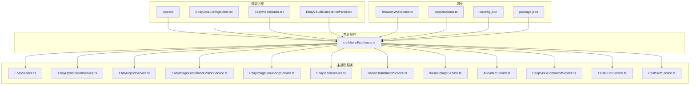
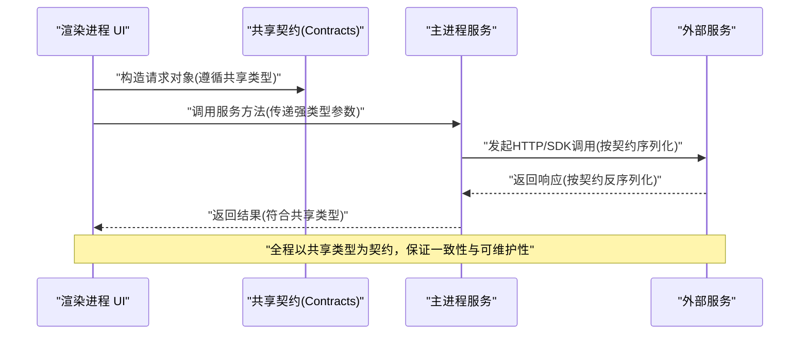
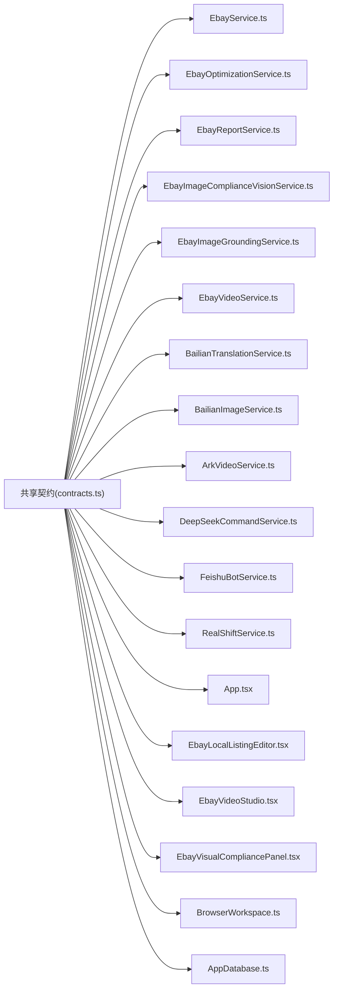
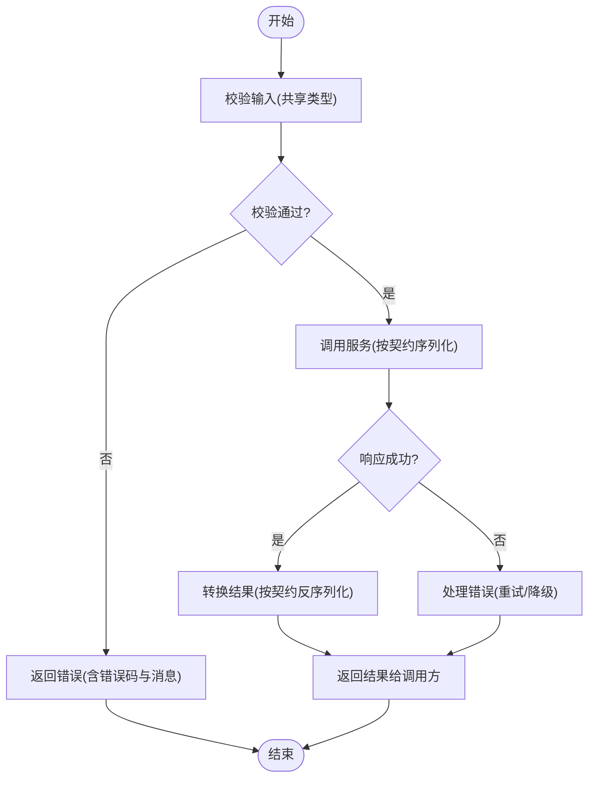

# 合同契约与类型定义

<cite>
**本文引用的文件**   
- [src/shared/contracts.ts](file://src/shared/contracts.ts)
- [src/main/services/EbayService.ts](file://src/main/services/EbayService.ts)
- [src/main/services/EbayOptimizationService.ts](file://src/main/services/EbayOptimizationService.ts)
- [src/main/services/EbayReportService.ts](file://src/main/services/EbayReportService.ts)
- [src/main/services/EbayImageComplianceVisionService.ts](file://src/main/services/EbayImageComplianceVisionService.ts)
- [src/main/services/EbayImageGroundingService.ts](file://src/main/services/EbayImageGroundingService.ts)
- [src/main/services/EbayVideoService.ts](file://src/main/services/EbayVideoService.ts)
- [src/main/services/BailianTranslationService.ts](file://src/main/services/BailianTranslationService.ts)
- [src/main/services/BailianImageService.ts](file://src/main/services/BailianImageService.ts)
- [src/main/services/ArkVideoService.ts](file://src/main/services/ArkVideoService.ts)
- [src/main/services/DeepSeekCommandService.ts](file://src/main/services/DeepSeekCommandService.ts)
- [src/main/services/FeishuBotService.ts](file://src/main/services/FeishuBotService.ts)
- [src/main/services/RealShiftService.ts](file://src/main/services/RealShiftService.ts)
- [src/renderer/App.tsx](file://src/renderer/App.tsx)
- [src/renderer/EbayLocalListingEditor.tsx](file://src/renderer/EbayLocalListingEditor.tsx)
- [src/renderer/EbayVideoStudio.tsx](file://src/renderer/EbayVideoStudio.tsx)
- [src/renderer/EbayVisualCompliancePanel.tsx](file://src/renderer/EbayVisualCompliancePanel.tsx)
- [src/main/browser/BrowserWorkspace.ts](file://src/main/browser/BrowserWorkspace.ts)
- [src/main/database/AppDatabase.ts](file://src/main/database/AppDatabase.ts)
- [tsconfig.json](file://tsconfig.json)
- [package.json](file://package.json)
</cite>

## 目录
1. [简介](#简介)
2. [项目结构](#项目结构)
3. [核心组件](#核心组件)
4. [架构总览](#架构总览)
5. [详细组件分析](#详细组件分析)
6. [依赖关系分析](#依赖关系分析)
7. [性能考量](#性能考量)
8. [故障排查指南](#故障排查指南)
9. [结论](#结论)
10. [附录](#附录)

## 简介
本文件聚焦于项目的“合同契约与类型定义”，系统化梳理跨模块共享的 TypeScript 接口、类型别名与枚举，覆盖 eBay 商品数据模型、API 请求/响应结构、服务间通信协议等。文档旨在：
- 明确各类型的约束、可选字段与业务规则验证
- 提供类型使用示例与最佳实践，确保跨模块数据一致性
- 通过图示化方式呈现关键流程与数据结构关系，便于不同技术背景的读者理解

## 项目结构
本项目采用多进程架构（主进程、渲染进程、浏览器工作区），并通过 shared 目录集中管理跨进程共享的类型与契约。核心目录职责如下：
- src/shared：共享契约与类型定义（如 contracts.ts）
- src/main：主进程服务层（eBay、图像、视频、翻译、AI 命令、飞书机器人、第三方服务等）
- src/renderer：渲染进程 UI 与交互逻辑（编辑器、视频工作室、合规面板等）
- src/main/browser：浏览器工作区（扩展集成）
- src/main/database：数据库访问封装
- tsconfig.json、package.json：TypeScript 编译配置与依赖声明

图表来源
- [src/shared/contracts.ts](file://src/shared/contracts.ts)
- [src/main/services/EbayService.ts](file://src/main/services/EbayService.ts)
- [src/main/services/EbayOptimizationService.ts](file://src/main/services/EbayOptimizationService.ts)
- [src/main/services/EbayReportService.ts](file://src/main/services/EbayReportService.ts)
- [src/main/services/EbayImageComplianceVisionService.ts](file://src/main/services/EbayImageComplianceVisionService.ts)
- [src/main/services/EbayImageGroundingService.ts](file://src/main/services/EbayImageGroundingService.ts)
- [src/main/services/EbayVideoService.ts](file://src/main/services/EbayVideoService.ts)
- [src/main/services/BailianTranslationService.ts](file://src/main/services/BailianTranslationService.ts)
- [src/main/services/BailianImageService.ts](file://src/main/services/BailianImageService.ts)
- [src/main/services/ArkVideoService.ts](file://src/main/services/ArkVideoService.ts)
- [src/main/services/DeepSeekCommandService.ts](file://src/main/services/DeepSeekCommandService.ts)
- [src/main/services/FeishuBotService.ts](file://src/main/services/FeishuBotService.ts)
- [src/main/services/RealShiftService.ts](file://src/main/services/RealShiftService.ts)
- [src/renderer/App.tsx](file://src/renderer/App.tsx)
- [src/renderer/EbayLocalListingEditor.tsx](file://src/renderer/EbayLocalListingEditor.tsx)
- [src/renderer/EbayVideoStudio.tsx](file://src/renderer/EbayVideoStudio.tsx)
- [src/renderer/EbayVisualCompliancePanel.tsx](file://src/renderer/EbayVisualCompliancePanel.tsx)
- [src/main/browser/BrowserWorkspace.ts](file://src/main/browser/BrowserWorkspace.ts)
- [src/main/database/AppDatabase.ts](file://src/main/database/AppDatabase.ts)
- [tsconfig.json](file://tsconfig.json)
- [package.json](file://package.json)

章节来源
- [src/shared/contracts.ts](file://src/shared/contracts.ts)
- [tsconfig.json](file://tsconfig.json)
- [package.json](file://package.json)

## 核心组件
本节概述共享契约与类型在系统中的角色与边界：
- 共享契约（contracts.ts）：集中定义跨模块使用的接口、类型别名与枚举，作为“单一事实来源”
- eBay 服务族：围绕商品数据模型、优化、报告、图像合规、视频生成等能力，统一消费共享类型
- 渲染进程：UI 层与服务层通过共享类型进行数据绑定与校验
- 外部服务：翻译、图像、视频、AI 命令、飞书、RealShift 等通过约定好的请求/响应结构与主进程交互

章节来源
- [src/shared/contracts.ts](file://src/shared/contracts.ts)
- [src/main/services/EbayService.ts](file://src/main/services/EbayService.ts)
- [src/main/services/EbayOptimizationService.ts](file://src/main/services/EbayOptimizationService.ts)
- [src/main/services/EbayReportService.ts](file://src/main/services/EbayReportService.ts)
- [src/main/services/EbayImageComplianceVisionService.ts](file://src/main/services/EbayImageComplianceVisionService.ts)
- [src/main/services/EbayImageGroundingService.ts](file://src/main/services/EbayImageGroundingService.ts)
- [src/main/services/EbayVideoService.ts](file://src/main/services/EbayVideoService.ts)
- [src/main/services/BailianTranslationService.ts](file://src/main/services/BailianTranslationService.ts)
- [src/main/services/BailianImageService.ts](file://src/main/services/BailianImageService.ts)
- [src/main/services/ArkVideoService.ts](file://src/main/services/ArkVideoService.ts)
- [src/main/services/DeepSeekCommandService.ts](file://src/main/services/DeepSeekCommandService.ts)
- [src/main/services/FeishuBotService.ts](file://src/main/services/FeishuBotService.ts)
- [src/main/services/RealShiftService.ts](file://src/main/services/RealShiftService.ts)
- [src/renderer/App.tsx](file://src/renderer/App.tsx)
- [src/renderer/EbayLocalListingEditor.tsx](file://src/renderer/EbayLocalListingEditor.tsx)
- [src/renderer/EbayVideoStudio.tsx](file://src/renderer/EbayVideoStudio.tsx)
- [src/renderer/EbayVisualCompliancePanel.tsx](file://src/renderer/EbayVisualCompliancePanel.tsx)

## 架构总览
下图展示了从渲染进程到主进程服务再到外部服务的调用链路与数据契约流向。所有跨进程通信均基于共享类型进行序列化/反序列化与校验。

图表来源
- [src/shared/contracts.ts](file://src/shared/contracts.ts)
- [src/main/services/EbayService.ts](file://src/main/services/EbayService.ts)
- [src/main/services/BailianTranslationService.ts](file://src/main/services/BailianTranslationService.ts)
- [src/main/services/BailianImageService.ts](file://src/main/services/BailianImageService.ts)
- [src/main/services/ArkVideoService.ts](file://src/main/services/ArkVideoService.ts)
- [src/main/services/DeepSeekCommandService.ts](file://src/main/services/DeepSeekCommandService.ts)
- [src/main/services/FeishuBotService.ts](file://src/main/services/FeishuBotService.ts)
- [src/main/services/RealShiftService.ts](file://src/main/services/RealShiftService.ts)

## 详细组件分析

### 共享契约与类型（contracts.ts）
- 作用：集中定义跨模块共享的接口、类型别名与枚举，作为系统“合同”
- 典型内容范畴（依据文件名与模块职责推断）：
  - eBay 商品数据模型（标题、描述、图片、价格、类目、属性等）
  - API 请求/响应结构（分页、错误码、状态、审计信息等）
  - 服务间通信协议（消息体、回调、任务状态、进度等）
  - 枚举与常量（语言、地区、合规等级、任务类型等）
- 设计要点：
  - 严格区分必填与可选字段，避免运行时歧义
  - 对业务规则进行类型级约束（如长度范围、格式校验）
  - 为可扩展性预留联合类型或 discriminated union

章节来源
- [src/shared/contracts.ts](file://src/shared/contracts.ts)

### eBay 服务族（EbayService / Optimization / Report / Image / Video）
- 职责划分：
  - EbayService：基础 eBay 操作（商品查询、发布、更新等）
  - EbayOptimizationService：标题/描述优化、关键词建议、SEO 策略
  - EbayReportService：报表生成、指标汇总、导出
  - EbayImageComplianceVisionService：图像合规检测（视觉模型）
  - EbayImageGroundingService：图像定位/标注（Grounding）
  - EbayVideoService：视频素材生成、剪辑、转码
- 契约消费：
  - 输入输出均遵循共享类型，确保与渲染进程和外部服务的一致性
  - 错误处理通过统一的错误结构上报，包含错误码、消息与上下文

章节来源
- [src/main/services/EbayService.ts](file://src/main/services/EbayService.ts)
- [src/main/services/EbayOptimizationService.ts](file://src/main/services/EbayOptimizationService.ts)
- [src/main/services/EbayReportService.ts](file://src/main/services/EbayReportService.ts)
- [src/main/services/EbayImageComplianceVisionService.ts](file://src/main/services/EbayImageComplianceVisionService.ts)
- [src/main/services/EbayImageGroundingService.ts](file://src/main/services/EbayImageGroundingService.ts)
- [src/main/services/EbayVideoService.ts](file://src/main/services/EbayVideoService.ts)

### 外部服务集成（翻译、图像、视频、AI、飞书、RealShift）
- BailianTranslationService：文本翻译（源语言、目标语言、文本数组、质量评分）
- BailianImageService：图像处理（尺寸、格式、水印、压缩）
- ArkVideoService：视频处理（片段裁剪、字幕、封面）
- DeepSeekCommandService：AI 指令执行（prompt、参数、结果）
- FeishuBotService：飞书机器人通知（消息模板、卡片、回调）
- RealShiftService：第三方同步（增量同步、冲突解决、幂等键）
- 契约要点：
  - 请求/响应结构严格对齐共享类型
  - 失败重试、超时、降级策略通过类型与枚举表达

章节来源
- [src/main/services/BailianTranslationService.ts](file://src/main/services/BailianTranslationService.ts)
- [src/main/services/BailianImageService.ts](file://src/main/services/BailianImageService.ts)
- [src/main/services/ArkVideoService.ts](file://src/main/services/ArkVideoService.ts)
- [src/main/services/DeepSeekCommandService.ts](file://src/main/services/DeepSeekCommandService.ts)
- [src/main/services/FeishuBotService.ts](file://src/main/services/FeishuBotService.ts)
- [src/main/services/RealShiftService.ts](file://src/main/services/RealShiftService.ts)

### 渲染进程（App / Editor / Video Studio / Compliance Panel）
- App.tsx：应用入口，装配服务与状态
- EbayLocalListingEditor.tsx：本地刊登编辑，绑定共享商品模型
- EbayVideoStudio.tsx：视频工作室，驱动视频生成与预览
- EbayVisualCompliancePanel.tsx：视觉合规面板，展示检测结果与建议
- 契约消费：
  - 表单输入与校验遵循共享类型
  - 与服务层交互时，严格使用请求/响应结构

章节来源
- [src/renderer/App.tsx](file://src/renderer/App.tsx)
- [src/renderer/EbayLocalListingEditor.tsx](file://src/renderer/EbayLocalListingEditor.tsx)
- [src/renderer/EbayVideoStudio.tsx](file://src/renderer/EbayVideoStudio.tsx)
- [src/renderer/EbayVisualCompliancePanel.tsx](file://src/renderer/EbayVisualCompliancePanel.tsx)

### 浏览器工作区与数据库（BrowserWorkspace / AppDatabase）
- BrowserWorkspace：浏览器扩展集成，桥接内容与页面
- AppDatabase：数据持久化封装，提供增删改查与迁移
- 契约消费：
  - 与共享类型保持一致，确保跨进程数据一致性
  - 数据库实体映射与共享类型一一对应

章节来源
- [src/main/browser/BrowserWorkspace.ts](file://src/main/browser/BrowserWorkspace.ts)
- [src/main/database/AppDatabase.ts](file://src/main/database/AppDatabase.ts)

## 依赖关系分析
共享契约被所有服务与 UI 模块依赖，形成稳定的“内聚型”契约中心。服务之间通过共享类型解耦，降低耦合度并提升可测试性。

图表来源
- [src/shared/contracts.ts](file://src/shared/contracts.ts)
- [src/main/services/EbayService.ts](file://src/main/services/EbayService.ts)
- [src/main/services/EbayOptimizationService.ts](file://src/main/services/EbayOptimizationService.ts)
- [src/main/services/EbayReportService.ts](file://src/main/services/EbayReportService.ts)
- [src/main/services/EbayImageComplianceVisionService.ts](file://src/main/services/EbayImageComplianceVisionService.ts)
- [src/main/services/EbayImageGroundingService.ts](file://src/main/services/EbayImageGroundingService.ts)
- [src/main/services/EbayVideoService.ts](file://src/main/services/EbayVideoService.ts)
- [src/main/services/BailianTranslationService.ts](file://src/main/services/BailianTranslationService.ts)
- [src/main/services/BailianImageService.ts](file://src/main/services/BailianImageService.ts)
- [src/main/services/ArkVideoService.ts](file://src/main/services/ArkVideoService.ts)
- [src/main/services/DeepSeekCommandService.ts](file://src/main/services/DeepSeekCommandService.ts)
- [src/main/services/FeishuBotService.ts](file://src/main/services/FeishuBotService.ts)
- [src/main/services/RealShiftService.ts](file://src/main/services/RealShiftService.ts)
- [src/renderer/App.tsx](file://src/renderer/App.tsx)
- [src/renderer/EbayLocalListingEditor.tsx](file://src/renderer/EbayLocalListingEditor.tsx)
- [src/renderer/EbayVideoStudio.tsx](file://src/renderer/EbayVideoStudio.tsx)
- [src/renderer/EbayVisualCompliancePanel.tsx](file://src/renderer/EbayVisualCompliancePanel.tsx)
- [src/main/browser/BrowserWorkspace.ts](file://src/main/browser/BrowserWorkspace.ts)
- [src/main/database/AppDatabase.ts](file://src/main/database/AppDatabase.ts)

章节来源
- [src/shared/contracts.ts](file://src/shared/contracts.ts)

## 性能考量
- 类型体积与编译时间：共享契约应尽量精简，避免过度嵌套；合理使用类型别名与泛型
- 运行时开销：避免在高频路径中进行复杂类型守卫；将校验下沉至边界层
- 网络传输：请求/响应结构需最小化冗余字段，支持按需加载与分页
- 缓存策略：对只读数据（类目、属性字典）进行本地缓存，减少重复请求

[本节为通用指导，不直接分析具体文件]

## 故障排查指南
- 类型不一致：检查共享契约是否变更且未同步更新消费方
- 字段缺失或类型错误：确认请求/响应结构是否符合契约，必要时增加断言
- 外部服务异常：查看错误码与消息，结合重试与降级策略定位问题
- 调试建议：在服务边界打印入参/出参的结构摘要，快速比对契约差异

章节来源
- [src/main/services/EbayService.ts](file://src/main/services/EbayService.ts)
- [src/main/services/BailianTranslationService.ts](file://src/main/services/BailianTranslationService.ts)
- [src/main/services/BailianImageService.ts](file://src/main/services/BailianImageService.ts)
- [src/main/services/ArkVideoService.ts](file://src/main/services/ArkVideoService.ts)
- [src/main/services/DeepSeekCommandService.ts](file://src/main/services/DeepSeekCommandService.ts)
- [src/main/services/FeishuBotService.ts](file://src/main/services/FeishuBotService.ts)
- [src/main/services/RealShiftService.ts](file://src/main/services/RealShiftService.ts)

## 结论
通过集中化的共享契约与严格的类型约束，项目在跨进程、跨服务的数据交换中实现了高一致性与可维护性。建议在后续迭代中：
- 持续完善契约文档与版本管理
- 引入契约测试与快照对比，防止破坏性变更
- 对复杂业务规则补充类型级校验与注释说明

[本节为总结性内容，不直接分析具体文件]

## 附录

### 类型使用示例与最佳实践
- 示例场景
  - 创建 eBay 商品：渲染进程构造商品对象，遵循共享模型，提交至主进程服务发布
  - 图像合规检测：上传图像元数据，调用视觉服务，返回合规结果与建议
  - 翻译与本地化：批量文本翻译，返回多语言版本与质量评分
- 最佳实践
  - 优先使用联合类型表达互斥状态，避免布尔标志泛滥
  - 对可选字段提供默认值与空值处理策略
  - 在边界处进行输入校验，尽早失败
  - 保持向后兼容，新增字段默认可选

[本节为概念性内容，不直接分析具体文件]

### 关键流程图（算法与决策）

[本图为概念性流程图，不直接映射具体源码文件]