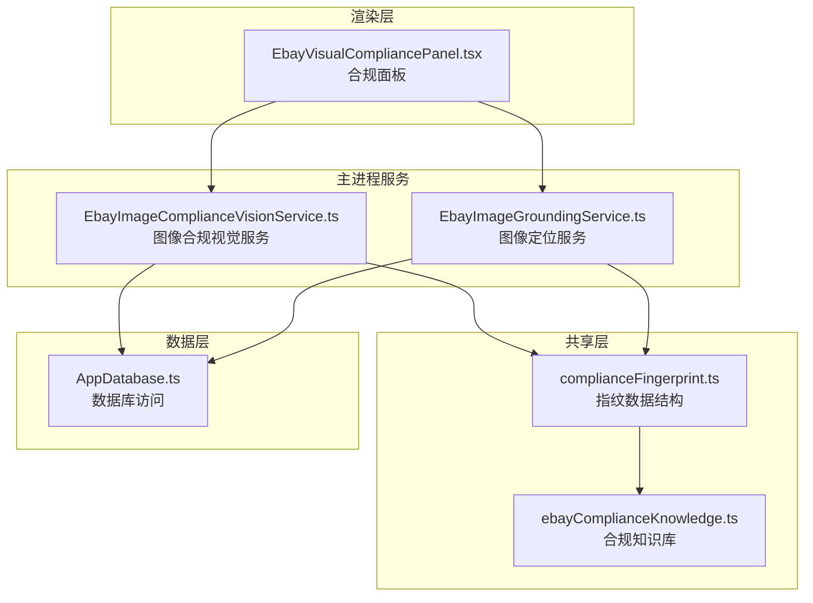
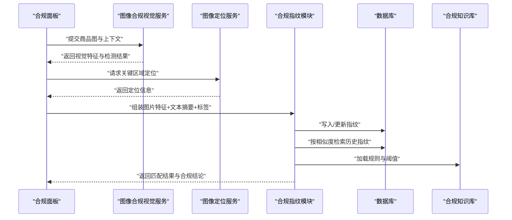
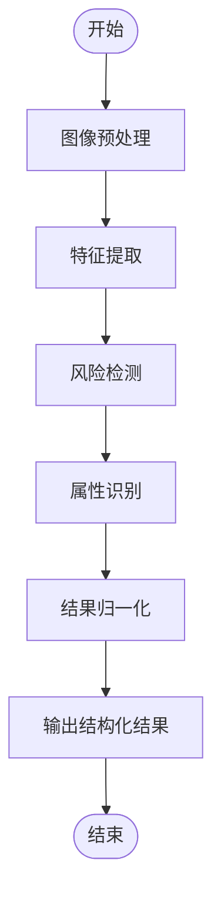
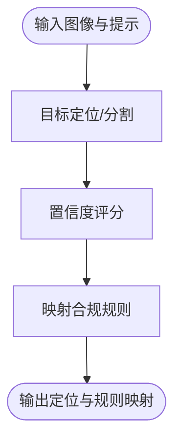
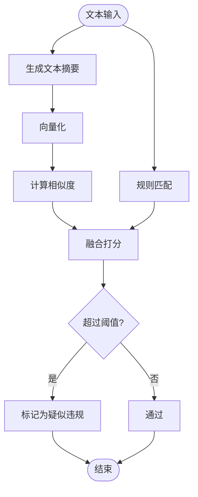
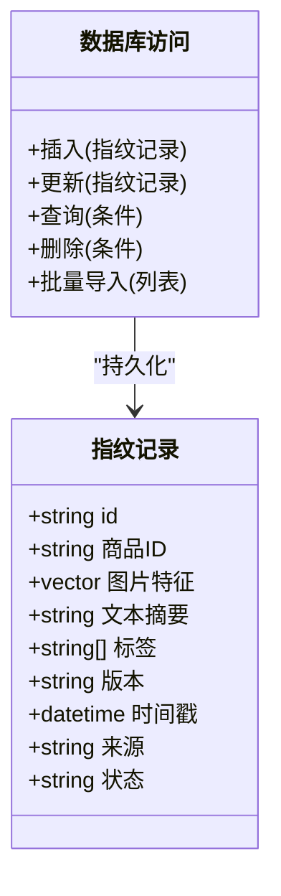
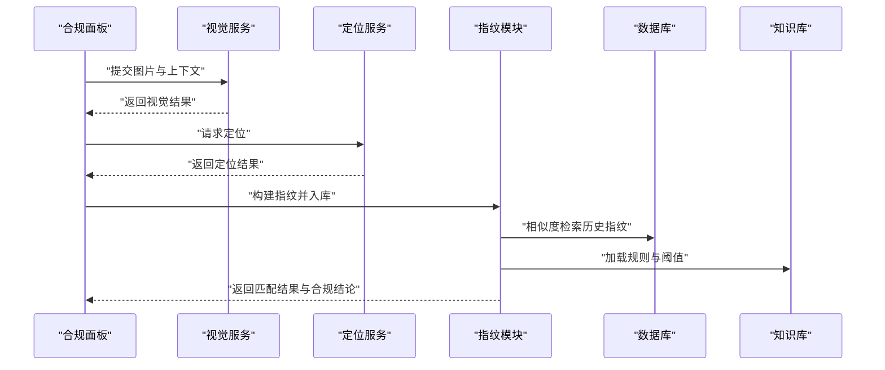
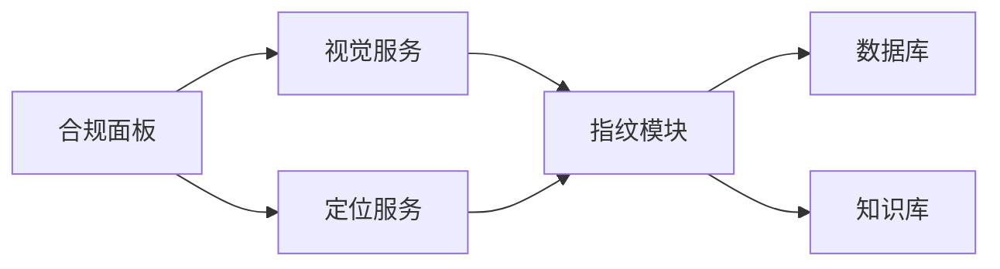

# 合规指纹模型

<cite>
**本文档引用的文件**   
- [src/shared/complianceFingerprint.ts](file://src/shared/complianceFingerprint.ts)
- [src/main/services/EbayImageComplianceVisionService.ts](file://src/main/services/EbayImageComplianceVisionService.ts)
- [src/main/services/EbayImageGroundingService.ts](file://src/main/services/EbayImageGroundingService.ts)
- [src/renderer/EbayVisualCompliancePanel.tsx](file://src/renderer/EbayVisualCompliancePanel.tsx)
- [src/main/database/AppDatabase.ts](file://src/main/database/AppDatabase.ts)
- [src/shared/ebayComplianceKnowledge.ts](file://src/shared/ebayComplianceKnowledge.ts)
- [package.json](file://package.json)
</cite>

## 目录
1. [简介](#简介)
2. [项目结构](#项目结构)
3. [核心组件](#核心组件)
4. [架构总览](#架构总览)
5. [详细组件分析](#详细组件分析)
6. [依赖关系分析](#依赖关系分析)
7. [性能考量](#性能考量)
8. [故障排查指南](#故障排查指南)
9. [结论](#结论)
10. [附录](#附录)

## 简介
本文件面向“合规指纹模型”的设计与实现，围绕商品合规性检查的数据结构、指纹生成算法与匹配规则展开，覆盖图片特征提取、文本相似度计算、违规内容识别等核心逻辑。文档同时描述指纹存储格式、检索策略与更新机制，并给出完整的合规检查流程与错误处理方案，帮助读者快速理解与落地该能力。

## 项目结构
与合规指纹相关的代码主要分布在以下位置：
- 共享层（shared）：定义合规指纹数据结构与通用知识规则
- 主进程服务（main/services）：提供图像视觉与定位服务，驱动指纹生成与比对
- 渲染层（renderer）：可视化面板用于展示合规检查结果与操作入口
- 数据持久化（database）：负责指纹与结果的持久化存储与查询

图表来源
- [src/shared/complianceFingerprint.ts](file://src/shared/complianceFingerprint.ts)
- [src/main/services/EbayImageComplianceVisionService.ts](file://src/main/services/EbayImageComplianceVisionService.ts)
- [src/main/services/EbayImageGroundingService.ts](file://src/main/services/EbayImageGroundingService.ts)
- [src/renderer/EbayVisualCompliancePanel.tsx](file://src/renderer/EbayVisualCompliancePanel.tsx)
- [src/main/database/AppDatabase.ts](file://src/main/database/AppDatabase.ts)
- [src/shared/ebayComplianceKnowledge.ts](file://src/shared/ebayComplianceKnowledge.ts)

章节来源
- [src/shared/complianceFingerprint.ts](file://src/shared/complianceFingerprint.ts)
- [src/main/services/EbayImageComplianceVisionService.ts](file://src/main/services/EbayImageComplianceVisionService.ts)
- [src/main/services/EbayImageGroundingService.ts](file://src/main/services/EbayImageGroundingService.ts)
- [src/renderer/EbayVisualCompliancePanel.tsx](file://src/renderer/EbayVisualCompliancePanel.tsx)
- [src/main/database/AppDatabase.ts](file://src/main/database/AppDatabase.ts)
- [src/shared/ebayComplianceKnowledge.ts](file://src/shared/ebayComplianceKnowledge.ts)

## 核心组件
- 合规指纹数据结构：统一描述商品的多模态指纹（图片特征向量、文本摘要、标签与元数据），以及版本与时间戳等字段，便于跨模块复用与演进。
- 图像合规视觉服务：对商品图进行特征提取、风险检测与属性识别，输出结构化结果供指纹构建使用。
- 图像定位服务：基于目标定位或区域标注，辅助判断图中关键元素是否合规。
- 合规面板：前端交互入口，触发检查、展示结果与操作建议。
- 数据库访问：提供指纹与检查结果的增删改查与索引优化。
- 合规知识库：集中管理平台规则、关键词与阈值配置，支撑文本相似度与违规识别。

章节来源
- [src/shared/complianceFingerprint.ts](file://src/shared/complianceFingerprint.ts)
- [src/main/services/EbayImageComplianceVisionService.ts](file://src/main/services/EbayImageComplianceVisionService.ts)
- [src/main/services/EbayImageGroundingService.ts](file://src/main/services/EbayImageGroundingService.ts)
- [src/renderer/EbayVisualCompliancePanel.tsx](file://src/renderer/EbayVisualCompliancePanel.tsx)
- [src/main/database/AppDatabase.ts](file://src/main/database/AppDatabase.ts)
- [src/shared/ebayComplianceKnowledge.ts](file://src/shared/ebayComplianceKnowledge.ts)

## 架构总览
整体流程以“面板触发 → 多模态特征提取 → 指纹构建 → 存储与检索 → 匹配决策 → 结果反馈”为主线，结合知识库与规则引擎完成合规判定。

图表来源
- [src/renderer/EbayVisualCompliancePanel.tsx](file://src/renderer/EbayVisualCompliancePanel.tsx)
- [src/main/services/EbayImageComplianceVisionService.ts](file://src/main/services/EbayImageComplianceVisionService.ts)
- [src/main/services/EbayImageGroundingService.ts](file://src/main/services/EbayImageGroundingService.ts)
- [src/shared/complianceFingerprint.ts](file://src/shared/complianceFingerprint.ts)
- [src/main/database/AppDatabase.ts](file://src/main/database/AppDatabase.ts)
- [src/shared/ebayComplianceKnowledge.ts](file://src/shared/ebayComplianceKnowledge.ts)

## 详细组件分析

### 合规指纹数据结构
- 设计要点
  - 多模态融合：包含图片特征向量、文本摘要、标签集合与元数据（版本号、时间戳、来源等）。
  - 可演进性：通过版本字段兼容不同阶段的指纹格式变更。
  - 可检索性：为常用维度建立索引键，支持高效相似度检索与去重。
- 复杂度与权衡
  - 向量维度与精度：更高维通常带来更好区分度但增加存储与计算开销。
  - 文本摘要长度：平衡语义表达与检索速度。
  - 标签粒度：细粒度提升准确性但增加维护成本。

章节来源
- [src/shared/complianceFingerprint.ts](file://src/shared/complianceFingerprint.ts)

### 图像特征提取与合规视觉服务
- 功能范围
  - 输入：商品图、可选的裁剪区域或提示词。
  - 输出：特征向量、风险标签、属性识别结果、置信度。
- 关键点
  - 预处理：尺寸归一化、色彩空间转换、噪声抑制。
  - 特征提取：使用视觉模型抽取高维向量，并进行归一化。
  - 风险检测：针对违禁元素、敏感标识等进行分类或回归预测。
  - 后处理：阈值过滤、置信度校准、结果结构化。

图表来源
- [src/main/services/EbayImageComplianceVisionService.ts](file://src/main/services/EbayImageComplianceVisionService.ts)

章节来源
- [src/main/services/EbayImageComplianceVisionService.ts](file://src/main/services/EbayImageComplianceVisionService.ts)

### 图像定位服务
- 功能范围
  - 输入：图像与定位提示（如目标类别、边界框先验）。
  - 输出：关键区域坐标、类别置信度、与合规规则的关联映射。
- 关键点
  - 定位策略：基于目标检测或分割模型，结合领域先验提高召回。
  - 规则映射：将定位结果映射到合规规则库中的具体条款。

图表来源
- [src/main/services/EbayImageGroundingService.ts](file://src/main/services/EbayImageGroundingService.ts)

章节来源
- [src/main/services/EbayImageGroundingService.ts](file://src/main/services/EbayImageGroundingService.ts)

### 文本相似度与违规内容识别
- 文本摘要生成
  - 从标题、描述、属性中提取关键语义片段，形成紧凑摘要。
- 相似度计算
  - 采用向量相似度（余弦相似度）与编辑距离相结合的策略，兼顾语义与字面差异。
- 违规识别
  - 基于知识库中的关键词、正则表达式与规则模板进行匹配；结合上下文与权重打分。
- 阈值与策略
  - 动态阈值：根据类目、历史命中率与误报率调整。
  - 组合策略：多指标加权融合，降低单一信号偏差。

图表来源
- [src/shared/ebayComplianceKnowledge.ts](file://src/shared/ebayComplianceKnowledge.ts)
- [src/shared/complianceFingerprint.ts](file://src/shared/complianceFingerprint.ts)

章节来源
- [src/shared/ebayComplianceKnowledge.ts](file://src/shared/ebayComplianceKnowledge.ts)
- [src/shared/complianceFingerprint.ts](file://src/shared/complianceFingerprint.ts)

### 指纹存储格式、检索策略与更新机制
- 存储格式
  - 指纹记录包含：唯一ID、商品ID、多模态特征、文本摘要、标签、版本、时间戳、来源与状态。
  - 索引设计：对商品ID、标签、时间戳与部分哈希值建立索引，加速检索与去重。
- 检索策略
  - 近似最近邻搜索：对向量特征进行降维与索引，支持高效相似度检索。
  - 复合条件查询：结合标签、时间与状态等多维筛选。
- 更新机制
  - 增量更新：仅更新变化字段，保留历史版本以便回溯。
  - 冲突解决：基于时间戳与版本号合并策略，避免覆盖有效数据。
  - 清理策略：定期归档过期指纹，释放存储空间。

图表来源
- [src/shared/complianceFingerprint.ts](file://src/shared/complianceFingerprint.ts)
- [src/main/database/AppDatabase.ts](file://src/main/database/AppDatabase.ts)

章节来源
- [src/shared/complianceFingerprint.ts](file://src/shared/complianceFingerprint.ts)
- [src/main/database/AppDatabase.ts](file://src/main/database/AppDatabase.ts)

### 合规检查流程与匹配规则
- 流程概览
  - 接收商品数据（图片、文本、属性）→ 多模态特征提取 → 指纹构建 → 存储与检索 → 规则匹配 → 输出合规结论与建议。
- 匹配规则
  - 图片相似度：设定阈值区间，结合风险标签综合判定。
  - 文本相似度：语义与字面双通道，结合规则模板与上下文。
  - 定位结果：关键区域命中高风险类别直接触发警告。
  - 综合决策：加权融合各信号，输出通过/警告/拒绝等级别。

图表来源
- [src/renderer/EbayVisualCompliancePanel.tsx](file://src/renderer/EbayVisualCompliancePanel.tsx)
- [src/main/services/EbayImageComplianceVisionService.ts](file://src/main/services/EbayImageComplianceVisionService.ts)
- [src/main/services/EbayImageGroundingService.ts](file://src/main/services/EbayImageGroundingService.ts)
- [src/shared/complianceFingerprint.ts](file://src/shared/complianceFingerprint.ts)
- [src/main/database/AppDatabase.ts](file://src/main/database/AppDatabase.ts)
- [src/shared/ebayComplianceKnowledge.ts](file://src/shared/ebayComplianceKnowledge.ts)

章节来源
- [src/renderer/EbayVisualCompliancePanel.tsx](file://src/renderer/EbayVisualCompliancePanel.tsx)
- [src/main/services/EbayImageComplianceVisionService.ts](file://src/main/services/EbayImageComplianceVisionService.ts)
- [src/main/services/EbayImageGroundingService.ts](file://src/main/services/EbayImageGroundingService.ts)
- [src/shared/complianceFingerprint.ts](file://src/shared/complianceFingerprint.ts)
- [src/main/database/AppDatabase.ts](file://src/main/database/AppDatabase.ts)
- [src/shared/ebayComplianceKnowledge.ts](file://src/shared/ebayComplianceKnowledge.ts)

## 依赖关系分析
- 模块耦合
  - 合规面板依赖视觉与定位服务，二者共同产出多模态特征。
  - 指纹模块依赖数据库与知识库，完成持久化与规则匹配。
- 外部依赖
  - 图像处理与视觉模型：由服务层封装调用。
  - 数据库：提供事务与索引能力。
- 潜在循环依赖
  - 当前分层清晰，未见循环引用；建议在新增模块时保持单向依赖。

图表来源
- [src/renderer/EbayVisualCompliancePanel.tsx](file://src/renderer/EbayVisualCompliancePanel.tsx)
- [src/main/services/EbayImageComplianceVisionService.ts](file://src/main/services/EbayImageComplianceVisionService.ts)
- [src/main/services/EbayImageGroundingService.ts](file://src/main/services/EbayImageGroundingService.ts)
- [src/shared/complianceFingerprint.ts](file://src/shared/complianceFingerprint.ts)
- [src/main/database/AppDatabase.ts](file://src/main/database/AppDatabase.ts)
- [src/shared/ebayComplianceKnowledge.ts](file://src/shared/ebayComplianceKnowledge.ts)

章节来源
- [src/renderer/EbayVisualCompliancePanel.tsx](file://src/renderer/EbayVisualCompliancePanel.tsx)
- [src/main/services/EbayImageComplianceVisionService.ts](file://src/main/services/EbayImageComplianceVisionService.ts)
- [src/main/services/EbayImageGroundingService.ts](file://src/main/services/EbayImageGroundingService.ts)
- [src/shared/complianceFingerprint.ts](file://src/shared/complianceFingerprint.ts)
- [src/main/database/AppDatabase.ts](file://src/main/database/AppDatabase.ts)
- [src/shared/ebayComplianceKnowledge.ts](file://src/shared/ebayComplianceKnowledge.ts)

## 性能考量
- 特征提取
  - 批处理与缓存：对相似图片进行去重与缓存，减少重复计算。
  - 模型选择：在精度与延迟之间权衡，必要时引入轻量模型。
- 相似度检索
  - 向量索引：使用近似最近邻索引（如HNSW/IVF）提升查询效率。
  - 降维与量化：适度压缩向量以降低内存与带宽压力。
- 文本处理
  - 摘要长度控制与分块策略，避免过长文本影响性能。
- 存储与I/O
  - 读写分离与连接池优化，批量写入减少事务开销。
  - 定期归档与冷热分层，保证热点数据响应速度。

[本节为通用指导，不直接分析具体文件]

## 故障排查指南
- 常见问题
  - 图像预处理失败：检查输入格式、尺寸与编码是否正确。
  - 特征提取超时：评估模型负载与并发限制，必要时降级或重试。
  - 相似度阈值不当：根据业务场景调优阈值，观察误报与漏报趋势。
  - 数据库连接异常：检查连接池配置与网络状况，确保事务一致性。
- 诊断步骤
  - 启用日志与追踪：记录关键节点耗时与中间结果。
  - 回放测试用例：使用已知样本验证链路稳定性。
  - 监控告警：对错误率、延迟与资源占用设置阈值。

章节来源
- [src/main/database/AppDatabase.ts](file://src/main/database/AppDatabase.ts)
- [src/main/services/EbayImageComplianceVisionService.ts](file://src/main/services/EbayImageComplianceVisionService.ts)
- [src/main/services/EbayImageGroundingService.ts](file://src/main/services/EbayImageGroundingService.ts)

## 结论
合规指纹模型通过多模态特征融合与规则驱动，构建了可扩展、可检索、可演进的合规检查体系。其核心在于稳健的指纹数据结构、高效的特征提取与检索策略，以及与知识库紧密耦合的规则匹配机制。在实际落地中，应持续优化阈值与模型，完善监控与回滚策略，确保合规判定的准确性与稳定性。

[本节为总结性内容，不直接分析具体文件]

## 附录
- 术语表
  - 指纹：商品的唯一多模态表示，包含图片特征、文本摘要与标签等。
  - 近似最近邻：在高维空间中快速查找相似向量的算法族。
  - 定位：识别图像中关键区域及其类别的过程。
- 参考配置
  - 依赖与脚本：参见项目配置文件以了解运行环境与工具链。

章节来源
- [package.json](file://package.json)