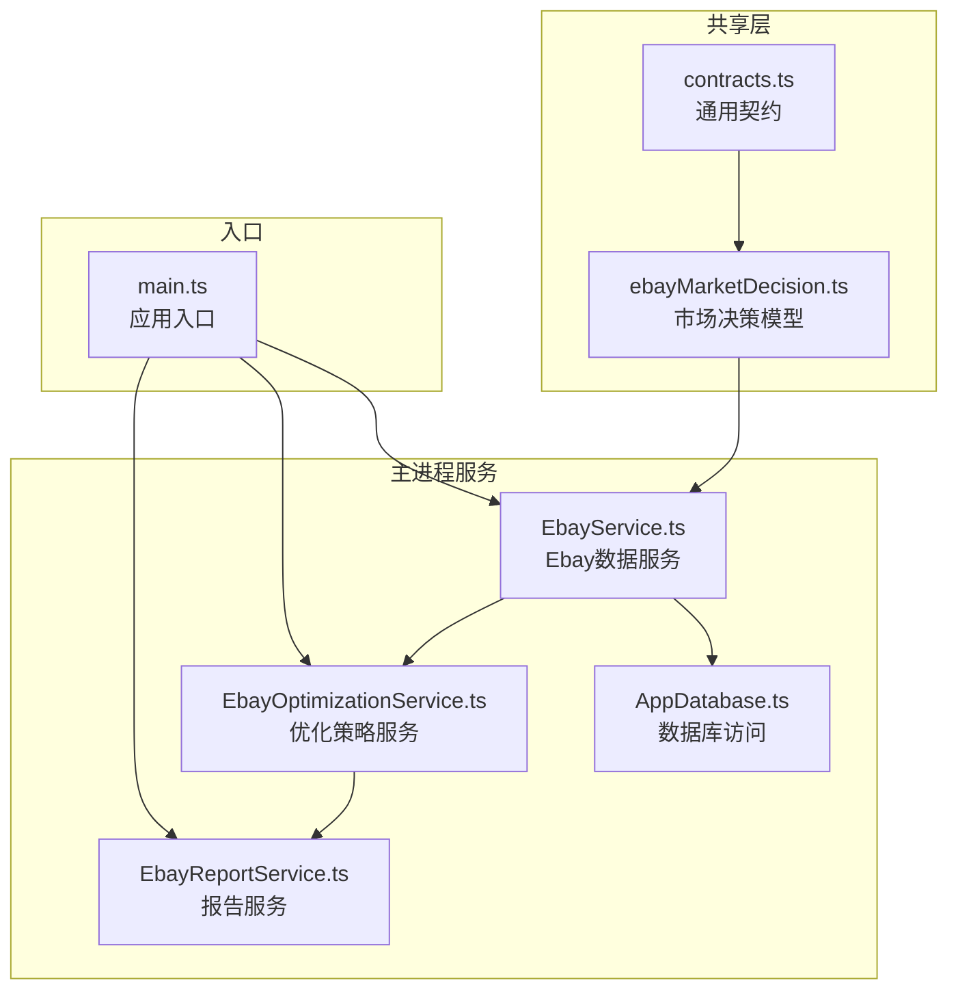
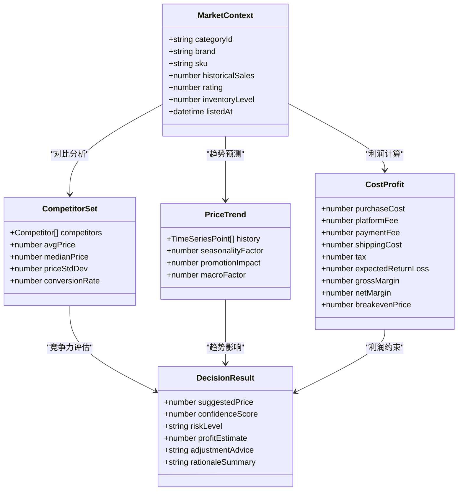
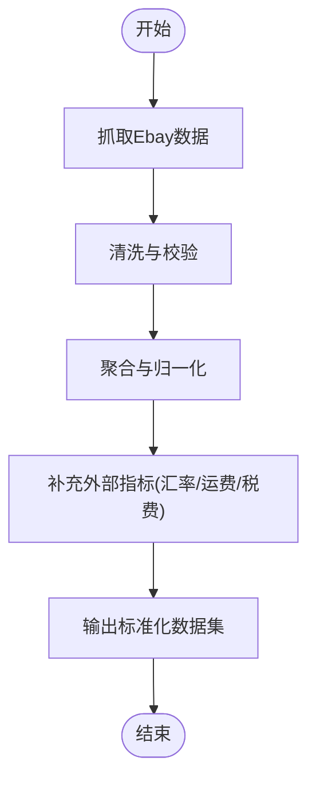
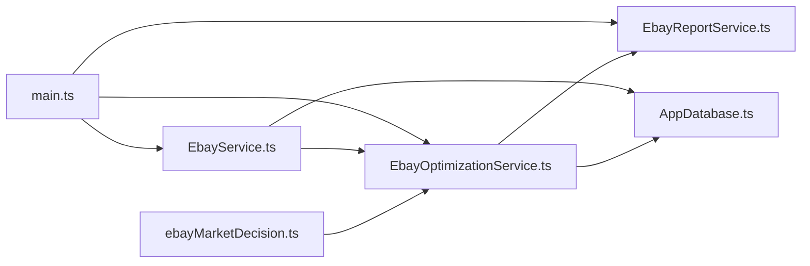

# 市场决策模型

<cite>
**本文引用的文件**   
- [ebayMarketDecision.ts](file://src/shared/ebayMarketDecision.ts)
- [contracts.ts](file://src/shared/contracts.ts)
- [EbayService.ts](file://src/main/services/EbayService.ts)
- [EbayOptimizationService.ts](file://src/main/services/EbayOptimizationService.ts)
- [EbayReportService.ts](file://src/main/services/EbayReportService.ts)
- [AppDatabase.ts](file://src/main/database/AppDatabase.ts)
- [main.ts](file://src/main/main.ts)
</cite>

## 目录
1. [简介](#简介)
2. [项目结构](#项目结构)
3. [核心组件](#核心组件)
4. [架构总览](#架构总览)
5. [详细组件分析](#详细组件分析)
6. [依赖关系分析](#依赖关系分析)
7. [性能考量](#性能考量)
8. [故障排查指南](#故障排查指南)
9. [结论](#结论)
10. [附录](#附录)

## 简介
本文件面向“市场决策模型”的设计与实现，聚焦于Ebay市场分析、竞品评估、价格趋势预测、利润计算与定价决策。文档从数据结构、评估指标、决策逻辑、权重与阈值配置、输出格式到流程优化建议进行系统化说明，帮助读者快速理解并落地使用。

## 项目结构
本项目采用前后端分离的Electron应用结构：
- shared层定义跨进程共享的数据契约与领域模型（如市场决策相关类型）。
- main层提供服务层能力（Ebay数据获取、优化策略、报告生成）与数据库访问。
- renderer层负责UI交互与展示。



**图表来源** 
- [contracts.ts](file://src/shared/contracts.ts)
- [ebayMarketDecision.ts](file://src/shared/ebayMarketDecision.ts)
- [EbayService.ts](file://src/main/services/EbayService.ts)
- [EbayOptimizationService.ts](file://src/main/services/EbayOptimizationService.ts)
- [EbayReportService.ts](file://src/main/services/EbayReportService.ts)
- [AppDatabase.ts](file://src/main/database/AppDatabase.ts)
- [main.ts](file://src/main/main.ts)

**章节来源**
- [contracts.ts](file://src/shared/contracts.ts)
- [ebayMarketDecision.ts](file://src/shared/ebayMarketDecision.ts)
- [EbayService.ts](file://src/main/services/EbayService.ts)
- [EbayOptimizationService.ts](file://src/main/services/EbayOptimizationService.ts)
- [EbayReportService.ts](file://src/main/services/EbayReportService.ts)
- [AppDatabase.ts](file://src/main/database/AppDatabase.ts)
- [main.ts](file://src/main/main.ts)

## 核心组件
- 市场决策模型（shared层）
  - 定义市场分析与定价决策所需的数据结构、评估指标与输出格式。
  - 包含竞品分析、价格趋势预测、利润计算等关键要素的类型定义。
- 数据服务（main层）
  - EbayService：负责Ebay商品数据抓取、清洗与聚合。
  - OptimizationService：基于市场决策模型执行定价优化与策略推荐。
  - ReportService：生成分析报告与可视化结果。
- 数据库访问（main层）
  - AppDatabase：持久化历史价格、竞品数据、决策结果与审计日志。
- 应用入口（main层）
  - main.ts：初始化服务、注册路由/事件、协调各模块协作。

**章节来源**
- [ebayMarketDecision.ts](file://src/shared/ebayMarketDecision.ts)
- [EbayService.ts](file://src/main/services/EbayService.ts)
- [EbayOptimizationService.ts](file://src/main/services/EbayOptimizationService.ts)
- [EbayReportService.ts](file://src/main/services/EbayReportService.ts)
- [AppDatabase.ts](file://src/main/database/AppDatabase.ts)
- [main.ts](file://src/main/main.ts)

## 架构总览
下图展示了市场决策模型的端到端调用链：从数据输入、模型计算到结果输出与存储。

```mermaid
sequenceDiagram
participant UI as "渲染层/外部调用"
participant Main as "主进程入口(main.ts)"
participant Service as "EbayService.ts"
participant Opt as "EbayOptimizationService.ts"
participant DB as "AppDatabase.ts"
participant Model as "ebayMarketDecision.ts"
UI->>Main : 请求市场决策(商品ID/类目/目标利润)
Main->>Service : 拉取Ebay数据(价格/销量/评价/库存)
Service-->>Main : 原始数据集合
Main->>Opt : 执行定价优化(传入原始数据+约束)
Opt->>Model : 调用市场决策模型(指标计算/权重/阈值)
Model-->>Opt : 决策结果(建议价/利润/风险等级)
Opt->>DB : 持久化决策结果与审计日志
DB-->>Opt : 写入确认
Opt-->>Main : 返回最终决策报告
Main-->>UI : 输出决策结果与建议
```

**图表来源** 
- [main.ts](file://src/main/main.ts)
- [EbayService.ts](file://src/main/services/EbayService.ts)
- [EbayOptimizationService.ts](file://src/main/services/EbayOptimizationService.ts)
- [ebayMarketDecision.ts](file://src/shared/ebayMarketDecision.ts)
- [AppDatabase.ts](file://src/main/database/AppDatabase.ts)

## 详细组件分析

### 市场决策模型（ebayMarketDecision.ts）
该文件是市场决策的核心数据结构与规则载体，涵盖以下方面：
- 数据结构
  - 商品上下文：类目、品牌、规格、上架时间、历史销量、评价分布、库存状态等。
  - 竞品集合：竞品价格、销量、评分、促销信息、退货率、物流时效等。
  - 价格趋势：时间序列价格、季节性因子、平台活动影响、宏观因素。
  - 成本与利润：采购成本、平台佣金、支付手续费、仓储物流、税费、预期退货损耗。
- 评估指标
  - 竞争力指数：相对竞品的价格优势、评分与转化率预估。
  - 需求热度：搜索量、加购率、转化率、复购率。
  - 风险系数：退货率、差评率、合规风险、供应链稳定性。
  - 利润空间：毛利率、净利率、盈亏平衡点、资金占用周期。
- 决策逻辑
  - 多因子加权评分：对竞争力、需求、风险、利润等维度设定权重与阈值。
  - 价格区间推荐：基于竞争带、成本底线、目标利润率生成建议价区间。
  - 动态调价：根据趋势预测与实时竞争变化触发调价策略。
- 输出格式
  - 建议价格、置信度、风险等级、利润预估、调价建议、依据摘要。



**图表来源** 
- [ebayMarketDecision.ts](file://src/shared/ebayMarketDecision.ts)

**章节来源**
- [ebayMarketDecision.ts](file://src/shared/ebayMarketDecision.ts)

### 数据服务（EbayService.ts）
职责与要点：
- 数据采集：按类目/关键词抓取商品列表、详情页、评论、销量估算。
- 数据清洗：去重、异常值处理、缺失字段回填、单位统一。
- 数据聚合：按SKU/ASIN聚合价格、销量、评价、库存等指标。
- 接口封装：为上层服务提供稳定数据访问API。



**图表来源** 
- [EbayService.ts](file://src/main/services/EbayService.ts)

**章节来源**
- [EbayService.ts](file://src/main/services/EbayService.ts)

### 优化策略（EbayOptimizationService.ts）
职责与要点：
- 策略引擎：读取市场决策模型参数（权重、阈值），结合数据服务输出进行计算。
- 定价策略：支持成本加成、竞争对标、动态调价、促销联动。
- 风险评估：识别高风险场景（低评分、高退货、价格战）并给出规避建议。
- 结果输出：结构化决策报告，便于UI展示与后续分析。

```mermaid
sequenceDiagram
participant Opt as "EbayOptimizationService.ts"
participant Model as "ebayMarketDecision.ts"
participant Data as "EbayService.ts"
participant DB as "AppDatabase.ts"
Opt->>Data : 获取标准化数据集
Data-->>Opt : 数据集
Opt->>Model : 计算指标(竞争力/需求/风险/利润)
Model-->>Opt : 指标结果
Opt->>Opt : 应用权重与阈值
Opt->>DB : 记录决策过程与结果
DB-->>Opt : 写入成功
Opt-->>Opt : 生成建议价与报告
```

**图表来源** 
- [EbayOptimizationService.ts](file://src/main/services/EbayOptimizationService.ts)
- [ebayMarketDecision.ts](file://src/shared/ebayMarketDecision.ts)
- [EbayService.ts](file://src/main/services/EbayService.ts)
- [AppDatabase.ts](file://src/main/database/AppDatabase.ts)

**章节来源**
- [EbayOptimizationService.ts](file://src/main/services/EbayOptimizationService.ts)

### 报告服务（EbayReportService.ts）
职责与要点：
- 报告模板：结构化输出（JSON/CSV/PDF），包含决策依据、指标明细、风险提示。
- 可视化：生成价格趋势图、竞品对比图、利润敏感性分析。
- 归档：按商品/类目/时间维度归档历史报告，支持回溯与A/B测试。

**章节来源**
- [EbayReportService.ts](file://src/main/services/EbayReportService.ts)

### 数据库访问（AppDatabase.ts）
职责与要点：
- 表设计：商品主数据、竞品快照、价格时序、决策结果、审计日志。
- 查询优化：索引设计、分页查询、批量写入。
- 一致性：事务管理、并发控制、数据版本化。

**章节来源**
- [AppDatabase.ts](file://src/main/database/AppDatabase.ts)

### 应用入口（main.ts）
职责与要点：
- 服务初始化：加载配置、连接数据库、启动服务。
- 事件路由：接收前端或外部调用，分发至对应服务。
- 错误处理：统一异常捕获、重试机制、降级策略。

**章节来源**
- [main.ts](file://src/main/main.ts)

## 依赖关系分析
- 耦合关系
  - OptimizationService强依赖ebayMarketDecision.ts的结构与规则。
  - EbayService为OptimizationService提供基础数据，存在单向依赖。
  - ReportService消费OptimizationService的输出，形成下游消费链。
  - AppDatabase被多个服务共享，需保证读写一致性与性能。
- 外部依赖
  - Ebay API/爬虫：数据源稳定性与反爬策略影响整体可用性。
  - 第三方服务：汇率、运费、税费、物流时效等外部指标。



**图表来源** 
- [ebayMarketDecision.ts](file://src/shared/ebayMarketDecision.ts)
- [EbayOptimizationService.ts](file://src/main/services/EbayOptimizationService.ts)
- [EbayService.ts](file://src/main/services/EbayService.ts)
- [EbayReportService.ts](file://src/main/services/EbayReportService.ts)
- [AppDatabase.ts](file://src/main/database/AppDatabase.ts)
- [main.ts](file://src/main/main.ts)

**章节来源**
- [ebayMarketDecision.ts](file://src/shared/ebayMarketDecision.ts)
- [EbayOptimizationService.ts](file://src/main/services/EbayOptimizationService.ts)
- [EbayService.ts](file://src/main/services/EbayService.ts)
- [EbayReportService.ts](file://src/main/services/EbayReportService.ts)
- [AppDatabase.ts](file://src/main/database/AppDatabase.ts)
- [main.ts](file://src/main/main.ts)

## 性能考量
- 数据层
  - 批量抓取与缓存：减少重复请求，提升响应速度。
  - 异步处理：非阻塞I/O，避免主线程阻塞。
- 计算层
  - 指标预计算：热点指标缓存，降低重复计算开销。
  - 增量更新：仅对变更数据进行重新评估。
- 存储层
  - 索引优化：针对常用查询字段建立索引。
  - 分区归档：历史数据冷热分离，提升查询效率。

[本节为通用指导，不直接分析具体文件]

## 故障排查指南
- 数据异常
  - 检查EbayService的数据抓取成功率与清洗规则。
  - 核对缺失字段回填策略与异常值处理逻辑。
- 决策偏差
  - 复核权重与阈值配置是否合理。
  - 验证趋势预测模型的历史回测效果。
- 性能问题
  - 监控数据库慢查询与锁竞争。
  - 检查缓存命中率与内存占用。
- 可观测性
  - 启用审计日志与关键指标埋点。
  - 设置告警阈值与自动恢复策略。

**章节来源**
- [EbayService.ts](file://src/main/services/EbayService.ts)
- [EbayOptimizationService.ts](file://src/main/services/EbayOptimizationService.ts)
- [AppDatabase.ts](file://src/main/database/AppDatabase.ts)

## 结论
市场决策模型以清晰的数据结构与可配置的权重阈值为核心，结合稳定的数据服务与优化策略，形成从数据采集、指标计算、定价建议到报告输出的完整闭环。通过持续优化数据质量、算法精度与系统性能，可显著提升定价决策的准确性与业务收益。

[本节为总结性内容，不直接分析具体文件]

## 附录
- 决策因子权重建议
  - 竞争力指数：0.30-0.40
  - 需求热度：0.20-0.30
  - 风险系数：0.15-0.25
  - 利润空间：0.20-0.30
- 阈值设置参考
  - 最低毛利率：≥15%
  - 最高退货率：≤8%
  - 最低评分：≥4.0
  - 价格波动容忍度：±5%
- 输出格式规范
  - 建议价：数值型，保留两位小数
  - 置信度：0-1之间的小数
  - 风险等级：低/中/高三级
  - 利润预估：毛利率与净利率双指标
  - 调价建议：上调/下调/维持，附理由摘要

[本节为概念性内容，不直接分析具体文件]