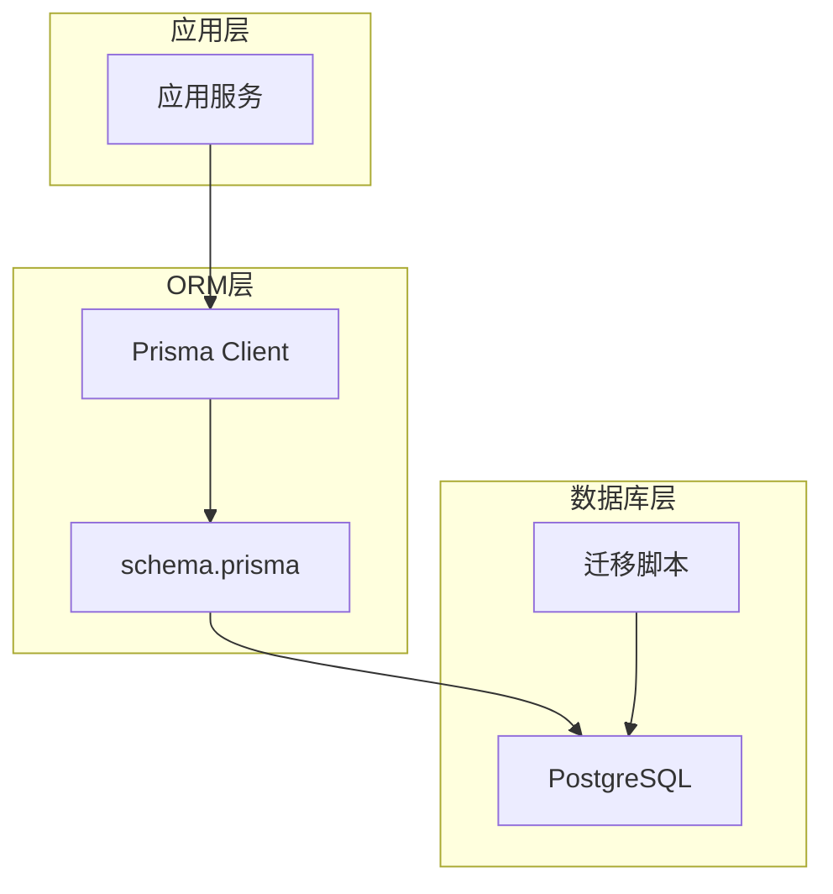
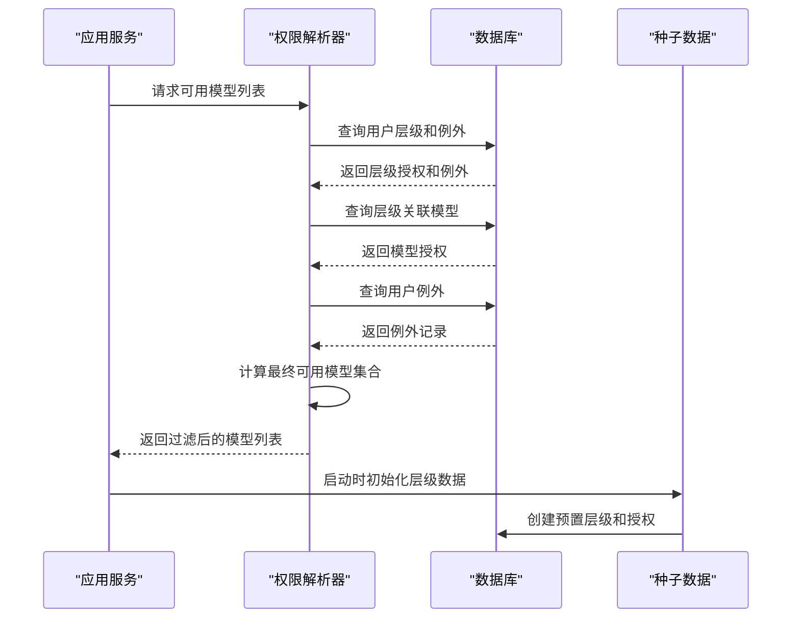
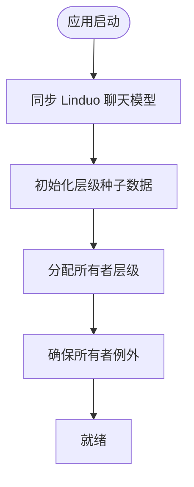
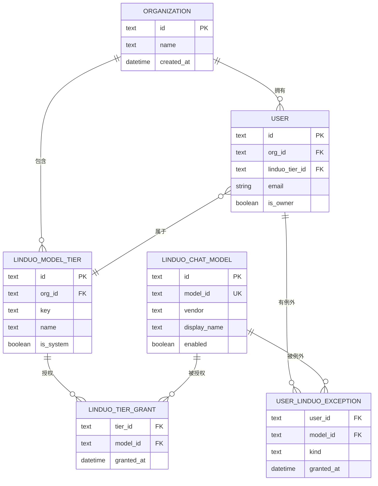
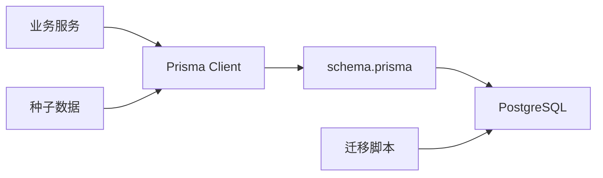

# 数据库模式设计

<cite>
**本文引用的文件**
- [schema.prisma](file://server/prisma/schema.prisma)
- [migration.sql](file://server/prisma/migrations/20260827_linduo_model_tiers/migration.sql)
- [tier-seed.ts](file://server/src/modules/linduo/tier-seed.ts)
- [tier-resolver.ts](file://server/src/modules/linduo/tier-resolver.ts)
- [index.ts](file://server/src/index.ts)
- [prisma.ts](file://server/src/lib/prisma.ts)
- [sqlite-import.ts](file://server/src/lib/sqlite-import.ts)
</cite>

## 更新摘要
**所做更改**
- 新增 Linduo 模型等级系统相关表结构说明
- 更新主外键关系图以包含新的 Linduo 表
- 添加 Linduo 模型权限解析逻辑说明
- 更新迁移机制以包含 R-2 版本升级
- 新增 Linduo 模型等级种子数据初始化流程

## 目录
1. [简介](#简介)
2. [项目结构](#项目结构)
3. [核心组件](#核心组件)
4. [架构总览](#架构总览)
5. [详细组件分析](#详细组件分析)
6. [依赖分析](#依赖分析)
7. [性能考虑](#性能考虑)
8. [故障排查指南](#故障排查指南)
9. [结论](#结论)
10. [附录](#附录)

## 简介
本文件围绕项目的数据库模式设计与实现进行系统化说明，涵盖表结构、字段定义、数据类型与约束、主外键关系、索引策略、查询优化、数据完整性保证、初始化流程、版本迁移机制以及备份恢复策略。文档同时提供SQL示例与性能调优建议，帮助开发者快速理解并高效使用数据库层。

**最新更新**：新增了 Linduo 模型等级系统，包含三个核心表（LinduoModelTier、LinduoTierGrant、UserLinduoException），实现了基于组织级别的模型权限管理和用户例外机制。

## 项目结构
本项目采用 Prisma ORM 配合 PostgreSQL 数据库，数据库模式定义集中在 `server/prisma/schema.prisma` 文件中。该文件负责：
- 定义所有数据模型和关系
- 配置数据库连接和提供者
- 管理索引和约束
- 支持迁移和版本控制



**图表来源**
- [schema.prisma](file://server/prisma/schema.prisma)
- [prisma.ts](file://server/src/lib/prisma.ts)

**章节来源**
- [schema.prisma](file://server/prisma/schema.prisma)
- [prisma.ts](file://server/src/lib/prisma.ts)

## 核心组件
- **数据库连接管理**：通过 Prisma Client 封装数据库连接生命周期，确保连接池化和错误处理。
- **模式定义**：在 schema.prisma 中统一定义所有数据模型、关系和约束。
- **迁移管理**：使用 Prisma Migrate 管理数据库版本演进和结构变更。
- **种子数据**：启动时自动初始化系统预置数据和默认配置。
- **权限解析**：实现复杂的模型访问权限计算逻辑。

**章节来源**
- [schema.prisma](file://server/prisma/schema.prisma)
- [tier-seed.ts](file://server/src/modules/linduo/tier-seed.ts)
- [tier-resolver.ts](file://server/src/modules/linduo/tier-resolver.ts)

## 架构总览
下图展示了从应用层到数据库的完整调用路径，特别突出了 Linduo 模型权限系统的架构设计。



**图表来源**
- [tier-resolver.ts](file://server/src/modules/linduo/tier-resolver.ts)
- [tier-seed.ts](file://server/src/modules/linduo/tier-seed.ts)
- [index.ts](file://server/src/index.ts)

## 详细组件分析

### 数据库连接与初始化
- **连接策略**：使用 Prisma Client 管理 PostgreSQL 连接，支持连接池和重试机制。
- **初始化流程**：应用启动时执行 Linduo 模型同步、层级种子数据初始化、所有者权限分配等步骤。
- **错误处理**：统一的错误捕获和日志记录，确保启动过程的健壮性。



**图表来源**
- [index.ts](file://server/src/index.ts)

**章节来源**
- [index.ts](file://server/src/index.ts)
- [prisma.ts](file://server/src/lib/prisma.ts)

### 表结构与字段定义

#### 核心 Linduo 表结构

**LinduoModelTier（模型层级表）**
- id: TEXT PRIMARY KEY - 唯一标识符
- orgId: TEXT NOT NULL - 所属组织ID
- key: TEXT NOT NULL - 层级键值（basic/advanced/full）
- name: TEXT NOT NULL - 层级名称
- description: TEXT - 层级描述
- displayOrder: INTEGER NOT NULL DEFAULT 0 - 显示顺序
- isSystem: BOOLEAN NOT NULL DEFAULT false - 是否系统预置
- createdAt/updatedAt: TIMESTAMP - 时间戳

**LinduoTierGrant（层级授权表）**
- tierId/modelId: TEXT NOT NULL - 复合主键
- grantedBy: TEXT - 授权者
- grantedAt: TIMESTAMP - 授权时间

**UserLinduoException（用户例外表）**
- userId/modelId: TEXT - 复合主键
- kind: TEXT NOT NULL DEFAULT 'GRANT' - 例外类型（GRANT/REVOKE）
- grantedBy/grantedAt: TEXT/TIMESTAMP - 授权信息

#### 现有业务表结构
- **Organization**：组织管理
- **User**：用户管理，新增 linduoTierId 外键
- **LinduoChatModel**：聊天模型配置
- **EbayStore**：电商平台店铺
- **SelectionTask**：选品任务
- **Compliance**：合规相关表

**章节来源**
- [schema.prisma](file://server/prisma/schema.prisma)
- [migration.sql](file://server/prisma/migrations/20260827_linduo_model_tiers/migration.sql)

### 主键与外键关系



**图表来源**
- [schema.prisma](file://server/prisma/schema.prisma)

### 索引策略与查询优化

#### Linduo 相关索引
- **linduo_model_tiers**: `(org_id, key)` 唯一索引 + `org_id` 普通索引
- **linduo_tier_grants**: `(tier_id, model_id)` 复合主键 + `model_id` 普通索引
- **user_linduo_exceptions**: `(user_id, model_id)` 复合主键 + `model_id` 普通索引
- **users**: `linduo_tier_id` 外键索引

#### 查询优化策略
- **层级查询优化**：通过复合索引快速定位组织的层级配置
- **权限计算优化**：单次查询获取用户层级、授权和例外，内存中计算最终结果
- **批量操作优化**：使用 upsert 操作避免重复插入，提高种子数据初始化效率

**章节来源**
- [schema.prisma](file://server/prisma/schema.prisma)
- [tier-resolver.ts](file://server/src/modules/linduo/tier-resolver.ts)

### 数据完整性与事务
- **外键约束**：严格的外键关系确保数据一致性
- **级联删除**：组织删除时级联删除相关用户和层级数据
- **事务保证**：种子数据初始化使用事务确保原子性
- **幂等性**：所有初始化操作支持重复执行

**章节来源**
- [schema.prisma](file://server/prisma/schema.prisma)
- [tier-seed.ts](file://server/src/modules/linduo/tier-seed.ts)

### 版本迁移机制

#### R-2 版本升级
- **表重命名**：`user_linduo_grants` → `user_linduo_exceptions`
- **字段新增**：为例外表添加 `kind` 字段区分授权和撤销
- **新表创建**：新增 `linduo_model_tiers` 和 `linduo_tier_grants` 表
- **外键添加**：为 users 表添加 `linduo_tier_id` 外键

#### 迁移脚本特点
- **向后兼容**：保留历史数据的兼容性处理
- **增量更新**：只执行必要的结构变更
- **回滚支持**：每个迁移可独立回滚

**章节来源**
- [migration.sql](file://server/prisma/migrations/20260827_linduo_model_tiers/migration.sql)

### 备份与恢复策略
- **定期快照**：使用 PostgreSQL 原生备份工具进行全量备份
- **增量备份**：结合 WAL 日志实现增量备份
- **数据导入**：支持 SQLite 到 PostgreSQL 的数据迁移
- **孤儿行清理**：导入后自动清理外键指向不存在的记录

**章节来源**
- [sqlite-import.ts](file://server/src/lib/sqlite-import.ts)

## 依赖分析
- **内部依赖**：Prisma Client 作为 ORM 层，各模块通过生成的类型安全 API 访问数据库
- **外部依赖**：PostgreSQL 数据库引擎、环境变量配置
- **耦合度**：通过 Prisma 的类型生成实现松耦合，业务层仅依赖生成的客户端类型



**图表来源**
- [prisma.ts](file://server/src/lib/prisma.ts)
- [schema.prisma](file://server/prisma/schema.prisma)

**章节来源**
- [prisma.ts](file://server/src/lib/prisma.ts)
- [schema.prisma](file://server/prisma/schema.prisma)

## 性能考虑
- **连接池化**：Prisma 内置连接池管理，避免频繁建立连接
- **查询优化**：合理使用索引，避免 N+1 查询问题
- **批量操作**：使用 Prisma 的批量操作方法减少数据库往返
- **缓存策略**：对不常变化的层级配置可考虑应用层缓存
- **监控指标**：记录慢查询和数据库连接使用情况

## 故障排查指南
- **连接失败**：检查数据库连接字符串和网络连通性
- **迁移失败**：查看迁移日志，确认数据库版本和结构一致性
- **权限问题**：验证用户的层级和例外设置是否正确
- **性能问题**：使用 EXPLAIN ANALYZE 分析慢查询，检查索引使用情况

**章节来源**
- [tier-resolver.ts](file://server/src/modules/linduo/tier-resolver.ts)

## 结论
通过引入 Linduo 模型等级系统，项目实现了更灵活的模型权限管理机制。基于组织层级的授权体系配合用户例外机制，既保证了管理的便捷性，又提供了足够的灵活性。完善的迁移机制和种子数据初始化确保了系统的可维护性和可扩展性。

## 附录

### SQL查询示例

#### Linduo 模型权限查询
```sql
-- 查询某用户可用的模型集合
SELECT DISTINCT m.*
FROM linduo_chat_models m
LEFT JOIN linduo_tier_grants tgr ON m.id = tgr.model_id
LEFT JOIN linduo_model_tiers mt ON tgr.tier_id = mt.id
LEFT JOIN users u ON mt.org_id = u.org_id
WHERE u.id = 'user-id' AND m.enabled = true;

-- 查询组织的层级配置
SELECT * FROM linduo_model_tiers 
WHERE org_id = 'org-id' 
ORDER BY display_order;
```

#### 数据导入示例
```sql
-- 从 SQLite 导入业务数据
-- 使用 sqlite-import.ts 提供的工具函数
```

**章节来源**
- [schema.prisma](file://server/prisma/schema.prisma)
- [sqlite-import.ts](file://server/src/lib/sqlite-import.ts)