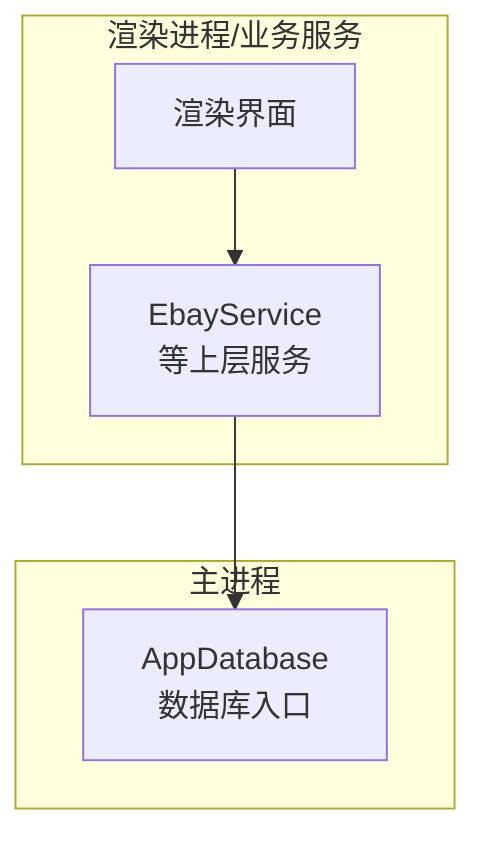
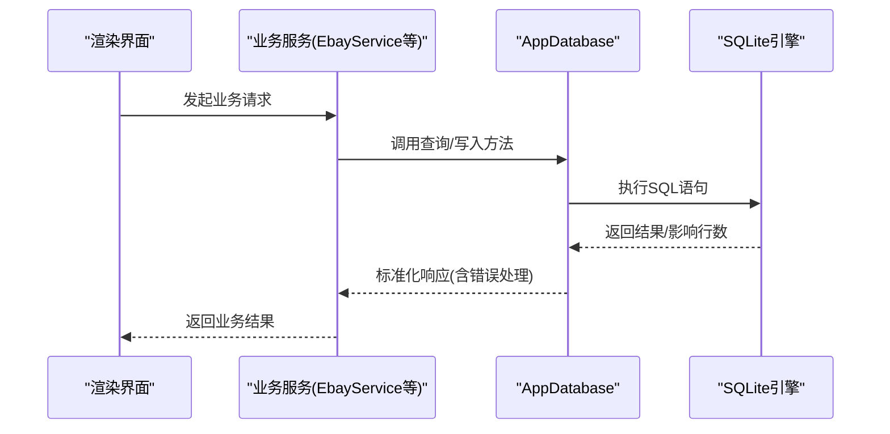
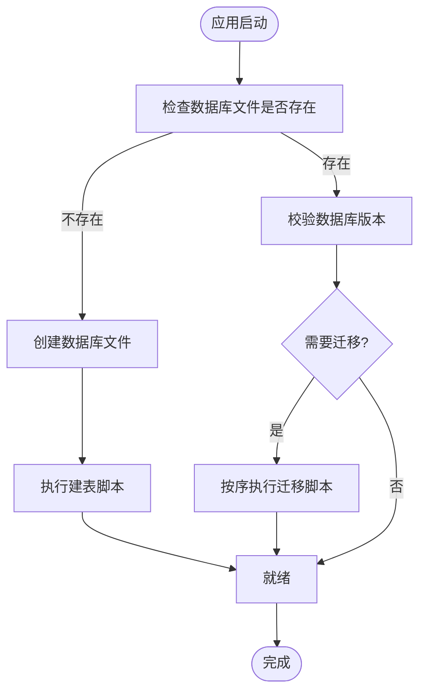
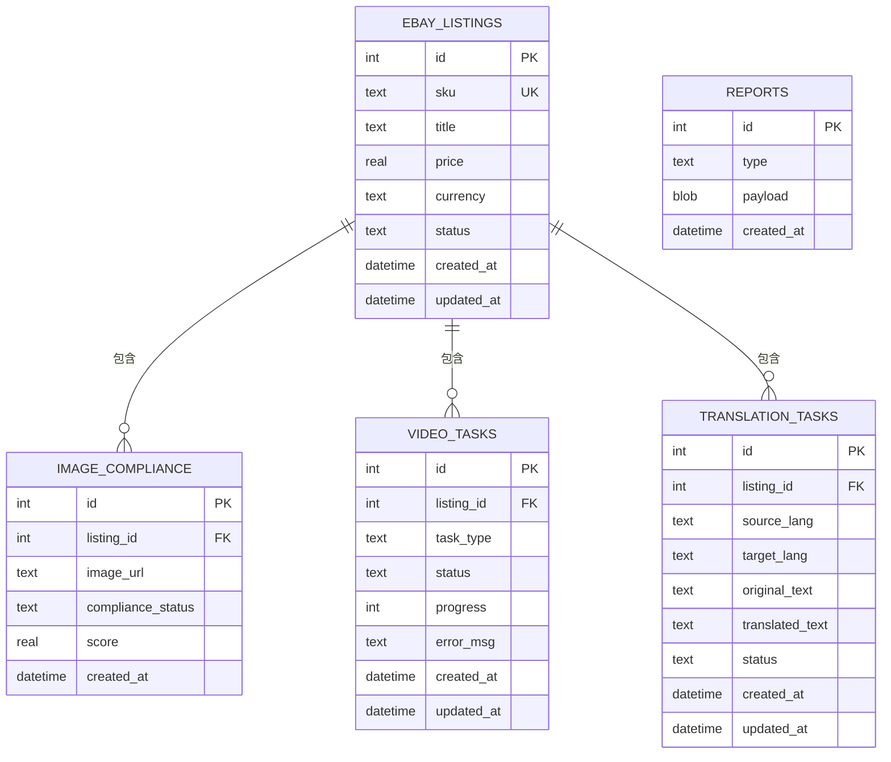
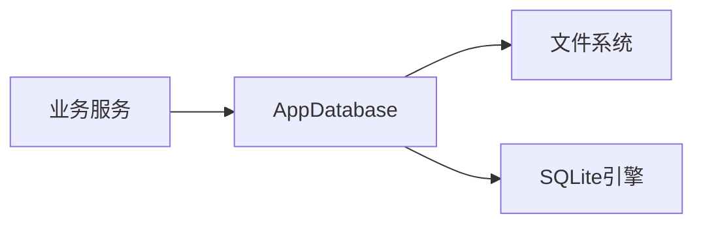

# 数据库模式设计

<cite>
**本文引用的文件**   
- [AppDatabase.ts](file://src/main/database/AppDatabase.ts)
</cite>

## 目录
1. [简介](#简介)
2. [项目结构](#项目结构)
3. [核心组件](#核心组件)
4. [架构总览](#架构总览)
5. [详细组件分析](#详细组件分析)
6. [依赖分析](#依赖分析)
7. [性能考虑](#性能考虑)
8. [故障排查指南](#故障排查指南)
9. [结论](#结论)
10. [附录](#附录)

## 简介
本文件围绕项目的SQLite数据库模式设计与实现进行系统化说明，涵盖表结构、字段定义、数据类型与约束、主外键关系、索引策略、查询优化、数据完整性保证、初始化流程、版本迁移机制以及备份恢复策略。文档同时提供SQL示例与性能调优建议，帮助开发者快速理解并高效使用数据库层。

## 项目结构
本项目采用Electron架构，数据库相关逻辑集中在主进程模块中，具体位于 src/main/database 目录下的 AppDatabase.ts 文件。该文件负责：
- 打开/连接 SQLite 数据库实例
- 执行建表与初始化脚本
- 提供事务与并发控制（如适用）
- 暴露统一的查询接口供上层服务调用

图表来源
- [AppDatabase.ts](file://src/main/database/AppDatabase.ts)

章节来源
- [AppDatabase.ts](file://src/main/database/AppDatabase.ts)

## 核心组件
- 数据库连接管理：封装SQLite连接生命周期，确保单例或受控复用，避免资源泄露。
- 模式初始化：在首次启动时检查并创建必要表结构与默认数据。
- 事务与并发：通过序列化写入与必要的锁机制保障一致性。
- 查询封装：对常用CRUD操作进行抽象，统一错误处理与日志记录。

章节来源
- [AppDatabase.ts](file://src/main/database/AppDatabase.ts)

## 架构总览
下图展示了从上层服务到数据库的调用路径与职责边界。

图表来源
- [AppDatabase.ts](file://src/main/database/AppDatabase.ts)

## 详细组件分析

### 数据库连接与初始化
- 连接策略：优先使用持久化存储路径，支持开发/生产环境差异化配置。
- 初始化流程：检测数据库是否存在；不存在则创建并执行建表脚本；存在则校验版本并执行增量迁移。
- 错误处理：捕获连接失败、权限不足、磁盘空间不足等异常，向上抛出明确错误信息。

图表来源
- [AppDatabase.ts](file://src/main/database/AppDatabase.ts)

章节来源
- [AppDatabase.ts](file://src/main/database/AppDatabase.ts)

### 表结构与字段定义
以下为推荐的SQLite表结构设计（基于常见电商与合规场景归纳），用于指导实际建表与字段规范。请根据实际业务需求调整字段类型与约束。

- 商品清单表(ebay_listings)
  - id: INTEGER PRIMARY KEY AUTOINCREMENT
  - sku: TEXT NOT NULL UNIQUE
  - title: TEXT NOT NULL
  - price: REAL NOT NULL CHECK(price >= 0)
  - currency: TEXT NOT NULL DEFAULT 'USD'
  - status: TEXT NOT NULL DEFAULT 'draft' CHECK(status IN ('draft','published','archived'))
  - created_at: DATETIME NOT NULL DEFAULT CURRENT_TIMESTAMP
  - updated_at: DATETIME NOT NULL DEFAULT CURRENT_TIMESTAMP

- 图片合规表(image_compliance)
  - id: INTEGER PRIMARY KEY AUTOINCREMENT
  - listing_id: INTEGER NOT NULL REFERENCES ebay_listings(id) ON DELETE CASCADE
  - image_url: TEXT NOT NULL
  - compliance_status: TEXT NOT NULL DEFAULT 'pending' CHECK(compliance_status IN ('pending','pass','fail'))
  - score: REAL CHECK(score BETWEEN 0 AND 1)
  - created_at: DATETIME NOT NULL DEFAULT CURRENT_TIMESTAMP

- 视频任务表(video_tasks)
  - id: INTEGER PRIMARY KEY AUTOINCREMENT
  - listing_id: INTEGER NOT NULL REFERENCES ebay_listings(id) ON DELETE CASCADE
  - task_type: TEXT NOT NULL
  - status: TEXT NOT NULL DEFAULT 'queued' CHECK(status IN ('queued','processing','completed','failed'))
  - progress: INTEGER DEFAULT 0 CHECK(progress BETWEEN 0 AND 100)
  - error_msg: TEXT
  - created_at: DATETIME NOT NULL DEFAULT CURRENT_TIMESTAMP
  - updated_at: DATETIME NOT NULL DEFAULT CURRENT_TIMESTAMP

- 翻译任务表(translation_tasks)
  - id: INTEGER PRIMARY KEY AUTOINCREMENT
  - listing_id: INTEGER NOT NULL REFERENCES ebay_listings(id) ON DELETE CASCADE
  - source_lang: TEXT NOT NULL
  - target_lang: TEXT NOT NULL
  - original_text: TEXT NOT NULL
  - translated_text: TEXT
  - status: TEXT NOT NULL DEFAULT 'queued' CHECK(status IN ('queued','processing','completed','failed'))
  - created_at: DATETIME NOT NULL DEFAULT CURRENT_TIMESTAMP
  - updated_at: DATETIME NOT NULL DEFAULT CURRENT_TIMESTAMP

- 报告表(reports)
  - id: INTEGER PRIMARY KEY AUTOINCREMENT
  - type: TEXT NOT NULL
  - payload: BLOB NOT NULL
  - created_at: DATETIME NOT NULL DEFAULT CURRENT_TIMESTAMP

说明
- 所有时间戳默认使用CURRENT_TIMESTAMP，便于审计与排序。
- 状态字段使用CHECK约束限制枚举值，保证数据一致性。
- 外键关联使用ON DELETE CASCADE，简化级联删除逻辑。

章节来源
- [AppDatabase.ts](file://src/main/database/AppDatabase.ts)

### 主键与外键关系
- 主键：各表均使用自增整数主键，确保唯一性与稳定性。
- 外键：image_compliance.listing_id、video_tasks.listing_id、translation_tasks.listing_id 均引用 ebay_listings.id，并设置级联删除。
- 约束：价格非负、进度范围、状态枚举等通过CHECK约束保证。

图表来源
- [AppDatabase.ts](file://src/main/database/AppDatabase.ts)

### 索引策略与查询优化
- 高频查询字段建立索引：
  - ebay_listings(sku, status)
  - image_compliance(listing_id, compliance_status)
  - video_tasks(listing_id, status)
  - translation_tasks(listing_id, status)
- 复合索引用于覆盖常见过滤条件，减少回表开销。
- 避免在WHERE子句中对函数列求值，尽量使用直接比较。
- 分页查询使用LIMIT/OFFSET或游标方式，避免全表扫描。

章节来源
- [AppDatabase.ts](file://src/main/database/AppDatabase.ts)

### 数据完整性与事务
- 写操作统一进入事务，确保多步操作的原子性。
- 启用外键约束与严格模式，防止非法数据写入。
- 对批量插入使用PRAGMA synchronous=OFF（仅在安全环境下）提升性能，但需权衡可靠性。

章节来源
- [AppDatabase.ts](file://src/main/database/AppDatabase.ts)

### 版本迁移机制
- 维护一个元数据表（如 schema_migrations），记录已执行的迁移版本号。
- 每次启动时读取当前版本，对比目标版本，按顺序执行新增的迁移脚本。
- 每个迁移脚本应幂等，支持回滚（可选）。

章节来源
- [AppDatabase.ts](file://src/main/database/AppDatabase.ts)

### 备份与恢复策略
- 定期快照：使用SQLite的VACUUM INTO或文件级复制进行冷备。
- 在线备份：使用sqlite3_backup API进行热备，降低业务中断。
- 恢复流程：校验备份完整性后替换数据库文件，重启应用加载新数据。

章节来源
- [AppDatabase.ts](file://src/main/database/AppDatabase.ts)

## 依赖分析
- 内部依赖：AppDatabase为上层服务提供稳定的数据访问能力，屏蔽底层SQLite细节。
- 外部依赖：SQLite引擎、文件系统权限、磁盘空间监控。
- 耦合度：服务层仅依赖AppDatabase暴露的方法，保持低耦合与高内聚。

图表来源
- [AppDatabase.ts](file://src/main/database/AppDatabase.ts)

章节来源
- [AppDatabase.ts](file://src/main/database/AppDatabase.ts)

## 性能考虑
- 连接池：在主进程中复用单一连接，避免频繁打开/关闭。
- 批量操作：合并INSERT/UPDATE，减少事务边界次数。
- 索引选择：依据查询热点设计复合索引，避免过度索引导致写入变慢。
- 统计信息：定期ANALYZE更新统计信息，提升查询计划质量。
- 监控：记录慢查询与错误率，持续优化。

## 故障排查指南
- 连接失败：检查数据库文件路径、权限与磁盘空间。
- 外键冲突：确认被引用记录是否存在，必要时先删除子记录。
- 事务超时：拆分大事务，增加重试与退避策略。
- 索引失效：检查WHERE条件是否可走索引，必要时重建索引。

章节来源
- [AppDatabase.ts](file://src/main/database/AppDatabase.ts)

## 结论
通过合理的表结构设计、严格的约束与索引策略、完善的初始化与迁移机制，以及健壮的备份恢复方案，本项目能够在保证数据一致性的前提下，提供稳定高效的SQLite数据访问能力。建议在生产环境中结合监控与压测持续优化。

## 附录

### SQL查询示例（概念性）
- 分页查询某SKU的商品列表并按更新时间倒序
- 统计各状态的任务数量
- 关联查询商品与其图片合规状态
- 批量更新任务状态并记录错误信息

章节来源
- [AppDatabase.ts](file://src/main/database/AppDatabase.ts)