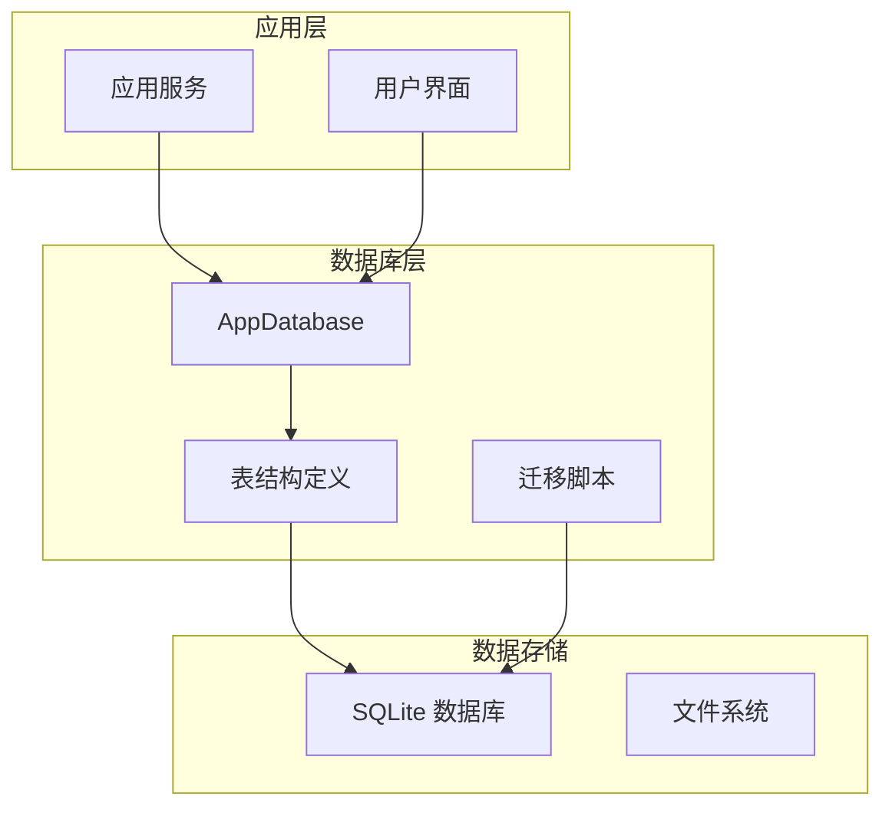
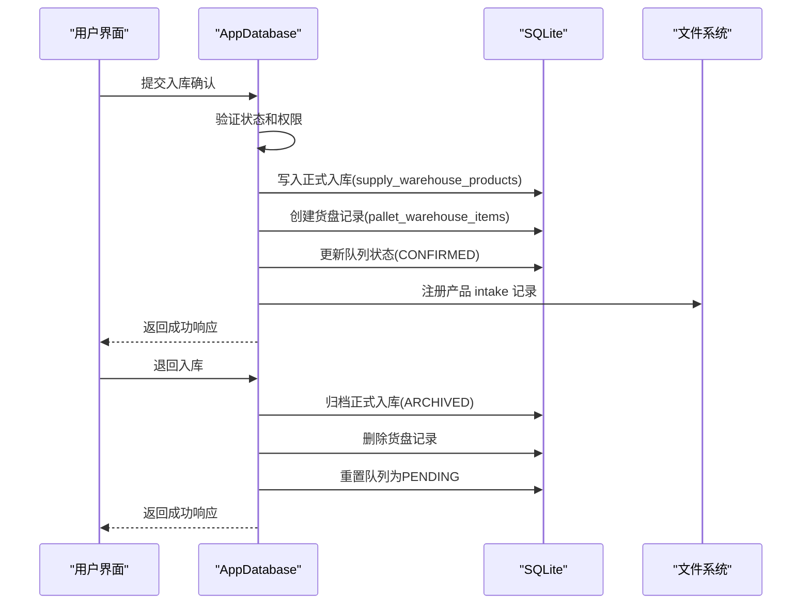
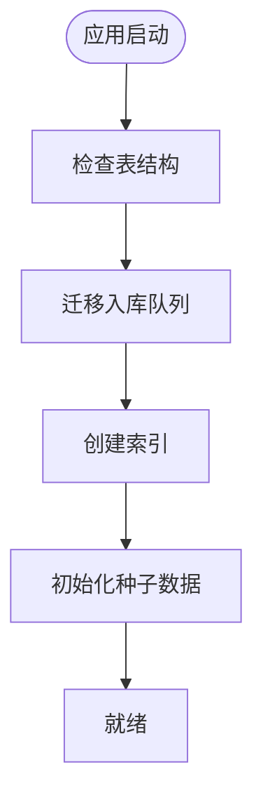
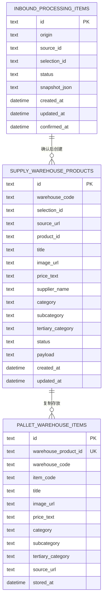
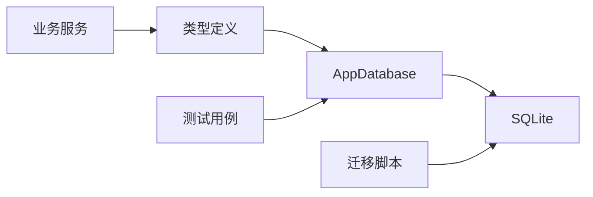

# 数据库模式设计

<cite>
**本文引用的文件**
- [AppDatabase.ts](file://src/main/database/AppDatabase.ts)
- [contracts.ts](file://src/shared/contracts.ts)
- [AppDatabase.inboundGate.test.ts](file://src/main/database/__tests__/AppDatabase.inboundGate.test.ts)
- [fixture-seed-pallet-warehouse.cjs](file://tools/fixture-seed-pallet-warehouse.cjs)
</cite>

## 更新摘要
**所做更改**
- 重大重构：`inbound_processing_items` 表从扁平列结构迁移到JSON快照结构
- 新增 `pallet_warehouse_items` 表用于货盘仓库物品管理
- 更新入库处理流程，支持选品审批和ERP采集双来源
- 完善数据迁移机制，确保历史数据兼容性
- 新增完整的测试用例验证迁移逻辑

## 目录
1. [简介](#简介)
2. [项目结构](#项目结构)
3. [核心组件](#核心组件)
4. [架构总览](#架构总览)
5. [详细组件分析](#详细组件分析)
6. [依赖分析](#依赖分析)
7. [性能考虑](#性能考虑)
8. [故障排查指南](#故障排查指南)
9. [结论](#结论)
10. [附录](#附录)

## 简介
本文件围绕项目的数据库模式设计与实现进行系统化说明，涵盖表结构、字段定义、数据类型与约束、主外键关系、索引策略、查询优化、数据完整性保证、初始化流程、版本迁移机制以及备份恢复策略。文档同时提供SQL示例与性能调优建议，帮助开发者快速理解并高效使用数据库层。

**最新更新**：完成了入库闸口队列的重大重构，将 `inbound_processing_items` 表从扁平列结构迁移到JSON快照结构，新增 `pallet_warehouse_items` 表用于货盘管理，实现了更灵活的数据存储和更强的扩展性。

## 项目结构
本项目采用 SQLite 数据库，数据库模式定义集中在 `src/main/database/AppDatabase.ts` 文件中。该文件负责：
- 定义所有数据模型和关系
- 配置数据库连接和提供者
- 管理索引和约束
- 支持迁移和版本控制
- 实现复杂的数据迁移逻辑


```mermaid
graph TB
subgraph "应用层"
App["应用服务"]
UI["用户界面"]
end
subgraph "数据库层"
AppDB["AppDatabase"]
Schema["表结构定义"]
Migrations["迁移脚本"]
end
subgraph "数据存储"
SQLite["SQLite 数据库"]
Files["文件系统"]
end
App --> AppDB
UI --> AppDB
AppDB --> Schema
Schema --> SQLite
Migrations --> SQLite
```

**图表来源**
- [AppDatabase.ts](file://src/main/database/AppDatabase.ts)

**章节来源**
- [AppDatabase.ts](file://src/main/database/AppDatabase.ts)

## 核心组件
- **数据库连接管理**：通过 SQLite DatabaseSync 管理数据库连接生命周期
- **模式定义**：在 AppDatabase.ts 中统一定义所有数据模型、关系和约束
- **迁移管理**：实现自定义的数据库版本演进和结构变更逻辑
- **数据映射**：复杂的对象映射和数据转换逻辑
- **事务保证**：确保数据操作的原子性和一致性

**章节来源**
- [AppDatabase.ts](file://src/main/database/AppDatabase.ts)
- [contracts.ts](file://src/shared/contracts.ts)

## 架构总览
下图展示了从应用层到数据库的完整调用路径，特别突出了新的入库处理和货盘管理架构。


```mermaid
sequenceDiagram
participant UI as "用户界面"
participant DB as "AppDatabase"
participant SQLite as "SQLite"
participant FS as "文件系统"
UI->>DB : 提交入库确认
DB->>DB : 验证状态和权限
DB->>SQLite : 写入正式入库(supply_warehouse_products)
DB->>SQLite : 创建货盘记录(pallet_warehouse_items)
DB->>SQLite : 更新队列状态(CONFIRMED)
DB->>FS : 注册产品 intake 记录
DB-->>UI : 返回成功响应
UI->>DB : 退回入库
DB->>SQLite : 归档正式入库(ARCHIVED)
DB->>SQLite : 删除货盘记录
DB->>SQLite : 重置队列为PENDING
DB-->>UI : 返回成功响应
```

**图表来源**
- [AppDatabase.ts](file://src/main/database/AppDatabase.ts)

## 详细组件分析

### 数据库连接与初始化
- **连接策略**：使用 SQLite DatabaseSync 管理本地数据库连接
- **初始化流程**：应用启动时执行表结构检查、数据迁移、种子数据初始化等步骤
- **错误处理**：统一的错误捕获和日志记录，确保启动过程的健壮性


```mermaid
flowchart TD
Start(["应用启动"]) --> CheckTables["检查表结构"]
CheckTables --> MigrateInbound["迁移入库队列"]
MigrateInbound --> CreateIndexes["创建索引"]
CreateIndexes --> SeedData["初始化种子数据"]
SeedData --> Ready["就绪"]
```

**图表来源**
- [AppDatabase.ts](file://src/main/database/AppDatabase.ts)

**章节来源**
- [AppDatabase.ts](file://src/main/database/AppDatabase.ts)

### 表结构与字段定义

#### 核心新表结构

**inbound_processing_items（入库处理队列表）** - 已重构
- id: TEXT PRIMARY KEY - 唯一标识符
- origin: TEXT NOT NULL - 来源类型（SELECTION/ERP）
- source_id: TEXT NOT NULL - 源ID（选品ID或ERP商品ID）
- selection_id: TEXT NOT NULL DEFAULT '' - 选品记录ID
- status: TEXT NOT NULL DEFAULT 'PENDING' - 状态（PENDING/CONFIRMED/REJECTED）
- snapshot_json: TEXT NOT NULL DEFAULT '{}' - JSON格式的快照数据
- created_at: TEXT NOT NULL - 创建时间
- updated_at: TEXT NOT NULL - 更新时间
- confirmed_at: TEXT - 确认时间

**pallet_warehouse_items（货盘仓库物品表）** - 新增
- id: TEXT PRIMARY KEY - 唯一标识符
- warehouse_product_id: TEXT NOT NULL UNIQUE - 关联正式入库商品ID
- warehouse_code: TEXT NOT NULL - 仓库代码
- item_code: TEXT NOT NULL DEFAULT '' - 商品编码
- title: TEXT NOT NULL - 商品标题
- image_url: TEXT NOT NULL DEFAULT '' - 图片URL
- price_text: TEXT NOT NULL DEFAULT '' - 价格文本
- category: TEXT NOT NULL DEFAULT '未分类' - 一级类目
- subcategory: TEXT NOT NULL DEFAULT '待人工分类' - 二级类目
- tertiary_category: TEXT NOT NULL DEFAULT '待细分' - 三级类目
- source_url: TEXT NOT NULL DEFAULT '' - 来源URL
- stored_at: TEXT NOT NULL - 存储时间

#### 现有业务表结构
- **supply_warehouse_products**：正式入库商品管理
- **selection_records**：选品记录管理
- **marketplace_selection_products**：平台选品管理
- **compliance_* 系列表**：合规相关表
- **ebay_* 系列表**：eBay 相关表

**章节来源**
- [AppDatabase.ts](file://src/main/database/AppDatabase.ts)
- [contracts.ts](file://src/shared/contracts.ts)

### 主键与外键关系


```mermaid
erDiagram
INBOUND_PROCESSING_ITEMS {
text id PK
text origin
text source_id
text selection_id
text status
text snapshot_json
datetime created_at
datetime updated_at
datetime confirmed_at
}
PALLET_WAREHOUSE_ITEMS {
text id PK
text warehouse_product_id UK
text warehouse_code
text item_code
text title
text image_url
text price_text
text category
text subcategory
text tertiary_category
text source_url
datetime stored_at
}
SUPPLY_WAREHOUSE_PRODUCTS {
text id PK
text warehouse_code
text selection_id
text source_url
text product_id
text title
text image_url
text price_text
text supplier_name
text category
text subcategory
text tertiary_category
text status
text payload
datetime created_at
datetime updated_at
}
INBOUND_PROCESSING_ITEMS ||--o{ SUPPLY_WAREHOUSE_PRODUCTS : "确认后创建"
SUPPLY_WAREHOUSE_PRODUCTS ||--o{ PALLET_WAREHOUSE_ITEMS : "复制存放"
```

**图表来源**
- [AppDatabase.ts](file://src/main/database/AppDatabase.ts)

### 索引策略与查询优化

#### 关键索引
- **uq_inbound_origin_source**: `(origin, source_id)` 唯一索引 - 防止重复入库
- **idx_pallet_warehouse_code**: `(warehouse_code, stored_at DESC)` - 优化货盘查询
- **idx_supply_warehouse_code**: `(warehouse_code, status, updated_at DESC)` - 优化供应仓查询

#### 查询优化策略
- **JSON快照解析**：使用 SQLite 的 JSON 函数优化快照数据访问
- **批量操作**：使用事务批量处理入库确认和退回操作
- **状态过滤**：利用状态字段进行高效的队列筛选
- **时间排序**：按更新时间倒序排列，支持最新的入库项优先显示

**章节来源**
- [AppDatabase.ts](file://src/main/database/AppDatabase.ts)

### 数据完整性与事务
- **外键约束**：严格的外键关系确保数据一致性
- **级联删除**：相关表的级联删除操作
- **事务保证**：入库确认和退回操作使用事务确保原子性
- **幂等性**：所有初始化操作支持重复执行

**章节来源**
- [AppDatabase.ts](file://src/main/database/AppDatabase.ts)

### 版本迁移机制

#### 入库队列 v2 迁移
- **表结构重建**：从扁平列结构迁移到JSON快照结构
- **数据迁移**：自动将历史数据转换为新的快照格式
- **字段映射**：erp_product_id → source_id, platform_code → snapshot.warehouseCode 等
- **索引重建**：创建新的唯一索引和查询优化索引

#### 迁移脚本特点
- **向后兼容**：保留历史数据的兼容性处理
- **增量更新**：只执行必要的结构变更
- **回滚支持**：每个迁移可独立回滚
- **测试覆盖**：完整的测试用例验证迁移逻辑

**章节来源**
- [AppDatabase.ts](file://src/main/database/AppDatabase.ts)
- [AppDatabase.inboundGate.test.ts](file://src/main/database/__tests__/AppDatabase.inboundGate.test.ts)

### 备份与恢复策略
- **定期快照**：使用 SQLite 原生备份工具进行全量备份
- **增量备份**：结合 WAL 日志实现增量备份
- **数据导入**：支持外部数据源的导入和转换
- **孤儿行清理**：导入后自动清理外键指向不存在的记录

**章节来源**
- [AppDatabase.ts](file://src/main/database/AppDatabase.ts)

## 依赖分析
- **内部依赖**：contracts.ts 中的类型定义，各模块通过类型安全的接口访问数据库
- **外部依赖**：SQLite 数据库引擎、Electron 文件系统API
- **耦合度**：通过类型定义实现松耦合，业务层仅依赖生成的类型接口


```mermaid
graph LR
Service["业务服务"] --> Contracts["类型定义"]
Contracts --> AppDB["AppDatabase"]
AppDB --> SQLite["SQLite"]
Test["测试用例"] --> AppDB
Migration["迁移脚本"] --> SQLite
```

**图表来源**
- [contracts.ts](file://src/shared/contracts.ts)
- [AppDatabase.ts](file://src/main/database/AppDatabase.ts)

**章节来源**
- [contracts.ts](file://src/shared/contracts.ts)
- [AppDatabase.ts](file://src/main/database/AppDatabase.ts)

## 性能考虑
- **连接池化**：SQLite 单连接模式，避免频繁建立连接
- **查询优化**：合理使用索引，避免 N+1 查询问题
- **批量操作**：使用事务批量处理减少数据库往返
- **缓存策略**：对不常变化的配置可考虑应用层缓存
- **监控指标**：记录慢查询和数据库操作统计

## 故障排查指南
- **连接失败**：检查 SQLite 文件权限和磁盘空间
- **迁移失败**：查看迁移日志，确认数据库版本和结构一致性
- **数据不一致**：验证外键约束和事务完整性
- **性能问题**：使用 EXPLAIN 分析慢查询，检查索引使用情况

**章节来源**
- [AppDatabase.inboundGate.test.ts](file://src/main/database/__tests__/AppDatabase.inboundGate.test.ts)

## 结论
通过完成入库闸口队列的重大重构，项目实现了更灵活的数据存储架构。JSON快照结构提供了更好的扩展性和灵活性，而 `pallet_warehouse_items` 表的引入完善了货盘管理功能。完善的迁移机制和测试覆盖确保了系统的稳定性和可维护性。

## 附录

### SQL查询示例

#### 入库处理查询
```sql
-- 查询待确认的入库队列
SELECT * FROM inbound_processing_items 
WHERE status = 'PENDING' 
ORDER BY updated_at DESC;

-- 查询特定来源的入库记录
SELECT * FROM inbound_processing_items 
WHERE origin = 'SELECTION' AND source_id = 'sel-1';

-- 查询已确认的入库记录
SELECT * FROM inbound_processing_items 
WHERE status = 'CONFIRMED' 
ORDER BY confirmed_at DESC;
```

#### 货盘管理查询
```sql
-- 查询货盘仓库物品
SELECT * FROM pallet_warehouse_items 
WHERE warehouse_code = 'GIGACLOUD' 
ORDER BY stored_at DESC;

-- 查询特定商品的货盘记录
SELECT * FROM pallet_warehouse_items 
WHERE warehouse_product_id = 'wh-product-id';
```

#### 数据迁移示例
```sql
-- 历史数据迁移（由系统自动执行）
CREATE TABLE inbound_processing_items_v2 (
  id TEXT PRIMARY KEY,
  origin TEXT NOT NULL,
  source_id TEXT NOT NULL,
  selection_id TEXT NOT NULL DEFAULT '',
  status TEXT NOT NULL,
  snapshot_json TEXT NOT NULL,
  created_at TEXT NOT NULL,
  updated_at TEXT NOT NULL,
  confirmed_at TEXT
);

INSERT INTO inbound_processing_items_v2 (id, origin, source_id, selection_id, status, snapshot_json, created_at, updated_at, confirmed_at)
SELECT id, 'ERP', erp_product_id, '', review_status, json_object(
  'platformCode', platform_code,
  'warehouseCode', CASE WHEN platform_code = 'GIGACLOUD' THEN 'GIGACLOUD' ELSE '1688' END,
  'itemCode', item_code,
  'title', CASE WHEN title_edit <> '' THEN title_edit ELSE title END,
  'imageUrl', image_url,
  'priceText', CASE WHEN price_edit <> '' THEN price_edit ELSE price_text END,
  'category', CASE WHEN category_edit <> '' THEN category_edit ELSE category END,
  'subcategory', CASE WHEN subcategory_edit <> '' THEN subcategory_edit ELSE subcategory END,
  'tertiaryCategory', CASE WHEN tertiary_edit <> '' THEN tertiary_edit ELSE tertiary_category END,
  'sourceUrl', source_url,
  'tags', json(tags),
  'collectedAt', collected_at
), created_at, updated_at, CASE WHEN review_status = 'CONFIRMED' THEN updated_at ELSE NULL END
FROM inbound_processing_items;
```

**章节来源**
- [AppDatabase.ts](file://src/main/database/AppDatabase.ts)
- [AppDatabase.inboundGate.test.ts](file://src/main/database/__tests__/AppDatabase.inboundGate.test.ts)