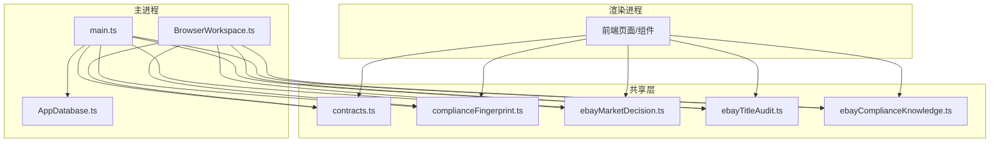
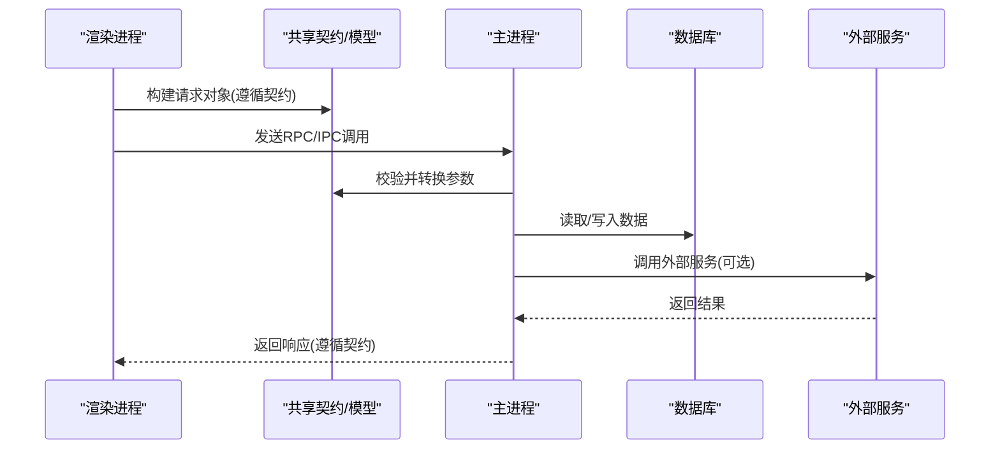
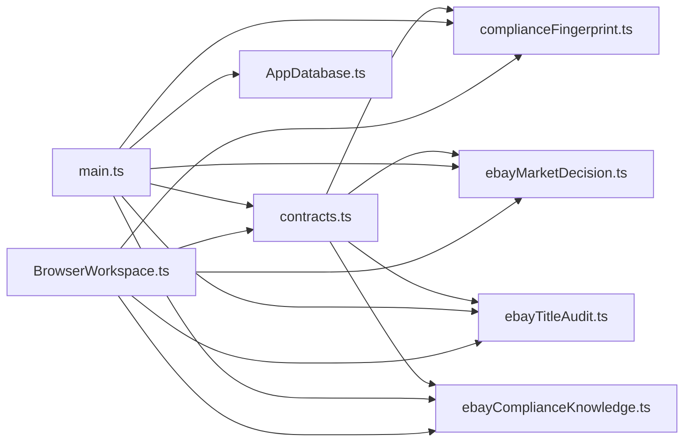

# 数据模型

<cite>
**本文引用的文件**   
- [AppDatabase.ts](file://src/main/database/AppDatabase.ts)
- [contracts.ts](file://src/shared/contracts.ts)
- [complianceFingerprint.ts](file://src/shared/complianceFingerprint.ts)
- [ebayMarketDecision.ts](file://src/shared/ebayMarketDecision.ts)
- [ebayTitleAudit.ts](file://src/shared/ebayTitleAudit.ts)
- [ebayComplianceKnowledge.ts](file://src/shared/ebayComplianceKnowledge.ts)
- [main.ts](file://src/main/main.ts)
- [BrowserWorkspace.ts](file://src/main/browser/BrowserWorkspace.ts)
</cite>

## 目录
1. [引言](#引言)
2. [项目结构](#项目结构)
3. [核心组件](#核心组件)
4. [架构总览](#架构总览)
5. [详细组件分析](#详细组件分析)
6. [依赖关系分析](#依赖关系分析)
7. [性能考量](#性能考量)
8. [故障排查指南](#故障排查指南)
9. [结论](#结论)
10. [附录](#附录)

## 引言
本文件面向“砚都跨境”项目的数据模型，聚焦共享数据结构、类型定义与业务实体，覆盖合规指纹、市场决策、标题审计等关键领域。文档同时给出数据库表结构设计建议、字段约束、索引策略与数据迁移方案，并提供序列化/反序列化与持久化的最佳实践，帮助开发者在跨进程（主进程/渲染进程）环境中稳定地读写数据。

## 项目结构
本项目采用多进程架构：主进程负责数据库与外部服务调用，渲染进程负责UI交互；共享层提供跨进程可序列化的类型与业务模型。数据模型主要分布在 shared 目录的若干模块中，并通过 contracts 统一契约；数据库访问集中在 AppDatabase 中。

图表来源
- [AppDatabase.ts](file://src/main/database/AppDatabase.ts)
- [contracts.ts](file://src/shared/contracts.ts)
- [complianceFingerprint.ts](file://src/shared/complianceFingerprint.ts)
- [ebayMarketDecision.ts](file://src/shared/ebayMarketDecision.ts)
- [ebayTitleAudit.ts](file://src/shared/ebayTitleAudit.ts)
- [ebayComplianceKnowledge.ts](file://src/shared/ebayComplianceKnowledge.ts)
- [main.ts](file://src/main/main.ts)
- [BrowserWorkspace.ts](file://src/main/browser/BrowserWorkspace.ts)

章节来源
- [AppDatabase.ts](file://src/main/database/AppDatabase.ts)
- [contracts.ts](file://src/shared/contracts.ts)
- [complianceFingerprint.ts](file://src/shared/complianceFingerprint.ts)
- [ebayMarketDecision.ts](file://src/shared/ebayMarketDecision.ts)
- [ebayTitleAudit.ts](file://src/shared/ebayTitleAudit.ts)
- [ebayComplianceKnowledge.ts](file://src/shared/ebayComplianceKnowledge.ts)
- [main.ts](file://src/main/main.ts)
- [BrowserWorkspace.ts](file://src/main/browser/BrowserWorkspace.ts)

## 核心组件
- 共享契约与类型：通过 contracts.ts 集中定义跨进程传输的数据结构与校验规则，确保主进程与渲染进程之间的数据一致性。
- 合规指纹：complianceFingerprint.ts 定义商品合规特征与指纹生成规则，用于快速比对与去重。
- 市场决策：ebayMarketDecision.ts 描述基于市场信号的商品上架/定价/优化决策模型。
- 标题审计：ebayTitleAudit.ts 定义标题合规检查、评分与修复建议的数据结构。
- 合规知识库：ebayComplianceKnowledge.ts 维护平台规则、类目限制与关键词白黑名单等知识。
- 数据库访问：AppDatabase.ts 封装本地存储与查询接口，为上层业务提供一致的读写能力。

章节来源
- [contracts.ts](file://src/shared/contracts.ts)
- [complianceFingerprint.ts](file://src/shared/complianceFingerprint.ts)
- [ebayMarketDecision.ts](file://src/shared/ebayMarketDecision.ts)
- [ebayTitleAudit.ts](file://src/shared/ebayTitleAudit.ts)
- [ebayComplianceKnowledge.ts](file://src/shared/ebayComplianceKnowledge.ts)
- [AppDatabase.ts](file://src/main/database/AppDatabase.ts)

## 架构总览
数据模型贯穿“渲染进程 → 共享契约 → 主进程 → 数据库/外部服务”的全链路。渲染进程通过共享类型构造请求对象，主进程进行校验与转换后落库或调用外部服务，结果再按相同契约返回渲染进程。

图表来源
- [contracts.ts](file://src/shared/contracts.ts)
- [AppDatabase.ts](file://src/main/database/AppDatabase.ts)
- [main.ts](file://src/main/main.ts)

## 详细组件分析

### 共享契约与通用类型（contracts.ts）
- 职责：统一定义跨进程传输的数据结构、枚举与校验规则，避免主/渲染进程间类型不一致。
- 设计要点：
  - 使用不可变结构体风格，减少副作用。
  - 对关键字段设置必填与格式约束（如ID、时间戳、状态码）。
  - 将易变的业务枚举收敛到单一来源，便于扩展与维护。
- 序列化建议：
  - 优先使用 JSON 作为 IPC 传输格式，避免二进制协议带来的兼容性问题。
  - 对日期统一使用 ISO 字符串，数字统一使用 Number，避免精度丢失。
- 反序列化建议：
  - 在接收端进行严格校验，拒绝未知字段，防止上游变更导致下游崩溃。
  - 对可选字段提供默认值，增强健壮性。

章节来源
- [contracts.ts](file://src/shared/contracts.ts)

### 合规指纹（complianceFingerprint.ts）
- 职责：根据商品属性、图片特征、文本摘要等生成唯一指纹，用于重复检测与版本管理。
- 设计要点：
  - 指纹由多个维度组合而成，支持增量更新与局部失效。
  - 指纹长度与碰撞率需平衡，必要时引入哈希截断与冲突处理。
- 验证规则：
  - 输入字段非空校验、长度限制、字符集限制。
  - 指纹生成函数幂等，相同输入产生相同输出。
- 持久化建议：
  - 指纹表以商品ID为主键，指纹字段建立唯一索引。
  - 记录指纹版本与生成时间，便于回溯。

章节来源
- [complianceFingerprint.ts](file://src/shared/complianceFingerprint.ts)

### 市场决策（ebayMarketDecision.ts）
- 职责：整合价格、库存、竞争态势、转化率等信号，输出上架/调价/下架等决策。
- 设计要点：
  - 决策模型包含输入特征、权重配置、阈值与动作集合。
  - 支持A/B策略与灰度发布，便于线上验证效果。
- 验证规则：
  - 输入特征范围校验（如价格区间、库存非负）。
  - 决策结果必须包含理由与置信度，便于审计。
- 持久化建议：
  - 决策记录表包含商品ID、时间戳、输入快照、决策结果、置信度、策略版本。
  - 对商品ID+时间戳建立复合索引，便于时序查询。

章节来源
- [ebayMarketDecision.ts](file://src/shared/ebayMarketDecision.ts)

### 标题审计（ebayTitleAudit.ts）
- 职责：对商品标题进行合规检查、可读性评分与修复建议生成。
- 设计要点：
  - 审计规则模块化，支持按类目动态加载。
  - 评分体系包含长度、关键词、敏感词、特殊字符等维度。
- 验证规则：
  - 标题长度、字符集、禁止词命中检测。
  - 修复建议需具备可操作性与优先级排序。
- 持久化建议：
  - 审计记录表包含商品ID、原始标题、审计结果、修复建议、评分明细。
  - 对商品ID与审计时间建立索引，支持历史对比。

章节来源
- [ebayTitleAudit.ts](file://src/shared/ebayTitleAudit.ts)

### 合规知识库（ebayComplianceKnowledge.ts）
- 职责：维护平台规则、类目限制、关键词白名单/黑名单、政策变更历史等。
- 设计要点：
  - 知识库版本化管理，支持热更新与回滚。
  - 规则引擎与数据分离，便于扩展新规则。
- 验证规则：
  - 规则表达式语法校验、冲突检测。
  - 白名单/黑名单更新需经过审批流程。
- 持久化建议：
  - 规则表包含规则ID、表达式、适用范围、生效时间、版本。
  - 对适用范围与生效时间建立索引，加速匹配。

章节来源
- [ebayComplianceKnowledge.ts](file://src/shared/ebayComplianceKnowledge.ts)

### 数据库访问（AppDatabase.ts）
- 职责：封装本地数据库操作，提供统一的CRUD与事务接口。
- 设计要点：
  - 连接池管理与错误重试机制。
  - 对高频查询提供缓存层，降低IO压力。
- 迁移策略：
  - 使用版本化迁移脚本，保证向后兼容。
  - 迁移失败时自动回滚，确保数据一致性。
- 索引策略：
  - 针对外键、过滤条件、排序字段建立索引。
  - 定期分析慢查询，优化索引与SQL。

章节来源
- [AppDatabase.ts](file://src/main/database/AppDatabase.ts)

## 依赖关系分析
共享模型被主进程与渲染进程共同依赖，数据库访问仅在主进程中使用。外部服务调用由主进程代理，渲染进程不直接访问。

图表来源
- [contracts.ts](file://src/shared/contracts.ts)
- [complianceFingerprint.ts](file://src/shared/complianceFingerprint.ts)
- [ebayMarketDecision.ts](file://src/shared/ebayMarketDecision.ts)
- [ebayTitleAudit.ts](file://src/shared/ebayTitleAudit.ts)
- [ebayComplianceKnowledge.ts](file://src/shared/ebayComplianceKnowledge.ts)
- [main.ts](file://src/main/main.ts)
- [BrowserWorkspace.ts](file://src/main/browser/BrowserWorkspace.ts)
- [AppDatabase.ts](file://src/main/database/AppDatabase.ts)

章节来源
- [contracts.ts](file://src/shared/contracts.ts)
- [complianceFingerprint.ts](file://src/shared/complianceFingerprint.ts)
- [ebayMarketDecision.ts](file://src/shared/ebayMarketDecision.ts)
- [ebayTitleAudit.ts](file://src/shared/ebayTitleAudit.ts)
- [ebayComplianceKnowledge.ts](file://src/shared/ebayComplianceKnowledge.ts)
- [main.ts](file://src/main/main.ts)
- [BrowserWorkspace.ts](file://src/main/browser/BrowserWorkspace.ts)
- [AppDatabase.ts](file://src/main/database/AppDatabase.ts)

## 性能考量
- 序列化开销：共享模型应尽量避免深层嵌套与冗余字段，减少IPC传输体积。
- 索引设计：热点查询字段建立合适索引，避免全表扫描。
- 缓存策略：对读多写少的数据（如合规知识库）引入内存缓存，设置合理过期时间。
- 批量操作：合并多次写入为事务批次，提升吞吐。
- 异步处理：耗时任务（如指纹生成、标题审计）采用队列异步执行，避免阻塞主线程。

[本节为通用指导，不直接分析具体文件]

## 故障排查指南
- 类型不一致：检查共享契约是否同步更新，确保主/渲染进程使用同一版本。
- 数据校验失败：定位反序列化阶段的校验逻辑，打印输入快照以便复现。
- 数据库异常：查看连接池状态、慢查询日志与索引命中率。
- 外部服务超时：增加重试与熔断机制，记录调用链追踪信息。
- 迁移失败：回滚至上一版本，检查迁移脚本兼容性。

章节来源
- [AppDatabase.ts](file://src/main/database/AppDatabase.ts)
- [contracts.ts](file://src/shared/contracts.ts)

## 结论
本数据模型以共享契约为核心，围绕合规指纹、市场决策、标题审计与合规知识库构建完整业务实体体系。通过严格的校验、合理的索引设计与稳健的迁移策略，确保系统在跨进程环境下的高可用与可扩展性。建议持续监控性能指标与错误率，迭代优化模型与查询路径。

[本节为总结性内容，不直接分析具体文件]

## 附录

### 数据库表结构设计建议
- 商品基础表
  - 字段：商品ID（主键）、名称、类目、状态、创建时间、更新时间
  - 约束：商品ID唯一，状态枚举限定
  - 索引：类目、状态、更新时间
- 合规指纹表
  - 字段：商品ID（外键）、指纹值、版本、生成时间
  - 约束：指纹值唯一
  - 索引：商品ID、指纹值
- 市场决策表
  - 字段：商品ID（外键）、时间戳、输入快照、决策结果、置信度、策略版本
  - 约束：时间戳递增
  - 索引：商品ID+时间戳、策略版本
- 标题审计表
  - 字段：商品ID（外键）、原始标题、审计结果、修复建议、评分明细
  - 约束：审计结果非空
  - 索引：商品ID、审计时间
- 合规知识库表
  - 字段：规则ID（主键）、表达式、适用范围、生效时间、版本
  - 约束：规则ID唯一
  - 索引：适用范围、生效时间

[本节为概念性设计，不直接映射具体代码文件]

### 数据迁移方案
- 版本控制：每次迁移附带版本号与说明，保持向后兼容。
- 原子性：迁移脚本在事务中执行，失败自动回滚。
- 灰度发布：先在小范围实例应用迁移，验证无误后再全量推广。
- 回滚策略：保留旧表结构或数据备份，支持快速回退。

[本节为通用指导，不直接分析具体文件]

### 序列化/反序列化最佳实践
- 统一格式：所有IPC消息使用JSON，日期用ISO字符串，数字用Number。
- 严格校验：接收端拒绝未知字段，对必填项进行非空校验。
- 默认值：可选字段提供合理默认值，避免未定义行为。
- 版本兼容：新增字段时保持向下兼容，废弃字段标记为可选。

[本节为通用指导，不直接分析具体文件]