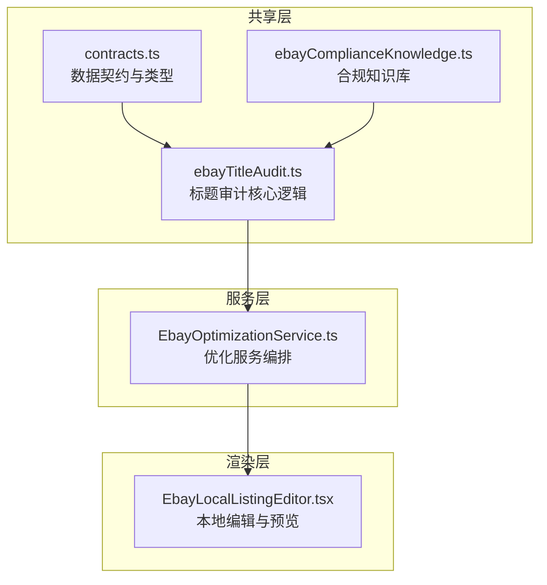
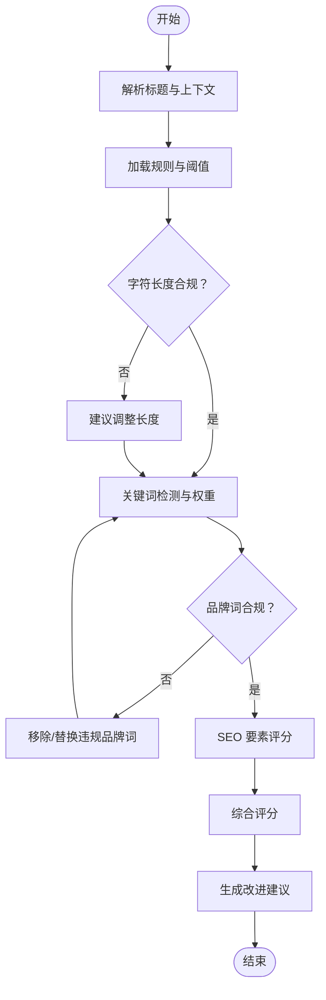
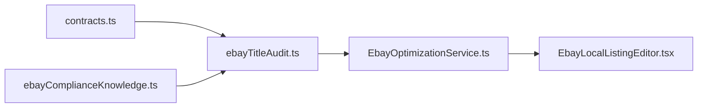

# 标题审计模型

<cite>
**本文引用的文件**   
- [ebayTitleAudit.ts](file://src/shared/ebayTitleAudit.ts)
- [EbayOptimizationService.ts](file://src/main/services/EbayOptimizationService.ts)
- [contracts.ts](file://src/shared/contracts.ts)
- [ebayComplianceKnowledge.ts](file://src/shared/ebayComplianceKnowledge.ts)
- [EbayLocalListingEditor.tsx](file://src/renderer/EbayLocalListingEditor.tsx)
</cite>

## 目录
1. [简介](#简介)
2. [项目结构](#项目结构)
3. [核心组件](#核心组件)
4. [架构总览](#架构总览)
5. [详细组件分析](#详细组件分析)
6. [依赖关系分析](#依赖关系分析)
7. [性能考量](#性能考量)
8. [故障排查指南](#故障排查指南)
9. [结论](#结论)
10. [附录](#附录)

## 简介
本文件面向 eBay 商品标题审计与优化，系统化说明标题数据结构、验证规则、评分机制、改进建议生成流程，以及关键词检测、字符限制检查、品牌词校验与 SEO 优化等能力。文档同时提供标题模板与批量处理方案，帮助非技术用户也能快速上手并落地实践。

## 项目结构
围绕标题审计的核心代码主要分布在共享层与服务层：
- 共享层定义标题审计的数据契约、合规知识与审计逻辑入口
- 服务层封装优化策略、调用外部能力（如翻译、图像合规）并输出可执行的优化建议
- 渲染层提供本地编辑与预览界面，便于人工复核与批量操作



**图表来源**
- [ebayTitleAudit.ts](file://src/shared/ebayTitleAudit.ts)
- [contracts.ts](file://src/shared/contracts.ts)
- [ebayComplianceKnowledge.ts](file://src/shared/ebayComplianceKnowledge.ts)
- [EbayOptimizationService.ts](file://src/main/services/EbayOptimizationService.ts)
- [EbayLocalListingEditor.tsx](file://src/renderer/EbayLocalListingEditor.tsx)

**章节来源**
- [ebayTitleAudit.ts](file://src/shared/ebayTitleAudit.ts)
- [contracts.ts](file://src/shared/contracts.ts)
- [ebayComplianceKnowledge.ts](file://src/shared/ebayComplianceKnowledge.ts)
- [EbayOptimizationService.ts](file://src/main/services/EbayOptimizationService.ts)
- [EbayLocalListingEditor.tsx](file://src/renderer/EbayLocalListingEditor.tsx)

## 核心组件
- 标题审计核心（ebayTitleAudit.ts）
  - 负责解析标题、执行规则校验、计算得分、生成改进建议
  - 支持关键词检测、字符长度限制、品牌词校验、SEO 要素评估
- 数据契约（contracts.ts）
  - 定义标题审计输入输出结构、字段约束与枚举值
- 合规知识库（ebayComplianceKnowledge.ts）
  - 维护类目规则、禁用词、品牌白名单、字符集与长度阈值等知识
- 优化服务（EbayOptimizationService.ts）
  - 编排审计流程、整合多源信息、输出可落地的优化方案
- 本地编辑器（EbayLocalListingEditor.tsx）
  - 提供标题编辑、实时校验反馈、批量导入导出与模板应用

**章节来源**
- [ebayTitleAudit.ts](file://src/shared/ebayTitleAudit.ts)
- [contracts.ts](file://src/shared/contracts.ts)
- [ebayComplianceKnowledge.ts](file://src/shared/ebayComplianceKnowledge.ts)
- [EbayOptimizationService.ts](file://src/main/services/EbayOptimizationService.ts)
- [EbayLocalListingEditor.tsx](file://src/renderer/EbayLocalListingEditor.tsx)

## 架构总览
标题审计采用“规则引擎 + 服务编排”的架构：
- 输入：原始标题、类目信息、品牌、语言、目标市场
- 处理：规则校验（字符、关键词、品牌）、评分计算、建议生成
- 输出：审计报告（分数、问题清单、改进建议、优化后标题候选）

```mermaid
sequenceDiagram
participant UI as "本地编辑器"
participant Audit as "标题审计核心"
participant Knowledge as "合规知识库"
participant Opt as "优化服务"
UI->>Audit : "提交标题与上下文"
Audit->>Knowledge : "查询类目规则/品牌白名单"
Knowledge-->>Audit : "返回规则与阈值"
Audit->>Audit : "执行字符限制/关键词/品牌校验"
Audit->>Audit : "计算综合得分与建议"
Audit-->>Opt : "返回审计报告"
Opt->>Opt : "生成优化标题候选"
Opt-->>UI : "展示结果与可执行建议"
```

**图表来源**
- [ebayTitleAudit.ts](file://src/shared/ebayTitleAudit.ts)
- [ebayComplianceKnowledge.ts](file://src/shared/ebayComplianceKnowledge.ts)
- [EbayOptimizationService.ts](file://src/main/services/EbayOptimizationService.ts)
- [EbayLocalListingEditor.tsx](file://src/renderer/EbayLocalListingEditor.tsx)

## 详细组件分析

### 标题审计核心（ebayTitleAudit.ts）
- 职责
  - 解析标题文本，提取关键片段（品牌、型号、属性、卖点）
  - 基于规则库进行字符长度、特殊字符、重复词、停用词等校验
  - 关键词匹配与权重打分，识别缺失或冗余关键词
  - 品牌词校验（白名单/黑名单），避免侵权风险
  - 生成结构化审计报告与改进建议
- 关键流程
  - 输入校验 → 规则扫描 → 评分计算 → 建议生成 → 输出报告
- 复杂度与性能
  - 字符串扫描为线性复杂度；关键词匹配可通过索引或正则预编译优化
  - 建议在大批量场景下缓存规则与字典，减少重复计算



**图表来源**
- [ebayTitleAudit.ts](file://src/shared/ebayTitleAudit.ts)
- [ebayComplianceKnowledge.ts](file://src/shared/ebayComplianceKnowledge.ts)

**章节来源**
- [ebayTitleAudit.ts](file://src/shared/ebayTitleAudit.ts)
- [ebayComplianceKnowledge.ts](file://src/shared/ebayComplianceKnowledge.ts)

### 数据契约（contracts.ts）
- 作用
  - 统一定义标题审计的输入输出结构，确保各模块间数据一致性
- 关键字段（示例性描述）
  - 输入：原始标题、类目、品牌、语言、目标市场、附加属性
  - 输出：审计报告（分数、问题列表、建议列表、候选标题）
- 约束
  - 字段必填项、枚举值范围、长度限制、字符集要求

**章节来源**
- [contracts.ts](file://src/shared/contracts.ts)

### 合规知识库（ebayComplianceKnowledge.ts）
- 内容
  - 类目规则、禁用词表、品牌白名单、字符集与长度阈值、SEO 关键词权重
- 使用方式
  - 审计核心在运行时按需加载，支持热更新与扩展
- 维护建议
  - 定期同步平台政策变化，建立版本化知识库

**章节来源**
- [ebayComplianceKnowledge.ts](file://src/shared/ebayComplianceKnowledge.ts)

### 优化服务（EbayOptimizationService.ts）
- 职责
  - 编排审计流程，整合规则、知识库与外部能力（如翻译、图像合规）
  - 生成可执行的优化标题候选，并提供优先级排序
- 流程要点
  - 接收审计报告 → 策略选择 → 候选生成 → 质量校验 → 输出结果
- 集成点
  - 与本地编辑器交互，支持批量导入导出与模板应用

**章节来源**
- [EbayOptimizationService.ts](file://src/main/services/EbayOptimizationService.ts)

### 本地编辑器（EbayLocalListingEditor.tsx）
- 功能
  - 标题编辑、实时校验反馈、批量导入导出、模板应用
- 用户体验
  - 高亮问题字段、一键修复建议、预览优化效果
- 批量处理
  - 支持 CSV/JSON 批量导入，按模板批量生成标题，导出审计报告

**章节来源**
- [EbayLocalListingEditor.tsx](file://src/renderer/EbayLocalListingEditor.tsx)

## 依赖关系分析
- 模块耦合
  - 审计核心依赖契约与知识库；优化服务编排审计核心；编辑器消费优化服务输出
- 外部依赖
  - 可能涉及翻译、图像合规等外部服务，通过服务层抽象隔离
- 潜在循环依赖
  - 通过契约与接口解耦，避免直接耦合



**图表来源**
- [contracts.ts](file://src/shared/contracts.ts)
- [ebayTitleAudit.ts](file://src/shared/ebayTitleAudit.ts)
- [ebayComplianceKnowledge.ts](file://src/shared/ebayComplianceKnowledge.ts)
- [EbayOptimizationService.ts](file://src/main/services/EbayOptimizationService.ts)
- [EbayLocalListingEditor.tsx](file://src/renderer/EbayLocalListingEditor.tsx)

**章节来源**
- [contracts.ts](file://src/shared/contracts.ts)
- [ebayTitleAudit.ts](file://src/shared/ebayTitleAudit.ts)
- [ebayComplianceKnowledge.ts](file://src/shared/ebayComplianceKnowledge.ts)
- [EbayOptimizationService.ts](file://src/main/services/EbayOptimizationService.ts)
- [EbayLocalListingEditor.tsx](file://src/renderer/EbayLocalListingEditor.tsx)

## 性能考量
- 规则与字典缓存：避免重复加载与计算
- 正则与关键词索引：提升匹配效率
- 批处理优化：分片处理、异步并行、增量更新
- 内存控制：大文本分块处理，及时释放临时对象

[本节为通用指导，不直接分析具体文件]

## 故障排查指南
- 常见问题
  - 字符长度超限：检查目标市场与类目长度阈值
  - 品牌词违规：核对品牌白名单与拼写变体
  - 关键词缺失：补充核心属性与卖点词
  - 特殊字符干扰：清理不可见字符与多余空格
- 定位方法
  - 查看审计报告中的问题清单与建议优先级
  - 使用编辑器的高亮反馈快速定位问题字段
  - 对批量任务逐条回放日志，定位失败条目

**章节来源**
- [ebayTitleAudit.ts](file://src/shared/ebayTitleAudit.ts)
- [EbayLocalListingEditor.tsx](file://src/renderer/EbayLocalListingEditor.tsx)

## 结论
标题审计模型以规则驱动为核心，结合知识库与服务编排，形成从校验、评分到建议生成的完整闭环。通过模板化与批量化能力，可在保证合规与 SEO 质量的前提下，显著提升标题生产效率与一致性。

[本节为总结性内容，不直接分析具体文件]

## 附录

### 标题模板与批量处理方案
- 模板设计原则
  - 固定结构：品牌 + 核心属性 + 型号 + 卖点 + 适用场景
  - 变量占位：颜色、尺寸、材质、数量等动态字段
  - 语言适配：多语言模板与本地化词汇库
- 批量处理流程
  - 导入数据（CSV/JSON）→ 应用模板 → 审计校验 → 生成候选标题 → 导出结果
- 质量控制
  - 设置最低分数阈值，低于阈值的条目进入人工复核队列
  - 记录变更历史与审计快照，便于回溯与复盘

[本节为概念性内容，不直接分析具体文件]