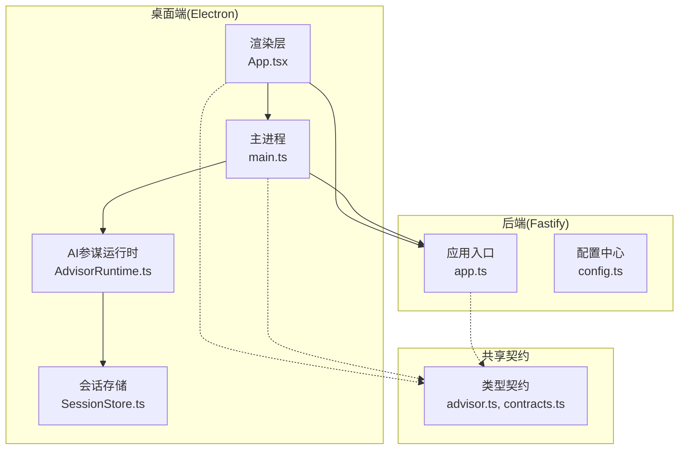
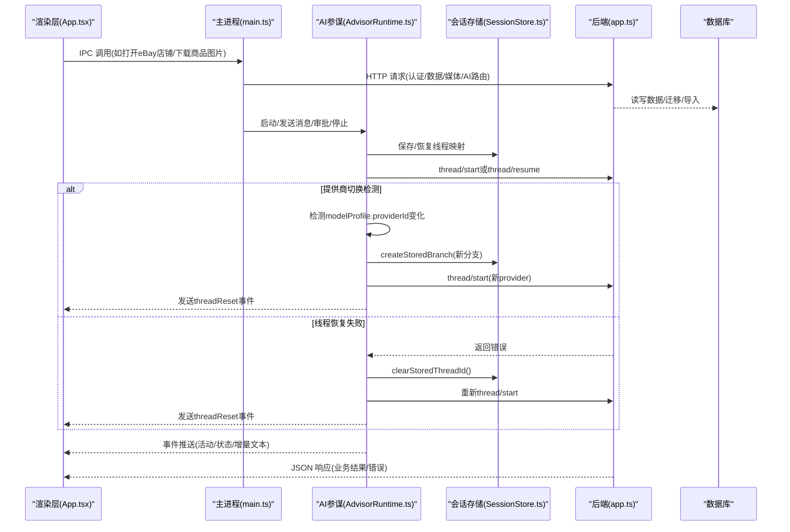
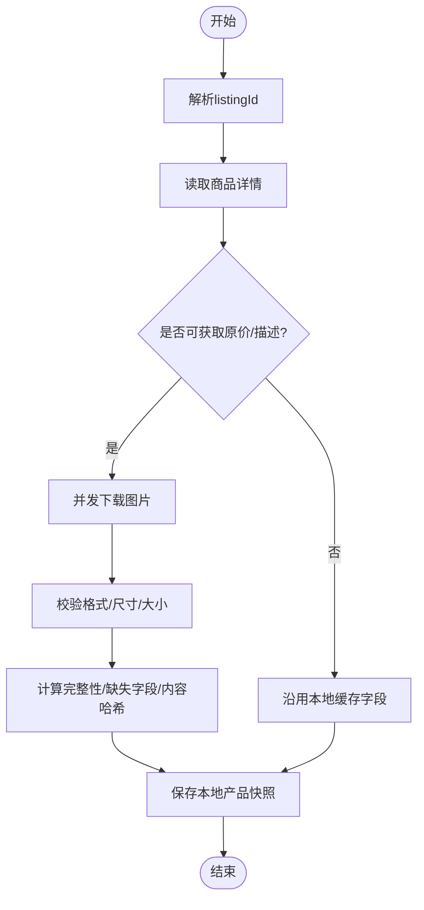
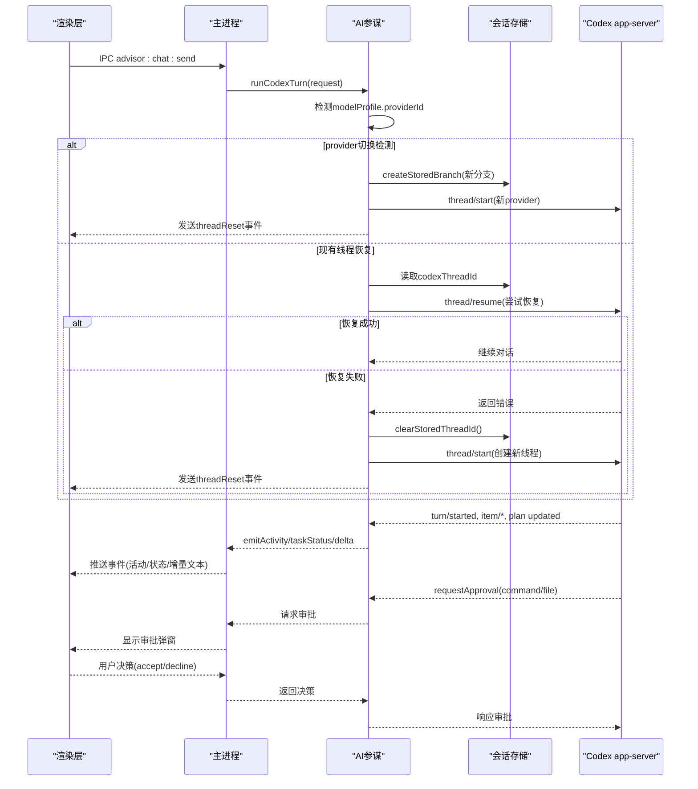
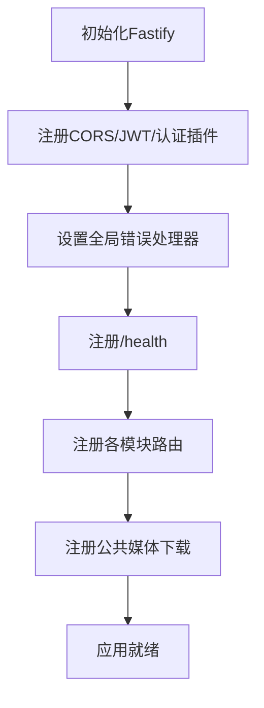
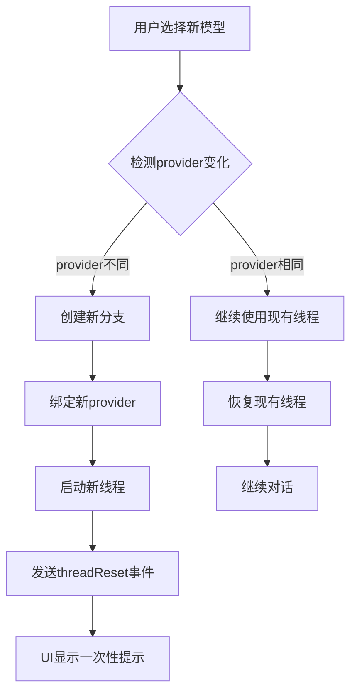
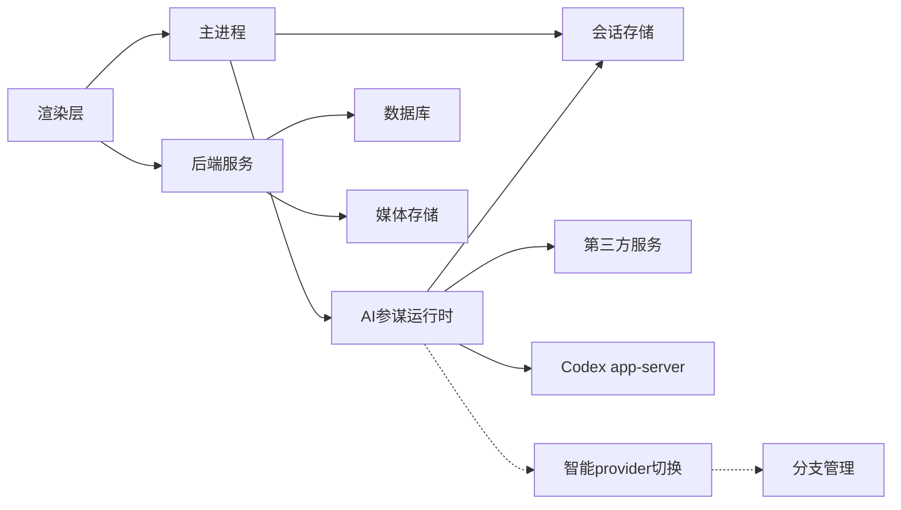

# AI参谋系统架构

<cite>
**本文引用的文件**
- [package.json](file://package.json)
- [src/main/main.ts](file://src/main/main.ts)
- [src/main/advisor/AdvisorRuntime.ts](file://src/main/advisor/AdvisorRuntime.ts)
- [src/main/advisor/SessionStore.ts](file://src/main/advisor/SessionStore.ts)
- [server/src/app.ts](file://server/src/app.ts)
- [server/src/config.ts](file://server/src/config.ts)
- [src/shared/advisor.ts](file://src/shared/advisor.ts)
- [src/shared/contracts.ts](file://src/shared/contracts.ts)
- [src/renderer/App.tsx](file://src/renderer/App.tsx)
- [src/renderer/OnlineAdvisorExperience.tsx](file://src/renderer/OnlineAdvisorExperience.tsx)
</cite>

## 更新摘要
**所做更改**
- 新增模型提供商自动切换与分叉机制章节
- 更新AI参谋运行时组件分析，包含ModelProfile-based effort参数处理和provider切换检测
- 增强分支管理功能，支持自动创建新分支避免provider锁定问题
- 更新架构图表以反映新的智能分支切换机制
- 新增threadReset事件处理流程说明

## 目录
1. [简介](#简介)
2. [项目结构](#项目结构)
3. [核心组件](#核心组件)
4. [架构总览](#架构总览)
5. [详细组件分析](#详细组件分析)
6. [依赖关系分析](#依赖关系分析)
7. [性能考量](#性能考量)
8. [故障排查指南](#故障排查指南)
9. [结论](#结论)
10. [附录](#附录)

## 简介
本仓库是一个面向跨境电商的桌面端应用与配套后端服务，围绕"选品、素材生成、合规校验、刊登优化、AI参谋"等能力构建。整体采用 Electron 主进程 + Web 渲染层 + Fastify 后端服务的分层架构：
- 主进程负责浏览器工作区、本地资源管理、第三方服务集成（图像、翻译、视频、eBay 等）、任务编排与 IPC 通信。
- 渲染层提供多模块 UI（团队工作台、AI参谋、AI采集、AI美工、AI视频、AI员工等）。
- 后端服务提供认证、权限、数据持久化、媒体存储、AI 网关路由、合规引擎、eBay 业务接口等。

该文档从系统架构、组件关系、数据流、处理逻辑、集成点、错误处理与性能特性等方面展开，帮助读者快速理解并定位关键实现。

## 项目结构
- 根目录包含 Electron 工程配置、脚本、工具集、测试与产物目录。
- src/main 为主进程代码，涵盖应用初始化、服务装配、IPC 路由、浏览器工作区、数据库访问、AI 参谋运行时等。
- src/renderer 为 React 渲染层，组织页面与状态，调用主进程与后端 API。
- server 为 Fastify 后端，统一注册路由、鉴权、错误处理、健康检查与跨域策略。
- shared 定义前后端共享的类型契约，保证类型一致性与可维护性。

**图表来源**
- [src/main/main.ts:1-120](file://src/main/main.ts#L1-L120)
- [src/main/advisor/AdvisorRuntime.ts:1097-1334](file://src/main/advisor/AdvisorRuntime.ts#L1097-L1334)
- [src/main/advisor/SessionStore.ts:124-138](file://src/main/advisor/SessionStore.ts#L124-L138)
- [server/src/app.ts:21-70](file://server/src/app.ts#L21-L70)
- [server/src/config.ts:9-37](file://server/src/config.ts#L9-L37)
- [src/shared/advisor.ts:118-123](file://src/shared/advisor.ts#L118-L123)

章节来源
- [package.json:1-50](file://package.json#L1-L50)
- [src/main/main.ts:1-120](file://src/main/main.ts#L1-L120)
- [server/src/app.ts:21-70](file://server/src/app.ts#L21-L70)

## 核心组件
- 主进程应用入口：初始化各类服务（图像、翻译、eBay、知识库守卫、RAGFlow 等），注册 IPC 通道，管理浏览器工作区与本地数据。
- AI参谋运行时：封装与 Codex app-server 的交互，处理会话、分支、审批策略、活动事件、任务状态与使用量统计，**新增智能模型提供商切换与自动分叉机制**。
- 会话存储：管理任务持久化、线程映射、分支管理，**新增支持providerId跟踪的智能分支管理**。
- 后端应用：基于 Fastify，统一注册路由、JWT 鉴权、CORS、错误处理器与健康检查；按模块划分路由前缀。
- 配置中心：集中读取环境变量，暴露端口、数据库、媒体存储、AI 网关密钥等配置项。
- 共享契约：定义平台、市场账户、eBay 商品详情、优化草稿、发布任务、视频工作室、内容优化、标题审计等类型。

章节来源
- [src/main/main.ts:102-118](file://src/main/main.ts#L102-L118)
- [src/main/advisor/AdvisorRuntime.ts:165-219](file://src/main/advisor/AdvisorRuntime.ts#L165-L219)
- [src/main/advisor/SessionStore.ts:124-138](file://src/main/advisor/SessionStore.ts#L124-L138)
- [server/src/app.ts:21-70](file://server/src/app.ts#L21-L70)
- [server/src/config.ts:9-37](file://server/src/config.ts#L9-L37)
- [src/shared/contracts.ts:73-180](file://src/shared/contracts.ts#L73-L180)

## 架构总览
系统由三层组成：
- 渲染层：React 页面与状态管理，通过 IPC 与主进程交互，并通过 HTTP 调用后端 API。
- 主进程：承载浏览器工作区、本地文件系统、外部服务集成、AI参谋运行时、任务调度与数据持久化。
- 后端服务：提供 RESTful API，统一鉴权、错误处理、媒体存储、AI 网关路由、合规引擎与 eBay 业务接口。

**图表来源**
- [src/main/main.ts:298-384](file://src/main/main.ts#L298-L384)
- [src/main/advisor/AdvisorRuntime.ts:861-915](file://src/main/advisor/AdvisorRuntime.ts#L861-L915)
- [src/main/advisor/SessionStore.ts:124-138](file://src/main/advisor/SessionStore.ts#L124-L138)
- [server/src/app.ts:21-70](file://server/src/app.ts#L21-L70)

## 详细组件分析

### 主进程应用入口（main.ts）
- 职责：
  - 初始化各类服务实例（图像、翻译、eBay、知识库守卫、RAGFlow、视频服务等）。
  - 管理浏览器工作区（打开 eBay 店铺、新建标签页、读取商品详情、下载图片、准备修订资料）。
  - 处理本地产品快照、媒体上传、尺寸检测、格式校验、完整性评估。
  - 构建发布任务、合规校验、图片检查、Seller Hub 预填与人工确认流程。
  - 注册 IPC 通道，向渲染层暴露能力（如 eBAY 相关操作、视频生成、报告导出等）。
- 关键流程示例（eBay 本地产品下载与快照）：
  - 解析 listingId -> 读取详情页 -> 合并价格与描述 -> 下载图片（并发限制）-> 计算完整性与哈希 -> 保存快照。
- 错误处理：
  - 对网络失败、图片格式不支持、尺寸不达标、大小超限等进行阻断或警告。
  - 在 Seller Hub 未打开时自动引导登录并重试。

**图表来源**
- [src/main/main.ts:412-491](file://src/main/main.ts#L412-L491)
- [src/main/main.ts:529-569](file://src/main/main.ts#L529-L569)

章节来源
- [src/main/main.ts:216-257](file://src/main/main.ts#L216-L257)
- [src/main/main.ts:298-384](file://src/main/main.ts#L298-L384)
- [src/main/main.ts:412-491](file://src/main/main.ts#L412-L491)
- [src/main/main.ts:529-569](file://src/main/main.ts#L529-L569)

### AI参谋运行时（AdvisorRuntime.ts）
- 职责：
  - 管理模型配置与权限模式（ask/agent/fullAccess）。
  - 连接 Codex app-server，处理会话、分支、回合、计划、命令执行、文件变更等事件。
  - 实现审批策略：命令执行与文件修改需根据策略自动批准或请求用户确认。
  - 维护任务状态、使用量统计、事件持久化、中断与清理。
  - 探针式连接 harness 网关，用于在线执行器可用性展示。
  - **新增智能模型提供商切换机制**：当检测到用户切换到不同provider的模型时，自动创建新分支以避免provider锁定问题。
  - **新增ModelProfile-based effort参数处理**：每个模型配置包含effort字段，替代硬编码的推理深度设置。
  - **新增线程上下文恢复和自动回退机制**：当Codex app-server重启或线程丢失时，自动创建新线程并通知UI。
- 关键流程示例（发送消息与审批）：
  - 接收 IPC 消息 -> 校验参数 -> 启动/恢复线程 -> 发送消息 -> 监听通知 -> 更新状态 -> 持久化事件。
  - 当需要执行命令或修改文件时，依据策略决定是否自动批准或弹出审批。
  - **新增**：当thread/resume失败时，自动调用clearStoredThreadId清除失效的线程映射，然后重新thread/start创建新线程。
  - **新增**：检测当前分支的providerId与目标模型的providerId，如果不一致则自动fork创建新分支。

**图表来源**
- [src/main/advisor/AdvisorRuntime.ts:861-915](file://src/main/advisor/AdvisorRuntime.ts#L861-L915)
- [src/main/advisor/SessionStore.ts:124-138](file://src/main/advisor/SessionStore.ts#L124-L138)
- [src/main/advisor/AdvisorRuntime.ts:489-586](file://src/main/advisor/AdvisorRuntime.ts#L489-L586)

章节来源
- [src/main/advisor/AdvisorRuntime.ts:165-219](file://src/main/advisor/AdvisorRuntime.ts#L165-L219)
- [src/main/advisor/AdvisorRuntime.ts:489-586](file://src/main/advisor/AdvisorRuntime.ts#L489-L586)
- [src/main/advisor/AdvisorRuntime.ts:861-915](file://src/main/advisor/AdvisorRuntime.ts#L861-L915)
- [src/main/advisor/AdvisorRuntime.ts:1097-1334](file://src/main/advisor/AdvisorRuntime.ts#L1097-L1334)

### 会话存储（SessionStore.ts）
- 职责：
  - 管理任务持久化、线程映射、分支管理、事件记录。
  - 提供任务创建、查询、更新、删除等CRUD操作。
  - **新增clearStoredThreadId函数**：处理Codex app-server重启后线程映射丢失的场景。
  - **新增支持providerId跟踪的分支管理**：每个分支现在可以跟踪其关联的模型提供商。
- 关键功能：
  - setStoredThreadId：保存线程ID到任务和当前活跃分支。
  - clearStoredThreadId：清除失效的线程映射，支持线程恢复失败后的清理。
  - createStoredBranch：创建新分支并关联线程ID，**新增支持providerId和model参数**。
  - selectStoredBranch：切换活跃分支并更新线程映射。
  - recoverInterruptedTasks：应用重启时恢复中断的任务状态。

**章节来源**
- [src/main/advisor/SessionStore.ts:113-138](file://src/main/advisor/SessionStore.ts#L113-L138)
- [src/main/advisor/SessionStore.ts:140-177](file://src/main/advisor/SessionStore.ts#L140-L177)
- [src/main/advisor/SessionStore.ts:248-262](file://src/main/advisor/SessionStore.ts#L248-L262)

### 后端应用（app.ts）
- 职责：
  - 创建 Fastify 应用，注册 CORS、JWT、认证插件。
  - 全局错误处理器：区分 Zod 校验错误、自定义 HttpError、客户端错误与服务器内部错误。
  - 注册各模块路由（认证、成员、角色、商店、审计、仪表板、采集、合规、eBay、媒体、AI、Codex Harness）。
  - 提供健康检查端点。
- 关键点：
  - 错误处理顺序严格，确保已注册路由捕获正确的错误处理器。
  - 公共媒体下载路由支持 HMAC 签名授权。

**图表来源**
- [server/src/app.ts:21-70](file://server/src/app.ts#L21-L70)

章节来源
- [server/src/app.ts:21-70](file://server/src/app.ts#L21-L70)

### 配置中心（config.ts）
- 职责：
  - 集中读取环境变量，暴露端口、数据库 URL、JWT 密钥、令牌 TTL、CORS 源、媒体存储驱动与路径、OSS 配置、AI 网关密钥与模型等。
- 关键点：
  - 默认值与安全提示（开发用 JWT 密钥需替换）。
  - 媒体存储支持本地与 OSS 两种驱动，生产环境建议使用 OSS。

章节来源
- [server/src/config.ts:9-37](file://server/src/config.ts#L9-L37)

### 共享契约（advisor.ts, contracts.ts）
- 职责：
  - 定义平台、市场账户、eBay 商品详情、本地产品快照、优化草稿、发布任务、视频工作室、内容优化、标题审计、视觉规则等类型。
  - **新增threadReset事件类型**：用于通知UI线程上下文已重置。
- 关键点：
  - 强类型约束前后端数据一致性。
  - 覆盖 eBay 刊登全流程（标题优化、内容分段、翻译、故事板、视频生成、合规校验、发布任务）。
  - 定义AdvisorChatEvent联合类型，包含threadReset事件。

章节来源
- [src/shared/advisor.ts:118-123](file://src/shared/advisor.ts#L118-L123)
- [src/shared/contracts.ts:73-180](file://src/shared/contracts.ts#L73-L180)
- [src/shared/contracts.ts:439-555](file://src/shared/contracts.ts#L439-L555)
- [src/shared/contracts.ts:557-716](file://src/shared/contracts.ts#L557-L716)

### 渲染层（App.tsx）
- 职责：
  - 组织多模块页面（团队工作台、AI参谋、AI采集、AI美工、AI视频、AI员工等）。
  - 管理主题、权限、浏览器状态、任务进度、候选商品、仓库产品、比价数据、工作流计数等。
  - 与主进程 IPC 交互（浏览器、任务、系统能力），与后端 API 交互（市场平台配置、工作流等）。
- 关键点：
  - 权限控制：一级菜单与页面级权限判断。
  - 本地存储：偏好设置、选择记录、利润假设等。
  - 错误提示：加载失败、网络异常、功能不可用时的降级与提示。
  - **新增**：处理threadReset事件，向用户展示一次性提示说明上下文已重置。

章节来源
- [src/renderer/App.tsx:30-45](file://src/renderer/App.tsx#L30-L45)
- [src/renderer/App.tsx:609-732](file://src/renderer/App.tsx#L609-L732)

### 模型提供商智能切换机制（新增）
- 职责：
  - **ModelProfile定义**：每个模型配置包含id、name、providerId、supportsTools、supportsVision和effort字段。
  - **自动provider切换检测**：当用户切换到不同provider的模型时，系统自动检测并创建新分支。
  - **effort参数动态处理**：根据ModelProfile中的effort字段设置推理深度，避免硬编码导致的兼容性问题。
  - **分支隔离机制**：不同provider的对话历史保存在独立分支中，避免provider锁定问题。
- 关键流程：
  - 检测当前活跃分支的providerId与目标模型的providerId。
  - 如果不一致，自动创建新分支并绑定新的provider。
  - 发送threadReset事件通知UI上下文已在新分支上继续。
  - 保留旧分支供用户回溯查看。

**图表来源**
- [src/main/advisor/AdvisorRuntime.ts:857-879](file://src/main/advisor/AdvisorRuntime.ts#L857-L879)
- [src/main/advisor/AdvisorRuntime.ts:970-986](file://src/main/advisor/AdvisorRuntime.ts#L970-L986)

章节来源
- [src/main/advisor/AdvisorRuntime.ts:77-84](file://src/main/advisor/AdvisorRuntime.ts#L77-L84)
- [src/main/advisor/AdvisorRuntime.ts:189-194](file://src/main/advisor/AdvisorRuntime.ts#L189-L194)
- [src/main/advisor/AdvisorRuntime.ts:1241-1243](file://src/main/advisor/AdvisorRuntime.ts#L1241-L1243)

### 线程恢复与自动回退机制（新增）
- 职责：
  - **线程丢失检测**：当Codex app-server重启或被清理时，检测原线程无法恢复的情况。
  - **自动回退处理**：自动清除失效的线程映射并创建新线程。
  - **用户友好提示**：通过threadReset事件向用户解释上下文重置的原因。
  - **历史数据保留**：确保历史消息仍可访问，仅影响后续对话。
- 关键流程：
  - 尝试thread/resume恢复现有线程。
  - 如果失败，调用clearStoredThreadId清除失效映射。
  - 使用thread/start创建新线程。
  - 发送threadReset事件，包含具体原因信息。

章节来源
- [src/main/advisor/AdvisorRuntime.ts:909-964](file://src/main/advisor/AdvisorRuntime.ts#L909-L964)
- [src/main/advisor/SessionStore.ts:124-138](file://src/main/advisor/SessionStore.ts#L124-L138)

## 依赖关系分析
- 主进程依赖：
  - 浏览器工作区（Electron BrowserWindow/WebContentsView）。
  - 数据库访问（Prisma/SQLite/PostgreSQL）。
  - 第三方服务（图像、翻译、视频、eBay、知识库守卫、RAGFlow）。
  - AI参谋运行时（Codex app-server、harness 网关探针）。
  - **新增**：会话存储（SessionStore）用于线程映射持久化和智能分支管理。
- 后端依赖：
  - Fastify、CORS、JWT、Zod、Prisma。
  - 媒体存储（本地/OSS）。
  - 各模块路由（认证、成员、角色、商店、审计、仪表板、采集、合规、eBay、媒体、AI、Codex Harness）。
- 渲染层依赖：
  - React、Vite、样式与组件库。
  - IPC 与 HTTP 客户端。

**图表来源**
- [src/main/main.ts:102-118](file://src/main/main.ts#L102-L118)
- [src/main/advisor/AdvisorRuntime.ts:165-219](file://src/main/advisor/AdvisorRuntime.ts#L165-L219)
- [src/main/advisor/SessionStore.ts:124-138](file://src/main/advisor/SessionStore.ts#L124-L138)
- [server/src/app.ts:21-70](file://server/src/app.ts#L21-L70)

章节来源
- [src/main/main.ts:102-118](file://src/main/main.ts#L102-L118)
- [server/src/app.ts:21-70](file://server/src/app.ts#L21-L70)
- [src/main/advisor/AdvisorRuntime.ts:165-219](file://src/main/advisor/AdvisorRuntime.ts#L165-L219)

## 性能考量
- 并发下载：图片下载采用并发限制（最多 6 张），避免阻塞与资源耗尽。
- 缓存策略：Amazon 数据源与汇率缓存减少重复请求。
- 错误快速失败：网络超时、格式不支持、尺寸不达标立即阻断，减少无效处理。
- 审批策略：AI参谋运行时对命令与文件修改进行最小权限控制，降低误操作风险。
- 媒体存储：生产环境建议使用 OSS 直读，减少带宽与延迟。
- **新增**：线程恢复失败时的自动回退机制，避免长时间等待和用户体验下降。
- **新增**：智能provider切换避免model_not_found错误，提升系统稳定性。
- **新增**：ModelProfile-based effort参数优化推理性能，避免不兼容的推理深度设置。

[本节为通用指导，无需特定文件引用]

## 故障排查指南
- 后端错误：
  - 校验错误：ZodError 返回 400，包含字段路径与消息。
  - 业务错误：HttpError 返回对应状态码与错误码。
  - 内部错误：记录日志并返回 500。
- 主进程错误：
  - 浏览器未初始化：提示先打开 eBay 店铺。
  - 图片下载失败：记录原因并跳过，继续其他图片。
  - 尺寸/格式不达标：阻断并提示。
- AI参谋运行时：
  - 连接失败：harness 模式不可用，回退到本地执行器。
  - 审批超时：取消待处理审批，清理上下文进程。
  - 协议错误：终止所有活跃请求，记录失败原因。
  - **新增**：线程恢复失败：自动清除失效的线程映射并创建新线程，向UI发送threadReset事件。
  - **新增**：provider切换失败：检查ModelProfile配置和Codex app-server支持情况。
- **新增**：线程上下文丢失场景：
  - 症状：用户收到"上下文已断开"提示，对话从新线程开始。
  - 原因：Codex app-server重启或被清理，导致原线程无法恢复。
  - 处理：系统自动调用clearStoredThreadId清除失效映射，重新thread/start创建新线程。
  - 影响：历史消息仍可读，但后续对话将在新线程中进行。
- **新增**：provider锁定问题：
  - 症状：切换模型时报错"model_not_found"。
  - 原因：Codex线程绑定了特定的provider，无法直接使用其他provider的模型。
  - 处理：系统自动创建新分支并绑定新provider，避免provider锁定。
  - 影响：用户无感知切换，系统自动处理分支管理。

章节来源
- [server/src/app.ts:31-51](file://server/src/app.ts#L31-L51)
- [src/main/main.ts:312-384](file://src/main/main.ts#L312-L384)
- [src/main/main.ts:412-491](file://src/main/main.ts#L412-L491)
- [src/main/advisor/AdvisorRuntime.ts:707-736](file://src/main/advisor/AdvisorRuntime.ts#L707-L736)
- [src/main/advisor/AdvisorRuntime.ts:861-915](file://src/main/advisor/AdvisorRuntime.ts#L861-L915)
- [src/main/advisor/SessionStore.ts:124-138](file://src/main/advisor/SessionStore.ts#L124-L138)

## 结论
本系统以 Electron 主进程为核心，结合 React 渲染层与 Fastify 后端服务，构建了完整的跨境电商选品与素材工作流。AI参谋运行时提供了安全的自动化执行与审批机制，**新增的智能模型提供商切换、自动分叉机制和ModelProfile-based effort参数处理显著提升了系统的健壮性和用户体验**。后端服务统一了鉴权、错误处理与模块化路由。通过共享契约确保前后端类型一致，提升了可维护性与扩展性。建议在生产环境中启用 OSS 媒体存储、替换开发密钥、完善监控与日志，以提升稳定性与性能。

[本节为总结，无需特定文件引用]

## 附录
- 环境变量参考：
  - PORT、DATABASE_URL、JWT_SECRET、ACCESS_TOKEN_TTL、REFRESH_TOKEN_TTL_DAYS、CORS_ORIGIN。
  - MEDIA_DRIVER、MEDIA_LOCAL_DIR、MEDIA_PUBLIC_BASE_URL、MEDIA_SIGNING_SECRET。
  - OSS_BUCKET、OSS_ENDPOINT、OSS_ACCESS_KEY_ID、OSS_ACCESS_KEY_SECRET。
  - BAILIAN_API_KEY、BAILIAN_BASE_URL、BAILIAN_VISION_MODEL。
  - ARK_API_KEY、ARK_BASE_URL、ARK_VIDEO_MODEL。
  - OPENAI_IMAGE_API_KEY、OPENAI_IMAGE_BASE_URL。
  - DEEPSEEK_API_KEY、DEEPSEEK_BASE_URL、DEEPSEEK_MODEL。

章节来源
- [server/src/config.ts:9-37](file://server/src/config.ts#L9-L37)