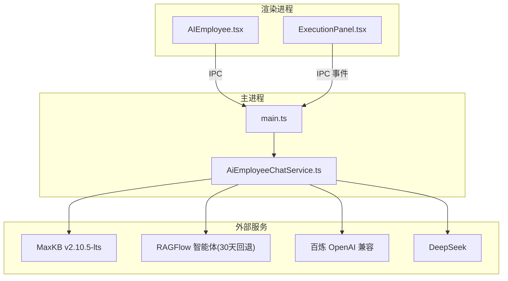
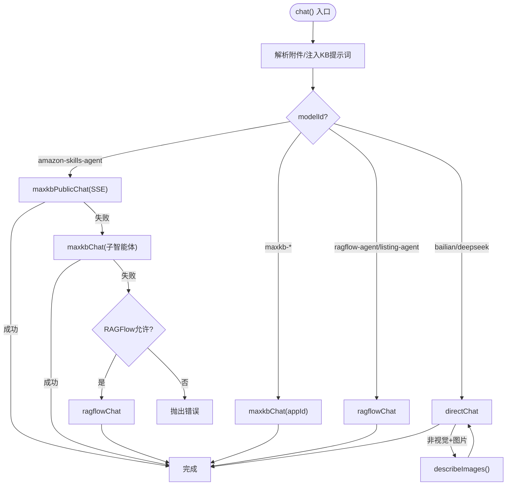
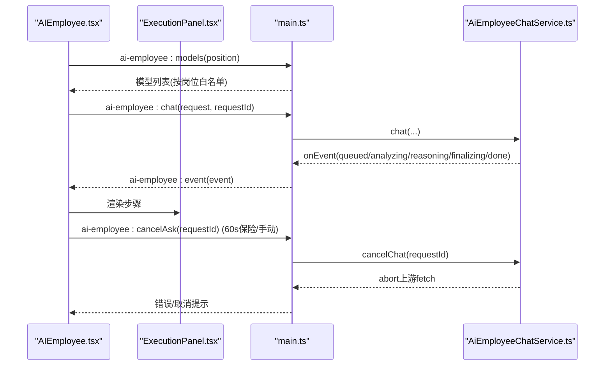
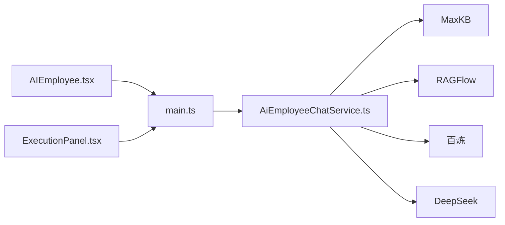

# AI员工聊天服务增强

<cite>
**本文引用的文件**
- [AiEmployeeChatService.ts](file://src/main/services/AiEmployeeChatService.ts)
- [AIEmployee.tsx](file://src/renderer/AIEmployee.tsx)
- [aiEmployee.ts](file://src/shared/aiEmployee.ts)
- [ExecutionPanel.tsx](file://src/renderer/ExecutionPanel.tsx)
- [main.ts](file://src/main/main.ts)
- [package.json](file://package.json)
- [README.md](file://README.md)
</cite>

## 目录
1. [简介](#简介)
2. [项目结构](#项目结构)
3. [核心组件](#核心组件)
4. [架构总览](#架构总览)
5. [详细组件分析](#详细组件分析)
6. [依赖关系分析](#依赖关系分析)
7. [性能考量](#性能考量)
8. [故障排查指南](#故障排查指南)
9. [结论](#结论)
10. [附录](#附录)

## 简介
本项目为“砚都跨境”桌面端应用，围绕“AI员工聊天服务”提供选品、Listing精造、知识库守卫等岗位的智能体对话能力。主进程通过统一的聊天服务路由到多种后端：MaxKB 智体（多 application）、RAGFlow 智能体（30天兼容回退）、以及直连模型（百炼/DeepSeek）。渲染端提供会话历史、附件上传、执行步骤可视化、取消请求与兜底报告生成等能力。整体设计强调可观测性（事件流）、可中断性（AbortController）、可回退（多通道降级）与可导出（Word/PDF/Markdown）。

## 项目结构
- 主进程（Electron main）
  - 入口与 IPC 桥接：[main.ts](file://src/main/main.ts)
  - 聊天服务：[AiEmployeeChatService.ts](file://src/main/services/AiEmployeeChatService.ts)
  - 其他服务：图像、翻译、eBay、飞书机器人、知识库守卫等
- 渲染进程（React UI）
  - AI员工工作台与Hub：[AIEmployee.tsx](file://src/renderer/AIEmployee.tsx)、[AIEmployeeHub.tsx](file://src/renderer/AIEmployeeHub.tsx)
  - 执行步骤面板：[ExecutionPanel.tsx](file://src/renderer/ExecutionPanel.tsx)
- 共享类型与契约
  - 聊天请求/响应/附件/模型配置：[aiEmployee.ts](file://src/shared/aiEmployee.ts)
- 构建与运行
  - 脚本与打包：[package.json](file://package.json)
  - 开发说明：[README.md](file://README.md)



图表来源
- [main.ts:106-119](file://src/main/main.ts#L106-L119)
- [AiEmployeeChatService.ts:21-48](file://src/main/services/AiEmployeeChatService.ts#L21-L48)

章节来源
- [main.ts:1-120](file://src/main/main.ts#L1-L120)
- [package.json:1-53](file://package.json#L1-L53)
- [README.md:1-44](file://README.md#L1-L44)

## 核心组件
- 聊天服务（主进程）
  - 统一入口 chat()：解析图片/文档、注入样例库提示词、路由到不同后端、支持超时与取消、事件上报。
  - 多通道路由：Amazon-Skills 父智能体 → Amazon-Skills 子智能体 → RAGFlow 30天窗；MaxKB 多 application；直连模型（百炼/DeepSeek）。
  - 附件处理：图片压缩/白底合成、文档文本提取与截断、总量预算控制。
  - 视觉转文字：对不支持视觉的模型，先调用百炼视觉模型将图片转为中文描述再并入上下文。
  - 差异化/合规证据提炼：优先 DeepSeek，失败回退通义千问，输出结构化 JSON 并裁剪长度。
- 渲染端（React）
  - 会话管理：历史持久化、平台快捷选择、附件选择、模型选择（按岗位白名单过滤）。
  - 执行步骤面板：订阅事件流，展示 queued/analyzing/reasoning/finalizing/done 五类步骤，自动展开/折叠。
  - 取消与超时：60s 保险重置 UI 并主动 cancelAsk；支持用户手动取消。
  - 兜底报告：当主模型或修正模型失败时，基于已抓取事实拼装预备报告。
- 共享类型
  - AiEmployeeAttachment、AiEmployeeAskRequest、AiEmployeeChatModelProfile、AiEmployeePickResult 等。

章节来源
- [AiEmployeeChatService.ts:189-518](file://src/main/services/AiEmployeeChatService.ts#L189-L518)
- [AIEmployee.tsx:358-668](file://src/renderer/AIEmployee.tsx#L358-L668)
- [aiEmployee.ts:1-41](file://src/shared/aiEmployee.ts#L1-L41)
- [ExecutionPanel.tsx:1-182](file://src/renderer/ExecutionPanel.tsx#L1-L182)

## 架构总览
聊天请求从渲染端发起，经 IPC 进入主进程的 AiEmployeeChatService.chat()，根据 modelId 与可用环境进行路由：
- 默认/Amazon-Skills：优先走 MaxKB 公共频道（access_token + SSE），失败回退到子智能体或直接走 RAGFlow 30天窗。
- MaxKB 多 application：按 appId 路由到对应智能体。
- 直连模型：百炼/DeepSeek OpenAI 兼容接口；若目标模型不支持视觉，则先调用百炼视觉模型转描述。
所有路径均支持 AbortSignal 取消与超时保护，并通过 ExecutionEvent 向渲染端推送进度。

```mermaid
sequenceDiagram
participant UI as "渲染端 AIEmployee.tsx"
participant Main as "主进程 main.ts"
participant Svc as "AiEmployeeChatService.ts"
participant KB as "MaxKB"
participant RF as "RAGFlow"
participant BL as "百炼"
participant DS as "DeepSeek"
UI->>Main : ai-employee : chat(request, requestId)
Main->>Svc : chat(request, options)
Svc->>Svc : 解析附件/注入KB提示词
alt 默认/Amazon-Skills
Svc->>KB : maxkbPublicChat(SSE)
alt 失败
Svc->>KB : maxkbChat(子智能体)
alt 失败且允许回退
Svc->>RF : ragflowChat
end
end
else MaxKB application
Svc->>KB : maxkbChat(appId)
else 直连模型
opt 非视觉模型+有图片
Svc->>BL : describeImages()
end
Svc->>BL : directChat(bailian)
or
Svc->>DS : directChat(deepseek)
end
Svc-->>Main : {ok,content}
Main-->>UI : 返回结果/事件
```

图表来源
- [AiEmployeeChatService.ts:366-518](file://src/main/services/AiEmployeeChatService.ts#L366-L518)
- [AiEmployeeChatService.ts:524-638](file://src/main/services/AiEmployeeChatService.ts#L524-L638)
- [AiEmployeeChatService.ts:641-676](file://src/main/services/AiEmployeeChatService.ts#L641-L676)
- [AiEmployeeChatService.ts:679-739](file://src/main/services/AiEmployeeChatService.ts#L679-L739)

## 详细组件分析

### 聊天服务（AiEmployeeChatService）
- 路由策略
  - 默认/Amazon-Skills：优先公共频道（SSE），失败回退子智能体，再失败走 RAGFlow 30天窗。
  - MaxKB application：按 appId 路由到 sourcing/listing/guardian/default。
  - 直连模型：bailian/deepseek；非视觉模型+图片时先视觉转文字。
- 附件处理
  - 图片：限制数量/大小，长边缩放，透明通道合成白底后编码 JPEG。
  - 文档：pdf/docx/txt/md 文本提取，单文件字符上限与全局文本预算控制。
- 事件与取消
  - activeChats Map 跟踪 in-flight 请求，cancelChat 通过 AbortController 中止上游 fetch。
  - 对外暴露 onEvent 事件流，供 ExecutionPanel 渲染步骤。
- 差异化/合规推断
  - 构建严格提示词，调用 deepseek-chat 优先，失败回退 qwen3.6-flash；JSON 清洗与长度裁剪。



图表来源
- [AiEmployeeChatService.ts:366-518](file://src/main/services/AiEmployeeChatService.ts#L366-L518)
- [AiEmployeeChatService.ts:524-638](file://src/main/services/AiEmployeeChatService.ts#L524-L638)
- [AiEmployeeChatService.ts:641-676](file://src/main/services/AiEmployeeChatService.ts#L641-L676)
- [AiEmployeeChatService.ts:679-739](file://src/main/services/AiEmployeeChatService.ts#L679-L739)

章节来源
- [AiEmployeeChatService.ts:189-878](file://src/main/services/AiEmployeeChatService.ts#L189-L878)

### 渲染端（AIEmployee.tsx）
- 会话与历史
  - 本地存储历史消息与提取状态，支持恢复与迁移旧格式。
  - 岗位固定角色与默认模型，按岗位白名单加载可用模型列表。
- 附件与模型选择
  - 调用主进程 pickAttachments()，限制图片/文档数量与大小。
  - 模型选择持久化到 localStorage，支持一键切换。
- 执行步骤与取消
  - 订阅 onEvent，使用 ExecutionPanel 展示步骤；60s 保险重置 UI 并 cancelAsk。
- 兜底报告
  - 当主模型与修正模型失败时，基于已锁定商品与抓取样本生成预备报告，明确未知项。



图表来源
- [AIEmployee.tsx:539-668](file://src/renderer/AIEmployee.tsx#L539-L668)
- [ExecutionPanel.tsx:67-108](file://src/renderer/ExecutionPanel.tsx#L67-L108)
- [AiEmployeeChatService.ts:190-201](file://src/main/services/AiEmployeeChatService.ts#L190-L201)

章节来源
- [AIEmployee.tsx:358-800](file://src/renderer/AIEmployee.tsx#L358-L800)
- [ExecutionPanel.tsx:1-182](file://src/renderer/ExecutionPanel.tsx#L1-L182)

### 共享类型（aiEmployee.ts）
- 定义附件、请求、模型配置与选择结果的类型契约，确保主进程与渲染端一致。
- 关键字段：
  - AiEmployeeAttachment：id/name/kind/mimeType/size/dataUrl/text/truncated
  - AiEmployeeAskRequest：agentId/modelId/query/history/attachments/useSampleLibrary/requestId
  - AiEmployeeChatModelProfile：id/name/hint/provider/supportsVision/available
  - AiEmployeePickResult：ok/attachments/message

章节来源
- [aiEmployee.ts:1-41](file://src/shared/aiEmployee.ts#L1-L41)

## 依赖关系分析
- 主进程依赖
  - Electron API：dialog、ipcMain、net、protocol 等用于对话框、IPC、网络与协议注册。
  - 第三方库：iconv-lite（编码转换）、pdf-parse（PDF文本）、mammoth（docx文本）、officeparser（Office解析）、react-markdown/remark-gfm（Markdown渲染）、word-extractor（Word解析）。
  - 环境变量：MAXKB_*、BAILIAN_*、DEEPSEEK_*、RAGFLOW_* 等控制路由与鉴权。
- 渲染进程依赖
  - React 生态：useState/useEffect/useCallback 等状态管理与副作用。
  - 本地存储：localStorage 保存历史、模型选择、开关偏好。
- 外部服务
  - MaxKB v2.10.5-lts CE：application 路由与公共频道 SSE。
  - RAGFlow：30天兼容回退通道。
  - 百炼/DeepSeek：OpenAI 兼容 chat/completions 接口。



图表来源
- [main.ts:106-119](file://src/main/main.ts#L106-L119)
- [AiEmployeeChatService.ts:21-48](file://src/main/services/AiEmployeeChatService.ts#L21-L48)

章节来源
- [package.json:22-37](file://package.json#L22-L37)
- [main.ts:211-270](file://src/main/main.ts#L211-L270)

## 性能考量
- 超时与取消
  - 各通道设置独立超时（聊天240s、Listing360s、视觉60s、推理25s），结合 AbortController 实现快速释放资源。
  - 渲染端 60s 保险重置 UI 并主动 cancelAsk，避免按钮卡死与连接占用。
- 附件与文本预算
  - 图片最大边缩放、透明通道白底合成减少体积；文档文本截断与总量预算控制，避免上下文过大。
- 事件驱动
  - 通过 ExecutionEvent 逐步反馈，降低前端等待焦虑，提升感知性能。
- 回退链路
  - 多通道降级减少单点失败影响，提高整体可用性。

## 故障排查指南
- 无法获取模型列表
  - 检查 .env.local 中 MAXKB_*、BAILIAN_*、DEEPSEEK_*、RAGFLOW_* 是否配置正确。
  - 确认服务端地址与端口可达。
- 聊天请求失败
  - 查看 ExecutionPanel 的步骤标签与详情，定位卡在 analyzing/reasoning/finalizing 哪一步。
  - 若为 MaxKB 认证失败，检查 access_token/secret_key 与 applicationId 是否正确。
  - 若为直连模型失败，检查 API Key 与 Base URL。
- 附件处理异常
  - 图片格式/大小限制：仅支持 png/jpg/jpeg/webp，单张不超过 7MB，最多 4 张。
  - 文档格式/大小限制：pdf/docx/txt/md，单份不超过 20MB，最多 3 份；文本超过 12000 字符会截断。
- 取消无效
  - 确认 requestId 传递正确，主进程 activeChats 中存在对应控制器。
  - 若请求已完成，cancelAsk 不会命中但无副作用。

章节来源
- [AiEmployeeChatService.ts:242-342](file://src/main/services/AiEmployeeChatService.ts#L242-L342)
- [AiEmployeeChatService.ts:524-638](file://src/main/services/AiEmployeeChatService.ts#L524-L638)
- [AIEmployee.tsx:614-668](file://src/renderer/AIEmployee.tsx#L614-L668)

## 结论
本方案通过统一聊天服务与多通道路由，实现了跨 MaxKB、RAGFlow 与直连模型的弹性调度；借助事件流与取消机制，提升了可观测性与用户体验；通过附件预处理与文本预算控制，保障了稳定性与性能。未来可进一步扩展岗位白名单、优化回退策略与增强错误诊断信息。

## 附录
- 开发命令
  - 安装与启动：参考 README 中的 pnpm install/pnpm dev。
  - 生产构建与打包：pnpm build/pnpm dist。
- 环境变量
  - MAXKB_BASE_URL/MAXKB_*_TOKEN：MaxKB 服务地址与各 application 令牌。
  - BAILIAN_API_KEY/BAILIAN_BASE_URL/BAILIAN_VISION_MODEL：百炼模型与视觉模型配置。
  - DEEPSEEK_API_KEY/DEEPSEEK_BASE_URL：DeepSeek 模型配置。
  - RAGFLOW_API_KEY/RAGFLOW_FALLBACK_ENABLED：RAGFlow 回退开关与密钥。

章节来源
- [README.md:7-23](file://README.md#L7-L23)
- [AiEmployeeChatService.ts:52-79](file://src/main/services/AiEmployeeChatService.ts#L52-L79)