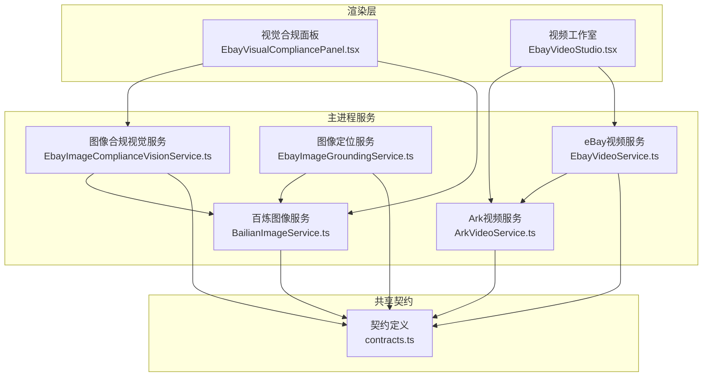
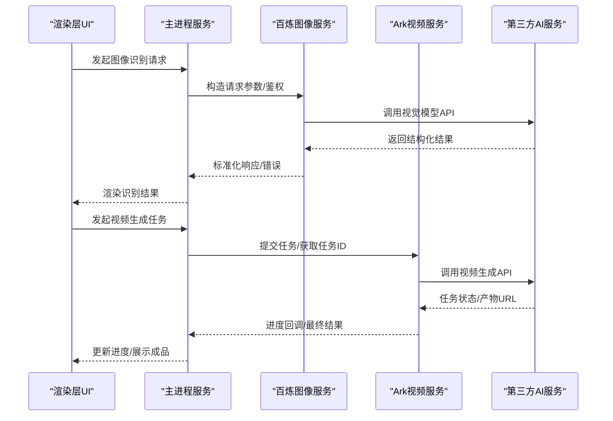
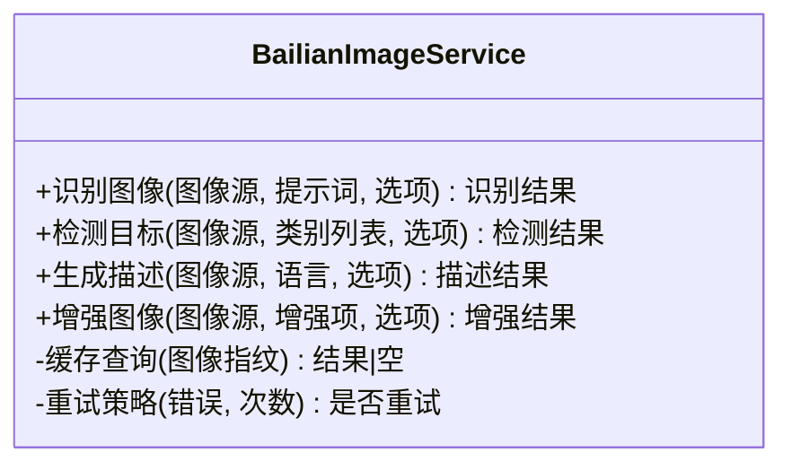
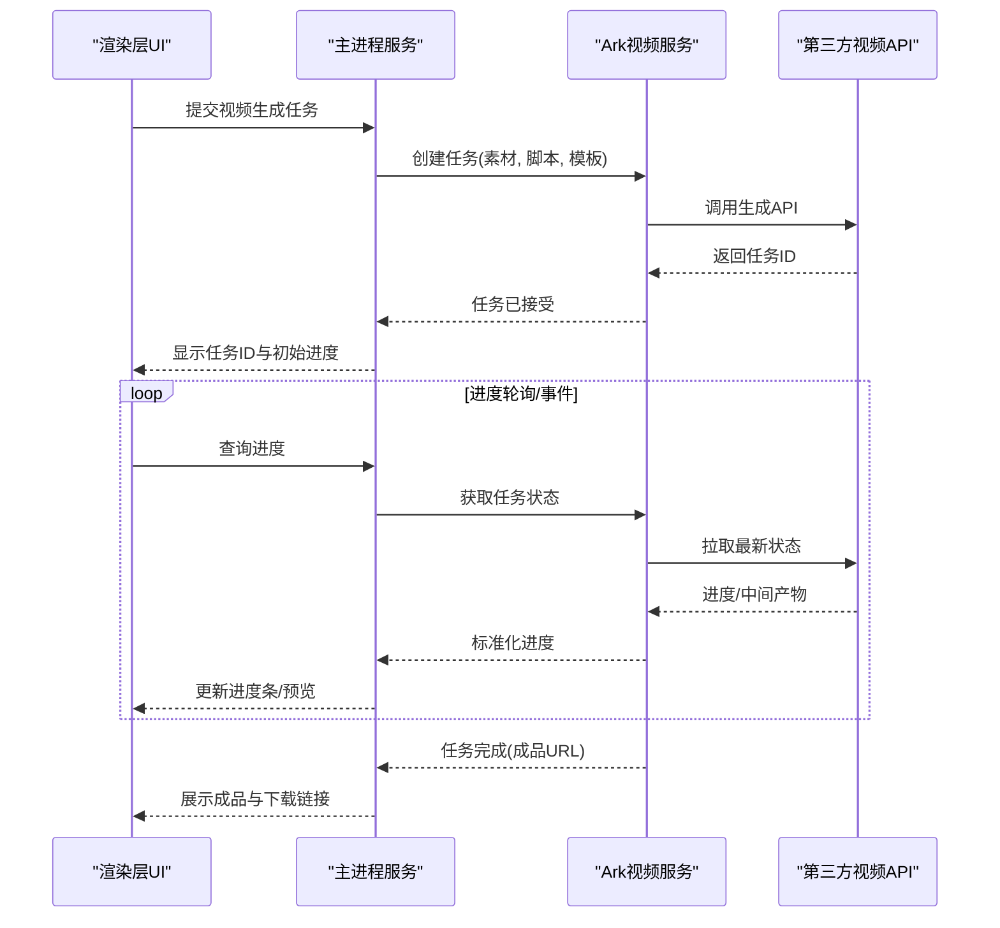
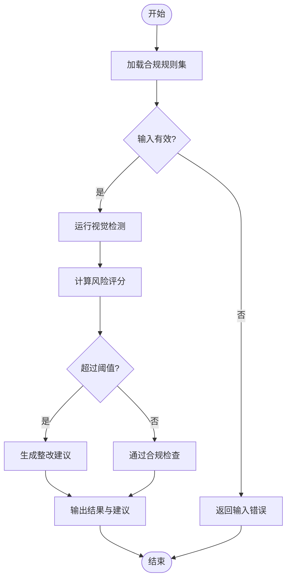
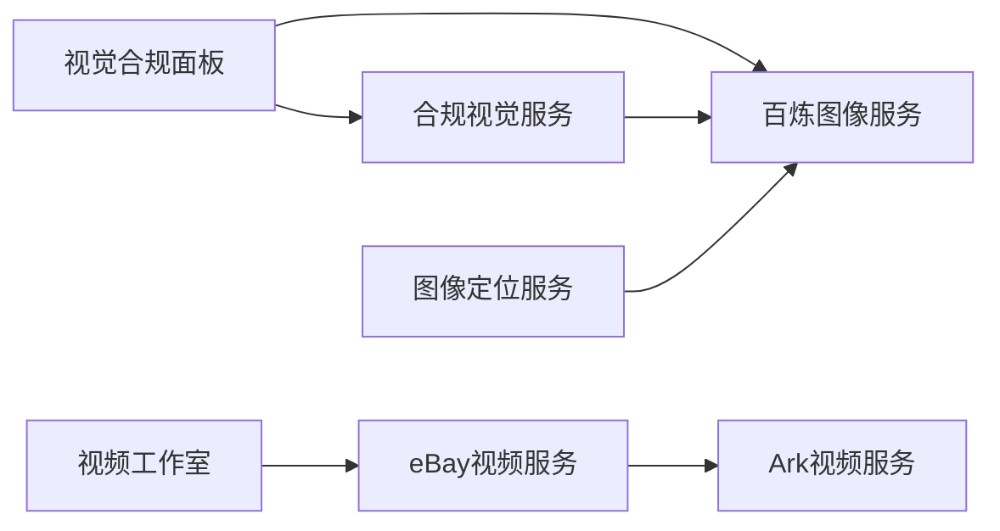

# AI视觉服务

<cite>
**本文引用的文件**   
- [BailianImageService.ts](file://src/main/services/BailianImageService.ts)
- [ArkVideoService.ts](file://src/main/services/ArkVideoService.ts)
- [EbayImageComplianceVisionService.ts](file://src/main/services/EbayImageComplianceVisionService.ts)
- [EbayImageGroundingService.ts](file://src/main/services/EbayImageGroundingService.ts)
- [EbayVideoService.ts](file://src/main/services/EbayVideoService.ts)
- [EbayVisualCompliancePanel.tsx](file://src/renderer/EbayVisualCompliancePanel.tsx)
- [EbayVideoStudio.tsx](file://src/renderer/EbayVideoStudio.tsx)
- [contracts.ts](file://src/shared/contracts.ts)
</cite>

## 目录
1. [简介](#简介)
2. [项目结构](#项目结构)
3. [核心组件](#核心组件)
4. [架构总览](#架构总览)
5. [详细组件分析](#详细组件分析)
6. [依赖关系分析](#依赖关系分析)
7. [性能考虑](#性能考虑)
8. [故障排查指南](#故障排查指南)
9. [结论](#结论)
10. [附录](#附录)

## 简介
本模块聚焦于AI视觉能力，围绕“百炼图像服务”和“视频处理服务”构建，提供图像识别、内容审核、视觉标注与合规检查、以及视频生成与编辑等能力。文档面向开发者与产品使用者，既覆盖API调用方式、参数配置、响应格式与错误处理，也给出典型应用场景（如图像识别、视频编辑、内容审核）的集成思路与最佳实践，并解释与第三方AI服务的集成方式和性能优化策略。

## 项目结构
- 服务层（main/services）：封装对第三方AI能力的调用与业务编排，包括图像、视频、合规与标注等。
- 渲染层（renderer）：面向UI的交互入口，如视觉合规面板和视频工作室。
- 共享契约（shared）：定义跨进程的数据结构与接口契约，确保主进程与服务、渲染层之间的数据一致性。

图表来源
- [BailianImageService.ts](file://src/main/services/BailianImageService.ts)
- [ArkVideoService.ts](file://src/main/services/ArkVideoService.ts)
- [EbayImageComplianceVisionService.ts](file://src/main/services/EbayImageComplianceVisionService.ts)
- [EbayImageGroundingService.ts](file://src/main/services/EbayImageGroundingService.ts)
- [EbayVideoService.ts](file://src/main/services/EbayVideoService.ts)
- [EbayVisualCompliancePanel.tsx](file://src/renderer/EbayVisualCompliancePanel.tsx)
- [EbayVideoStudio.tsx](file://src/renderer/EbayVideoStudio.tsx)
- [contracts.ts](file://src/shared/contracts.ts)

章节来源
- [BailianImageService.ts](file://src/main/services/BailianImageService.ts)
- [ArkVideoService.ts](file://src/main/services/ArkVideoService.ts)
- [EbayImageComplianceVisionService.ts](file://src/main/services/EbayImageComplianceVisionService.ts)
- [EbayImageGroundingService.ts](file://src/main/services/EbayImageGroundingService.ts)
- [EbayVideoService.ts](file://src/main/services/EbayVideoService.ts)
- [EbayVisualCompliancePanel.tsx](file://src/renderer/EbayVisualCompliancePanel.tsx)
- [EbayVideoStudio.tsx](file://src/renderer/EbayVideoStudio.tsx)
- [contracts.ts](file://src/shared/contracts.ts)

## 核心组件
- 百炼图像服务：统一封装图像识别、检测、描述、增强等能力，对外暴露一致的请求/响应模型与错误语义。
- Ark视频服务：封装视频生成、转码、剪辑、合成等能力，支持异步任务与进度回调。
- eBay图像合规视觉服务：基于图像识别结果进行合规判定与规则校验，输出审核意见与整改建议。
- eBay图像定位服务：在图像中定位关键区域或元素，返回边界框与置信度，支撑后续编辑与审核。
- eBay视频服务：面向电商场景的视频制作流水线，整合素材、模板、文案与AI生成能力。

章节来源
- [BailianImageService.ts](file://src/main/services/BailianImageService.ts)
- [ArkVideoService.ts](file://src/main/services/ArkVideoService.ts)
- [EbayImageComplianceVisionService.ts](file://src/main/services/EbayImageComplianceVisionService.ts)
- [EbayImageGroundingService.ts](file://src/main/services/EbayImageGroundingService.ts)
- [EbayVideoService.ts](file://src/main/services/EbayVideoService.ts)

## 架构总览
整体采用“渲染层 -> 主进程服务 -> 第三方AI服务”的分层架构。渲染层负责用户交互与状态管理；主进程服务负责协议适配、鉴权、重试、缓存与错误归一化；第三方AI服务提供具体的视觉与视频能力。共享契约保证数据结构的一致性。

图表来源
- [BailianImageService.ts](file://src/main/services/BailianImageService.ts)
- [ArkVideoService.ts](file://src/main/services/ArkVideoService.ts)
- [EbayVisualCompliancePanel.tsx](file://src/renderer/EbayVisualCompliancePanel.tsx)
- [EbayVideoStudio.tsx](file://src/renderer/EbayVideoStudio.tsx)

## 详细组件分析

### 百炼图像服务（BailianImageService）
- 职责：统一封装图像识别、检测、描述、增强等能力，屏蔽第三方差异，提供稳定接口。
- 关键能力：
  - 图像识别：输入图像与可选提示词，返回标签、置信度、属性等。
  - 图像检测：返回目标边界框、类别与置信度。
  - 图像描述：生成自然语言描述，支持多语言。
  - 图像增强：尺寸调整、质量优化、背景替换等。
- API调用方式：
  - 请求参数：图像源（URL/二进制）、模型版本、任务类型、可选提示词、输出字段控制。
  - 响应格式：统一包装为成功/失败结构，包含任务ID、结果数据、元数据与错误信息。
  - 错误处理：网络异常、鉴权失败、配额限制、模型不可用等，均映射为标准错误码与消息。
- 性能优化：
  - 请求去重与结果缓存（按图像指纹）。
  - 批量请求合并与并发限流。
  - 图片预处理（压缩、缩放）减少传输与推理开销。
- 使用示例路径：
  - 图像识别：[BailianImageService.ts](file://src/main/services/BailianImageService.ts)
  - 图像检测：[BailianImageService.ts](file://src/main/services/BailianImageService.ts)
  - 图像描述：[BailianImageService.ts](file://src/main/services/BailianImageService.ts)
  - 图像增强：[BailianImageService.ts](file://src/main/services/BailianImageService.ts)

图表来源
- [BailianImageService.ts](file://src/main/services/BailianImageService.ts)

章节来源
- [BailianImageService.ts](file://src/main/services/BailianImageService.ts)

### Ark视频服务（ArkVideoService）
- 职责：封装视频生成、转码、剪辑、合成等能力，支持异步任务与进度回调。
- 关键能力：
  - 视频生成：根据脚本、素材、模板生成短视频。
  - 视频编辑：裁剪、拼接、字幕、转场、滤镜。
  - 转码与导出：多分辨率、多格式输出。
- API调用方式：
  - 任务提交：输入素材清单、脚本、模板、样式参数，返回任务ID。
  - 进度查询：通过任务ID轮询或订阅事件获取进度与中间产物。
  - 结果获取：任务完成后返回成品URL与元数据。
  - 错误处理：任务失败、超时、资源不足等，提供可恢复策略。
- 性能优化：
  - 分片上传与断点续传。
  - 并行转码与GPU加速（若可用）。
  - 任务队列与优先级调度。
- 使用示例路径：
  - 视频生成：[ArkVideoService.ts](file://src/main/services/ArkVideoService.ts)
  - 视频编辑：[ArkVideoService.ts](file://src/main/services/ArkVideoService.ts)
  - 转码导出：[ArkVideoService.ts](file://src/main/services/ArkVideoService.ts)

图表来源
- [ArkVideoService.ts](file://src/main/services/ArkVideoService.ts)
- [EbayVideoStudio.tsx](file://src/renderer/EbayVideoStudio.tsx)

章节来源
- [ArkVideoService.ts](file://src/main/services/ArkVideoService.ts)
- [EbayVideoStudio.tsx](file://src/renderer/EbayVideoStudio.tsx)

### eBay图像合规视觉服务（EbayImageComplianceVisionService）
- 职责：基于图像识别结果执行合规规则校验，输出审核意见与整改建议。
- 关键能力：
  - 合规检测：品牌标识、敏感内容、尺寸比例、文字占比等。
  - 风险评分：综合多项指标计算风险等级。
  - 建议生成：针对不合规项给出修改建议与替代方案。
- API调用方式：
  - 输入：图像源、识别结果、规则集、阈值配置。
  - 输出：合规状态、风险分数、问题清单与建议。
  - 错误处理：规则加载失败、模型不可用、输入不合法等。
- 使用示例路径：
  - 合规检测：[EbayImageComplianceVisionService.ts](file://src/main/services/EbayImageComplianceVisionService.ts)
  - 风险评分：[EbayImageComplianceVisionService.ts](file://src/main/services/EbayImageComplianceVisionService.ts)
  - 建议生成：[EbayImageComplianceVisionService.ts](file://src/main/services/EbayImageComplianceVisionService.ts)

图表来源
- [EbayImageComplianceVisionService.ts](file://src/main/services/EbayImageComplianceVisionService.ts)

章节来源
- [EbayImageComplianceVisionService.ts](file://src/main/services/EbayImageComplianceVisionService.ts)

### eBay图像定位服务（EbayImageGroundingService）
- 职责：在图像中定位关键区域或元素，返回边界框与置信度，支撑后续编辑与审核。
- 关键能力：
  - 目标定位：文本、Logo、商品主体等。
  - 区域裁剪：基于定位结果自动裁剪与构图优化。
  - 可视化标注：叠加边界框与标签用于调试与展示。
- API调用方式：
  - 输入：图像源、目标类别、精度要求。
  - 输出：定位结果（边界框、类别、置信度）、可视化标注图。
  - 错误处理：模型不可用、图像过大、类别不支持等。
- 使用示例路径：
  - 目标定位：[EbayImageGroundingService.ts](file://src/main/services/EbayImageGroundingService.ts)
  - 区域裁剪：[EbayImageGroundingService.ts](file://src/main/services/EbayImageGroundingService.ts)
  - 可视化标注：[EbayImageGroundingService.ts](file://src/main/services/EbayImageGroundingService.ts)

章节来源
- [EbayImageGroundingService.ts](file://src/main/services/EbayImageGroundingService.ts)

### eBay视频服务（EbayVideoService）
- 职责：面向电商场景的视频制作流水线，整合素材、模板、文案与AI生成能力。
- 关键能力：
  - 模板匹配：根据商品信息与风格选择合适模板。
  - 素材编排：自动拼接、转场、字幕与背景音乐。
  - 文案生成：结合商品标题与卖点生成旁白或字幕。
- API调用方式：
  - 输入：商品信息、模板ID、素材清单、文案参数。
  - 输出：视频成品URL、元数据、版本历史。
  - 错误处理：模板缺失、素材不兼容、生成失败等。
- 使用示例路径：
  - 模板匹配：[EbayVideoService.ts](file://src/main/services/EbayVideoService.ts)
  - 素材编排：[EbayVideoService.ts](file://src/main/services/EbayVideoService.ts)
  - 文案生成：[EbayVideoService.ts](file://src/main/services/EbayVideoService.ts)

章节来源
- [EbayVideoService.ts](file://src/main/services/EbayVideoService.ts)

### 渲染层集成（EbayVisualCompliancePanel.tsx / EbayVideoStudio.tsx）
- 视觉合规面板：
  - 功能：上传图像、触发识别与合规检测、展示结果与建议。
  - 交互：实时反馈、错误提示、重试与导出报告。
  - 集成点：调用合规视觉服务与百炼图像服务。
- 视频工作室：
  - 功能：选择模板、上传素材、生成与编辑视频、预览与下载。
  - 交互：进度条、步骤导航、错误恢复。
  - 集成点：调用Ark视频服务与eBay视频服务。

章节来源
- [EbayVisualCompliancePanel.tsx](file://src/renderer/EbayVisualCompliancePanel.tsx)
- [EbayVideoStudio.tsx](file://src/renderer/EbayVideoStudio.tsx)

## 依赖关系分析
- 组件耦合：
  - 渲染层依赖主进程服务，服务之间通过共享契约解耦。
  - 百炼图像服务被合规与定位服务复用，形成能力中心。
  - 视频服务组合Ark与eBay视频能力，形成流水线。
- 外部依赖：
  - 第三方AI服务（图像与视频模型），需处理鉴权、限流与降级。
- 潜在循环依赖：
  - 通过契约与接口隔离避免循环引用。

图表来源
- [EbayVisualCompliancePanel.tsx](file://src/renderer/EbayVisualCompliancePanel.tsx)
- [EbayVideoStudio.tsx](file://src/renderer/EbayVideoStudio.tsx)
- [EbayImageComplianceVisionService.ts](file://src/main/services/EbayImageComplianceVisionService.ts)
- [EbayImageGroundingService.ts](file://src/main/services/EbayImageGroundingService.ts)
- [EbayVideoService.ts](file://src/main/services/EbayVideoService.ts)
- [ArkVideoService.ts](file://src/main/services/ArkVideoService.ts)
- [BailianImageService.ts](file://src/main/services/BailianImageService.ts)

章节来源
- [EbayVisualCompliancePanel.tsx](file://src/renderer/EbayVisualCompliancePanel.tsx)
- [EbayVideoStudio.tsx](file://src/renderer/EbayVideoStudio.tsx)
- [EbayImageComplianceVisionService.ts](file://src/main/services/EbayImageComplianceVisionService.ts)
- [EbayImageGroundingService.ts](file://src/main/services/EbayImageGroundingService.ts)
- [EbayVideoService.ts](file://src/main/services/EbayVideoService.ts)
- [ArkVideoService.ts](file://src/main/services/ArkVideoService.ts)
- [BailianImageService.ts](file://src/main/services/BailianImageService.ts)

## 性能考虑
- 图像服务：
  - 预压缩与缩放，减少带宽与推理时间。
  - 结果缓存与去重，提升重复请求命中率。
  - 并发控制与队列管理，避免过载。
- 视频服务：
  - 分片上传与断点续传，提高稳定性。
  - 并行转码与GPU加速，缩短生成时间。
  - 任务优先级与资源隔离，保障关键任务。
- 通用优化：
  - 错误快速失败与重试退避。
  - 监控与指标采集，定位瓶颈。
  - 降级策略，当第三方不可用时回退本地规则或模板。

## 故障排查指南
- 常见问题：
  - 鉴权失败：检查密钥与权限范围。
  - 配额限制：降低并发或申请扩容。
  - 模型不可用：切换备用模型或启用降级。
  - 输入不合法：校验图像格式、大小与字段。
- 诊断步骤：
  - 查看任务ID与日志，定位失败阶段。
  - 复现最小用例，验证输入与参数。
  - 启用调试模式，输出中间结果与耗时。
- 恢复策略：
  - 重试与退避，避免雪崩。
  - 切换上游服务或路由到备用通道。
  - 记录错误上下文，便于后续分析。

章节来源
- [BailianImageService.ts](file://src/main/services/BailianImageService.ts)
- [ArkVideoService.ts](file://src/main/services/ArkVideoService.ts)
- [EbayImageComplianceVisionService.ts](file://src/main/services/EbayImageComplianceVisionService.ts)
- [EbayImageGroundingService.ts](file://src/main/services/EbayImageGroundingService.ts)
- [EbayVideoService.ts](file://src/main/services/EbayVideoService.ts)

## 结论
本模块以统一的图像与视频服务能力为核心，结合电商场景的合规与制作需求，构建了可扩展、高性能的AI视觉服务。通过分层架构与共享契约，实现了清晰的职责划分与稳定的集成方式。建议在后续迭代中持续完善监控、降级与自动化测试，以提升系统可靠性与用户体验。

## 附录
- 典型应用场景参考路径：
  - 图像识别：[BailianImageService.ts](file://src/main/services/BailianImageService.ts)
  - 视频生成：[ArkVideoService.ts](file://src/main/services/ArkVideoService.ts)
  - 内容审核：[EbayImageComplianceVisionService.ts](file://src/main/services/EbayImageComplianceVisionService.ts)
  - 图像定位：[EbayImageGroundingService.ts](file://src/main/services/EbayImageGroundingService.ts)
  - 电商视频制作：[EbayVideoService.ts](file://src/main/services/EbayVideoService.ts)
- 共享契约参考：
  - 数据结构与接口定义：[contracts.ts](file://src/shared/contracts.ts)