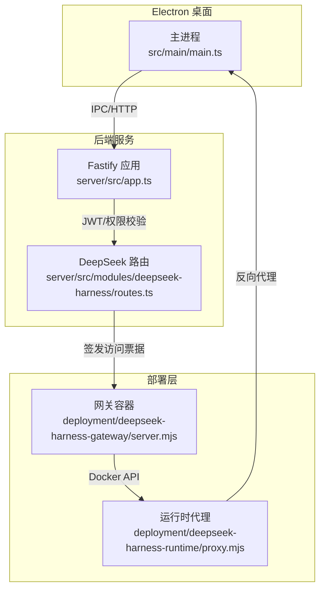
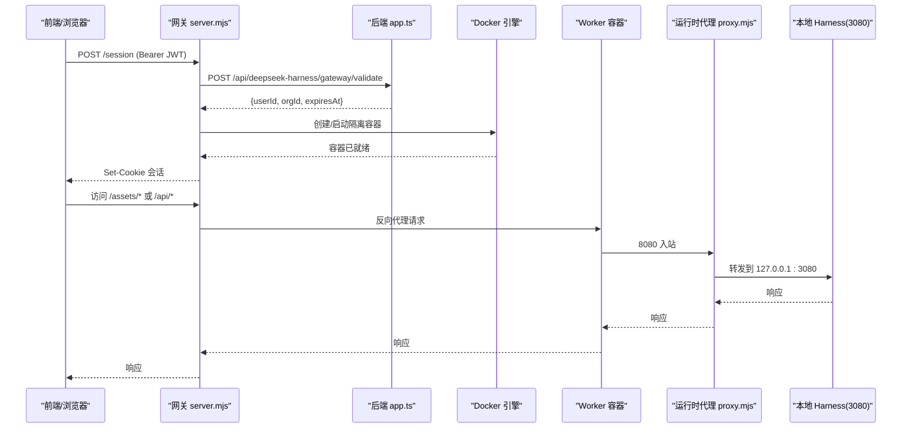
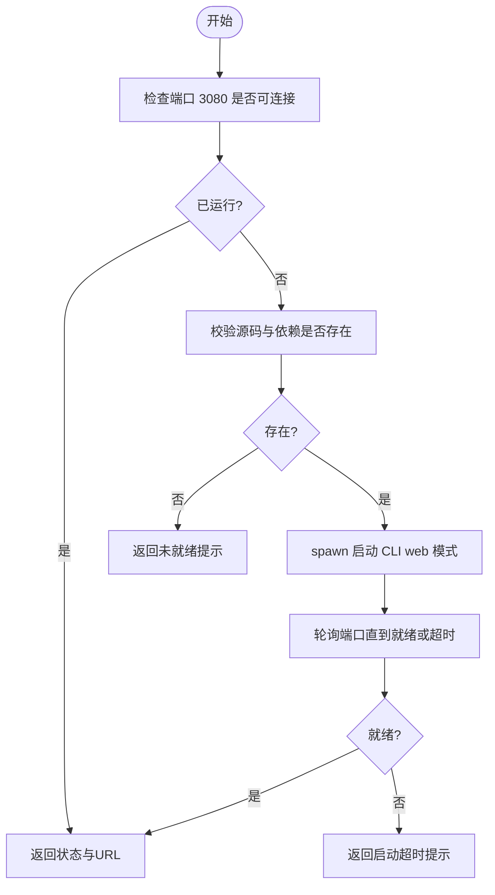
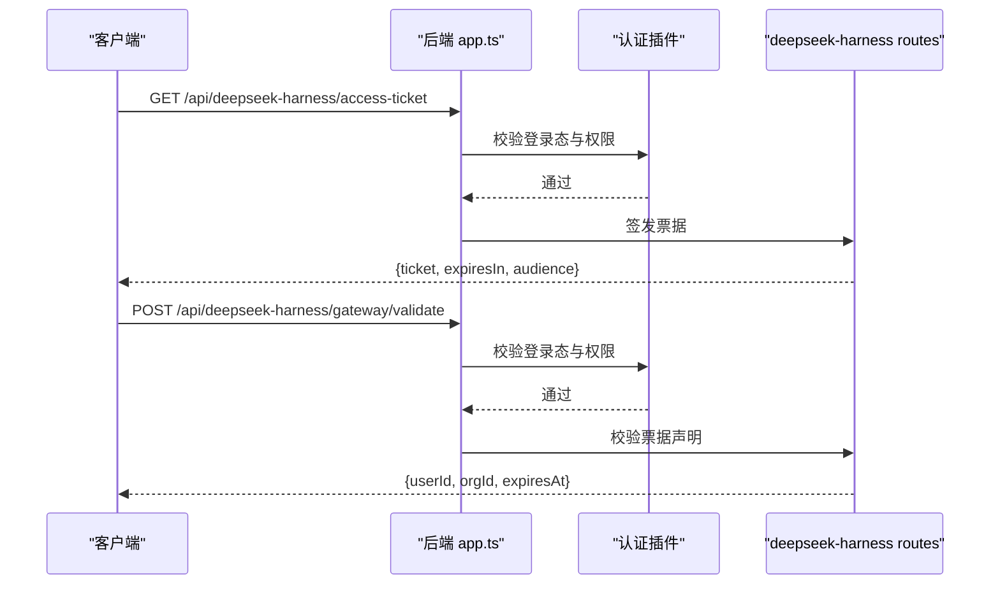
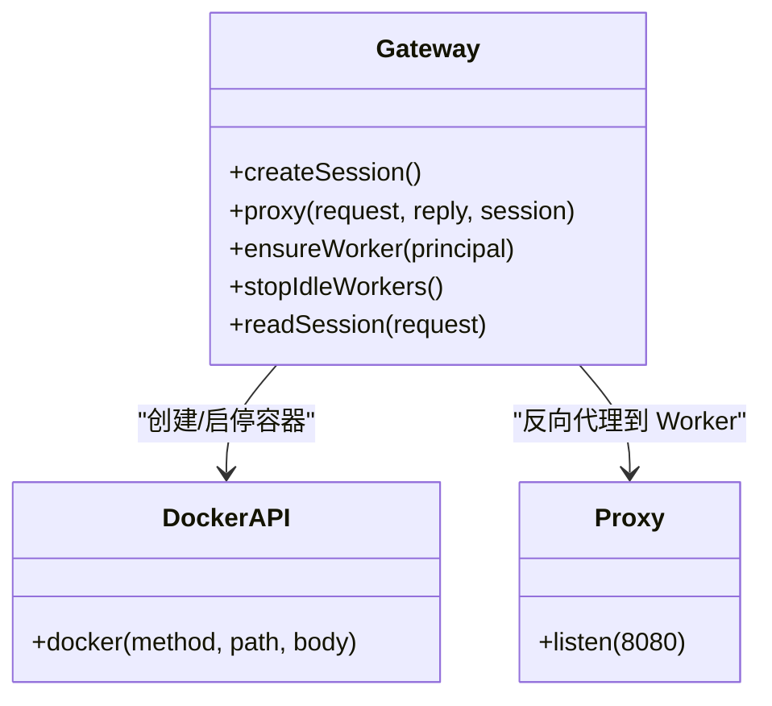
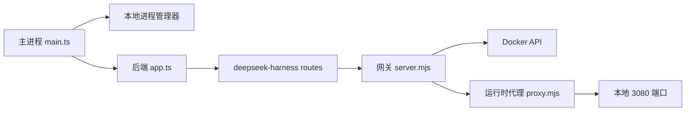

# DeepSeek Codex 集成架构

<cite>
**本文引用的文件**
- [package.json](file://package.json)
- [src/main/main.ts](file://src/main/main.ts)
- [server/src/app.ts](file://server/src/app.ts)
- [server/src/modules/deepseek-harness/routes.ts](file://server/src/modules/deepseek-harness/routes.ts)
- [deployment/deepseek-harness-gateway/server.mjs](file://deployment/deepseek-harness-gateway/server.mjs)
- [deployment/deepseek-harness-runtime/proxy.mjs](file://deployment/deepseek-harness-runtime/proxy.mjs)
- [deployment/deepseek-harness-gateway/Dockerfile](file://deployment/deepseek-harness-gateway/Dockerfile)
- [deployment/deepseek-harness-runtime/Dockerfile](file://deployment/deepseek-harness-runtime/Dockerfile)
- [scripts/build-deepseek-harness.sh](file://scripts/build-deepseek-harness.sh)
- [docs/integrations/deepseek-harness-stage1-integration.md](file://docs/integrations/deepseek-harness-stage1-integration.md)
- [docs/superpowers/plans/2026-08-23-deepseek-harness-merge-into-codex.md](file://docs/superpowers/plans/2026-08-23-deepseek-harness-merge-into-codex.md)
- [docs/superpowers/specs/2026-08-23-deepseek-harness-merge-into-codex-design.md](file://docs/superpowers/specs/2026-08-23-deepseek-harness-merge-into-codex-design.md)
</cite>

## 目录
1. [简介](#简介)
2. [项目结构](#项目结构)
3. [核心组件](#核心组件)
4. [架构总览](#架构总览)
5. [详细组件分析](#详细组件分析)
6. [依赖关系分析](#依赖关系分析)
7. [性能与资源特性](#性能与资源特性)
8. [故障排查指南](#故障排查指南)
9. [结论](#结论)
10. [附录](#附录)

## 简介
本仓库为“砚都跨境·跨境电商选品与素材工作台”的桌面应用与后端服务，同时集成了 DeepSeek Codex/Harness 能力。当前集成采用“服务端网关 + 隔离 Worker + 本地进程管理”的组合方式：
- Electron 主进程负责启动、管理与本地 Harness 进程（开发/单机场景）。
- 后端 Fastify 服务提供鉴权与会话票据签发，供远程网关使用。
- 部署层包含一个网关容器和一个运行时代理容器，用于在云端以隔离 Worker 执行 Harness 任务，并通过 Docker API 管理生命周期。
- 文档与脚本明确了源码引入、构建流程以及后续合并到 Codex 的计划。

该设计在保证安全隔离的前提下，将 DeepSeek 的 Web UI 与执行能力接入砚都工作流，并预留了从本地进程模式向云端网关模式的演进路径。

## 项目结构
- 桌面端入口与业务编排位于 `src/main`，其中包含大量服务桥接、数据持久化、浏览器工作区与第三方服务调用。
- 后端服务位于 `server`，基于 Fastify，模块化路由注册，统一错误处理与认证插件。
- 部署相关位于 `deployment`，包含网关与运行时的 Docker 镜像定义与启动脚本。
- 构建与集成脚本位于 `scripts`，包括独立构建 DeepSeek Harness 的脚本。
- 文档位于 `docs`，记录了阶段化集成计划与设计说明。

图表来源
- [src/main/main.ts:1-120](file://src/main/main.ts#L1-L120)
- [server/src/app.ts:21-70](file://server/src/app.ts#L21-L70)
- [server/src/modules/deepseek-harness/routes.ts:9-46](file://server/src/modules/deepseek-harness/routes.ts#L9-L46)
- [deployment/deepseek-harness-gateway/server.mjs:145-229](file://deployment/deepseek-harness-gateway/server.mjs#L145-L229)
- [deployment/deepseek-harness-runtime/proxy.mjs:1-17](file://deployment/deepseek-harness-runtime/proxy.mjs#L1-L17)

章节来源
- [package.json:1-49](file://package.json#L1-L49)
- [src/main/main.ts:1-120](file://src/main/main.ts#L1-L120)
- [server/src/app.ts:21-70](file://server/src/app.ts#L21-L70)

## 核心组件
- 主进程进程管理器：负责在本地启动/停止 DeepSeek Harness CLI Web 模式，监听端口健康检查，设置工作目录与环境变量。
- 后端路由：生成短期访问票据（JWT），并对网关验证请求进行权限与声明校验。
- 网关服务：维护会话、校验票据、按用户/组织创建隔离 Worker 容器、反向代理到官方 Web UI，支持 WebSocket 升级。
- 运行时代理：将外部 8080 端口流量转发至本地 3080 端口，使容器内进程可被网关调度。
- 构建脚本：在独立子目录安装依赖并构建 Harness，避免污染根项目依赖图。

章节来源
- [src/main/services/DeepSeekHarnessProcessManager.ts:1-62](file://src/main/services/DeepSeekHarnessProcessManager.ts#L1-L62)
- [server/src/modules/deepseek-harness/routes.ts:9-46](file://server/src/modules/deepseek-harness/routes.ts#L9-L46)
- [deployment/deepseek-harness-gateway/server.mjs:145-229](file://deployment/deepseek-harness-gateway/server.mjs#L145-L229)
- [deployment/deepseek-harness-runtime/proxy.mjs:1-17](file://deployment/deepseek-harness-runtime/proxy.mjs#L1-L17)
- [scripts/build-deepseek-harness.sh:1-40](file://scripts/build-deepseek-harness.sh#L1-L40)

## 架构总览
整体集成分为两条路径：
- 本地路径：Electron 主进程通过进程管理器直接启动官方 CLI 的 Web 模式，绑定本地端口，供前端或调试工具访问。
- 云端路径：浏览器通过网关建立会话，网关向主服务申请短期访问票据，校验通过后创建隔离 Worker 容器，并将请求反向代理到 Worker 的 Web 服务；Worker 内部通过代理将流量转发到本地 3080 端口。

图表来源
- [deployment/deepseek-harness-gateway/server.mjs:145-229](file://deployment/deepseek-harness-gateway/server.mjs#L145-L229)
- [server/src/modules/deepseek-harness/routes.ts:12-45](file://server/src/modules/deepseek-harness/routes.ts#L12-L45)
- [deployment/deepseek-harness-runtime/proxy.mjs:1-17](file://deployment/deepseek-harness-runtime/proxy.mjs#L1-L17)
- [src/main/services/DeepSeekHarnessProcessManager.ts:38-55](file://src/main/services/DeepSeekHarnessProcessManager.ts#L38-L55)

## 详细组件分析

### 本地进程管理（Electron 主进程）
- 功能要点
  - 检测本地端口连通性，判断 Harness 是否已启动。
  - 通过 spawn 启动官方 CLI 的 web 模式，指定 host/port，设置 DSH_HOME 指向用户数据目录。
  - 启动后轮询端口直至可用，超时返回失败信息。
  - 支持优雅停止进程。
- 关键实现位置
  - 端口探测与健康检查逻辑。
  - 进程启动参数与环境变量注入。
  - 进程生命周期管理。

图表来源
- [src/main/services/DeepSeekHarnessProcessManager.ts:14-55](file://src/main/services/DeepSeekHarnessProcessManager.ts#L14-L55)

章节来源
- [src/main/services/DeepSeekHarnessProcessManager.ts:1-62](file://src/main/services/DeepSeekHarnessProcessManager.ts#L1-L62)

### 后端鉴权与票据签发
- 功能要点
  - 注册 `/api/deepseek-harness` 路由前缀。
  - 提供 `/access-ticket` 接口签发短期 JWT，限定 audience、scope 与权限。
  - 提供 `/gateway/validate` 接口供网关校验票据有效性，并返回 userId/orgId/expiresAt。
- 安全要点
  - 仅接受具备特定权限的调用方。
  - 严格校验 aud、scope、permission 字段，防止伪造票据。

图表来源
- [server/src/app.ts:21-70](file://server/src/app.ts#L21-L70)
- [server/src/modules/deepseek-harness/routes.ts:9-46](file://server/src/modules/deepseek-harness/routes.ts#L9-L46)

章节来源
- [server/src/app.ts:21-70](file://server/src/app.ts#L21-L70)
- [server/src/modules/deepseek-harness/routes.ts:9-46](file://server/src/modules/deepseek-harness/routes.ts#L9-L46)

### 网关服务（云端隔离执行）
- 功能要点
  - 会话管理：基于 Cookie 签名与过期时间维护会话。
  - 票据校验：调用后端 `/gateway/validate` 获取用户身份与有效期。
  - Worker 管理：通过 Docker API 创建/启动隔离容器，设置只读根文件系统、限制 PID/内存/CPU、挂载命名卷隔离工作区与状态。
  - 反向代理：将静态资源与 API 请求转发到 Worker，必要时修改 Host/Origin 等头，确保上游信任边界。
  - WebSocket 升级：支持长连接与实时交互。
  - 空闲回收：定时停止长时间无活动的 Worker。
- 安全要点
  - 不暴露 JWT 密钥给网关。
  - 对 /assets 与 /plugins 静态资源放行，但页面与 API 必须经过会话校验。
  - 通过 x-yandu-user-id/x-yandu-org-id 传递可信身份标记。

图表来源
- [deployment/deepseek-harness-gateway/server.mjs:145-229](file://deployment/deepseek-harness-gateway/server.mjs#L145-L229)
- [deployment/deepseek-harness-runtime/proxy.mjs:1-17](file://deployment/deepseek-harness-runtime/proxy.mjs#L1-L17)

章节来源
- [deployment/deepseek-harness-gateway/server.mjs:1-264](file://deployment/deepseek-harness-gateway/server.mjs#L1-L264)
- [deployment/deepseek-harness-runtime/proxy.mjs:1-17](file://deployment/deepseek-harness-runtime/proxy.mjs#L1-L17)

### 构建与源码集成
- 构建脚本在独立子目录安装依赖并构建 Harness，避免与根项目的 React 版本冲突。
- 通过符号链接将 pnpm 解析到的 React/类型包链接到 Harness 的 node_modules，保证 TypeScript 正确解析。
- 忽略生成产物，避免污染提交。

章节来源
- [scripts/build-deepseek-harness.sh:1-40](file://scripts/build-deepseek-harness.sh#L1-L40)
- [docs/integrations/deepseek-harness-stage1-integration.md:1-47](file://docs/integrations/deepseek-harness-stage1-integration.md#L1-L47)

## 依赖关系分析
- 主进程依赖后端服务进行鉴权与票据签发，并在本地模式下直接管理 Harness 进程。
- 网关依赖后端服务的 `/gateway/validate` 进行票据校验，依赖 Docker API 管理 Worker 生命周期。
- 运行时代理作为轻量中间件，将容器外 8080 流量转发到容器内 3080 端口。
- 构建脚本与文档定义了源码引入与构建约束，确保依赖隔离与可追溯。

图表来源
- [src/main/main.ts:1-120](file://src/main/main.ts#L1-L120)
- [server/src/app.ts:21-70](file://server/src/app.ts#L21-L70)
- [server/src/modules/deepseek-harness/routes.ts:9-46](file://server/src/modules/deepseek-harness/routes.ts#L9-L46)
- [deployment/deepseek-harness-gateway/server.mjs:145-229](file://deployment/deepseek-harness-gateway/server.mjs#L145-L229)
- [deployment/deepseek-harness-runtime/proxy.mjs:1-17](file://deployment/deepseek-harness-runtime/proxy.mjs#L1-L17)

章节来源
- [src/main/main.ts:1-120](file://src/main/main.ts#L1-L120)
- [server/src/app.ts:21-70](file://server/src/app.ts#L21-L70)
- [deployment/deepseek-harness-gateway/server.mjs:145-229](file://deployment/deepseek-harness-gateway/server.mjs#L145-L229)

## 性能与资源特性
- 隔离执行：每个用户/组织拥有独立 Worker 容器，限制 CPU、内存、PID 数量，只读根文件系统，临时目录受限，降低横向风险与资源争用。
- 会话与空闲回收：网关维护活跃会话与最近访问时间，定期停止空闲 Worker，减少资源占用。
- 本地模式：Electron 主进程直接启动 CLI Web 模式，适合开发与单机调试，避免网络开销。
- 构建隔离：独立子目录构建 Harness，避免与根项目依赖冲突，提升构建稳定性。

[本节为通用性能讨论，不直接分析具体文件]

## 故障排查指南
- 本地 Harness 未启动
  - 现象：主进程返回“尚未启动”或“启动超时”。
  - 排查：确认源码与依赖已构建；检查端口 3080 是否被占用；查看主进程日志输出。
  - 参考：进程管理器启动与轮询逻辑。
- 网关无法创建 Worker
  - 现象：创建/启动容器失败或超时。
  - 排查：检查 Docker 引擎可达性；确认镜像名称与标签；核对环境变量（如 DEEPSEEK_API_KEY、DSH_PUBLIC_HOST、GATEWAY_SESSION_SECRET）；查看网关日志中的 worker 事件。
  - 参考：网关 ensureWorker 与 Docker API 调用。
- 票据校验失败
  - 现象：网关返回 401/403。
  - 排查：确认后端 JWT 密钥一致；检查票据的 aud、scope、permission；确认调用方具备所需权限。
  - 参考：后端路由校验逻辑。
- 静态资源可访问但 API 被拒绝
  - 现象：/assets 可访问，/api 返回未授权。
  - 排查：确认 Cookie 已设置且未过期；检查会话签名与过期时间；确认请求携带有效会话。
  - 参考：网关会话读取与代理逻辑。

章节来源
- [src/main/services/DeepSeekHarnessProcessManager.ts:33-55](file://src/main/services/DeepSeekHarnessProcessManager.ts#L33-L55)
- [deployment/deepseek-harness-gateway/server.mjs:145-229](file://deployment/deepseek-harness-gateway/server.mjs#L145-L229)
- [server/src/modules/deepseek-harness/routes.ts:12-45](file://server/src/modules/deepseek-harness/routes.ts#L12-L45)

## 结论
本项目通过“本地进程管理 + 后端鉴权 + 网关隔离执行”的分层架构，将 DeepSeek Codex/Harness 能力安全地集成到砚都工作台中。本地模式便于开发与调试，云端模式通过隔离 Worker 保障多租户安全与资源可控。构建脚本与文档确保了源码引入的可追溯性与构建稳定性。后续可按计划逐步合并到 Codex，进一步统一界面与工作流。

[本节为总结性内容，不直接分析具体文件]

## 附录
- 阶段化集成记录与验收标准，详见阶段 1 集成文档。
- 合并到 Codex 的设计与计划，详见设计文档与实施计划。

章节来源
- [docs/integrations/deepseek-harness-stage1-integration.md:1-47](file://docs/integrations/deepseek-harness-stage1-integration.md#L1-L47)
- [docs/superpowers/plans/2026-08-23-deepseek-harness-merge-into-codex.md:43-185](file://docs/superpowers/plans/2026-08-23-deepseek-harness-merge-into-codex.md#L43-L185)
- [docs/superpowers/specs/2026-08-23-deepseek-harness-merge-into-codex-design.md:44-75](file://docs/superpowers/specs/2026-08-23-deepseek-harness-merge-into-codex-design.md#L44-L75)