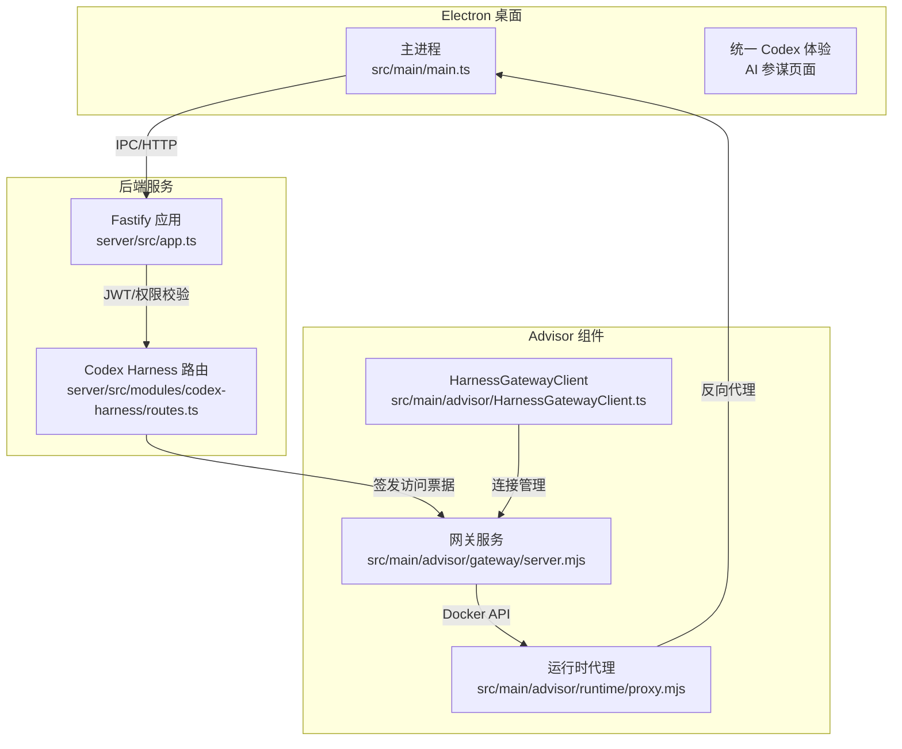
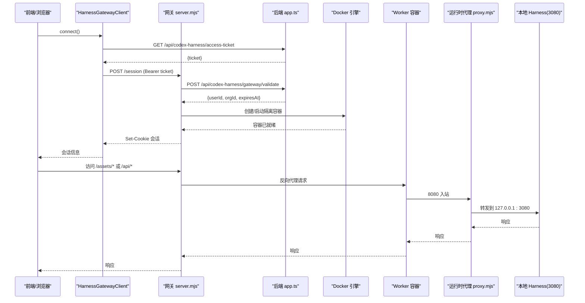
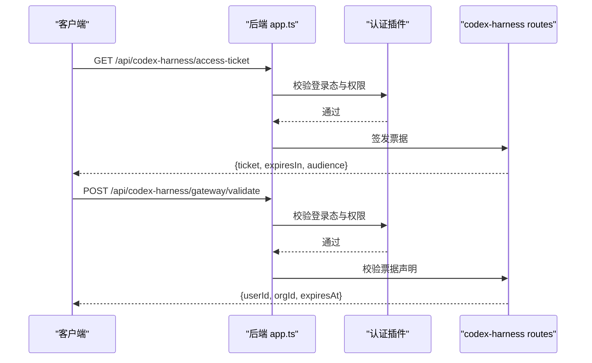
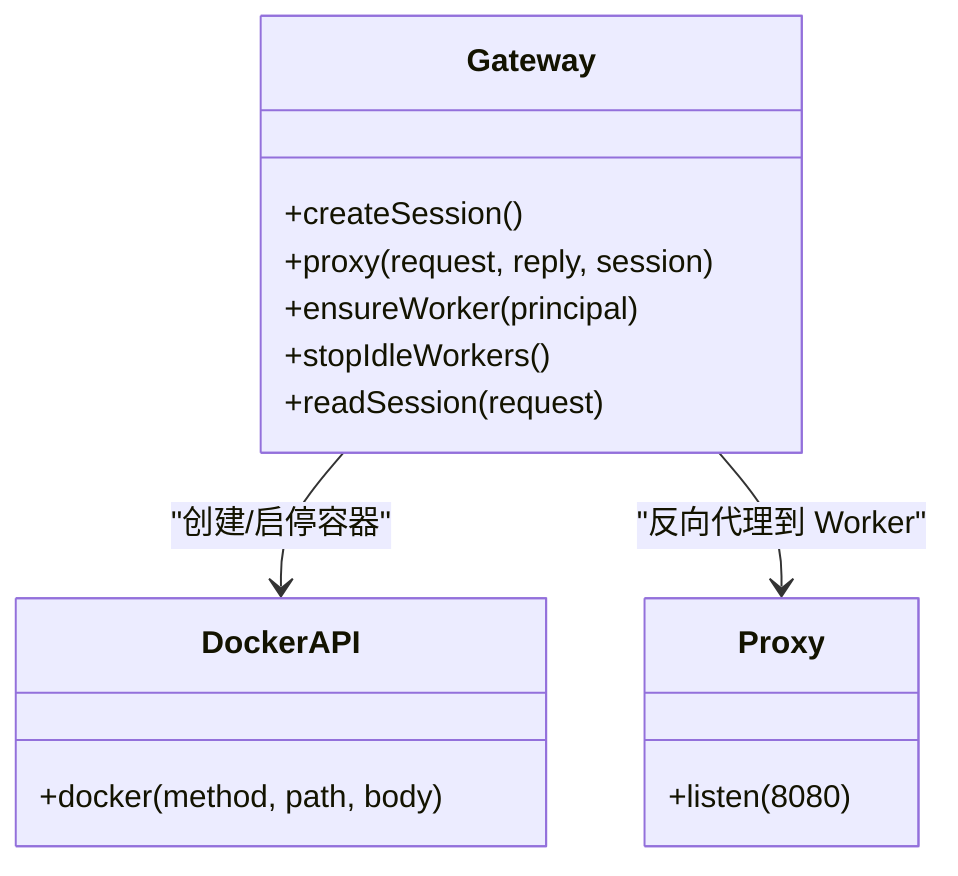
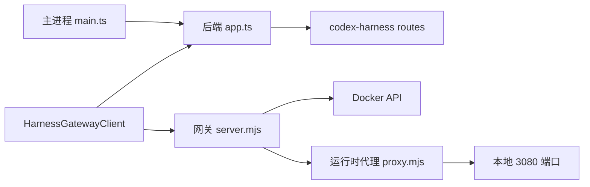

# DeepSeek Codex 集成架构

<cite>
**本文引用的文件**
- [package.json](file://package.json)
- [src/main/main.ts](file://src/main/main.ts)
- [server/src/app.ts](file://server/src/app.ts)
- [server/src/modules/codex-harness/routes.ts](file://server/src/modules/codex-harness/routes.ts)
- [src/main/advisor/HarnessGatewayClient.ts](file://src/main/advisor/HarnessGatewayClient.ts)
- [src/main/advisor/AdvisorRuntime.ts](file://src/main/advisor/AdvisorRuntime.ts)
- [src/main/advisor/gateway/server.mjs](file://src/main/advisor/gateway/server.mjs)
- [src/main/advisor/runtime/proxy.mjs](file://src/main/advisor/runtime/proxy.mjs)
- [src/main/advisor/runtime/entrypoint.sh](file://src/main/advisor/runtime/entrypoint.sh)
- [docs/integrations/deepseek-harness-stage1-integration.md](file://docs/integrations/deepseek-harness-stage1-integration.md)
- [docs/superpowers/plans/2026-08-23-deepseek-harness-merge-into-codex.md](file://docs/superpowers/plans/2026-08-23-deepseek-harness-merge-into-codex.md)
- [docs/superpowers/specs/2026-08-23-deepseek-harness-merge-into-codex-design.md](file://docs/superpowers/specs/2026-08-23-deepseek-harness-merge-into-codex-design.md)
</cite>

## 更新摘要
**变更内容**
- 完全移除了 vendor/deepseek-harness/ 目录（约 1.2GB 磁盘空间）及原始 DeepSeek Harness CLI web 模式进程管理器
- 删除了相关的 IPC 处理器和独立 Harness 组件，迁移到新的 codex-harness 架构
- 更新了后端路由从 deepseek-harness 迁移到 codex-harness
- 简化了部署结构，将网关和运行时代码迁移到 src/main/advisor/ 目录下
- 保留了隔离执行能力，但通过统一的 Codex 体验提供

## 目录
1. [简介](#简介)
2. [项目结构](#项目结构)
3. [核心组件](#核心组件)
4. [架构总览](#架构总览)
5. [详细组件分析](#详细组件分析)
6. [依赖关系分析](#依赖关系分析)
7. [性能与资源特性](#性能与资源特性)
8. [故障排查指南](#故障排查指南)
9. [结论](#结论)
10. [附录](#附录)

## 简介
本仓库为"砚都跨境·跨境电商选品与素材工作台"的桌面应用与后端服务。当前 DeepSeek 能力已完全整合到统一的 Codex 体验中，消除了独立的 Harness 功能模块。系统采用"服务端网关 + 隔离 Worker + 统一接入点"的组合方式：
- Electron 主进程通过统一的 AI 参谋页面提供单一的对话式 AI 体验。
- 后端 Fastify 服务提供鉴权与会话票据签发，供远程网关使用。
- 部署层包含网关容器和运行时代理容器，用于在云端以隔离 Worker 执行任务，并通过 Docker API 管理生命周期。
- 所有 AI 相关功能现在都通过统一的 Codex 界面访问，不再提供独立的 Harness 入口。

该设计在保证安全隔离的前提下，将 DeepSeek 的执行能力无缝集成到砚都工作流中，为用户提供一致的 AI 助手体验。

## 项目结构
- 桌面端入口与业务编排位于 `src/main`，其中包含大量服务桥接、数据持久化、浏览器工作区与第三方服务调用。
- 后端服务位于 `server`，基于 Fastify，模块化路由注册，统一错误处理与认证插件。
- 部署相关位于 `src/main/advisor/`，包含网关与运行时的源代码，替代了原来的 deployment 目录结构。
- 构建与集成脚本位于 `scripts`，包括独立构建 DeepSeek Harness 的脚本（保留作为历史参考）。
- 文档位于 `docs`，记录了阶段化集成计划与设计说明。

**图表来源**
- [src/main/main.ts:1-120](file://src/main/main.ts#L1-L120)
- [server/src/app.ts:21-70](file://server/src/app.ts#L21-L70)
- [server/src/modules/codex-harness/routes.ts:14-57](file://server/src/modules/codex-harness/routes.ts#L14-L57)
- [src/main/advisor/gateway/server.mjs:145-229](file://src/main/advisor/gateway/server.mjs#L145-L229)
- [src/main/advisor/runtime/proxy.mjs:1-17](file://src/main/advisor/runtime/proxy.mjs#L1-L17)
- [src/main/advisor/HarnessGatewayClient.ts:36-179](file://src/main/advisor/HarnessGatewayClient.ts#L36-L179)

**章节来源**
- [package.json:1-49](file://package.json#L1-L49)
- [src/main/main.ts:1-120](file://src/main/main.ts#L1-L120)
- [server/src/app.ts:21-70](file://server/src/app.ts#L21-L70)

## 核心组件
- 统一 AI 体验：通过 AI 参谋页面提供单一的对话式 AI 接口，不再区分 Codex 和 Harness。
- 后端路由：生成短期访问票据（JWT），并对网关验证请求进行权限与声明校验。
- 网关服务：维护会话、校验票据、按用户/组织创建隔离 Worker 容器、反向代理到官方 Web UI，支持 WebSocket 升级。
- 运行时代理：将外部 8080 端口流量转发至本地 3080 端口，使容器内进程可被网关调度。
- HarnessGatewayClient：主进程内的轻量代理，封装 harness gateway 连接，负责票据获取、会话管理和自动续约。

**章节来源**
- [server/src/modules/codex-harness/routes.ts:14-57](file://server/src/modules/codex-harness/routes.ts#L14-L57)
- [src/main/advisor/gateway/server.mjs:145-229](file://src/main/advisor/gateway/server.mjs#L145-L229)
- [src/main/advisor/runtime/proxy.mjs:1-17](file://src/main/advisor/runtime/proxy.mjs#L1-L17)
- [src/main/advisor/HarnessGatewayClient.ts:36-179](file://src/main/advisor/HarnessGatewayClient.ts#L36-L179)

## 架构总览
整体集成为统一模式：
- 统一路径：用户通过 AI 参谋页面访问所有 AI 功能，后端自动选择适当的执行环境。
- 云端路径：浏览器通过网关建立会话，网关向主服务申请短期访问票据，校验通过后创建隔离 Worker 容器，并将请求反向代理到 Worker 的 Web 服务；Worker 内部通过代理将流量转发到本地 3080 端口。

**图表来源**
- [src/main/advisor/HarnessGatewayClient.ts:63-123](file://src/main/advisor/HarnessGatewayClient.ts#L63-L123)
- [src/main/advisor/gateway/server.mjs:145-229](file://src/main/advisor/gateway/server.mjs#L145-L229)
- [server/src/modules/codex-harness/routes.ts:17-56](file://server/src/modules/codex-harness/routes.ts#L17-L56)
- [src/main/advisor/runtime/proxy.mjs:1-17](file://src/main/advisor/runtime/proxy.mjs#L1-L17)

## 详细组件分析

### 后端鉴权与票据签发
- 功能要点
  - 注册 `/api/codex-harness` 路由前缀。
  - 提供 `/access-ticket` 接口签发短期 JWT，限定 audience、scope 与权限。
  - 提供 `/gateway/validate` 接口供网关校验票据有效性，并返回 userId/orgId/expiresAt。
- 安全要点
  - 仅接受具备特定权限的调用方。
  - 严格校验 aud、scope、permission 字段，防止伪造票据。

**图表来源**
- [server/src/app.ts:21-70](file://server/src/app.ts#L21-L70)
- [server/src/modules/codex-harness/routes.ts:14-57](file://server/src/modules/codex-harness/routes.ts#L14-L57)

**章节来源**
- [server/src/app.ts:21-70](file://server/src/app.ts#L21-L70)
- [server/src/modules/codex-harness/routes.ts:14-57](file://server/src/modules/codex-harness/routes.ts#L14-L57)

### 网关服务（云端隔离执行）
- 功能要点
  - 会话管理：基于 Cookie 签名与过期时间维护会话。
  - 票据校验：调用后端 `/api/codex-harness/gateway/validate` 获取用户身份与有效期。
  - Worker 管理：通过 Docker API 创建/启动隔离容器，设置只读根文件系统、限制 PID/内存/CPU、挂载命名卷隔离工作区与状态。
  - 反向代理：将静态资源与 API 请求转发到 Worker，必要时修改 Host/Origin 等头，确保上游信任边界。
  - WebSocket 升级：支持长连接与实时交互。
  - 空闲回收：定时停止长时间无活动的 Worker。
- 安全要点
  - 不暴露 JWT 密钥给网关。
  - 对 /assets 与 /plugins 静态资源放行，但页面与 API 必须经过会话校验。
  - 通过 x-yandu-user-id/x-yandu-org-id 传递可信身份标记。

**图表来源**
- [src/main/advisor/gateway/server.mjs:145-229](file://src/main/advisor/gateway/server.mjs#L145-L229)
- [src/main/advisor/runtime/proxy.mjs:1-17](file://src/main/advisor/runtime/proxy.mjs#L1-L17)

**章节来源**
- [src/main/advisor/gateway/server.mjs:1-264](file://src/main/advisor/gateway/server.mjs#L1-L264)
- [src/main/advisor/runtime/proxy.mjs:1-17](file://src/main/advisor/runtime/proxy.mjs#L1-L17)

### HarnessGatewayClient（主进程轻量代理）
- 功能要点
  - 封装 harness gateway 连接：access-ticket 获取（app server）、gateway /session 创建（带 ticket 鉴权）、set-cookie 缓存。
  - 提前 renewBeforeMs 自动续约，并发 connect 收敛到单次 in-flight 请求。
  - unavailable / expired 事件订阅，支持连接状态监控。
  - 不处理业务逻辑：业务流拿到 workerOrigin + cookieHeader 后自行 fetch。
- 配置选项
  - appServerBaseUrl：中央服务地址
  - gatewayBaseUrl：网关服务地址
  - getAccessToken：由 AdvisorRuntime 注入，提供当前登录用户的 JWT

**章节来源**
- [src/main/advisor/HarnessGatewayClient.ts:36-179](file://src/main/advisor/HarnessGatewayClient.ts#L36-L179)

### 构建与源码集成
- 构建脚本在独立子目录安装依赖并构建 Harness，避免与根项目的 React 版本冲突。
- 通过符号链接将 pnpm 解析到的 React/类型包链接到 Harness 的 node_modules，保证 TypeScript 正确解析。
- 忽略生成产物，避免污染提交。

**章节来源**
- [docs/integrations/deepseek-harness-stage1-integration.md:1-47](file://docs/integrations/deepseek-harness-stage1-integration.md#L1-L47)

## 依赖关系分析
- 主进程依赖后端服务进行鉴权与票据签发。
- HarnessGatewayClient 依赖后端服务的 `/api/codex-harness/access-ticket` 进行票据获取，依赖网关服务进行会话管理。
- 网关依赖后端服务的 `/api/codex-harness/gateway/validate` 进行票据校验，依赖 Docker API 管理 Worker 生命周期。
- 运行时代理作为轻量中间件，将容器外 8080 流量转发到容器内 3080 端口。
- 构建脚本与文档定义了源码引入与构建约束，确保依赖隔离与可追溯。

**图表来源**
- [src/main/main.ts:1-120](file://src/main/main.ts#L1-L120)
- [server/src/app.ts:21-70](file://server/src/app.ts#L21-L70)
- [server/src/modules/codex-harness/routes.ts:14-57](file://server/src/modules/codex-harness/routes.ts#L14-L57)
- [src/main/advisor/HarnessGatewayClient.ts:36-179](file://src/main/advisor/HarnessGatewayClient.ts#L36-L179)
- [src/main/advisor/gateway/server.mjs:145-229](file://src/main/advisor/gateway/server.mjs#L145-L229)
- [src/main/advisor/runtime/proxy.mjs:1-17](file://src/main/advisor/runtime/proxy.mjs#L1-L17)

**章节来源**
- [src/main/main.ts:1-120](file://src/main/main.ts#L1-L120)
- [server/src/app.ts:21-70](file://server/src/app.ts#L21-L70)
- [src/main/advisor/HarnessGatewayClient.ts:36-179](file://src/main/advisor/HarnessGatewayClient.ts#L36-L179)
- [src/main/advisor/gateway/server.mjs:145-229](file://src/main/advisor/gateway/server.mjs#L145-L229)

## 性能与资源特性
- 隔离执行：每个用户/组织拥有独立 Worker 容器，限制 CPU、内存、PID 数量，只读根文件系统，临时目录受限，降低横向风险与资源争用。
- 会话与空闲回收：网关维护活跃会话与最近访问时间，定期停止空闲 Worker，减少资源占用。
- 统一模式：所有 AI 功能通过单一入口访问，简化用户体验，避免多入口带来的复杂性。
- 构建隔离：独立子目录构建 Harness，避免与根项目依赖冲突，提升构建稳定性。
- 自动续约：HarnessGatewayClient 支持自动续约机制，在票据过期前 30 秒自动重新获取，确保会话连续性。

## 故障排查指南
- 网关无法创建 Worker
  - 现象：创建/启动容器失败或超时。
  - 排查：检查 Docker 引擎可达性；确认镜像名称与标签；核对环境变量（如 DEEPSEEK_API_KEY、DSH_PUBLIC_HOST、GATEWAY_SESSION_SECRET）；查看网关日志中的 worker 事件。
  - 参考：网关 ensureWorker 与 Docker API 调用。
- 票据校验失败
  - 现象：网关返回 401/403。
  - 排查：确认后端 JWT 密钥一致；检查票据的 aud、scope、permission；确认调用方具备所需权限。
  - 参考：后端路由校验逻辑。
- 静态资源可访问但 API 被拒绝
  - 现象：/assets 可访问，/api 返回未授权。
  - 排查：确认 Cookie 已设置且未过期；检查会话签名与过期时间；确认请求携带有效会话。
  - 参考：网关会话读取与代理逻辑。
- Harness 连接失败
  - 现象：HarnessGatewayClient.connect() 抛出 ADVISOR_UNAUTHORIZED 或 HARNESS_UNAVAILABLE 错误。
  - 排查：检查 Central Service 可达性；确认用户具有 menu.advisor.online 权限；验证网关服务配置。
  - 参考：HarnessGatewayClient.fetchAccessTicket 与 openGatewaySession 方法。

**章节来源**
- [src/main/advisor/gateway/server.mjs:145-229](file://src/main/advisor/gateway/server.mjs#L145-L229)
- [server/src/modules/codex-harness/routes.ts:17-56](file://server/src/modules/codex-harness/routes.ts#L17-L56)
- [src/main/advisor/HarnessGatewayClient.ts:79-123](file://src/main/advisor/HarnessGatewayClient.ts#L79-L123)

## 结论
本项目通过将 DeepSeek 能力完全整合到统一的 Codex 体验中，简化了用户界面并提升了使用一致性。后端通过"网关隔离执行"的分层架构，将 AI 能力安全地集成到砚都工作台中。移除 vendor/deepseek-harness/ 目录后，代码结构更加清晰，依赖关系更加简洁。统一入口模式避免了多入口带来的复杂性，同时保持了云端隔离执行的安全性和资源可控性。新的 codex-harness 架构提供了更好的可维护性和扩展性。

## 附录
- 阶段化集成记录与验收标准，详见阶段 1 集成文档。
- 合并到 Codex 的设计与计划，详见设计文档与实施计划。
- 移除的 vendor/deepseek-harness/ 目录包含约 1.2GB 的原始 DeepSeek Harness CLI 代码，现已完全迁移到新的架构中。

**章节来源**
- [docs/integrations/deepseek-harness-stage1-integration.md:1-47](file://docs/integrations/deepseek-harness-stage1-integration.md#L1-L47)
- [docs/superpowers/plans/2026-08-23-deepseek-harness-merge-into-codex.md:43-185](file://docs/superpowers/plans/2026-08-23-deepseek-harness-merge-into-codex.md#L43-L185)
- [docs/superpowers/specs/2026-08-23-deepseek-harness-merge-into-codex-design.md:44-75](file://docs/superpowers/specs/2026-08-23-deepseek-harness-merge-into-codex-design.md#L44-L75)