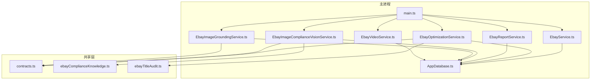
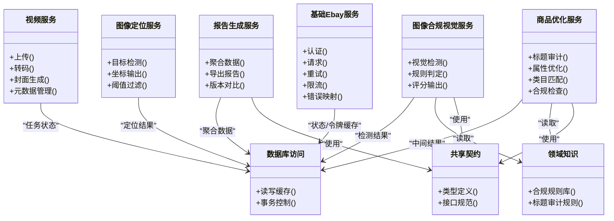
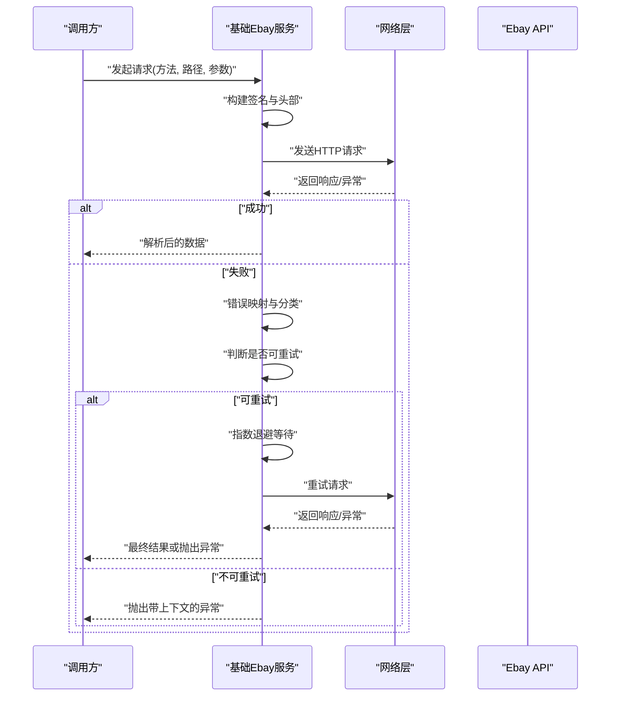
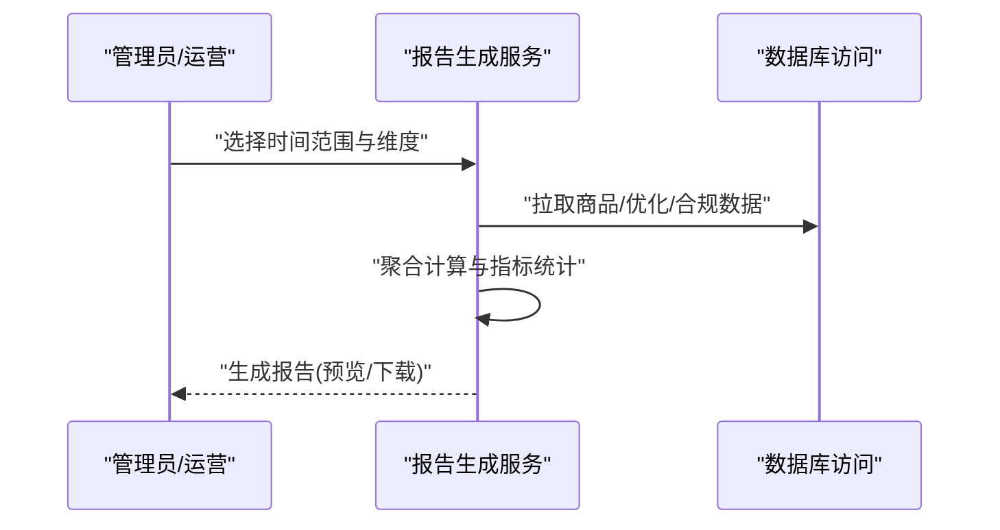
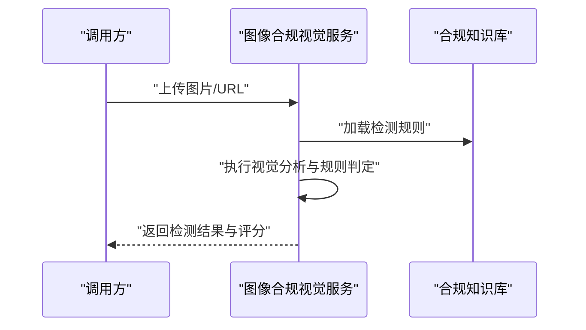
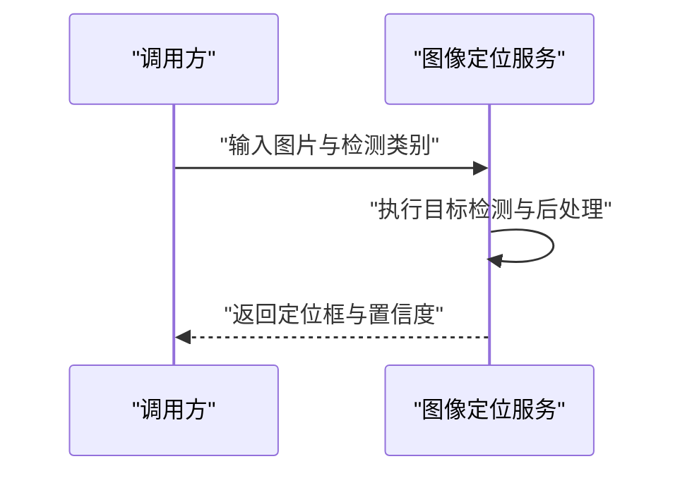
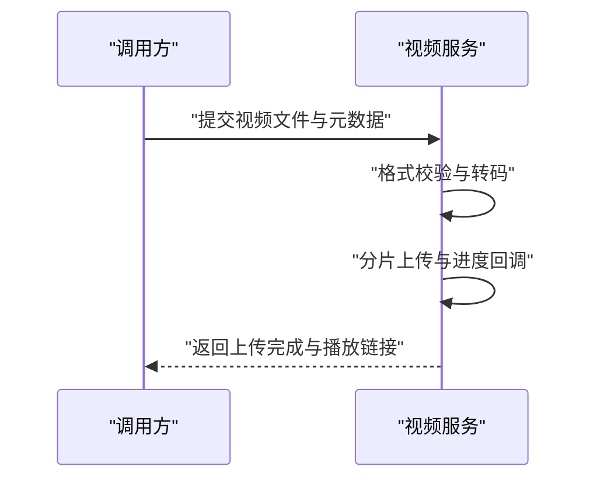
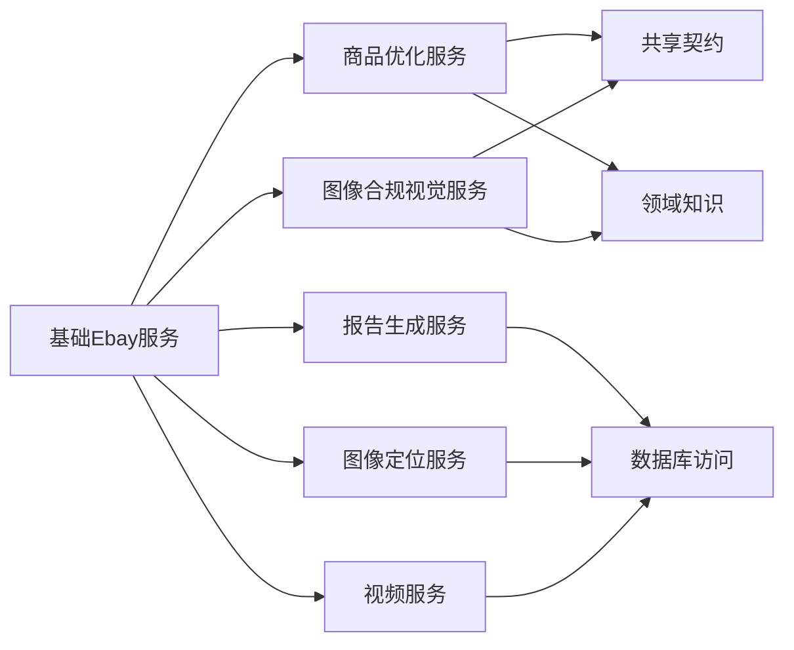

# Ebay核心服务

<cite>
**本文引用的文件**   
- [EbayService.ts](file://src/main/services/EbayService.ts)
- [EbayOptimizationService.ts](file://src/main/services/EbayOptimizationService.ts)
- [EbayReportService.ts](file://src/main/services/EbayReportService.ts)
- [EbayImageComplianceVisionService.ts](file://src/main/services/EbayImageComplianceVisionService.ts)
- [EbayImageGroundingService.ts](file://src/main/services/EbayImageGroundingService.ts)
- [EbayVideoService.ts](file://src/main/services/EbayVideoService.ts)
- [contracts.ts](file://src/shared/contracts.ts)
- [ebayComplianceKnowledge.ts](file://src/shared/ebayComplianceKnowledge.ts)
- [ebayTitleAudit.ts](file://src/shared/ebayTitleAudit.ts)
- [AppDatabase.ts](file://src/main/database/AppDatabase.ts)
- [main.ts](file://src/main/main.ts)
</cite>

## 目录
1. [简介](#简介)
2. [项目结构](#项目结构)
3. [核心组件](#核心组件)
4. [架构总览](#架构总览)
5. [详细组件分析](#详细组件分析)
6. [依赖关系分析](#依赖关系分析)
7. [性能与可靠性](#性能与可靠性)
8. [故障排查指南](#故障排查指南)
9. [结论](#结论)
10. [附录：API与数据模型速查](#附录api与数据模型速查)

## 简介
本文件面向Ebay平台集成的核心服务模块，系统性梳理基础Ebay服务、商品优化服务、报告生成服务、图像合规视觉服务、图像定位服务以及视频服务等关键组件。文档从系统架构、组件职责、数据流、调用模式、错误处理、重试与限流策略等方面展开，并提供可操作的调用示例路径，帮助读者快速理解并正确使用这些服务进行商品管理、优化与合规检查。

## 项目结构
本项目采用分层组织方式：
- main层：包含主进程入口、数据库访问与各业务服务实现（Ebay系列服务）。
- shared层：跨进程共享的契约与领域知识（如合同类型、合规知识库、标题审计规则等）。
- renderer层：前端渲染界面与交互逻辑（与本核心服务文档关联度较低，略）。
- tools层：辅助工具脚本（与本核心服务文档关联度较低，略）。



图表来源
- [main.ts](file://src/main/main.ts)
- [AppDatabase.ts](file://src/main/database/AppDatabase.ts)
- [EbayService.ts](file://src/main/services/EbayService.ts)
- [EbayOptimizationService.ts](file://src/main/services/EbayOptimizationService.ts)
- [EbayReportService.ts](file://src/main/services/EbayReportService.ts)
- [EbayImageComplianceVisionService.ts](file://src/main/services/EbayImageComplianceVisionService.ts)
- [EbayImageGroundingService.ts](file://src/main/services/EbayImageGroundingService.ts)
- [EbayVideoService.ts](file://src/main/services/EbayVideoService.ts)
- [contracts.ts](file://src/shared/contracts.ts)
- [ebayComplianceKnowledge.ts](file://src/shared/ebayComplianceKnowledge.ts)
- [ebayTitleAudit.ts](file://src/shared/ebayTitleAudit.ts)

章节来源
- [main.ts](file://src/main/main.ts)
- [AppDatabase.ts](file://src/main/database/AppDatabase.ts)

## 核心组件
本节概述各服务的职责边界与对外能力，便于快速定位与使用。

- 基础Ebay服务（EbayService）
  - 职责：封装Ebay API认证、请求构建、响应解析、错误映射、重试与限流等通用能力。
  - 典型能力：获取令牌、构造签名、统一鉴权头、统一错误码转换、幂等重试、速率限制。
  - 适用场景：所有需要调用Ebay REST或SOAP接口的服务均通过该服务发起。

- 商品优化服务（EbayOptimizationService）
  - 职责：基于共享知识与规则对商品标题、描述、属性等进行优化建议与校验。
  - 典型能力：标题审计、关键词提取、类目匹配、属性补全、合规性检查。
  - 适用场景：批量上架前优化、编辑时实时校验。

- 报告生成服务（EbayReportService）
  - 职责：汇总商品状态、合规结果、优化建议与历史变更，生成结构化报告。
  - 典型能力：聚合多源数据、导出CSV/JSON、增量更新、版本对比。
  - 适用场景：运营复盘、合规审计、质量监控。

- 图像合规视觉服务（EbayImageComplianceVisionService）
  - 职责：对商品图片进行合规检测（水印、白底、尺寸、分辨率、敏感内容等）。
  - 典型能力：视觉特征抽取、规则判定、置信度评分、问题定位。
  - 适用场景：上架前质检、违规拦截、整改建议。

- 图像定位服务（EbayImageGroundingService）
  - 职责：在商品图中定位关键元素（主体、Logo、文字区域），支持后续裁剪与标注。
  - 典型能力：目标检测、框坐标输出、多实例排序、阈值过滤。
  - 适用场景：自动抠图、主体居中、模板化排版。

- 视频服务（EbayVideoService）
  - 职责：商品视频上传、转码、封面生成、元数据管理与播放链接维护。
  - 典型能力：分片上传、进度回调、失败重试、格式校验、时长限制。
  - 适用场景：视频素材入库、多渠道分发。

章节来源
- [EbayService.ts](file://src/main/services/EbayService.ts)
- [EbayOptimizationService.ts](file://src/main/services/EbayOptimizationService.ts)
- [EbayReportService.ts](file://src/main/services/EbayReportService.ts)
- [EbayImageComplianceVisionService.ts](file://src/main/services/EbayImageComplianceVisionService.ts)
- [EbayImageGroundingService.ts](file://src/main/services/EbayImageGroundingService.ts)
- [EbayVideoService.ts](file://src/main/services/EbayVideoService.ts)

## 架构总览
整体采用“服务层 + 共享契约 + 持久化”的分层架构。服务层负责业务编排与外部集成；共享层提供类型契约与领域知识；持久化层负责本地缓存与状态管理。



图表来源
- [EbayService.ts](file://src/main/services/EbayService.ts)
- [EbayOptimizationService.ts](file://src/main/services/EbayOptimizationService.ts)
- [EbayReportService.ts](file://src/main/services/EbayReportService.ts)
- [EbayImageComplianceVisionService.ts](file://src/main/services/EbayImageComplianceVisionService.ts)
- [EbayImageGroundingService.ts](file://src/main/services/EbayImageGroundingService.ts)
- [EbayVideoService.ts](file://src/main/services/EbayVideoService.ts)
- [contracts.ts](file://src/shared/contracts.ts)
- [ebayComplianceKnowledge.ts](file://src/shared/ebayComplianceKnowledge.ts)
- [ebayTitleAudit.ts](file://src/shared/ebayTitleAudit.ts)
- [AppDatabase.ts](file://src/main/database/AppDatabase.ts)

## 详细组件分析

### 基础Ebay服务（EbayService）
- 设计要点
  - 认证机制：集中管理OAuth令牌获取与刷新，统一注入Authorization头。
  - 请求构建：标准化URL、查询参数、请求体、签名算法与时间戳。
  - 错误处理：将Ebay错误码映射为内部异常，附带上下文信息。
  - 重试机制：针对网络抖动与临时错误实施指数退避重试。
  - 限流处理：基于令牌桶或滑动窗口控制并发与QPS。
- 典型调用流程（序列图）



图表来源
- [EbayService.ts](file://src/main/services/EbayService.ts)

章节来源
- [EbayService.ts](file://src/main/services/EbayService.ts)

### 商品优化服务（EbayOptimizationService）
- 设计要点
  - 标题审计：依据共享规则对标题长度、关键词密度、违禁词进行检查与建议。
  - 属性优化：根据类目与历史数据推荐属性值，提升搜索曝光。
  - 合规检查：结合共享知识库对图文一致性、类目准确性进行校验。
- 典型调用流程（序列图）

```mermaid
sequenceDiagram
participant UI as "调用方"
participant OPT as "商品优化服务"
participant KNOW as "领域知识(合规/标题规则)"
participant DB as "数据库访问"
UI->>OPT : "提交商品草稿(标题/属性/类目)"
OPT->>KNOW : "加载规则与知识库"
OPT->>DB : "读取类目映射与历史数据"
OPT->>OPT : "执行标题审计与属性优化"
OPT-->>UI : "返回优化建议与合规结果"
```

图表来源
- [EbayOptimizationService.ts](file://src/main/services/EbayOptimizationService.ts)
- [ebayTitleAudit.ts](file://src/shared/ebayTitleAudit.ts)
- [ebayComplianceKnowledge.ts](file://src/shared/ebayComplianceKnowledge.ts)
- [AppDatabase.ts](file://src/main/database/AppDatabase.ts)

章节来源
- [EbayOptimizationService.ts](file://src/main/services/EbayOptimizationService.ts)
- [ebayTitleAudit.ts](file://src/shared/ebayTitleAudit.ts)
- [ebayComplianceKnowledge.ts](file://src/shared/ebayComplianceKnowledge.ts)

### 报告生成服务（EbayReportService）
- 设计要点
  - 数据聚合：整合商品状态、优化建议、合规检测结果与历史变更记录。
  - 导出能力：支持CSV/JSON导出，支持分页与增量更新。
  - 版本对比：比较不同批次或时间点的差异，辅助决策。
- 典型调用流程（序列图）



图表来源
- [EbayReportService.ts](file://src/main/services/EbayReportService.ts)
- [AppDatabase.ts](file://src/main/database/AppDatabase.ts)

章节来源
- [EbayReportService.ts](file://src/main/services/EbayReportService.ts)

### 图像合规视觉服务（EbayImageComplianceVisionService）
- 设计要点
  - 视觉检测：识别水印、白底、尺寸、分辨率、敏感内容等。
  - 规则判定：基于共享知识库进行阈值判定与组合规则评估。
  - 评分输出：给出综合得分与问题明细，便于整改。
- 典型调用流程（序列图）



图表来源
- [EbayImageComplianceVisionService.ts](file://src/main/services/EbayImageComplianceVisionService.ts)
- [ebayComplianceKnowledge.ts](file://src/shared/ebayComplianceKnowledge.ts)

章节来源
- [EbayImageComplianceVisionService.ts](file://src/main/services/EbayImageComplianceVisionService.ts)
- [ebayComplianceKnowledge.ts](file://src/shared/ebayComplianceKnowledge.ts)

### 图像定位服务（EbayImageGroundingService）
- 设计要点
  - 目标检测：识别主体、Logo、文字区域等多类对象。
  - 坐标输出：返回框坐标与置信度，支持排序与过滤。
  - 后处理：合并重叠框、阈值过滤、归一化输出。
- 典型调用流程（序列图）



图表来源
- [EbayImageGroundingService.ts](file://src/main/services/EbayImageGroundingService.ts)

章节来源
- [EbayImageGroundingService.ts](file://src/main/services/EbayImageGroundingService.ts)

### 视频服务（EbayVideoService）
- 设计要点
  - 上传管理：支持分片上传、断点续传、进度回调。
  - 转码与封面：按平台要求转码、生成缩略图。
  - 元数据管理：维护标题、描述、标签、播放链接等。
- 典型调用流程（序列图）



图表来源
- [EbayVideoService.ts](file://src/main/services/EbayVideoService.ts)

章节来源
- [EbayVideoService.ts](file://src/main/services/EbayVideoService.ts)

## 依赖关系分析
服务间依赖清晰，遵循单一职责与最小耦合原则：
- 基础Ebay服务被其他服务复用，作为统一的API网关。
- 商品优化与图像合规服务依赖共享契约与领域知识，确保一致性与可维护性。
- 报告生成服务聚合多源数据，依赖数据库访问层进行持久化与查询。
- 图像定位与视频服务相对独立，必要时与数据库交互以保存任务状态与结果。



图表来源
- [EbayService.ts](file://src/main/services/EbayService.ts)
- [EbayOptimizationService.ts](file://src/main/services/EbayOptimizationService.ts)
- [EbayReportService.ts](file://src/main/services/EbayReportService.ts)
- [EbayImageComplianceVisionService.ts](file://src/main/services/EbayImageComplianceVisionService.ts)
- [EbayImageGroundingService.ts](file://src/main/services/EbayImageGroundingService.ts)
- [EbayVideoService.ts](file://src/main/services/EbayVideoService.ts)
- [contracts.ts](file://src/shared/contracts.ts)
- [ebayComplianceKnowledge.ts](file://src/shared/ebayComplianceKnowledge.ts)
- [AppDatabase.ts](file://src/main/database/AppDatabase.ts)

章节来源
- [contracts.ts](file://src/shared/contracts.ts)
- [ebayComplianceKnowledge.ts](file://src/shared/ebayComplianceKnowledge.ts)
- [AppDatabase.ts](file://src/main/database/AppDatabase.ts)

## 性能与可靠性
- 重试机制
  - 指数退避：针对瞬时错误（网络抖动、服务端限流）进行自适应重试。
  - 最大重试次数：避免无限重试导致资源耗尽。
  - 幂等性：对GET等安全操作保证幂等，POST需由调用方保证。
- 限流处理
  - 令牌桶/滑动窗口：控制每秒请求数与并发度，避免触发平台限流。
  - 队列与背压：在高负载下排队与降级，保障核心链路稳定。
- 错误处理
  - 统一错误映射：将平台错误码转换为内部异常，附带上下文。
  - 分级告警：区分可恢复与不可恢复错误，记录日志与指标。
- 缓存与持久化
  - 令牌与热点数据缓存：减少重复请求与认证开销。
  - 中间结果落盘：支持断点续传与离线处理。

[本节为通用指导，不直接分析具体文件]

## 故障排查指南
- 常见问题
  - 认证失败：检查令牌有效期、签名算法、时间戳同步。
  - 限流触发：降低并发、增加退避间隔、启用队列。
  - 图像检测误判：调整阈值、补充样本、复核规则。
  - 视频上传中断：检查分片大小、网络稳定性、断点续传逻辑。
- 诊断步骤
  - 查看服务日志与错误码映射。
  - 复现请求并抓包验证签名与头部。
  - 逐步隔离依赖（数据库、外部API、规则库）。
  - 使用最小用例验证核心链路。

章节来源
- [EbayService.ts](file://src/main/services/EbayService.ts)
- [EbayImageComplianceVisionService.ts](file://src/main/services/EbayImageComplianceVisionService.ts)
- [EbayVideoService.ts](file://src/main/services/EbayVideoService.ts)

## 结论
Ebay核心服务模块通过清晰的分层与职责划分，实现了认证、请求、错误处理、重试与限流的统一能力，并在商品优化、报告生成、图像合规与定位、视频管理等业务场景中提供了稳定可靠的支撑。借助共享契约与领域知识，服务具备高内聚与低耦合特性，便于扩展与维护。建议在接入新能力时遵循现有模式，确保一致性与可观测性。

[本节为总结性内容，不直接分析具体文件]

## 附录：API与数据模型速查
- 认证与请求
  - 认证：OAuth令牌获取与刷新，统一注入Authorization头。
  - 请求：标准化URL、查询参数、请求体、签名与时间戳。
- 数据模型
  - 商品：标题、描述、类目、属性、价格、库存等。
  - 图像：URL、尺寸、分辨率、检测结果、评分。
  - 视频：文件、元数据、转码状态、播放链接。
  - 报告：聚合指标、版本对比、导出格式。
- 调用示例路径
  - 商品优化：参考商品优化服务中的标题审计与属性优化方法。
  - 图像合规：参考图像合规视觉服务中的视觉检测与规则判定方法。
  - 图像定位：参考图像定位服务中的目标检测与坐标输出方法。
  - 视频上传：参考视频服务中的上传与转码方法。
  - 报告导出：参考报告生成服务中的聚合与导出方法。

章节来源
- [EbayOptimizationService.ts](file://src/main/services/EbayOptimizationService.ts)
- [EbayImageComplianceVisionService.ts](file://src/main/services/EbayImageComplianceVisionService.ts)
- [EbayImageGroundingService.ts](file://src/main/services/EbayImageGroundingService.ts)
- [EbayVideoService.ts](file://src/main/services/EbayVideoService.ts)
- [EbayReportService.ts](file://src/main/services/EbayReportService.ts)
- [contracts.ts](file://src/shared/contracts.ts)