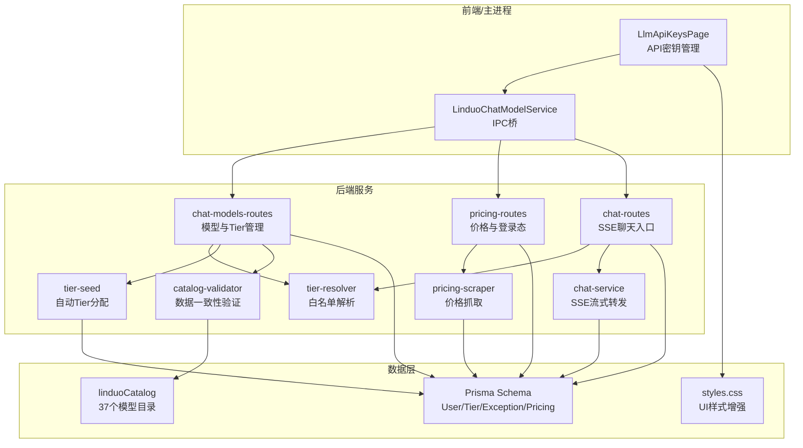
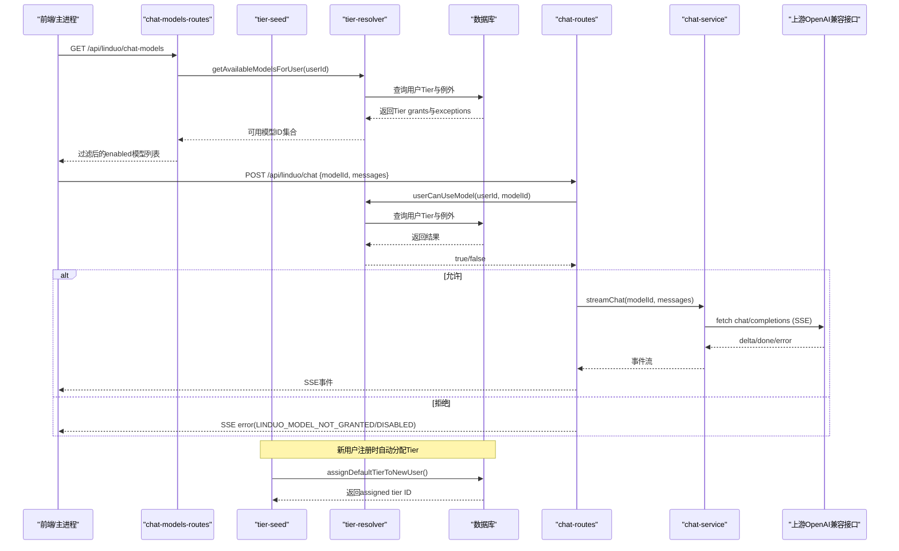
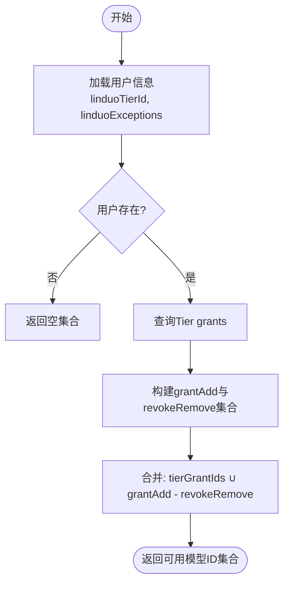
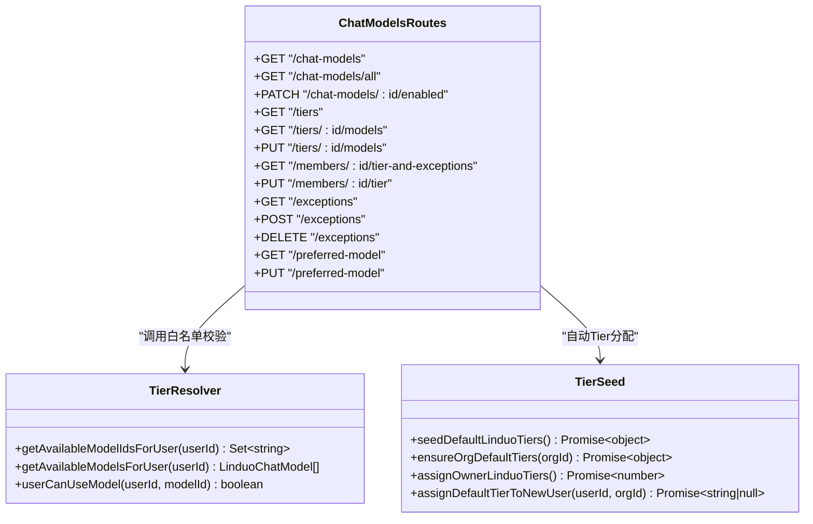
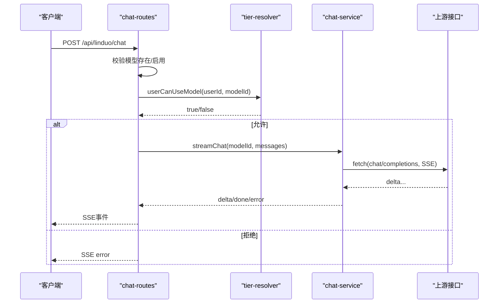
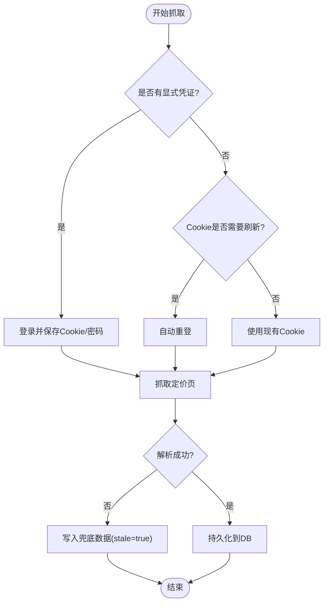
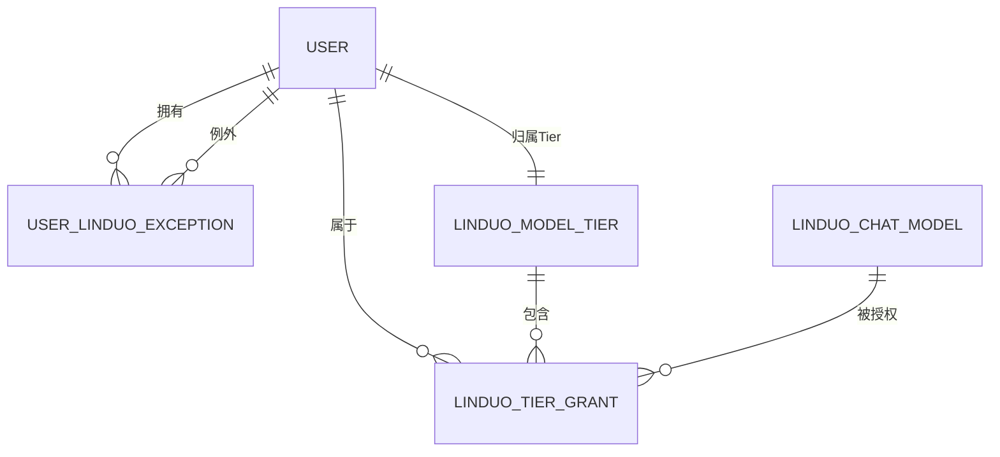

# Linduo模型分层系统

<cite>
**本文引用的文件**
- [server/src/modules/linduo/types.ts](file://server/src/modules/linduo/types.ts)
- [server/src/modules/linduo/tier-resolver.ts](file://server/src/modules/linduo/tier-resolver.ts)
- [server/src/modules/linduo/chat-models-routes.ts](file://server/src/modules/linduo/chat-models-routes.ts)
- [server/src/modules/linduo/pricing-routes.ts](file://server/src/modules/linduo/pricing-routes.ts)
- [server/src/modules/linduo/chat-routes.ts](file://server/src/modules/linduo/chat-routes.ts)
- [server/src/modules/linduo/chat-service.ts](file://server/src/modules/linduo/chat-service.ts)
- [server/src/modules/linduo/pricing-scraper.ts](file://server/src/modules/linduo/pricing-scraper.ts)
- [server/src/modules/linduo/tier-seed.ts](file://server/src/modules/linduo/tier-seed.ts)
- [src/main/services/LinduoChatModelService.ts](file://src/main/services/LinduoChatModelService.ts)
- [src/shared/contracts.ts](file://src/shared/contracts.ts)
- [src/shared/linduoCatalog.ts](file://src/shared/linduoCatalog.ts)
- [scripts/check-linduo-catalog-consistency.mjs](file://scripts/check-linduo-catalog-consistency.mjs)
- [server/src/modules/linduo/pricing-fallback.ts](file://server/src/modules/linduo/pricing-fallback.ts)
- [server/prisma/schema.prisma](file://server/prisma/schema.prisma)
- [server/src/index.ts](file://server/src/index.ts)
- [src/renderer/LlmApiKeysPage.tsx](file://src/renderer/LlmApiKeysPage.tsx)
- [src/renderer/styles.css](file://src/renderer/styles.css)
</cite>

## 更新摘要
**所做更改**
- 修复了关键的Tier种子分配bug，确保'full' tier的grants在组织创建时正确初始化
- 更新了审计日志处理，将system-generated actions的userId字段从'system'改为null
- 更新了前端Linduo模型目录显示，从45个模型调整为37个模型
- 增强了UI样式，新增评级显示类和警告样式
- 更新了服务器初始化日志以反映返回属性从'fullGrants'到'grantsSynced'的重命名

## 目录
1. [简介](#简介)
2. [项目结构](#项目结构)
3. [核心组件](#核心组件)
4. [架构总览](#架构总览)
5. [详细组件分析](#详细组件分析)
6. [依赖关系分析](#依赖关系分析)
7. [性能考量](#性能考量)
8. [故障排查指南](#故障排查指南)
9. [结论](#结论)
10. [附录](#附录)

## 简介
本仓库实现了"Linduo模型分层系统"，用于对多厂商AI模型（OpenAI、Google、Anthropic、Vidu）进行统一接入、分级授权与价格管理。系统通过"Tier + Exception"的白名单机制，为不同成员动态授予或限制可用模型；同时提供价格抓取、登录态维护与SSE流式聊天能力，形成从"模型选择—权限校验—计费展示—调用执行"的完整闭环。

**最新更新**：系统现已支持37个模型（从原来的45个调整），包括完整的GPT-5系列模型、更新的Google Gemini 3.x系列和Anthropic Claude最新系列，并引入了自动Tier分配和数据一致性验证机制。关键修复包括Tier种子分配的bug修复和审计日志处理的改进。

## 项目结构
围绕Linduo模块的关键代码分布在服务端Fastify路由层、领域服务层、数据访问层以及主进程IPC桥接层：
- 路由层：暴露REST端点，负责鉴权、参数校验、审计记录与响应组装
- 领域服务层：实现核心业务逻辑（白名单解析、聊天流式转发、价格抓取、Tier管理）
- 数据层：Prisma Schema定义用户、组织、模型、等级、例外、定价等实体
- IPC桥接：主进程服务封装HTTP调用，供渲染层使用

**图表来源**
- [server/src/modules/linduo/chat-models-routes.ts:150-395](file://server/src/modules/linduo/chat-models-routes.ts#L150-L395)
- [server/src/modules/linduo/pricing-routes.ts:53-116](file://server/src/modules/linduo/pricing-routes.ts#L53-L116)
- [server/src/modules/linduo/chat-routes.ts:55-141](file://server/src/modules/linduo/chat-routes.ts#L55-L141)
- [server/src/modules/linduo/tier-resolver.ts:24-82](file://server/src/modules/linduo/tier-resolver.ts#L24-L82)
- [server/src/modules/linduo/chat-service.ts:31-197](file://server/src/modules/linduo/chat-service.ts#L31-L197)
- [server/src/modules/linduo/pricing-scraper.ts:309-399](file://server/src/modules/linduo/pricing-scraper.ts#L309-L399)
- [server/src/modules/linduo/tier-seed.ts:28-110](file://server/src/modules/linduo/tier-seed.ts#L28-L110)
- [scripts/check-linduo-catalog-consistency.mjs:1-90](file://scripts/check-linduo-catalog-consistency.mjs#L1-L90)
- [src/renderer/LlmApiKeysPage.tsx:15-52](file://src/renderer/LlmApiKeysPage.tsx#L15-L52)
- [src/renderer/styles.css:509-510](file://src/renderer/styles.css#L509-L510)

## 核心组件
- **白名单解析器（R-2公式）**：根据用户所属Tier默认授权集合与用户级例外（GRANT/REVOKE）计算最终可用模型集合
- **模型与Tier管理API**：查询当前用户可用模型、管理员全量模型、Tier及其模型配置、成员Tier与例外汇总、偏好模型设置
- **SSE聊天路由**：校验模型存在性、启用状态与白名单，建立SSE流并转发上游OpenAI兼容接口
- **价格抓取与登录态**：Playwright无头浏览器抓取定价页，自动维护Cookie与加密密码，失败回退到常量兜底
- **自动Tier分配系统**：新用户注册时自动分配到"进阶组"，OWNER强制分配到"全开组"
- **数据一致性验证**：确保共享目录与服务端镜像的一致性，防止模型ID漂移
- **主进程IPC桥**：封装上述API调用，统一超时、错误处理与Token注入

**章节来源**
- [server/src/modules/linduo/tier-resolver.ts:24-82](file://server/src/modules/linduo/tier-resolver.ts#L24-L82)
- [server/src/modules/linduo/chat-models-routes.ts:150-395](file://server/src/modules/linduo/chat-models-routes.ts#L150-L395)
- [server/src/modules/linduo/chat-routes.ts:55-141](file://server/src/modules/linduo/chat-routes.ts#L55-L141)
- [server/src/modules/linduo/pricing-routes.ts:53-116](file://server/src/modules/linduo/pricing-routes.ts#L53-L116)
- [server/src/modules/linduo/pricing-scraper.ts:309-399](file://server/src/modules/linduo/pricing-scraper.ts#L309-L399)
- [server/src/modules/linduo/tier-seed.ts:28-110](file://server/src/modules/linduo/tier-seed.ts#L28-L110)
- [scripts/check-linduo-catalog-consistency.mjs:1-90](file://scripts/check-linduo-catalog-consistency.mjs#L1-L90)
- [src/main/services/LinduoChatModelService.ts:57-220](file://src/main/services/LinduoChatModelService.ts#L57-L220)

## 架构总览
系统采用分层设计：
- 表现层：Fastify路由负责鉴权、校验、审计与响应
- 领域层：tier-resolver实现权限计算；chat-service实现SSE流式转发；pricing-scraper实现价格抓取；tier-seed实现自动分配
- 数据层：Prisma统一管理用户、组织、模型、等级、例外、定价等实体
- 集成层：主进程IPC桥封装HTTP调用，屏蔽网络细节

**图表来源**
- [server/src/modules/linduo/chat-models-routes.ts:154-158](file://server/src/modules/linduo/chat-models-routes.ts#L154-L158)
- [server/src/modules/linduo/tier-resolver.ts:66-73](file://server/src/modules/linduo/tier-resolver.ts#L66-L73)
- [server/src/modules/linduo/chat-routes.ts:58-141](file://server/src/modules/linduo/chat-routes.ts#L58-L141)
- [server/src/modules/linduo/chat-service.ts:49-188](file://server/src/modules/linduo/chat-service.ts#L49-L188)
- [server/src/modules/linduo/tier-seed.ts:102-110](file://server/src/modules/linduo/tier-seed.ts#L102-L110)

## 详细组件分析

### 白名单解析器（R-2公式）
- 目标：计算用户在Linduo模型白名单内的可用模型集合
- 规则：(用户Tier默认grants ∪ 用户GRANT例外) − 用户REVOKE例外
- 复杂度：单次用户查询 + 一次Tier grants查询 + 一次用户exceptions解析；无缓存
- 输出：Set<string>模型ID集合；并提供便捷方法获取完整模型对象（含enabled过滤）

**图表来源**
- [server/src/modules/linduo/tier-resolver.ts:24-82](file://server/src/modules/linduo/tier-resolver.ts#L24-L82)

**章节来源**
- [server/src/modules/linduo/tier-resolver.ts:24-82](file://server/src/modules/linduo/tier-resolver.ts#L24-L82)

### 自动Tier分配系统
- **新用户自动分配**：新注册用户自动分配到"进阶组"（advanced tier），包含13个精选模型
- **OWNER强制分配**：组织所有者（OWNER）始终分配到"全开组"（full tier），拥有所有模型权限
- **幂等设计**：每次启动时检查并修正Tier分配，确保数据一致性
- **渐进式授权**：进阶组包含轻量批量任务模型和主力写作模型，旗舰和高价款留给全开组

**更新功能**：
- `assignDefaultTierToNewUser()`：为新成员分配默认Tier
- `forceOwnersToFull()`：强制OWNER进入全开组
- `backfillNonOwnersToAdvanced()`：回填非OWNER用户到进阶组
- **关键修复**：`ensureOrgDefaultTiers()`现在包含`syncFullGrants`调用，确保full tier的grants在启动种子和组织首次引导时都正确填充
- **审计改进**：系统生成的操作现在使用`userId: null`而不是`userId: 'system'`，避免外键约束冲突

**章节来源**
- [server/src/modules/linduo/tier-seed.ts:28-110](file://server/src/modules/linduo/tier-seed.ts#L28-L110)
- [server/src/modules/linduo/tier-seed.ts:102-110](file://server/src/modules/linduo/tier-seed.ts#L102-L110)
- [server/src/modules/linduo/tier-seed.ts:149-177](file://server/src/modules/linduo/tier-seed.ts#L149-L177)

### 数据一致性验证脚本
- **双源对账**：确保共享目录（src/shared/linduoCatalog.ts）与服务端镜像（server/src/modules/linduo/linduoCatalog.ts）完全一致
- **消费方验证**：检查pricing-fallback.ts和MultimodalVision.ts中引用的模型ID是否都在目录中存在
- **数量守卫**：验证头注释中的模型数量与实际数量匹配
- **CI集成**：可通过`pnpm lint:catalog`运行，支持pre-commit钩子和CI流水线

**验证规则**：
1. 双目录id集合完全一致（含顺序一致，防止镜像drift）
2. pricing-fallback的每个modelId ⊆ 目录id
3. MultimodalVision引用的gpt-* id ⊆ 目录id
4. 头注数量 == 实际数量

**章节来源**
- [scripts/check-linduo-catalog-consistency.mjs:1-90](file://scripts/check-linduo-catalog-consistency.mjs#L1-L90)

### 模型目录与选型指导
- **37个模型支持**：OpenAI 14个 + Google 10个 + Anthropic 10个 + Vidu 3个
- **GPT-5系列**：包括gpt-5, gpt-5-mini, gpt-5.3-codex, gpt-5.4, gpt-5.4-mini, gpt-5.5, gpt-5.6-luna/sol/terra
- **updated Google模型**：Gemini 2.5和3.x系列，包括Flash、Pro和预览版本
- **updated Anthropic模型**：Claude最新系列，包括Haiku、Sonnet、Opus和实验性Fable系列
- **briefRating字段**：每个模型都包含选型口诀，指导用户选择合适的模型场景

**模型分类**：
- **对话模型**：支持CHAT能力的文本对话模型
- **视觉模型**：支持VISION能力的图像理解模型  
- **生图模型**：支持IMAGE能力的图像生成模型
- **视频模型**：支持VIDEO能力的视频生成模型

**章节来源**
- [src/shared/linduoCatalog.ts:1-95](file://src/shared/linduoCatalog.ts#L1-L95)
- [server/src/modules/linduo/pricing-fallback.ts:1-92](file://server/src/modules/linduo/pricing-fallback.ts#L1-L92)

### 模型与Tier管理API
- 功能：
  - 当前用户可用模型（走R-2白名单）
  - 管理员全量模型（含disabled）
  - 切换模型enabled
  - Tier列表与模型配置（覆盖写入）
  - 成员Tier与例外汇总（管理员/本人）
  - 偏好模型设置（需白名单校验）
- 安全：
  - 所有路由前置认证
  - 管理操作需要member.manage权限
  - 偏好模型设置时强制userCanUseModel校验
- 审计：关键写操作记录审计日志

**图表来源**
- [server/src/modules/linduo/chat-models-routes.ts:150-395](file://server/src/modules/linduo/chat-models-routes.ts#L150-L395)
- [server/src/modules/linduo/tier-resolver.ts:24-82](file://server/src/modules/linduo/tier-resolver.ts#L24-L82)
- [server/src/modules/linduo/tier-seed.ts:28-110](file://server/src/modules/linduo/tier-seed.ts#L28-L110)

**章节来源**
- [server/src/modules/linduo/chat-models-routes.ts:150-395](file://server/src/modules/linduo/chat-models-routes.ts#L150-L395)

### SSE聊天路由与服务
- 路由职责：
  - 校验模型存在性与启用状态
  - 调用白名单解析器校验用户是否有权使用该模型
  - 劫持响应并发送SSE事件
  - 处理客户端断开与AbortController
- 服务职责：
  - 构造OpenAI兼容请求体（stream=true）
  - 解析SSE事件流，产出delta/done/error事件
  - 软关闭不可用模型（404时）
  - 统一超时与信号合并

**图表来源**
- [server/src/modules/linduo/chat-routes.ts:58-141](file://server/src/modules/linduo/chat-routes.ts#L58-L141)
- [server/src/modules/linduo/chat-service.ts:49-188](file://server/src/modules/linduo/chat-service.ts#L49-L188)

**章节来源**
- [server/src/modules/linduo/chat-routes.ts:58-141](file://server/src/modules/linduo/chat-routes.ts#L58-L141)
- [server/src/modules/linduo/chat-service.ts:49-188](file://server/src/modules/linduo/chat-service.ts#L49-L188)

### 价格抓取与登录态
- 登录态：支持用户名密码登录，保存Cookie与加密密码，自动检测过期并刷新
- 抓取流程：
  - 启动headless Chrome，导航至定价页
  - 解析模型卡片，提取输入/输出/缓存价格
  - 持久化到数据库，失败则回退到常量兜底并标记stale
- 接口：
  - 获取价格列表（DB优先，否则fallback）
  - 登录/登出状态查询
  - 手动触发抓取

**图表来源**
- [server/src/modules/linduo/pricing-scraper.ts:309-399](file://server/src/modules/linduo/pricing-scraper.ts#L309-L399)

**章节来源**
- [server/src/modules/linduo/pricing-routes.ts:53-116](file://server/src/modules/linduo/pricing-routes.ts#L53-L116)
- [server/src/modules/linduo/pricing-scraper.ts:309-399](file://server/src/modules/linduo/pricing-scraper.ts#L309-L399)

### 主进程IPC桥
- 作用：将渲染层对Linduo模型的调用抽象为服务方法，统一加Bearer Token、超时与错误处理
- 覆盖端点：模型列表、例外管理、Tier管理、偏好模型设置等
- **R-2增强**：新增Tier相关API调用，支持完整的层级管理功能

**章节来源**
- [src/main/services/LinduoChatModelService.ts:57-220](file://src/main/services/LinduoChatModelService.ts#L57-L220)

### 前端界面增强
- **LlmApiKeysPage更新**：零度API提供商名称更新为"零度API（37 个大模型聚合）"，反映实际的模型数量
- **UI样式增强**：新增评级显示类`.linduo-mall-card-rating`和警告样式`.linduo-mall-card-rating-warn`，提供更好的视觉反馈
- **模型卡片改进**：评级标签根据内容自动应用警告样式，当包含"✗"、"⚠"、"慎用"、"不推荐"等关键词时

**章节来源**
- [src/renderer/LlmApiKeysPage.tsx:45-51](file://src/renderer/LlmApiKeysPage.tsx#L45-L51)
- [src/renderer/styles.css:509-510](file://src/renderer/styles.css#L509-L510)

### 服务器初始化日志更新
- **日志属性重命名**：启动时的Tier预置日志现在使用`grantsSynced`而不是`fullGrants`，保持与内部实现的一致性
- **启动流程优化**：确保Tier种子分配、OWNER分配和例外处理按正确顺序执行

**章节来源**
- [server/src/index.ts:31-35](file://server/src/index.ts#L31-L35)

## 依赖关系分析
- 类型契约：
  - server侧types.ts定义本地类型，避免跨目录依赖
  - shared/contracts.ts定义跨进程共享接口（如LinduoModelPricing）
  - shared/linduoCatalog.ts作为模型目录真值源，驱动同步与显示
- 数据模型：
  - User关联linduoTierId与linduoExceptions
  - LinduoModelTier与LinduoTierGrant构成Tier默认授权
  - LinduoModelPricing存储价格与计费单位

**图表来源**
- [server/prisma/schema.prisma:97-124](file://server/prisma/schema.prisma#L97-L124)

**章节来源**
- [server/src/modules/linduo/types.ts:1-87](file://server/src/modules/linduo/types.ts#L1-L87)
- [src/shared/contracts.ts:12-60](file://src/shared/contracts.ts#L12-L60)
- [src/shared/linduoCatalog.ts:1-86](file://src/shared/linduoCatalog.ts#L1-L86)
- [server/prisma/schema.prisma:97-124](file://server/prisma/schema.prisma#L97-L124)

## 性能考量
- 白名单解析：仅少量查询且无缓存，适合小数据集场景；若未来规模增长可考虑引入内存缓存
- SSE聊天：使用AbortSignal合并超时与客户端断开信号，避免资源泄漏；上游错误快速返回
- 价格抓取：Headless Chrome启动开销较大，建议按需触发或定时任务；失败回退保证可用性
- 数据库：Tier与Exception表较小，查询成本低；批量upsert价格数据减少往返
- **自动Tier分配**：启动时批量处理，使用幂等操作避免重复分配
- **数据验证**：预提交检查确保目录一致性，避免运行时错误
- **关键优化**：full tier的grants同步现在只在必要时执行，避免不必要的数据库操作

## 故障排查指南
- 聊天错误码：
  - LINDUO_KEY_MISSING：未配置上游API Key
  - LINDUO_KEY_INVALID：401/403，检查Key有效性
  - LINDUO_MODEL_NOT_FOUND：上游返回404，系统会软关模型
  - LINDUO_RATE_LIMITED：上游限流，稍后重试
  - LINDUO_UPSTREAM_ERROR：其他5xx或网络异常
- 白名单问题：
  - 确认用户Tier是否正确分配
  - 检查GRANT/REVOKE例外是否生效
  - 偏好模型设置需通过userCanUseModel校验
- 价格抓取失败：
  - 检查Chrome路径配置与可执行文件是否存在
  - 登录态是否过期，必要时重新登录
  - 抓取失败会自动回退到常量数据并标记stale
- **Tier分配问题**：
  - 检查组织是否已初始化Tier
  - 确认OWNER是否被正确分配到全开组
  - 验证新用户是否被分配到进阶组
  - **关键检查**：确认full tier的grants是否正确同步，特别是启动时的种子过程
- **数据一致性问题**：
  - 运行`pnpm lint:catalog`检查目录一致性
  - 确认共享目录与服务端镜像同步
  - 检查pricing-fallback中的模型ID是否都在目录中
- **审计日志问题**：
  - 系统生成的操作现在使用`userId: null`而不是`userId: 'system'`
  - 确保audit_logs表的user_id字段允许NULL值

**章节来源**
- [server/src/modules/linduo/chat-service.ts:85-117](file://server/src/modules/linduo/chat-service.ts#L85-L117)
- [server/src/modules/linduo/chat-routes.ts:64-87](file://server/src/modules/linduo/chat-routes.ts#L64-87)
- [server/src/modules/linduo/pricing-scraper.ts:348-386](file://server/src/modules/linduo/pricing-scraper.ts#L348-L386)
- [scripts/check-linduo-catalog-consistency.mjs:48-84](file://scripts/check-linduo-catalog-consistency.mjs#L48-L84)
- [server/src/modules/linduo/tier-seed.ts:82-89](file://server/src/modules/linduo/tier-seed.ts#L82-L89)

## 结论
Linduo模型分层系统通过清晰的层级划分与严谨的权限控制，实现了对多厂商AI模型的统一接入与管理。Tier+Exception机制提供了灵活的授权策略，SSE聊天与价格抓取保障了用户体验与成本透明。系统在错误处理、审计与回退方面具备良好健壮性，适合在复杂企业环境中部署与扩展。

**最新更新亮点**：
- **37个模型支持**：涵盖最新的GPT-5系列、Google Gemini 3.x和Anthropic Claude系列
- **自动化Tier管理**：新用户自动分配，OWNER强制管理，简化运维
- **数据一致性保障**：预提交检查和双向同步，防止模型漂移
- **智能选型指导**：briefRating字段为用户提供模型选择建议
- **增强的用户体验**：改进的新用户入职流程和模型推荐系统
- **关键Bug修复**：full tier grants的正确初始化和审计日志的处理改进

## 附录
- **模型目录与能力**：见shared/linduoCatalog.ts，定义了各厂商模型的能力标签与上下文长度
- **类型契约**：见shared/contracts.ts与server types.ts，确保前后端与模块间类型一致
- **数据模型**：见Prisma Schema，涵盖用户、组织、模型、等级、例外、定价等实体
- **自动分配逻辑**：见tier-seed.ts，了解新用户和OWNER的自动Tier分配规则
- **数据验证脚本**：见check-linduo-catalog-consistency.mjs，了解如何保持目录一致性
- **前端界面**：见LlmApiKeysPage.tsx和styles.css，了解最新的UI增强和功能

[本节为补充说明，不直接分析具体文件]