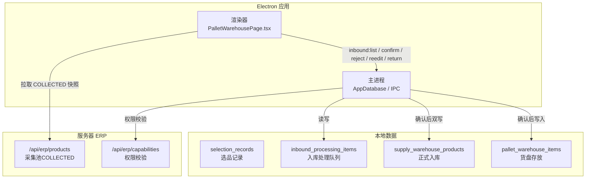
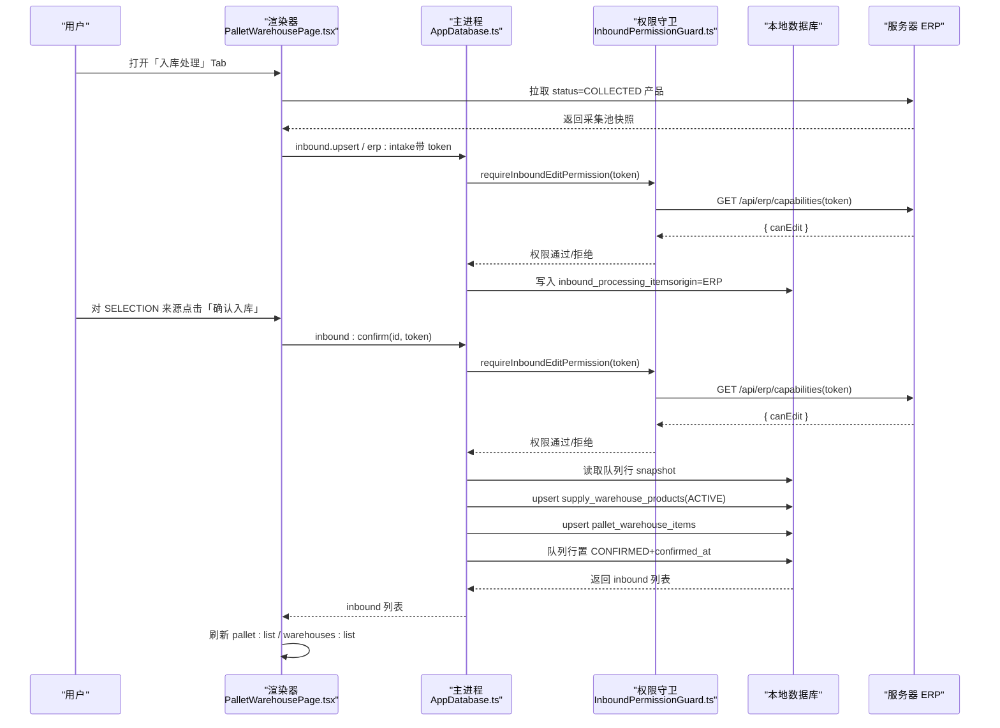
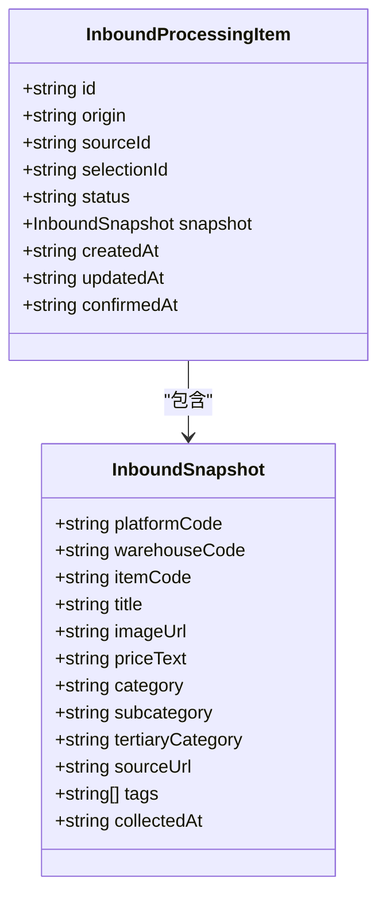
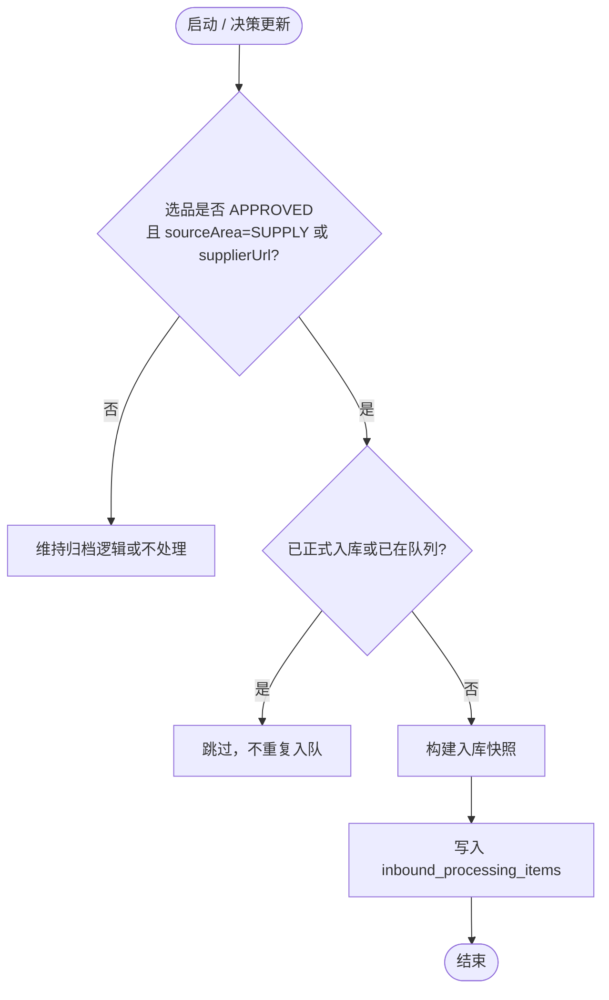
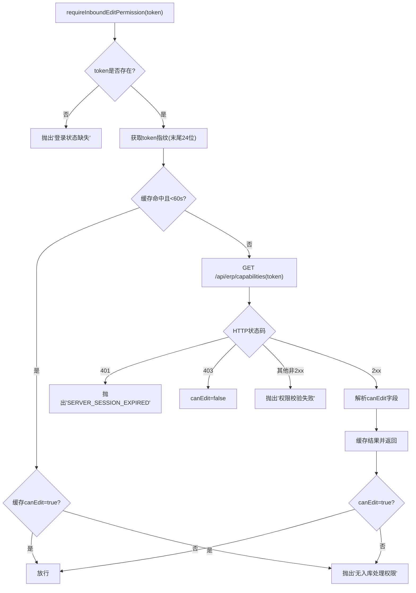
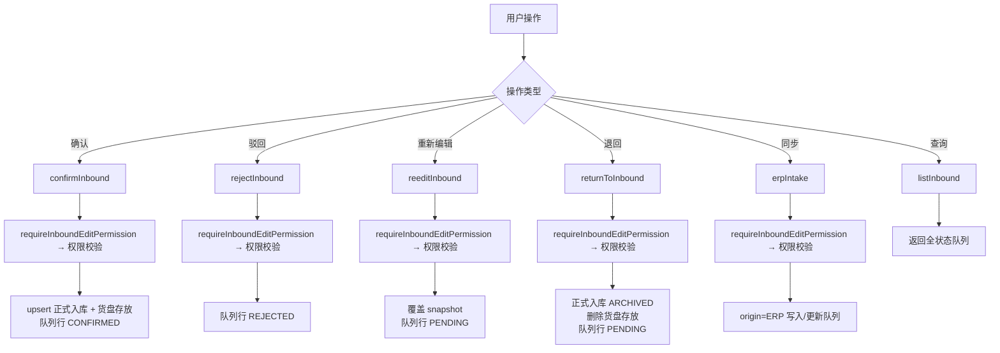
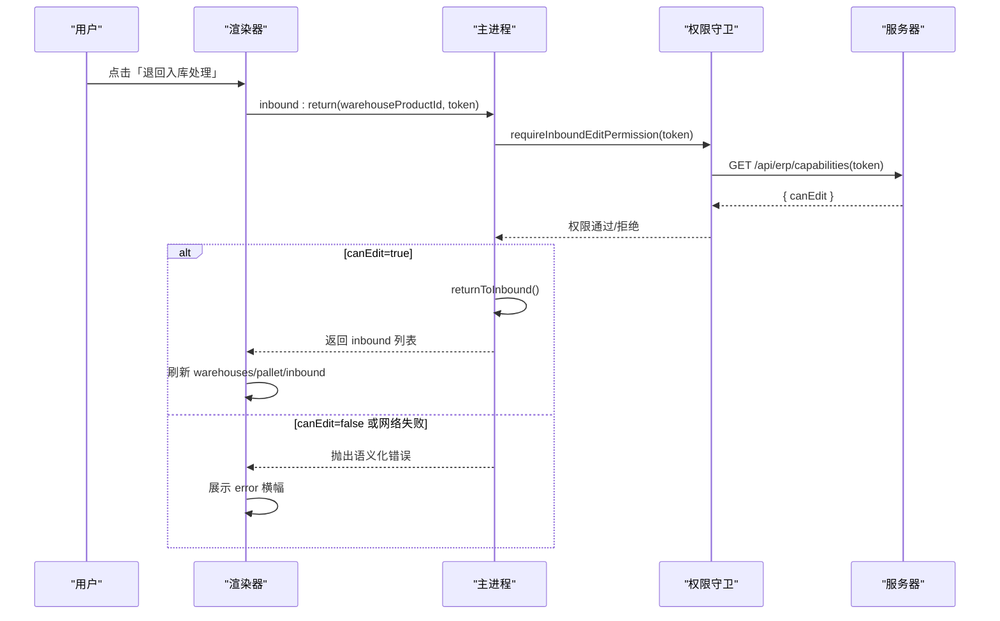
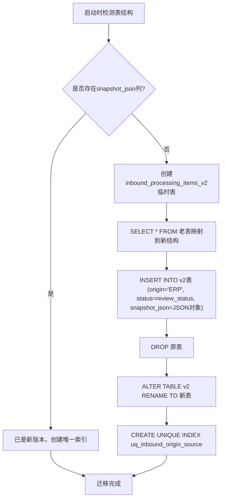
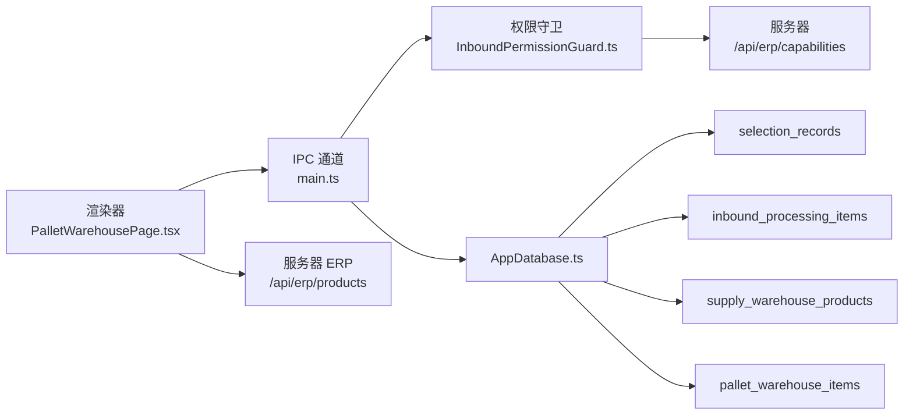

# 入库处理门控系统

<cite>
**本文引用的文件**   
- [2026-09-29-inbound-gate-before-warehouse-design.md](file://docs/superpowers/specs/2026-09-29-inbound-gate-before-warehouse-design.md)
- [AppDatabase.ts](file://src/main/database/AppDatabase.ts)
- [main.ts](file://src/main/main.ts)
- [PalletWarehousePage.tsx](file://src/renderer/erp/PalletWarehousePage.tsx)
- [InboundPermissionGuard.ts](file://src/main/services/InboundPermissionGuard.ts)
- [preload.ts](file://src/preload/preload.ts)
- [contracts.ts](file://src/shared/contracts.ts)
- [package.json](file://package.json)
</cite>

## 更新摘要
**变更内容**   
- 新增权限守卫系统：独立 InboundPermissionGuard 模块，实现基于服务器 capabilities 的 erp.warehouse.edit 强校验与 60s 缓存
- IPC 通信增强：所有写通道统一注入 accessToken 并调用 requireInboundEditPermission，主进程 fail closed
- 数据库迁移完善：inbound_processing_items 表从平铺列重建为 origin/source_id/status/snapshot_json 结构，存量数据自动迁移
- UI 组件完善：货盘仓库「入库处理」Tab 支持 ERP 能力摘要惰性加载、采集池同步、状态筛选、标签编辑、确认/驳回/退回操作

## 目录
1. [引言](#引言)
2. [项目结构](#项目结构)
3. [核心组件](#核心组件)
4. [架构总览](#架构总览)
5. [详细组件分析](#详细组件分析)
6. [依赖关系分析](#依赖关系分析)
7. [性能与一致性考虑](#性能与一致性考虑)
8. [故障排查指南](#故障排查指南)
9. [结论](#结论)

## 引言
本文件围绕"入库处理门控系统"展开，目标是把原本被旁路的"先入库处理、后正式入库"流程重新落地：AI选品审核通过后，不再直写正式入库，而是进入统一的入库处理待确认队列；在货盘仓库的「入库处理」Tab中完成编辑、补标签、确认或驳回；确认后双写正式入库与货盘存放。该设计同时覆盖大健云仓、1688以及绑定货源的机会品来源，并通过主进程 IPC 强校验权限，确保 UI 隐藏不等于安全验证。

**更新** 本次重大架构升级引入了独立的权限守卫系统、增强的IPC通信机制、完善的数据库迁移和UI组件完善，显著提升了系统的安全性和可维护性。

## 项目结构
本项目为 Electron 桌面应用，仓库根 package.json 指定主入口位于 dist/main/main/boot/boot.js，渲染器与业务逻辑分布在 src/renderer 与 src/main 下；ERP 相关能力由 server 模块提供，但本次门控改动主要发生在主进程 AppDatabase、IPC 通道与渲染器货盘仓库页面。

图示来源
- [package.json:7-26](file://package.json#L7-L26)
- [PalletWarehousePage.tsx:16-20](file://src/renderer/erp/PalletWarehousePage.tsx#L16-L20)
- [AppDatabase.ts:2578-2590](file://src/main/database/AppDatabase.ts#L2578-L2590)
- [InboundPermissionGuard.ts:27-31](file://src/main/services/InboundPermissionGuard.ts#L27-L31)

章节来源
- [package.json:1-26](file://package.json#L1-L26)

## 核心组件
- 入库处理队列：统一承载 SELECTION 与 ERP 两类来源的待确认项，使用 origin/source_id/status/snapshot_json 描述来源、唯一键、状态与最终快照。
- 闸口下沉点：将 AI 选品审核通过的分支从直接 upsert 正式入库改为入队入库处理，避免旁路。
- 队列操作：confirm、reject、reedit、returnToInbound、erpIntake、listInbound，分别对应确认入库、驳回、重新编辑、退回入库处理、服务器采集池同步、全状态查询。
- **新增** 权限守卫系统：独立的 InboundPermissionGuard 模块，基于服务器 capabilities 接口进行 erp.warehouse.edit 权限校验，支持 60s 缓存和会话过期检测。
- **增强** IPC 通道：所有写通道（confirm/reject/reedit/return/erpIntake）统一携带 accessToken 并调用 requireInboundEditPermission 进行强校验。
- 渲染器交互：货盘仓库「入库处理」Tab 展示待确认卡，支持筛选、编辑、确认、驳回；正式入库与货盘仓库卡片新增「退回入库处理」。

章节来源
- [2026-09-29-inbound-gate-before-warehouse-design.md:38-103](file://docs/superpowers/specs/2026-09-29-inbound-gate-before-warehouse-design.md#L38-L103)
- [2026-09-29-inbound-gate-before-warehouse-design.md:104-139](file://docs/superpowers/specs/2026-09-29-inbound-gate-before-warehouse-design.md#L104-L139)
- [2026-09-29-inbound-gate-before-warehouse-design.md:140-186](file://docs/superpowers/specs/2026-09-29-inbound-gate-before-warehouse-design.md#L140-L186)
- [InboundPermissionGuard.ts:1-39](file://src/main/services/InboundPermissionGuard.ts#L1-L39)

## 架构总览
入库处理门控的核心链路如下：

图示来源
- [PalletWarehousePage.tsx:64-99](file://src/renderer/erp/PalletWarehousePage.tsx#L64-L99)
- [PalletWarehousePage.tsx:129-135](file://src/renderer/erp/PalletWarehousePage.tsx#L129-L135)
- [2026-09-29-inbound-gate-before-warehouse-design.md:112-132](file://docs/superpowers/specs/2026-09-29-inbound-gate-before-warehouse-design.md#L112-L132)
- [InboundPermissionGuard.ts:17-38](file://src/main/services/InboundPermissionGuard.ts#L17-L38)

## 详细组件分析

### 数据模型与契约
- 入库处理项包含来源 origin（SELECTION 或 ERP）、sourceId、selectionId、status（PENDING/CONFIRMED/REJECTED）、snapshot_json、时间戳与 confirmedAt。
- snapshot 字段包括 platformCode、warehouseCode、itemCode、title、imageUrl、priceText、category/subcategory/tertiaryCategory、sourceUrl、tags、collectedAt。
- 现有 contracts.ts 中的 InboundSnapshotInput、InboundPatchInput、InboundProcessingItem 将被替换为更简洁的统一快照模型；ComparisonPromotionResult.warehouseProduct 改为 inboundItemId。

图示来源
- [2026-09-29-inbound-gate-before-warehouse-design.md:40-103](file://docs/superpowers/specs/2026-09-29-inbound-gate-before-warehouse-design.md#L40-L103)
- [contracts.ts:1800-1836](file://src/shared/contracts.ts#L1800-L1836)

章节来源
- [2026-09-29-inbound-gate-before-warehouse-design.md:38-103](file://docs/superpowers/specs/2026-09-29-inbound-gate-before-warehouse-design.md#L38-L103)
- [contracts.ts:1800-1836](file://src/shared/contracts.ts#L1800-L1836)

### 闸口下沉与启动回填
- updateSelectionDecision：APPROVED 且 sourceArea==='SUPPLY' 或存在 supplierUrl 时，不再直接 upsertSupplyWarehouseProduct，而是写入入库处理队列（origin=SELECTION，sourceId=selectionId）。
- promoteComparisonToWarehouse：删除"取正式入库商品否则抛错"的逻辑，改为返回 comparison、selection、inboundItemId，workflow_events detail 记录 inboundItemId。
- 启动回填：对 APPROVED 且 SUPPLY||supplierUrl 的选品逐条检查——已有正式入库行或已有入库队列行则跳过，否则补入库快照，保证存量豁免与幂等。

图示来源
- [AppDatabase.ts:1354](file://src/main/database/AppDatabase.ts#L1354)
- [AppDatabase.ts:2523-2534](file://src/main/database/AppDatabase.ts#L2523-L2534)
- [AppDatabase.ts:2578-2590](file://src/main/database/AppDatabase.ts#L2578-L2590)
- [2026-09-29-inbound-gate-before-warehouse-design.md:106-111](file://docs/superpowers/specs/2026-09-29-inbound-gate-before-warehouse-design.md#L106-L111)

章节来源
- [AppDatabase.ts:1354](file://src/main/database/AppDatabase.ts#L1354)
- [AppDatabase.ts:2523-2534](file://src/main/database/AppDatabase.ts#L2523-L2534)
- [AppDatabase.ts:2578-2590](file://src/main/database/AppDatabase.ts#L2578-L2590)
- [2026-09-29-inbound-gate-before-warehouse-design.md:106-111](file://docs/superpowers/specs/2026-09-29-inbound-gate-before-warehouse-design.md#L106-L111)

### 权限守卫系统
**新增** 独立的权限守卫模块，负责所有入库写操作的权限强校验：

- 令牌指纹缓存：基于 accessToken 末尾24位生成指纹，TTL 60秒，避免频繁请求服务器
- 会话过期检测：401响应直接抛出 SERVER_SESSION_EXPIRED，供上层重试登录
- 权限拒绝处理：403或canEdit=false抛出语义化错误"无入库处理权限（需 erp.warehouse.edit）"
- 网络容错：其他网络异常抛出"权限校验失败，请检查网络后重试"，fail closed策略
- 空令牌保护：未提供accessToken直接拒绝，防止绕过认证

图示来源
- [InboundPermissionGuard.ts:7-38](file://src/main/services/InboundPermissionGuard.ts#L7-L38)

章节来源
- [InboundPermissionGuard.ts:1-39](file://src/main/services/InboundPermissionGuard.ts#L1-L39)

### 队列操作与 IPC 通道
- confirmInbound：读取队列行 snapshot，upsert 正式入库（ACTIVE），upsert 货盘存放，队列行置 CONFIRMED+confirmedAt。
- rejectInbound：仅置 REJECTED，不写任何库。
- reeditInbound：覆盖 snapshot、置 PENDING、清空 confirmedAt；若为 CONFIRMED 行则拒绝并提示从正式入库退回。
- returnToInbound：读 ACTIVE 正式入库行，组装 snapshot，写入队列（重置 CONFIRMED/REJECTED 为 PENDING），正式入库置 ARCHIVED，删除 pallet_warehouse_items 匹配行。
- erpIntake：origin=ERP、sourceId=erpProductId 的建/更新（CONFIRMED 行跳过）。
- listInbound：返回全部状态，按 updated_at 倒序。
- **增强** IPC 通道：inbound:list、inbound:confirm、inbound:reject、inbound:reedit、inbound:return、inbound.erpIntake；写通道一律携带 accessToken 并调用 requireInboundEditPermission 进行权限校验。

图示来源
- [2026-09-29-inbound-gate-before-warehouse-design.md:112-132](file://docs/superpowers/specs/2026-09-29-inbound-gate-before-warehouse-design.md#L112-L132)
- [main.ts:2595-2608](file://src/main/main.ts#L2595-L2608)
- [InboundPermissionGuard.ts:17-38](file://src/main/services/InboundPermissionGuard.ts#L17-L38)

章节来源
- [2026-09-29-inbound-gate-before-warehouse-design.md:112-132](file://docs/superpowers/specs/2026-09-29-inbound-gate-before-warehouse-design.md#L112-L132)
- [main.ts:2595-2608](file://src/main/main.ts#L2595-L2608)

### 渲染器交互与权限门控
- 货盘仓库「入库处理」Tab：进入时惰性加载 ERP 能力摘要；具备 canEdit 时拉取服务器采集池快照并写入本地队列；支持待确认/已确认/已驳回筛选；卡片显示来源徽标、SKU、目标仓/货位、标签、时间；操作包括重新编辑、确认入库、驳回。
- 选品模块「正式入库」Tab：移除旧按钮链，新增「退回入库处理」按钮（canEdit 门控），调用 inbound.return。
- 货盘仓库「全部产品 / 新品速递」卡：新增「退回入库处理」按钮；脚注文案改为"入库处理确认 · 正式入库并存放"。
- 权限层：页面路由门控 menu.warehouse.hub；erp:intake 拉取需 erp.warehouse.view；写通道需 erp.warehouse.edit，主进程通过 capabilities.canEdit 强校验，失败 fail closed。

图示来源
- [PalletWarehousePage.tsx:64-99](file://src/renderer/erp/PalletWarehousePage.tsx#L64-L99)
- [PalletWarehousePage.tsx:129-141](file://src/renderer/erp/PalletWarehousePage.tsx#L129-L141)
- [2026-09-29-inbound-gate-before-warehouse-design.md:161-186](file://docs/superpowers/specs/2026-09-29-inbound-gate-before-warehouse-design.md#L161-L186)
- [InboundPermissionGuard.ts:17-38](file://src/main/services/InboundPermissionGuard.ts#L17-L38)

章节来源
- [PalletWarehousePage.tsx:64-99](file://src/renderer/erp/PalletWarehousePage.tsx#L64-L99)
- [PalletWarehousePage.tsx:129-141](file://src/renderer/erp/PalletWarehousePage.tsx#L129-L141)
- [2026-09-29-inbound-gate-before-warehouse-design.md:161-186](file://docs/superpowers/specs/2026-09-29-inbound-gate-before-warehouse-design.md#L161-L186)

### 数据库迁移与表结构
**完善** 数据库迁移系统确保老版本数据的平滑过渡：

- 表结构重建：从平铺列结构（platform_code, item_code, title, review_status等）迁移到新的规范化结构（origin, source_id, status, snapshot_json）
- 存量数据迁移：自动识别老表结构，创建临时v2表，映射原有字段到新结构，设置origin='ERP'，保留review_status作为status
- 唯一索引创建：在新表中创建(origin, source_id)唯一索引，确保幂等性
- 原子性操作：使用事务式SQL语句，确保迁移过程的一致性

图示来源
- [AppDatabase.ts:1400-1430](file://src/main/database/AppDatabase.ts#L1400-L1430)

章节来源
- [AppDatabase.ts:1400-1430](file://src/main/database/AppDatabase.ts#L1400-L1430)

## 依赖关系分析
- 渲染器依赖：
  - 本地 IPC：window.desktop.inbound.list/confirm/reject/reedit/return、window.desktop.pallet.list/remove。
  - 服务器 API：fetchErpCapabilities、fetchErpProducts（status=COLLECTED）。
- 主进程依赖：
  - AppDatabase：updateSelectionDecision、promoteComparisonToWarehouse、启动回填、队列操作方法。
  - **新增** InboundPermissionGuard：requireInboundEditPermission权限校验函数。
  - IPC 注册：inbound:list/upsert/patch/confirm/reject 等通道。
- 数据依赖：
  - selection_records → inbound_processing_items → supply_warehouse_products + pallet_warehouse_items。
  - server ERP products（COLLECTED）→ inbound_processing_items（origin=ERP）。

图示来源
- [main.ts:2595-2608](file://src/main/main.ts#L2595-L2608)
- [AppDatabase.ts:2578-2590](file://src/main/database/AppDatabase.ts#L2578-L2590)
- [PalletWarehousePage.tsx:64-99](file://src/renderer/erp/PalletWarehousePage.tsx#L64-L99)
- [InboundPermissionGuard.ts:17-38](file://src/main/services/InboundPermissionGuard.ts#L17-L38)

章节来源
- [main.ts:2595-2608](file://src/main/main.ts#L2595-L2608)
- [AppDatabase.ts:2578-2590](file://src/main/database/AppDatabase.ts#L2578-L2590)
- [PalletWarehousePage.tsx:64-99](file://src/renderer/erp/PalletWarehousePage.tsx#L64-L99)

## 性能与一致性考虑
- 幂等性：inbound_processing_items 以 (origin, source_id) 唯一键约束，重复提交更新同一行；CONFIRMED 行冻结，避免重审批或重采覆盖。
- 去重策略：confirmInbound 对 supply_warehouse_products 按 (warehouse_code, source_url) 冲突更新；pallet_warehouse_items 按 warehouse_product_id 去重。
- 启动回填幂等：对 APPROVED 且 SUPPLY||supplierUrl 的选品检查已有正式入库或队列行，避免重复入队。
- **新增** 权限缓存：capabilities 结果按 token 指纹缓存 TTL 60s，登录成功或会话刷新时清空，避免换账号沿用旧权限。
- 离线可读：inbound:list 为纯本地数据，断网仍可查看队列；写通道 fail closed，网络不可达时拒绝写入。
- **新增** 会话重试：首次返回 SERVER_SESSION_EXPIRED，渲染器自动 refreshSession 重试一次；失败提示重新登录。

章节来源
- [2026-09-29-inbound-gate-before-warehouse-design.md:58-62](file://docs/superpowers/specs/2026-09-29-inbound-gate-before-warehouse-design.md#L58-L62)
- [2026-09-29-inbound-gate-before-warehouse-design.md:112-119](file://docs/superpowers/specs/2026-09-29-inbound-gate-before-warehouse-design.md#L112-L119)
- [2026-09-29-inbound-gate-before-warehouse-design.md:173-179](file://docs/superpowers/specs/2026-09-29-inbound-gate-before-warehouse-design.md#L173-L179)
- [InboundPermissionGuard.ts:7-38](file://src/main/services/InboundPermissionGuard.ts#L7-L38)

## 故障排查指南
- 现象：大健云仓 AI 采集的商品未经入库处理即出现在正式入库与货盘仓库。
  - 原因：updateSelectionDecision 与 promoteComparisonToWarehouse 存在旁路；启动回填直写正式入库。
  - 修复：闸口下沉到入库处理队列，启动回填改为幂等检查。
- 现象：无 erp.warehouse.edit 权限的用户绕过 UI 调用 inbound:confirm。
  - 行为：主进程强校验 capabilities.canEdit，失败返回语义化错误，队列与两表无变化。
- 现象：会话过期导致写调用失败。
  - 行为：首次返回 SERVER_SESSION_EXPIRED，渲染器自动 refreshSession 重试一次；失败提示重新登录。
- 现象：断网时点确认。
  - 行为：fail closed，报错"权限校验失败，请检查网络后重试"，不写库；恢复后重试成功。
- **新增** 现象：权限缓存导致权限判断不准确。
  - 原因：token变更后缓存未失效。
  - 解决：清除权限缓存缓存，等待60s或触发会话刷新。

章节来源
- [2026-09-29-inbound-gate-before-warehouse-design.md:7-13](file://docs/superpowers/specs/2026-09-29-inbound-gate-before-warehouse-design.md#L7-L13)
- [2026-09-29-inbound-gate-before-warehouse-design.md:173-179](file://docs/superpowers/specs/2026-09-29-inbound-gate-before-warehouse-design.md#L173-L179)
- [2026-09-29-inbound-gate-before-warehouse-design.md:199-205](file://docs/superpowers/specs/2026-09-29-inbound-gate-before-warehouse-design.md#L199-L205)
- [InboundPermissionGuard.ts:7-38](file://src/main/services/InboundPermissionGuard.ts#L7-L38)

## 结论
通过将 AI 选品审核通过的分支下沉到统一的入库处理队列，并在货盘仓库「入库处理」Tab 中完成编辑、确认与驳回，系统恢复了"先入库处理、后正式入库"的正确顺序。该方案复用现有队列表、避免引入新表污染语义，同时通过主进程 IPC 强校验权限，确保安全性与可追溯性。存量数据豁免不动，并提供单件「退回入库处理」操作供人工回炉，兼顾稳定性与灵活性。

**更新** 本次重大架构升级通过引入独立的权限守卫系统、增强的IPC通信机制、完善的数据库迁移和UI组件完善，显著提升了系统的安全性、可靠性和用户体验。权限守卫系统确保了只有具备 erp.warehouse.edit 权限的用户才能执行写操作，IPC通道的增强保证了权限校验的一致性和可靠性，数据库迁移确保了历史数据的平滑过渡，UI组件的完善提供了更好的用户交互体验。