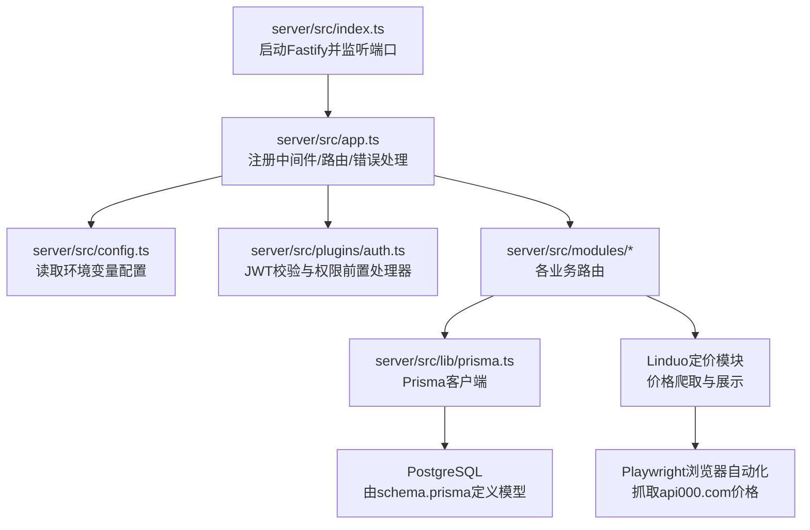
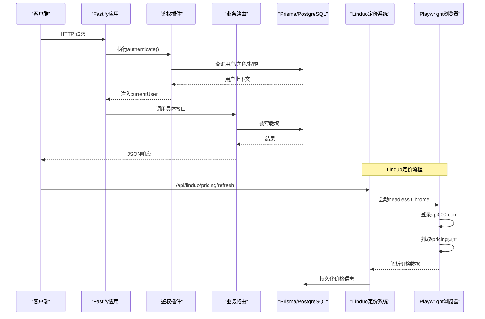
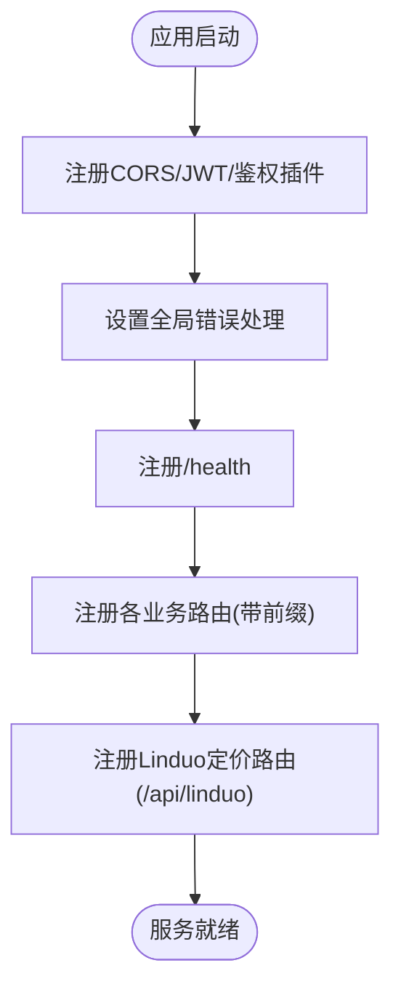
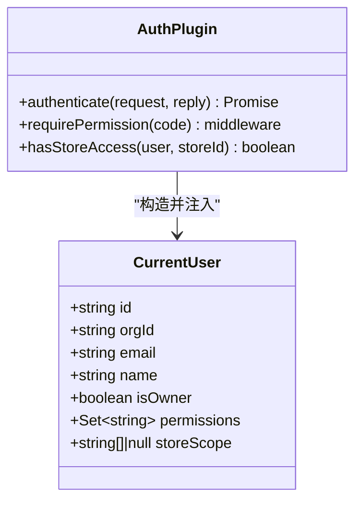
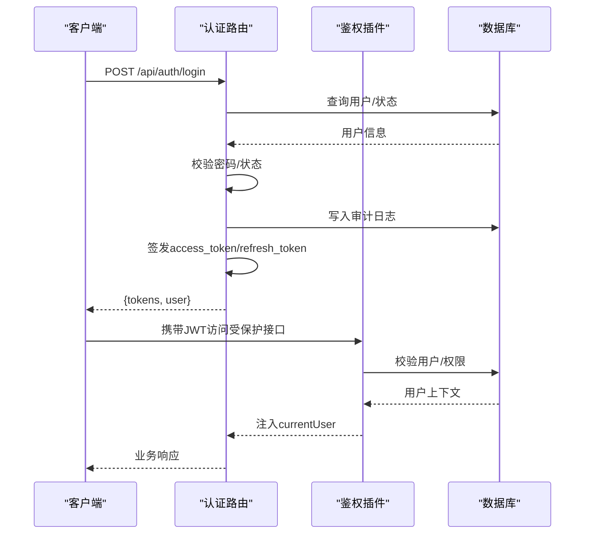
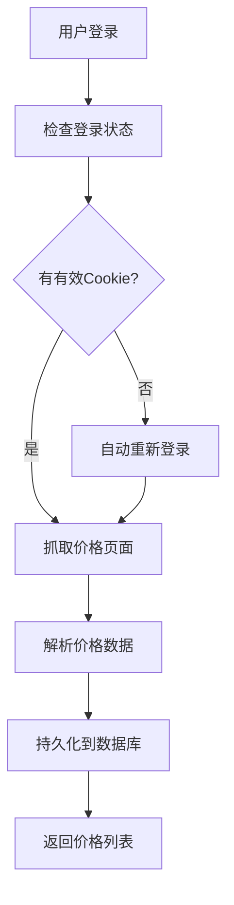
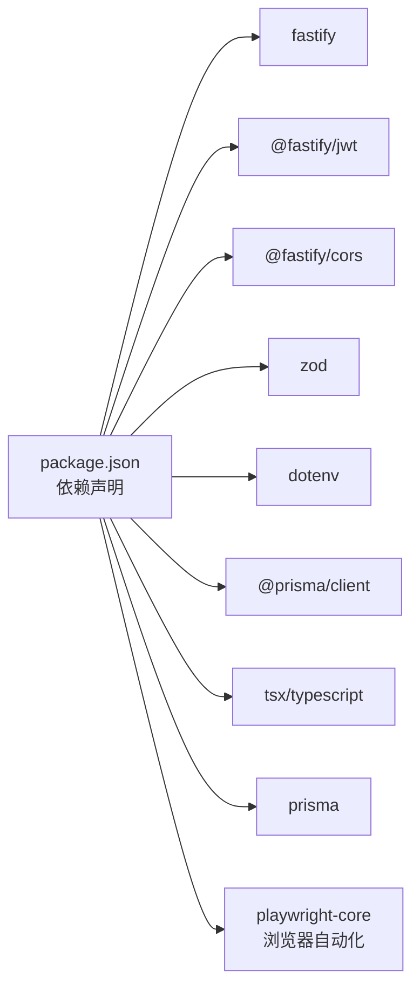

# 后端服务器基础设施

<cite>
**本文引用的文件**
- [server/src/app.ts](file://server/src/app.ts)
- [server/src/index.ts](file://server/src/index.ts)
- [server/package.json](file://server/package.json)
- [server/src/config.ts](file://server/src/config.ts)
- [server/prisma/schema.prisma](file://server/prisma/schema.prisma)
- [server/src/modules/auth/routes.ts](file://server/src/modules/auth/routes.ts)
- [server/src/plugins/auth.ts](file://server/src/plugins/auth.ts)
- [server/src/lib/prisma.ts](file://server/src/lib/prisma.ts)
- [src/main/serverConfig.ts](file://src/main/serverConfig.ts)
- [server/src/modules/linduo/pricing-routes.ts](file://server/src/modules/linduo/pricing-routes.ts)
- [server/src/modules/linduo/pricing-scraper.ts](file://server/src/modules/linduo/pricing-scraper.ts)
- [server/src/modules/linduo/pricing-login.ts](file://server/src/modules/linduo/pricing-login.ts)
- [server/src/modules/linduo/pricing-scheduler.ts](file://server/src/modules/linduo/pricing-scheduler.ts)
- [server/src/modules/linduo/types.ts](file://server/src/modules/linduo/types.ts)
- [server/prisma/migrations/20260826000000_linduo_pricing/migration.sql](file://server/prisma/migrations/20260826000000_linduo_pricing/migration.sql)
- [src/renderer/LinduoModelMallPage.tsx](file://src/renderer/LinduoModelMallPage.tsx)
</cite>

## 更新摘要
**所做更改**
- 新增 Linduo 模型定价系统章节，包含价格爬取器、API 路由、数据库模式和前端集成
- 更新应用装配部分，添加 Linduo 定价路由注册
- 更新配置中心，增加 Linduo 相关环境变量
- 新增调度器和登录态管理组件说明
- 更新数据模型，包含 Linduo 定价和登录会话表结构
- 新增前端模型广场页面集成说明

## 目录
1. [简介](#简介)
2. [项目结构](#项目结构)
3. [核心组件](#核心组件)
4. [架构总览](#架构总览)
5. [详细组件分析](#详细组件分析)
6. [依赖关系分析](#依赖关系分析)
7. [性能与可扩展性](#性能与可扩展性)
8. [故障排查指南](#故障排查指南)
9. [结论](#结论)
10. [附录](#附录)

## 简介
本仓库的后端服务基于 Fastify 构建，提供认证、权限、组织隔离、业务模块路由（如 eBay、合规、媒体、AI 等）以及统一的错误处理。数据层使用 Prisma 连接 PostgreSQL，并通过环境变量集中管理配置。Electron 主进程通过 serverConfig 决定本地或远程模式，从而决定是否拉起本地服务栈。

**新增功能**：Linduo 模型定价系统，支持 OpenAI、Google、Anthropic、Vidu 等厂商的模型价格爬取、比较和展示，包含自动登录、定时刷新、价格持久化等功能。

## 项目结构
后端服务位于 server 子目录，采用模块化路由组织：
- 应用入口与生命周期：index.ts
- 应用装配与中间件注册：app.ts
- 配置与环境变量：config.ts
- 数据库模型与迁移：prisma/schema.prisma
- 插件与鉴权：plugins/auth.ts
- 业务模块：modules/*（auth、members、roles、stores、ebay、compliance、media、ai、linduo 等）

**图表来源**
- [server/src/index.ts:1-22](file://server/src/index.ts#L1-L22)
- [server/src/app.ts:21-70](file://server/src/app.ts#L21-L70)
- [server/src/config.ts:9-37](file://server/src/config.ts#L9-L37)
- [server/src/plugins/auth.ts:33-75](file://server/src/plugins/auth.ts#L33-L75)
- [server/src/lib/prisma.ts:1-6](file://server/src/lib/prisma.ts#L1-L6)
- [server/prisma/schema.prisma:1-8](file://server/prisma/schema.prisma#L1-L8)

**章节来源**
- [server/src/index.ts:1-22](file://server/src/index.ts#L1-L22)
- [server/src/app.ts:21-70](file://server/src/app.ts#L21-L70)
- [server/package.json:6-23](file://server/package.json#L6-L23)

## 核心组件
- 应用装配器：统一注册 CORS、JWT、自定义鉴权插件、全局错误处理器与各业务路由前缀。
- 鉴权插件：解析 JWT，加载用户角色与权限集合，注入 currentUser，并提供 requirePermission 守卫。
- 认证路由：注册/登录/刷新令牌/登出/修改密码/获取当前用户，包含审计日志与种子数据初始化。
- 配置中心：集中读取端口、数据库、CORS、媒体存储、AI 网关等关键配置。
- 数据模型：Prisma schema 定义组织、用户、角色、权限、eBay 店铺/刊登、合规、采集选品等实体。
- **新增**：Linduo 定价系统：价格爬取器、登录态管理、定时调度器、API 路由和前端集成。

**章节来源**
- [server/src/app.ts:21-70](file://server/src/app.ts#L21-L70)
- [server/src/plugins/auth.ts:33-81](file://server/src/plugins/auth.ts#L33-L81)
- [server/src/modules/auth/routes.ts:33-225](file://server/src/modules/auth/routes.ts#L33-L225)
- [server/src/config.ts:9-37](file://server/src/config.ts#L9-L37)
- [server/prisma/schema.prisma:17-270](file://server/prisma/schema.prisma#L17-L270)

## 架构总览
后端以 Fastify 为 HTTP 框架，通过插件机制扩展能力；所有请求先经过全局错误处理与鉴权插件，再进入具体业务路由；数据访问统一通过 Prisma 客户端进行。Electron 主进程根据 serverConfig 判断是否启动本地服务栈，实现"本地开发/测试"与"远程生产"两种运行模式。

**新增 Linduo 定价架构**：通过 Playwright 自动化浏览器抓取 api000.com 价格页面，使用加密存储的凭据自动登录，定时任务每日刷新价格数据，前端提供模型广场界面进行价格比较。

**图表来源**
- [server/src/app.ts:26-68](file://server/src/app.ts#L26-L68)
- [server/src/plugins/auth.ts:36-68](file://server/src/plugins/auth.ts#L36-L68)
- [server/src/lib/prisma.ts:1-6](file://server/src/lib/prisma.ts#L1-L6)
- [server/src/modules/linduo/pricing-scraper.ts:77-125](file://server/src/modules/linduo/pricing-scraper.ts#L77-L125)

## 详细组件分析

### 应用装配与中间件（app.ts）
- 注册 CORS、JWT、自定义鉴权插件。
- 设置全局错误处理器：区分 Zod 校验错误、HttpError、客户端错误与内部错误，统一返回结构化错误体。
- 挂载健康检查 /health。
- 按前缀注册各业务路由：/api/auth、/api/members、/api/roles、/api/stores、/api/audit-logs、/api/dashboard、/api/collection、/api/compliance、/api/ebay、/api/media、/api/ai、/api/codex-harness、**/api/linduo**，以及媒体公共下载路由。

**图表来源**
- [server/src/app.ts:21-70](file://server/src/app.ts#L21-L70)

**章节来源**
- [server/src/app.ts:21-70](file://server/src/app.ts#L21-L70)

### 启动与生命周期（index.ts）
- 构建应用实例并监听 0.0.0.0:config.port。
- 捕获启动异常并退出。
- 监听 SIGINT/SIGTERM，优雅关闭应用并断开 Prisma 连接。
- **新增**：启动 Linduo 定价调度器，在应用启动后30秒首次执行价格抓取。

**章节来源**
- [server/src/index.ts:1-22](file://server/src/index.ts#L1-L22)

### 配置与环境变量（config.ts）
- 端口、数据库连接串、JWT 密钥与令牌有效期、CORS 源。
- 媒体驱动：local（本地磁盘）或 oss（阿里云 OSS），支持签名直读 URL。
- AI 网关：百炼、火山引擎 Ark、OpenAI 图像、DeepSeek 文本/视觉等 API 密钥与端点。
- **新增**：Linduo 配置：API Key、基础URL、价格爬取用户名密码、AES加密密钥、Chrome路径、刷新小时数。
- 所有配置通过环境变量注入，便于多环境部署。

**章节来源**
- [server/src/config.ts:1-37](file://server/src/config.ts#L1-L37)

### 鉴权插件（plugins/auth.ts）
- 扩展 FastifyRequest 增加 currentUser，扩展 FastifyInstance 提供 authenticate 与 requirePermission。
- authenticate：验证 JWT，加载用户、角色、权限与店铺授权范围，拒绝非活跃账号或组织不匹配。
- requirePermission：按权限码进行细粒度控制。
- hasStoreAccess：便捷判断用户对某店铺的访问范围。

**图表来源**
- [server/src/plugins/auth.ts:5-24](file://server/src/plugins/auth.ts#L5-L24)
- [server/src/plugins/auth.ts:33-81](file://server/src/plugins/auth.ts#L33-L81)

**章节来源**
- [server/src/plugins/auth.ts:1-81](file://server/src/plugins/auth.ts#L1-L81)

### 认证路由（modules/auth/routes.ts）
- 注册：首次安装自动创建默认组织与预置角色，首个用户成为 Owner 并直接登录；已有组织则提交待审核申请。
- 登录：校验手机号与密码，更新最后登录时间，记录审计日志，签发 access_token 与 refresh_token。
- 刷新令牌：校验并吊销旧 refresh token，签发新令牌。
- 登出：吊销指定或全部刷新令牌，记录审计日志。
- 修改密码：校验原密码，更新哈希并吊销全部刷新令牌。
- 获取当前用户：返回用户资料、组织、角色、权限与店铺授权范围。

**图表来源**
- [server/src/modules/auth/routes.ts:33-225](file://server/src/modules/auth/routes.ts#L33-L225)
- [server/src/plugins/auth.ts:36-68](file://server/src/plugins/auth.ts#L36-L68)

**章节来源**
- [server/src/modules/auth/routes.ts:1-226](file://server/src/modules/auth/routes.ts#L1-L226)

### Linduo 定价系统（新增）

#### 定价路由（pricing-routes.ts）
- GET /api/linduo/pricing：从数据库获取最新价格，无数据时回退到兜底列表
- GET /api/linduo/login/status：查询登录状态和Cookie过期时间
- POST /api/linduo/login：用户名密码自动登录，保存加密密码到数据库
- POST /api/linduo/logout：清除登录态
- POST /api/linduo/pricing/refresh：立即触发一次价格抓取

**图表来源**
- [server/src/modules/linduo/pricing-routes.ts:53-116](file://server/src/modules/linduo/pricing-routes.ts#L53-L116)

#### 价格爬取器（pricing-scraper.ts）
- 使用 Playwright Core 启动 headless Chrome 浏览器
- 自动登录 api000.com 并维护 Cookie 会话
- 智能解析价格卡片，支持多种选择器策略
- 识别不同供应商（OpenAI、Google、Anthropic、Vidu）
- 失败时回退到预设价格数据，标记 stale=true

#### 登录态管理（pricing-login.ts）
- 使用 AES-256-GCM 加密存储用户密码
- 管理 Cookie 会话和过期时间
- 自动检测是否需要重新登录
- 安全地解密密码用于自动重登

#### 定时调度器（pricing-scheduler.ts）
- 应用启动后30秒首次执行价格抓取
- 每天固定时间（默认6点）自动刷新价格
- 失败时标记所有价格为陈旧状态
- 成功时更新数据并重置 stale 标志

**章节来源**
- [server/src/modules/linduo/pricing-routes.ts:1-117](file://server/src/modules/linduo/pricing-routes.ts#L1-L117)
- [server/src/modules/linduo/pricing-scraper.ts:1-399](file://server/src/modules/linduo/pricing-scraper.ts#L1-L399)
- [server/src/modules/linduo/pricing-login.ts:1-120](file://server/src/modules/linduo/pricing-login.ts#L1-L120)
- [server/src/modules/linduo/pricing-scheduler.ts:1-77](file://server/src/modules/linduo/pricing-scheduler.ts#L1-L77)

### 数据模型（prisma/schema.prisma）
- 组织与用户：Organization、User、Role、RolePermission、UserRole、UserStoreGrant。
- 认证与审计：AuthToken、AuditLog。
- AI 用量与配额：AiUsageLog、AiQuota。
- 选品/采集域：SelectionTask、SupplyPlatform、CollectionTaskPlatform、MarketplacePlatform、ProductWarehouse、MarketplaceAccount、TaskSelectionRule、ProductEvaluation、EvaluationEvidence、ProductRiskFlag、ProductRejectionRecord、MarketCandidate、SupplyCandidate、CandidateCollectionRun、CandidateCollectionRecord、ProductIntakeRegistry。
- 工作流与订单：ComparisonRecord、SelectionRecord、InventoryRecord、ListingRecord、WorkflowEvent、PurchaseOrder、ReconciliationRecord。
- 供应仓与发布：SupplyWarehouseProduct、MarketplaceSelectionProduct、MarketplaceMediaAsset、MarketplacePublishDraft、MarketplacePublishAudit。
- eBay 相关：EbayStore、EbayListing、EbayLocalProduct、EbayOptimizationDraft、EbayPublishTask 等。
- 合规：ComplianceSource、ComplianceRules、ComplianceTasks、ComplianceAlerts 等。
- **新增**：Linduo 定价：LinduoModelPricing、LinduoLoginSession。

**章节来源**
- [server/prisma/schema.prisma:17-800](file://server/prisma/schema.prisma#L17-L800)

### Electron 侧服务端地址配置（src/main/serverConfig.ts）
- 持久化 server-config.json，保存用户配置的服务器地址。
- 未配置时回退到默认中央服务器地址。
- 检测是否为本地地址（127.0.0.1/localhost），用于决定是否拉起本地服务栈。

**章节来源**
- [src/main/serverConfig.ts:1-49](file://src/main/serverConfig.ts#L1-L49)

### 前端模型广场（新增）
- 展示45个聚合大模型（OpenAI 22 / Google 10 / Anthropic 10 / Vidu 3）
- 支持按供应商和能力筛选
- 实时显示模型价格（输入/输出/缓存价）
- 提供立即抓取价格功能
- 显示价格陈旧状态警告

**章节来源**
- [src/renderer/LinduoModelMallPage.tsx:1-400](file://src/renderer/LinduoModelMallPage.tsx#L1-L400)

## 依赖关系分析
- 运行时依赖：fastify、@fastify/cors、@fastify/jwt、zod、dotenv、@prisma/client。
- 开发依赖：tsx、typescript、prisma、pglite（用于开发/测试）。
- **新增**：playwright-core（用于浏览器自动化抓取）。
- 脚本命令：dev/build/start/typecheck、prisma generate/migrate、各类 verify 脚本用于功能验证。

**图表来源**
- [server/package.json:28-44](file://server/package.json#L28-L44)

**章节来源**
- [server/package.json:1-46](file://server/package.json#L1-L46)

## 性能与可扩展性
- 中间件顺序：CORS → JWT → 自定义鉴权 → 业务路由。将错误处理置于路由之前，确保一致的错误响应格式。
- 数据库连接：单例 Prisma 客户端，建议在生产环境启用连接池与慢查询日志。
- 配置外置：所有敏感信息与运行参数通过环境变量注入，便于容器化与多环境管理。
- 可扩展点：新增业务模块只需在 app.ts 中注册路由前缀，并在 modules 下实现 routes.ts；权限控制通过 requirePermission 快速接入。
- **新增**：Linduo 定价系统采用异步调度，避免阻塞主线程；浏览器实例复用减少资源消耗；价格数据缓存提升响应速度。

## 故障排查指南
- 启动失败：检查 index.ts 的端口占用与数据库连通性；查看控制台错误日志。
- 认证失败：确认 JWT_SECRET、ACCESS_TOKEN_TTL、REFRESH_TOKEN_TTL_DAYS 配置正确；检查用户状态是否为 ACTIVE。
- 权限不足：确认角色权限已分配，或通过 requirePermission 守卫限制访问。
- 媒体访问：MEDIA_DRIVER=local 时需确保 MEDIA_LOCAL_DIR 可写；OSS 模式下需配置正确的 Bucket/Endpoint/Key。
- 健康检查：GET /health 应返回 ok 与时间戳，用于探针与健康检查。
- **新增**：Linduo 定价问题：
  - 浏览器启动失败：检查 LINDUO_PRICING_CHROME_PATH 配置是否正确
  - 登录失败：确认 LINDUO_PRICING_USERNAME 和 LINDUO_PRICING_PASSWORD 配置正确
  - 价格抓取失败：检查网络连接和 api000.com 网站可用性
  - Cookie 失效：系统会自动重新登录，如失败请检查加密密钥配置

**章节来源**
- [server/src/index.ts:7-21](file://server/src/index.ts#L7-L21)
- [server/src/modules/auth/routes.ts:152-225](file://server/src/modules/auth/routes.ts#L152-L225)
- [server/src/plugins/auth.ts:36-75](file://server/src/plugins/auth.ts#L36-L75)
- [server/src/config.ts:9-37](file://server/src/config.ts#L9-L37)
- [server/src/app.ts:53-53](file://server/src/app.ts#L53-L53)

## 结论
该后端服务以 Fastify 为核心，结合 Prisma 与模块化路由，提供了完善的认证、权限、组织隔离与丰富的业务模块。通过环境变量与插件机制，具备良好的可配置性与可扩展性。配合 Electron 主进程的本地/远程模式切换，可满足开发与生产环境的差异化需求。

**新增功能亮点**：Linduo 模型定价系统实现了跨厂商模型价格的自动化采集、比较和展示，为开发者提供了便捷的模型选型工具，支持 OpenAI、Google、Anthropic、Vidu 等主流厂商的价格对比。

## 附录
- 常用命令
  - 开发：pnpm dev
  - 构建：pnpm build
  - 启动：pnpm start
  - 类型检查：pnpm typecheck
  - Prisma 生成/迁移：pnpm prisma:generate / pnpm prisma:migrate
- 环境变量要点
  - PORT、DATABASE_URL、JWT_SECRET、ACCESS_TOKEN_TTL、REFRESH_TOKEN_TTL_DAYS、CORS_ORIGIN
  - MEDIA_DRIVER、MEDIA_LOCAL_DIR、MEDIA_PUBLIC_BASE_URL、MEDIA_SIGNING_SECRET、OSS_*
  - BAILIAN_*、ARK_*、OPENAI_IMAGE_*、DEEPSEEK_*
  - **新增**：LINDUO_API_KEY、LINDUO_BASE_URL、LINDUO_PRICING_USERNAME、LINDUO_PRICING_PASSWORD、LINDUO_PRICING_AES_KEY、LINDUO_PRICING_CHROME_PATH、LINDUO_PRICING_BASE_URL、LINDUO_PRICING_REFRESH_HOUR