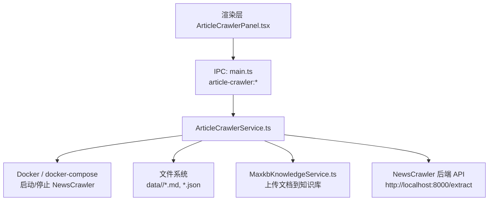
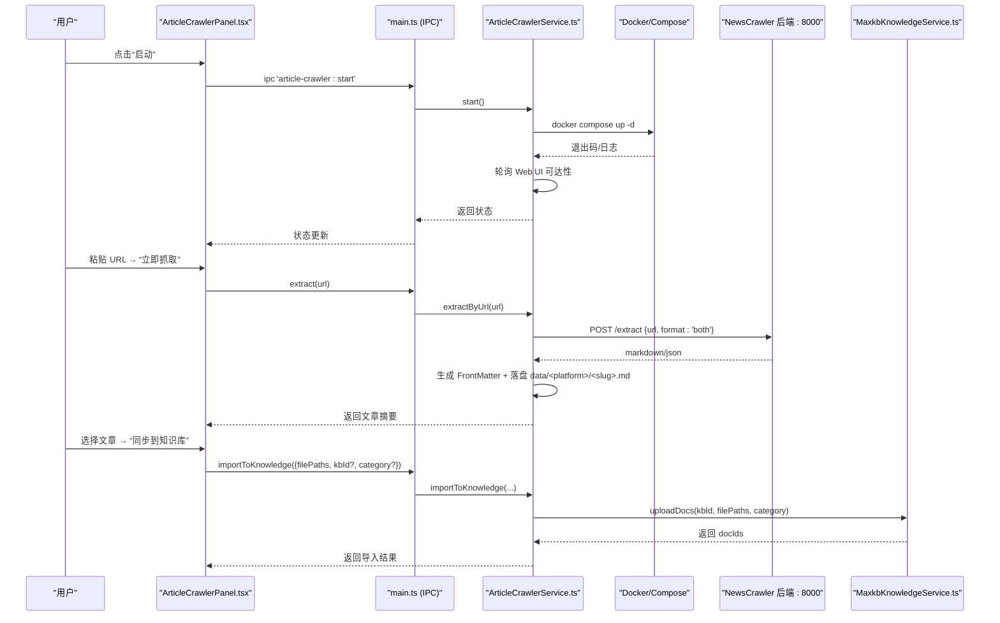
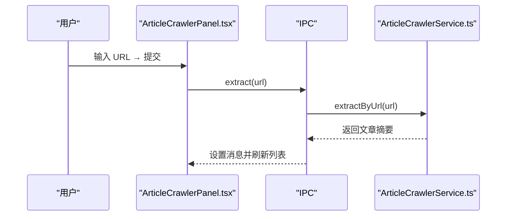
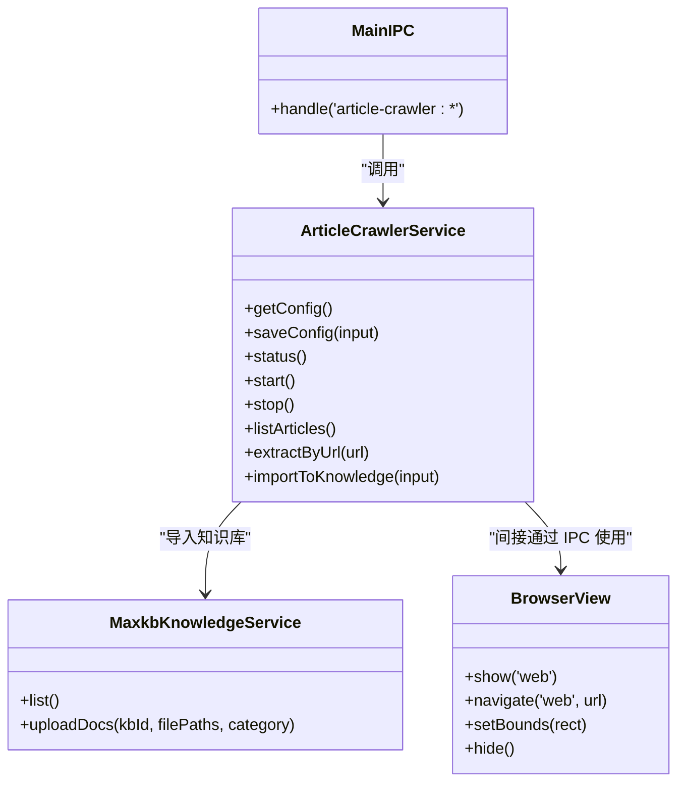

# 文章爬虫服务

<cite>
**本文引用的文件**
- [ArticleCrawlerService.ts](file://src/main/services/ArticleCrawlerService.ts)
- [ArticleCrawlerPanel.tsx](file://src/renderer/ArticleCrawlerPanel.tsx)
- [MaxkbKnowledgeService.ts](file://src/main/services/MaxkbKnowledgeService.ts)
- [main.ts](file://src/main/main.ts)
</cite>

## 目录
1. [简介](#简介)
2. [项目结构](#项目结构)
3. [核心组件](#核心组件)
4. [架构总览](#架构总览)
5. [详细组件分析](#详细组件分析)
6. [依赖关系分析](#依赖关系分析)
7. [性能与可靠性](#性能与可靠性)
8. [故障排查指南](#故障排查指南)
9. [结论](#结论)

## 简介
本服务为桌面端“文章抓取”能力，集成外部开源抓取工具 NewsCrawler（通过 Docker Compose 管理），提供：
- 一键启动/停止抓取服务
- 内嵌 Web UI 查看与管理抓取任务
- 扫描本地抓取产物（Markdown/JSON）并展示元信息
- 将单篇或批量抓取结果上传至 MaxKB 知识库，支持分类标签
- 直接调用 NewsCrawler 后端接口进行“立即抓取”，自动落盘到 data 目录

该服务遵循“零侵入”原则：不修改 NewsCrawler 源码，仅作为桌面端的可选工具，状态持久化在用户数据目录。

## 项目结构
- 主进程服务层：封装 NewsCrawler 启停、状态检测、数据扫描、知识库同步等
- 渲染层面板：提供可视化操作入口（状态条、内嵌浏览器、抓取记录抽屉、导入配置）
- IPC 路由：主进程暴露 article-crawler:* 事件供前端调用
- 知识库服务：复用 MaxkbKnowledgeService 完成文档上传与分类

**图表来源**
- [ArticleCrawlerPanel.tsx:107-168](file://src/renderer/ArticleCrawlerPanel.tsx#L107-L168)
- [main.ts:2220-2235](file://src/main/main.ts#L2220-L2235)
- [ArticleCrawlerService.ts:281-363](file://src/main/services/ArticleCrawlerService.ts#L281-L363)
- [ArticleCrawlerService.ts:381-442](file://src/main/services/ArticleCrawlerService.ts#L381-L442)
- [ArticleCrawlerService.ts:449-479](file://src/main/services/ArticleCrawlerService.ts#L449-L479)
- [ArticleCrawlerService.ts:482-536](file://src/main/services/ArticleCrawlerService.ts#L482-L536)

**章节来源**
- [ArticleCrawlerService.ts:1-115](file://src/main/services/ArticleCrawlerService.ts#L1-L115)
- [ArticleCrawlerPanel.tsx:1-168](file://src/renderer/ArticleCrawlerPanel.tsx#L1-L168)
- [main.ts:270-273](file://src/main/main.ts#L270-L273)
- [main.ts:2220-2235](file://src/main/main.ts#L2220-L2235)

## 核心组件
- ArticleCrawlerService：负责配置加载/持久化、环境探测（Docker/Compose）、服务启停、Web UI 可达性检查、抓取产物扫描与解析、直接抓取并落盘、上传到 MaxKB
- ArticleCrawlerPanel：UI 交互层，轮询状态、控制启停、打开安装/数据目录、表单触发抓取、选择目标知识库与分类、预览与同步
- MaxkbKnowledgeService：知识库列表、文档上传、分类元数据写入（服务端 meta.category）
- main.ts：注册 article-crawler:* IPC 处理器，桥接前端与服务

关键类型与职责：
- CrawlerConfig/CrawlerStatus：配置项与运行态健康检查
- CrawlerArticleSummary：统一的文章摘要（平台、标题、URL、作者、发布时间、大小、字符数、内容、格式）
- CrawlerImportResult：导入结果（成功/失败明细）

**章节来源**
- [ArticleCrawlerService.ts:25-65](file://src/main/services/ArticleCrawlerService.ts#L25-L65)
- [ArticleCrawlerService.ts:233-267](file://src/main/services/ArticleCrawlerService.ts#L233-L267)
- [ArticleCrawlerPanel.tsx:17-57](file://src/renderer/ArticleCrawlerPanel.tsx#L17-L57)
- [MaxkbKnowledgeService.ts:187-194](file://src/main/services/MaxkbKnowledgeService.ts#L187-L194)

## 架构总览

**图表来源**
- [ArticleCrawlerPanel.tsx:170-271](file://src/renderer/ArticleCrawlerPanel.tsx#L170-L271)
- [main.ts:2220-2235](file://src/main/main.ts#L2220-L2235)
- [ArticleCrawlerService.ts:309-343](file://src/main/services/ArticleCrawlerService.ts#L309-L343)
- [ArticleCrawlerService.ts:482-536](file://src/main/services/ArticleCrawlerService.ts#L482-L536)
- [ArticleCrawlerService.ts:449-479](file://src/main/services/ArticleCrawlerService.ts#L449-L479)
- [MaxkbKnowledgeService.ts:187-194](file://src/main/services/MaxkbKnowledgeService.ts#L187-L194)

## 详细组件分析

### ArticleCrawlerService（服务层）
- 配置与状态
  - 从 userData 目录读取/写入 article-crawler-state.json，默认安装路径 ~/NewsCrawler，data 目录位于安装目录下
  - 提供 getConfig/saveConfig/pickInstallPath/openInstallDir/openDataDir 等方法
- 环境探测
  - 检测 docker/docker-compose（兼容 v1/v2），扩展 PATH 以覆盖 Electron 默认 PATH 缺失的常见目录
  - 通过 GET 请求 Web UI 地址判断服务是否就绪
- 服务生命周期
  - start：校验 docker-compose.yml 存在、docker 可用、compose 子命令可用；执行 docker compose up -d，带超时保护；轮询 Web UI 可达
  - stop：执行 docker compose down，忽略失败但继续刷新状态
- 数据扫描
  - listArticles：递归扫描 data 目录，解析 .md（FrontMatter + 正文）与 .json（texts 数组拼接），归一化为 CrawlerArticleSummary 并按发布时间排序
- 直接抓取
  - extractByUrl：POST 到 NewsCrawler 后端 /extract，获取 markdown/json，构造 FrontMatter 并保存到 data/<platform>/<slug>.md，返回摘要
- 知识库导入
  - importToKnowledge：动态导入 MaxkbKnowledgeService，选择目标 KB（优先指定 kbId，否则按 agent key 顺序选择），逐篇上传并间隔 2 秒，返回成功/失败明细

复杂度与性能要点：
- listArticles 为 O(N) 遍历文件，I/O 密集；大目录建议分页/增量刷新
- importToKnowledge 串行上传，每篇固定 2 秒间隔，避免对 MaxKB 造成压力
- 启动/停止均包含超时与错误处理，保证健壮性

**章节来源**
- [ArticleCrawlerService.ts:77-114](file://src/main/services/ArticleCrawlerService.ts#L77-L114)
- [ArticleCrawlerService.ts:116-208](file://src/main/services/ArticleCrawlerService.ts#L116-L208)
- [ArticleCrawlerService.ts:233-267](file://src/main/services/ArticleCrawlerService.ts#L233-L267)
- [ArticleCrawlerService.ts:281-363](file://src/main/services/ArticleCrawlerService.ts#L281-L363)
- [ArticleCrawlerService.ts:381-442](file://src/main/services/ArticleCrawlerService.ts#L381-L442)
- [ArticleCrawlerService.ts:449-479](file://src/main/services/ArticleCrawlerService.ts#L449-L479)
- [ArticleCrawlerService.ts:482-536](file://src/main/services/ArticleCrawlerService.ts#L482-L536)

### ArticleCrawlerPanel（渲染层）
- 状态轮询：每 5 秒调用 status，首次挂载时拉取 articles 与 kb 列表
- BrowserView 复用：根据容器尺寸自适应显示 NewsCrawler Web UI，并在 Web UI 可达后自动导航
- 控制流程：启动/停止、打开安装/数据目录、表单提交 URL 触发抓取、单篇/批量导入知识库
- 导入配置：可选择目标知识库与分类标签，批量导入前二次确认并提示耗时
- 预览：弹窗展示 Markdown 内容

交互时序（节选）：

**图表来源**
- [ArticleCrawlerPanel.tsx:107-168](file://src/renderer/ArticleCrawlerPanel.tsx#L107-L168)
- [ArticleCrawlerPanel.tsx:208-224](file://src/renderer/ArticleCrawlerPanel.tsx#L208-L224)
- [main.ts:2220-2235](file://src/main/main.ts#L2220-L2235)
- [ArticleCrawlerService.ts:482-536](file://src/main/services/ArticleCrawlerService.ts#L482-L536)

**章节来源**
- [ArticleCrawlerPanel.tsx:92-168](file://src/renderer/ArticleCrawlerPanel.tsx#L92-L168)
- [ArticleCrawlerPanel.tsx:170-271](file://src/renderer/ArticleCrawlerPanel.tsx#L170-L271)
- [ArticleCrawlerPanel.tsx:273-429](file://src/renderer/ArticleCrawlerPanel.tsx#L273-L429)

### MaxkbKnowledgeService（知识库服务）
- 列出知识库：缓存 30 秒，按名称匹配智能体归类（ops/compliance/sourcing/listing）
- 上传文档：调用 admin API 上传文件，MaxKB 自动解析；支持 doc.meta.category 同步
- 限制说明：v2.10.5-lts CE 不支持通过 API 创建/删除知识库，需手动在控制台管理

**章节来源**
- [MaxkbKnowledgeService.ts:1-117](file://src/main/services/MaxkbKnowledgeService.ts#L1-L117)
- [MaxkbKnowledgeService.ts:119-194](file://src/main/services/MaxkbKnowledgeService.ts#L119-L194)

### IPC 路由（main.ts）
- 注册 article-crawler:* 系列事件，映射到 ArticleCrawlerService 方法
- 初始化时加载服务配置，捕获异常并输出警告

**章节来源**
- [main.ts:270-273](file://src/main/main.ts#L270-L273)
- [main.ts:2220-2235](file://src/main/main.ts#L2220-L2235)

## 依赖关系分析

**图表来源**
- [ArticleCrawlerService.ts:233-536](file://src/main/services/ArticleCrawlerService.ts#L233-L536)
- [MaxkbKnowledgeService.ts:187-194](file://src/main/services/MaxkbKnowledgeService.ts#L187-L194)
- [main.ts:2220-2235](file://src/main/main.ts#L2220-L2235)
- [ArticleCrawlerPanel.tsx:143-168](file://src/renderer/ArticleCrawlerPanel.tsx#L143-L168)

**章节来源**
- [ArticleCrawlerService.ts:233-536](file://src/main/services/ArticleCrawlerService.ts#L233-L536)
- [MainIPC:2220-2235](file://src/main/main.ts#L2220-L2235)

## 性能与可靠性
- 启动/停止
  - 使用超时保护（如 90 秒启动等待、30 秒健康检查），避免阻塞主进程
  - 扩展 PATH 确保 docker 子进程能找到 curl/git 等工具
- 数据扫描
  - 递归扫描 data 目录，限制深度防止极端情况；解析失败跳过并记录警告
- 导入知识库
  - 串行上传，每篇间隔 2 秒，降低服务端压力；失败不影响其他文件
- 网络请求
  - 使用 AbortController 控制超时，避免长时间挂起

优化建议：
- 对于大量抓取记录的 listArticles，可考虑分页或增量对比（基于文件名/时间戳）
- 导入知识库可改为有限并发（如 2-3 并发）+ 重试机制，提升吞吐同时保持稳定性

[本节为通用指导，无需特定文件引用]

## 故障排查指南
常见问题与定位：
- 未检测到 docker/docker-compose
  - 现象：状态提示未检测到命令；无法启动
  - 处理：安装 Docker Desktop/OrbStack，并确保 PATH 包含对应 bin 目录
- 未找到 docker-compose.yml
  - 现象：启动时报错；提示安装目录无效
  - 处理：在系统管理配置正确的安装路径，或克隆 NewsCrawler 仓库
- Web UI 不可达
  - 现象：状态为 STOPPED；启动后仍不可用
  - 处理：检查端口占用、防火墙、容器日志；稍后重试
- 抓取失败
  - 现象：立即抓取报错或无产出
  - 处理：确认 URL 有效；检查 NewsCrawler 后端响应；查看 data 目录是否有新文件
- 导入知识库失败
  - 现象：部分或全部上传失败
  - 处理：检查 MAXKB_BASE_URL/MAXKB_ADMIN_TOKEN 配置；确认目标知识库存在；查看失败原因

**章节来源**
- [ArticleCrawlerService.ts:176-208](file://src/main/services/ArticleCrawlerService.ts#L176-L208)
- [ArticleCrawlerService.ts:309-363](file://src/main/services/ArticleCrawlerService.ts#L309-L363)
- [ArticleCrawlerService.ts:482-536](file://src/main/services/ArticleCrawlerService.ts#L482-L536)
- [ArticleCrawlerService.ts:449-479](file://src/main/services/ArticleCrawlerService.ts#L449-L479)

## 结论
文章爬虫服务以最小侵入方式集成 NewsCrawler，提供开箱即用的抓取、管理与知识库同步能力。通过清晰的 IPC 分层、稳健的错误处理与超时保护，以及友好的 UI 交互，满足跨平台文章的采集与知识沉淀需求。后续可在数据扫描与导入阶段引入分页/并发策略，进一步提升大规模场景下的性能与体验。