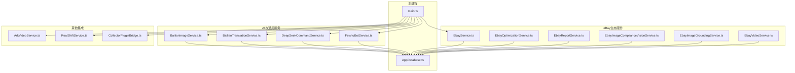
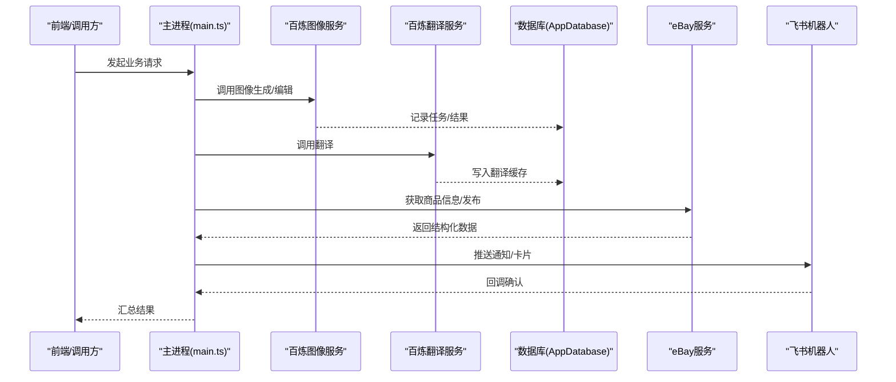
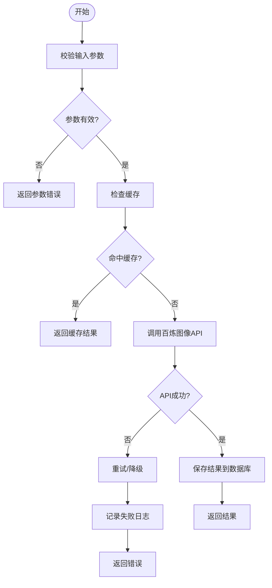
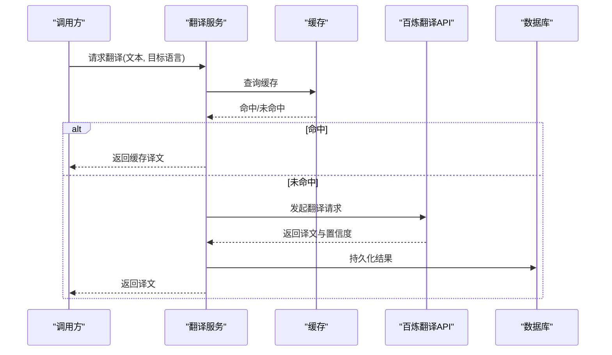
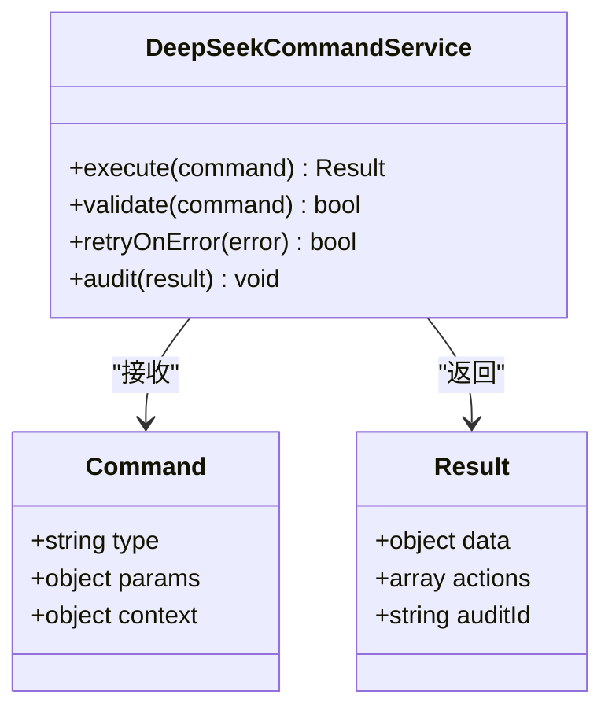
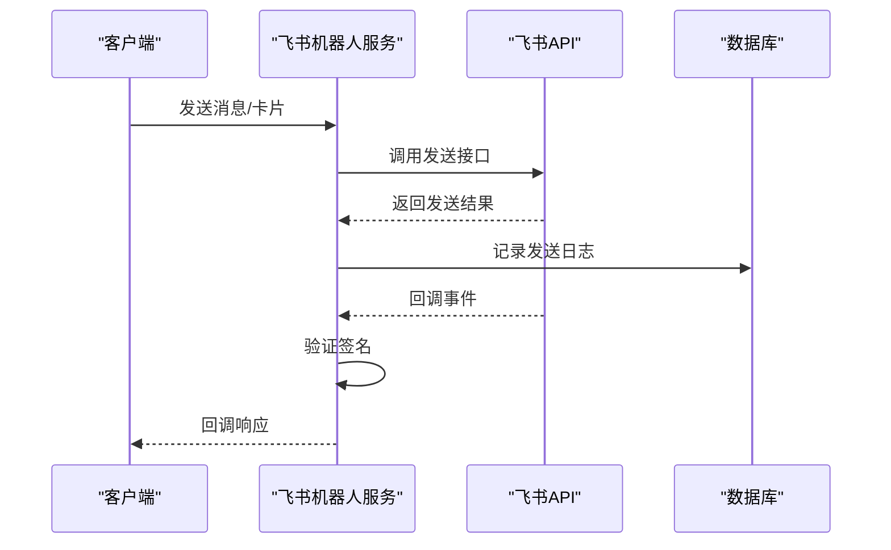
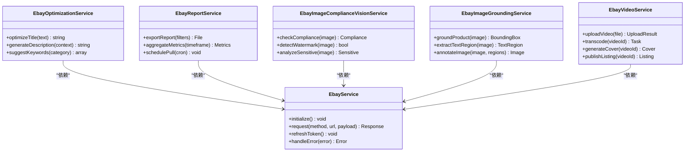
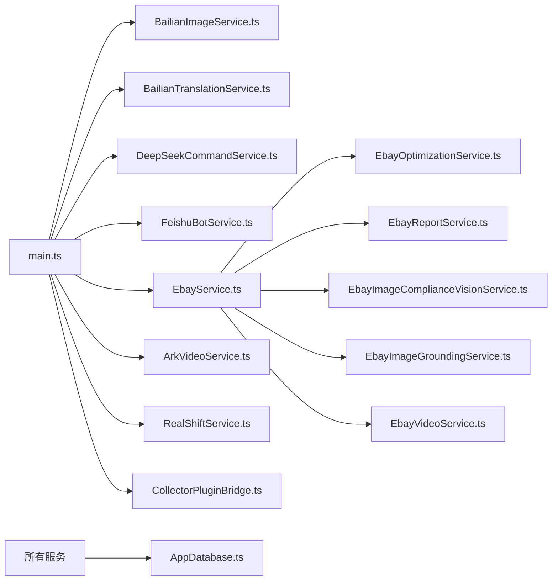

# 核心服务

<cite>
**本文引用的文件**   
- [src/main/services/BailianImageService.ts](file://src/main/services/BailianImageService.ts)
- [src/main/services/BailianTranslationService.ts](file://src/main/services/BailianTranslationService.ts)
- [src/main/services/DeepSeekCommandService.ts](file://src/main/services/DeepSeekCommandService.ts)
- [src/main/services/FeishuBotService.ts](file://src/main/services/FeishuBotService.ts)
- [src/main/services/EbayService.ts](file://src/main/services/EbayService.ts)
- [src/main/services/EbayOptimizationService.ts](file://src/main/services/EbayOptimizationService.ts)
- [src/main/services/EbayReportService.ts](file://src/main/services/EbayReportService.ts)
- [src/main/services/EbayImageComplianceVisionService.ts](file://src/main/services/EbayImageComplianceVisionService.ts)
- [src/main/services/EbayImageGroundingService.ts](file://src/main/services/EbayImageGroundingService.ts)
- [src/main/services/EbayVideoService.ts](file://src/main/services/EbayVideoService.ts)
- [src/main/services/ArkVideoService.ts](file://src/main/services/ArkVideoService.ts)
- [src/main/services/RealShiftService.ts](file://src/main/services/RealShiftService.ts)
- [src/main/services/CollectorPluginBridge.ts](file://src/main/services/CollectorPluginBridge.ts)
- [src/main/database/AppDatabase.ts](file://src/main/database/AppDatabase.ts)
- [src/main/main.ts](file://src/main/main.ts)
- [package.json](file://package.json)
</cite>

## 目录
1. [简介](#简介)
2. [项目结构](#项目结构)
3. [核心组件](#核心组件)
4. [架构总览](#架构总览)
5. [详细组件分析](#详细组件分析)
6. [依赖关系分析](#依赖关系分析)
7. [性能考量](#性能考量)
8. [故障排查指南](#故障排查指南)
9. [结论](#结论)
10. [附录](#附录)

## 简介
本文件面向“砚都跨境”项目的核心服务模块，聚焦于AI与第三方API集成能力，包括百炼图像服务、翻译服务、DeepSeek命令服务、飞书机器人服务，以及与eBay生态（商品优化、合规视觉、视频处理等）的集成。文档从系统架构、组件职责、接口定义、配置参数、错误处理机制、调用时序与异常策略等方面进行全面说明，并提供最佳实践建议，帮助读者快速理解并正确使用各服务。

## 项目结构
核心服务位于 src/main/services 目录下，按能力域划分：
- AI与通用能力：BailianImageService、BailianTranslationService、DeepSeekCommandService、FeishuBotService
- eBay生态：EbayService、EbayOptimizationService、EbayReportService、EbayImageComplianceVisionService、EbayImageGroundingService、EbayVideoService
- 其他集成：ArkVideoService、RealShiftService、CollectorPluginBridge
- 数据层：AppDatabase
- 入口：main.ts

图表来源
- [src/main/main.ts](file://src/main/main.ts)
- [src/main/database/AppDatabase.ts](file://src/main/database/AppDatabase.ts)
- [src/main/services/BailianImageService.ts](file://src/main/services/BailianImageService.ts)
- [src/main/services/BailianTranslationService.ts](file://src/main/services/BailianTranslationService.ts)
- [src/main/services/DeepSeekCommandService.ts](file://src/main/services/DeepSeekCommandService.ts)
- [src/main/services/FeishuBotService.ts](file://src/main/services/FeishuBotService.ts)
- [src/main/services/EbayService.ts](file://src/main/services/EbayService.ts)
- [src/main/services/EbayOptimizationService.ts](file://src/main/services/EbayOptimizationService.ts)
- [src/main/services/EbayReportService.ts](file://src/main/services/EbayReportService.ts)
- [src/main/services/EbayImageComplianceVisionService.ts](file://src/main/services/EbayImageComplianceVisionService.ts)
- [src/main/services/EbayImageGroundingService.ts](file://src/main/services/EbayImageGroundingService.ts)
- [src/main/services/EbayVideoService.ts](file://src/main/services/EbayVideoService.ts)
- [src/main/services/ArkVideoService.ts](file://src/main/services/ArkVideoService.ts)
- [src/main/services/RealShiftService.ts](file://src/main/services/RealShiftService.ts)
- [src/main/services/CollectorPluginBridge.ts](file://src/main/services/CollectorPluginBridge.ts)

章节来源
- [src/main/main.ts](file://src/main/main.ts)
- [package.json](file://package.json)

## 核心组件
本节概述各服务的职责边界与对外能力，便于快速定位与使用。

- 百炼图像服务（BailianImageService）
  - 职责：调用百炼平台进行图像生成/编辑/增强等能力。
  - 典型输入：图像URL或二进制、提示词、风格参数、尺寸等。
  - 典型输出：结果图URL、元数据、任务ID。
  - 错误处理：网络重试、限流退避、失败回退（如降级为默认模板）。

- 百炼翻译服务（BailianTranslationService）
  - 职责：多语言文本翻译、术语一致性校验、批量翻译。
  - 典型输入：源文本、目标语言、领域术语表。
  - 典型输出：译文、置信度、术语命中统计。
  - 错误处理：超时重试、语种不支持回退、缓存命中优先。

- DeepSeek命令服务（DeepSeekCommandService）
  - 职责：解析与执行结构化命令（如内容生成、审核、摘要），对接DeepSeek模型。
  - 典型输入：命令JSON、上下文、约束条件。
  - 典型输出：结构化结果、可执行动作、审计日志。
  - 错误处理：命令校验失败、模型不可用降级、幂等重试。

- 飞书机器人服务（FeishuBotService）
  - 职责：消息推送、卡片交互、事件回调处理、审批联动。
  - 典型输入：消息体、卡片模板、回调签名。
  - 典型输出：消息发送结果、回调响应、状态同步。
  - 错误处理：签名校验失败、频控限制、重试队列。

- eBay生态服务群
  - EbayService：基础会话、认证、通用请求封装。
  - EbayOptimizationService：标题/描述优化、关键词推荐、A+内容建议。
  - EbayReportService：报表导出、指标聚合、定时拉取。
  - EbayImageComplianceVisionService：图片合规检测（尺寸、比例、水印、敏感元素）。
  - EbayImageGroundingService：图像标注与定位（产品区域、文字区域）。
  - EbayVideoService：视频上传、转码、封面生成、发布。

- 其他集成
  - ArkVideoService：视频处理管线（剪辑、字幕、混音）。
  - RealShiftService：价格/库存同步、汇率转换、市场策略计算。
  - CollectorPluginBridge：采集插件桥接，统一数据采集接口。

章节来源
- [src/main/services/BailianImageService.ts](file://src/main/services/BailianImageService.ts)
- [src/main/services/BailianTranslationService.ts](file://src/main/services/BailianTranslationService.ts)
- [src/main/services/DeepSeekCommandService.ts](file://src/main/services/DeepSeekCommandService.ts)
- [src/main/services/FeishuBotService.ts](file://src/main/services/FeishuBotService.ts)
- [src/main/services/EbayService.ts](file://src/main/services/EbayService.ts)
- [src/main/services/EbayOptimizationService.ts](file://src/main/services/EbayOptimizationService.ts)
- [src/main/services/EbayReportService.ts](file://src/main/services/EbayReportService.ts)
- [src/main/services/EbayImageComplianceVisionService.ts](file://src/main/services/EbayImageComplianceVisionService.ts)
- [src/main/services/EbayImageGroundingService.ts](file://src/main/services/EbayImageGroundingService.ts)
- [src/main/services/EbayVideoService.ts](file://src/main/services/EbayVideoService.ts)
- [src/main/services/ArkVideoService.ts](file://src/main/services/ArkVideoService.ts)
- [src/main/services/RealShiftService.ts](file://src/main/services/RealShiftService.ts)
- [src/main/services/CollectorPluginBridge.ts](file://src/main/services/CollectorPluginBridge.ts)

## 架构总览
整体采用“主进程 + 服务模块 + 数据层”的分层架构。主进程负责初始化与路由分发；服务模块按能力域解耦；数据层提供持久化与缓存。外部依赖通过HTTP/SDK接入，内部通过接口契约通信。

图表来源
- [src/main/main.ts](file://src/main/main.ts)
- [src/main/services/BailianImageService.ts](file://src/main/services/BailianImageService.ts)
- [src/main/services/BailianTranslationService.ts](file://src/main/services/BailianTranslationService.ts)
- [src/main/services/EbayService.ts](file://src/main/services/EbayService.ts)
- [src/main/services/FeishuBotService.ts](file://src/main/services/FeishuBotService.ts)
- [src/main/database/AppDatabase.ts](file://src/main/database/AppDatabase.ts)

## 详细组件分析

### 百炼图像服务（BailianImageService）
- 接口定义要点
  - 输入：图像源（URL/二进制）、提示词、风格、分辨率、安全过滤开关。
  - 输出：结果图URL、任务ID、耗时、质量评分。
- 配置参数
  - API密钥、端点地址、并发上限、重试次数、超时时间、缓存键规则。
- 错误处理
  - 网络异常：指数退避重试；限流：排队+采样；鉴权失败：告警并切换备用端点。
  - 失败回退：使用本地模板或默认风格生成占位图。
- 使用模式
  - 异步任务：提交任务后轮询结果；支持回调通知。
  - 批量处理：分片并行，控制QPS，避免触发限流。

图表来源
- [src/main/services/BailianImageService.ts](file://src/main/services/BailianImageService.ts)
- [src/main/database/AppDatabase.ts](file://src/main/database/AppDatabase.ts)

章节来源
- [src/main/services/BailianImageService.ts](file://src/main/services/BailianImageService.ts)
- [src/main/database/AppDatabase.ts](file://src/main/database/AppDatabase.ts)

### 百炼翻译服务（BailianTranslationService）
- 接口定义要点
  - 输入：源文本、目标语言、术语表、上下文片段。
  - 输出：译文、置信度、术语命中、翻译版本。
- 配置参数
  - 模型版本、语言对白名单、术语库路径、缓存TTL、批大小。
- 错误处理
  - 语种不支持：回退到通用翻译；超时重试；术语库加载失败：忽略术语匹配。
- 使用模式
  - 增量更新：仅翻译变更段落；批量合并提交；结果入库供检索。

图表来源
- [src/main/services/BailianTranslationService.ts](file://src/main/services/BailianTranslationService.ts)
- [src/main/database/AppDatabase.ts](file://src/main/database/AppDatabase.ts)

章节来源
- [src/main/services/BailianTranslationService.ts](file://src/main/services/BailianTranslationService.ts)
- [src/main/database/AppDatabase.ts](file://src/main/database/AppDatabase.ts)

### DeepSeek命令服务（DeepSeekCommandService）
- 接口定义要点
  - 输入：命令对象（类型、参数、上下文）、约束（长度、格式、安全）。
  - 输出：结构化结果、动作列表、审计信息。
- 配置参数
  - 模型名称、最大令牌数、温度、重试策略、命令白名单。
- 错误处理
  - 命令非法：拒绝并返回原因；模型不可用：切换到备用模型；输出不合规：二次校验与修正。
- 使用模式
  - 命令编排：串行/并行组合多个子命令；结果合并与去重。

图表来源
- [src/main/services/DeepSeekCommandService.ts](file://src/main/services/DeepSeekCommandService.ts)

章节来源
- [src/main/services/DeepSeekCommandService.ts](file://src/main/services/DeepSeekCommandService.ts)

### 飞书机器人服务（FeishuBotService）
- 接口定义要点
  - 输入：消息体、卡片模板、回调签名、用户标识。
  - 输出：发送结果、回调响应、状态同步。
- 配置参数
  - App ID、App Secret、Webhook URL、签名算法、频控阈值。
- 错误处理
  - 签名校验失败：丢弃并告警；频控：延迟重试；消息过大：拆分发送。
- 使用模式
  - 事件驱动：订阅回调事件；卡片交互：按钮点击回调；审批联动：状态更新推送。

图表来源
- [src/main/services/FeishuBotService.ts](file://src/main/services/FeishuBotService.ts)
- [src/main/database/AppDatabase.ts](file://src/main/database/AppDatabase.ts)

章节来源
- [src/main/services/FeishuBotService.ts](file://src/main/services/FeishuBotService.ts)
- [src/main/database/AppDatabase.ts](file://src/main/database/AppDatabase.ts)

### eBay生态服务群
- EbayService
  - 职责：会话管理、鉴权、通用HTTP封装、错误码映射。
  - 关键方法：initialize、request、refreshToken、handleError。
- EbayOptimizationService
  - 职责：标题/描述优化、关键词推荐、A+内容建议。
  - 关键方法：optimizeTitle、generateDescription、suggestKeywords。
- EbayReportService
  - 职责：报表导出、指标聚合、定时拉取。
  - 关键方法：exportReport、aggregateMetrics、schedulePull。
- EbayImageComplianceVisionService
  - 职责：图片合规检测（尺寸、比例、水印、敏感元素）。
  - 关键方法：checkCompliance、detectWatermark、analyzeSensitive。
- EbayImageGroundingService
  - 职责：图像标注与定位（产品区域、文字区域）。
  - 关键方法：groundProduct、extractTextRegion、annotateImage。
- EbayVideoService
  - 职责：视频上传、转码、封面生成、发布。
  - 关键方法：uploadVideo、transcode、generateCover、publishListing。

图表来源
- [src/main/services/EbayService.ts](file://src/main/services/EbayService.ts)
- [src/main/services/EbayOptimizationService.ts](file://src/main/services/EbayOptimizationService.ts)
- [src/main/services/EbayReportService.ts](file://src/main/services/EbayReportService.ts)
- [src/main/services/EbayImageComplianceVisionService.ts](file://src/main/services/EbayImageComplianceVisionService.ts)
- [src/main/services/EbayImageGroundingService.ts](file://src/main/services/EbayImageGroundingService.ts)
- [src/main/services/EbayVideoService.ts](file://src/main/services/EbayVideoService.ts)

章节来源
- [src/main/services/EbayService.ts](file://src/main/services/EbayService.ts)
- [src/main/services/EbayOptimizationService.ts](file://src/main/services/EbayOptimizationService.ts)
- [src/main/services/EbayReportService.ts](file://src/main/services/EbayReportService.ts)
- [src/main/services/EbayImageComplianceVisionService.ts](file://src/main/services/EbayImageComplianceVisionService.ts)
- [src/main/services/EbayImageGroundingService.ts](file://src/main/services/EbayImageGroundingService.ts)
- [src/main/services/EbayVideoService.ts](file://src/main/services/EbayVideoService.ts)

### 其他集成服务
- ArkVideoService
  - 职责：视频处理管线（剪辑、字幕、混音）。
  - 关键方法：clip、addSubtitle、mixAudio、render。
- RealShiftService
  - 职责：价格/库存同步、汇率转换、市场策略计算。
  - 关键方法：syncPrice、syncInventory、convertCurrency、calculateStrategy。
- CollectorPluginBridge
  - 职责：采集插件桥接，统一数据采集接口。
  - 关键方法：registerPlugin、collectData、parseResponse、validateSchema。

章节来源
- [src/main/services/ArkVideoService.ts](file://src/main/services/ArkVideoService.ts)
- [src/main/services/RealShiftService.ts](file://src/main/services/RealShiftService.ts)
- [src/main/services/CollectorPluginBridge.ts](file://src/main/services/CollectorPluginBridge.ts)

## 依赖关系分析
- 内聚性
  - 每个服务聚焦单一能力域，职责清晰，便于独立测试与维护。
- 耦合度
  - 服务间通过主进程协调，减少直接耦合；共享数据层降低重复逻辑。
- 外部依赖
  - 百炼、DeepSeek、飞书、eBay、Ark、RealShift均为外部API，需关注限流、鉴权、稳定性。
- 循环依赖
  - 未发现循环导入；服务间依赖单向明确。

图表来源
- [src/main/main.ts](file://src/main/main.ts)
- [src/main/services/BailianImageService.ts](file://src/main/services/BailianImageService.ts)
- [src/main/services/BailianTranslationService.ts](file://src/main/services/BailianTranslationService.ts)
- [src/main/services/DeepSeekCommandService.ts](file://src/main/services/DeepSeekCommandService.ts)
- [src/main/services/FeishuBotService.ts](file://src/main/services/FeishuBotService.ts)
- [src/main/services/EbayService.ts](file://src/main/services/EbayService.ts)
- [src/main/services/EbayOptimizationService.ts](file://src/main/services/EbayOptimizationService.ts)
- [src/main/services/EbayReportService.ts](file://src/main/services/EbayReportService.ts)
- [src/main/services/EbayImageComplianceVisionService.ts](file://src/main/services/EbayImageComplianceVisionService.ts)
- [src/main/services/EbayImageGroundingService.ts](file://src/main/services/EbayImageGroundingService.ts)
- [src/main/services/EbayVideoService.ts](file://src/main/services/EbayVideoService.ts)
- [src/main/services/ArkVideoService.ts](file://src/main/services/ArkVideoService.ts)
- [src/main/services/RealShiftService.ts](file://src/main/services/RealShiftService.ts)
- [src/main/services/CollectorPluginBridge.ts](file://src/main/services/CollectorPluginBridge.ts)
- [src/main/database/AppDatabase.ts](file://src/main/database/AppDatabase.ts)

章节来源
- [src/main/main.ts](file://src/main/main.ts)
- [src/main/database/AppDatabase.ts](file://src/main/database/AppDatabase.ts)

## 性能考量
- 并发与限流
  - 对高QPS服务（翻译、图像）实施并发上限与令牌桶限流，避免触发外部限流。
- 缓存策略
  - 翻译结果、图像任务结果启用短期缓存，减少重复调用。
- 异步处理
  - 长耗时任务（视频转码、报告导出）采用异步队列，提升吞吐。
- 连接池与超时
  - HTTP连接池复用，合理设置超时与重试间隔，降低延迟抖动。

[本节为通用指导，无需特定文件引用]

## 故障排查指南
- 常见问题
  - 鉴权失败：检查API密钥、有效期、权限范围。
  - 限流触发：降低并发、增加退避间隔、启用队列。
  - 超时错误：调整超时阈值、检查网络状况、启用重试。
  - 数据不一致：核对缓存TTL、事务一致性、幂等性。
- 诊断步骤
  - 查看服务日志与数据库记录；复现最小用例；逐步隔离依赖。
  - 使用模拟服务替代外部API进行单元测试。
- 恢复策略
  - 自动重试与降级；人工介入开关；告警通知与回滚。

章节来源
- [src/main/database/AppDatabase.ts](file://src/main/database/AppDatabase.ts)
- [src/main/main.ts](file://src/main/main.ts)

## 结论
本核心服务模块以清晰的职责划分与稳定的分层架构，实现了AI与第三方API的高效集成。通过完善的错误处理、缓存与异步策略，保障了系统的可用性与可扩展性。建议在生产环境加强监控与告警，持续优化限流与缓存策略，确保在高负载下的稳定表现。

[本节为总结，无需特定文件引用]

## 附录
- 最佳实践
  - 统一错误码与日志规范；敏感配置集中管理；接口契约先行。
  - 单元测试覆盖关键路径；集成测试模拟外部依赖。
  - 灰度发布与回滚预案；容量规划与压测常态化。
- 参考文件
  - package.json：依赖与脚本配置
  - main.ts：主进程入口与路由
  - AppDatabase.ts：数据层实现

章节来源
- [package.json](file://package.json)
- [src/main/main.ts](file://src/main/main.ts)
- [src/main/database/AppDatabase.ts](file://src/main/database/AppDatabase.ts)