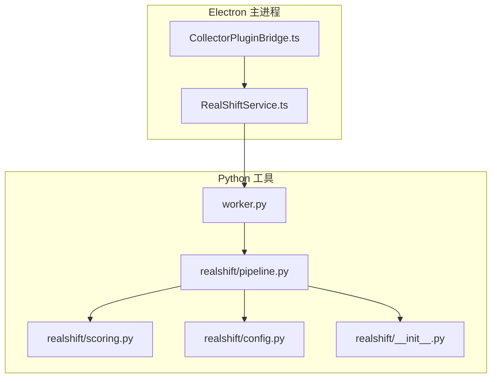
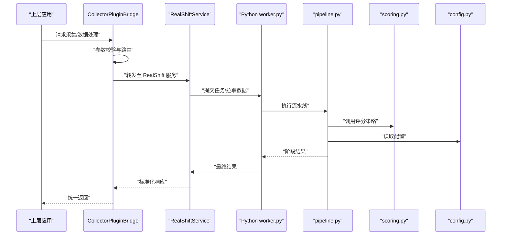
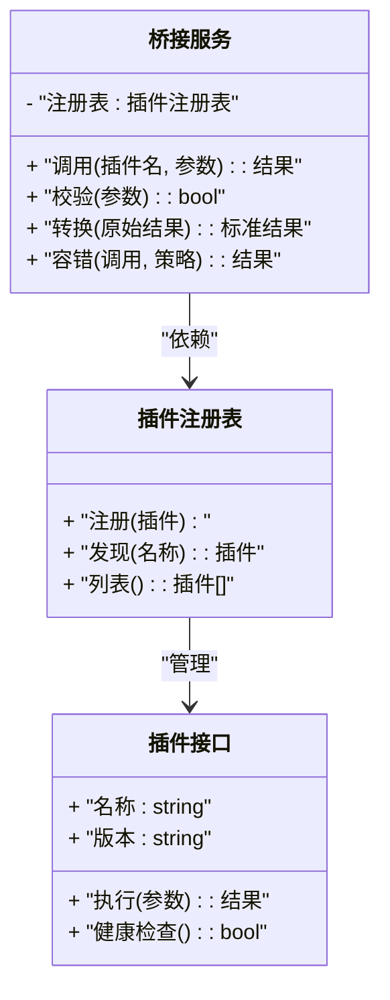
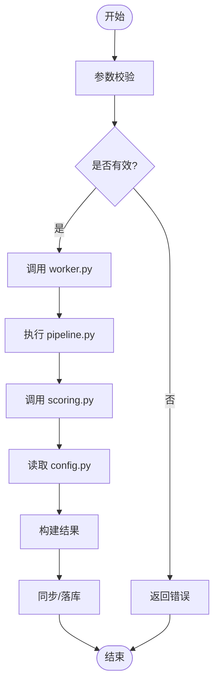
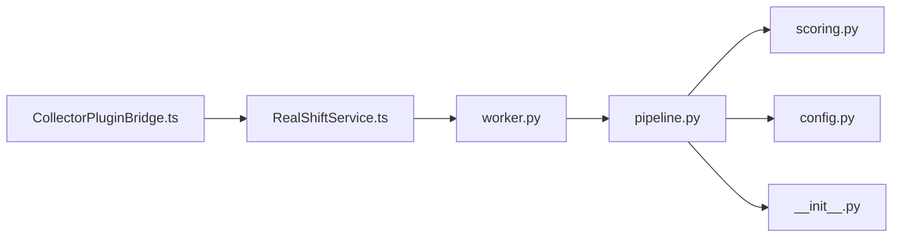

# 第三方集成服务

<cite>
**本文引用的文件**   
- [CollectorPluginBridge.ts](file://src/main/services/CollectorPluginBridge.ts)
- [RealShiftService.ts](file://src/main/services/RealShiftService.ts)
- [worker.py](file://tools/realshift/worker.py)
- [pipeline.py](file://tools/realshift/realshift/pipeline.py)
- [config.py](file://tools/realshift/realshift/config.py)
- [scoring.py](file://tools/realshift/realshift/scoring.py)
- [__init__.py](file://tools/realshift/realshift/__init__.py)
</cite>

## 目录
1. [简介](#简介)
2. [项目结构](#项目结构)
3. [核心组件](#核心组件)
4. [架构总览](#架构总览)
5. [详细组件分析](#详细组件分析)
6. [依赖关系分析](#依赖关系分析)
7. [性能考量](#性能考量)
8. [故障排除指南](#故障排除指南)
9. [结论](#结论)
10. [附录](#附录)

## 简介
本模块聚焦于“第三方集成服务”，围绕两个关键能力展开：
- 数据采集插件桥接服务：统一对外暴露采集插件的调用接口，屏蔽不同数据源与插件实现的差异，提供稳定的契约、错误处理与扩展点。
- RealShift 服务：负责与外部评分/流水线系统对接，完成数据同步、任务编排与结果回写，支持配置化与可扩展的评分策略。

文档将详细说明外部系统对接方式、数据同步机制、插件架构与扩展点设计，并给出集成示例、配置方法与故障排除建议，同时解释服务间通信协议、数据转换与错误处理策略。

## 项目结构
本仓库采用多语言混合架构：
- TypeScript/Electron 主进程服务层：实现桥接服务与业务服务（如 RealShiftService）。
- Python 工具层：实现 RealShift 的流水线、评分与配置管理，并通过 worker 作为独立进程对外提供服务。

图表来源
- [CollectorPluginBridge.ts](file://src/main/services/CollectorPluginBridge.ts)
- [RealShiftService.ts](file://src/main/services/RealShiftService.ts)
- [worker.py](file://tools/realshift/worker.py)
- [pipeline.py](file://tools/realshift/realshift/pipeline.py)
- [scoring.py](file://tools/realshift/realshift/scoring.py)
- [config.py](file://tools/realshift/realshift/config.py)
- [__init__.py](file://tools/realshift/realshift/__init__.py)

章节来源
- [CollectorPluginBridge.ts](file://src/main/services/CollectorPluginBridge.ts)
- [RealShiftService.ts](file://src/main/services/RealShiftService.ts)
- [worker.py](file://tools/realshift/worker.py)
- [pipeline.py](file://tools/realshift/realshift/pipeline.py)
- [config.py](file://tools/realshift/realshift/config.py)
- [scoring.py](file://tools/realshift/realshift/scoring.py)
- [__init__.py](file://tools/realshift/realshift/__init__.py)

## 核心组件
- 数据采集插件桥接服务（CollectorPluginBridge）
  - 职责：统一封装采集插件的注册、发现、调用与结果归一化；提供错误隔离、重试与降级策略；定义插件契约与扩展点。
  - 关键点：插件接口抽象、参数校验、结果映射、异常捕获与上报、可插拔扩展点。
- RealShift 服务（RealShiftService）
  - 职责：与 Python 侧 RealShift 流水线交互，完成数据同步、任务提交、状态轮询与结果回写；管理配置与评分策略切换。
  - 关键点：进程/IPC 或 HTTP 通信、序列化与反序列化、幂等性保障、超时与重试、指标与日志。

章节来源
- [CollectorPluginBridge.ts](file://src/main/services/CollectorPluginBridge.ts)
- [RealShiftService.ts](file://src/main/services/RealShiftService.ts)

## 架构总览
整体流程分为三层：
- 应用层（Electron 主进程）：通过 CollectorPluginBridge 与 RealShiftService 对外暴露稳定接口。
- 集成层（RealShiftService）：负责协议适配、数据转换、错误处理与重试。
- 执行层（Python worker + pipeline）：执行具体采集与评分逻辑，返回标准化结果。

图表来源
- [CollectorPluginBridge.ts](file://src/main/services/CollectorPluginBridge.ts)
- [RealShiftService.ts](file://src/main/services/RealShiftService.ts)
- [worker.py](file://tools/realshift/worker.py)
- [pipeline.py](file://tools/realshift/realshift/pipeline.py)
- [scoring.py](file://tools/realshift/realshift/scoring.py)
- [config.py](file://tools/realshift/realshift/config.py)

## 详细组件分析

### 数据采集插件桥接服务（CollectorPluginBridge）
- 插件契约与扩展点
  - 定义统一的插件接口：输入参数、输出结果、错误码与元数据。
  - 扩展点：插件注册表、动态加载、版本兼容与灰度发布。
- 数据流与转换
  - 入参校验与默认值填充。
  - 插件结果到内部模型的映射与规范化。
  - 字段级转换与类型安全保证。
- 错误处理与可靠性
  - 分类异常捕获（网络、解析、业务规则）。
  - 重试与退避策略、熔断与降级。
  - 错误上报与可观测性（指标、日志、追踪ID）。
- 使用示例（概念）
  - 注册新插件：声明接口实现并注入注册表。
  - 调用插件：传入上下文与参数，获取标准化结果。
  - 处理失败：根据错误码决定重试或回退路径。

图表来源
- [CollectorPluginBridge.ts](file://src/main/services/CollectorPluginBridge.ts)

章节来源
- [CollectorPluginBridge.ts](file://src/main/services/CollectorPluginBridge.ts)

### RealShift 服务（RealShiftService）
- 通信协议
  - 与 Python worker 的交互方式（进程内调用或本地 HTTP/IPC），包含请求体、响应体与错误码约定。
  - 序列化工具与兼容性版本控制。
- 数据同步机制
  - 增量/全量同步策略，幂等键设计与去重。
  - 批量提交与分片处理，背压与限流。
- 错误处理与重试
  - 网络超时、解析失败、业务校验失败的分类处理。
  - 指数退避重试、死信队列与人工干预入口。
- 配置与评分策略
  - 从 config.py 加载策略与阈值，支持热更新。
  - scoring.py 中的评分函数可插拔，按环境或租户切换。

图表来源
- [RealShiftService.ts](file://src/main/services/RealShiftService.ts)
- [worker.py](file://tools/realshift/worker.py)
- [pipeline.py](file://tools/realshift/realshift/pipeline.py)
- [scoring.py](file://tools/realshift/realshift/scoring.py)
- [config.py](file://tools/realshift/realshift/config.py)

章节来源
- [RealShiftService.ts](file://src/main/services/RealShiftService.ts)
- [worker.py](file://tools/realshift/worker.py)
- [pipeline.py](file://tools/realshift/realshift/pipeline.py)
- [scoring.py](file://tools/realshift/realshift/scoring.py)
- [config.py](file://tools/realshift/realshift/config.py)

### Python 侧 RealShift 流水线（pipeline.py）
- 职责：编排数据采集、清洗、评分与结果聚合步骤；维护阶段状态与中间产物。
- 扩展点：新增步骤以插件形式接入；步骤间数据契约由中间模型约束。
- 错误处理：每步捕获异常并记录上下文，支持跳过与补偿。

章节来源
- [pipeline.py](file://tools/realshift/realshift/pipeline.py)

### 评分策略（scoring.py）
- 职责：实现具体评分算法与阈值判定，支持多策略并行与权重组合。
- 扩展点：新增评分器并注册到调度器；按配置选择策略。
- 可观测性：输出评分明细与依据，便于审计与调优。

章节来源
- [scoring.py](file://tools/realshift/realshift/scoring.py)

### 配置管理（config.py）
- 职责：集中管理环境变量、策略开关、超时与重试参数、端点地址等。
- 特性：支持多环境覆盖、运行时重载与校验。

章节来源
- [config.py](file://tools/realshift/realshift/config.py)

### 工作进程（worker.py）
- 职责：接收来自 RealShiftService 的请求，启动 pipeline，返回标准化结果。
- 特性：进程隔离、资源限制、健康检查与优雅退出。

章节来源
- [worker.py](file://tools/realshift/worker.py)

### 包初始化（__init__.py）
- 职责：暴露必要的公共接口与默认配置，便于外部导入与复用。

章节来源
- [__init__.py](file://tools/realshift/realshift/__init__.py)

## 依赖关系分析
- 组件耦合
  - CollectorPluginBridge 依赖插件注册表与统一契约，低耦合高内聚。
  - RealShiftService 依赖 worker 与 pipeline，通过明确接口解耦。
- 外部依赖
  - Python 侧依赖 scoring 与 config，pipeline 编排各步骤。
  - Electron 主进程通过 IPC/HTTP 与 worker 通信。
- 潜在循环依赖
  - 通过接口与中间模型避免循环引用。

图表来源
- [CollectorPluginBridge.ts](file://src/main/services/CollectorPluginBridge.ts)
- [RealShiftService.ts](file://src/main/services/RealShiftService.ts)
- [worker.py](file://tools/realshift/worker.py)
- [pipeline.py](file://tools/realshift/realshift/pipeline.py)
- [scoring.py](file://tools/realshift/realshift/scoring.py)
- [config.py](file://tools/realshift/realshift/config.py)
- [__init__.py](file://tools/realshift/realshift/__init__.py)

章节来源
- [CollectorPluginBridge.ts](file://src/main/services/CollectorPluginBridge.ts)
- [RealShiftService.ts](file://src/main/services/RealShiftService.ts)
- [worker.py](file://tools/realshift/worker.py)
- [pipeline.py](file://tools/realshift/realshift/pipeline.py)
- [scoring.py](file://tools/realshift/realshift/scoring.py)
- [config.py](file://tools/realshift/realshift/config.py)
- [__init__.py](file://tools/realshift/realshift/__init__.py)

## 性能考量
- 批处理与分片：对大数据集进行分片提交，降低单次负载与内存峰值。
- 异步与并发：合理设置并发度，避免阻塞主线程；对 I/O 密集操作使用非阻塞调用。
- 缓存与去重：利用幂等键与缓存减少重复计算与网络开销。
- 资源限制：为 worker 设置 CPU/内存上限，防止资源争用。
- 监控与告警：关键指标（延迟、吞吐、错误率）与链路追踪，快速定位瓶颈。

## 故障排除指南
- 常见问题与定位
  - 连接失败：检查 worker 进程状态、端口占用与防火墙策略。
  - 参数校验失败：核对入参结构与必填项，查看错误码与消息。
  - 评分结果异常：确认策略配置与阈值，检查评分器日志与中间产物。
  - 超时与重试：调整超时阈值与重试次数，观察退避效果。
- 诊断步骤
  - 启用详细日志与追踪 ID，复现问题并收集上下文。
  - 逐步断言：在 bridge、service、worker、pipeline 各层打印关键状态。
  - 最小化用例：构造最小输入验证端到端链路。
- 恢复策略
  - 自动重试与降级：对瞬时错误启用重试，对持续失败切换到备用策略。
  - 人工介入：死信队列与工单系统联动，确保问题闭环。

章节来源
- [RealShiftService.ts](file://src/main/services/RealShiftService.ts)
- [worker.py](file://tools/realshift/worker.py)
- [pipeline.py](file://tools/realshift/realshift/pipeline.py)
- [scoring.py](file://tools/realshift/realshift/scoring.py)
- [config.py](file://tools/realshift/realshift/config.py)

## 结论
本模块通过清晰的插件契约与标准化的 RealShift 服务，实现了数据采集与评分流水线的松耦合集成。桥接服务屏蔽了差异与复杂性，RealShift 服务提供了可靠的通信、同步与错误处理能力。配合完善的配置管理与扩展点设计，系统具备良好的可维护性与可扩展性，适合在多租户、多环境的场景下稳定运行。

## 附录
- 集成示例（概念）
  - 新增采集插件：实现统一接口，注册到桥接服务，并在上游调用中指定插件名与参数。
  - 新增评分策略：在 scoring.py 中实现新策略，通过 config.py 切换并验证结果。
- 配置方法（概念）
  - 环境变量与配置文件分离，按环境覆盖；关键开关包括超时、重试、策略选择与端点地址。
- 通信协议（概念）
  - 请求/响应体结构、错误码规范、幂等键与追踪 ID 的使用说明。
- 最佳实践
  - 严格参数校验与类型安全；统一错误处理与上报；充分测试边界条件与异常路径。