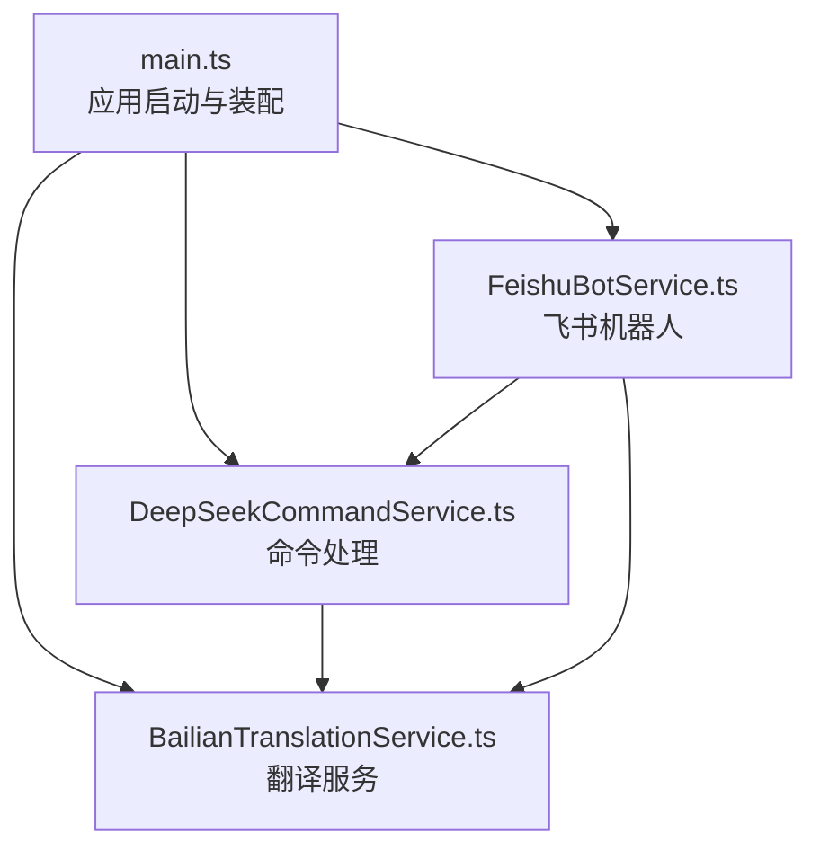
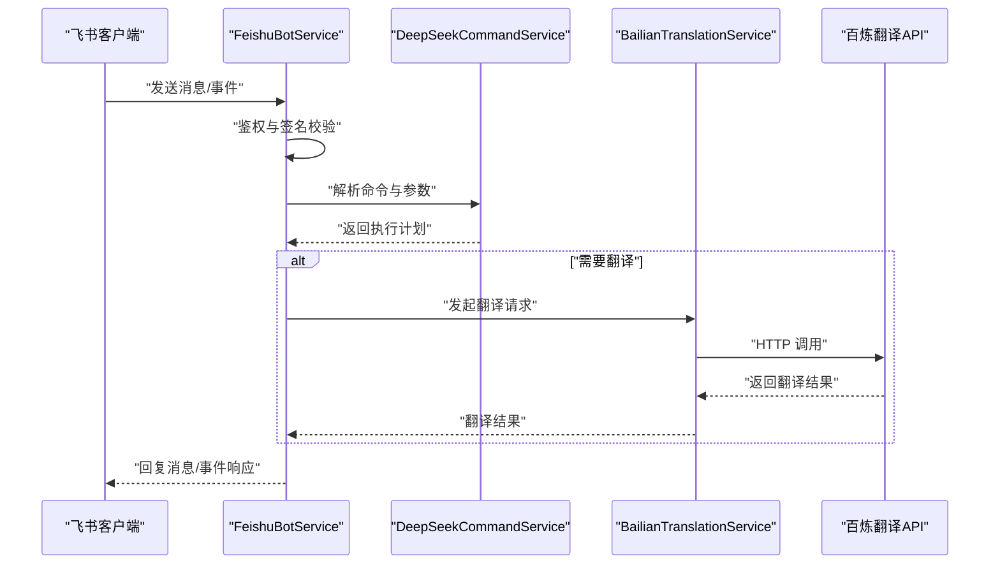
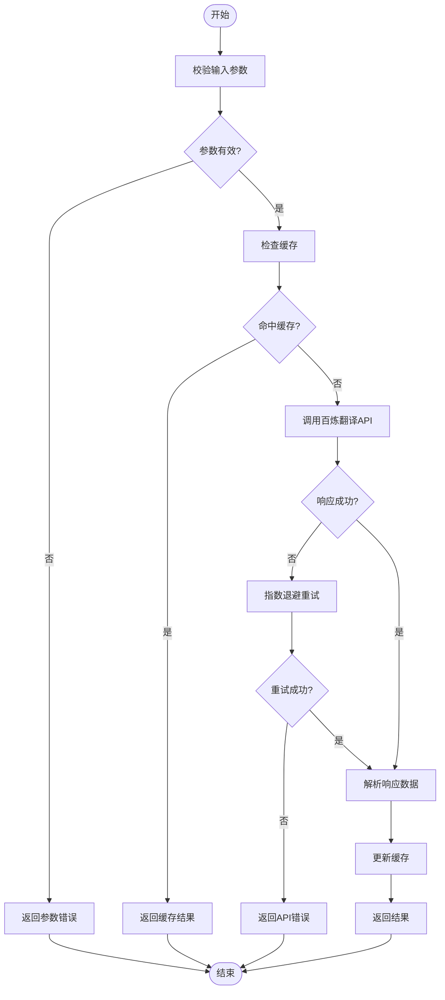
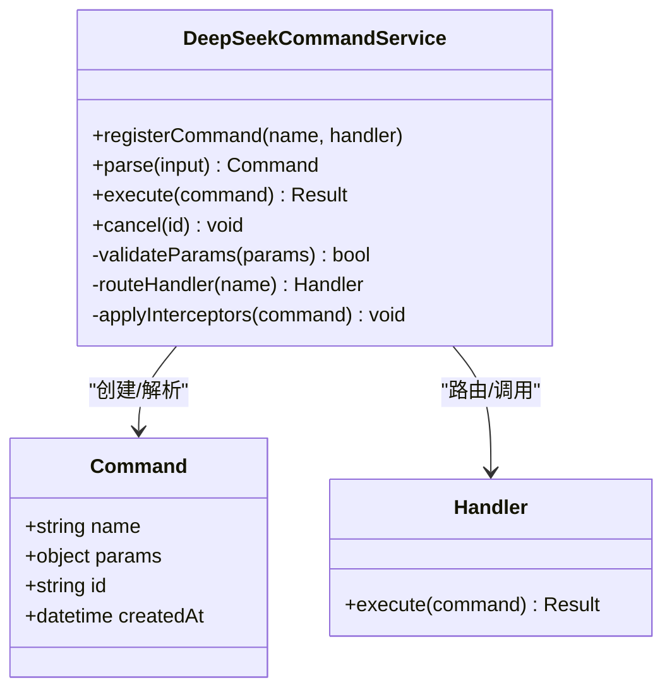
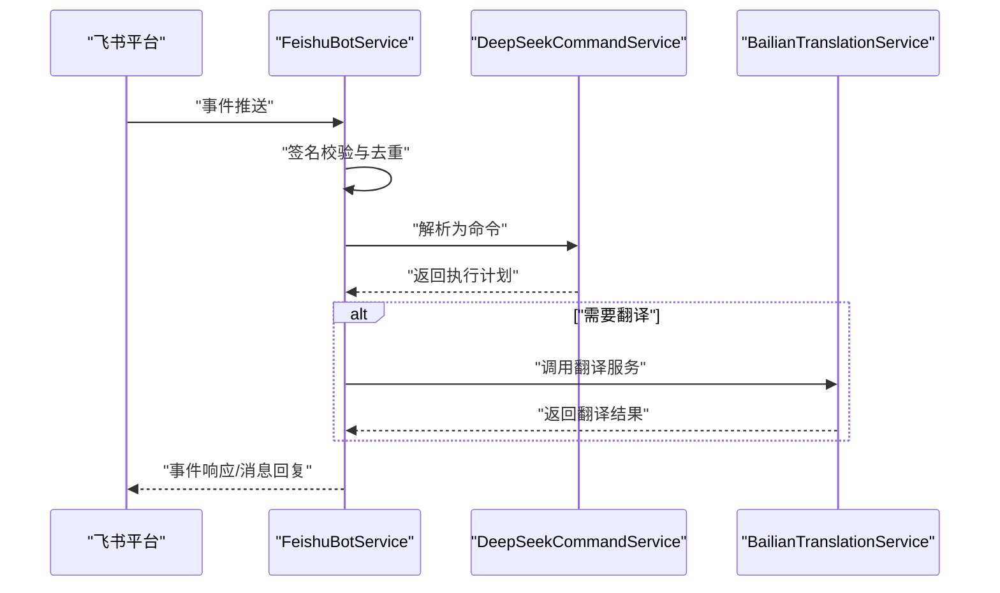
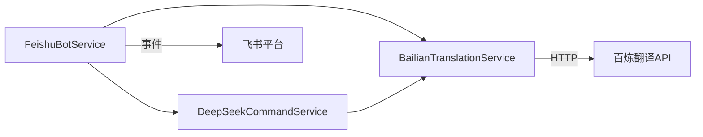

# 通信与翻译服务

<cite>
**本文引用的文件**   
- [src/main/services/BailianTranslationService.ts](file://src/main/services/BailianTranslationService.ts)
- [src/main/services/DeepSeekCommandService.ts](file://src/main/services/DeepSeekCommandService.ts)
- [src/main/services/FeishuBotService.ts](file://src/main/services/FeishuBotService.ts)
- [src/main/main.ts](file://src/main/main.ts)
</cite>

## 目录
1. [简介](#简介)
2. [项目结构](#项目结构)
3. [核心组件](#核心组件)
4. [架构总览](#架构总览)
5. [详细组件分析](#详细组件分析)
6. [依赖关系分析](#依赖关系分析)
7. [性能考量](#性能考量)
8. [故障排查指南](#故障排查指南)
9. [结论](#结论)
10. [附录](#附录)

## 简介
本模块聚焦于“通信与翻译服务”，围绕三大能力展开：
- 多语言翻译服务：基于百炼（Bailian）的翻译能力，提供统一、可复用的翻译接口。
- DeepSeek 命令处理：解析并执行来自聊天或消息渠道的指令，支持智能命令路由与参数提取。
- 飞书机器人集成：对接飞书事件与消息，实现机器人交互、事件分发与状态管理。

文档将系统阐述各服务的 API 接口、消息格式、事件处理流程与状态管理机制，并提供异步消息处理、错误恢复与日志记录的最佳实践说明。

## 项目结构
本模块位于 Electron 主进程的服务层，采用按功能划分的 service 目录组织代码：
- BailianTranslationService.ts：封装百炼翻译 API，提供统一的翻译调用入口。
- DeepSeekCommandService.ts：负责命令解析、校验、路由与执行。
- FeishuBotService.ts：接入飞书机器人事件，完成鉴权、消息收发与回调处理。
- main.ts：应用启动与模块装配，初始化上述服务并暴露对外接口。

图表来源
- [src/main/main.ts](file://src/main/main.ts)
- [src/main/services/BailianTranslationService.ts](file://src/main/services/BailianTranslationService.ts)
- [src/main/services/DeepSeekCommandService.ts](file://src/main/services/DeepSeekCommandService.ts)
- [src/main/services/FeishuBotService.ts](file://src/main/services/FeishuBotService.ts)

章节来源
- [src/main/main.ts](file://src/main/main.ts)

## 核心组件
- 翻译服务（BailianTranslationService）
  - 职责：封装百炼翻译 API，提供文本翻译、批量翻译、语种检测等能力；管理请求重试、超时与错误码映射。
  - 关键能力：异步调用、结果缓存（可选）、错误恢复（指数退避）。
- 命令处理（DeepSeekCommandService）
  - 职责：解析用户输入的命令与参数，进行权限校验、上下文绑定与路由到具体处理器；支持链式拦截器模式。
  - 关键能力：命令注册表、参数校验、异步执行、结果聚合。
- 飞书机器人（FeishuBotService）
  - 职责：处理飞书事件订阅、消息收发、签名校验、会话状态管理；与命令服务与翻译服务协作。
  - 关键能力：事件分发、消息模板、状态持久化、错误上报。

章节来源
- [src/main/services/BailianTranslationService.ts](file://src/main/services/BailianTranslationService.ts)
- [src/main/services/DeepSeekCommandService.ts](file://src/main/services/DeepSeekCommandService.ts)
- [src/main/services/FeishuBotService.ts](file://src/main/services/FeishuBotService.ts)

## 架构总览
整体架构以“事件驱动 + 服务编排”为核心：
- 外部事件（飞书消息/事件）进入 FeishuBotService，进行鉴权与格式化。
- 命令解析由 DeepSeekCommandService 完成，根据命令类型路由至对应处理器。
- 翻译需求通过 BailianTranslationService 发起，必要时结合缓存与重试策略。
- 所有服务通过 main.ts 统一装配，暴露稳定的内部接口供渲染进程或其他模块调用。

图表来源
- [src/main/services/FeishuBotService.ts](file://src/main/services/FeishuBotService.ts)
- [src/main/services/DeepSeekCommandService.ts](file://src/main/services/DeepSeekCommandService.ts)
- [src/main/services/BailianTranslationService.ts](file://src/main/services/BailianTranslationService.ts)

## 详细组件分析

### 翻译服务（BailianTranslationService）
- 设计要点
  - 统一抽象：对外暴露一致的翻译方法，屏蔽底层 API 差异。
  - 异步处理：使用 Promise/async-await 保证非阻塞调用。
  - 错误恢复：对网络异常、限流、超时等进行指数退避重试。
  - 缓存策略：对相同输入与目标语言的翻译结果进行短期缓存，降低重复请求。
- 关键接口（概念性描述）
  - 翻译文本：接收源文本、源语言、目标语言，返回翻译结果。
  - 批量翻译：支持数组输入，内部并行处理并聚合结果。
  - 语种检测：自动识别输入文本的语言。
- 错误处理
  - 区分网络错误、业务错误与认证错误，分别采取重试、降级或告警策略。
  - 记录结构化日志，包含请求 ID、耗时、错误码与堆栈摘要。

图表来源
- [src/main/services/BailianTranslationService.ts](file://src/main/services/BailianTranslationService.ts)

章节来源
- [src/main/services/BailianTranslationService.ts](file://src/main/services/BailianTranslationService.ts)

### 命令处理（DeepSeekCommandService）
- 设计要点
  - 命令注册表：集中管理命令名称、版本、权限与处理器函数。
  - 解析器：支持前缀命令、参数键值对、位置参数与选项开关。
  - 拦截器：在命令执行前后注入鉴权、审计、限流等逻辑。
  - 异步执行：每个处理器独立运行，支持并发与超时控制。
- 关键接口（概念性描述）
  - 注册命令：添加命令定义与处理器。
  - 解析命令：将原始输入转换为结构化命令对象。
  - 执行命令：根据命令类型路由到处理器并返回结果。
  - 取消/中断：支持长时间任务的取消与清理。
- 错误处理
  - 参数校验失败、权限不足、处理器异常均会捕获并返回标准化错误。
  - 记录命令执行链路日志，便于追踪与审计。

图表来源
- [src/main/services/DeepSeekCommandService.ts](file://src/main/services/DeepSeekCommandService.ts)

章节来源
- [src/main/services/DeepSeekCommandService.ts](file://src/main/services/DeepSeekCommandService.ts)

### 飞书机器人（FeishuBotService）
- 设计要点
  - 事件订阅：监听飞书事件（如消息、审批、日程），进行签名校验与去重。
  - 消息收发：封装发送文本、富文本、卡片消息等方法，支持模板与变量替换。
  - 状态管理：维护会话上下文、用户权限与任务队列，支持跨事件的状态延续。
  - 集成点：与命令服务与翻译服务协作，形成“事件→命令→翻译→回复”的闭环。
- 关键接口（概念性描述）
  - 订阅事件：注册事件类型与回调。
  - 发送消息：向指定会话发送消息，支持异步与重试。
  - 获取上下文：读取当前会话的用户、群组、权限等信息。
  - 健康检查：提供心跳与状态上报接口。
- 错误处理
  - 对飞书 API 限流、签名失败、消息体过大等情况进行降级与重试。
  - 记录事件处理链路日志，包含事件 ID、类型、耗时与错误码。

图表来源
- [src/main/services/FeishuBotService.ts](file://src/main/services/FeishuBotService.ts)
- [src/main/services/DeepSeekCommandService.ts](file://src/main/services/DeepSeekCommandService.ts)
- [src/main/services/BailianTranslationService.ts](file://src/main/services/BailianTranslationService.ts)

章节来源
- [src/main/services/FeishuBotService.ts](file://src/main/services/FeishuBotService.ts)

## 依赖关系分析
- 模块内依赖
  - FeishuBotService 依赖 DeepSeekCommandService 与 BailianTranslationService。
  - DeepSeekCommandService 可能依赖 BailianTranslationService（当命令涉及翻译时）。
  - BailianTranslationService 依赖外部 HTTP 客户端与配置（如密钥、端点、超时）。
- 外部依赖
  - 飞书开放平台 API：事件订阅、消息发送、鉴权。
  - 百炼翻译 API：文本翻译、语种检测、批量处理。
- 潜在循环依赖
  - 通过 main.ts 进行服务装配，避免直接循环引用；服务间通过接口契约解耦。

图表来源
- [src/main/services/FeishuBotService.ts](file://src/main/services/FeishuBotService.ts)
- [src/main/services/DeepSeekCommandService.ts](file://src/main/services/DeepSeekCommandService.ts)
- [src/main/services/BailianTranslationService.ts](file://src/main/services/BailianTranslationService.ts)

章节来源
- [src/main/main.ts](file://src/main/main.ts)

## 性能考量
- 翻译服务
  - 使用连接池与并发限制控制对外部 API 的压力。
  - 启用结果缓存以减少重复请求，注意缓存失效策略。
  - 对大文本进行分块处理，避免内存峰值过高。
- 命令处理
  - 命令处理器应无副作用或最小化副作用，确保可并行执行。
  - 长任务采用异步队列与进度反馈，避免阻塞事件线程。
- 飞书机器人
  - 消息发送采用批量化与重试机制，提升吞吐与稳定性。
  - 事件处理幂等，防止重复消费导致状态不一致。

[本节为通用指导，不直接分析具体文件]

## 故障排查指南
- 常见问题
  - 翻译失败：检查网络连通、API 密钥、配额与限流；查看重试次数与退避策略。
  - 命令解析错误：核对命令语法、参数类型与必填项；启用调试日志输出解析中间态。
  - 飞书事件未触发：确认事件订阅配置、签名校验与回调地址可达性。
- 定位手段
  - 启用结构化日志，记录请求 ID、耗时、错误码与堆栈摘要。
  - 对关键路径增加埋点，统计成功率、延迟分布与错误分类。
  - 使用健康检查接口验证服务状态与依赖可用性。

章节来源
- [src/main/services/BailianTranslationService.ts](file://src/main/services/BailianTranslationService.ts)
- [src/main/services/DeepSeekCommandService.ts](file://src/main/services/DeepSeekCommandService.ts)
- [src/main/services/FeishuBotService.ts](file://src/main/services/FeishuBotService.ts)

## 结论
本模块通过清晰的分层与服务解耦，实现了翻译、命令处理与飞书机器人的高效协作。借助异步处理、错误恢复与日志记录机制，系统在稳定性与可观测性方面具备良好基础。后续可进一步引入缓存优化、指标监控与自动化测试，持续提升服务质量与可维护性。

[本节为总结性内容，不直接分析具体文件]

## 附录
- 术语
  - 百炼翻译：基于百炼平台的机器翻译能力。
  - 命令处理：对用户输入进行解析、校验与路由执行的机制。
  - 飞书机器人：基于飞书开放平台的交互式机器人。
- 参考
  - 飞书开放平台文档：事件订阅、消息发送、鉴权。
  - 百炼翻译 API 文档：接口规范、错误码、限流策略。

[本节为补充信息，不直接分析具体文件]