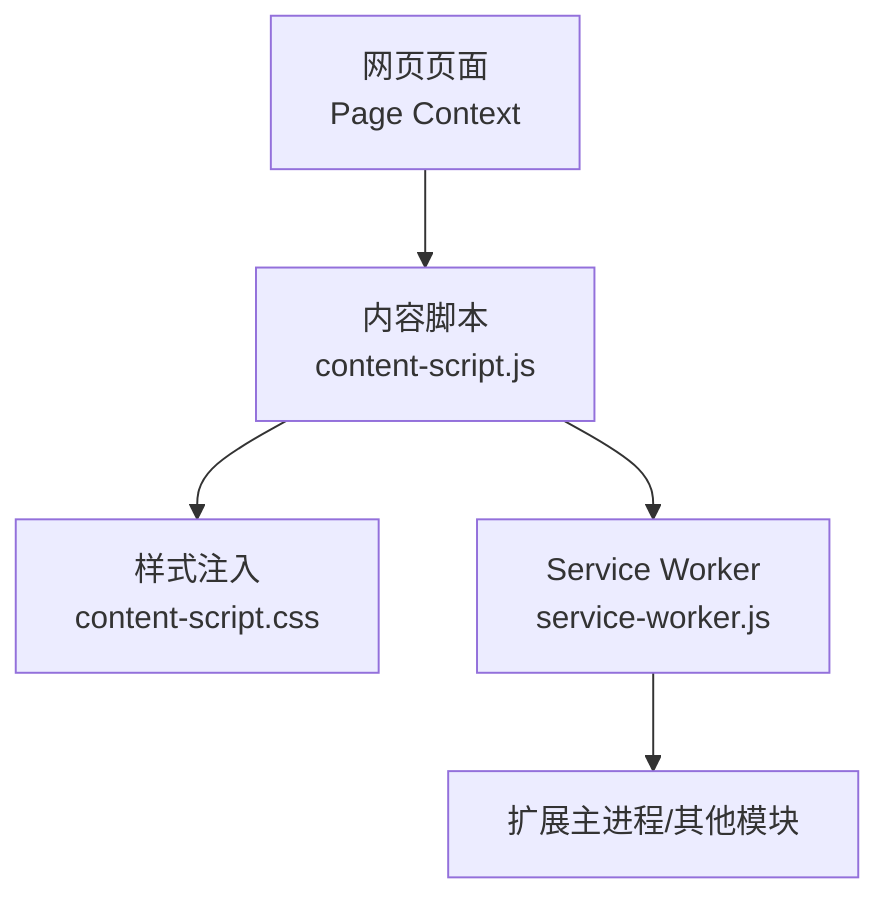
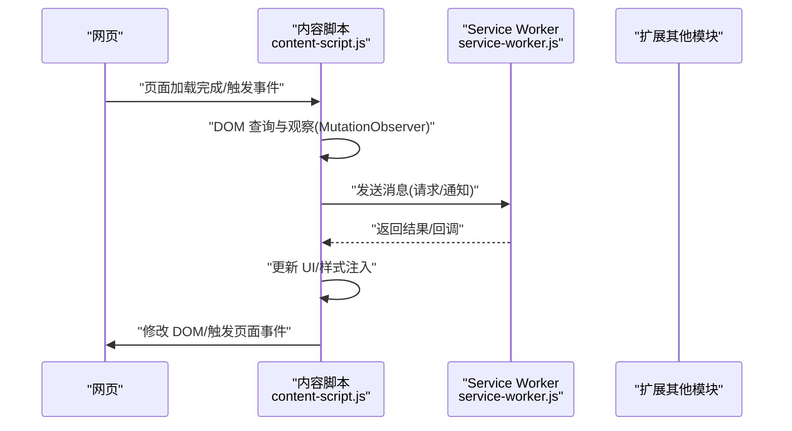
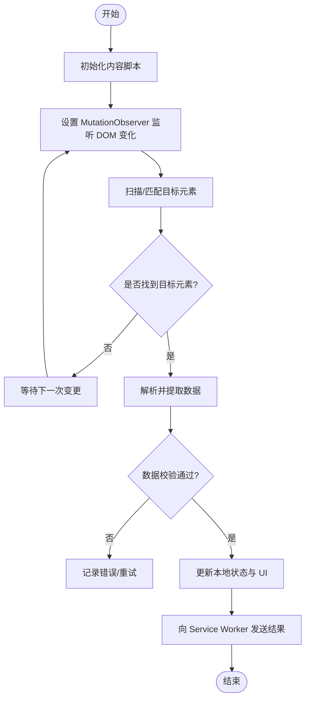
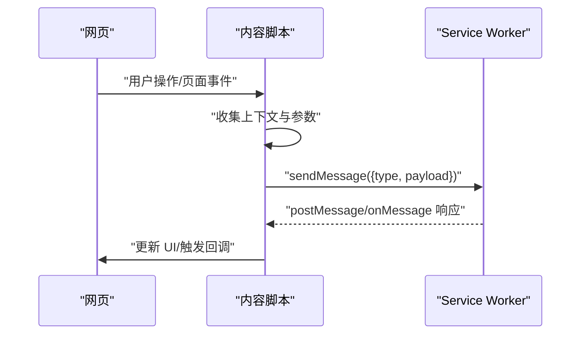
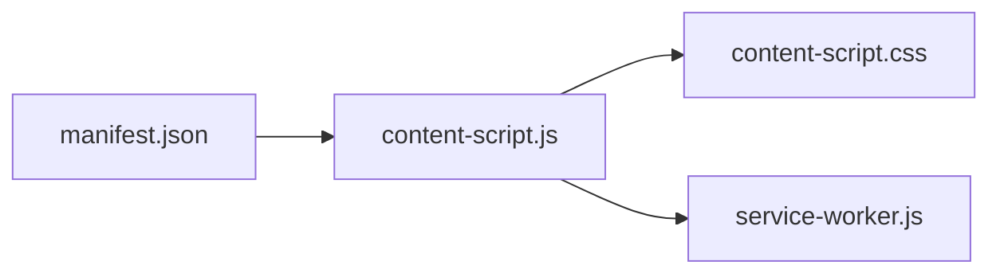

# 内容脚本实现

<cite>
**本文引用的文件**   
- [browser-extension/content-script.js](file://browser-extension/content-script.js)
- [browser-extension/content-script.css](file://browser-extension/content-script.css)
- [browser-extension/manifest.json](file://browser-extension/manifest.json)
- [browser-extension/service-worker.js](file://browser-extension/service-worker.js)
</cite>

## 目录
1. [简介](#简介)
2. [项目结构](#项目结构)
3. [核心组件](#核心组件)
4. [架构总览](#架构总览)
5. [详细组件分析](#详细组件分析)
6. [依赖关系分析](#依赖关系分析)
7. [性能考虑](#性能考虑)
8. [故障排查指南](#故障排查指南)
9. [结论](#结论)
10. [附录](#附录)

## 简介
本技术文档聚焦于浏览器扩展中的“内容脚本”（Content Script）实现，围绕以下目标展开：
- 说明内容脚本如何注入到网页中
- DOM 操作与数据提取的实现方式
- CSS 样式注入机制与样式隔离策略
- 内容脚本与页面 JavaScript 环境的通信方式（消息传递与事件监听）
- 页面元素识别、数据抓取与状态同步的具体实现
- 调试技巧与性能优化建议

## 项目结构
本项目为浏览器扩展，关键内容与内容脚本相关的文件位于 browser-extension 目录。其中：
- manifest.json：声明扩展能力、权限与内容脚本注入规则
- content-script.js：在目标网页上下文中执行的脚本，负责 DOM 操作、数据抓取、UI 注入与通信
- content-script.css：内容脚本使用的样式表，通过注入方式生效
- service-worker.js：后台服务进程，负责跨上下文的消息路由与持久化任务

图表来源
- [browser-extension/manifest.json](file://browser-extension/manifest.json)
- [browser-extension/content-script.js](file://browser-extension/content-script.js)
- [browser-extension/content-script.css](file://browser-extension/content-script.css)
- [browser-extension/service-worker.js](file://browser-extension/service-worker.js)

章节来源
- [browser-extension/manifest.json](file://browser-extension/manifest.json)
- [browser-extension/content-script.js](file://browser-extension/content-script.js)
- [browser-extension/content-script.css](file://browser-extension/content-script.css)
- [browser-extension/service-worker.js](file://browser-extension/service-worker.js)

## 核心组件
- 内容脚本（content-script.js）
  - 职责：在页面上下文中运行，执行 DOM 查询与修改、插入 UI、监听页面事件、向 Service Worker 发送/接收消息
  - 关键点：使用 MutationObserver 监听 DOM 变化；使用 window.postMessage 或 chrome.runtime API 进行跨上下文通信；按需注入样式
- 样式表（content-script.css）
  - 职责：定义内容脚本创建的 UI 的样式
  - 关键点：通过 document.createElement('style') 动态注入，避免污染全局命名空间
- Service Worker（service-worker.js）
  - 职责：作为扩展后台进程，处理来自内容脚本的消息，协调扩展功能，必要时与后端或其他扩展模块交互
- 清单（manifest.json）
  - 职责：声明内容脚本的匹配规则、注入时机、所需权限等

章节来源
- [browser-extension/content-script.js](file://browser-extension/content-script.js)
- [browser-extension/content-script.css](file://browser-extension/content-script.css)
- [browser-extension/service-worker.js](file://browser-extension/service-worker.js)
- [browser-extension/manifest.json](file://browser-extension/manifest.json)

## 架构总览
内容脚本运行在页面上下文，拥有对 DOM 的直接访问能力；Service Worker 运行在扩展上下文，具备更强的权限与生命周期管理。两者通过消息通道协作，样式通过动态注入的方式应用到页面。

图表来源
- [browser-extension/content-script.js](file://browser-extension/content-script.js)
- [browser-extension/service-worker.js](file://browser-extension/service-worker.js)

## 详细组件分析

### 内容脚本注入与生命周期
- 注入时机与匹配规则由 manifest.json 控制，通常包括 match/globs 与 run_at 配置
- 内容脚本在页面上下文中初始化，优先建立与 Service Worker 的通信通道，再执行 DOM 扫描与监听
- 当页面发生导航或 SPA 路由切换时，需重新评估并重建观察者与 UI

章节来源
- [browser-extension/manifest.json](file://browser-extension/manifest.json)
- [browser-extension/content-script.js](file://browser-extension/content-script.js)

### DOM 操作与数据提取
- 元素识别：基于选择器（如 class/id/data-* 属性）定位目标节点；对于动态渲染场景，使用 MutationObserver 持续监听新增节点
- 数据抓取：从目标节点的文本、属性或接口返回值中提取结构化数据；必要时解析 JSON 或正则匹配
- 状态同步：将抓取到的数据与 UI 状态保持一致，避免重复处理与闪烁

图表来源
- [browser-extension/content-script.js](file://browser-extension/content-script.js)

章节来源
- [browser-extension/content-script.js](file://browser-extension/content-script.js)

### CSS 样式注入与隔离策略
- 注入方式：通过 document.createElement('style') 创建样式节点并插入到 <head> 或目标容器内
- 隔离策略：
  - 使用唯一前缀或作用域类名，避免与页面样式冲突
  - 将样式限定在特定容器内，减少全局污染
  - 在移除 UI 时同步移除对应样式节点，防止内存泄漏
- 动态主题：根据用户偏好或页面模式切换样式变量

章节来源
- [browser-extension/content-script.css](file://browser-extension/content-script.css)
- [browser-extension/content-script.js](file://browser-extension/content-script.js)

### 与页面 JavaScript 环境的通信
- 推荐方式：使用 chrome.runtime.sendMessage/onMessage 或 port 机制与 Service Worker 通信
- 备选方式：window.postMessage 用于与页面脚本通信（需谨慎处理安全性与事件冲突）
- 事件监听：对页面自定义事件或原生事件（如点击、滚动）进行监听，触发数据抓取或 UI 更新

图表来源
- [browser-extension/content-script.js](file://browser-extension/content-script.js)
- [browser-extension/service-worker.js](file://browser-extension/service-worker.js)

章节来源
- [browser-extension/content-script.js](file://browser-extension/content-script.js)
- [browser-extension/service-worker.js](file://browser-extension/service-worker.js)

### 页面元素识别、数据抓取与状态同步
- 元素识别：结合稳定选择器与 data-* 属性提高鲁棒性；对动态加载内容进行增量观察
- 数据抓取：优先读取结构化数据（如 JSON-LD、data-*），其次回退到文本解析
- 状态同步：维护一份轻量状态对象，确保 UI 与数据一致；对频繁变更的数据进行节流/防抖

章节来源
- [browser-extension/content-script.js](file://browser-extension/content-script.js)

## 依赖关系分析
- 内容脚本依赖 manifest.json 的注入规则与权限声明
- 内容脚本与 Service Worker 通过消息通道耦合，形成松耦合的协作关系
- 样式表与内容脚本强相关，随 UI 生命周期动态挂载/卸载

图表来源
- [browser-extension/manifest.json](file://browser-extension/manifest.json)
- [browser-extension/content-script.js](file://browser-extension/content-script.js)
- [browser-extension/content-script.css](file://browser-extension/content-script.css)
- [browser-extension/service-worker.js](file://browser-extension/service-worker.js)

章节来源
- [browser-extension/manifest.json](file://browser-extension/manifest.json)
- [browser-extension/content-script.js](file://browser-extension/content-script.js)
- [browser-extension/service-worker.js](file://browser-extension/service-worker.js)

## 性能考虑
- 减少不必要的 DOM 遍历：使用精确选择器与缓存已识别节点
- 合理使用 MutationObserver：限制观察范围与深度，避免全树监听
- 节流与防抖：对高频事件（滚动、输入）进行限流，降低 CPU 占用
- 样式注入最小化：仅注入必要样式，及时清理未使用节点
- 批量更新 UI：合并多次 DOM 写入，减少重排与重绘

[本节为通用指导，不直接分析具体文件]

## 故障排查指南
- 常见问题
  - 内容脚本未注入：检查 manifest.json 的匹配规则与权限
  - 无法获取 DOM：确认页面加载阶段与注入时机（run_at）
  - 样式冲突：检查类名前缀与作用域，避免覆盖页面样式
  - 通信失败：验证 Service Worker 是否启动，消息类型与载荷是否正确
- 调试技巧
  - 在内容脚本中输出日志，便于控制台查看
  - 使用浏览器开发者工具的元素面板与网络面板定位问题
  - 对 MutationObserver 回调添加断点，观察 DOM 变化路径

章节来源
- [browser-extension/manifest.json](file://browser-extension/manifest.json)
- [browser-extension/content-script.js](file://browser-extension/content-script.js)
- [browser-extension/service-worker.js](file://browser-extension/service-worker.js)

## 结论
内容脚本是浏览器扩展与网页交互的核心桥梁。通过合理的注入策略、稳健的 DOM 操作与数据提取、严格的样式隔离以及可靠的跨上下文通信，可以实现高效、稳定的页面增强功能。遵循本文的最佳实践与性能建议，有助于提升用户体验与系统稳定性。

[本节为总结性内容，不直接分析具体文件]

## 附录
- 术语
  - 内容脚本：在页面上下文中运行的扩展脚本
  - Service Worker：扩展后台进程，负责消息路由与任务调度
  - 注入：将脚本或样式添加到网页环境的过程
- 参考文件
  - [browser-extension/manifest.json](file://browser-extension/manifest.json)
  - [browser-extension/content-script.js](file://browser-extension/content-script.js)
  - [browser-extension/content-script.css](file://browser-extension/content-script.css)
  - [browser-extension/service-worker.js](file://browser-extension/service-worker.js)