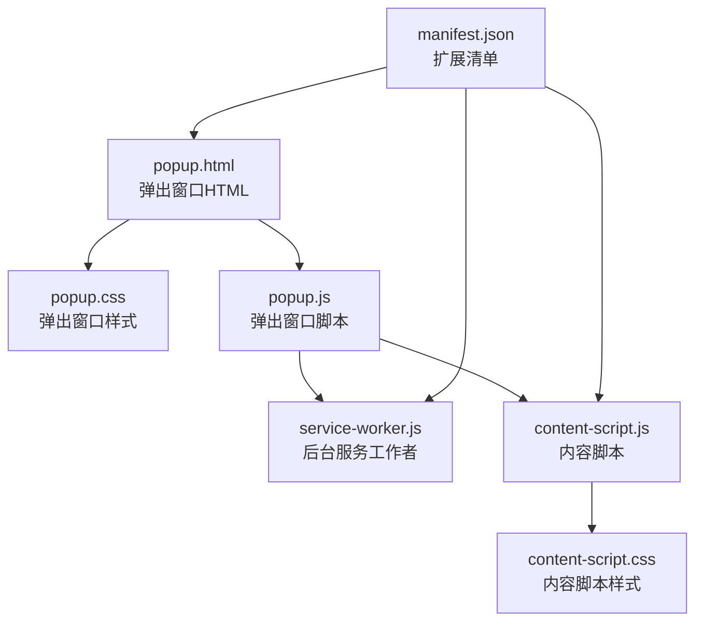
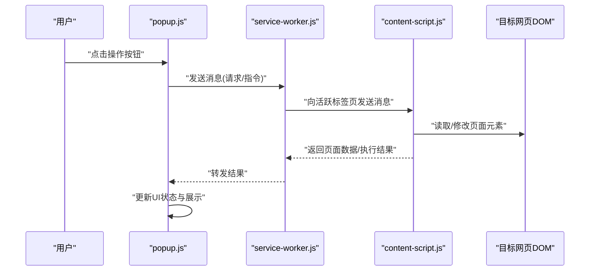
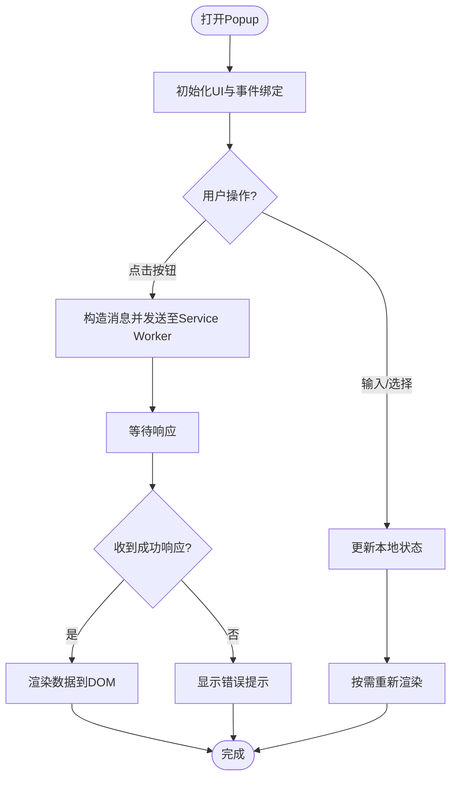
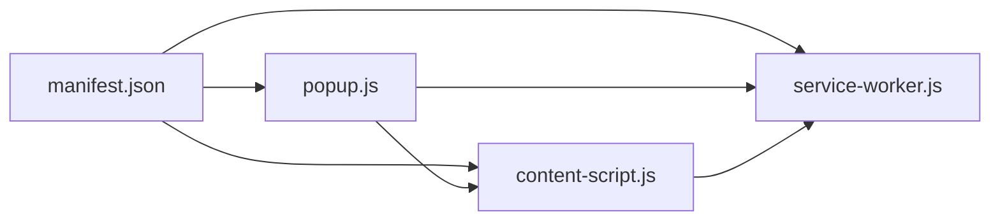

# 弹出界面开发

<cite>
**本文引用的文件**   
- [popup.html](file://browser-extension/popup.html)
- [popup.css](file://browser-extension/popup.css)
- [popup.js](file://browser-extension/popup.js)
- [content-script.js](file://browser-extension/content-script.js)
- [content-script.css](file://browser-extension/content-script.css)
- [service-worker.js](file://browser-extension/service-worker.js)
- [manifest.json](file://browser-extension/manifest.json)
</cite>

## 目录
1. [简介](#简介)
2. [项目结构](#项目结构)
3. [核心组件](#核心组件)
4. [架构总览](#架构总览)
5. [详细组件分析](#详细组件分析)
6. [依赖关系分析](#依赖关系分析)
7. [性能考量](#性能考量)
8. [故障排查指南](#故障排查指南)
9. [结论](#结论)
10. [附录](#附录)

## 简介
本文件面向“弹出界面（Popup）”的开发与维护，系统性说明浏览器扩展中 popup 的 HTML 结构、CSS 样式与响应式布局、JavaScript 业务逻辑（用户交互、数据展示与状态管理），以及与主应用（Content Script、Service Worker、Manifest）之间的通信机制。文档同时提供 UI 组件复用模式与用户体验优化建议，帮助开发者快速搭建稳定、可维护且体验良好的弹出窗口。

## 项目结构
浏览器扩展采用标准的 Manifest V3 结构，popup 相关资源集中在 browser-extension 目录下：
- popup.html：弹出窗口的页面骨架与 DOM 节点组织
- popup.css：弹出窗口的样式与主题、响应式适配
- popup.js：弹出窗口的脚本入口，负责事件绑定、UI 状态管理与消息通信
- content-script.js / content-script.css：注入到网页的内容脚本与样式，用于与页面内容交互
- service-worker.js：后台任务与跨上下文通信的中转层
- manifest.json：扩展元信息、权限声明与入口配置

图表来源
- [popup.html](file://browser-extension/popup.html)
- [popup.css](file://browser-extension/popup.css)
- [popup.js](file://browser-extension/popup.js)
- [content-script.js](file://browser-extension/content-script.js)
- [content-script.css](file://browser-extension/content-script.css)
- [service-worker.js](file://browser-extension/service-worker.js)
- [manifest.json](file://browser-extension/manifest.json)

章节来源
- [popup.html](file://browser-extension/popup.html)
- [popup.css](file://browser-extension/popup.css)
- [popup.js](file://browser-extension/popup.js)
- [content-script.js](file://browser-extension/content-script.js)
- [content-script.css](file://browser-extension/content-script.css)
- [service-worker.js](file://browser-extension/service-worker.js)
- [manifest.json](file://browser-extension/manifest.json)

## 核心组件
- 弹出窗口（Popup）
  - 职责：承载用户操作入口、展示关键信息与结果、触发后台或内容脚本动作
  - 关键文件：popup.html、popup.css、popup.js
- 内容脚本（Content Script）
  - 职责：与当前网页 DOM 交互，采集页面数据、执行页面内操作
  - 关键文件：content-script.js、content-script.css
- 服务工作者（Service Worker）
  - 职责：处理异步任务、持久化存储、跨上下文消息转发
  - 关键文件：service-worker.js
- 扩展清单（Manifest）
  - 职责：声明权限、注册入口、配置 Content Script 注入策略
  - 关键文件：manifest.json

章节来源
- [popup.html](file://browser-extension/popup.html)
- [popup.css](file://browser-extension/popup.css)
- [popup.js](file://browser-extension/popup.js)
- [content-script.js](file://browser-extension/content-script.js)
- [content-script.css](file://browser-extension/content-script.css)
- [service-worker.js](file://browser-extension/service-worker.js)
- [manifest.json](file://browser-extension/manifest.json)

## 架构总览
Popup 作为用户入口，通过消息通道与 Service Worker 和 Content Script 协作，形成“用户界面—后台服务—页面内容”的三层架构。典型流程包括：用户点击按钮 → Popup 发送消息 → Service Worker 协调 → Content Script 执行页面操作 → 结果回传 → Popup 更新 UI。

图表来源
- [popup.js](file://browser-extension/popup.js)
- [service-worker.js](file://browser-extension/service-worker.js)
- [content-script.js](file://browser-extension/content-script.js)

章节来源
- [popup.js](file://browser-extension/popup.js)
- [service-worker.js](file://browser-extension/service-worker.js)
- [content-script.js](file://browser-extension/content-script.js)

## 详细组件分析

### 弹出窗口（Popup）
- HTML 结构设计
  - 使用语义化标签组织区块（头部、主体、底部），为每个交互控件设置唯一 ID，便于脚本定位
  - 列表项、卡片、按钮等组件保持命名一致，利于 CSS 复用
- 用户界面布局
  - 基于 Flexbox/Grid 构建响应式布局，确保在不同屏幕尺寸下可读性与可用性
  - 使用媒体查询适配移动端与高分屏
- 交互逻辑与状态管理
  - 在 popup.js 中集中绑定事件，避免分散逻辑
  - 使用本地变量或轻量状态对象管理 UI 状态（加载中、成功、失败、空数据）
  - 对网络或异步操作进行错误边界处理，保证弹窗不崩溃
- 与主应用通信
  - 通过 chrome.runtime.sendMessage 与 Service Worker 通信
  - 监听 chrome.runtime.onMessage 接收回调结果并刷新 UI
- 数据展示与更新
  - 统一的数据渲染函数，支持分页、搜索、排序等常见需求
  - 防抖与节流优化频繁输入与滚动场景

图表来源
- [popup.html](file://browser-extension/popup.html)
- [popup.css](file://browser-extension/popup.css)
- [popup.js](file://browser-extension/popup.js)

章节来源
- [popup.html](file://browser-extension/popup.html)
- [popup.css](file://browser-extension/popup.css)
- [popup.js](file://browser-extension/popup.js)

### 内容脚本（Content Script）
- 职责
  - 注入到目标网页，读取或修改 DOM，执行页面内逻辑
  - 与 Service Worker 双向通信，上报数据或接收指令
- 实现要点
  - 安全访问 DOM，避免破坏页面原有行为
  - 使用 MutationObserver 监听动态内容变化
  - 对敏感信息进行脱敏后再传输
- 样式隔离
  - 通过 content-script.css 限定作用域，避免污染全局样式

章节来源
- [content-script.js](file://browser-extension/content-script.js)
- [content-script.css](file://browser-extension/content-script.css)

### 服务工作者（Service Worker）
- 职责
  - 作为消息中转与任务调度中心，处理耗时操作
  - 管理扩展级状态与缓存，必要时调用外部 API
- 实现要点
  - 使用 chrome.storage 或 IndexedDB 做持久化
  - 合理拆分消息类型，避免单点过载
  - 错误重试与超时控制

章节来源
- [service-worker.js](file://browser-extension/service-worker.js)

### 扩展清单（Manifest）
- 职责
  - 声明权限（如 storage、activeTab、scripting 等）
  - 配置 popup、background、content_scripts 等入口
- 实现要点
  - 最小权限原则，按需申请
  - 明确 content_scripts 的匹配规则与注入时机

章节来源
- [manifest.json](file://browser-extension/manifest.json)

## 依赖关系分析
Popup 与 Service Worker、Content Script 之间通过消息机制解耦；Manifest 定义各模块的加载与权限。整体耦合度低、职责清晰，便于独立开发与测试。

图表来源
- [manifest.json](file://browser-extension/manifest.json)
- [popup.js](file://browser-extension/popup.js)
- [service-worker.js](file://browser-extension/service-worker.js)
- [content-script.js](file://browser-extension/content-script.js)

章节来源
- [manifest.json](file://browser-extension/manifest.json)
- [popup.js](file://browser-extension/popup.js)
- [service-worker.js](file://browser-extension/service-worker.js)
- [content-script.js](file://browser-extension/content-script.js)

## 性能考量
- 减少重排与重绘
  - 批量更新 DOM，避免在循环中频繁操作
  - 使用 DocumentFragment 或虚拟列表渲染大数据集
- 异步与并发
  - 将耗时任务下沉至 Service Worker，避免阻塞 UI
  - 合理使用 Promise.all 并行请求，但注意限流与错误聚合
- 内存与资源
  - 及时释放事件监听与观察者
  - 图片等资源懒加载，按需加载脚本
- 用户体验
  - 加载态与骨架屏提升感知速度
  - 错误提示友好，提供重试与反馈路径

[本节为通用指导，无需引用具体文件]

## 故障排查指南
- 常见问题
  - 消息未送达：检查 manifest 权限与 content_scripts 匹配规则
  - 页面数据为空：确认 Content Script 注入时机与选择器有效性
  - UI 无响应：检查异步回调与错误分支是否更新状态
- 调试技巧
  - 在 popup 控制台查看日志与网络请求
  - 在 Service Worker 面板查看后台任务执行情况
  - 在 Content Script 环境验证 DOM 选择器与事件冒泡
- 恢复策略
  - 提供重试按钮与降级展示
  - 记录关键步骤日志，便于复现问题

章节来源
- [popup.js](file://browser-extension/popup.js)
- [service-worker.js](file://browser-extension/service-worker.js)
- [content-script.js](file://browser-extension/content-script.js)
- [manifest.json](file://browser-extension/manifest.json)

## 结论
通过清晰的三层架构（Popup—Service Worker—Content Script）与消息驱动通信，弹出界面能够高效、稳定地与主应用交互。遵循模块化设计、响应式布局与性能优化实践，可显著提升用户体验与可维护性。建议在后续迭代中引入组件化与状态管理库，进一步提升代码复用与可测试性。

[本节为总结性内容，无需引用具体文件]

## 附录
- 组件复用模式
  - 按钮、卡片、列表、表单等组件抽取为模板与样式类，统一风格与交互
  - 使用插槽或参数化配置实现灵活组合
- 用户体验优化建议
  - 首屏关键信息优先展示，次要内容延迟加载
  - 提供键盘快捷键与无障碍支持
  - 多语言与主题切换预留接口
- 最佳实践清单
  - 最小权限、最小注入范围
  - 错误边界与用户反馈
  - 单元测试与端到端测试覆盖关键路径

[本节为通用指导，无需引用具体文件]