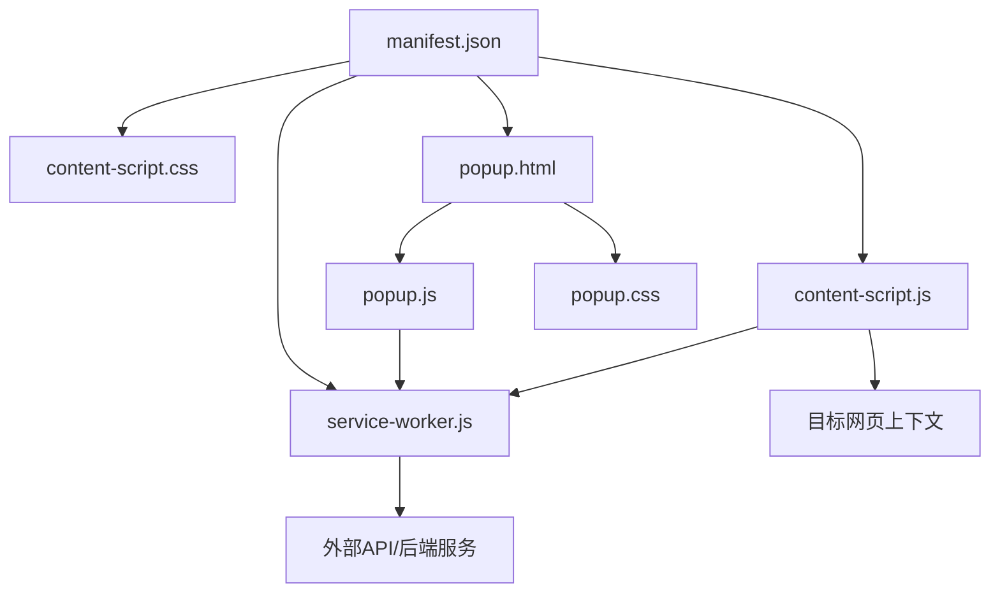
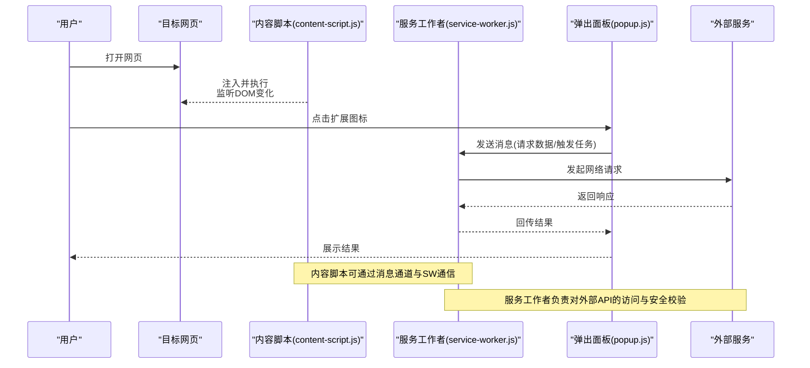
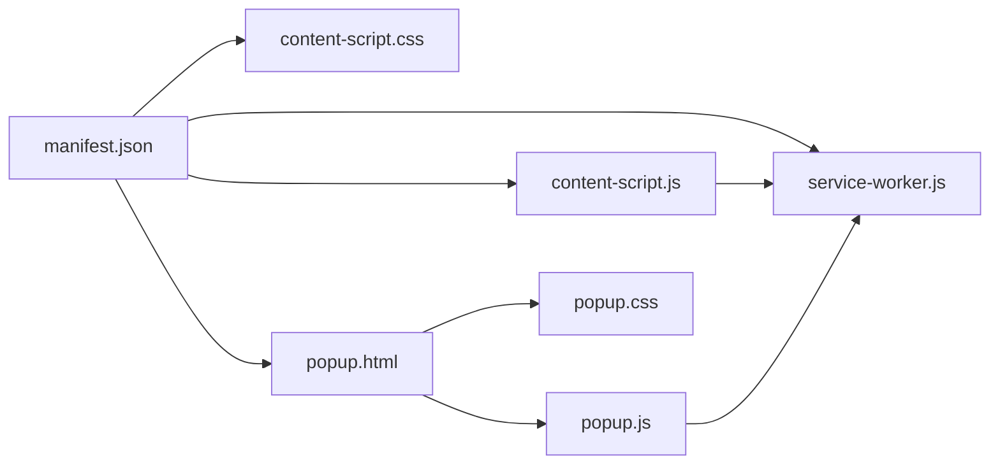

# 扩展架构设计

<cite>
**本文引用的文件**   
- [manifest.json](file://browser-extension/manifest.json)
- [service-worker.js](file://browser-extension/service-worker.js)
- [content-script.js](file://browser-extension/content-script.js)
- [content-script.css](file://browser-extension/content-script.css)
- [popup.html](file://browser-extension/popup.html)
- [popup.js](file://browser-extension/popup.js)
- [popup.css](file://browser-extension/popup.css)
- [README.md](file://browser-extension/README.md)
</cite>

## 目录
1. [简介](#简介)
2. [项目结构](#项目结构)
3. [核心组件](#核心组件)
4. [架构总览](#架构总览)
5. [详细组件分析](#详细组件分析)
6. [依赖关系分析](#依赖关系分析)
7. [性能考量](#性能考量)
8. [故障排查指南](#故障排查指南)
9. [结论](#结论)
10. [附录](#附录)

## 简介
本文件面向浏览器扩展（Chrome Extension）的架构设计与实现，围绕以下目标展开：
- 说明 Chrome 扩展的整体架构与模块职责
- 解析 manifest.json 的配置结构、权限设置与版本管理策略
- 阐述服务工作者（Service Worker）的作用与生命周期管理
- 解释扩展的安全模型、内容安全策略（CSP）与跨域通信机制
- 描述扩展的安装流程、权限请求与用户授权过程
- 提供架构决策的技术背景与权衡考虑

## 项目结构
浏览器扩展位于 browser-extension 目录，采用 Manifest V3 的现代扩展架构。核心文件包括：
- manifest.json：扩展清单，定义元数据、权限、脚本注入与服务工作者等
- service-worker.js：后台任务处理、消息路由与持久化状态协调
- content-script.*：注入到网页上下文的内容脚本与样式
- popup.*：弹出面板 UI 与交互逻辑

图表来源
- [manifest.json](file://browser-extension/manifest.json)
- [service-worker.js](file://browser-extension/service-worker.js)
- [content-script.js](file://browser-extension/content-script.js)
- [content-script.css](file://browser-extension/content-script.css)
- [popup.html](file://browser-extension/popup.html)
- [popup.js](file://browser-extension/popup.js)
- [popup.css](file://browser-extension/popup.css)

章节来源
- [README.md](file://browser-extension/README.md)

## 核心组件
- 清单配置（manifest.json）
  - 定义扩展名称、版本、图标、描述等元信息
  - 声明权限（如存储、网络访问、标签页操作等）
  - 指定 Service Worker 入口与内容脚本注入规则
  - 配置弹出面板（popup）页面与相关资源
- 服务工作者（service-worker.js）
  - 作为扩展的后台进程，处理异步任务、消息转发、事件监听
  - 管理扩展状态、缓存与与后端服务的通信
  - 协调 Content Script 与 Popup 之间的消息传递
- 内容脚本（content-script.js / content-script.css）
  - 注入到目标网页，读取或修改 DOM，收集页面信息
  - 通过消息通道与 Service Worker 和 Popup 通信
  - 应用样式以增强或覆盖页面展示
- 弹出面板（popup.html / popup.js / popup.css）
  - 提供用户交互界面，触发扩展功能并显示结果
  - 通过消息通道调用 Service Worker 能力
  - 渲染与样式由 HTML/CSS 控制

章节来源
- [manifest.json](file://browser-extension/manifest.json)
- [service-worker.js](file://browser-extension/service-worker.js)
- [content-script.js](file://browser-extension/content-script.js)
- [content-script.css](file://browser-extension/content-script.css)
- [popup.html](file://browser-extension/popup.html)
- [popup.js](file://browser-extension/popup.js)
- [popup.css](file://browser-extension/popup.css)

## 架构总览
下图展示了扩展各组件之间的交互关系与数据流：

图表来源
- [service-worker.js](file://browser-extension/service-worker.js)
- [content-script.js](file://browser-extension/content-script.js)
- [popup.js](file://browser-extension/popup.js)

## 详细组件分析

### 清单配置（manifest.json）
- 作用
  - 声明扩展的元数据（名称、版本、图标、描述）
  - 配置权限范围（如 storage、tabs、activeTab、host 等）
  - 注册 Service Worker 与内容脚本注入规则
  - 定义弹出面板入口与资源引用
- 关键要点
  - 使用 Manifest V3，强制 Service Worker 替代旧版 background scripts
  - 最小权限原则：仅申请必要权限，降低安全风险
  - 版本管理：通过 version 字段进行升级与兼容性控制
  - CSP：遵循 MV3 默认严格策略，限制内联脚本与不安全源

章节来源
- [manifest.json](file://browser-extension/manifest.json)

### 服务工作者（service-worker.js）
- 角色
  - 扩展的后台进程，处理消息、事件与异步任务
  - 与 Content Script 和 Popup 进行消息路由
  - 管理本地存储、缓存与与后端服务的通信
- 生命周期
  - 按需启动与休眠：在无活动时自动终止，有事件时唤醒
  - 事件驱动：message、fetch、alarms 等事件回调
  - 状态恢复：从持久化存储恢复运行状态
- 通信模式
  - 使用 chrome.runtime.sendMessage/onMessage 进行跨上下文通信
  - 对敏感操作进行权限校验与输入验证
  - 错误处理与重试机制，确保稳定性

章节来源
- [service-worker.js](file://browser-extension/service-worker.js)

### 内容脚本（content-script.js / content-script.css）
- 作用
  - 注入到目标网页，读取 DOM、监听事件、收集数据
  - 通过消息通道与 Service Worker 和 Popup 通信
  - 应用样式以增强页面展示或提示用户
- 安全边界
  - 隔离于网页上下文，避免直接访问全局变量
  - 通过白名单域名与协议限制可注入的目标页面
  - 禁止加载远程脚本，遵循 CSP 策略
- 性能优化
  - 延迟注入与按需执行，减少开销
  - 防抖与节流，避免频繁 DOM 操作

章节来源
- [content-script.js](file://browser-extension/content-script.js)
- [content-script.css](file://browser-extension/content-script.css)

### 弹出面板（popup.html / popup.js / popup.css）
- 作用
  - 提供用户交互界面，触发扩展功能并展示结果
  - 通过消息通道调用 Service Worker 的能力
  - 渲染与样式由 HTML/CSS 控制
- 交互流程
  - 用户点击扩展图标，打开 popup
  - popup 向 Service Worker 发送请求
  - Service Worker 处理后返回结果，popup 更新 UI
- 用户体验
  - 快速响应与反馈
  - 错误提示与重试机制

章节来源
- [popup.html](file://browser-extension/popup.html)
- [popup.js](file://browser-extension/popup.js)
- [popup.css](file://browser-extension/popup.css)

## 依赖关系分析
扩展内部依赖关系如下：
- manifest.json 依赖所有其他资源文件
- service-worker.js 被 manifest 注册为后台进程
- content-script.js 被 manifest 注入到目标网页
- popup.js 被 popup.html 引用，提供交互逻辑

图表来源
- [manifest.json](file://browser-extension/manifest.json)
- [service-worker.js](file://browser-extension/service-worker.js)
- [content-script.js](file://browser-extension/content-script.js)
- [content-script.css](file://browser-extension/content-script.css)
- [popup.html](file://browser-extension/popup.html)
- [popup.js](file://browser-extension/popup.js)
- [popup.css](file://browser-extension/popup.css)

## 性能考量
- 服务工作者按需启动，避免常驻内存
- 内容脚本延迟注入与按需执行，减少 DOM 操作开销
- 消息通信批量处理与去重，降低网络与计算压力
- 缓存策略：对重复请求使用本地缓存，提升响应速度
- 资源压缩与懒加载，减小扩展体积与加载时间

## 故障排查指南
- 常见问题
  - 权限不足：检查 manifest 中权限声明是否完整
  - CSP 错误：确认未使用内联脚本或不安全源
  - 消息通信失败：检查端口与消息格式是否正确
  - 服务工作者未启动：查看开发者工具中的 Service Workers 面板
- 调试技巧
  - 使用 Chrome 开发者工具的 Application 面板查看存储与缓存
  - 在 Network 面板监控网络请求与错误
  - 在 Console 中查看日志与异常堆栈
  - 使用 console.log 与断点调试关键路径

## 结论
本扩展采用 Manifest V3 与现代 Service Worker 架构，具备清晰的分层与职责分离。通过最小权限原则与严格的 CSP 策略，保障安全性与稳定性。内容脚本与弹出面板通过消息通道与服务工作者协作，实现高效的数据流与控制流。建议在后续迭代中持续优化性能与用户体验，并加强错误处理与监控能力。

## 附录
- 安装流程
  - 下载扩展包，解压至本地目录
  - 打开 Chrome 扩展管理页面，启用“开发者模式”
  - 点击“加载已解压的扩展程序”，选择扩展目录
  - 授予所需权限，完成安装
- 权限请求与用户授权
  - 首次运行时，Chrome 会提示用户授予权限
  - 用户可选择允许或拒绝，拒绝后部分功能不可用
  - 可在扩展设置中重新调整权限
- 架构决策与权衡
  - 选择 MV3 而非 MV2：更安全、更现代，但需适配新 API
  - 使用 Service Worker 而非 Background Scripts：节省资源，但生命周期更复杂
  - 内容脚本隔离：提升安全性，但增加通信复杂度
  - 最小权限原则：降低风险，但可能限制功能范围