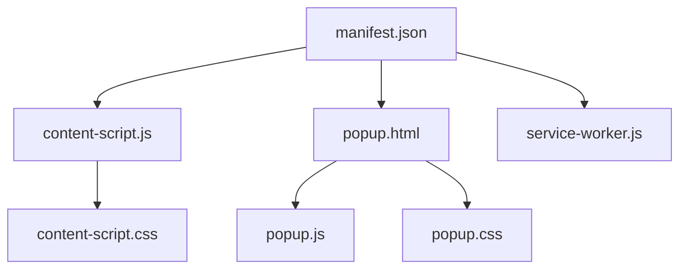
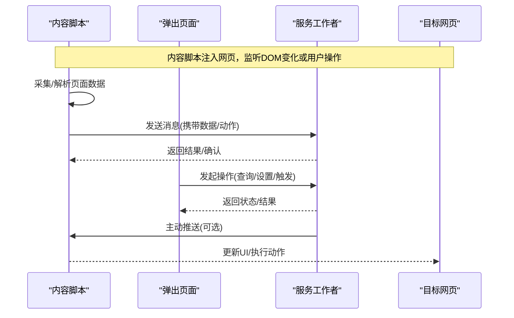
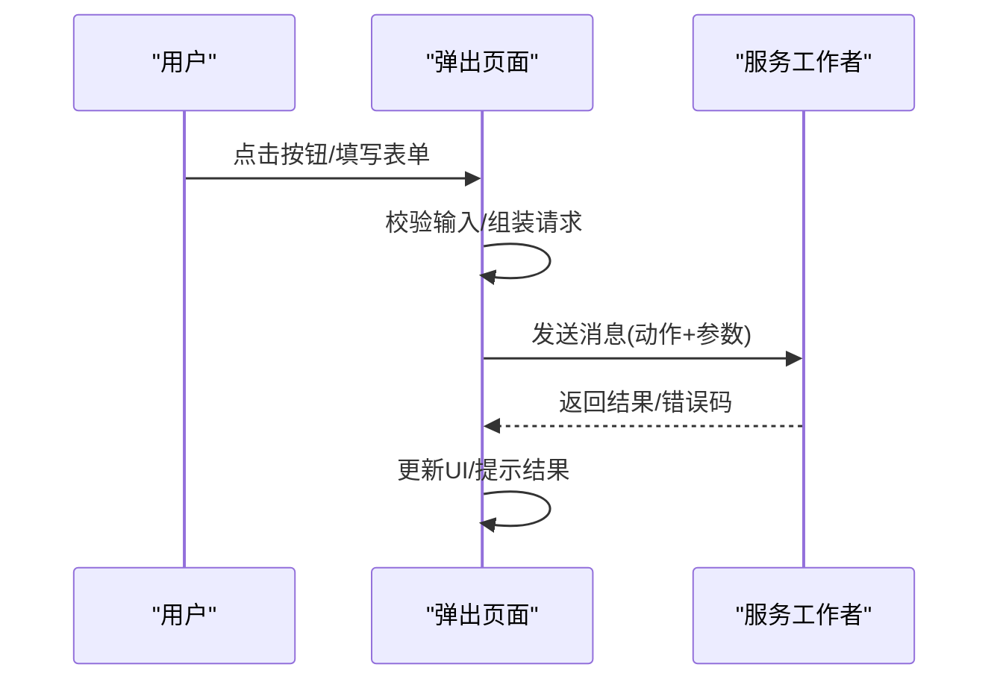
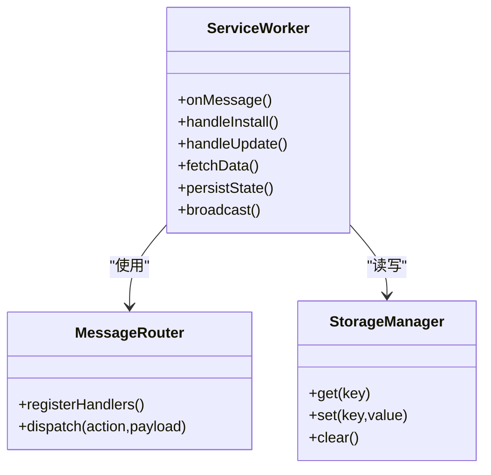

# 浏览器扩展

<cite>
**本文引用的文件**   
- [browser-extension/README.md](file://browser-extension/README.md)
- [browser-extension/manifest.json](file://browser-extension/manifest.json)
- [browser-extension/content-script.js](file://browser-extension/content-script.js)
- [browser-extension/content-script.css](file://browser-extension/content-script.css)
- [browser-extension/popup.html](file://browser-extension/popup.html)
- [browser-extension/popup.js](file://browser-extension/popup.js)
- [browser-extension/popup.css](file://browser-extension/popup.css)
- [browser-extension/service-worker.js](file://browser-extension/service-worker.js)
</cite>

## 目录
1. [简介](#简介)
2. [项目结构](#项目结构)
3. [核心组件](#核心组件)
4. [架构总览](#架构总览)
5. [详细组件分析](#详细组件分析)
6. [依赖关系分析](#依赖关系分析)
7. [性能考虑](#性能考虑)
8. [故障排查指南](#故障排查指南)
9. [结论](#结论)
10. [附录](#附录)

## 简介
本技术文档围绕浏览器扩展模块，系统性说明其架构设计与实现要点。重点覆盖内容脚本、弹出页面、服务工作者等组件的职责与交互方式，阐述扩展与主应用之间的通信机制、数据同步策略与安全考量，并给出安装配置、权限管理与版本更新流程建议。同时提供开发调试指南与常见问题解决方案，帮助开发者快速定位问题并优化体验。

## 项目结构
浏览器扩展位于 browser-extension 目录，采用 Manifest V3 的常见组织方式：
- manifest.json：扩展清单，定义名称、版本、权限、脚本入口、图标等元信息。
- content-script.js / content-script.css：注入到目标页面的内容与样式，用于 DOM 操作与界面增强。
- popup.html / popup.js / popup.css：用户点击扩展图标时弹出的独立窗口，提供交互面板。
- service-worker.js：后台任务处理（如消息转发、状态管理、跨上下文通信），在 MV3 中替代旧版 background page。

图示来源
- [browser-extension/manifest.json](file://browser-extension/manifest.json)
- [browser-extension/content-script.js](file://browser-extension/content-script.js)
- [browser-extension/content-script.css](file://browser-extension/content-script.css)
- [browser-extension/popup.html](file://browser-extension/popup.html)
- [browser-extension/popup.js](file://browser-extension/popup.js)
- [browser-extension/popup.css](file://browser-extension/popup.css)
- [browser-extension/service-worker.js](file://browser-extension/service-worker.js)

章节来源
- [browser-extension/README.md](file://browser-extension/README.md)
- [browser-extension/manifest.json](file://browser-extension/manifest.json)

## 核心组件
- 内容脚本（Content Script）
  - 职责：注入到网页上下文，读取或修改 DOM、监听页面事件、收集必要数据，并通过 chrome.runtime 与扩展其他部分通信。
  - 特点：受同源策略限制，无法直接访问扩展 API；需通过消息通道与背景/弹出页交互。
- 弹出页面（Popup）
  - 职责：展示控制面板、按钮、表单等 UI，响应用户操作，触发业务逻辑或向服务工作者发送指令。
  - 特点：拥有独立的 JS/CSS 环境，可调用扩展 API，但生命周期短，不适合长期运行任务。
- 服务工作者（Service Worker）
  - 职责：作为后台进程，处理持久化状态、消息路由、跨上下文通信、定时任务与网络请求。
  - 特点：MV3 下为单例且按需激活，避免长时间占用资源；需保持幂等与健壮的错误处理。

章节来源
- [browser-extension/content-script.js](file://browser-extension/content-script.js)
- [browser-extension/popup.html](file://browser-extension/popup.html)
- [browser-extension/popup.js](file://browser-extension/popup.js)
- [browser-extension/service-worker.js](file://browser-extension/service-worker.js)

## 架构总览
扩展采用“内容脚本 + 弹出页 + 服务工作者”的经典三件套架构，通过消息总线进行解耦通信。

图示来源
- [browser-extension/content-script.js](file://browser-extension/content-script.js)
- [browser-extension/popup.js](file://browser-extension/popup.js)
- [browser-extension/service-worker.js](file://browser-extension/service-worker.js)

## 详细组件分析

### 内容脚本（Content Script）
- 功能要点
  - 注入时机：通常在 DOMContentLoaded 或更晚阶段，确保目标元素存在。
  - 数据获取：从页面 DOM 提取结构化信息，必要时做清洗与校验。
  - 事件监听：捕获用户交互（点击、输入、滚动等），触发相应动作。
  - 通信协议：使用 chrome.runtime.sendMessage/onMessage 与服务工作者交换数据。
  - 样式注入：动态插入或切换 CSS，控制 UI 显示/隐藏与主题。
- 安全与隔离
  - 不直接访问扩展 API，避免权限越界。
  - 对不可信数据进行严格校验与白名单过滤。
  - 避免泄露敏感信息至全局作用域。

图示来源
- [browser-extension/content-script.js](file://browser-extension/content-script.js)
- [browser-extension/content-script.css](file://browser-extension/content-script.css)

章节来源
- [browser-extension/content-script.js](file://browser-extension/content-script.js)
- [browser-extension/content-script.css](file://browser-extension/content-script.css)

### 弹出页面（Popup）
- 功能要点
  - 界面渲染：基于 HTML/CSS/JS 构建轻量面板，提供开关、输入框、列表等控件。
  - 用户交互：绑定事件处理器，将用户意图转化为消息发送给服务工作者。
  - 状态反馈：根据服务工作者返回的结果更新面板状态与提示。
- 最佳实践
  - 避免长耗时操作，所有重活下沉到服务工作者。
  - 合理拆分 UI 与逻辑，便于测试与维护。
  - 统一错误提示与加载态，提升用户体验。

图示来源
- [browser-extension/popup.html](file://browser-extension/popup.html)
- [browser-extension/popup.js](file://browser-extension/popup.js)
- [browser-extension/popup.css](file://browser-extension/popup.css)

章节来源
- [browser-extension/popup.html](file://browser-extension/popup.html)
- [browser-extension/popup.js](file://browser-extension/popup.js)
- [browser-extension/popup.css](file://browser-extension/popup.css)

### 服务工作者（Service Worker）
- 功能要点
  - 消息路由：接收来自内容脚本与弹出页面的消息，分派到对应处理器。
  - 状态管理：维护扩展配置、缓存数据、会话信息等。
  - 网络请求：对外部 API 发起请求，处理鉴权、重试与超时。
  - 事件驱动：响应安装、更新、卸载、系统事件等。
- 设计原则
  - 无状态优先：尽量通过外部存储持久化关键状态。
  - 幂等性：重复消息应产生一致结果。
  - 错误边界：捕获异常并返回明确错误码，便于上层处理。

图示来源
- [browser-extension/service-worker.js](file://browser-extension/service-worker.js)

章节来源
- [browser-extension/service-worker.js](file://browser-extension/service-worker.js)

### 清单与权限（Manifest）
- 关键项
  - 名称、描述、版本、图标：用于商店展示与识别。
  - permissions：声明所需权限（如 storage、tabs、activeTab、host 等）。
  - host_permissions：限定可访问的外部域名。
  - action：定义弹出页入口。
  - content_scripts：声明注入规则与匹配模式。
  - background.service_worker：指定后台脚本路径。
- 安全建议
  - 最小权限原则：仅申请必要的权限与主机范围。
  - 严格的匹配模式：避免过度宽泛的 URL 匹配。
  - 定期审计权限变更，降低风险面。

章节来源
- [browser-extension/manifest.json](file://browser-extension/manifest.json)

## 依赖关系分析
- 组件耦合
  - 内容脚本与服务工作者通过消息通道松耦合，避免直接依赖。
  - 弹出页面与服务工作者同样以消息通信，保证 UI 层与业务层分离。
- 外部依赖
  - 浏览器扩展 API（chrome.runtime、chrome.storage、chrome.tabs 等）。
  - 目标网站 DOM API（谨慎使用，避免破坏页面稳定性）。
- 潜在循环依赖
  - 通过统一的消息协议与中间路由层规避循环调用。

图示来源
- [browser-extension/content-script.js](file://browser-extension/content-script.js)
- [browser-extension/popup.js](file://browser-extension/popup.js)
- [browser-extension/service-worker.js](file://browser-extension/service-worker.js)

章节来源
- [browser-extension/content-script.js](file://browser-extension/content-script.js)
- [browser-extension/popup.js](file://browser-extension/popup.js)
- [browser-extension/service-worker.js](file://browser-extension/service-worker.js)

## 性能考虑
- 内容脚本
  - 延迟注入：仅在需要时注入，减少初始开销。
  - 防抖节流：对高频事件（滚动、输入）做节流，避免阻塞页面。
  - 增量更新：局部更新 DOM，避免整页重绘。
- 弹出页面
  - 懒加载：按需加载脚本与样式，缩短首屏时间。
  - 精简 UI：减少复杂动画与大图，提升响应速度。
- 服务工作者
  - 按需激活：避免常驻后台，利用事件驱动模型。
  - 缓存策略：合理使用 cache/storage，减少重复请求。
  - 批量处理：合并小消息，降低 IPC 开销。

[本节为通用指导，无需特定文件引用]

## 故障排查指南
- 常见问题
  - 消息未送达：检查权限与匹配模式是否正确，确认 onMessage 已注册。
  - 页面注入失败：核对 content_scripts.matches 与注入时机。
  - 弹出页空白：检查 HTML/CSS/JS 路径与打包产物是否可用。
  - 服务工作者不触发：确认 background.service_worker 路径正确且无语法错误。
- 调试技巧
  - 内容脚本：在目标页面打开 DevTools 的 Console 查看日志。
  - 弹出页面：右键扩展图标选择“检查弹出窗口”，进入 DevTools。
  - 服务工作者：在扩展管理页找到该扩展，点击“服务工作者”链接查看控制台。
  - 日志输出：统一日志格式，区分级别（info/warn/error），便于检索。
- 恢复策略
  - 清理缓存与本地存储后重试。
  - 禁用并重新启用扩展，强制重启服务工作者。
  - 降级到兼容模式，逐步定位问题。

章节来源
- [browser-extension/README.md](file://browser-extension/README.md)
- [browser-extension/manifest.json](file://browser-extension/manifest.json)
- [browser-extension/service-worker.js](file://browser-extension/service-worker.js)

## 结论
本扩展采用清晰的三层架构与消息驱动通信，兼顾可扩展性与安全性。通过最小权限、严格匹配与稳健的错误处理，保障在复杂网页环境中的稳定运行。建议在迭代过程中持续优化注入时机、事件处理与缓存策略，以提升性能与用户体验。

[本节为总结性内容，无需特定文件引用]

## 附录
- 安装与配置
  - 下载扩展包，解压至本地目录。
  - 在 Chrome 中打开“扩展程序”页面，启用“开发者模式”。
  - 点击“加载已解压的扩展程序”，选择扩展根目录。
  - 根据需要调整 manifest.json 中的权限与匹配模式。
- 权限管理
  - 仅申请必要权限，避免过度授权。
  - 定期审查权限变更，及时回收不再使用的权限。
- 版本更新流程
  - 递增 manifest.json 的版本号。
  - 更新 changelog 与 README，记录重要变更。
  - 重新打包并在测试环境验证后再发布。
- 开发调试清单
  - 确认各脚本路径与 CSP 策略正确。
  - 使用统一的日志与错误上报机制。
  - 编写单元测试与集成测试，覆盖关键路径。

[本节为通用指导，无需特定文件引用]