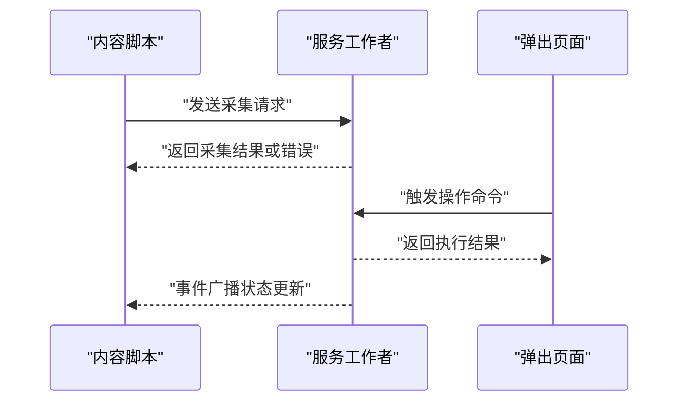
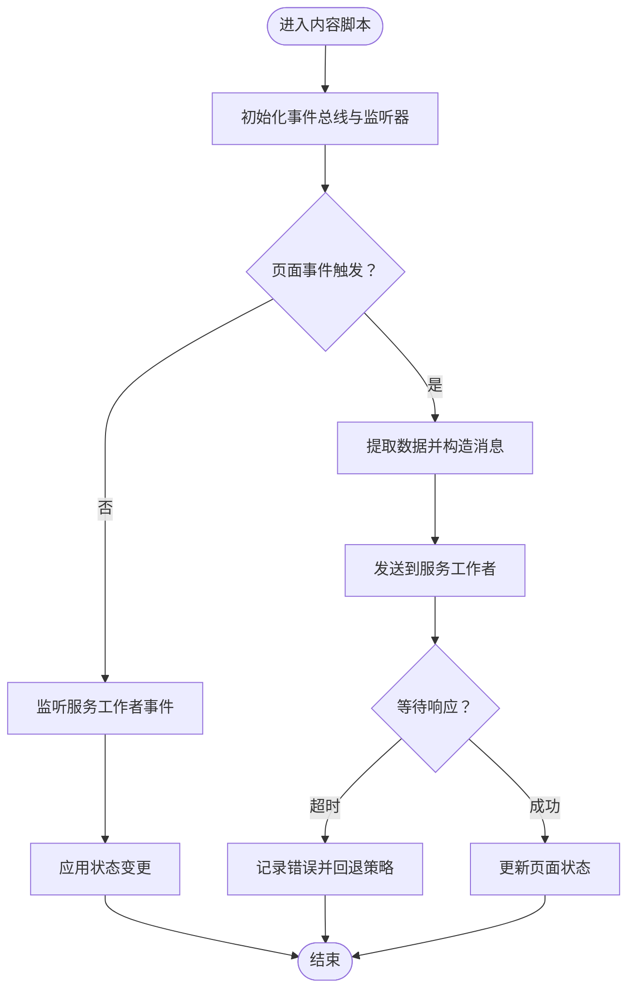
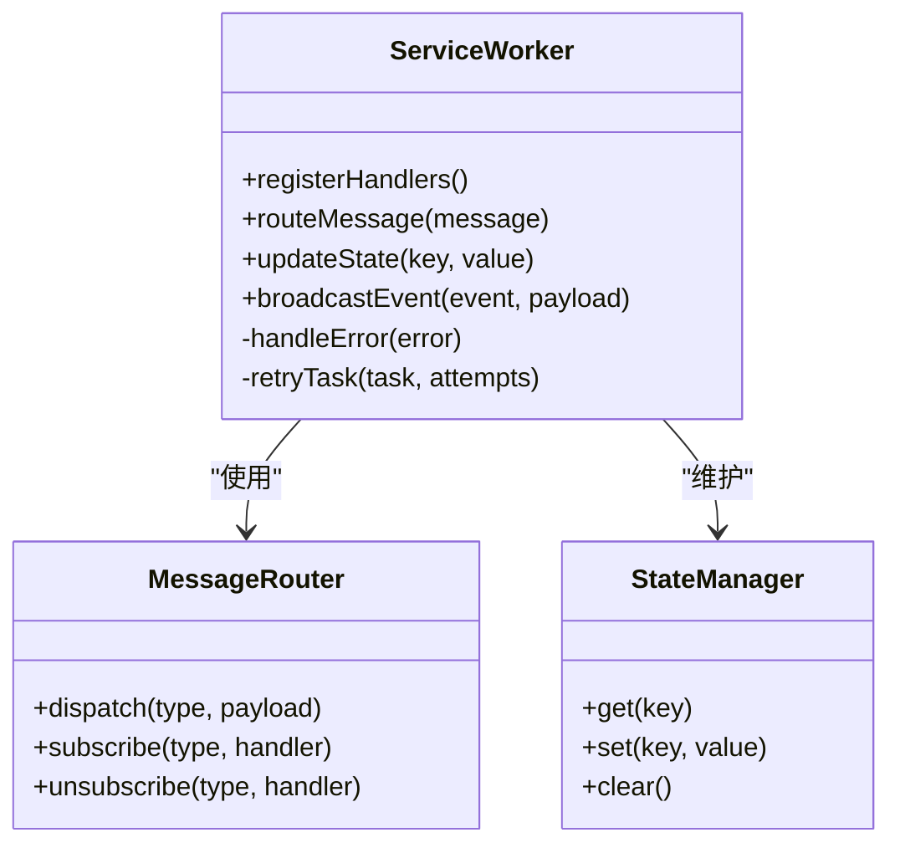
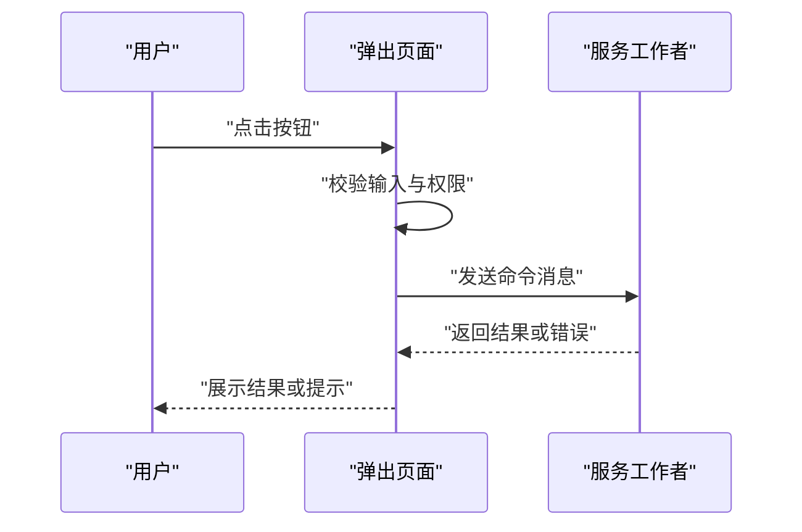
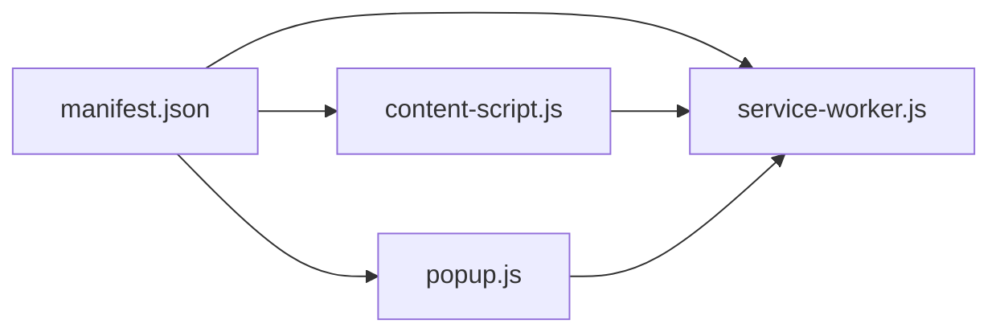

# 通信机制

<cite>
**本文引用的文件**   
- [manifest.json](file://browser-extension/manifest.json)
- [service-worker.js](file://browser-extension/service-worker.js)
- [content-script.js](file://browser-extension/content-script.js)
- [popup.html](file://browser-extension/popup.html)
- [popup.js](file://browser-extension/popup.js)
</cite>

## 目录
1. [简介](#简介)
2. [项目结构](#项目结构)
3. [核心组件](#核心组件)
4. [架构总览](#架构总览)
5. [详细组件分析](#详细组件分析)
6. [依赖关系分析](#依赖关系分析)
7. [性能考虑](#性能考虑)
8. [故障排查指南](#故障排查指南)
9. [结论](#结论)
10. [附录](#附录)

## 简介
本技术文档聚焦于浏览器扩展的通信机制，围绕内容脚本（Content Script）、弹出页面（Popup）与服务工作者（Service Worker）之间的消息传递协议展开。文档涵盖 IPC 通信的实现方式、消息格式定义、异步处理与错误处理机制，跨上下文通信的安全与权限控制，以及实时数据同步、事件广播与状态共享方案。同时提供通信性能优化建议与调试工具使用指南，帮助开发者构建稳定高效的扩展通信体系。

## 项目结构
浏览器扩展的核心通信由以下文件协同完成：
- manifest.json：声明扩展权限、注册 Service Worker 与 Content Script，并配置消息通道相关能力。
- service-worker.js：作为后台任务与持久化逻辑中心，负责跨上下文消息路由、状态管理与外部服务调用。
- content-script.js：注入到网页中，采集页面数据并与扩展其他上下文交互。
- popup.html/popup.js：用户界面入口，发起用户操作相关的请求与展示结果。

```mermaid
graph TB
A["manifest.json<br/>声明权限与注册"] --> B["service-worker.js<br/>后台消息路由与状态管理"]
A --> C["content-script.js<br/>页面内数据采集与交互"]
A --> D["popup.html/popup.js<br/>用户界面与操作入口"]
C < --> B
D < --> B
```

**图表来源** 
- [manifest.json](file://browser-extension/manifest.json)
- [service-worker.js](file://browser-extension/service-worker.js)
- [content-script.js](file://browser-extension/content-script.js)
- [popup.html](file://browser-extension/popup.html)
- [popup.js](file://browser-extension/popup.js)

**章节来源**
- [manifest.json](file://browser-extension/manifest.json)
- [service-worker.js](file://browser-extension/service-worker.js)
- [content-script.js](file://browser-extension/content-script.js)
- [popup.html](file://browser-extension/popup.html)
- [popup.js](file://browser-extension/popup.js)

## 核心组件
- 内容脚本（Content Script）
  - 职责：监听页面事件、提取 DOM 或网络数据、向 Service Worker 发送请求、接收响应并更新页面状态。
  - 通信方式：通过浏览器扩展 API 进行跨上下文消息传递；可使用事件总线模式实现页面内广播。
- 服务工作者（Service Worker）
  - 职责：集中式消息路由、状态存储与同步、对外部服务调用、缓存策略与重试机制。
  - 通信方式：订阅来自 Content Script 与 Popup 的消息，统一分发与聚合响应。
- 弹出页面（Popup）
  - 职责：用户交互入口，触发扩展功能、显示结果与设置项。
  - 通信方式：通过扩展 API 向 Service Worker 发送命令类消息，并订阅状态变更事件。

**章节来源**
- [content-script.js](file://browser-extension/content-script.js)
- [service-worker.js](file://browser-extension/service-worker.js)
- [popup.js](file://browser-extension/popup.js)

## 架构总览
扩展采用“中心化路由 + 事件驱动”的通信架构。Service Worker 作为中枢，统一处理来自 Content Script 与 Popup 的请求，确保状态一致性与安全校验。Content Script 与 Popup 之间不直接通信，避免跨上下文耦合与权限泄露风险。



**图表来源** 
- [service-worker.js](file://browser-extension/service-worker.js)
- [content-script.js](file://browser-extension/content-script.js)
- [popup.js](file://browser-extension/popup.js)

## 详细组件分析

### 内容脚本（Content Script）
- 消息发送与接收
  - 通过扩展 API 向 Service Worker 发送结构化消息，包含类型、载荷与可选回调标识。
  - 监听来自 Service Worker 的事件，用于实时更新页面状态或触发 UI 反馈。
- 页面内事件广播
  - 在内容脚本内部维护轻量事件总线，支持发布/订阅模式，解耦页面逻辑与扩展通信。
- 错误处理
  - 对超时、网络异常与解析失败进行捕获，向上层抛出可识别的错误码与描述信息。



**图表来源** 
- [content-script.js](file://browser-extension/content-script.js)

**章节来源**
- [content-script.js](file://browser-extension/content-script.js)

### 服务工作者（Service Worker）
- 消息路由与处理
  - 统一注册消息处理器，根据消息类型分派到对应业务逻辑。
  - 维护全局状态与缓存，确保跨上下文一致性。
- 异步与并发
  - 使用队列或锁机制限制并发请求，避免资源竞争。
  - 对耗时操作采用任务调度与重试策略。
- 错误与恢复
  - 捕获异常并转换为标准错误对象，包含错误码、堆栈与上下文信息。
  - 提供降级路径与默认值，保证扩展稳定性。



**图表来源** 
- [service-worker.js](file://browser-extension/service-worker.js)

**章节来源**
- [service-worker.js](file://browser-extension/service-worker.js)

### 弹出页面（Popup）
- 用户操作与命令发送
  - 将用户输入封装为标准命令消息，发送至 Service Worker。
  - 监听响应并渲染结果，支持加载态与错误提示。
- 状态订阅与刷新
  - 订阅关键状态变更事件，自动刷新界面或触发二次操作。
- 权限与安全
  - 仅请求必要权限，避免过度授权。
  - 对用户输入进行校验与过滤，防止注入攻击。



**图表来源** 
- [popup.js](file://browser-extension/popup.js)
- [service-worker.js](file://browser-extension/service-worker.js)

**章节来源**
- [popup.js](file://browser-extension/popup.js)

## 依赖关系分析
- manifest.json 声明了扩展所需的权限与组件注册，决定了各上下文间的通信能力边界。
- Service Worker 依赖扩展 API 进行消息路由与状态管理，是通信中枢。
- Content Script 与 Popup 均依赖扩展 API 与 Service Worker 提供的接口，形成单向依赖。



**图表来源** 
- [manifest.json](file://browser-extension/manifest.json)
- [service-worker.js](file://browser-extension/service-worker.js)
- [content-script.js](file://browser-extension/content-script.js)
- [popup.js](file://browser-extension/popup.js)

**章节来源**
- [manifest.json](file://browser-extension/manifest.json)
- [service-worker.js](file://browser-extension/service-worker.js)
- [content-script.js](file://browser-extension/content-script.js)
- [popup.js](file://browser-extension/popup.js)

## 性能考虑
- 消息批处理：合并高频小消息为批量发送，减少通信开销。
- 去重与缓存：对重复请求进行去重，利用本地缓存加速响应。
- 懒加载与按需订阅：仅在需要时建立监听，避免不必要的资源占用。
- 超时与重试：设置合理超时阈值，对瞬时失败进行有限次重试。
- 序列化优化：精简消息载荷，避免大对象频繁传输。

[本节为通用指导，无需特定文件引用]

## 故障排查指南
- 常见问题定位
  - 检查 manifest.json 中的权限声明是否完整。
  - 确认 Service Worker 是否正确注册并存活。
  - 验证消息类型与载荷是否符合约定格式。
- 调试技巧
  - 使用浏览器开发者工具的“扩展”面板查看消息流。
  - 在服务工作者中启用日志输出，记录关键路径与错误堆栈。
  - 在内容脚本中临时添加断点，观察事件触发顺序。
- 错误恢复策略
  - 对网络错误实施指数退避重试。
  - 对解析失败提供默认值与降级逻辑。
  - 记录不可恢复错误的上下文信息，便于后续分析。

**章节来源**
- [manifest.json](file://browser-extension/manifest.json)
- [service-worker.js](file://browser-extension/service-worker.js)
- [content-script.js](file://browser-extension/content-script.js)
- [popup.js](file://browser-extension/popup.js)

## 结论
本扩展采用以 Service Worker 为中心的通信架构，通过标准化消息协议与事件驱动模型，实现了内容脚本、弹出页面与服务工作者之间的高效、安全交互。结合批处理、缓存、重试等优化策略，以及完善的错误处理与调试手段，可有效提升扩展的稳定性与用户体验。建议在开发过程中严格遵循权限最小化原则，持续监控性能指标，并定期审查通信协议的安全性。

[本节为总结性内容，无需特定文件引用]

## 附录
- 消息格式建议
  - 类型字段：字符串，标识消息类别（如“采集”、“命令”、“事件”）。
  - 载荷字段：对象，包含业务数据与元数据。
  - 回调标识：可选，用于关联请求与响应。
- 安全最佳实践
  - 对所有输入进行白名单校验。
  - 避免在消息中传输敏感信息。
  - 限制消息频率与大小，防止滥用。
- 调试工具推荐
  - 浏览器扩展开发者面板。
  - 服务工作者日志输出与性能分析。
  - 内容脚本控制台与事件监听工具。

[本节为补充信息，无需特定文件引用]