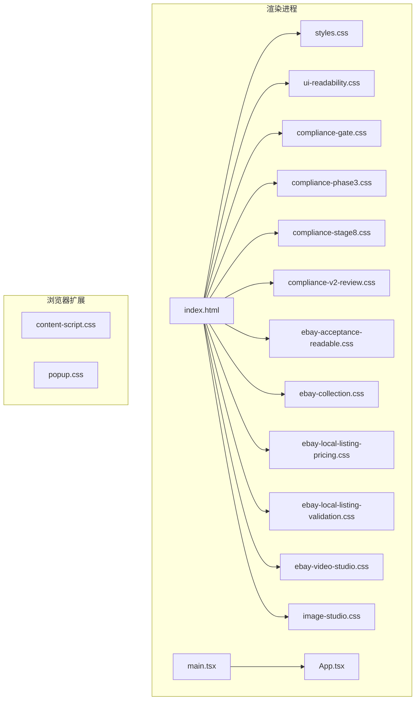
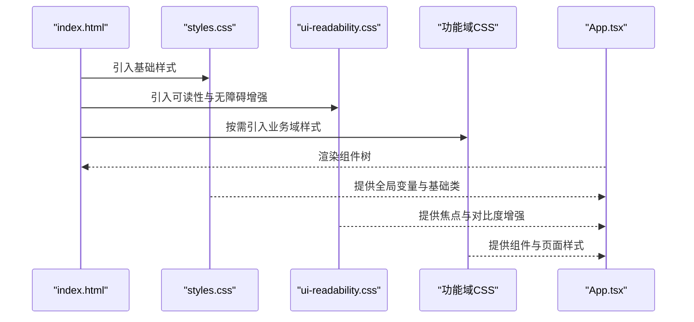
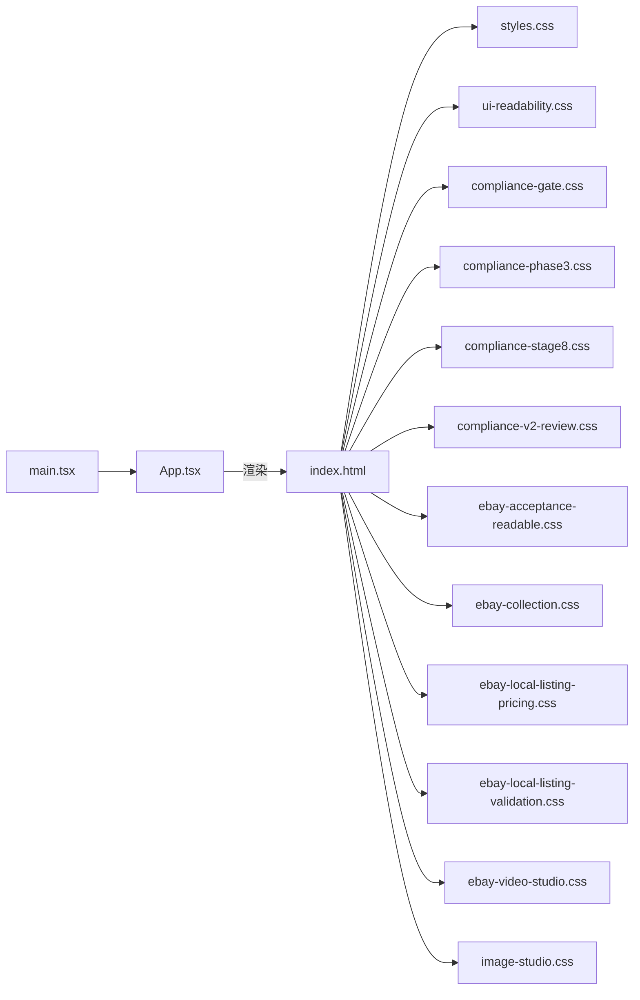

# UI样式与主题

<cite>
**本文引用的文件**   
- [src/renderer/styles.css](file://src/renderer/styles.css)
- [src/renderer/index.html](file://src/renderer/index.html)
- [src/renderer/main.tsx](file://src/renderer/main.tsx)
- [src/renderer/App.tsx](file://src/renderer/App.tsx)
- [src/renderer/compliance-gate.css](file://src/renderer/compliance-gate.css)
- [src/renderer/compliance-phase3.css](file://src/renderer/compliance-phase3.css)
- [src/renderer/compliance-stage8.css](file://src/renderer/compliance-stage8.css)
- [src/renderer/compliance-v2-review.css](file://src/renderer/compliance-v2-review.css)
- [src/renderer/ebay-acceptance-readable.css](file://src/renderer/ebay-acceptance-readable.css)
- [src/renderer/ebay-collection.css](file://src/renderer/ebay-collection.css)
- [src/renderer/ebay-local-listing-pricing.css](file://src/renderer/ebay-local-listing-pricing.css)
- [src/renderer/ebay-local-listing-validation.css](file://src/renderer/ebay-local-listing-validation.css)
- [src/renderer/ebay-video-studio.css](file://src/renderer/ebay-video-studio.css)
- [src/renderer/image-studio.css](file://src/renderer/image-studio.css)
- [src/renderer/ui-readability.css](file://src/renderer/ui-readability.css)
- [browser-extension/content-script.css](file://browser-extension/content-script.css)
- [browser-extension/popup.css](file://browser-extension/popup.css)
- [vite.config.ts](file://vite.config.ts)
</cite>

## 目录
1. [简介](#简介)
2. [项目结构](#项目结构)
3. [核心组件](#核心组件)
4. [架构总览](#架构总览)
5. [详细组件分析](#详细组件分析)
6. [依赖关系分析](#依赖关系分析)
7. [性能考虑](#性能考虑)
8. [故障排查指南](#故障排查指南)
9. [结论](#结论)
10. [附录](#附录)

## 简介
本文件系统化梳理本项目的前端UI样式与主题体系，覆盖CSS架构设计、样式组织规范、主题定制机制、响应式策略、可访问性支持、跨浏览器兼容性、颜色系统、字体规范、组件样式与动画效果，以及主题切换、样式覆盖与性能优化实践。目标是帮助开发者快速理解并高效扩展样式系统，确保一致、可维护且高性能的用户界面。

## 项目结构
前端样式主要位于渲染进程（renderer）与浏览器扩展两个区域：
- 渲染进程样式集中在 src/renderer 下，按功能域拆分多个CSS文件，并通过入口HTML或模块按需引入。
- 浏览器扩展样式位于 browser-extension 下，包含内容脚本与弹出页的独立样式。

图表来源
- [src/renderer/index.html](file://src/renderer/index.html)
- [src/renderer/styles.css](file://src/renderer/styles.css)
- [src/renderer/ui-readability.css](file://src/renderer/ui-readability.css)
- [src/renderer/compliance-gate.css](file://src/renderer/compliance-gate.css)
- [src/renderer/compliance-phase3.css](file://src/renderer/compliance-phase3.css)
- [src/renderer/compliance-stage8.css](file://src/renderer/compliance-stage8.css)
- [src/renderer/compliance-v2-review.css](file://src/renderer/compliance-v2-review.css)
- [src/renderer/ebay-acceptance-readable.css](file://src/renderer/ebay-acceptance-readable.css)
- [src/renderer/ebay-collection.css](file://src/renderer/ebay-collection.css)
- [src/renderer/ebay-local-listing-pricing.css](file://src/renderer/ebay-local-listing-pricing.css)
- [src/renderer/ebay-local-listing-validation.css](file://src/renderer/ebay-local-listing-validation.css)
- [src/renderer/ebay-video-studio.css](file://src/renderer/ebay-video-studio.css)
- [src/renderer/image-studio.css](file://src/renderer/image-studio.css)
- [browser-extension/content-script.css](file://browser-extension/content-script.css)
- [browser-extension/popup.css](file://browser-extension/popup.css)

章节来源
- [src/renderer/index.html](file://src/renderer/index.html)
- [src/renderer/styles.css](file://src/renderer/styles.css)
- [src/renderer/main.tsx](file://src/renderer/main.tsx)
- [src/renderer/App.tsx](file://src/renderer/App.tsx)
- [browser-extension/content-script.css](file://browser-extension/content-script.css)
- [browser-extension/popup.css](file://browser-extension/popup.css)

## 核心组件
- 全局基础样式：集中定义颜色变量、字体族、排版基线、布局网格与通用组件样式，作为所有页面与功能的基石。
- 可读性与无障碍增强：提供对比度、焦点可见性、屏幕阅读器友好提示等增强样式。
- 业务域样式：针对合规检查、Ebay相关页面、视频工作室、图片工作室等功能域提供专用样式。
- 扩展样式：为浏览器扩展的内容脚本与弹出页提供隔离样式，避免与主应用冲突。

章节来源
- [src/renderer/styles.css](file://src/renderer/styles.css)
- [src/renderer/ui-readability.css](file://src/renderer/ui-readability.css)
- [src/renderer/compliance-gate.css](file://src/renderer/compliance-gate.css)
- [src/renderer/compliance-phase3.css](file://src/renderer/compliance-phase3.css)
- [src/renderer/compliance-stage8.css](file://src/renderer/compliance-stage8.css)
- [src/renderer/compliance-v2-review.css](file://src/renderer/compliance-v2-review.css)
- [src/renderer/ebay-acceptance-readable.css](file://src/renderer/ebay-acceptance-readable.css)
- [src/renderer/ebay-collection.css](file://src/renderer/ebay-collection.css)
- [src/renderer/ebay-local-listing-pricing.css](file://src/renderer/ebay-local-listing-pricing.css)
- [src/renderer/ebay-local-listing-validation.css](file://src/renderer/ebay-local-listing-validation.css)
- [src/renderer/ebay-video-studio.css](file://src/renderer/ebay-video-studio.css)
- [src/renderer/image-studio.css](file://src/renderer/image-studio.css)
- [browser-extension/content-script.css](file://browser-extension/content-script.css)
- [browser-extension/popup.css](file://browser-extension/popup.css)

## 架构总览
样式加载与使用流程遵循“基础层 → 增强层 → 业务层”的分层策略，通过HTML入口统一引入，保证样式优先级与可维护性。

图表来源
- [src/renderer/index.html](file://src/renderer/index.html)
- [src/renderer/styles.css](file://src/renderer/styles.css)
- [src/renderer/ui-readability.css](file://src/renderer/ui-readability.css)
- [src/renderer/compliance-gate.css](file://src/renderer/compliance-gate.css)
- [src/renderer/compliance-phase3.css](file://src/renderer/compliance-phase3.css)
- [src/renderer/compliance-stage8.css](file://src/renderer/compliance-stage8.css)
- [src/renderer/compliance-v2-review.css](file://src/renderer/compliance-v2-review.css)
- [src/renderer/ebay-acceptance-readable.css](file://src/renderer/ebay-acceptance-readable.css)
- [src/renderer/ebay-collection.css](file://src/renderer/ebay-collection.css)
- [src/renderer/ebay-local-listing-pricing.css](file://src/renderer/ebay-local-listing-pricing.css)
- [src/renderer/ebay-local-listing-validation.css](file://src/renderer/ebay-local-listing-validation.css)
- [src/renderer/ebay-video-studio.css](file://src/renderer/ebay-video-studio.css)
- [src/renderer/image-studio.css](file://src/renderer/image-studio.css)
- [src/renderer/main.tsx](file://src/renderer/main.tsx)
- [src/renderer/App.tsx](file://src/renderer/App.tsx)

## 详细组件分析

### 颜色系统与主题定制
- 颜色变量：建议在全局样式中统一定义语义化颜色变量（如背景、前景、强调色、成功、警告、错误），便于主题切换与一致性控制。
- 主题模式：可通过数据属性或类名切换明暗主题，结合媒体查询与用户偏好实现自动适配。
- 覆盖策略：在业务域样式中使用更高特异性或作用域选择器进行局部覆盖，避免污染全局。

章节来源
- [src/renderer/styles.css](file://src/renderer/styles.css)
- [src/renderer/ui-readability.css](file://src/renderer/ui-readability.css)

### 字体规范与排版
- 字体族：定义默认字体族与回退方案，确保多平台一致性。
- 字号与行高：建立层级化的字号与行高比例，提升可读性与视觉节奏。
- 文本对齐与断行：统一文本对齐规则与换行策略，避免溢出与错位。

章节来源
- [src/renderer/styles.css](file://src/renderer/styles.css)
- [src/renderer/ui-readability.css](file://src/renderer/ui-readability.css)

### 响应式设计
- 断点策略：基于常见设备宽度定义断点，采用移动优先原则编写样式。
- 弹性布局：广泛使用Flexbox与Grid构建自适应布局，配合媒体查询调整排列与间距。
- 图片与媒体：设置最大宽度与高度约束，确保在不同视口下正常缩放。

章节来源
- [src/renderer/styles.css](file://src/renderer/styles.css)
- [src/renderer/ebay-collection.css](file://src/renderer/ebay-collection.css)
- [src/renderer/ebay-video-studio.css](file://src/renderer/ebay-video-studio.css)
- [src/renderer/image-studio.css](file://src/renderer/image-studio.css)

### 可访问性支持
- 对比度：确保文本与背景对比度满足WCAG标准，必要时提供高对比度主题。
- 焦点管理：明确焦点样式，支持键盘导航与屏幕阅读器。
- 语义化：使用语义化标签与ARIA属性，提升辅助技术识别能力。

章节来源
- [src/renderer/ui-readability.css](file://src/renderer/ui-readability.css)

### 组件样式与动画
- 组件原子化：将按钮、卡片、表单控件等拆分为可复用样式块，保持命名一致。
- 动画与过渡：使用CSS过渡与关键帧动画，注意性能与用户体验平衡。
- 状态反馈：为交互状态（悬停、激活、禁用、加载）提供清晰视觉反馈。

章节来源
- [src/renderer/compliance-gate.css](file://src/renderer/compliance-gate.css)
- [src/renderer/compliance-phase3.css](file://src/renderer/compliance-phase3.css)
- [src/renderer/compliance-stage8.css](file://src/renderer/compliance-stage8.css)
- [src/renderer/compliance-v2-review.css](file://src/renderer/compliance-v2-review.css)
- [src/renderer/ebay-local-listing-pricing.css](file://src/renderer/ebay-local-listing-pricing.css)
- [src/renderer/ebay-local-listing-validation.css](file://src/renderer/ebay-local-listing-validation.css)
- [src/renderer/ebay-video-studio.css](file://src/renderer/ebay-video-studio.css)
- [src/renderer/image-studio.css](file://src/renderer/image-studio.css)

### 浏览器扩展样式
- 内容脚本样式：用于注入目标页面的样式增强，需避免与宿主页面冲突。
- 弹出页样式：独立于主应用的UI，保持简洁与易用性。

章节来源
- [browser-extension/content-script.css](file://browser-extension/content-script.css)
- [browser-extension/popup.css](file://browser-extension/popup.css)

## 依赖关系分析
样式文件的加载顺序与依赖关系直接影响最终渲染效果。HTML入口负责引入基础与增强样式，业务域样式按需加载；TypeScript入口负责渲染应用组件树，组件内部引用对应样式。

图表来源
- [src/renderer/index.html](file://src/renderer/index.html)
- [src/renderer/styles.css](file://src/renderer/styles.css)
- [src/renderer/ui-readability.css](file://src/renderer/ui-readability.css)
- [src/renderer/compliance-gate.css](file://src/renderer/compliance-gate.css)
- [src/renderer/compliance-phase3.css](file://src/renderer/compliance-phase3.css)
- [src/renderer/compliance-stage8.css](file://src/renderer/compliance-stage8.css)
- [src/renderer/compliance-v2-review.css](file://src/renderer/compliance-v2-review.css)
- [src/renderer/ebay-acceptance-readable.css](file://src/renderer/ebay-acceptance-readable.css)
- [src/renderer/ebay-collection.css](file://src/renderer/ebay-collection.css)
- [src/renderer/ebay-local-listing-pricing.css](file://src/renderer/ebay-local-listing-pricing.css)
- [src/renderer/ebay-local-listing-validation.css](file://src/renderer/ebay-local-listing-validation.css)
- [src/renderer/ebay-video-studio.css](file://src/renderer/ebay-video-studio.css)
- [src/renderer/image-studio.css](file://src/renderer/image-studio.css)
- [src/renderer/main.tsx](file://src/renderer/main.tsx)
- [src/renderer/App.tsx](file://src/renderer/App.tsx)

章节来源
- [src/renderer/index.html](file://src/renderer/index.html)
- [src/renderer/main.tsx](file://src/renderer/main.tsx)
- [src/renderer/App.tsx](file://src/renderer/App.tsx)

## 性能考虑
- 样式体积控制：仅引入必要样式，避免重复与冗余；对大型样式文件进行拆分与懒加载。
- 选择器优化：减少深层嵌套与复杂选择器，提高匹配效率。
- 动画与过渡：合理使用GPU加速属性，避免重排与重绘。
- 构建优化：利用Vite等工具进行样式压缩、去重与缓存。

章节来源
- [vite.config.ts](file://vite.config.ts)

## 故障排查指南
- 样式未生效：检查HTML引入顺序与CSS加载时机，确认选择器特异性是否被覆盖。
- 主题切换无效：验证数据属性或类名是否正确切换，检查媒体查询与用户偏好设置。
- 响应式异常：核对断点与媒体查询条件，确认容器尺寸与父级布局影响。
- 可访问性问题：使用浏览器无障碍检测工具验证对比度与焦点样式，确保语义化标签正确。
- 扩展样式冲突：为内容脚本样式添加命名空间或Shadow DOM隔离，避免与宿主页面冲突。

章节来源
- [src/renderer/index.html](file://src/renderer/index.html)
- [src/renderer/styles.css](file://src/renderer/styles.css)
- [src/renderer/ui-readability.css](file://src/renderer/ui-readability.css)
- [browser-extension/content-script.css](file://browser-extension/content-script.css)
- [browser-extension/popup.css](file://browser-extension/popup.css)

## 结论
本项目的UI样式与主题体系以分层架构为基础，通过全局基础样式、可读性与无障碍增强、业务域样式与扩展样式的协同，实现了可扩展、可维护且高性能的前端界面。遵循本文档的颜色系统、字体规范、响应式策略、可访问性支持与性能优化指南，可有效提升开发效率与用户体验。

## 附录
- 最佳实践清单
  - 使用语义化颜色变量与命名约定
  - 移动优先的响应式设计与断点管理
  - 明确的焦点与对比度标准
  - 组件样式原子化与复用
  - 动画与过渡的性能考量
  - 构建与缓存优化

[本节为概念性总结，不直接分析具体文件]