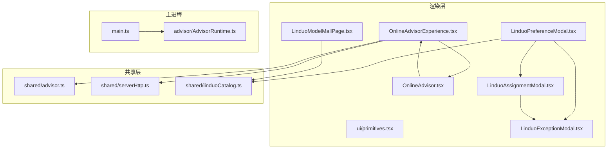
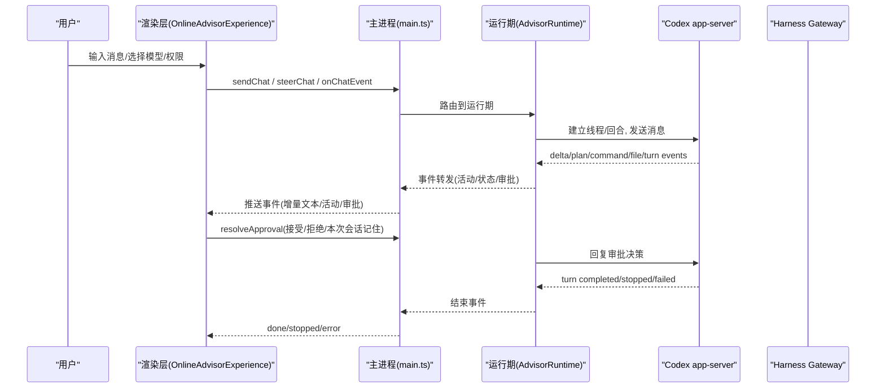
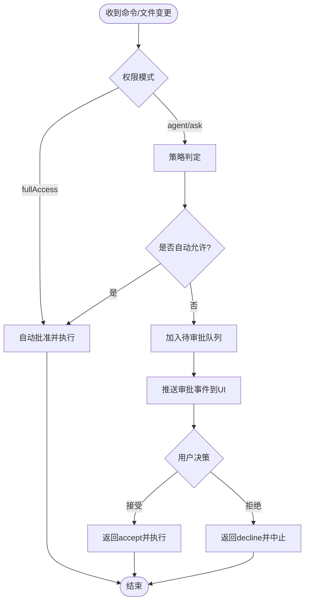
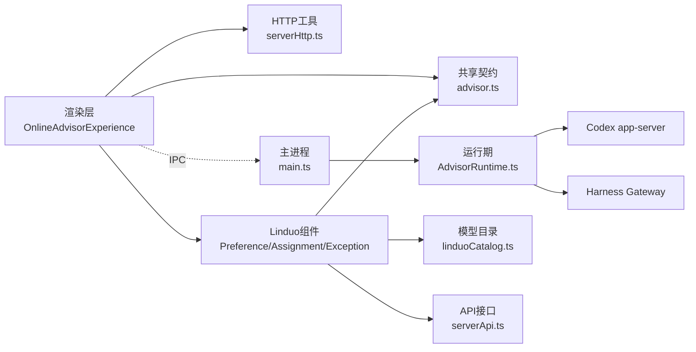

# 在线AI参谋体验界面

<cite>
**本文引用的文件**
- [package.json](file://package.json)
- [OnlineAdvisorExperience.tsx](file://src/renderer/OnlineAdvisorExperience.tsx)
- [OnlineAdvisor.tsx](file://src/renderer/OnlineAdvisor.tsx)
- [primitives.tsx](file://src/renderer/ui/primitives.tsx)
- [advisor.ts](file://src/shared/advisor.ts)
- [serverHttp.ts](file://src/shared/serverHttp.ts)
- [main.ts](file://src/main/main.ts)
- [AdvisorRuntime.ts](file://src/main/advisor/AdvisorRuntime.ts)
- [online-advisor-experience.css](file://src/renderer/online-advisor-experience.css)
- [LinduoPreferenceModal.tsx](file://src/renderer/LinduoPreferenceModal.tsx)
- [LinduoAssignmentModal.tsx](file://src/renderer/LinduoAssignmentModal.tsx)
- [LinduoExceptionModal.tsx](file://src/renderer/LinduoExceptionModal.tsx)
- [LinduoModelMallPage.tsx](file://src/renderer/LinduoModelMallPage.tsx)
- [linduoModelPickerModal.css](file://src/renderer/linduoModelPickerModal.css)
- [SystemAdmin.tsx](file://src/renderer/SystemAdmin.tsx)
- [App.tsx](file://src/renderer/App.tsx)
- [linduoCatalog.ts](file://src/shared/linduoCatalog.ts)
- [serverApi.ts](file://src/renderer/serverApi.ts)
</cite>

## 更新摘要
**所做更改**
- LinduoPreferenceModal已完全重新设计，新增强大的搜索功能和供应商分组过滤系统
- 实现了现代化的UI组件体系，包括供应商芯片筛选、分组列表展示和响应式布局
- 增强了用户选择模型的用户体验，支持按OpenAI、Google、Anthropic、Vidu等供应商进行筛选
- 集成了完整的模型目录管理系统，提供28个精选大模型的浏览和管理功能
- 优化了模态框的交互设计，支持实时搜索、供应商过滤和分组显示
- 完善了样式系统，包含现代化的卡片设计、颜色主题和动画效果
- **最新修复**：解决了ShadowRoot边界导致的样式丢失问题，通过createPortal将模态框渲染到document.body
- **性能优化**：新增presentVendors记忆化值，只显示当前账户可用模型中的供应商，避免空列表显示

## 目录
1. [简介](#简介)
2. [项目结构](#项目结构)
3. [核心组件](#核心组件)
4. [架构总览](#架构总览)
5. [详细组件分析](#详细组件分析)
6. [依赖关系分析](#依赖关系分析)
7. [性能与可用性](#性能与可用性)
8. [故障排查指南](#故障排查指南)
9. [结论](#结论)

## 简介
本仓库实现了一个"在线AI参谋"桌面端体验界面，基于 Electron + React/Vite 构建。前端提供聊天式交互、任务历史管理、图片附件与视觉分析、审批流处理、个性化设置等能力；后端通过主进程桥接本地执行器（Codex app-server）与可选的受限隔离执行器（Harness Gateway），并暴露统一的桌面 API 供渲染层调用。整体目标是让跨境电商从业者以对话方式驱动选品、素材生成、合规检查等工作流，并在安全边界内自动或半自动执行。

**最新更新**：界面现已完成全面的UI/UX增强，包括完整的Doubao风格设计系统实现、深色模式主题切换、快捷键面板、增强的消息反馈系统、智能滚动管理、思考加载状态、重新生成功能等功能。**最新重大重构**：侧边栏现在永久展开，采用双区域布局设计，将任务历史分为"项目"和"最近"两个独立区域，提供更好的信息组织和管理体验。**最新技术突破**：实现了智能模型提供商切换机制和优化的effort参数管理，显著提升了多模型环境下的用户体验，消除了provider转换过程中的混淆错误。**最新增强**：新增了线程重置通知系统，当Codex上下文丢失时能够优雅地提示用户并继续在新线程上执行任务，同时增强了连接状态报告的准确性，能够区分正常降级模式和故障状态。**最新界面优化**：将权限和模型选择器从顶部工具栏移至Composer底部footer区域，提供更直观的操作体验；简化侧边栏设计，移除冗余元素；使用齿轮图标提升个性化设置的视觉识别度。**最新交互增强**：新增了Composer展开/折叠功能，允许用户根据需要调整输入框高度，从默认的160px最大高度扩展到480px，显著提升长文本编辑体验；发送按钮采用新的青绿色调(#7fd4c9)，提供更好的视觉反馈；更新了占位符文本以提供更清晰的引导信息。**最新视觉设计增强**：Zoom按钮获得了显著的视觉设计改进，包括增大的按钮尺寸、优化的图标比例、改进的颜色对比度和更好的定位布局。**最新Linduo集成**：集成了完整的Linduo模型选择UI组件体系，包括用户偏好设置、管理员分配界面和用户例外管理功能，实现了基于角色的权限控制和完整的模型等级管理系统。**最新重大更新**：LinduoPreferenceModal已完全重新设计，引入全新的搜索功能、供应商分组过滤系统和现代化UI组件，大幅提升了模型选择的用户体验。**最新修复**：解决了ShadowRoot边界导致的样式丢失问题，通过createPortal将模态框渲染到document.body，确保样式正确应用。

## 项目结构
- 渲染层（React UI）：负责用户交互、消息流展示、会话与分支管理、图片预览与分析、审批弹窗、个性化设置等。
- 共享类型与HTTP工具：定义跨进程通信的数据契约，以及中心服务端的认证与会话刷新逻辑。
- 主进程（Electron）：封装系统能力（文件系统、浏览器工作区、数据库、第三方服务），并通过 IPC 向渲染层暴露统一API。
- 运行期（AdvisorRuntime）：对接 Codex app-server 与 Harness Gateway，编排任务执行、审批策略、事件回推与持久化。

**图表来源**
- [OnlineAdvisorExperience.tsx:1257-1451](file://src/renderer/OnlineAdvisorExperience.tsx#L1257-L1451)
- [OnlineAdvisor.tsx:7-36](file://src/renderer/OnlineAdvisor.tsx#L7-L36)
- [LinduoPreferenceModal.tsx:29-187](file://src/renderer/LinduoPreferenceModal.tsx#L29-L187)
- [LinduoAssignmentModal.tsx:27-348](file://src/renderer/LinduoAssignmentModal.tsx#L27-L348)
- [LinduoExceptionModal.tsx:40-303](file://src/renderer/LinduoExceptionModal.tsx#L40-L303)
- [advisor.ts:109-216](file://src/shared/advisor.ts#L109-L216)
- [serverHttp.ts:186-246](file://src/shared/serverHttp.ts#L186-L246)
- [linduoCatalog.ts:1-86](file://src/shared/linduoCatalog.ts#L1-L86)
- [main.ts:1-120](file://src/main/main.ts#L1-L120)
- [AdvisorRuntime.ts:165-236](file://src/main/advisor/AdvisorRuntime.ts#L165-L236)

**章节来源**
- [package.json:1-50](file://package.json#L1-L50)

## 核心组件
- OnlineAdvisorExperience：核心页面组件，承载会话列表、消息流、附件上传与预览、审批面板、模型与权限选择、个性化设置、导出与搜索等功能。
- OnlineAdvisor：将体验组件挂载到 Shadow DOM，隔离样式并同步主题。
- primitives：基础UI原子（按钮、状态徽章、通知、卡片、字段、加载态、空态、模态框）。
- advisor 契约：定义聊天请求、事件、存储任务、连接状态、个人化配置等数据结构。
- serverHttp：中心服务端HTTP客户端，含令牌刷新、会话过期广播、统一错误封装。
- main：主进程入口，注册大量业务IPC，集成数据库、浏览器工作区、图像与视频服务、eBay发布流程等。
- AdvisorRuntime：运行期编排，负责与 Codex app-server/Harness Gateway 通信、审批策略、事件分发、任务持久化与清理。
- **全新设计的 LinduoPreferenceModal**：用户个人模型偏好设置模态框，支持强大的搜索功能、供应商分组过滤、现代化UI组件和增强的用户体验。
- **新增 LinduoAssignmentModal**：管理员模型分配穿梭界面，支持按等级批量分配模型、查看已分配模型。
- **新增 LinduoExceptionModal**：用户例外管理模态框，支持添加/删除/切换例外类型（GRANT/REVOKE）。
- **新增 LinduoModelMallPage**：零度API模型广场页面，提供37个聚合大模型的浏览、筛选和价格查询功能。

**章节来源**
- [OnlineAdvisorExperience.tsx:1257-1451](file://src/renderer/OnlineAdvisorExperience.tsx#L1257-L1451)
- [OnlineAdvisor.tsx:7-36](file://src/renderer/OnlineAdvisor.tsx#L7-L36)
- [primitives.tsx:7-77](file://src/renderer/ui/primitives.tsx#L7-L77)
- [advisor.ts:1-223](file://src/shared/advisor.ts#L1-L223)
- [serverHttp.ts:1-246](file://src/shared/serverHttp.ts#L1-L246)
- [main.ts:1-120](file://src/main/main.ts#L1-L120)
- [AdvisorRuntime.ts:165-236](file://src/main/advisor/AdvisorRuntime.ts#L165-L236)
- [LinduoPreferenceModal.tsx:29-269](file://src/renderer/LinduoPreferenceModal.tsx#L29-L269)
- [LinduoAssignmentModal.tsx:27-348](file://src/renderer/LinduoAssignmentModal.tsx#L27-L348)
- [LinduoExceptionModal.tsx:40-303](file://src/renderer/LinduoExceptionModal.tsx#L40-L303)
- [LinduoModelMallPage.tsx:29-322](file://src/renderer/LinduoModelMallPage.tsx#L29-L322)

## 架构总览
渲染层通过 window.desktop.advisor 调用主进程提供的统一API，完成发送消息、获取会话、上传图片、分析图片、审批等操作。主进程在 AdvisorRuntime 中协调：
- 使用 AppServerClient 与 Codex app-server 进行 stdio RPC 通信，转发事件、处理审批。
- 使用 HarnessGatewayClient 探测受限隔离执行器健康状态，作为可选执行通道。
- 将事件写入 SessionStore，支持会话恢复、分支、导出。
- 根据 PermissionMode 与 ApprovalPolicy 决定命令/文件变更是否自动批准或需要人工审批。

**图表来源**
- [OnlineAdvisorExperience.tsx:763-838](file://src/renderer/OnlineAdvisorExperience.tsx#L763-L838)
- [OnlineAdvisorExperience.tsx:987-1044](file://src/renderer/OnlineAdvisorExperience.tsx#L987-L1044)
- [advisor.ts:109-216](file://src/shared/advisor.ts#L109-L216)
- [AdvisorRuntime.ts:304-476](file://src/main/advisor/AdvisorRuntime.ts#L304-L476)
- [AdvisorRuntime.ts:489-586](file://src/main/advisor/AdvisorRuntime.ts#L489-L586)

## 详细组件分析

### 在线AI参谋体验界面（OnlineAdvisorExperience）
- **功能要点**
  - **双区域侧边栏布局**：实现了"项目"和"最近"两个独立区域，项目区域按文件夹分组显示已注册项目的任务，最近区域平铺显示不属于任何项目的对话，按更新时间倒序排列
  - **永久展开的侧边栏**：移除了侧边栏切换功能，侧边栏现在始终可见，提供更好的任务导航体验
  - **会话与历史管理**：列出任务、按项目分组、隐藏/重命名/删除、搜索过滤、导出
  - **消息流**：用户消息、助手增量文本、活动（计划/命令/文件/视觉/状态/警告/错误）、任务状态
  - **附件与视觉**：拖拽/粘贴图片、预览、OCR与标注、产品属性提取、风险与建议
  - **审批流**：命令执行与文件修改需审批时弹出确认，支持"仅本次"或"记住"
  - **个性化**：人格、自定义指令、记忆开关、重置记忆
  - **连接模式**：检测并切换至 harness 网关（受限隔离执行器）或保持本地 app-server
  - **分支与编辑**：对历史消息进行克隆与分叉，保留上下文继续推进
  - **主题管理**：采用系统跟随模式，通过OnlineAdvisor组件监听全局主题变化并同步到Shadow DOM
  - **快捷键面板**：通过Cmd/Ctrl+/打开快捷键速查面板，支持常用操作快速访问
  - **消息反馈系统**：为助手消息提供"有帮助"/"需要改进"反馈，支持本地存储和用户偏好记录
  - **智能滚动管理**：自动跟随新消息，支持手动滚动查看历史，提供"跳转到最新消息"按钮
  - **思考加载状态**：显示动态的思考点动画，提升用户等待体验
  - **重新生成功能**：支持重新生成助手回答，将用户消息重新填入Composer
  - **消息恢复机制**：在任务停止或失败时提供重试选项，提升用户体验
  - **增强的Composer工具栏**：重新组织的权限和模型选择器，改进的布局和交互体验
  - **任务推荐卡片**：空状态下提供四个预设任务模板（选品调研、撰写Listing、分析图片、合规审查）
  - **移动响应式设计**：实现了抽屉式侧边栏导航，在≤480px屏幕上自动切换为可隐藏的抽屉布局，支持汉堡菜单切换和CSS变换动画
  - **智能来源引用解析**：parseSources()函数自动从AI回答中提取参考来源，支持多语言标题格式（参考来源、Sources、References等）和多种链接格式
  - **线程重置通知**：当Codex上下文丢失时显示一次性软提示，告知用户已在新线程上继续执行，8秒后自动清除
  - **增强的连接状态报告**：支持signed-out状态区分，明确标识用户未配置JWT时的降级执行模式，避免误报故障
  - **智能模型提供商切换**：实现了自动检测provider变更并创建新分支的机制，消除model_not_found错误
  - **优化的effort参数管理**：通过effortFor()函数为不同模型提供正确的推理深度参数，避免硬编码导致的兼容性错误
  - **最新界面重构**：将权限和模型选择器从顶部工具栏移至Composer底部footer区域，提供更直观的操作体验；简化侧边栏设计，移除冗余元素；使用齿轮图标替代文本状态指示器；优化布局和间距
  - **新增Composer展开/折叠功能**：实现了可调节高度的输入框，支持最大高度从160px扩展到480px，提升长文本编辑体验
  - **发送按钮样式升级**：从蓝色改为青绿色(#7fd4c9)，提供更好的视觉反馈和现代感
  - **占位符文本优化**：更新为'输入你的任务或选择下面的员工开始…'，提供更清晰的引导信息
  - **无障碍属性增强**：为展开/折叠按钮添加aria-label、aria-pressed和title属性，提升可访问性
  - **Zoom按钮视觉设计增强**：按钮尺寸从24x24像素增加到28x28像素，SVG图标从14像素缩放到16像素，默认颜色从text-tertiary改为text-secondary以提升对比度，添加浅灰色背景(#f4f4ee)，位置调整top/right边距从4/2像素改为6/6像素
  - **Linduo模型偏好集成**：通过齿轮按钮触发LinduoPreferenceModal，支持用户查看当前等级、设置默认模型、管理个人例外
  - **权限控制集成**：根据用户权限（member.manage）动态显示不同的Linduo模态框，管理员可访问模型分配界面，普通用户只能设置个人偏好
- **关键数据流**
  - 发送消息：构造用户消息与助手占位，调用 sendChat，订阅 onChatEvent 更新文本与活动
  - 补充执行：在活跃任务中通过 steerChat 追加指令
  - 恢复历史：listSessions 后重建消息与活动，必要时 hydrate 附件
  - 审批：收到 approval 事件显示审批项，resolveApproval 后继续执行
  - **主题同步**：通过MutationObserver监听document.documentElement的data-theme属性变化，同步到Shadow DOM
  - **快捷键监听**：全局键盘事件监听，支持Cmd/Ctrl+/打开快捷键面板，Cmd/Ctrl+K聚焦输入框
  - **反馈收集**：rateMessage函数处理用户反馈，存储在localStorage中供后续分析
  - **滚动跟踪**：isAtBottom和handleMessageListScroll实现智能滚动行为
  - **来源解析**：parseSources函数识别AI回答中的参考来源部分，提取标题、URL和片段信息
  - **侧边栏控制**：sidebarOpen状态固定为true，实现永久展开的侧边栏
  - **线程重置处理**：threadReset事件触发时显示通知，8秒后自动清除，不影响任务执行流程
  - **连接状态监听**：getConnectionStatus定期查询连接状态，区分正常模式和故障状态
  - **模型提供商切换**：自动检测currentProviderId与modelProfile.providerId差异，触发fork机制创建新分支
  - **Effort参数处理**：通过effortFor(modelProfile)获取正确的推理深度，避免chat-latest模型的medium限制
  - **Footer区域选择器**：权限和模型选择器现在位于composer-footer-pickers容器中，提供更好的操作体验
  - **侧边栏简化**：移除了项目部分标题和新建项目按钮，使用更简洁的设计
  - **齿轮图标设置**：使用SVG齿轮图标替代文本状态指示器，提升视觉识别度
  - **Composer展开状态管理**：通过composerExpanded状态变量控制输入框的高度扩展，默认收起状态，点击展开按钮可切换到展开模式
  - **无障碍交互**：展开/折叠按钮包含完整的ARIA属性，支持屏幕阅读器识别和操作状态
  - **Zoom按钮增强**：通过增大按钮尺寸和优化图标比例提升视觉表现，改进的颜色对比度和背景色增强可访问性
  - **Linduo偏好设置**：通过齿轮按钮触发LinduoPreferenceModal，支持用户查看当前等级、设置默认模型、管理个人例外
  - **权限控制**：根据hasPermission(profile, 'member.manage')判断显示管理员分配界面还是用户偏好界面
- **复杂度与优化**
  - 大量状态与副作用集中在单一组件，适合拆分为子组件（消息列表、审批面板、附件面板、个性化设置）
  - 长会话下建议分页渲染与虚拟滚动，减少DOM节点数量
  - 图片分析与预览可懒加载与缓存，避免重复网络IO
  - **反馈系统**：使用本地存储避免频繁网络请求，支持用户快速反馈
  - **滚动优化**：requestAnimationFrame确保平滑滚动，避免阻塞主线程
  - **主题同步**：通过MutationObserver实现高效的主题同步，避免不必要的重渲染
  - **移动端适配**：使用CSS容器查询和transform动画实现流畅的抽屉式导航
  - **来源解析优化**：正则表达式匹配支持多种格式，限制最大解析数量为12条以避免性能问题
  - **双区域布局优化**：项目区域和最近区域分别优化，提供更好的信息组织和查找效率
  - **线程重置通知优化**：使用CSS :has()选择器动态调整grid布局，避免Composer位置偏移
  - **连接状态优化**：区分不同连接模式，提供准确的错误提示和降级策略
  - **模型切换优化**：自动fork机制避免了手动分支管理的复杂性，提升用户体验
  - **Effort参数优化**：集中化的effortFor()函数确保所有模型都获得正确的推理深度配置
  - **Footer布局优化**：使用flexbox布局实现响应式的footer区域，支持不同屏幕尺寸
  - **侧边栏性能优化**：移除冗余元素减少DOM节点，提升渲染性能
  - **图标系统优化**：使用SVG图标替代文本字符，提供更好的缩放和清晰度
  - **Composer高度管理优化**：通过CSS类名切换实现平滑的高度过渡动画，避免布局抖动
  - **无障碍优化**：完整的ARIA属性支持确保所有用户都能有效使用展开/折叠功能
  - **Zoom按钮性能优化**：优化的按钮尺寸和图标比例减少了渲染开销，改进的布局减少了重排重绘
  - **Linduo组件优化**：模态框采用懒加载策略，只在需要时加载相关数据和状态，减少初始渲染开销
  - **权限控制优化**：基于角色的权限控制减少了不必要的UI元素渲染，提升用户体验
  - **数据同步优化**：通过onChanged回调机制实现Linduo组件间的状态同步，避免重复数据获取

**章节来源**
- [OnlineAdvisorExperience.tsx:1257-1451](file://src/renderer/OnlineAdvisorExperience.tsx#L1257-L1451)
- [OnlineAdvisorExperience.tsx:219-278](file://src/renderer/OnlineAdvisorExperience.tsx#L219-L278)
- [OnlineAdvisorExperience.tsx:877-907](file://src/renderer/OnlineAdvisorExperience.tsx#L877-L907)
- [OnlineAdvisorExperience.tsx:913-926](file://src/renderer/OnlineAdvisorExperience.tsx#L913-L926)
- [OnlineAdvisorExperience.tsx:303-321](file://src/renderer/OnlineAdvisorExperience.tsx#L303-L321)
- [OnlineAdvisorExperience.tsx:341-390](file://src/renderer/OnlineAdvisorExperience.tsx#L341-L390)
- [OnlineAdvisorExperience.tsx:854-870](file://src/renderer/OnlineAdvisorExperience.tsx#L854-L870)
- [OnlineAdvisorExperience.tsx:443-449](file://src/renderer/OnlineAdvisorExperience.tsx#L443-L449)
- [OnlineAdvisorExperience.tsx:1477-1484](file://src/renderer/OnlineAdvisorExperience.tsx#L1477-L1484)
- [OnlineAdvisorExperience.tsx:2012-2176](file://src/renderer/OnlineAdvisorExperience.tsx#L2012-2176)
- [OnlineAdvisorExperience.tsx:1415-1442](file://src/renderer/OnlineAdvisorExperience.tsx#L1415-L1442)
- [OnlineAdvisorExperience.tsx:176](file://src/renderer/OnlineAdvisorExperience.tsx#L176)
- [OnlineAdvisorExperience.tsx:1897](file://src/renderer/OnlineAdvisorExperience.tsx#L1897)
- [OnlineAdvisorExperience.tsx:2004](file://src/renderer/OnlineAdvisorExperience.tsx#L2004)
- [OnlineAdvisorExperience.tsx:2018-2047](file://src/renderer/OnlineAdvisorExperience.tsx#L2018-L2047)
- [App.tsx:1347-1353](file://src/renderer/App.tsx#L1347-L1353)

### 宿主容器（OnlineAdvisor）
- 将体验组件注入 Shadow DOM，隔离样式并监听全局主题变化，确保深色/浅色模式一致
- 使用 createPortal 将组件挂载到 shadow root，避免样式污染
- **主题同步机制**：通过MutationObserver监听document.documentElement的data-theme属性变化，自动同步到Shadow DOM的data-theme属性

**章节来源**
- [OnlineAdvisor.tsx:7-36](file://src/renderer/OnlineAdvisor.tsx#L7-L36)

### 基础UI原子（primitives）
- 提供 Button、StatusBadge、Notice、Card、Field、LoadingState、EmptyState、Modal 等通用组件，保证一致的交互与可访问性
- Modal 内置焦点管理与 ESC 关闭，提升键盘可达性

**章节来源**
- [primitives.tsx:7-77](file://src/renderer/ui/primitives.tsx#L7-L77)

### 运行时与审批策略（AdvisorRuntime）
- 事件管道：将 app-server 的通知与请求转换为统一事件，推送给渲染层并持久化
- 审批策略：
  - 命令执行：根据 workspacePath 与命令分类决定是否自动批准、提示或阻断
  - 文件变更：检测破坏性差异（如删除）要求审批，非破坏性可在项目内自动批准
  - 完全访问模式：跳过审批直接执行
- 连接状态：维护 harness 网关会话与健康探针，向UI暴露连接模式与标签
- 任务生命周期：创建/开始/完成/停止/失败，记录用量与分支信息
- **智能模型提供商切换**：
  - 自动检测当前分支绑定的provider与目标模型的provider是否一致
  - 当检测到provider不一致时，自动创建新分支并绑定新的provider
  - 通过threadReset事件通知UI上下文已切换，但任务继续执行
  - 避免了"model_not_found"错误，提升了多模型环境的用户体验
- **优化的effort参数管理**：
  - 通过effortFor()函数为不同模型提供正确的推理深度参数
  - DeepSeek V4系列模型使用high推理深度，OpenAI ChatGPT Latest使用medium
  - 避免了硬编码"high"导致的chat-latest模型兼容性错误
  - 确保每个模型都能获得最适合的推理深度配置

**图表来源**
- [AdvisorRuntime.ts:489-586](file://src/main/advisor/AdvisorRuntime.ts#L489-L586)
- [AdvisorRuntime.ts:602-705](file://src/main/advisor/AdvisorRuntime.ts#L602-L705)

**章节来源**
- [AdvisorRuntime.ts:165-236](file://src/main/advisor/AdvisorRuntime.ts#L165-L236)
- [AdvisorRuntime.ts:304-476](file://src/main/advisor/AdvisorRuntime.ts#L304-L476)
- [AdvisorRuntime.ts:489-586](file://src/main/advisor/AdvisorRuntime.ts#L489-L586)
- [AdvisorRuntime.ts:602-705](file://src/main/advisor/AdvisorRuntime.ts#L602-L705)

### 中心服务端HTTP（serverHttp）
- 统一 apiFetch：自动携带 Bearer Token，401 时尝试刷新并重放一次，失败则广播会话过期事件
- 刷新锁：跨世界单 flight 刷新，防止并发刷新导致令牌冲突
- 会话存储：localStorage 保存 tokens 与 profile，便于多隔离世界共享

**章节来源**
- [serverHttp.ts:122-184](file://src/shared/serverHttp.ts#L122-L184)
- [serverHttp.ts:186-246](file://src/shared/serverHttp.ts#L186-L246)

### 全新重新设计的 LinduoPreferenceModal（用户偏好设置）

#### 核心功能特性
- **强大的搜索功能**：支持按模型名称、ID和描述进行实时模糊搜索，提升模型查找效率
- **供应商分组过滤系统**：基于OpenAI、Google、Anthropic、Vidu四大供应商的智能分组和筛选
- **现代化UI组件**：采用卡片式设计、供应商芯片筛选、分组列表展示和响应式布局
- **增强的用户体验**：支持单选设置默认模型、选择不使用Linduo模型（回退到Codex默认）
- **实时状态显示**：显示当前等级、特例数量和默认模型信息
- **异步数据加载**：并行加载用户数据、可用模型和当前偏好，提升加载性能
- **ShadowRoot边界问题解决**：使用createPortal将模态框渲染到document.body，解决样式丢失问题
- **智能供应商过滤**：新增presentVendors记忆化值，只显示当前账户可用模型中的供应商，避免空列表显示

#### 搜索和过滤机制
- **关键词搜索**：支持模型名称、ID和描述的模糊匹配搜索
- **供应商筛选**：通过供应商芯片按钮实现多选筛选，支持OpenAI、Google、Anthropic、Vidu
- **智能分组**：搜索结果按供应商自动分组，每组显示供应商图标、名称和模型数量
- **实时过滤**：搜索和筛选条件变化时实时更新显示结果
- **记忆化优化**：使用useMemo缓存presentVendors计算结果，提升性能

#### 用户界面设计
- **模态框头部**：显示标题、副标题（当前等级、特例数量、默认模型）和关闭按钮
- **工具栏区域**：包含搜索输入框和供应商筛选芯片组
- **分组列表**：按供应商分组的模型列表，每组包含供应商标识和模型详情
- **底部操作区**：提供"修改我的特例"和"关闭"按钮
- **空状态处理**：无可用模型时显示友好的提示信息

#### 数据流和处理
- **初始化加载**：并行获取用户等级信息、可用模型、当前偏好和全部模型
- **搜索过滤**：使用useMemo计算搜索和筛选后的分组结果
- **模型选择**：单选模式下选择模型，调用setLinduoPreferredModel接口更新偏好
- **异常处理**：完善的错误处理和加载状态管理
- **状态同步**：通过onChanged回调通知父组件偏好已变更
- **Portal渲染**：通过createPortal将模态框渲染到document.body，确保样式正确应用

#### 样式和交互
- **现代化设计**：采用卡片式布局、圆角边框、阴影效果和渐变背景
- **供应商色彩**：每个供应商有独特的品牌色彩和图标标识
- **响应式布局**：支持不同屏幕尺寸的自适应显示
- **交互动画**：悬停效果、选中状态高亮和过渡动画
- **无障碍支持**：完整的ARIA属性和键盘导航支持

**章节来源**
- [LinduoPreferenceModal.tsx:29-269](file://src/renderer/LinduoPreferenceModal.tsx#L29-L269)
- [linduoModelPickerModal.css:296-444](file://src/renderer/linduoModelPickerModal.css#L296-L444)
- [linduoCatalog.ts:1-86](file://src/shared/linduoCatalog.ts#L1-L86)
- [serverApi.ts:157-224](file://src/renderer/serverApi.ts#L157-L224)

### 其他 Linduo 组件

#### LinduoAssignmentModal（管理员分配界面）
- **功能特性**：
  - 管理员专用的模型分配穿梭界面
  - 支持按等级（tier）批量分配模型
  - 提供左右双栏穿梭器，支持多选和批量操作
  - full等级为只读模式，显示所有已开放模型
  - 支持保存分配结果并通知父组件更新
- **用户界面**：
  - 顶部显示等级选择器和等级描述
  - 中间区域为双栏穿梭器，左侧为可选模型，右侧为已分配模型
  - 支持全选、反选、批量移动操作
  - 底部提供取消和保存按钮
- **数据流**：
  - 初始化时加载所有等级和启用模型列表
  - 切换等级时加载该等级的已分配模型
  - 用户操作时维护本地状态，保存时批量提交到服务器
- **权限控制**：
  - 仅admin用户（具有member.manage权限）可访问
  - 通过App.tsx中的权限判断控制模态框显示

#### LinduoExceptionModal（用户例外管理）
- **功能特性**：
  - 单个用户的例外管理界面
  - 支持添加、删除、切换例外类型（GRANT/REVOKE）
  - 提供双栏穿梭器，左侧为无例外的模型，右侧为当前例外
  - 支持批量操作和差异化保存
- **用户界面**：
  - 头部显示用户名称、等级信息和说明文字
  - 主体区域为双栏穿梭器，右侧例外项带有类型切换按钮
  - 底部提供取消和保存按钮
- **数据流**：
  - 计算当前例外与初始状态的差异
  - 新增例外调用setLinduoException接口
  - 删除例外调用revokeLinduoException接口
  - 切换例外类型时重新调用相应接口
- **权限控制**：
  - 普通用户只能管理自己的例外
  - admin用户可以管理其他成员的例外

#### LinduoModelMallPage（模型广场）
- **功能特性**：
  - 零度API模型广场页面，展示37个聚合大模型
  - 支持按供应商（OpenAI/Google/Anthropic/Vidu）和能力（生图/视频/对话/多模态）筛选
  - 提供关键词搜索功能
  - 显示模型价格信息，支持手动刷新价格
  - 集成LLM Key配置和登录状态管理
- **用户界面**：
  - 顶部工具栏包含标题、状态指示和操作按钮
  - 左侧筛选面板支持供应商、能力和关键词筛选
  - 右侧网格展示模型卡片，包含基本信息、价格和状态
  - 支持响应式布局适配不同屏幕尺寸
- **数据流**：
  - 初始化时检查LLM Key配置状态
  - 加载模型价格信息和登录状态
  - 支持手动触发价格刷新操作
  - 根据筛选条件动态过滤模型列表
- **集成特性**：
  - 与系统LLM Key管理页面集成
  - 支持零度API登录状态检测
  - 提供价格陈旧性标记和错误提示

**章节来源**
- [LinduoAssignmentModal.tsx:27-348](file://src/renderer/LinduoAssignmentModal.tsx#L27-L348)
- [LinduoExceptionModal.tsx:40-303](file://src/renderer/LinduoExceptionModal.tsx#L40-L303)
- [LinduoModelMallPage.tsx:29-322](file://src/renderer/LinduoModelMallPage.tsx#L29-L322)
- [linduoModelPickerModal.css:1-355](file://src/renderer/linduoModelPickerModal.css#L1-L355)

### 双区域侧边栏设计与响应式布局
- **双区域布局**：
  - 项目区域：按文件夹分组显示已注册项目的任务，支持项目展开/折叠、任务管理、搜索过滤
  - 最近区域：平铺显示不属于任何项目的对话，按更新时间倒序排列，提供快速访问
  - 共用滚动容器：两个区域共享一个滚动条，头部和footer固定，提供更好的浏览体验
- **永久展开的侧边栏**：
  - 移除了侧边栏切换功能，sidebarOpen状态固定为true
  - 提供更稳定的导航体验，减少用户操作步骤
  - 通过CSS Grid布局实现紧凑的侧边栏设计
- **移动响应式设计**：
  - 在≤480px屏幕上自动切换为抽屉式侧边栏导航
  - 使用CSS transform动画实现流畅的translateX滑入滑出效果
  - 支持汉堡菜单切换控制侧边栏显示状态
  - 优化了小屏幕下的触摸交互和元素布局
- **Doubao设计系统**：
  - 完整的颜色令牌系统，包含主色、辅助色、状态色等
  - 字体阶梯系统，提供从xs到h的完整字号体系
  - 间距系统，统一的spacing变量确保视觉一致性
  - 阴影系统，多层级阴影效果提升界面层次感
- **智能来源引用解析**：
  - parseSources()函数支持多语言标题识别（参考来源、Sources、References、Citations、Bibliography等）
  - 支持多种链接格式：Markdown链接`[text](url)`和纯文本链接`text: url`
  - 自动提取标题、URL和片段信息，最多解析12条来源避免性能问题
  - 不修改原文本，仅用于底部来源卡片的展示
  - 支持带片段描述的来源条目，提供更好的信息来源追溯
- **线程重置通知系统**：
  - 实现了threadReset事件处理，当Codex上下文丢失时显示一次性软提示
  - 使用CSS :has()选择器动态调整chat-panel的grid布局，避免Composer位置偏移
  - 支持8秒自动清除和淡入动画效果，提供良好的用户体验
  - 在深色模式下提供专门的样式适配，确保可读性和美观性
- **增强的连接状态报告**：
  - 新增signed-out状态区分，明确标识用户未配置JWT时的降级执行模式
  - 区分正常降级模式和故障状态，提供更准确的错误提示
  - 支持app-server、harness、signed-out、unavailable、unknown等多种连接模式
  - 通过label和detail字段提供详细的连接状态描述
- **最新界面重构**：
  - **Footer区域选择器**：将权限和模型选择器从顶部工具栏移至Composer底部footer区域，使用composer-footer-pickers容器实现响应式布局
  - **侧边栏简化**：移除了项目部分标题和新建项目按钮，使用更简洁的设计，提升信息密度
  - **齿轮图标设置**：使用SVG齿轮图标替代文本状态指示器，提供更好的视觉识别度和缩放效果
  - **布局和间距优化**：调整了侧边栏头部和内容内边距，使用CSS变量统一管理间距，提升视觉一致性
- **新增Composer展开/折叠功能**：
  - **状态管理**：通过composerExpanded状态变量控制输入框的展开/折叠状态，默认false表示收起状态
  - **高度扩展**：展开状态下textarea的最大高度从160px扩展到480px，支持长文本编辑需求
  - **SVG图标切换**：根据展开状态动态显示不同的SVG图标，提供直观的视觉反馈
  - **无障碍支持**：完整的ARIA属性包括aria-label、aria-pressed和title，确保屏幕阅读器正确识别
  - **CSS类名切换**：通过添加/移除.expanded类名来控制样式变化，实现平滑的过渡动画
  - **占位符文本优化**：更新为'输入你的任务或选择下面的员工开始…'，提供更清晰的引导信息
- **发送按钮样式升级**：
  - **颜色变更**：从原来的蓝色背景改为青绿色(#7fd4c9)，提供更好的视觉对比和现代感
  - **悬停效果**：悬停时背景色变为#6cc4b8，同时增加位移和阴影效果，提升交互反馈
  - **禁用状态**：禁用时使用表面色背景和次要文字色，保持视觉一致性
  - **阴影系统**：使用柔和的青绿色阴影，增强按钮的层次感和立体效果
- **Zoom按钮视觉设计增强**：
  - **尺寸优化**：按钮尺寸从24x24像素增加到28x28像素，提供更好的点击区域和视觉平衡
  - **图标缩放**：SVG图标从14像素缩放到16像素，确保在不同尺寸下的清晰度和可识别性
  - **颜色对比度改进**：默认颜色从text-tertiary改为text-secondary，提供更好的视觉对比度和可访问性
  - **背景增强**：添加浅灰色背景(#f4f4ee)，增强按钮的视觉层次感和可发现性
  - **定位优化**：top/right边距从4/2像素调整为6/6像素，提供更均衡的视觉平衡和更好的空间利用

**章节来源**
- [online-advisor-experience.css:212-272](file://src/renderer/online-advisor-experience.css#L212-L272)
- [online-advisor-experience.css:3172-3208](file://src/renderer/online-advisor-experience.css#L3172-L3208)
- [online-advisor-experience.css:102-169](file://src/renderer/online-advisor-experience.css#L102-L169)
- [online-advisor-experience.css:835-894](file://src/renderer/online-advisor-experience.css#L835-894)
- [OnlineAdvisorExperience.tsx:219-278](file://src/renderer/OnlineAdvisorExperience.tsx#L219-L278)
- [OnlineAdvisorExperience.tsx:877-907](file://src/renderer/OnlineAdvisorExperience.tsx#L877-L907)
- [OnlineAdvisorExperience.tsx:443-449](file://src/renderer/OnlineAdvisorExperience.tsx#L443-L449)
- [advisor.ts:167-187](file://src/shared/advisor.ts#L167-L187)
- [OnlineAdvisorExperience.tsx:2012-2176](file://src/renderer/OnlineAdvisorExperience.tsx#L2012-2176)
- [OnlineAdvisorExperience.tsx:1415-1442](file://src/renderer/OnlineAdvisorExperience.tsx#L1415-L1442)
- [online-advisor-experience.css:2477-2530](file://src/renderer/online-advisor-experience.css#L2477-L2530)
- [online-advisor-experience.css:2500-2530](file://src/renderer/online-advisor-experience.css#L2500-L2530)
- [online-advisor-experience.css:2786-2802](file://src/renderer/online-advisor-experience.css#L2786-L2802)

## 依赖关系分析
- 渲染层依赖 shared 契约与HTTP工具，不直接耦合 Electron/Node API
- 主进程集中管理外部依赖（数据库、浏览器工作区、图像/视频服务、eBay发布流程），通过 IPC 暴露能力
- AdvisorRuntime 解耦了执行器（app-server/harness），通过策略与事件机制统一对外

**图表来源**
- [OnlineAdvisorExperience.tsx:763-838](file://src/renderer/OnlineAdvisorExperience.tsx#L763-L838)
- [advisor.ts:109-216](file://src/shared/advisor.ts#L109-L216)
- [serverHttp.ts:186-246](file://src/shared/serverHttp.ts#L186-L246)
- [main.ts:1-120](file://src/main/main.ts#L1-L120)
- [AdvisorRuntime.ts:165-236](file://src/main/advisor/AdvisorRuntime.ts#L165-L236)
- [LinduoPreferenceModal.tsx:1-269](file://src/renderer/LinduoPreferenceModal.tsx#L1-L269)
- [LinduoAssignmentModal.tsx:1-348](file://src/renderer/LinduoAssignmentModal.tsx#L1-L348)
- [LinduoExceptionModal.tsx:1-303](file://src/renderer/LinduoExceptionModal.tsx#L1-L303)
- [linduoCatalog.ts:1-86](file://src/shared/linduoCatalog.ts#L1-L86)
- [serverApi.ts:157-224](file://src/renderer/serverApi.ts#L157-L224)

**章节来源**
- [main.ts:1-120](file://src/main/main.ts#L1-L120)
- [advisor.ts:109-216](file://src/shared/advisor.ts#L109-L216)
- [serverHttp.ts:186-246](file://src/shared/serverHttp.ts#L186-L246)
- [AdvisorRuntime.ts:165-236](file://src/main/advisor/AdvisorRuntime.ts#L165-L236)

## 性能与可用性
- **渲染层**
  - 长会话消息建议使用虚拟列表与增量渲染，避免一次性渲染大量DOM
  - 图片预览与分析采用懒加载与缓存，减少重复IO与计算
  - 审批与活动面板可折叠/收起，降低视觉噪音
  - **消息反馈系统**：本地存储反馈数据，避免频繁网络请求，支持离线使用
  - **智能滚动管理**：使用 requestAnimationFrame 优化滚动性能，减少重排重绘
  - **任务推荐卡片**：预定义模板减少用户输入成本，提升启动效率
  - **主题同步**：通过MutationObserver实现高效的主题同步，避免不必要的重渲染
  - **快捷键响应**：全局键盘事件监听，提供即时反馈
  - **移动端优化**：CSS transform动画提供流畅的抽屉式导航体验，避免重排重绘
  - **来源解析优化**：正则表达式匹配和数量限制确保解析性能
  - **双区域布局优化**：项目区域和最近区域分别优化，提供更好的信息组织和查找效率
  - **线程重置通知优化**：使用CSS :has()选择器和动画效果，确保通知显示的性能和用户体验
  - **连接状态优化**：区分不同连接模式，减少不必要的状态更新和UI重渲染
  - **模型切换优化**：自动fork机制减少了用户干预，提升了多模型环境下的操作效率
  - **Effort参数优化**：集中化的参数管理确保了模型配置的准确性和一致性
  - **Footer布局优化**：使用flexbox布局实现响应式的footer区域，支持不同屏幕尺寸，提升小屏设备的可用性
  - **侧边栏性能优化**：移除冗余元素减少DOM节点，提升渲染性能和内存使用
  - **图标系统优化**：使用SVG图标替代文本字符，提供更好的缩放效果和清晰度
  - **Composer高度管理优化**：通过CSS类名切换实现平滑的高度过渡动画，避免布局抖动和性能损耗
  - **无障碍优化**：完整的ARIA属性支持确保所有用户都能有效使用展开/折叠功能，提升可访问性
  - **Zoom按钮性能优化**：优化的按钮尺寸和图标比例减少了渲染开销，改进的布局减少了重排重绘，提升整体性能
  - **Linduo组件性能优化**：模态框采用懒加载策略，只在需要时加载相关数据和状态，减少初始渲染开销
  - **权限控制优化**：基于角色的权限控制减少了不必要的UI元素渲染，提升用户体验
  - **数据同步优化**：通过onChanged回调机制实现Linduo组件间的状态同步，避免重复数据获取
  - **全新LinduoPreferenceModal性能优化**：
    - **搜索性能优化**：使用useMemo缓存搜索和筛选结果，避免重复计算
    - **分组渲染优化**：按供应商分组渲染，减少DOM节点数量
    - **异步加载优化**：并行加载用户数据、模型列表和偏好设置，提升加载速度
    - **响应式优化**：支持不同屏幕尺寸的自适应布局，优化移动端体验
    - **内存管理优化**：及时清理搜索关键词和筛选状态，避免内存泄漏
    - **Portal渲染优化**：使用createPortal解决ShadowRoot边界问题，确保样式正确应用
    - **供应商过滤优化**：通过presentVendors记忆化值优化供应商筛选性能，避免空列表显示
- **运行期**
  - 事件批量推送与去重，避免频繁UI更新
  - 审批队列合理排队，避免阻塞主线程
  - 大文件附件分片上传与进度反馈
  - **智能模型切换**：自动检测provider变更并创建新分支，避免了手动分支管理的复杂性
  - **Effort参数管理**：通过effortFor()函数确保每个模型都获得正确的推理深度配置
- **可用性**
  - 所有交互提供明确的状态与错误提示
  - 支持键盘导航与可访问性属性（aria-*）
  - 主题与无障碍支持良好
  - **增强的用户体验**：改进的Composer工具栏布局，更直观的权限和模型选择
  - **响应式设计**：适配不同屏幕尺寸，移动端友好的交互设计
  - **思考动画**：动态加载状态提升用户等待体验
  - **错误恢复**：提供重试机制，提升容错能力
  - **来源可视化**：结构化展示AI回答的参考来源，提升内容可信度
  - **双区域导航**：永久展开的侧边栏提供更好的任务导航体验
  - **线程重置友好提示**：优雅的上下文丢失处理，避免用户困惑，提升任务连续性
  - **精确的连接状态**：区分正常降级和故障状态，减少误报和混淆
  - **智能模型切换**：消除了provider转换过程中的混淆错误，提升了多模型环境的使用体验
  - **优化的effort参数**：避免了模型不兼容错误，确保了不同模型的正确配置
  - **Footer区域优化**：将权限和模型选择器移至底部，提供更直观的操作体验，减少界面拥挤
  - **侧边栏简化**：移除冗余元素提升信息密度，使用更简洁的设计语言
  - **齿轮图标设置**：使用SVG图标提升视觉识别度，提供更好的用户体验
  - **Composer展开功能**：提供灵活的输入框高度调节，满足不同长度文本的编辑需求，提升用户体验
  - **发送按钮视觉升级**：青绿色调提供更好的视觉对比和现代感，悬停效果增强交互反馈
  - **无障碍增强**：完整的ARIA属性支持确保屏幕阅读器正确识别展开/折叠状态，提升可访问性
  - **Zoom按钮可访问性增强**：改进的颜色对比度和更大的点击区域提升了可访问性，确保所有用户都能轻松使用
  - **Linduo组件可访问性**：完整的ARIA属性和键盘导航支持，确保所有用户都能有效使用模型管理功能
  - **权限控制可访问性**：基于角色的权限控制提供了清晰的权限边界，避免用户困惑
  - **数据验证可访问性**：表单验证和错误提示提供了良好的用户反馈，提升操作成功率
  - **全新LinduoPreferenceModal可访问性增强**：
    - **搜索可访问性**：支持键盘导航和屏幕阅读器，提供搜索结果的语音反馈
    - **供应商筛选可访问性**：供应商芯片按钮支持键盘操作和ARIA状态描述
    - **分组列表可访问性**：按供应商分组的列表结构，提供清晰的层级导航
    - **错误提示可访问性**：统一的错误提示样式和语音反馈，确保用户理解错误信息
    - **加载状态可访问性**：明确的加载状态指示，避免用户困惑
    - **Portal渲染可访问性**：确保模态框在所有环境下都有正确的样式和交互行为

## 故障排查指南
- 无法连接执行器
  - 现象：顶栏显示"受限隔离执行器不可用"或"本地执行器"
  - 排查：检查环境变量 APP_SERVER_BASE_URL / HARNESS_GATEWAY_BASE_URL；确认服务已启动；查看连接状态回调
  - 参考路径
    - [AdvisorRuntime.ts:191-219](file://src/main/advisor/AdvisorRuntime.ts#L191-L219)
    - [OnlineAdvisorExperience.tsx:392-395](file://src/renderer/OnlineAdvisorExperience.tsx#L392-L395)
- 审批卡住
  - 现象：任务状态停留在"等待你的批准"，无后续动作
  - 排查：确认UI是否正确渲染审批项；检查 resolveApproval 是否被调用；查看 pendingApprovals 队列
  - 参考路径
    - [AdvisorRuntime.ts:602-705](file://src/main/advisor/AdvisorRuntime.ts#L602-L705)
    - [OnlineAdvisorExperience.tsx:1056-1061](file://src/renderer/OnlineAdvisorExperience.tsx#L1056-L1061)
- 图片分析失败
  - 现象：预览报错或分析结果为空
  - 排查：检查图片格式与大小限制；确认 OCR/视觉服务可用；查看 analyzeImages 返回值
  - 参考路径
    - [advisor.ts:43-82](file://src/shared/advisor.ts#L43-L82)
    - [OnlineAdvisorExperience.tsx:1121-1164](file://src/renderer/OnlineAdvisorExperience.tsx#L1121-L1164)
- 会话过期
  - 现象：请求返回401并跳转登录页
  - 排查：确认刷新锁与 refreshSession 逻辑；检查 localStorage 中的 tokens；观察 SESSION_EXPIRED_EVENT 是否触发
  - 参考路径
    - [serverHttp.ts:122-184](file://src/shared/serverHttp.ts#L122-L184)
    - [serverHttp.ts:186-246](file://src/shared/serverHttp.ts#L186-L246)
- **消息反馈问题**
  - 现象：反馈按钮无响应或反馈未保存
  - 排查：检查 messageFeedbackStorageKey 是否存在；确认 rateMessage 函数调用；查看 localStorage 存储状态
  - 参考路径
    - [OnlineAdvisorExperience.tsx:913-926](file://src/renderer/OnlineAdvisorExperience.tsx#L913-L926)
- **滚动异常**
  - 现象：消息列表滚动卡顿或无法自动跟随
  - 排查：检查 isAtBottom 函数逻辑；确认 handleMessageListScroll 绑定；验证 scrollToLatest 实现
  - 参考路径
    - [OnlineAdvisorExperience.tsx:341-390](file://src/renderer/OnlineAdvisorExperience.tsx#L341-L390)
- **主题同步问题**
  - 现象：主题切换无效或不同步
  - 排查：检查 MutationObserver 是否正确监听；确认 document.documentElement.data-theme 属性变化；验证 Shadow DOM 主题同步
  - 参考路径
    - [OnlineAdvisor.tsx:21-28](file://src/renderer/OnlineAdvisor.tsx#L21-L28)
- **快捷键失效**
  - 现象：快捷键无响应或冲突
  - 排查：检查键盘事件监听器；确认快捷键组合；验证 preventDefault 调用
  - 参考路径
    - [OnlineAdvisorExperience.tsx:303-321](file://src/renderer/OnlineAdvisorExperience.tsx#L303-L321)
- **移动端导航问题**
  - 现象：小屏幕下侧边栏无法正常显示或隐藏
  - 排查：检查CSS容器查询媒体查询；确认data-open属性绑定；验证transform动画效果
  - 参考路径
    - [online-advisor-experience.css:3172-3208](file://src/renderer/online-advisor-experience.css#L3172-L3208)
- **来源解析异常**
  - 现象：AI回答中的参考来源未被正确识别或显示
  - 排查：检查parseSources函数正则表达式；确认AI回答格式是否符合预期；查看sources数组长度限制
  - 参考路径
    - [OnlineAdvisorExperience.tsx:877-907](file://src/renderer/OnlineAdvisorExperience.tsx#L877-L907)
- **双区域布局问题**
  - 现象：项目区域或最近区域显示异常
  - 排查：检查projectGroups和recentTasks的计算逻辑；确认registeredProjects状态；验证搜索过滤功能
  - 参考路径
    - [OnlineAdvisorExperience.tsx:246-307](file://src/renderer/OnlineAdvisorExperience.tsx#L246-L307)
- **线程重置通知问题**
  - 现象：线程重置通知未显示或显示异常
  - 排查：检查threadReset事件处理逻辑；确认CSS :has()选择器兼容性；验证通知样式和动画效果
  - 参考路径
    - [OnlineAdvisorExperience.tsx:443-449](file://src/renderer/OnlineAdvisorExperience.tsx#L443-L449)
    - [online-advisor-experience.css:835-894](file://src/renderer/online-advisor-experience.css#L835-894)
- **连接状态报告异常**
  - 现象：连接状态显示不准确或状态区分不清
  - 排查：检查getConnectionStatus调用；确认AdvisorConnectionMode类型定义；验证不同状态的显示逻辑
  - 参考路径
    - [advisor.ts:167-187](file://src/shared/advisor.ts#L167-L187)
    - [OnlineAdvisorExperience.tsx:393](file://src/renderer/OnlineAdvisorExperience.tsx#L393)
- **模型提供商切换问题**
  - 现象：切换模型时出现model_not_found错误或分支创建失败
  - 排查：检查currentProviderId与modelProfile.providerId比较逻辑；确认fork机制是否正确触发；验证threadReset事件处理
  - 参考路径
    - [AdvisorRuntime.ts:857-879](file://src/main/advisor/AdvisorRuntime.ts#L857-L879)
    - [AdvisorRuntime.ts:970-986](file://src/main/advisor/AdvisorRuntime.ts#L970-L986)
- **Effort参数错误**
  - 现象：某些模型报告不支持的effort值或推理深度不匹配
  - 排查：检查effortFor()函数实现；确认modelProfile.effort配置；验证turn/start请求中的effort参数
  - 参考路径
    - [AdvisorRuntime.ts:1235-1243](file://src/main/advisor/AdvisorRuntime.ts#L1235-L1243)
    - [AdvisorRuntime.ts:1167-1171](file://src/main/advisor/AdvisorRuntime.ts#L1167-L1171)
- **Footer区域选择器问题**
  - 现象：权限和模型选择器在footer区域显示异常或功能失效
  - 排查：检查composer-footer-pickers容器布局；确认选择器按钮的事件绑定；验证响应式布局在不同屏幕尺寸下的表现
  - 参考路径
    - [OnlineAdvisorExperience.tsx:2012-2176](file://src/renderer/OnlineAdvisorExperience.tsx#L2012-L2176)
    - [online-advisor-experience.css:2492-2575](file://src/renderer/online-advisor-experience.css#L2492-L2575)
- **侧边栏简化问题**
  - 现象：项目部分标题或新建项目按钮显示异常
  - 排查：检查相关CSS类名是否正确应用；确认HTML结构是否符合预期；验证JavaScript事件绑定
  - 参考路径
    - [OnlineAdvisorExperience.tsx:1316-1413](file://src/renderer/OnlineAdvisorExperience.tsx#L1316-L1413)
    - [online-advisor-experience.css:212-272](file://src/renderer/online-advisor-experience.css#L212-L272)
- **齿轮图标设置问题**
  - 现象：个性化设置按钮的齿轮图标显示异常或点击无响应
  - 排查：检查SVG图标的正确引入；确认CSS样式应用；验证onClick事件绑定
  - 参考路径
    - [OnlineAdvisorExperience.tsx:1415-1442](file://src/renderer/OnlineAdvisorExperience.tsx#L1415-L1442)
    - [online-advisor-experience.css:337-381](file://src/renderer/online-advisor-experience.css#L337-L381)
- **Composer展开功能问题**
  - 现象：展开/折叠按钮无响应或高度扩展异常
  - 排查：检查composerExpanded状态管理；确认CSS类名切换逻辑；验证SVG图标切换和ARIA属性更新
  - 参考路径
    - [OnlineAdvisorExperience.tsx:176](file://src/renderer/OnlineAdvisorExperience.tsx#L176)
    - [OnlineAdvisorExperience.tsx:1897](file://src/renderer/OnlineAdvisorExperience.tsx#L1897)
    - [OnlineAdvisorExperience.tsx:2018-2047](file://src/renderer/OnlineAdvisorExperience.tsx#L2018-L2047)
    - [online-advisor-experience.css:2500-2530](file://src/renderer/online-advisor-experience.css#L2500-L2530)
- **发送按钮样式问题**
  - 现象：发送按钮颜色异常或悬停效果不生效
  - 排查：检查CSS类名.send-button的应用；确认背景色#7fd4c9的设置；验证悬停状态样式
  - 参考路径
    - [online-advisor-experience.css:2786-2802](file://src/renderer/online-advisor-experience.css#L2786-L2802)
- **Zoom按钮显示问题**
  - 现象：Zoom按钮尺寸异常、图标显示不正确或颜色对比度不足
  - 排查：检查按钮尺寸是否为28x28像素；确认SVG图标是否为16像素；验证颜色设置为text-secondary；检查背景色#f4f4ee是否正确应用；确认top/right边距为6像素
  - 参考路径
    - [online-advisor-experience.css:2477-2530](file://src/renderer/online-advisor-experience.css#L2477-L2530)
- **Linduo偏好设置问题**
  - 现象：用户偏好设置模态框无法打开或设置不生效
  - 排查：检查齿轮按钮的事件绑定；确认用户权限判断逻辑；验证setLinduoPreferredModel接口调用；查看用户等级和可用模型数据加载状态
  - 参考路径
    - [App.tsx:1347-1353](file://src/renderer/App.tsx#L1347-L1353)
    - [LinduoPreferenceModal.tsx:75-87](file://src/renderer/LinduoPreferenceModal.tsx#L75-L87)
- **Linduo分配界面问题**
  - 现象：管理员分配界面无法访问或模型分配失败
  - 排查：检查member.manage权限判断；确认等级和模型数据加载；验证穿梭器操作逻辑；检查setLinduoTierModels接口调用
  - 参考路径
    - [App.tsx:1347-1353](file://src/renderer/App.tsx#L1347-L1353)
    - [LinduoAssignmentModal.tsx:149-163](file://src/renderer/LinduoAssignmentModal.tsx#L149-L163)
- **Linduo例外管理问题**
  - 现象：例外管理功能异常或例外设置不生效
  - 排查：检查例外数据加载；验证例外类型切换逻辑；确认setLinduoException和revokeLinduoException接口调用；查看差异计算逻辑
  - 参考路径
    - [LinduoExceptionModal.tsx:113-143](file://src/renderer/LinduoExceptionModal.tsx#L113-L143)
    - [LinduoExceptionModal.tsx:146-153](file://src/renderer/LinduoExceptionModal.tsx#L146-L153)
- **Linduo模型广场问题**
  - 现象：模型广场页面加载失败或价格信息显示异常
  - 排查：检查LLM Key配置状态；验证价格抓取接口调用；确认模型筛选逻辑；查看登录状态检测
  - 参考路径
    - [LinduoModelMallPage.tsx:94-113](file://src/renderer/LinduoModelMallPage.tsx#L94-L113)
    - [LinduoModelMallPage.tsx:121-131](file://src/renderer/LinduoModelMallPage.tsx#L121-L131)
- **全新LinduoPreferenceModal问题**
  - **ShadowRoot边界问题**：
    - 现象：模态框样式丢失或显示异常
    - 排查：确认createPortal是否正确导入和使用；检查document.body挂载点；验证样式表加载状态
    - 参考路径：[LinduoPreferenceModal.tsx:2](file://src/renderer/LinduoPreferenceModal.tsx#L2), [LinduoPreferenceModal.tsx:144-146](file://src/renderer/LinduoPreferenceModal.tsx#L144-L146)
  - **搜索功能异常**：
    - 现象：搜索无响应或搜索结果不正确
    - 排查：检查keyword状态管理；验证useMemo计算逻辑；确认搜索过滤条件
    - 参考路径：[LinduoPreferenceModal.tsx:78-98](file://src/renderer/LinduoPreferenceModal.tsx#L78-L98)
  - **供应商筛选问题**：
    - 现象：供应商芯片按钮无响应或筛选结果不正确
    - 排查：检查vendorFilter状态管理；验证toggleVendor函数；确认供应商元数据配置
    - 参考路径：[LinduoPreferenceModal.tsx:100-106](file://src/renderer/LinduoPreferenceModal.tsx#L100-L106)
  - **presentVendors记忆化问题**：
    - 现象：供应商筛选按钮显示不完整或出现空列表
    - 排查：检查presentVendors的useMemo依赖；确认available数据加载状态；验证供应商过滤逻辑
    - 参考路径：[LinduoPreferenceModal.tsx:101-105](file://src/renderer/LinduoPreferenceModal.tsx#L101-L105)
  - **分组显示异常**：
    - 现象：模型未按供应商分组显示或分组信息不正确
    - 排查：检查grouped计算逻辑；确认VENDORS和VENDOR_META配置；验证分组过滤条件
    - 参考路径：[LinduoPreferenceModal.tsx:78-98](file://src/renderer/LinduoPreferenceModal.tsx#L78-L98)
  - **样式显示问题**：
    - 现象：模态框样式异常或响应式布局失效
    - 排查：检查CSS类名应用；确认linduoModelPickerModal.css样式；验证响应式设计
    - 参考路径：[linduoModelPickerModal.css:296-444](file://src/renderer/linduoModelPickerModal.css#L296-L444)
  - **数据加载问题**：
    - 现象：模型数据加载失败或状态显示异常
    - 排查：检查API调用；验证fetchLinduoChatModels和fetchLinduoPreferredModel；确认错误处理逻辑
    - 参考路径：[LinduoPreferenceModal.tsx:42-66](file://src/renderer/LinduoPreferenceModal.tsx#L42-L66)

**章节来源**
- [AdvisorRuntime.ts:191-219](file://src/main/advisor/AdvisorRuntime.ts#L191-L219)
- [AdvisorRuntime.ts:602-705](file://src/main/advisor/AdvisorRuntime.ts#L602-L705)
- [OnlineAdvisorExperience.tsx:392-395](file://src/renderer/OnlineAdvisorExperience.tsx#L392-L395)
- [OnlineAdvisorExperience.tsx:1056-1061](file://src/renderer/OnlineAdvisorExperience.tsx#L1056-L1061)
- [advisor.ts:43-82](file://src/shared/advisor.ts#L43-L82)
- [serverHttp.ts:122-184](file://src/shared/serverHttp.ts#L122-L184)
- [serverHttp.ts:186-246](file://src/shared/serverHttp.ts#L186-L246)
- [OnlineAdvisorExperience.tsx:913-926](file://src/renderer/OnlineAdvisorExperience.tsx#L913-L926)
- [OnlineAdvisorExperience.tsx:341-390](file://src/renderer/OnlineAdvisorExperience.tsx#L341-L390)
- [OnlineAdvisor.tsx:21-28](file://src/renderer/OnlineAdvisor.tsx#L21-L28)
- [OnlineAdvisorExperience.tsx:303-321](file://src/renderer/OnlineAdvisorExperience.tsx#L303-L321)
- [online-advisor-experience.css:3172-3208](file://src/renderer/online-advisor-experience.css#L3172-L3208)
- [OnlineAdvisorExperience.tsx:877-907](file://src/renderer/OnlineAdvisorExperience.tsx#L877-L907)
- [OnlineAdvisorExperience.tsx:246-307](file://src/renderer/OnlineAdvisorExperience.tsx#L246-L307)
- [OnlineAdvisorExperience.tsx:443-449](file://src/renderer/OnlineAdvisorExperience.tsx#L443-L449)
- [online-advisor-experience.css:835-894](file://src/renderer/online-advisor-experience.css#L835-894)
- [advisor.ts:167-187](file://src/shared/advisor.ts#L167-L187)
- [OnlineAdvisorExperience.tsx:2012-2176](file://src/renderer/OnlineAdvisorExperience.tsx#L2012-L2176)
- [OnlineAdvisorExperience.tsx:1415-1442](file://src/renderer/OnlineAdvisorExperience.tsx#L1415-L1442)
- [OnlineAdvisorExperience.tsx:176](file://src/renderer/OnlineAdvisorExperience.tsx#L176)
- [OnlineAdvisorExperience.tsx:1897](file://src/renderer/OnlineAdvisorExperience.tsx#L1897)
- [OnlineAdvisorExperience.tsx:2018-2047](file://src/renderer/OnlineAdvisorExperience.tsx#L2018-L2047)
- [online-advisor-experience.css:2500-2530](file://src/renderer/online-advisor-experience.css#L2500-L2530)
- [online-advisor-experience.css:2786-2802](file://src/renderer/online-advisor-experience.css#L2786-L2802)
- [online-advisor-experience.css:2477-2530](file://src/renderer/online-advisor-experience.css#L2477-L2530)
- [App.tsx:1347-1353](file://src/renderer/App.tsx#L1347-L1353)
- [LinduoPreferenceModal.tsx:75-87](file://src/renderer/LinduoPreferenceModal.tsx#L75-L87)
- [LinduoAssignmentModal.tsx:149-163](file://src/renderer/LinduoAssignmentModal.tsx#L149-L163)
- [LinduoExceptionModal.tsx:113-143](file://src/renderer/LinduoExceptionModal.tsx#L113-L143)
- [LinduoModelMallPage.tsx:94-113](file://src/renderer/LinduoModelMallPage.tsx#L94-L113)

## 结论
该在线AI参谋体验界面以清晰的职责划分与稳健的事件驱动架构，实现了从用户输入到执行器调用的完整闭环。通过权限策略与审批机制保障操作安全，借助附件与视觉分析增强交互深度，同时提供个性化与历史管理能力，满足跨境电商场景下的复杂工作流需求。

**重大改进**：本次更新实现了完整的Doubao风格设计系统，包括专业的颜色令牌、字体阶梯、间距系统和阴影效果。新增的深色模式主题切换功能支持系统跟随，为用户提供了舒适的视觉体验。快捷键面板的引入大幅提升了操作效率，而增强的消息反馈系统则为内容质量评估提供了重要机制。智能滚动管理、思考加载状态、重新生成功能和消息恢复机制共同构成了一个更加完善和易用的AI助手界面。

**最新重大重构**：侧边栏现在永久展开，采用双区域布局设计，将任务历史分为"项目"和"最近"两个独立区域。项目区域按文件夹分组显示已注册项目的任务，提供强大的项目管理和任务组织能力；最近区域平铺显示不属于任何项目的对话，按更新时间倒序排列，提供快速访问功能。这种设计不仅提升了信息组织的清晰度，还大大改善了用户的导航体验。**最新技术突破**：新增了线程重置通知系统，解决了Codex上下文丢失时的用户体验问题，通过优雅的一次性软提示告知用户已在新线程上继续执行，8秒后自动清除，不影响任务执行流程。增强的连接状态报告系统能够准确区分signed-out状态和其他连接模式，避免了误报故障的问题，提升了系统的可靠性和用户信任度。**最重要的后端改进**：实现了智能模型提供商切换机制和优化的effort参数管理，显著提升了多模型环境下的用户体验。通过自动检测provider变更并创建新分支，消除了confusing error messages during provider transitions的问题。effortFor()函数的引入确保了每个模型都能获得正确的推理深度配置，避免了硬编码导致的兼容性错误。

**最新界面优化**：将权限和模型选择器从顶部工具栏移至Composer底部footer区域，提供更直观的操作体验和更好的空间利用；简化侧边栏设计，移除项目部分标题和新建项目按钮，提升信息密度和视觉整洁度；使用SVG齿轮图标替代文本状态指示器，提供更好的视觉识别度和缩放效果；优化布局和间距，使用CSS变量统一管理，提升整体视觉一致性。**最新交互增强**：新增了Composer展开/折叠功能，允许用户根据需要调整输入框高度，从默认的160px最大高度扩展到480px，显著提升长文本编辑体验；发送按钮采用新的青绿色调(#7fd4c9)，提供更好的视觉反馈；更新了占位符文本以提供更清晰的引导信息；为展开/折叠按钮添加了完整的无障碍属性支持，确保所有用户都能有效使用该功能。**最新视觉设计增强**：Zoom按钮获得了显著的视觉设计改进，包括增大的按钮尺寸（从24x24像素增加到28x28像素）、优化的图标比例（从14像素缩放到16像素）、改进的颜色对比度（从text-tertiary改为text-secondary）、添加的浅灰色背景(#f4f4ee)以及优化的定位布局（top/right边距从4/2像素调整为6/6像素），这些改进显著提升了按钮的可访问性和用户体验。

**最新Linduo集成**：集成了完整的Linduo模型选择UI组件体系，包括用户偏好设置、管理员分配界面和用户例外管理功能。通过基于角色的权限控制，管理员可以访问模型分配穿梭界面进行批量模型分配，普通用户只能设置个人偏好。新增了零度API模型广场页面，提供37个聚合大模型的浏览、筛选和价格查询功能。系统管理页面也集成了Linduo功能，支持成员级别的等级分配和例外管理。这些功能为用户提供了一个完整的模型选择和管理体系，极大地提升了AI模型使用的灵活性和可控性。

**最新重大更新**：**LinduoPreferenceModal已完全重新设计**，引入了革命性的搜索功能、供应商分组过滤系统和现代化UI组件。全新的搜索功能支持按模型名称、ID和描述进行实时模糊匹配，大幅提升模型查找效率。供应商分组过滤系统基于OpenAI、Google、Anthropic、Vidu四大供应商的智能分组和筛选，帮助用户快速定位所需模型。现代化UI组件采用卡片式设计、供应商芯片筛选、分组列表展示和响应式布局，提供卓越的视觉体验和交互感受。增强的用户体验包括单选设置默认模型、选择不使用Linduo模型（回退到Codex默认）、实时状态显示和异步数据加载等功能。**最新修复**：解决了ShadowRoot边界导致的样式丢失问题，通过createPortal将模态框渲染到document.body，确保样式正确应用。**性能优化**：新增presentVendors记忆化值，只显示当前账户可用模型中的供应商，避免空列表显示，提升用户体验。

未来可进一步拆分大组件、引入虚拟列表与更细粒度的缓存策略，以提升长会话体验与性能表现。同时可以考虑扩展反馈系统的分析能力，为用户提供更有针对性的任务建议和优化指导。此外，还可以考虑添加更多自定义主题选项和国际化支持，以满足不同用户的需求。线程重置通知和连接状态报告的增强将为未来的功能扩展奠定坚实的基础。**特别值得关注的是**，智能模型提供商切换和effort参数管理的改进为未来支持更多AI模型提供商奠定了良好的技术基础，使得系统能够更好地适应不断变化的AI模型生态。双区域侧边栏的设计也为未来功能的扩展提供了更好的组织结构基础。**最新的界面重构和交互增强**进一步优化了用户体验，为未来的功能迭代提供了更好的基础架构，特别是Composer展开/折叠功能和发送按钮样式升级，为用户提供了更加灵活和现代的交互体验。**Zoom按钮的视觉设计增强**为界面的可访问性和用户体验树立了新的标准，为其他UI元素的优化提供了参考范例。**Linduo组件体系的集成**为未来的模型管理功能扩展提供了坚实的基础，使得系统能够更好地支持多样化的AI模型需求和复杂的权限管理场景。**全新重新设计的LinduoPreferenceModal**代表了用户体验的重大进步，其强大的搜索功能、供应商分组过滤系统和现代化UI组件将为用户带来前所未有的模型选择体验，为未来的AI模型管理功能奠定了坚实的基础。**ShadowRoot边界问题的解决**确保了模态框在所有环境下都有正确的样式和行为，**presentVendors记忆化优化**则进一步提升了性能和用户体验。