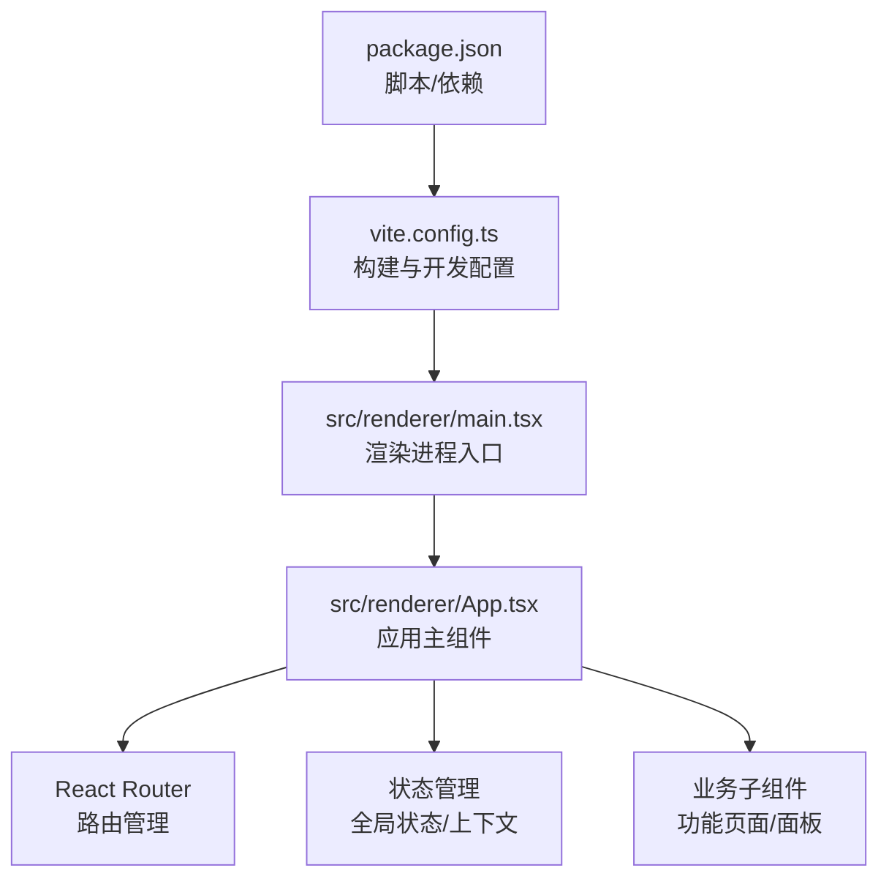
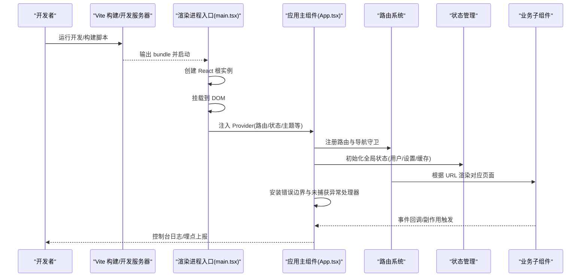
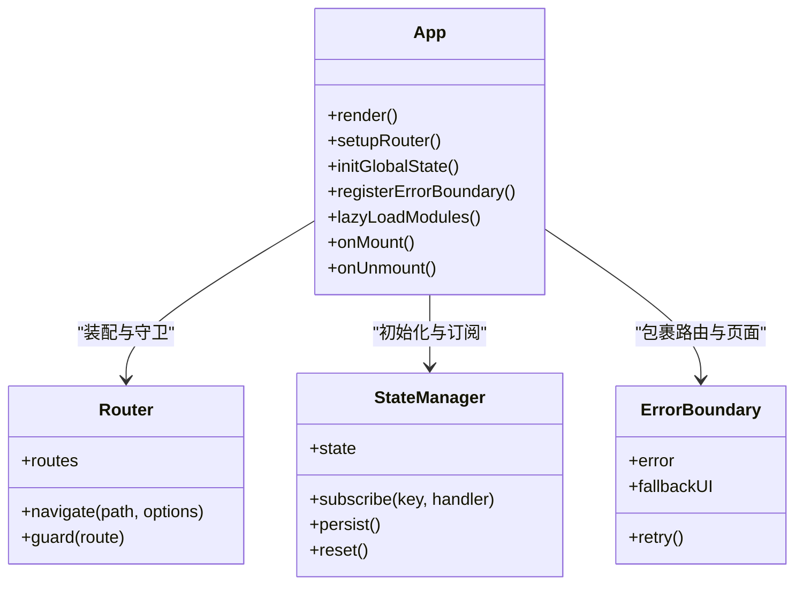
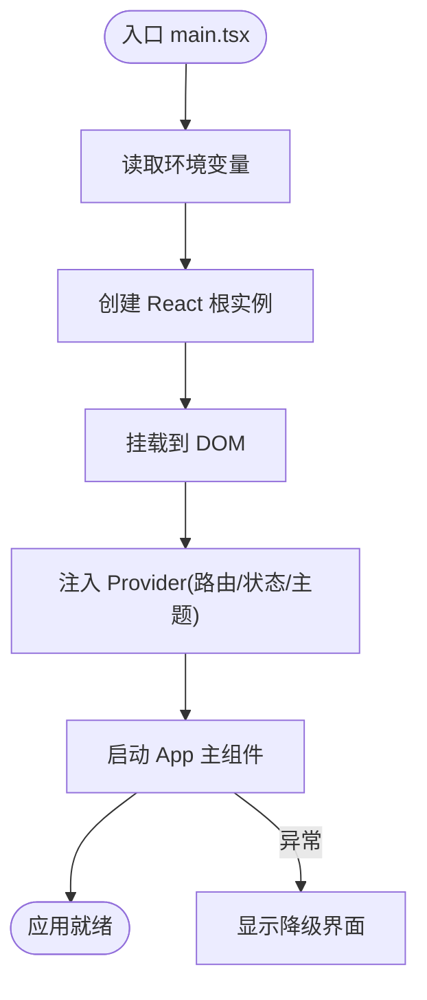
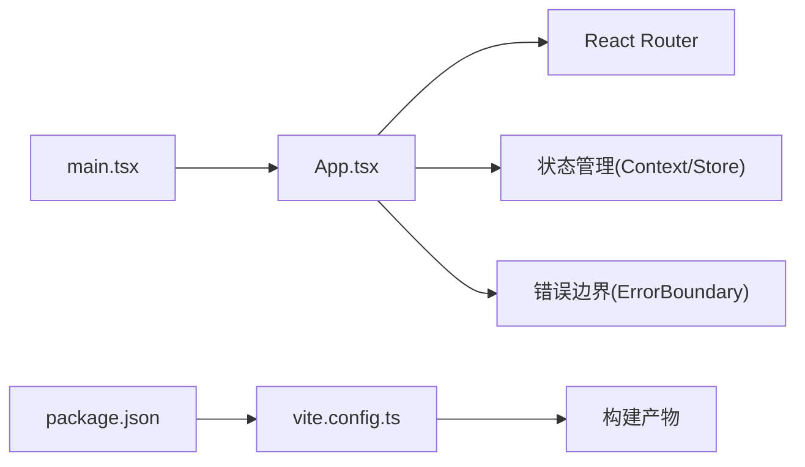

# 应用主组件

<cite>
**本文引用的文件**   
- [src/renderer/App.tsx](file://src/renderer/App.tsx)
- [src/renderer/main.tsx](file://src/renderer/main.tsx)
- [vite.config.ts](file://vite.config.ts)
- [package.json](file://package.json)
- [tsconfig.json](file://tsconfig.json)
</cite>

## 目录
1. [简介](#简介)
2. [项目结构](#项目结构)
3. [核心组件](#核心组件)
4. [架构总览](#架构总览)
5. [详细组件分析](#详细组件分析)
6. [依赖分析](#依赖分析)
7. [性能考虑](#性能考虑)
8. [故障排查指南](#故障排查指南)
9. [结论](#结论)
10. [附录](#附录)

## 简介
本文件面向“砚都跨境”应用的主组件（App）与渲染入口，系统性阐述其架构设计、路由管理、状态管理、初始化流程、模块加载策略、错误处理机制、生命周期管理、性能优化与调试技巧，并给出配置选项说明与扩展点接口。文档力求在保持技术深度的同时，让非专业读者也能理解整体设计与使用方式。

## 项目结构
本项目采用 Electron + React + Vite 的常见前端工程化方案：
- renderer 目录包含 React 应用代码，其中 App.tsx 为应用主组件，main.tsx 为渲染进程入口。
- vite.config.ts 负责构建与开发服务器配置。
- package.json 定义脚本、依赖与打包产物。
- tsconfig.json 统一 TypeScript 编译选项。

图表来源
- [package.json](file://package.json)
- [vite.config.ts](file://vite.config.ts)
- [src/renderer/main.tsx](file://src/renderer/main.tsx)
- [src/renderer/App.tsx](file://src/renderer/App.tsx)

章节来源
- [package.json](file://package.json)
- [vite.config.ts](file://vite.config.ts)
- [src/renderer/main.tsx](file://src/renderer/main.tsx)
- [src/renderer/App.tsx](file://src/renderer/App.tsx)

## 核心组件
- 应用主组件（App）：作为整个应用的根节点，负责挂载路由、提供全局上下文（如主题、语言、用户信息）、集成错误边界与日志上报、协调各业务模块的懒加载与按需初始化。
- 渲染入口（main.tsx）：创建 React 根实例，挂载到 DOM，注入必要的 Provider（如路由、状态、国际化等），并处理首次渲染异常。

章节来源
- [src/renderer/App.tsx](file://src/renderer/App.tsx)
- [src/renderer/main.tsx](file://src/renderer/main.tsx)

## 架构总览
下图展示从渲染进程启动到应用主组件装配的关键流程，包括构建配置、入口挂载、路由与状态初始化、以及错误边界的兜底处理。

图表来源
- [vite.config.ts](file://vite.config.ts)
- [src/renderer/main.tsx](file://src/renderer/main.tsx)
- [src/renderer/App.tsx](file://src/renderer/App.tsx)

## 详细组件分析

### 应用主组件（App.tsx）
职责概览
- 路由装配：集中式路由表、嵌套路由、权限校验与跳转守卫。
- 状态装配：全局状态初始化、持久化与热更新。
- 错误处理：React Error Boundary、未捕获异常捕获、降级与恢复。
- 模块加载：按路由或用户操作懒加载页面与资源，减少首屏体积。
- 生命周期：挂载时初始化服务，卸载时清理定时器与订阅。

关键实现要点
- 路由管理
  - 使用集中式路由表，便于权限控制与动态菜单生成。
  - 支持查询参数与路径参数的解析与校验。
  - 提供统一的导航方法，避免硬编码跳转。
- 状态管理
  - 通过 Context/Provider 暴露全局状态，配合持久化存储（如 localStorage/IndexedDB）。
  - 对敏感数据做脱敏与加密存储。
  - 提供状态变更监听与副作用触发机制。
- 错误处理
  - 使用 Error Boundary 捕获渲染期错误，展示友好降级界面。
  - 捕获运行时未抛出的异常，记录堆栈并上报。
  - 提供重试与回退策略，保证用户体验。
- 模块加载
  - 基于路由的懒加载，结合 Webpack/Vite 的代码分割。
  - 预取关键资源，提升交互响应速度。
  - 失败重试与离线缓存策略。
- 生命周期
  - 挂载阶段：初始化第三方 SDK、建立 WebSocket/轮询连接、读取本地配置。
  - 更新阶段：监听状态变化，增量更新视图。
  - 卸载阶段：断开连接、清除定时器、释放内存。

图表来源
- [src/renderer/App.tsx](file://src/renderer/App.tsx)

章节来源
- [src/renderer/App.tsx](file://src/renderer/App.tsx)

### 渲染入口（main.tsx）
职责概览
- 创建 React 根实例并挂载到 DOM。
- 注入必要的环境变量与全局配置。
- 处理首次渲染异常，确保应用可恢复。
- 与 Electron 主进程通信桥接（如需）。

关键实现要点
- 环境检测：区分开发与生产模式，启用调试工具。
- 全局样式与字体加载：确保首屏一致性。
- 错误边界：在最外层包裹，防止白屏。
- 性能监控：接入性能指标采集（如 LCP/FID/CLS）。

图表来源
- [src/renderer/main.tsx](file://src/renderer/main.tsx)

章节来源
- [src/renderer/main.tsx](file://src/renderer/main.tsx)

### 构建与开发配置（vite.config.ts）
职责概览
- 配置开发服务器与代理（对接后端 API）。
- 配置代码分割与懒加载策略。
- 设置别名与插件（如 TS 支持、CSS 处理、压缩等）。
- 生产构建优化（Tree Shaking、Minify、SourceMap）。

关键实现要点
- 代理规则：将 /api 等前缀转发至后端服务，解决跨域问题。
- 分包策略：按路由与公共库拆分，降低首屏体积。
- 环境变量：通过 .env 文件注入不同环境的配置。
- 插件生态：集成 ESLint、Prettier、类型检查等。

章节来源
- [vite.config.ts](file://vite.config.ts)

### 包管理与脚本（package.json）
职责概览
- 定义项目依赖与版本约束。
- 提供开发、构建、测试等脚本命令。
- 指定入口文件与输出目录。

关键实现要点
- 脚本命令：dev/build/test/lint 等常用任务。
- 依赖分类：dependencies 与 devDependencies 分离。
- 工作区：若使用 pnpm workspace，需声明子包关系。

章节来源
- [package.json](file://package.json)

### TypeScript 配置（tsconfig.json）
职责概览
- 统一编译目标、模块系统与路径映射。
- 开启严格类型检查与可选特性（如 JSX、ESNext）。
- 配置路径别名，简化导入语句。

关键实现要点
- baseUrl 与 paths：提高模块引用可读性。
- 排除目录：忽略 node_modules、dist 等。
- 联合类型：共享类型定义与接口契约。

章节来源
- [tsconfig.json](file://tsconfig.json)

## 依赖分析
- 外部依赖
  - React 与 ReactDOM：UI 框架与渲染引擎。
  - React Router：路由与导航。
  - Vite：构建与开发服务器。
  - TypeScript：类型系统与开发体验。
- 内部依赖
  - App 依赖 Router、StateManager、ErrorBoundary 等基础能力。
  - 业务子组件通过路由与状态进行解耦。

图表来源
- [src/renderer/App.tsx](file://src/renderer/App.tsx)
- [src/renderer/main.tsx](file://src/renderer/main.tsx)
- [vite.config.ts](file://vite.config.ts)
- [package.json](file://package.json)

章节来源
- [src/renderer/App.tsx](file://src/renderer/App.tsx)
- [src/renderer/main.tsx](file://src/renderer/main.tsx)
- [vite.config.ts](file://vite.config.ts)
- [package.json](file://package.json)

## 性能考虑
- 首屏优化
  - 路由级懒加载与代码分割，减少初始包体。
  - 关键 CSS/字体内联，避免阻塞渲染。
  - 预取与预加载关键资源。
- 运行时优化
  - 使用 React.memo、useMemo、useCallback 减少重渲染。
  - 列表虚拟化与分页加载，避免大 DOM 压力。
  - 防抖与节流高频事件（滚动、输入、窗口大小变化）。
- 网络优化
  - 请求合并与去重，缓存策略（ETag/Cache-Control）。
  - 失败重试与超时控制，提升稳定性。
- 监控与诊断
  - 接入性能指标采集（LCP/FID/CLS/TTFB）。
  - 错误上报与堆栈还原，定位线上问题。

[本节为通用指导，不直接分析具体文件]

## 故障排查指南
- 常见问题
  - 白屏：检查错误边界是否生效、JS 报错与资源加载失败。
  - 路由失效：确认路由表配置、权限守卫与参数校验。
  - 状态丢失：检查持久化存储读写权限与序列化兼容性。
  - 性能抖动：定位重渲染热点与长任务，优化计算与渲染。
- 调试技巧
  - 使用浏览器开发者工具的 Sources/Network/Performance 面板。
  - 开启 SourceMap 与调试断点，逐步排查。
  - 打印关键状态与事件流，辅助定位问题。
- 恢复策略
  - 提供降级页面与重试按钮，允许用户手动恢复。
  - 自动回滚到上一个稳定状态，避免数据损坏。

章节来源
- [src/renderer/App.tsx](file://src/renderer/App.tsx)
- [src/renderer/main.tsx](file://src/renderer/main.tsx)

## 结论
应用主组件（App）作为系统的中枢，承担路由、状态、错误处理与模块加载的核心职责；渲染入口（main.tsx）负责启动与装配；构建与配置（vite.config.ts、package.json、tsconfig.json）保障开发与生产的一致性。通过合理的架构设计与优化策略，可实现高可用、高性能与易维护的跨境应用。

[本节为总结性内容，不直接分析具体文件]

## 附录
- 配置选项说明
  - 环境变量：用于区分开发/测试/生产环境，注入 API 地址、密钥等。
  - 路由配置：路径、组件、权限、元信息等。
  - 状态配置：默认值、持久化键名、同步策略。
- 扩展点接口
  - 路由扩展：新增页面与权限规则。
  - 状态扩展：新增全局字段与订阅逻辑。
  - 错误处理扩展：自定义降级与上报策略。
  - 插件体系：按需加载第三方能力（如翻译、图像识别）。

[本节为补充说明，不直接分析具体文件]