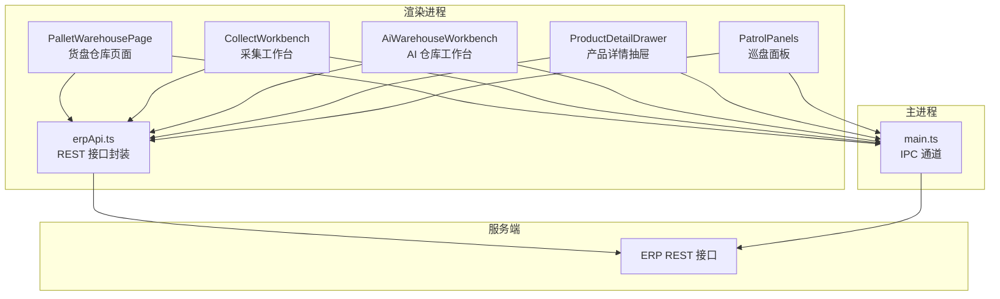
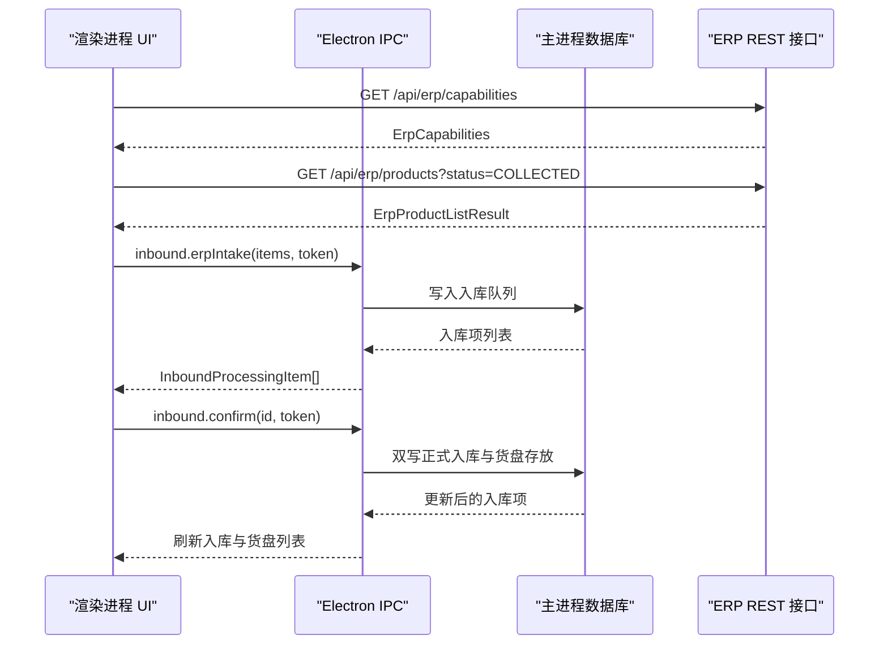
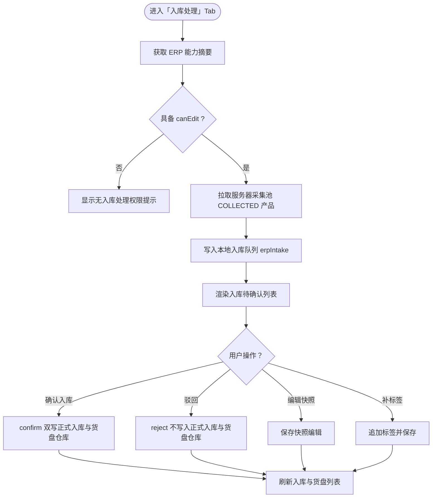
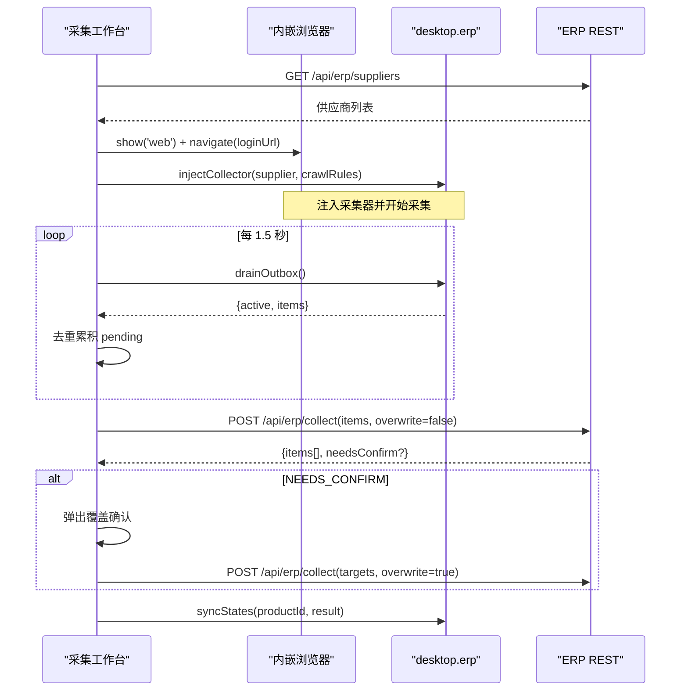
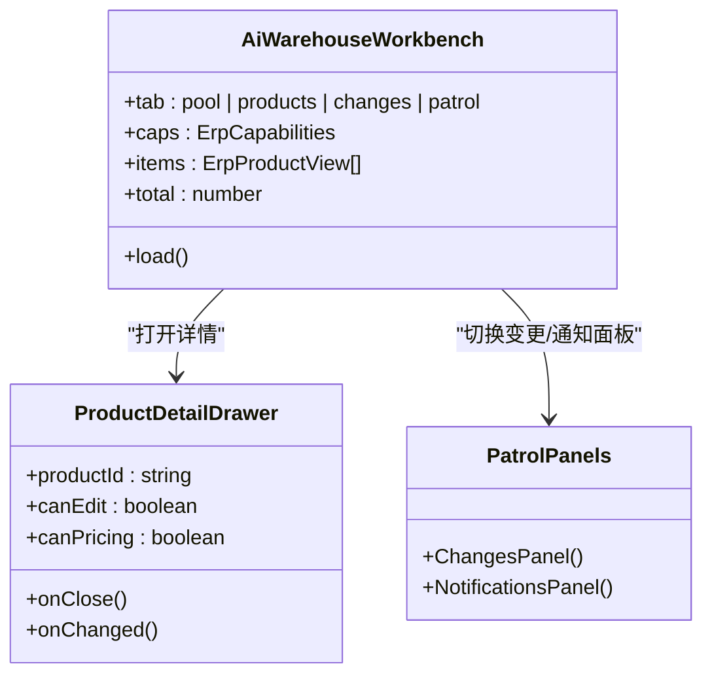
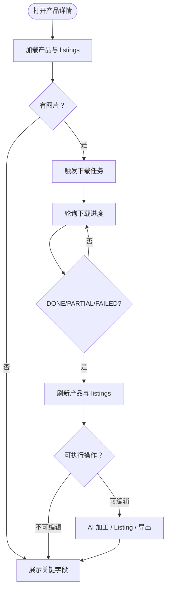
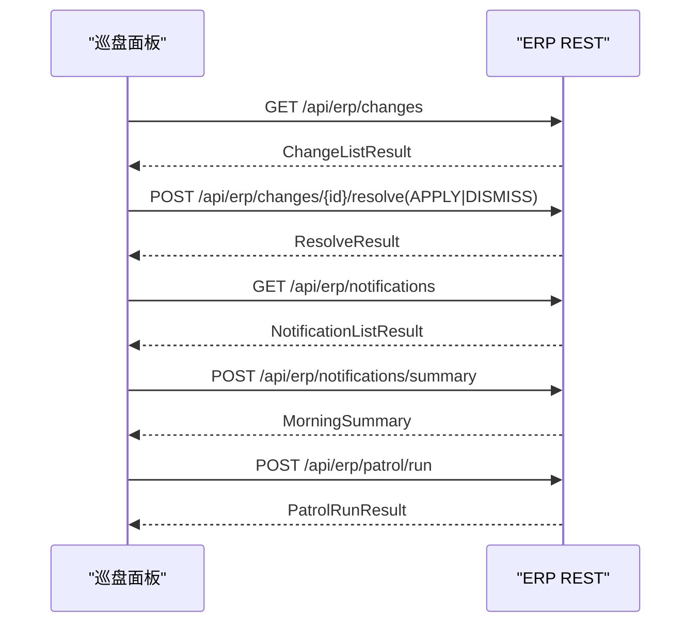
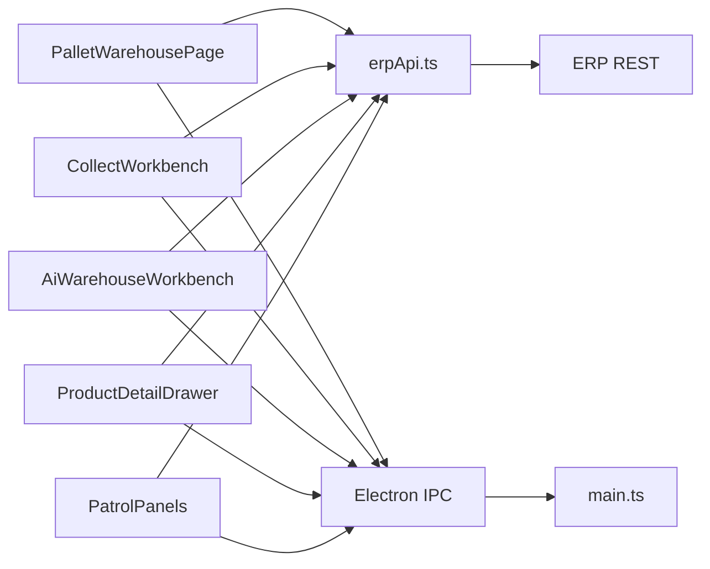

# 托盘仓库管理界面

<cite>
**本文引用的文件**   
- [PalletWarehousePage.tsx](file://src/renderer/erp/PalletWarehousePage.tsx)
- [CollectWorkbench.tsx](file://src/renderer/erp/CollectWorkbench.tsx)
- [AiWarehouseWorkbench.tsx](file://src/renderer/erp/AiWarehouseWorkbench.tsx)
- [ProductDetailDrawer.tsx](file://src/renderer/erp/ProductDetailDrawer.tsx)
- [PatrolPanels.tsx](file://src/renderer/erp/PatrolPanels.tsx)
- [erpApi.ts](file://src/renderer/erp/erpApi.ts)
- [main.ts](file://src/main/main.ts)
</cite>

## 目录
1. [引言](#引言)
2. [项目结构](#项目结构)
3. [核心组件](#核心组件)
4. [架构总览](#架构总览)
5. [详细组件分析](#详细组件分析)
6. [依赖关系分析](#依赖关系分析)
7. [性能与可用性](#性能与可用性)
8. [故障排查指南](#故障排查指南)
9. [结论](#结论)

## 引言
本文件聚焦“托盘仓库管理界面”，即货盘仓库与 ERP 采集、入库处理、产品库、巡盘变更与通知等渲染层能力。该界面由多个 React 组件组成，分别承担：
- 货盘仓库主页面：顶部 Tab、左侧目录树、右侧商品列表与入库处理队列；
- 采集工作台：选择货盘、注入采集器、轮询待采条目、确认入库并处理覆盖确认；
- AI 仓库工作台：采集池、产品库、待确认变更、通知中心；
- 产品详情抽屉：图集下载、AI 加工、多平台 listing、导出；
- 巡盘面板：变更 diff 确认与通知中心操作；
- API 封装：统一 REST 接口类型与调用。

这些组件通过 Electron IPC 与后端 REST 服务协作，形成从“采集 → 入库处理 → 正式入库 → 产品库 → 巡盘变更 → 通知”的完整链路。

## 项目结构
托盘仓库相关代码集中在渲染进程 `src/renderer/erp` 下，按功能拆分为页面、工作台、抽屉与公共 API：
- 页面级：`PalletWarehousePage.tsx`
- 工作台级：`CollectWorkbench.tsx`、`AiWarehouseWorkbench.tsx`
- 详情与面板：`ProductDetailDrawer.tsx`、`PatrolPanels.tsx`
- 接口契约：`erpApi.ts`
- 主进程桥接：`src/main/main.ts`（IPC 暴露 `pallet`、`inbound`、`erp` 等通道）

**图表来源**
- [PalletWarehousePage.tsx:1-363](file://src/renderer/erp/PalletWarehousePage.tsx#L1-L363)
- [CollectWorkbench.tsx:1-245](file://src/renderer/erp/CollectWorkbench.tsx#L1-L245)
- [AiWarehouseWorkbench.tsx:1-195](file://src/renderer/erp/AiWarehouseWorkbench.tsx#L1-L195)
- [ProductDetailDrawer.tsx:1-486](file://src/renderer/erp/ProductDetailDrawer.tsx#L1-L486)
- [PatrolPanels.tsx:1-219](file://src/renderer/erp/PatrolPanels.tsx#L1-L219)
- [erpApi.ts:1-511](file://src/renderer/erp/erpApi.ts#L1-L511)
- [main.ts:2574-2598](file://src/main/main.ts#L2574-L2598)

**章节来源**
- [PalletWarehousePage.tsx:1-363](file://src/renderer/erp/PalletWarehousePage.tsx#L1-L363)
- [CollectWorkbench.tsx:1-245](file://src/renderer/erp/CollectWorkbench.tsx#L1-L245)
- [AiWarehouseWorkbench.tsx:1-195](file://src/renderer/erp/AiWarehouseWorkbench.tsx#L1-L195)
- [ProductDetailDrawer.tsx:1-486](file://src/renderer/erp/ProductDetailDrawer.tsx#L1-L486)
- [PatrolPanels.tsx:1-219](file://src/renderer/erp/PatrolPanels.tsx#L1-L219)
- [erpApi.ts:1-511](file://src/renderer/erp/erpApi.ts#L1-L511)
- [main.ts:2574-2598](file://src/main/main.ts#L2574-L2598)

## 核心组件
- 货盘仓库页面：提供“入库处理 / 全部产品 / 新品速递”等 Tab，左侧目录树筛选，右侧商品卡片与批量操作；入库处理支持编辑快照、补标签、确认入库、驳回与退回。
- 采集工作台：加载货盘供应商，打开内嵌浏览器并注入采集器，轮询 outbox 累积待采条目，提交去重三态结果，必要时弹出覆盖确认。
- AI 仓库工作台：聚合采集池、产品库、待确认变更、通知中心四个视图，支持分页搜索与权限门控。
- 产品详情抽屉：展示图片、变体、关键字段；触发原图下载任务、标记已发布、AI 图生图与标题生成、多平台 listing 生成与导出。
- 巡盘面板：变更 diff 列表与采纳/忽略操作；通知中心支持未读过滤、全部已读、早间汇总与手动巡盘。
- API 封装：定义供应商、产品、下载任务、AI 加工、定价 listing、巡盘变更与通知等类型与函数。

**章节来源**
- [PalletWarehousePage.tsx:1-363](file://src/renderer/erp/PalletWarehousePage.tsx#L1-L363)
- [CollectWorkbench.tsx:1-245](file://src/renderer/erp/CollectWorkbench.tsx#L1-L245)
- [AiWarehouseWorkbench.tsx:1-195](file://src/renderer/erp/AiWarehouseWorkbench.tsx#L1-L195)
- [ProductDetailDrawer.tsx:1-486](file://src/renderer/erp/ProductDetailDrawer.tsx#L1-L486)
- [PatrolPanels.tsx:1-219](file://src/renderer/erp/PatrolPanels.tsx#L1-L219)
- [erpApi.ts:1-511](file://src/renderer/erp/erpApi.ts#L1-L511)

## 架构总览
托盘仓库界面的数据流分为两条主线：
- 本地货盘与入库队列：渲染进程通过 `window.desktop.pallet` 与 `window.desktop.inbound` 与主进程交互，主进程再访问数据库；
- ERP 产品与服务端能力：渲染进程通过 `erpApi.ts` 调用 `/api/erp/*`，主进程也暴露 `window.desktop.erp.*` 用于采集器注入与 outbox 回收。

**图表来源**
- [PalletWarehousePage.tsx:73-111](file://src/renderer/erp/PalletWarehousePage.tsx#L73-L111)
- [PalletWarehousePage.tsx:140-155](file://src/renderer/erp/PalletWarehousePage.tsx#L140-L155)
- [erpApi.ts:143-167](file://src/renderer/erp/erpApi.ts#L143-L167)
- [main.ts:2591-2598](file://src/main/main.ts#L2591-L2598)

## 详细组件分析

### 货盘仓库页面（PalletWarehousePage）
该页面是托盘仓库的核心入口，负责：
- 顶部 9 个业务 Tab，其中“入库处理 / 全部产品 / 新品速递”已接入数据源；
- 左侧目录树：一级/二级类目与三级图标分类，支持计数与展开收起；
- 右侧商品区：支持关键词搜索、批次与状态筛选、批量删除；
- 入库处理：同步服务器采集池 COLLECTED 快照到本地队列，支持编辑快照、补标签、确认入库、驳回与退回。

关键流程如下：

**图表来源**
- [PalletWarehousePage.tsx:73-111](file://src/renderer/erp/PalletWarehousePage.tsx#L73-L111)
- [PalletWarehousePage.tsx:127-155](file://src/renderer/erp/PalletWarehousePage.tsx#L127-L155)

**章节来源**
- [PalletWarehousePage.tsx:1-363](file://src/renderer/erp/PalletWarehousePage.tsx#L1-L363)

### 采集工作台（CollectWorkbench）
采集工作台负责将选品或巡盘产生的原始产品纳入 ERP 产品库，核心行为包括：
- 加载货盘供应商列表；
- 打开内嵌浏览器并注入采集器；
- 每 1.5 秒轮询 outbox，按 sourceProductId 去重累积待采条目；
- 提交采集入库，处理 CREATED/OVERWRITTEN/CHANGE_FLAGGED/NEEDS_CONFIRM/UNCHANGED 五类结果；
- NEEDS_CONFIRM 时弹出覆盖确认弹窗，确认后再次提交。

**图表来源**
- [CollectWorkbench.tsx:53-110](file://src/renderer/erp/CollectWorkbench.tsx#L53-L110)
- [CollectWorkbench.tsx:120-155](file://src/renderer/erp/CollectWorkbench.tsx#L120-L155)
- [erpApi.ts:147-167](file://src/renderer/erp/erpApi.ts#L147-L167)

**章节来源**
- [CollectWorkbench.tsx:1-245](file://src/renderer/erp/CollectWorkbench.tsx#L1-L245)
- [erpApi.ts:147-167](file://src/renderer/erp/erpApi.ts#L147-L167)

### AI 仓库工作台（AiWarehouseWorkbench）
AI 仓库工作台聚合四类视图：
- 采集池：仅展示 status=COLLECTED 的产品；
- 产品库：展示全部产品；
- 待确认变更：跳转 ChangesPanel；
- 通知中心：跳转 NotificationsPanel。

它通过 `fetchErpProducts` 分页加载，并根据角色能力控制是否显示“进入采集工作台”按钮与敏感字段列。

**图表来源**
- [AiWarehouseWorkbench.tsx:29-195](file://src/renderer/erp/AiWarehouseWorkbench.tsx#L29-L195)
- [ProductDetailDrawer.tsx:39-48](file://src/renderer/erp/ProductDetailDrawer.tsx#L39-L48)
- [PatrolPanels.tsx:44-125](file://src/renderer/erp/PatrolPanels.tsx#L44-L125)

**章节来源**
- [AiWarehouseWorkbench.tsx:1-195](file://src/renderer/erp/AiWarehouseWorkbench.tsx#L1-L195)

### 产品详情抽屉（ProductDetailDrawer）
产品详情抽屉承担产品维度的深度操作：
- 图集下载：非阻塞入队，轮询下载任务进度，失败记录 failedUrls；
- 标记已发布：READY→PUBLISHED；
- AI 加工：以原图为参考图生成候选图，生成三风格标题，人工定稿与选用标题；
- 多平台 listing：生成 eBay/Amazon/Ozon 版本，支持手改价保护与参考价重算；
- 导出包：JSON 导出完整性校验。

**图表来源**
- [ProductDetailDrawer.tsx:69-112](file://src/renderer/erp/ProductDetailDrawer.tsx#L69-L112)
- [ProductDetailDrawer.tsx:128-191](file://src/renderer/erp/ProductDetailDrawer.tsx#L128-L191)
- [ProductDetailDrawer.tsx:200-270](file://src/renderer/erp/ProductDetailDrawer.tsx#L200-L270)

**章节来源**
- [ProductDetailDrawer.tsx:1-486](file://src/renderer/erp/ProductDetailDrawer.tsx#L1-L486)

### 巡盘面板（PatrolPanels）
巡盘面板包含两个子模块：
- ChangesPanel：展示 change_flag=1 的产品变更 diff，支持 APPLY/DISMISS；
- NotificationsPanel：展示 PATROL_CHANGE/PATROL_URGENT/MORNING_SUMMARY 通知，支持未读过滤、全部已读、早间汇总与手动巡盘。

**图表来源**
- [PatrolPanels.tsx:44-125](file://src/renderer/erp/PatrolPanels.tsx#L44-L125)
- [PatrolPanels.tsx:127-219](file://src/renderer/erp/PatrolPanels.tsx#L127-L219)
- [erpApi.ts:474-510](file://src/renderer/erp/erpApi.ts#L474-L510)

**章节来源**
- [PatrolPanels.tsx:1-219](file://src/renderer/erp/PatrolPanels.tsx#L1-L219)
- [erpApi.ts:474-510](file://src/renderer/erp/erpApi.ts#L474-L510)

## 依赖关系分析
- 渲染组件依赖 `erpApi.ts` 提供的 REST 类型与函数；
- 货盘仓库与采集工作台还依赖 Electron IPC：`window.desktop.pallet`、`window.desktop.inbound`、`window.desktop.erp`；
- 主进程在 `main.ts` 中暴露 `pallet:list/remove`、`inbound:list/erpIntake/reedit/confirm/reject/return` 等 IPC 通道；
- 所有 REST 请求经 `serverApi.apiFetch` 自动携带 JWT，并在 401 时刷新会话重试。

**图表来源**
- [PalletWarehousePage.tsx:67-159](file://src/renderer/erp/PalletWarehousePage.tsx#L67-L159)
- [CollectWorkbench.tsx:78-125](file://src/renderer/erp/CollectWorkbench.tsx#L78-L125)
- [erpApi.ts:143-167](file://src/renderer/erp/erpApi.ts#L143-L167)
- [main.ts:2591-2598](file://src/main/main.ts#L2591-L2598)

**章节来源**
- [PalletWarehousePage.tsx:67-159](file://src/renderer/erp/PalletWarehousePage.tsx#L67-L159)
- [CollectWorkbench.tsx:78-125](file://src/renderer/erp/CollectWorkbench.tsx#L78-L125)
- [erpApi.ts:143-167](file://src/renderer/erp/erpApi.ts#L143-L167)
- [main.ts:2591-2598](file://src/main/main.ts#L2591-L2598)

## 性能与可用性
- 搜索防抖：AI 仓库工作台对关键词输入做 300ms 防抖，避免每次按键都发起请求；
- 分页加载：产品列表默认 pageSize=100，减少单次响应体积；
- 惰性加载：货盘仓库仅在进入“入库处理”时才拉取 ERP 能力摘要与采集池快照；
- 轮询优化：采集工作台每 1.5 秒轮询 outbox，产品详情下载任务每 800 秒轮询任务进度；
- 权限门控：根据 ErpCapabilities 控制敏感字段与操作按钮，降低无效渲染与误操作风险。

[本节为通用指导，不直接分析具体文件]

## 故障排查指南
- 入库处理权限缺失：若 ErpCapabilities.canEdit 为 false，页面会显示“无入库处理权限”，需管理员开通 erp.warehouse.edit；
- 入库同步失败：当 fetchErpProducts 或 inbound.erpIntake 失败时，页面会显示错误横幅并尝试重新加载队列；
- 采集启动失败：若货盘未配置 crawl_rules.domains 或 loginUrl，采集工作台会报错提示；
- 下载任务失败：ProductDetailDrawer 会展示 failedUrls 对应图片序号，便于定位裂图；
- 会话过期：主进程在特定错误码下抛出 SERVER_SESSION_EXPIRED，渲染层应刷新并重试一次。

**章节来源**
- [PalletWarehousePage.tsx:73-111](file://src/renderer/erp/PalletWarehousePage.tsx#L73-L111)
- [CollectWorkbench.tsx:67-89](file://src/renderer/erp/CollectWorkbench.tsx#L67-L89)
- [ProductDetailDrawer.tsx:101-112](file://src/renderer/erp/ProductDetailDrawer.tsx#L101-L112)
- [main.ts:2574-2583](file://src/main/main.ts#L2574-L2583)

## 结论
托盘仓库管理界面通过清晰的组件分层与职责划分，实现了从采集、入库处理、产品库到巡盘变更与通知的完整闭环。渲染层注重用户体验与权限控制，主进程桥接本地数据与外部服务，API 层则统一了类型与调用方式。未来可在以下方面继续优化：
- 扩展更多 Tab 的数据源接入；
- 增强批量操作的并发与回滚能力；
- 完善错误恢复与重试策略；
- 提升大图下载与 AI 加工的进度可视化。

[本节为总结性内容，不直接分析具体文件]